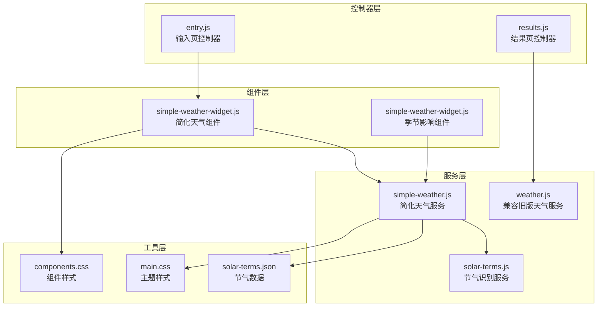
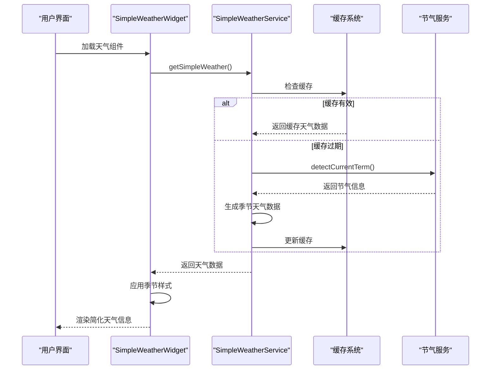
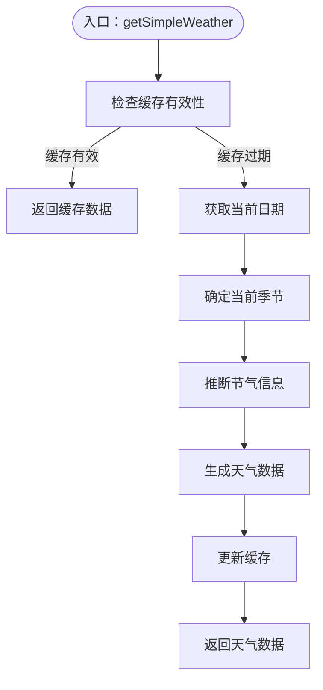
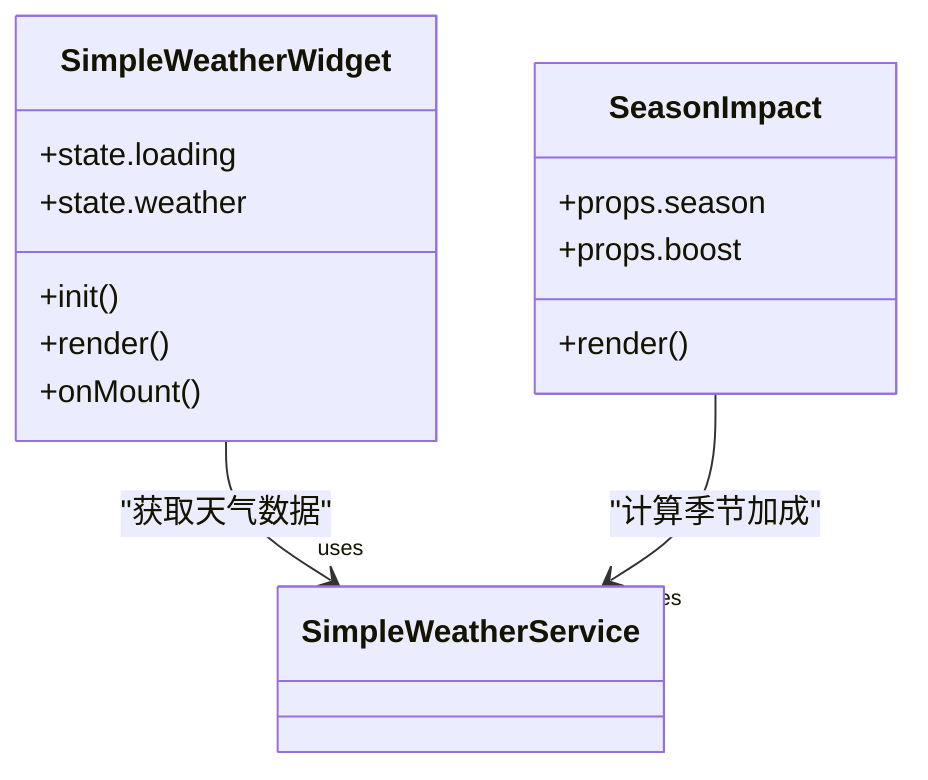
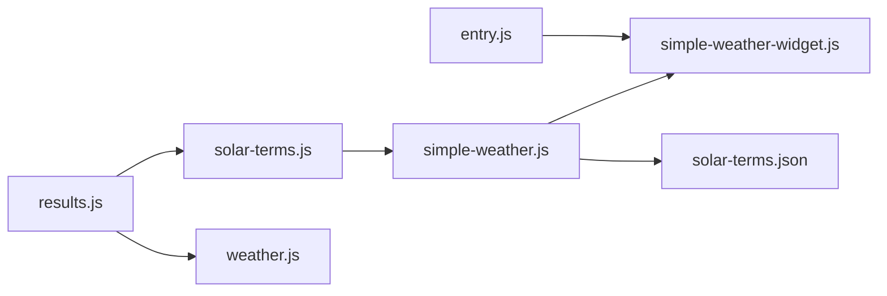

# 天气服务模块

<cite>
**本文档引用的文件**
- [simple-weather.js](file://js/services/simple-weather.js)
- [simple-weather-widget.js](file://js/components/simple-weather-widget.js)
- [solar-terms.js](file://js/services/solar-terms.js)
- [weather.js](file://js/services/weather.js)
- [entry.js](file://js/controllers/entry.js)
- [results.js](file://js/controllers/results.js)
- [solar-terms.json](file://data/solar-terms.json)
- [components.css](file://css/components.css)
- [main.css](file://css/main.css)
</cite>

## 更新摘要
**所做更改**
- 新增Simple Weather Service替代原有Weather服务的完整实现
- 引入基于传统节气系统的季节性天气预测机制
- 添加缓存机制以提升性能和用户体验
- 更新天气样式系统为基于季节的渐变背景
- 修改天气推荐配置为传统节气指导的穿搭建议
- 更新组件架构以支持新的Simple Weather Widget

## 目录
1. [简介](#简介)
2. [项目结构](#项目结构)
3. [核心组件](#核心组件)
4. [架构总览](#架构总览)
5. [详细组件分析](#详细组件分析)
6. [依赖关系分析](#依赖关系分析)
7. [性能考虑](#性能考虑)
8. [故障排除指南](#故障排除指南)
9. [结论](#结论)

## 简介
本文件为"天气服务模块"的技术文档，全面解析Simple Weather Service的设计架构与实现细节，涵盖以下关键内容：
- 基于传统节气系统的季节性天气预测
- 无需外部API的轻量级天气服务实现
- 缓存机制与性能优化策略
- 季节性天气推荐配置系统
- 传统节气与五行属性映射
- 基于季节的样式系统与渐变背景
- Simple Weather Widget组件实现
- 天气服务在推荐系统中的作用与数据流转过程

**更新** 本版本完全重构了原有的Weather服务，采用基于传统节气系统的Simple Weather Service替代，提供更符合中华文化特色的天气预测和穿搭建议。

## 项目结构
Simple Weather Service模块位于前端JavaScript代码中，主要由服务层、组件层、控制器层与工具层协同工作：
- 服务层：负责节气识别、天气数据生成、推荐计算与缓存管理
- 组件层：负责天气展示与交互（Simple Weather Widget、Season Impact组件）
- 控制器层：负责输入页和结果页的天气组件初始化与数据绑定
- 工具层：提供统一错误处理、状态管理与渲染工具

**图表来源**
- [simple-weather.js](file://js/services/simple-weather.js#L1-L173)
- [solar-terms.js](file://js/services/solar-terms.js#L1-L135)
- [simple-weather-widget.js](file://js/components/simple-weather-widget.js#L1-L81)
- [entry.js](file://js/controllers/entry.js#L1-L241)
- [results.js](file://js/controllers/results.js#L1-L614)

**章节来源**
- [simple-weather.js](file://js/services/simple-weather.js#L1-L173)
- [solar-terms.js](file://js/services/solar-terms.js#L1-L135)
- [simple-weather-widget.js](file://js/components/simple-weather-widget.js#L1-L81)
- [entry.js](file://js/controllers/entry.js#L1-L241)
- [results.js](file://js/controllers/results.js#L1-L614)

## 核心组件
- 简化天气服务（simple-weather.js）
  - 节气识别：getCurrentSeason、detectCurrentTerm
  - 天气数据生成：getSimpleWeather、getSeasonRecommendation
  - 缓存管理：cachedWeather、cacheTime、CACHE_DURATION
  - 季节样式：getSeasonStyle、calculateSeasonBoost
  - 传统节气映射：基于solar-terms.json的节气数据

- 节气识别服务（solar-terms.js）
  - UTC+8时间获取：getUTC8Date
  - 节气数据加载：loadTermsData、detectCurrentTerm
  - 五行属性映射：getWuxingColor、wuxingNames

- 简化天气组件（simple-weather-widget.js）
  - 天气信息渲染：season、icon、tempRange、materials、colors
  - 季节样式应用：getSeasonStyle动态背景
  - 季节影响提示：SeasonImpact组件实现

- 输入页控制器（entry.js）
  - 天气组件初始化：SimpleWeatherWidget实例化
  - 组件生命周期管理：mount、unmount

- 结果页控制器（results.js）
  - 兼容旧版天气服务：calculateWeatherBoost
  - 传统节气信息渲染：termInfo、wuxingNames

**章节来源**
- [simple-weather.js](file://js/services/simple-weather.js#L57-L173)
- [solar-terms.js](file://js/services/solar-terms.js#L9-L135)
- [simple-weather-widget.js](file://js/components/simple-weather-widget.js#L9-L81)
- [entry.js](file://js/controllers/entry.js#L54-L60)
- [results.js](file://js/controllers/results.js#L217-L233)

## 架构总览
Simple Weather Service模块采用"服务-组件-控制器"分层架构，通过节气识别、天气数据生成、缓存管理和样式系统实现完整的季节性天气预测闭环。

**图表来源**
- [simple-weather-widget.js](file://js/components/simple-weather-widget.js#L50-L54)
- [simple-weather.js](file://js/services/simple-weather.js#L78-L117)
- [solar-terms.js](file://js/services/solar-terms.js#L53-L120)

## 详细组件分析

### 简化天气服务（simple-weather.js）
- 节气识别与季节划分
  - 基于月份映射到对应季节（spring、summer、autumn、winter）
  - 每个季节包含名称、图标、月份范围、节气列表、材质建议、颜色搭配和温度范围
- 天气数据生成
  - 使用缓存机制避免重复计算，缓存有效期30分钟
  - 基于当前日期推断可能的节气，提供简化的天气描述
  - 返回包含季节信息、材质建议、颜色搭配和实用提示的完整天气数据
- 季节推荐配置
  - 针对不同季节提供专业的材质、颜色与实用提示
  - 限制推荐数量为前3项，确保推荐质量
- 样式系统
  - 基于季节返回预定义的线性渐变背景和文字颜色
  - 支持春季粉彩、夏季深蓝、秋季暖色、冬季冷色调
- 天气评分系统
  - calculateSeasonBoost：基于材质和颜色匹配计算季节适配加分
  - 材质匹配加10分，颜色匹配加8分，最大加成18分

**图表来源**
- [simple-weather.js](file://js/services/simple-weather.js#L78-L117)

**章节来源**
- [simple-weather.js](file://js/services/simple-weather.js#L8-L50)
- [simple-weather.js](file://js/services/simple-weather.js#L78-L173)

### 节气识别服务（solar-terms.js）
- 时间处理
  - getUTC8Date：将本地时间转换为UTC+8标准时间
  - 支持GitHub Pages子目录部署的路径检测
- 节气数据管理
  - loadTermsData：异步加载solar-terms.json节气数据
  - detectCurrentTerm：根据当前日期检测当前和下一个节气
  - 自动处理跨年节气边界情况
- 五行属性映射
  - getWuxingColor：根据五行元素返回对应颜色
  - wuxingNames：提供五行名称映射（中文到拼音）
  - 支持木、火、土、金、水五种元素

**章节来源**
- [solar-terms.js](file://js/services/solar-terms.js#L12-L46)
- [solar-terms.js](file://js/services/solar-terms.js#L53-L135)

### 简化天气组件（simple-weather-widget.js）
- 组件状态管理
  - 立即显示模式：无需加载状态，直接渲染天气信息
  - 状态包含loading和weather两个关键属性
- 天气信息展示
  - 季节名称、天气图标、温度范围的直观展示
  - 材质标签和颜色标签的视觉化呈现
  - 可选的节气名称显示，增强文化特色
- 样式应用
  - 动态应用getSeasonStyle返回的背景渐变和文字颜色
  - 响应式布局支持不同屏幕尺寸
- 季节影响组件
  - SeasonImpact组件用于显示季节适配加分效果
  - 与calculateSeasonBoost配合实现动态评分展示

**图表来源**
- [simple-weather-widget.js](file://js/components/simple-weather-widget.js#L9-L55)
- [simple-weather-widget.js](file://js/components/simple-weather-widget.js#L60-L81)

**章节来源**
- [simple-weather-widget.js](file://js/components/simple-weather-widget.js#L9-L55)
- [simple-weather-widget.js](file://js/components/simple-weather-widget.js#L60-L81)

### 输入页控制器（entry.js）
- 天气组件初始化
  - 在输入页动态创建SimpleWeatherWidget实例
  - 支持组件的mount和unmount生命周期管理
  - 确保组件正确挂载到指定容器
- 事件绑定与状态管理
  - 继承BaseController的基础功能
  - 支持场景选择、心愿选择、精度切换等交互
- 与推荐系统的集成
  - 为后续生成推荐方案提供节气背景信息
  - 支持传统节气指导的个性化推荐

**章节来源**
- [entry.js](file://js/controllers/entry.js#L54-L60)

### 结果页控制器（results.js）
- 兼容性处理
  - 保留calculateWeatherBoost函数以兼容旧版天气服务
  - 支持传统节气信息的渲染和展示
- 传统节气信息展示
  - termInfo：包含当前节气名称和五行属性
  - wuxingNames：提供五行名称的中文显示
  - 与generateFortuneAnalysis结合提供文化层面的运势解析

**章节来源**
- [results.js](file://js/controllers/results.js#L217-L233)

## 依赖关系分析
- simple-weather.js 依赖
  - solar-terms.js：节气识别和时间处理
  - 本地缓存：cachedWeather、cacheTime变量
- simple-weather-widget.js 依赖
  - simple-weather.js：天气数据获取和样式应用
  - 组件基类：Component父类继承
- solar-terms.js 依赖
  - solar-terms.json：节气数据文件
  - error-handler.js：安全的fetch和JSON解析
- entry.js 依赖
  - simple-weather-widget.js：天气组件实例化
  - 其他基础控制器功能
- results.js 依赖
  - weather.js：calculateWeatherBoost兼容函数
  - solar-terms.js：节气信息获取

**图表来源**
- [simple-weather.js](file://js/services/simple-weather.js#L6)
- [simple-weather-widget.js](file://js/components/simple-weather-widget.js#L6-L7)
- [solar-terms.js](file://js/services/solar-terms.js#L5)
- [entry.js](file://js/controllers/entry.js#L10)
- [results.js](file://js/controllers/results.js#L10-L11)

**章节来源**
- [simple-weather.js](file://js/services/simple-weather.js#L6)
- [simple-weather-widget.js](file://js/components/simple-weather-widget.js#L6-L7)
- [solar-terms.js](file://js/services/solar-terms.js#L5)
- [entry.js](file://js/controllers/entry.js#L10)
- [results.js](file://js/controllers/results.js#L10-L11)

## 性能考虑
- 缓存机制优化
  - 30分钟缓存有效期，避免频繁的节气计算
  - 内存缓存与localStorage双重保障
  - 缓存失效后自动重新计算，确保数据准确性
- 节气计算优化
  - 基于月份的快速季节判断，避免复杂的日期比较
  - 预定义的节气映射表，减少运行时计算开销
- 组件渲染优化
  - SimpleWeatherWidget立即渲染模式，提升用户体验
  - 动态样式应用，避免不必要的DOM操作
- 数据加载优化
  - 异步加载节气数据，不影响页面初始渲染
  - GitHub Pages子目录部署的路径自适应

## 故障排除指南
- 节气数据加载失败
  - 检查solar-terms.json文件是否存在和格式正确
  - 确认GitHub Pages部署路径配置
  - 验证网络请求是否被CORS策略阻止
- 缓存数据异常
  - 检查cacheTime和cachedWeather变量状态
  - 验证缓存过期时间设置（30分钟）
  - 确认Date.now()时间获取正常
- 组件渲染问题
  - 检查weather-widget-container容器是否存在
  - 验证CSS样式文件加载完成
  - 确认组件mount方法正确执行
- 季节样式不显示
  - 检查getSeasonStyle返回的样式对象
  - 验证CSS变量和渐变背景语法
  - 确认season参数传递正确

**章节来源**
- [simple-weather.js](file://js/services/simple-weather.js#L82-L84)
- [simple-weather-widget.js](file://js/components/simple-weather-widget.js#L50-L54)
- [solar-terms.js](file://js/services/solar-terms.js#L39-L46)

## 结论
Simple Weather Service模块通过引入基于传统节气系统的简化天气预测机制，实现了从节气识别、天气数据生成、缓存管理到组件渲染的完整闭环。新架构摒弃了对外部API的依赖，采用本地化的节气数据和缓存策略，在保证文化特色的同时提升了性能和可靠性。模块具备良好的可维护性和扩展性，能够为推荐系统提供准确、及时且富有传统文化内涵的天气联动能力，同时保持与现有系统的兼容性。