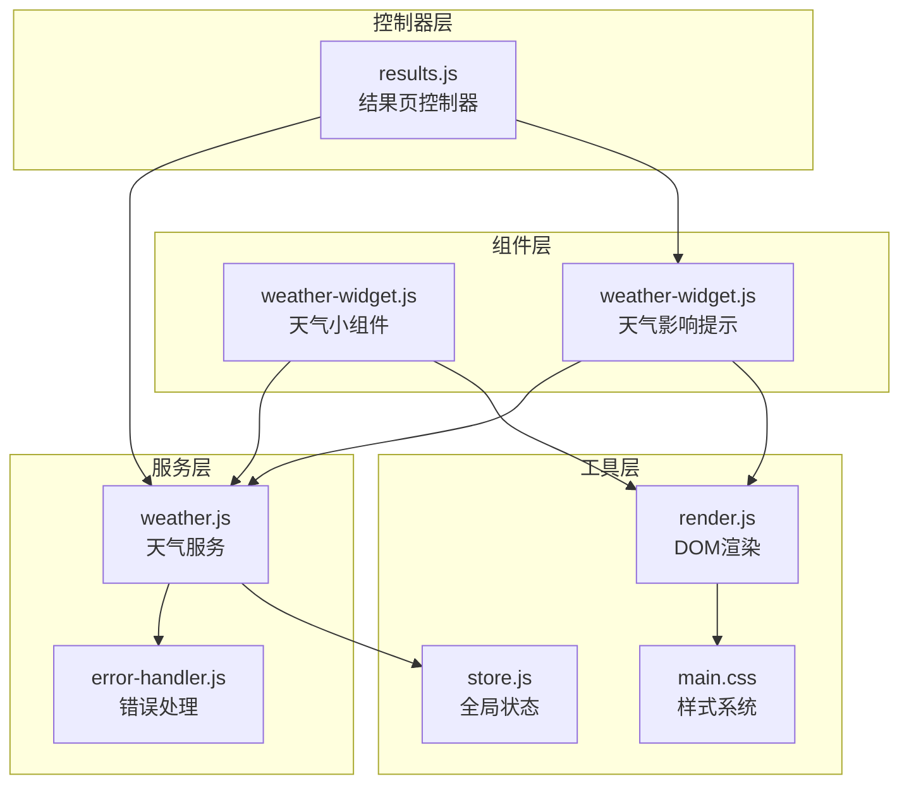
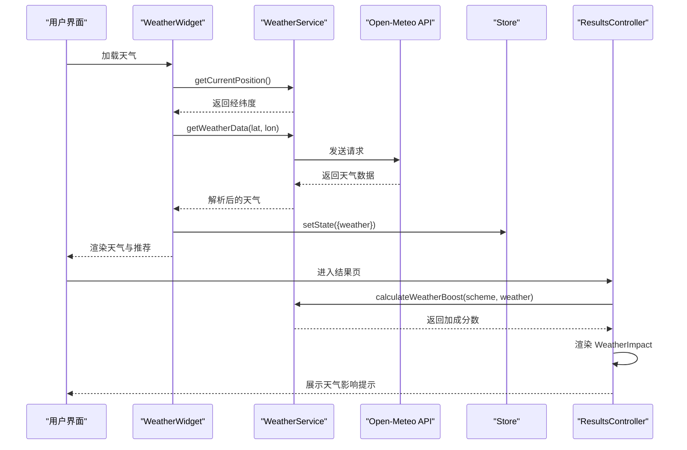
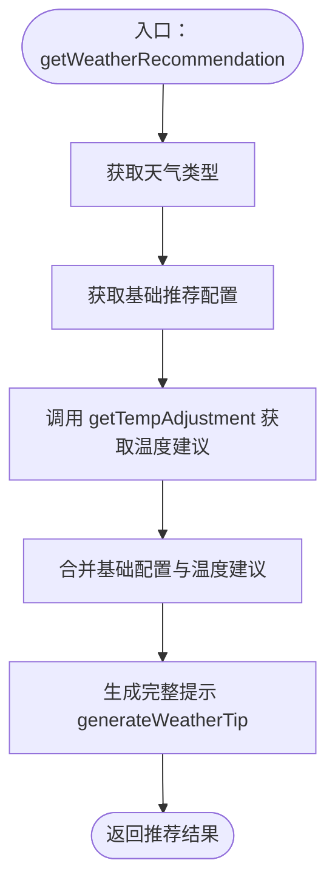
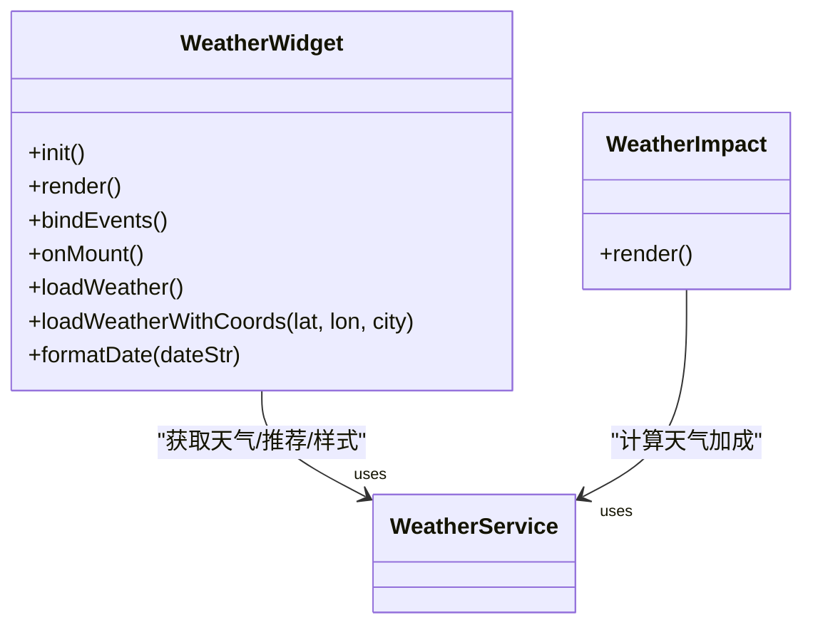
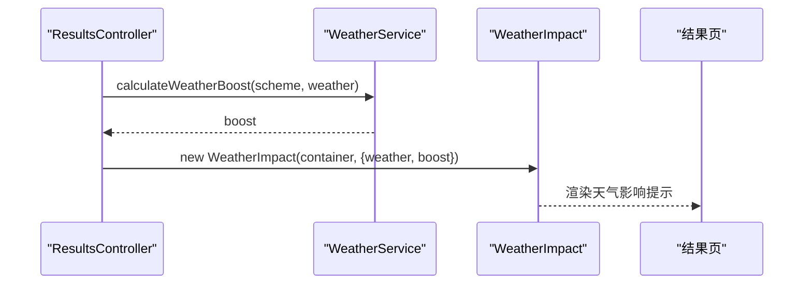
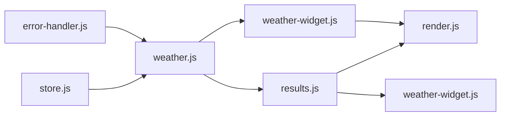

# 天气服务模块

<cite>
**本文档引用的文件**
- [weather.js](file://js/services/weather.js)
- [weather-widget.js](file://js/components/weather-widget.js)
- [error-handler.js](file://js/core/error-handler.js)
- [store.js](file://js/core/store.js)
- [results.js](file://js/controllers/results.js)
- [render.js](file://js/utils/render.js)
- [schemes.json](file://data/schemes.json)
- [main.css](file://css/main.css)
</cite>

## 目录
1. [简介](#简介)
2. [项目结构](#项目结构)
3. [核心组件](#核心组件)
4. [架构总览](#架构总览)
5. [详细组件分析](#详细组件分析)
6. [依赖关系分析](#依赖关系分析)
7. [性能考虑](#性能考虑)
8. [故障排除指南](#故障排除指南)
9. [结论](#结论)

## 简介
本文件为“天气服务模块”的技术文档，全面解析 Weather 模块的设计架构与实现细节，涵盖以下关键内容：
- 地理位置获取与 Open-Meteo 天气 API 集成
- 天气数据解析与结构化输出
- 天气代码映射系统（晴天、雨天、雪天等）与 emoji 图标映射
- 五行属性映射与天气样式系统
- 天气推荐配置系统（材质、颜色、实用提示）
- 温度调整算法（动态穿搭建议）
- 天气服务在推荐系统中的作用与数据流转过程
- 错误处理策略与用户体验保障

## 项目结构
Weather 模块位于前端 JavaScript 代码中，主要由服务层、组件层、控制器层与工具层协同工作：
- 服务层：负责与 Open-Meteo API 交互、数据解析与推荐计算
- 组件层：负责天气展示与交互（天气小组件、天气影响提示）
- 控制器层：负责结果页渲染与天气影响提示的挂载
- 工具层：提供统一错误处理、状态管理与渲染工具

图表来源
- [weather.js](file://js/services/weather.js#L1-L340)
- [weather-widget.js](file://js/components/weather-widget.js#L1-L215)
- [error-handler.js](file://js/core/error-handler.js#L1-L190)
- [results.js](file://js/controllers/results.js#L1-L614)
- [store.js](file://js/core/store.js#L1-L212)
- [render.js](file://js/utils/render.js#L1-L487)
- [main.css](file://css/main.css#L1-L964)

章节来源
- [weather.js](file://js/services/weather.js#L1-L340)
- [weather-widget.js](file://js/components/weather-widget.js#L1-L215)
- [error-handler.js](file://js/core/error-handler.js#L1-L190)
- [results.js](file://js/controllers/results.js#L1-L614)
- [store.js](file://js/core/store.js#L1-L212)
- [render.js](file://js/utils/render.js#L1-L487)
- [main.css](file://css/main.css#L1-L964)

## 核心组件
- 天气服务（weather.js）
  - 地理位置获取：getCurrentPosition
  - 天气数据获取：getWeatherData、getCurrentWeather
  - 数据解析：parseCurrentWeather、parseForecast
  - 天气推荐：getWeatherRecommendation
  - 温度调整：getTempAdjustment、generateWeatherTip
  - 五行映射：getWeatherElement、getTemperatureElement
  - 样式系统：getWeatherStyle
  - 天气评分：calculateWeatherBoost（兼容旧版）

- 天气小组件（weather-widget.js）
  - 渲染天气信息与推荐
  - 支持手动选择城市与重试定位
  - 展示未来三天预报

- 结果页控制器（results.js）
  - 渲染天气影响提示（WeatherImpact）
  - 计算天气对推荐方案的加成分数

- 统一错误处理（error-handler.js）
  - safeFetch、withErrorHandler、AppError
  - 错误类型与消息映射

- 全局状态（store.js）
  - 响应式状态管理与订阅机制

- 渲染工具（render.js）
  - DOM 渲染、模态框、Toast 提示

章节来源
- [weather.js](file://js/services/weather.js#L87-L340)
- [weather-widget.js](file://js/components/weather-widget.js#L12-L194)
- [results.js](file://js/controllers/results.js#L217-L233)
- [error-handler.js](file://js/core/error-handler.js#L7-L133)
- [store.js](file://js/core/store.js#L30-L187)
- [render.js](file://js/utils/render.js#L457-L486)

## 架构总览
Weather 模块采用“服务-组件-控制器”分层架构，通过统一错误处理与状态管理实现稳定的数据流与用户体验。

图表来源
- [weather-widget.js](file://js/components/weather-widget.js#L137-L181)
- [weather.js](file://js/services/weather.js#L119-L138)
- [results.js](file://js/controllers/results.js#L217-L233)
- [store.js](file://js/core/store.js#L70-L81)

## 详细组件分析

### 天气服务（weather.js）
- 地理位置获取
  - 使用浏览器 Geolocation API 获取经纬度
  - 超时与错误处理封装为 Promise
- Open-Meteo API 集成
  - 请求参数：经纬度、当前天气字段（温度、湿度、天气代码）、每日预报字段（天气代码、最高/最低温度）
  - 使用 safeFetch 包装 fetch，统一超时与错误处理
- 天气代码映射
  - 将 Open-Meteo 的 weather_code 映射为中文名称、emoji 图标与天气类型（sunny、cloudy、rain、snow、storm、fog）
- 天气推荐配置
  - 针对不同天气类型提供材质、颜色与实用提示
  - umbrella 标识是否需要雨具
- 温度调整算法
  - 基于温度区间划分“hot、warm、comfortable、cool、cold”
  - 为每个区间提供对应的材质、颜色与提示
- 五行映射
  - 天气类型映射到五行元素（fire、metal、water）
  - 温度映射到五行元素（fire、earth、metal、water）
- 样式系统
  - 基于天气类型返回线性渐变背景与文字颜色
- 天气评分（兼容）
  - 计算方案与天气的适配度（材质匹配、颜色匹配、温度适配）

图表来源
- [weather.js](file://js/services/weather.js#L184-L196)
- [weather.js](file://js/services/weather.js#L203-L240)
- [weather.js](file://js/services/weather.js#L248-L260)

章节来源
- [weather.js](file://js/services/weather.js#L87-L196)
- [weather.js](file://js/services/weather.js#L203-L340)

### 天气小组件（weather-widget.js）
- 渲染状态管理
  - loading、error、weather、location 四态控制
- 天气信息展示
  - 当前温度、天气名称与图标、湿度、位置
  - 推荐材质与颜色标签
  - 未来三天预报列表
- 交互能力
  - 城市选择下拉菜单（内置多城市坐标）
  - 重试定位按钮
- 事件绑定
  - 点击重试定位与城市切换事件
- 样式应用
  - 通过 getWeatherStyle 返回的背景与文字颜色应用到组件容器

图表来源
- [weather-widget.js](file://js/components/weather-widget.js#L12-L194)
- [weather-widget.js](file://js/components/weather-widget.js#L200-L214)

章节来源
- [weather-widget.js](file://js/components/weather-widget.js#L12-L194)
- [weather-widget.js](file://js/components/weather-widget.js#L200-L214)

### 结果页控制器（results.js）
- 天气影响提示渲染
  - 从全局状态读取 weather 与 schemes
  - 调用 calculateWeatherBoost 计算加成
  - 使用 WeatherImpact 组件展示“天气适配 +X 分”
- 与其他模块协作
  - 通过 store 获取当前推荐结果
  - 通过 render 工具渲染卡片与模态框

图表来源
- [results.js](file://js/controllers/results.js#L217-L233)
- [weather.js](file://js/services/weather.js#L268-L289)

章节来源
- [results.js](file://js/controllers/results.js#L217-L233)

### 统一错误处理（error-handler.js）
- 错误类型
  - NETWORK、TIMEOUT、DATA_PARSE、VALIDATION、STORAGE、UNKNOWN
- 安全包装
  - safeFetch：超时控制、HTTP 状态码校验
  - withErrorHandler：统一捕获与提示
  - AppError：应用级错误封装
- 全局监听
  - 捕获未处理 Promise 与全局错误，统一提示用户

章节来源
- [error-handler.js](file://js/core/error-handler.js#L7-L133)
- [error-handler.js](file://js/core/error-handler.js#L168-L189)

### 全局状态（store.js）
- 响应式状态
  - Proxy 包装初始状态，变更时通知订阅者
- 订阅机制
  - subscribe/subscribeMultiple：按键或批量订阅
  - _notify：内部通知回调
- 常量键名
  - StateKeys：CURRENT_RESULT、CURRENT_BAZI_RESULT 等
- 视图管理
  - ViewNames：欢迎、录入、结果、上传、收藏视图

章节来源
- [store.js](file://js/core/store.js#L30-L187)
- [store.js](file://js/core/store.js#L192-L212)

### 渲染工具（render.js）
- DOM 渲染
  - renderSchemeCards：渲染推荐卡片
  - showModal/closeModal：模态框控制
  - showToast：全局 Toast 提示
- 与天气模块协作
  - WeatherWidget 使用 render 工具进行 DOM 操作
  - ResultsController 使用 WeatherImpact 渲染天气影响

章节来源
- [render.js](file://js/utils/render.js#L119-L132)
- [render.js](file://js/utils/render.js#L386-L403)
- [render.js](file://js/utils/render.js#L457-L486)

## 依赖关系分析
- weather.js 依赖
  - error-handler.js：safeFetch、withErrorHandler
  - store.js：全局状态（在控制器中使用）
- weather-widget.js 依赖
  - weather.js：位置获取、天气数据、推荐与样式
  - render.js：DOM 渲染与交互
- results.js 依赖
  - weather.js：calculateWeatherBoost
  - weather-widget.js：WeatherImpact 组件
  - render.js：模态框与卡片渲染

图表来源
- [weather.js](file://js/services/weather.js#L6-L7)
- [weather-widget.js](file://js/components/weather-widget.js#L6-L7)
- [results.js](file://js/controllers/results.js#L10-L11)

章节来源
- [weather.js](file://js/services/weather.js#L6-L7)
- [weather-widget.js](file://js/components/weather-widget.js#L6-L7)
- [results.js](file://js/controllers/results.js#L10-L11)

## 性能考虑
- 网络请求优化
  - 使用 AbortController 控制超时，避免长时间阻塞
  - 合理设置超时时间（默认 10 秒）
- 数据解析优化
  - 对温度与湿度进行四舍五入，减少渲染开销
  - 预先映射天气代码，避免运行时复杂判断
- 组件渲染优化
  - WeatherWidget 使用状态驱动渲染，避免不必要的 DOM 操作
  - WeatherImpact 仅在存在天气与有效加成时渲染
- 样式系统
  - 使用 CSS 变量与预设渐变，减少运行时计算

[本节为通用性能建议，无需特定文件引用]

## 故障排除指南
- 地理位置获取失败
  - 浏览器不支持 Geolocation 或权限被拒绝
  - 使用手动城市选择功能替代自动定位
- Open-Meteo API 请求失败
  - 网络错误或超时：检查网络连接与跨域设置
  - HTTP 状态码非 2xx：查看错误类型与消息映射
- 天气数据解析异常
  - API 返回格式不符合预期：检查 weather_code 映射与字段名称
- 天气影响提示不显示
  - 确认 weather 与 schemes 数据已正确传入
  - 检查 calculateWeatherBoost 的返回值

章节来源
- [weather-widget.js](file://js/components/weather-widget.js#L35-L60)
- [error-handler.js](file://js/core/error-handler.js#L101-L133)
- [results.js](file://js/controllers/results.js#L221-L233)

## 结论
Weather 模块通过清晰的服务-组件-控制器分层设计，实现了从地理位置获取、Open-Meteo API 集成、天气数据解析、推荐配置与温度调整、到样式系统与错误处理的完整闭环。模块具备良好的可维护性与扩展性，能够为推荐系统提供准确、及时且富有文化内涵的天气联动能力。