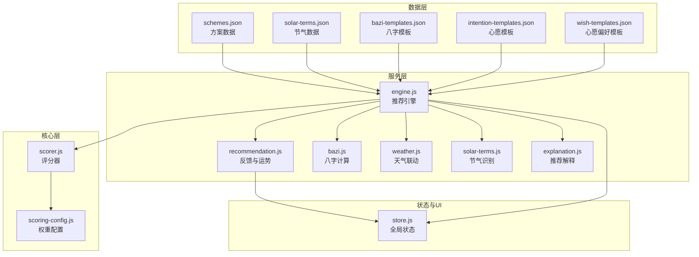
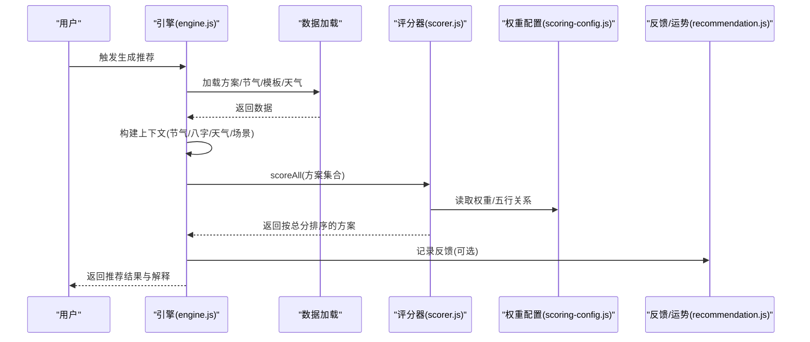
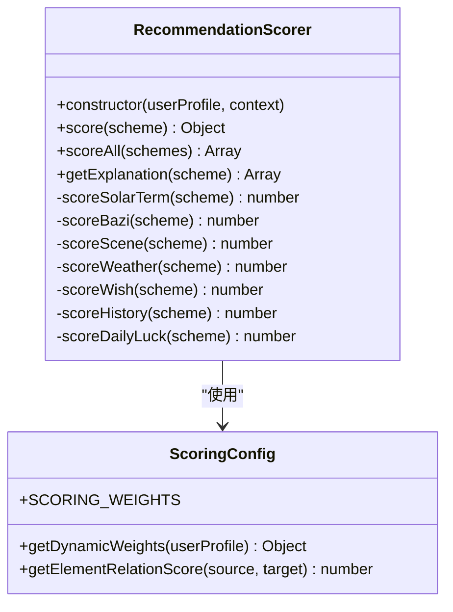
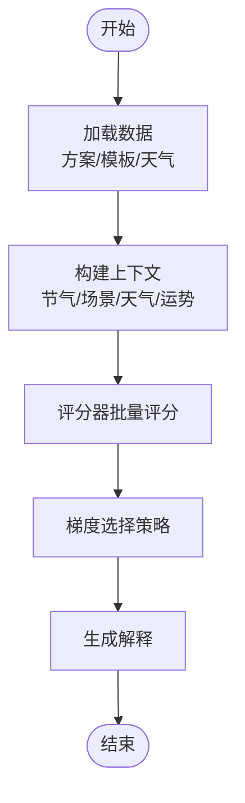
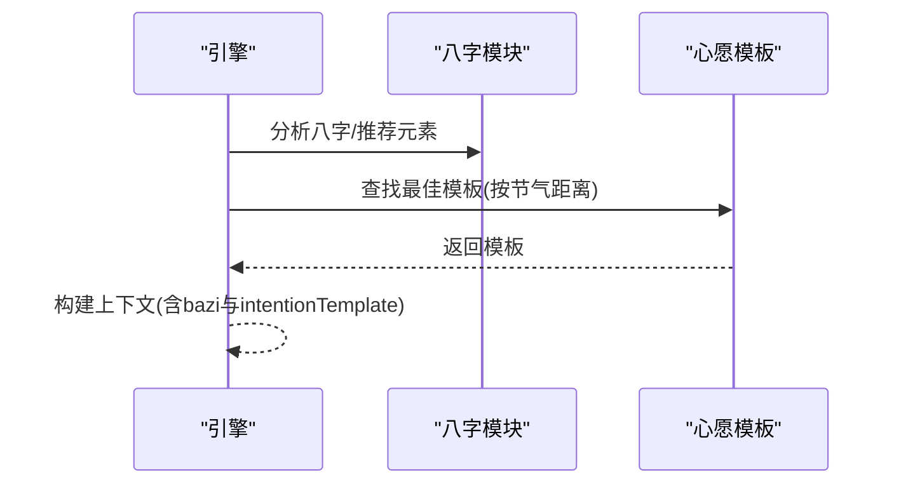
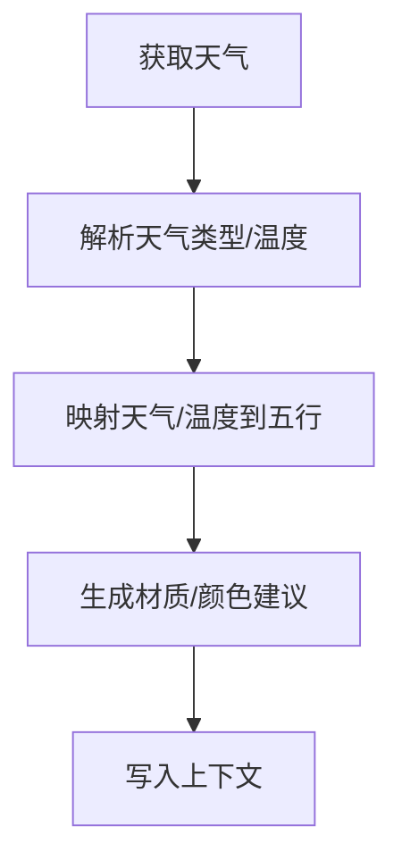
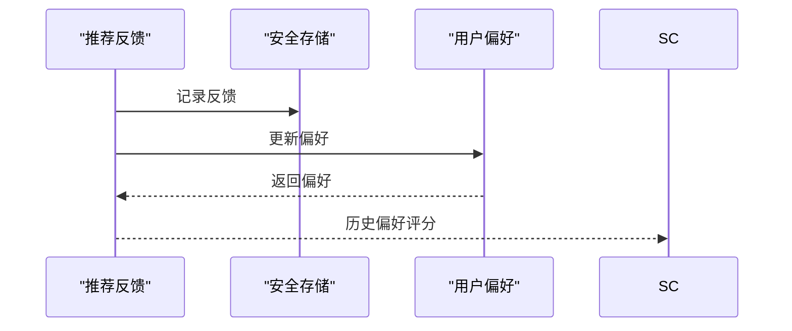
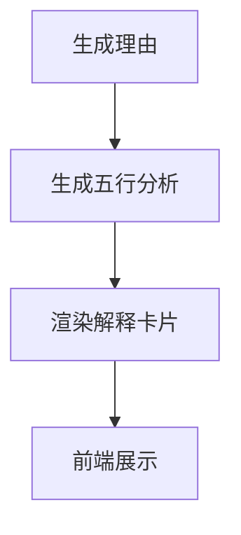
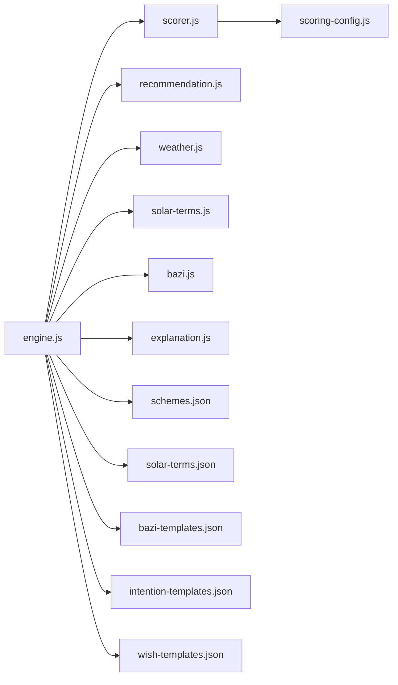

# 推荐服务模块

<cite>
**本文引用的文件**
- [recommendation.js](file://js/services/recommendation.js)
- [engine.js](file://js/services/engine.js)
- [scorer.js](file://js/core/scorer.js)
- [scoring-config.js](file://js/core/scoring-config.js)
- [bazi.js](file://js/services/bazi.js)
- [weather.js](file://js/services/weather.js)
- [solar-terms.js](file://js/services/solar-terms.js)
- [explanation.js](file://js/services/explanation.js)
- [store.js](file://js/core/store.js)
- [schemes.json](file://data/schemes.json)
- [solar-terms.json](file://data/solar-terms.json)
- [bazi-templates.json](file://data/bazi-templates.json)
- [intention-templates.json](file://data/intention-templates.json)
- [wish-templates.json](file://data/wish-templates.json)
</cite>

## 目录
1. [简介](#简介)
2. [项目结构](#项目结构)
3. [核心组件](#核心组件)
4. [架构总览](#架构总览)
5. [详细组件分析](#详细组件分析)
6. [依赖关系分析](#依赖关系分析)
7. [性能考量](#性能考量)
8. [故障排查指南](#故障排查指南)
9. [结论](#结论)
10. [附录](#附录)

## 简介
本文件面向“推荐服务模块”，系统性梳理并解读智能穿搭推荐算法与实现，涵盖以下要点：
- 整合用户偏好、天气条件、八字命理与节气特征的个性化推荐策略
- 评分机制：权重分配、相似度计算、排序算法
- 数据处理流程：输入预处理、特征提取、结果生成
- 缓存策略：本地持久化与快速响应
- 扩展性设计：新增推荐因子与权重调整
- 算法示例、数据结构定义与性能优化策略
- 质量评估与用户反馈收集机制

## 项目结构
推荐服务模块位于前端工程的 js/services 与 js/core 目录，配合 data 目录下的静态数据资源，形成完整的推荐流水线。

图表来源
- [engine.js](file://js/services/engine.js#L339-L409)
- [recommendation.js](file://js/services/recommendation.js#L1-L466)
- [scorer.js](file://js/core/scorer.js#L1-L317)
- [scoring-config.js](file://js/core/scoring-config.js#L1-L128)
- [bazi.js](file://js/services/bazi.js#L1-L267)
- [weather.js](file://js/services/weather.js#L1-L340)
- [solar-terms.js](file://js/services/solar-terms.js#L1-L127)
- [explanation.js](file://js/services/explanation.js#L1-L298)
- [store.js](file://js/core/store.js#L1-L212)

章节来源
- [engine.js](file://js/services/engine.js#L339-L409)
- [recommendation.js](file://js/services/recommendation.js#L1-L466)
- [scorer.js](file://js/core/scorer.js#L1-L317)
- [scoring-config.js](file://js/core/scoring-config.js#L1-L128)
- [bazi.js](file://js/services/bazi.js#L1-L267)
- [weather.js](file://js/services/weather.js#L1-L340)
- [solar-terms.js](file://js/services/solar-terms.js#L1-L127)
- [explanation.js](file://js/services/explanation.js#L1-L298)
- [store.js](file://js/core/store.js#L1-L212)

## 核心组件
- 推荐引擎（engine.js）：协调数据加载、构建上下文、调用评分器、执行梯度推荐策略，并输出解释与结果。
- 评分器（scorer.js）：封装评分逻辑，支持权重配置、缓存、解释生成。
- 权重配置（scoring-config.js）：定义基础权重、五行关系、动态权重与评分等级。
- 八字模块（bazi.js）：提供简版/精确八字计算、五行分布统计与推荐元素。
- 天气模块（weather.js）：获取实时天气、温度等级、天气五行能量场与材质建议。
- 节气模块（solar-terms.js）：识别当前节气、季节与五行属性。
- 推荐反馈与运势（recommendation.js）：用户偏好持久化、反馈记录、今日运势因子与随机种子。
- 推荐解释（explanation.js）：生成推荐理由、五行分析与可视化解释卡片。
- 全局状态（store.js）：集中管理应用状态，驱动视图更新。

章节来源
- [engine.js](file://js/services/engine.js#L339-L409)
- [scorer.js](file://js/core/scorer.js#L14-L75)
- [scoring-config.js](file://js/core/scoring-config.js#L6-L92)
- [bazi.js](file://js/services/bazi.js#L101-L266)
- [weather.js](file://js/services/weather.js#L119-L138)
- [solar-terms.js](file://js/services/solar-terms.js#L45-L112)
- [recommendation.js](file://js/services/recommendation.js#L145-L284)
- [explanation.js](file://js/services/explanation.js#L25-L111)
- [store.js](file://js/core/store.js#L30-L187)

## 架构总览
推荐系统采用“数据驱动 + 评分器 + 引擎”的分层架构：
- 数据层：静态 JSON 数据（方案、节气、模板）与外部天气 API
- 服务层：引擎负责编排，各服务模块负责特定领域（八字、天气、节气、反馈、解释）
- 核心层：评分器统一计算得分，权重配置决定评分权重与动态调整
- 状态层：全局状态驱动 UI 更新与交互

图表来源
- [engine.js](file://js/services/engine.js#L339-L409)
- [scorer.js](file://js/core/scorer.js#L266-L276)
- [scoring-config.js](file://js/core/scoring-config.js#L74-L92)
- [recommendation.js](file://js/services/recommendation.js#L145-L184)

## 详细组件分析

### 评分器与权重配置
- 评分器（RecommendationScorer）：
  - 输入：用户画像（含八字与偏好）、上下文（节气、天气、场景、心愿、今日运势）
  - 输出：每个方案的总分与分项得分明细
  - 关键能力：分项评分（节气、八字、场景、天气、心愿、历史、今日运势）、缓存、解释生成
- 权重配置（scoring-config.js）：
  - 基础权重：节气 25%、八字 20%、场景 20%、天气 15%、心愿 15%
  - 奖励权重：历史偏好 10%、今日运势 5%
  - 动态权重：若无八字，则将 bazi 权重平分给节气与场景；新用户提升节气与场景权重
  - 五行关系：相生、相克、平衡的评分等级映射

图表来源
- [scorer.js](file://js/core/scorer.js#L14-L314)
- [scoring-config.js](file://js/core/scoring-config.js#L6-L127)

章节来源
- [scorer.js](file://js/core/scorer.js#L29-L75)
- [scoring-config.js](file://js/core/scoring-config.js#L6-L92)

### 推荐引擎与梯度策略
- 数据加载：异步加载方案、心愿模板、八字模板与天气数据
- 上下文构建：包含节气五行、场景偏好、天气与温度等级、今日运势
- 梯度推荐策略：
  - 最佳匹配：取最高分方案
  - 保守替代：同五行但不同方案
  - 平衡方案：不同五行，且与节气五行相克或不同，以平衡能量
  - 补充方案：不足数量时补充高分方案
- 结果解释：为每个方案附加解释（得分维度占比、推荐理由）

图表来源
- [engine.js](file://js/services/engine.js#L339-L409)
- [engine.js](file://js/services/engine.js#L234-L315)

章节来源
- [engine.js](file://js/services/engine.js#L339-L409)
- [engine.js](file://js/services/engine.js#L234-L315)

### 八字与心愿模板匹配
- 八字计算：简版与精确模式（依赖 lunar-javascript），输出四柱与五行分布，计算“最弱”与“最强”五行，给出推荐元素
- 心愿模板匹配：根据心愿名称与当前节气，选择最接近的模板，提供颜色、材质与感受建议

图表来源
- [bazi.js](file://js/services/bazi.js#L241-L266)
- [engine.js](file://js/services/engine.js#L126-L141)

章节来源
- [bazi.js](file://js/services/bazi.js#L101-L266)
- [engine.js](file://js/services/engine.js#L126-L141)

### 天气联动与温度调候
- 天气数据：通过 Open-Meteo API 获取当前天气与温度
- 天气五行能量场：晴/多云/雨/雪/雾/雷暴对应不同五行
- 温度五行调候：根据温度区间映射到火/土/金/水
- 材质与颜色建议：依据天气类型与温度等级提供实用建议

图表来源
- [weather.js](file://js/services/weather.js#L119-L138)
- [weather.js](file://js/services/weather.js#L184-L196)
- [engine.js](file://js/services/engine.js#L216-L227)

章节来源
- [weather.js](file://js/services/weather.js#L119-L138)
- [weather.js](file://js/services/weather.js#L184-L196)
- [engine.js](file://js/services/engine.js#L216-L227)

### 今日运势与个性化反馈
- 今日运势：基于日期生成随机种子，打乱五行顺序，得到幸运/增益五行
- 个性化反馈：记录用户对方案的浏览、收藏、选择、忽略，更新用户偏好（五行/颜色/材质/场景）
- 反馈闭环：偏好数据参与评分器的历史偏好项，形成持续优化

图表来源
- [recommendation.js](file://js/services/recommendation.js#L145-L218)
- [scorer.js](file://js/core/scorer.js#L214-L237)

章节来源
- [recommendation.js](file://js/services/recommendation.js#L93-L137)
- [recommendation.js](file://js/services/recommendation.js#L145-L218)
- [scorer.js](file://js/core/scorer.js#L214-L237)

### 推荐解释与可视化
- 推荐理由：节气相应/相生、八字补益/相生、场景适配、今日运势、个性化偏好
- 五行分析：当前节气、八字、今日运势的雷达图式可视化
- 分数解释：基础匹配、个性化、场景适配、今日运势的分项说明

图表来源
- [explanation.js](file://js/services/explanation.js#L25-L111)
- [explanation.js](file://js/services/explanation.js#L118-L151)
- [explanation.js](file://js/services/explanation.js#L218-L241)

章节来源
- [explanation.js](file://js/services/explanation.js#L25-L111)
- [explanation.js](file://js/services/explanation.js#L118-L151)
- [explanation.js](file://js/services/explanation.js#L218-L241)

## 依赖关系分析
- 模块耦合：
  - engine.js 依赖 scorer.js、recommendation.js、weather.js、solar-terms.js、bazi.js、explanation.js
  - scorer.js 依赖 scoring-config.js
  - recommendation.js 依赖 store.js 的安全存储封装
- 数据依赖：
  - 方案数据来自 schemes.json
  - 节气数据来自 solar-terms.json
  - 模板数据来自 bazi-templates.json、intention-templates.json、wish-templates.json
- 外部依赖：
  - 天气 API：Open-Meteo
  - 可选：lunar-javascript（精确八字）

图表来源
- [engine.js](file://js/services/engine.js#L1-L10)
- [scorer.js](file://js/core/scorer.js#L6-L12)
- [recommendation.js](file://js/services/recommendation.js#L6-L29)
- [weather.js](file://js/services/weather.js#L6-L6)
- [solar-terms.js](file://js/services/solar-terms.js#L5-L5)
- [bazi.js](file://js/services/bazi.js#L1-L4)
- [explanation.js](file://js/services/explanation.js#L6-L6)

章节来源
- [engine.js](file://js/services/engine.js#L1-L10)
- [scorer.js](file://js/core/scorer.js#L6-L12)
- [recommendation.js](file://js/services/recommendation.js#L6-L29)
- [weather.js](file://js/services/weather.js#L6-L6)
- [solar-terms.js](file://js/services/solar-terms.js#L5-L5)
- [bazi.js](file://js/services/bazi.js#L1-L4)
- [explanation.js](file://js/services/explanation.js#L6-L6)

## 性能考量
- 缓存策略：
  - 评分器内部缓存：Map 缓存单方案评分结果，避免重复计算
  - 本地持久化：推荐反馈与用户偏好使用安全存储封装，减少重复加载
- 异步加载：方案、模板、天气数据并行加载，缩短首屏等待
- 梯度推荐：优先保证多样性与平衡，同时控制循环次数
- 评分等级：统一评分等级映射，便于裁剪与阈值设定

章节来源
- [scorer.js](file://js/core/scorer.js#L20-L22)
- [recommendation.js](file://js/services/recommendation.js#L12-L29)
- [engine.js](file://js/services/engine.js#L342-L347)

## 故障排查指南
- 天气 API 失败：
  - 现象：无法获取天气数据
  - 处理：捕获异常并回退到默认上下文
- 精确八字失败：
  - 现象：lunar-javascript 未加载或计算异常
  - 处理：自动降级为简版八字
- 存储异常：
  - 现象：localStorage 抛错
  - 处理：使用安全存储封装，静默处理错误
- 数据缺失：
  - 现象：方案/模板为空
  - 处理：返回空结果并记录错误

章节来源
- [engine.js](file://js/services/engine.js#L356-L362)
- [bazi.js](file://js/services/bazi.js#L129-L132)
- [recommendation.js](file://js/services/recommendation.js#L12-L29)

## 结论
推荐服务模块通过“权重配置 + 评分器 + 引擎”的分层设计，实现了以节气、八字、天气、场景、心愿与个性化偏好为核心的多维推荐。其梯度策略兼顾多样性与平衡，结合解释模块与用户反馈，形成闭环优化。模块具备良好的扩展性与可维护性，便于后续新增推荐因子与权重调整。

## 附录

### 数据结构定义
- 方案（Scheme）：包含 id、节气、颜色（名称、十六进制、五行）、材质、感受、注释与来源
- 节气（Term）：包含 id、名称、五行、月份与日期范围
- 八字（BaZi）：包含四柱（年/月/日/时）天干地支、完整八字、精度标识
- 用户画像（UserProfile）：包含八字、偏好（五行/颜色/材质/风格）、是否新用户
- 上下文（Context）：包含节气五行、场景偏好、天气、心愿模板、今日运势

章节来源
- [schemes.json](file://data/schemes.json#L1-L509)
- [solar-terms.json](file://data/solar-terms.json#L1-L42)
- [bazi-templates.json](file://data/bazi-templates.json#L1-L103)
- [intention-templates.json](file://data/intention-templates.json#L1-L493)
- [wish-templates.json](file://data/wish-templates.json#L1-L47)

### 推荐算法示例
- 基础匹配：方案五行与节气/八字/心愿五行的相生/相克/相同关系
- 个性化加成：基于用户偏好与历史反馈的加权评分
- 场景适配：场景偏好（五行/材质）与方案匹配
- 天气联动：天气五行能量场与温度调候对材质与颜色的建议
- 今日运势：随机种子生成幸运/增益五行，对方案进行加成

章节来源
- [scoring-config.js](file://js/core/scoring-config.js#L120-L127)
- [scorer.js](file://js/core/scorer.js#L81-L193)
- [recommendation.js](file://js/services/recommendation.js#L387-L417)
- [recommendation.js](file://js/services/recommendation.js#L247-L284)

### 扩展性设计
- 新增推荐因子：
  - 在权重配置中添加新维度权重与评分函数
  - 在引擎上下文中注入新上下文字段
  - 在评分器中实现新维度评分与解释
- 调整权重：
  - 修改基础权重或动态权重逻辑
  - 通过用户画像参数（如新用户）影响权重分配

章节来源
- [scoring-config.js](file://js/core/scoring-config.js#L74-L92)
- [scorer.js](file://js/core/scorer.js#L14-L75)

### 质量评估与用户反馈
- 质量评估：
  - 通过解释模块查看得分维度占比，验证推荐合理性
  - 对比不同场景/天气/运势下的推荐一致性
- 用户反馈：
  - 记录浏览、收藏、选择、忽略行为
  - 基于反馈更新用户偏好，驱动后续推荐优化

章节来源
- [explanation.js](file://js/services/explanation.js#L283-L313)
- [recommendation.js](file://js/services/recommendation.js#L145-L184)
- [recommendation.js](file://js/services/recommendation.js#L192-L218)