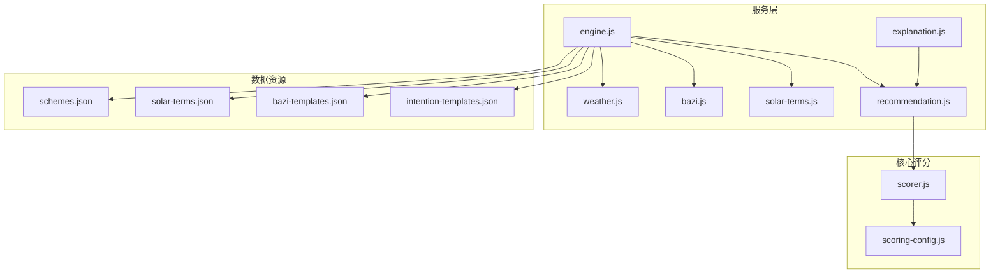
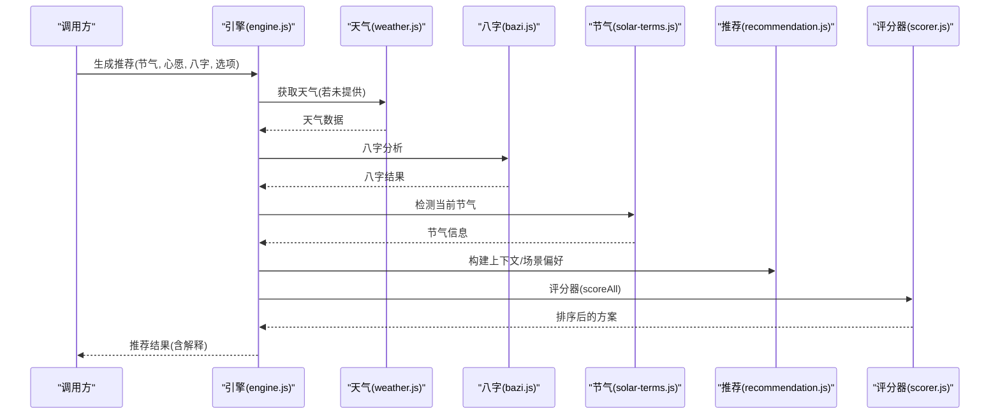
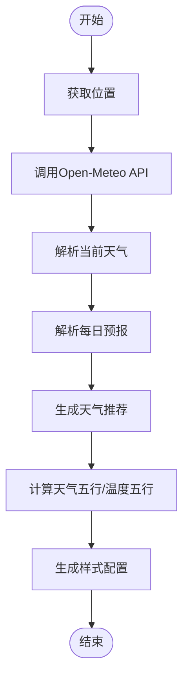
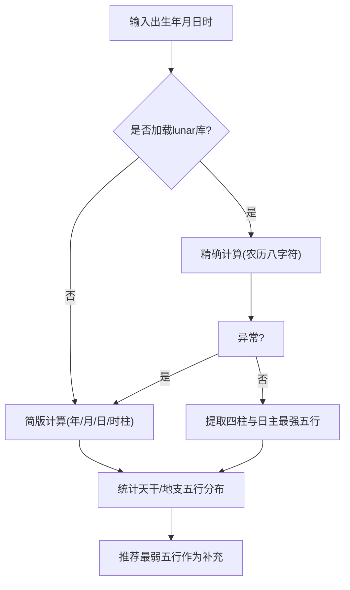
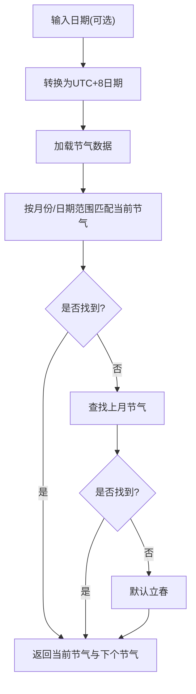
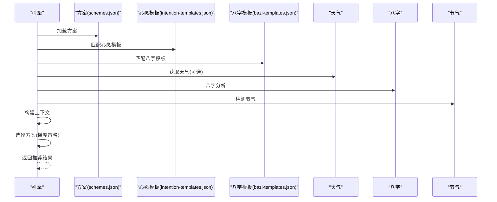
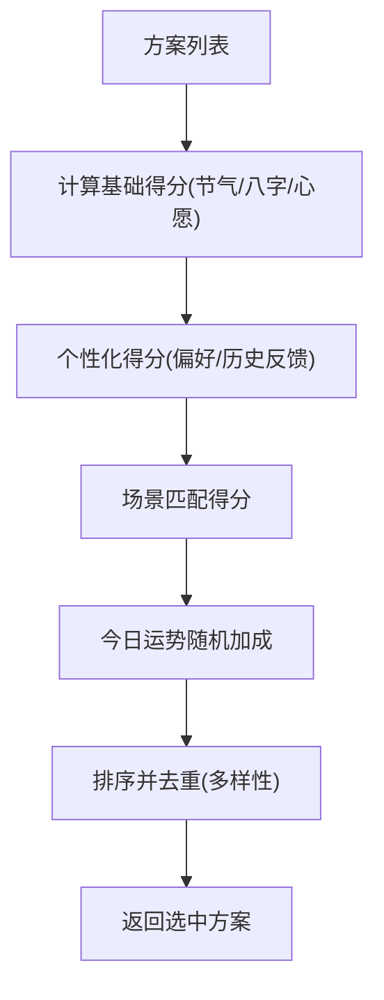
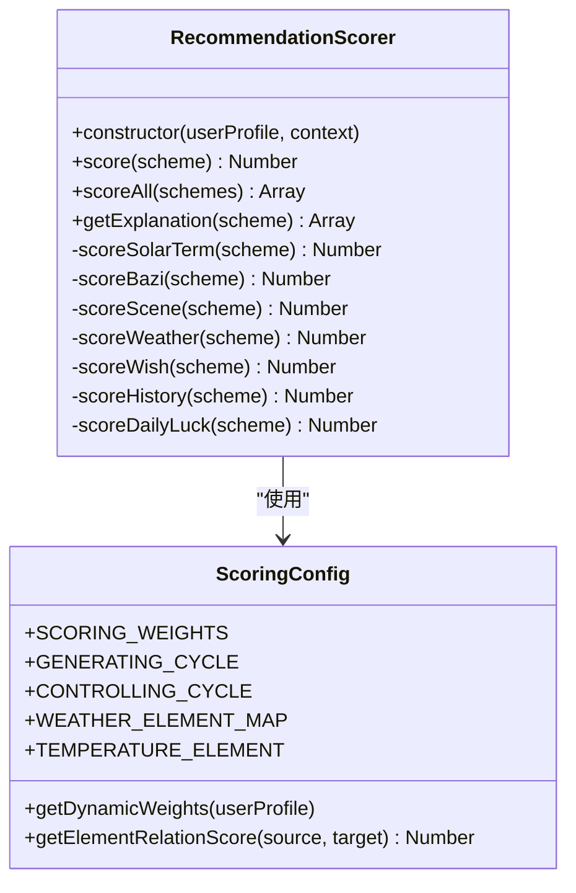
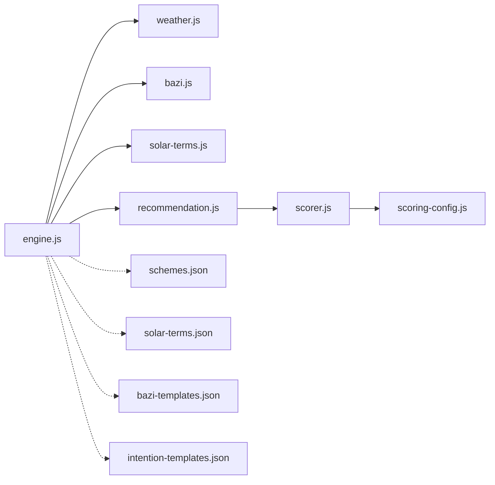

# 服务层设计

<cite>
**本文引用的文件**
- [weather.js](file://js/services/weather.js)
- [bazi.js](file://js/services/bazi.js)
- [solar-terms.js](file://js/services/solar-terms.js)
- [engine.js](file://js/services/engine.js)
- [recommendation.js](file://js/services/recommendation.js)
- [explanation.js](file://js/services/explanation.js)
- [scorer.js](file://js/core/scorer.js)
- [scoring-config.js](file://js/core/scoring-config.js)
- [schemes.json](file://data/schemes.json)
- [solar-terms.json](file://data/solar-terms.json)
- [bazi-templates.json](file://data/bazi-templates.json)
- [intention-templates.json](file://data/intention-templates.json)
</cite>

## 目录
1. [简介](#简介)
2. [项目结构](#项目结构)
3. [核心组件](#核心组件)
4. [架构总览](#架构总览)
5. [详细组件分析](#详细组件分析)
6. [依赖分析](#依赖分析)
7. [性能考虑](#性能考虑)
8. [故障排查指南](#故障排查指南)
9. [结论](#结论)
10. [附录](#附录)

## 简介
本文件系统性梳理“五行穿搭建议”项目的服务层设计，聚焦以下目标：
- 深入解析天气服务（Weather）：天气数据获取、API集成、本地缓存策略与五行能量场映射。
- 阐述八字服务（Bazi）：简版与精确八字计算、命理分析、数据验证与回退机制。
- 说明节气服务（SolarTerms）：二十四节气计算、日期转换、文化背景处理与季节映射。
- 详解服务层架构模式：服务接口设计、依赖注入、错误处理与数据流。
- 提供扩展指南：新增业务服务与第三方API集成的最佳实践。
- 给出实现示例路径、配置参数说明与性能优化建议，并解释服务间协作机制与数据流转。

## 项目结构
服务层位于 js/services 与 js/core 目录，配合 data 下的静态模板数据，形成“数据驱动 + 评分器”的推荐体系。关键模块如下：
- 天气服务：weather.js
- 八字服务：bazi.js
- 节气服务：solar-terms.js
- 推荐引擎：engine.js
- 推荐算法与个性化：recommendation.js
- 评分器与权重配置：scorer.js、scoring-config.js
- 结果解释：explanation.js
- 数据资源：schemes.json、solar-terms.json、bazi-templates.json、intention-templates.json

图表来源
- [engine.js](file://js/services/engine.js#L1-L425)
- [weather.js](file://js/services/weather.js#L1-L340)
- [bazi.js](file://js/services/bazi.js#L1-L267)
- [solar-terms.js](file://js/services/solar-terms.js#L1-L115)
- [recommendation.js](file://js/services/recommendation.js#L1-L466)
- [explanation.js](file://js/services/explanation.js#L1-L298)
- [scorer.js](file://js/core/scorer.js#L1-L317)
- [scoring-config.js](file://js/core/scoring-config.js#L1-L128)
- [schemes.json](file://data/schemes.json#L1-L509)
- [solar-terms.json](file://data/solar-terms.json#L1-L42)
- [bazi-templates.json](file://data/bazi-templates.json#L1-L103)
- [intention-templates.json](file://data/intention-templates.json#L1-L493)

章节来源
- [engine.js](file://js/services/engine.js#L1-L425)
- [weather.js](file://js/services/weather.js#L1-L340)
- [bazi.js](file://js/services/bazi.js#L1-L267)
- [solar-terms.js](file://js/services/solar-terms.js#L1-L115)
- [recommendation.js](file://js/services/recommendation.js#L1-L466)
- [explanation.js](file://js/services/explanation.js#L1-L298)
- [scorer.js](file://js/core/scorer.js#L1-L317)
- [scoring-config.js](file://js/core/scoring-config.js#L1-L128)
- [schemes.json](file://data/schemes.json#L1-L509)
- [solar-terms.json](file://data/solar-terms.json#L1-L42)
- [bazi-templates.json](file://data/bazi-templates.json#L1-L103)
- [intention-templates.json](file://data/intention-templates.json#L1-L493)

## 核心组件
- 天气服务（Weather）
  - 职责：获取经纬度天气数据、解析天气类型与温度等级、生成天气推荐与五行能量场、提供样式映射。
  - 关键能力：地理位置获取、Open-Meteo API集成、天气类型映射、温度等级与材料建议、天气五行与温度五行映射。
- 八字服务（Bazi）
  - 职责：简版与精确八字计算、五行分布统计、推荐最弱五行、命理分析与回退。
  - 关键能力：天干地支映射、五鼠遁推时干、农历库（lunar-javascript）集成与回退、五行统计与推荐。
- 节气服务（SolarTerms）
  - 职责：UTC+8时间处理、节气数据加载、当前节气检测、季节与五行映射。
  - 关键能力：节气范围匹配、上月回溯、默认节气兜底、季节与五行映射。
- 推荐引擎（Engine）
  - 职责：聚合天气、八字、节气、心愿模板、用户偏好与今日运势，构建上下文，选择方案并生成解释。
  - 关键能力：多源数据加载、上下文构建、梯度推荐策略、模板匹配、反馈闭环。
- 推荐算法（Recommendation）
  - 职责：场景偏好、今日运势随机因子、用户反馈与偏好更新、个性化得分计算。
  - 关键能力：场景权重、历史反馈评分、今日运势加成、多样化选择策略。
- 评分器（Scorer）
  - 职责：封装评分逻辑，支持权重配置、缓存、解释生成。
  - 关键能力：节气/八字/场景/天气/心愿/历史/运势评分，关系得分计算。
- 结果解释（Explanation）
  - 职责：生成推荐理由、五行分析与可视化。
  - 关键能力：理由生成、雷达图渲染、分析卡片输出。

章节来源
- [weather.js](file://js/services/weather.js#L1-L340)
- [bazi.js](file://js/services/bazi.js#L1-L267)
- [solar-terms.js](file://js/services/solar-terms.js#L1-L115)
- [engine.js](file://js/services/engine.js#L1-L425)
- [recommendation.js](file://js/services/recommendation.js#L1-L466)
- [scorer.js](file://js/core/scorer.js#L1-L317)
- [explanation.js](file://js/services/explanation.js#L1-L298)

## 架构总览
服务层采用“数据驱动 + 评分器 + 解释输出”的分层架构：
- 数据层：静态JSON资源（方案、节气、八字模板、心愿模板）。
- 服务层：天气、八字、节气、引擎、推荐、解释。
- 核心层：评分器与权重配置，统一评分口径。
- 控制流：引擎负责组装上下文并调用评分器，最终输出推荐与解释。

图表来源
- [engine.js](file://js/services/engine.js#L323-L393)
- [weather.js](file://js/services/weather.js#L119-L138)
- [bazi.js](file://js/services/bazi.js#L241-L266)
- [solar-terms.js](file://js/services/solar-terms.js#L33-L100)
- [recommendation.js](file://js/services/recommendation.js#L323-L379)
- [scorer.js](file://js/core/scorer.js#L266-L276)

## 详细组件分析

### 天气服务（Weather）设计
- 数据获取与API集成
  - 通过地理位置API获取经纬度，再调用 Open-Meteo 获取当前与每日天气数据。
  - 解析字段：温度、湿度、天气代码、每日最高最低温度。
- 天气类型与推荐
  - 天气代码映射到中文名、emoji与类型（晴/阴/雨/雪/雾/雷暴）。
  - 基于天气类型与温度等级生成材料、颜色与提示建议。
- 五行能量场与样式
  - 天气五行映射（如晴为火、雨为水），温度调候映射（如高温为火）。
  - 提供每种天气类型的背景与文字颜色样式。
- 错误处理与回退
  - 浏览器地理定位不可用时抛错；网络请求超时控制在安全函数中执行。
- 性能与缓存
  - 未见本地缓存实现；建议对同一经纬度结果进行内存缓存，避免重复请求。

图表来源
- [weather.js](file://js/services/weather.js#L91-L177)
- [weather.js](file://js/services/weather.js#L184-L340)

章节来源
- [weather.js](file://js/services/weather.js#L1-L340)

### 八字服务（Bazi）设计
- 简版计算
  - 年柱/月柱/日柱/时柱分别按固定公式计算天干地支，支持“五鼠遁”推时干。
- 精确计算
  - 依赖 lunar-javascript 库，若未加载则回退到简版；异常时也回退。
  - 输出包含年月日时四柱与“日主最强五行”（用于推荐）。
- 五行分析与推荐
  - 统计天干与地支五行分布，排序得到最弱与最强五行，推荐补充最弱。
- 数据验证与回退
  - 对外部库缺失与异常进行容错处理，保证功能可用性。

图表来源
- [bazi.js](file://js/services/bazi.js#L127-L183)
- [bazi.js](file://js/services/bazi.js#L188-L231)

章节来源
- [bazi.js](file://js/services/bazi.js#L1-L267)

### 节气服务（SolarTerms）设计
- UTC+8时间处理
  - 将本地时间转换为UTC+8时间，确保节气判断基于北京时间。
- 节气数据加载
  - 从 solar-terms.json 加载节气列表、季节映射与五行名称。
- 当前节气检测
  - 通过月份与日期范围匹配当前节气，若未命中则回溯至上月，最后兜底为立春。
- 季节与五行映射
  - 根据节气ID映射到季节与对应五行，便于推荐引擎选择方案。

图表来源
- [solar-terms.js](file://js/services/solar-terms.js#L12-L100)

章节来源
- [solar-terms.js](file://js/services/solar-terms.js#L1-L115)
- [solar-terms.json](file://data/solar-terms.json#L1-L42)

### 推荐引擎（Engine）设计
- 数据加载与模板匹配
  - 异步加载方案、心愿模板与八字模板；根据当前节气与心愿ID匹配最优模板。
- 用户画像与上下文构建
  - 构建用户画像（包含八字、偏好、是否新用户）；构建上下文（节气、心愿、天气、场景偏好、今日运势）。
- 方案选择策略
  - 使用评分器批量评分，采用“最佳匹配 + 保守替代 + 平衡方案”的梯度策略，确保多样性与平衡。
- 天气联动
  - 将天气类型与温度等级纳入上下文，影响温度等级与材料建议。

图表来源
- [engine.js](file://js/services/engine.js#L323-L393)
- [engine.js](file://js/services/engine.js#L218-L299)

章节来源
- [engine.js](file://js/services/engine.js#L1-L425)
- [schemes.json](file://data/schemes.json#L1-L509)
- [intention-templates.json](file://data/intention-templates.json#L1-L493)
- [bazi-templates.json](file://data/bazi-templates.json#L1-L103)

### 推荐算法（Recommendation）设计
- 场景偏好与权重
  - 定义多种场景（日常、职场、约会、聚会、运动、学习、居家、旅行、本命年、庆典）及其偏好权重。
- 今日运势随机因子
  - 基于日期生成随机种子，打乱五行顺序，形成今日幸运/增益五行，增加推荐变化。
- 用户反馈与偏好更新
  - 记录用户对方案的浏览、收藏、选择、忽略行为，动态更新偏好分数。
- 个性化得分
  - 综合用户五行偏好、颜色偏好、材质偏好与历史反馈，叠加今日运势加成。

图表来源
- [recommendation.js](file://js/services/recommendation.js#L323-L379)
- [recommendation.js](file://js/services/recommendation.js#L247-L284)

章节来源
- [recommendation.js](file://js/services/recommendation.js#L1-L466)

### 评分器（Scorer）与权重配置
- 权重配置
  - 基础权重：节气、八字、场景、天气、心愿；额外权重：历史偏好、今日运势。
  - 动态权重：若无八字则将权重重新分配；新用户提升节气与场景权重。
- 关系得分
  - 五行相生/相克/相同关系映射到不同得分区间，用于评分。
- 评分维度
  - 节气匹配、八字喜用/忌神、场景适配、天气联动（含温度调候）、心愿契合、历史偏好、今日运势。
- 缓存与解释
  - 评分结果缓存；支持生成推荐理由（维度占比）。

图表来源
- [scorer.js](file://js/core/scorer.js#L14-L317)
- [scoring-config.js](file://js/core/scoring-config.js#L6-L128)

章节来源
- [scorer.js](file://js/core/scorer.js#L1-L317)
- [scoring-config.js](file://js/core/scoring-config.js#L1-L128)

### 结果解释（Explanation）设计
- 推荐理由
  - 节气相应/相生、八字补益/相生、场景适配、今日幸运/增益、个性化偏好。
- 五行分析
  - 展示当前节气、八字喜用、今日运势的五行状态与颜色。
- 可视化
  - 渲染解释卡片与五行雷达图，标注激活的维度。

章节来源
- [explanation.js](file://js/services/explanation.js#L1-L298)

## 依赖分析
- 模块耦合
  - 引擎依赖天气、八字、节气、推荐与数据资源；推荐算法依赖评分器；评分器依赖权重配置。
- 外部依赖
  - 天气API：Open-Meteo；农历库：lunar-javascript（可选）。
- 数据依赖
  - JSON资源提供方案、节气、模板数据，引擎与推荐模块读取并匹配。

图表来源
- [engine.js](file://js/services/engine.js#L1-L425)
- [recommendation.js](file://js/services/recommendation.js#L1-L466)
- [scorer.js](file://js/core/scorer.js#L1-L317)
- [scoring-config.js](file://js/core/scoring-config.js#L1-L128)
- [schemes.json](file://data/schemes.json#L1-L509)
- [solar-terms.json](file://data/solar-terms.json#L1-L42)
- [bazi-templates.json](file://data/bazi-templates.json#L1-L103)
- [intention-templates.json](file://data/intention-templates.json#L1-L493)

章节来源
- [engine.js](file://js/services/engine.js#L1-L425)
- [recommendation.js](file://js/services/recommendation.js#L1-L466)
- [scorer.js](file://js/core/scorer.js#L1-L317)
- [scoring-config.js](file://js/core/scoring-config.js#L1-L128)

## 性能考虑
- 缓存策略
  - 天气服务：对同一经纬度结果进行内存缓存，避免重复请求；可结合本地存储实现跨会话缓存。
  - 节气数据：首次加载后缓存于内存，减少重复IO。
- 并发加载
  - 引擎使用 Promise.all 并发加载方案、心愿模板与八字模板，缩短等待时间。
- 评分器缓存
  - 评分器内部使用 Map 缓存评分结果，避免重复计算。
- 评分维度裁剪
  - 在无八字或新用户场景下，动态调整权重，减少无效计算。
- 前端渲染
  - 解释模块采用轻量DOM拼接与SVG绘制，保持交互流畅。

[本节为通用指导，无需特定文件引用]

## 故障排查指南
- 天气服务
  - 地理位置不可用：检查浏览器权限与HTTPS环境；确认API返回格式正确。
  - 网络超时：检查safeFetch超时设置与网络状况。
- 八字服务
  - lunar库未加载：确认引入顺序与CDN可用；异常时自动回退简版。
  - 计算异常：查看控制台错误日志，确认输入参数合法。
- 节气服务
  - 日期不匹配：检查UTC+8转换逻辑与节气范围；确认兜底逻辑生效。
- 推荐引擎
  - 数据为空：检查JSON资源加载是否成功；确认模板匹配逻辑。
  - 评分异常：检查权重配置与关系得分映射。
- 本地存储
  - 用户偏好/反馈无法写入：检查浏览器隐私设置与localStorage可用性。

章节来源
- [weather.js](file://js/services/weather.js#L91-L111)
- [bazi.js](file://js/services/bazi.js#L127-L133)
- [solar-terms.js](file://js/services/solar-terms.js#L33-L100)
- [recommendation.js](file://js/services/recommendation.js#L145-L184)

## 结论
本服务层以“数据驱动 + 评分器 + 解释输出”为核心，实现了天气、八字、节气与用户偏好的统一融合。通过清晰的模块职责划分、动态权重与缓存策略，既保证了推荐的准确性，又兼顾了性能与可扩展性。未来可在天气缓存、模板扩展与第三方API集成方面进一步增强。

[本节为总结性内容，无需特定文件引用]

## 附录

### 服务扩展指南
- 新增业务服务步骤
  - 在 js/services 下新建模块，导出公共API；在 js/core 中新增配置或工具。
  - 在引擎中注册服务调用与上下文构建，确保数据加载与评分参与。
  - 在解释模块中添加理由生成与可视化。
- 集成第三方API
  - 使用安全函数封装fetch，设置超时与错误处理。
  - 定义数据模型与映射规则，确保与现有评分器兼容。
  - 提供回退策略（如离线缓存或简版逻辑）。

[本节为通用指导，无需特定文件引用]

### 实现代码示例路径
- 天气服务
  - 获取位置：[getCurrentPosition](file://js/services/weather.js#L91-L111)
  - 获取天气数据：[getWeatherData](file://js/services/weather.js#L119-L129)
  - 解析天气类型：[parseCurrentWeather](file://js/services/weather.js#L145-L154)
  - 天气推荐：[getWeatherRecommendation](file://js/services/weather.js#L184-L196)
  - 五行映射：[getWeatherElement](file://js/services/weather.js#L296-L307)
- 八字服务
  - 简版计算：[calcBaziSimple](file://js/services/bazi.js#L101-L115)
  - 精确计算：[calcBaziPrecise](file://js/services/bazi.js#L127-L183)
  - 五行分析：[calcWuxingProfile](file://js/services/bazi.js#L188-L212)
  - 推荐五行：[getRecommendElement](file://js/services/bazi.js#L217-L231)
- 节气服务
  - UTC+8时间：[getUTC8Date](file://js/services/solar-terms.js#L12-L15)
  - 加载数据：[loadTermsData](file://js/services/solar-terms.js#L20-L26)
  - 检测节气：[detectCurrentTerm](file://js/services/solar-terms.js#L33-L100)
- 推荐引擎
  - 生成推荐：[generateRecommendation](file://js/services/engine.js#L323-L393)
  - 重新生成：[regenerateRecommendation](file://js/services/engine.js#L398-L421)
  - 梯度选择：[selectSchemes](file://js/services/engine.js#L218-L299)
- 推荐算法
  - 场景偏好：[SCENE_PREFERENCES](file://js/services/recommendation.js#L61-L87)
  - 今日运势：[getDailyLuckFactors](file://js/services/recommendation.js#L124-L137)
  - 个性化评分：[calculatePersonalizedScore](file://js/services/recommendation.js#L247-L284)
- 评分器与配置
  - 评分器：[RecommendationScorer](file://js/core/scorer.js#L14-L317)
  - 权重配置：[SCORING_WEIGHTS](file://js/core/scoring-config.js#L7-L19)
  - 关系得分：[getElementRelationScore](file://js/core/scoring-config.js#L120-L127)
- 结果解释
  - 推荐理由：[generateReasons](file://js/services/explanation.js#L25-L111)
  - 五行分析：[generateWuxingAnalysis](file://js/services/explanation.js#L118-L151)

### 配置参数说明
- 权重配置（scoring-config.js）
  - 基础权重：节气、八字、场景、天气、心愿
  - 额外权重：历史偏好、今日运势
  - 动态权重：根据用户画像调整
- 场景偏好（recommendation.js）
  - 每个场景包含五行偏好与材质偏好，用于评分
- 节气与模板（solar-terms.json、intention-templates.json、bazi-templates.json）
  - 节气范围、季节映射、心愿模板与八字模板的匹配键

章节来源
- [scoring-config.js](file://js/core/scoring-config.js#L6-L128)
- [recommendation.js](file://js/services/recommendation.js#L32-L87)
- [solar-terms.json](file://data/solar-terms.json#L1-L42)
- [intention-templates.json](file://data/intention-templates.json#L1-L493)
- [bazi-templates.json](file://data/bazi-templates.json#L1-L103)