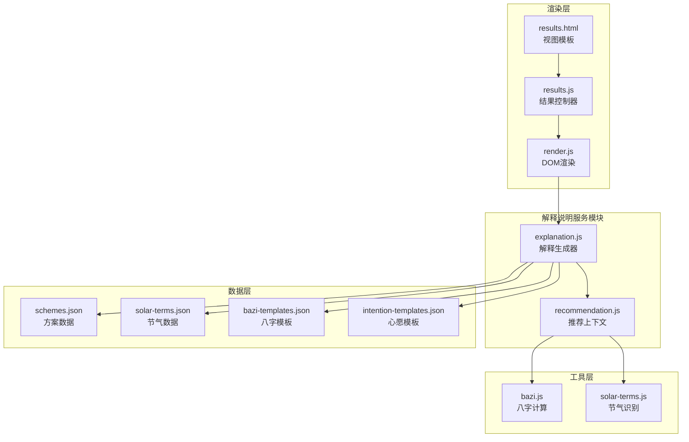
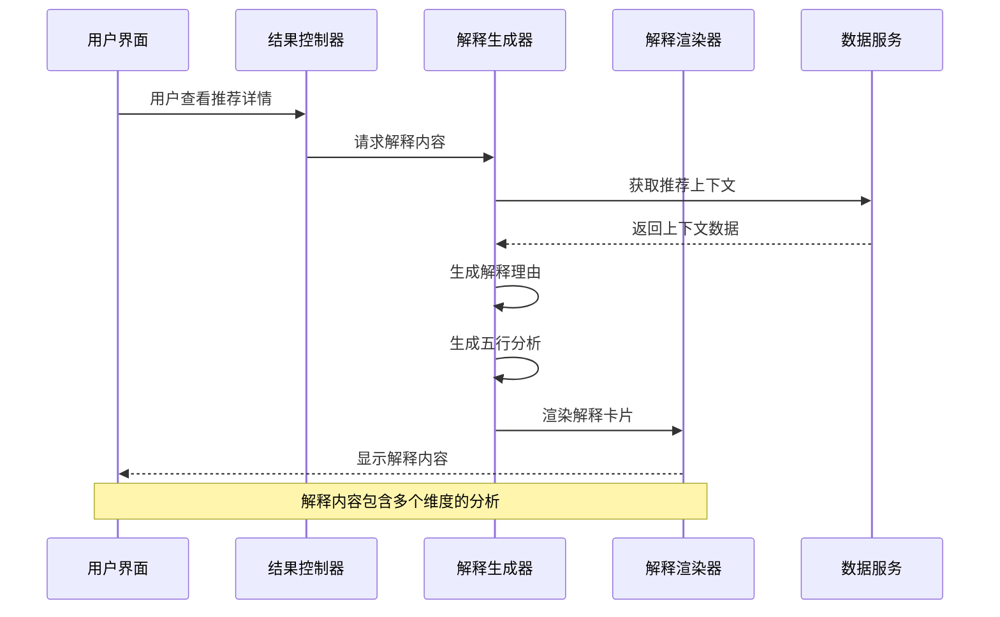
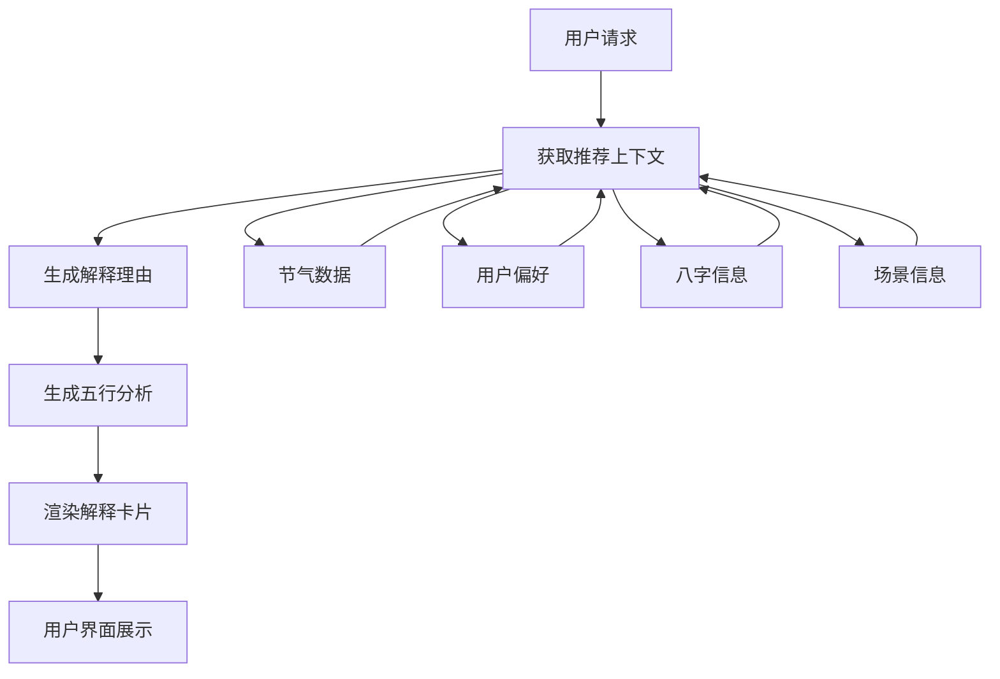
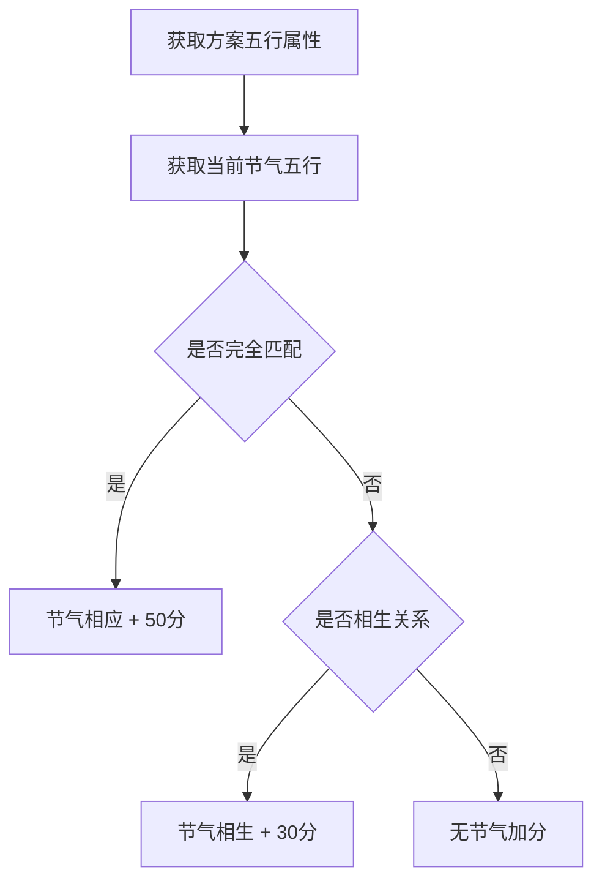
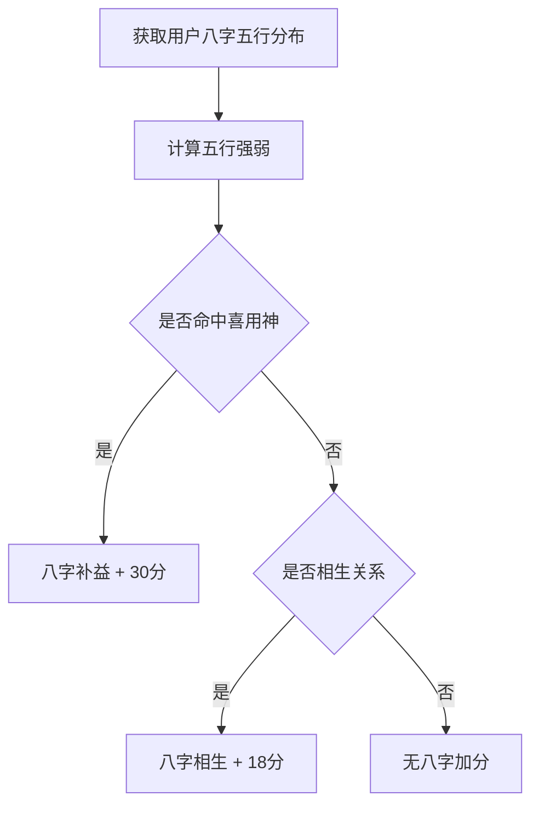
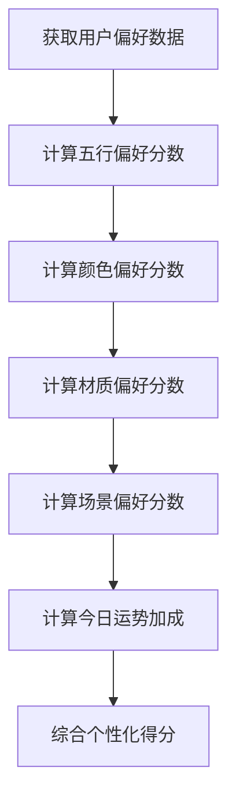
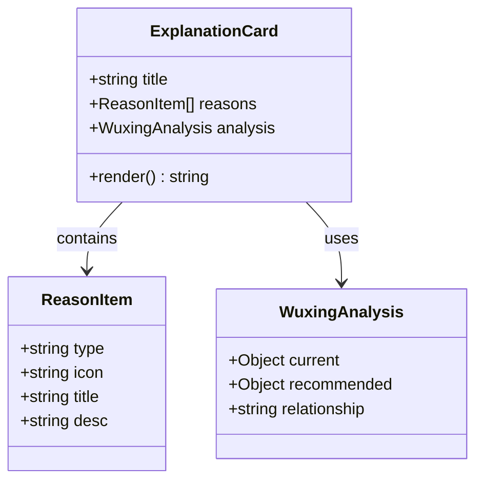
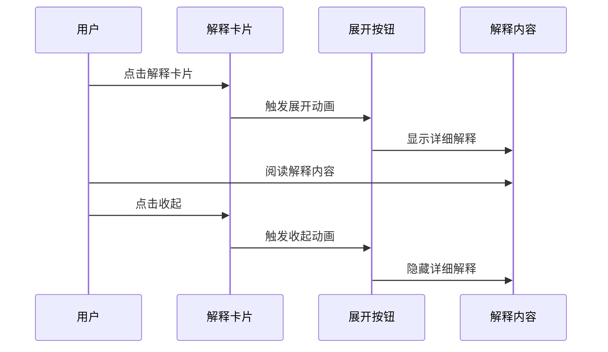
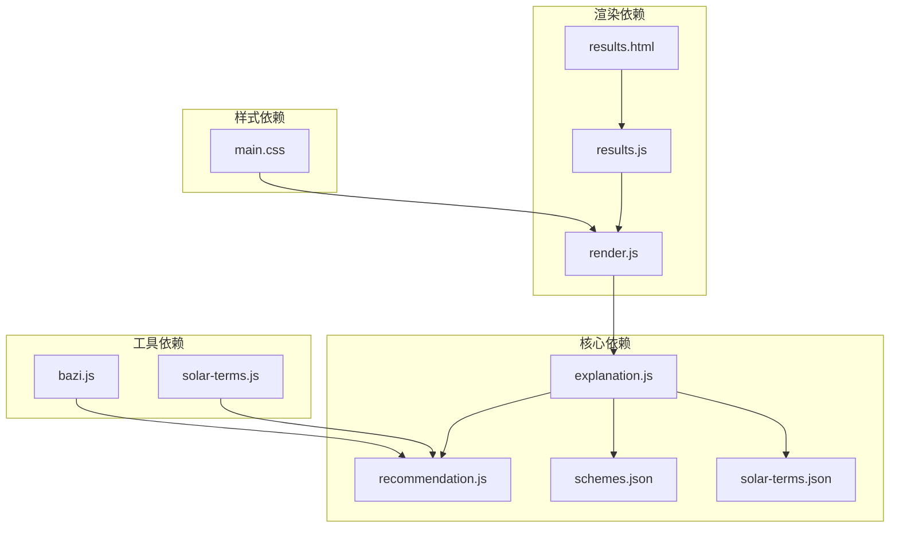

# 解释说明服务模块

<cite>
**本文档引用的文件**
- [explanation.js](file://js/services/explanation.js)
- [recommendation.js](file://js/services/recommendation.js)
- [render.js](file://js/utils/render.js)
- [results.js](file://js/controllers/results.js)
- [bazi.js](file://js/services/bazi.js)
- [solar-terms.js](file://js/services/solar-terms.js)
- [schemes.json](file://data/schemes.json)
- [solar-terms.json](file://data/solar-terms.json)
- [bazi-templates.json](file://data/bazi-templates.json)
- [intention-templates.json](file://data/intention-templates.json)
- [results.html](file://views/results.html)
- [main.css](file://css/main.css)
</cite>

## 目录
1. [简介](#简介)
2. [项目结构](#项目结构)
3. [核心组件](#核心组件)
4. [架构概览](#架构概览)
5. [详细组件分析](#详细组件分析)
6. [依赖关系分析](#依赖关系分析)
7. [性能考虑](#性能考虑)
8. [故障排除指南](#故障排除指南)
9. [结论](#结论)

## 简介

解释说明服务模块是"顺时裳"智能穿搭推荐系统的核心组成部分，专门负责为用户的穿搭推荐提供详细的解释说明和文化背景介绍。该模块基于中国传统五行理论、八字命理学和二十四节气文化，通过科学的算法生成个性化的解释文案，帮助用户理解推荐结果背后的文化原理和科学依据。

该模块的设计目标是：
- 提供可理解的解释说明，让用户了解推荐结果的科学依据
- 融入传统文化元素，增强用户体验的文化认同感
- 支持个性化定制，根据不同用户偏好调整解释内容
- 实现与推荐系统的无缝集成，提供实时的解释服务

## 项目结构

解释说明服务模块位于项目的JavaScript服务层，采用模块化设计，与其他核心模块紧密协作：



**图表来源**
- [explanation.js](file://js/services/explanation.js#L1-L298)
- [recommendation.js](file://js/services/recommendation.js#L1-L466)
- [render.js](file://js/utils/render.js#L1-L487)

**章节来源**
- [explanation.js](file://js/services/explanation.js#L1-L298)
- [recommendation.js](file://js/services/recommendation.js#L1-L466)

## 核心组件

### 解释生成器 (Explanation Generator)

解释生成器是模块的核心组件，负责根据推荐上下文生成详细的解释说明。它支持多种解释类型：

1. **节气匹配解释** - 基于二十四节气的五行属性进行匹配
2. **八字命理解释** - 基于用户八字的五行喜用进行分析
3. **场景适配解释** - 根据用户选择的使用场景提供针对性建议
4. **今日运势解释** - 基于当日运势因子提供个性化指导
5. **个性化偏好解释** - 基于用户历史行为和偏好进行推荐

### 五行分析器 (Wuxing Analyzer)

提供五行状态的可视化分析，包括：
- 当前节气的五行状态
- 用户八字的五行分析
- 今日运势的五行影响
- 五行关系的可视化展示

### 解释渲染器 (Explanation Renderer)

负责将解释内容转换为用户友好的界面元素，支持：
- 动态解释卡片生成
- 五行雷达图可视化
- 交互式解释展开/收起
- 响应式布局适配

**章节来源**
- [explanation.js](file://js/services/explanation.js#L25-L111)
- [explanation.js](file://js/services/explanation.js#L118-L151)
- [explanation.js](file://js/services/explanation.js#L218-L241)

## 架构概览

解释说明服务模块采用分层架构设计，确保各组件职责明确、耦合度低：



**图表来源**
- [results.js](file://js/controllers/results.js#L596-L608)
- [render.js](file://js/utils/render.js#L324-L365)
- [explanation.js](file://js/services/explanation.js#L218-L241)

### 数据流架构

解释模块的数据流遵循以下模式：



**图表来源**
- [explanation.js](file://js/services/explanation.js#L25-L111)
- [recommendation.js](file://js/services/recommendation.js#L224-L231)

## 详细组件分析

### 解释生成算法

解释生成算法基于五大维度进行综合评估：

#### 1. 节气匹配算法

节气匹配算法根据二十四节气的五行属性判断推荐方案的合适程度：



**图表来源**
- [explanation.js](file://js/services/explanation.js#L29-L44)
- [recommendation.js](file://js/services/recommendation.js#L387-L417)

#### 2. 八字命理算法

八字命理算法基于用户提供的八字信息进行个性化推荐：



**图表来源**
- [bazi.js](file://js/services/bazi.js#L188-L231)
- [recommendation.js](file://js/services/recommendation.js#L387-L417)

#### 3. 个性化偏好算法

个性化偏好算法基于用户的历史行为和偏好进行智能推荐：



**图表来源**
- [recommendation.js](file://js/services/recommendation.js#L247-L284)
- [recommendation.js](file://js/services/recommendation.js#L192-L218)

### 解释内容生成机制

#### 文案模板系统

解释模块采用模板驱动的方式生成解释文案，支持多语言和文化背景的灵活适配：

| 模板类型 | 数据源 | 用途 |
|---------|--------|------|
| 节气模板 | solar-terms.json | 节气相关的解释文案 |
| 八字模板 | bazi-templates.json | 八字命理相关的解释文案 |
| 心愿模板 | intention-templates.json | 用户心愿相关的解释文案 |
| 方案模板 | schemes.json | 穿搭方案的基础解释 |

#### 多语言支持策略

解释模块支持中文为主的多语言环境，通过以下机制实现：

1. **文化术语本地化** - 五行、节气等术语使用中文表达
2. **文化背景适配** - 解释内容融入中国传统文化元素
3. **视觉符号统一** - 使用emoji等通用视觉符号增强表达力
4. **语义层次清晰** - 从宏观到微观的解释层次递进

### 数据结构设计

#### 解释理由数据结构

```javascript
{
  type: 'term',           // 解释类型
  icon: '🌿',             // 图标标识
  title: '节气相应',      // 标题
  desc: '解释说明内容'     // 详细描述
}
```

#### 五行分析数据结构

```javascript
{
  current: {
    term: { name: '木', color: '#4A7C59', desc: '当令五行' },
    bazi: { name: '火', color: '#C73E1D', desc: '八字喜用' },
    luck: { name: '土', color: '#B8956A', desc: '今日幸运' }
  },
  recommended: {},        // 推荐方案
  relationship: ''        // 五行关系
}
```

#### 解释渲染数据结构

```javascript
{
  label: '基础匹配',      // 维度标签
  score: 85,             // 得分
  max: 100,             // 最大值
  desc: '节气与八字匹配度' // 描述
}
```

**章节来源**
- [explanation.js](file://js/services/explanation.js#L25-L111)
- [explanation.js](file://js/services/explanation.js#L118-L151)
- [explanation.js](file://js/services/explanation.js#L159-L199)

### 用户交互设计

#### 解释卡片设计

解释卡片采用简洁直观的设计风格：



**图表来源**
- [explanation.js](file://js/services/explanation.js#L218-L241)
- [explanation.js](file://js/services/explanation.js#L118-L151)

#### 交互流程设计



**图表来源**
- [render.js](file://js/utils/render.js#L304-L317)
- [render.js](file://js/utils/render.js#L280-L299)

## 依赖关系分析

### 模块间依赖关系



**图表来源**
- [explanation.js](file://js/services/explanation.js#L6)
- [render.js](file://js/utils/render.js#L6)
- [results.js](file://js/controllers/results.js#L5-L11)

### 外部依赖分析

| 依赖模块 | 用途 | 版本要求 | 依赖关系 |
|---------|------|----------|----------|
| recommendation.js | 获取推荐上下文 | 内部模块 | 必需依赖 |
| bazi.js | 八字计算服务 | 内部模块 | 可选依赖 |
| solar-terms.js | 节气识别服务 | 内部模块 | 可选依赖 |
| localStorage | 用户偏好存储 | 浏览器API | 必需依赖 |
| DOM API | 页面渲染接口 | 浏览器API | 必需依赖 |

**章节来源**
- [explanation.js](file://js/services/explanation.js#L6)
- [recommendation.js](file://js/services/recommendation.js#L6-L29)

## 性能考虑

### 计算性能优化

1. **缓存机制** - 对频繁访问的解释内容进行缓存
2. **懒加载策略** - 仅在用户需要时生成解释内容
3. **批量处理** - 支持批量生成多个方案的解释
4. **内存管理** - 及时清理不再使用的解释数据

### 渲染性能优化

1. **虚拟DOM** - 使用高效的DOM操作策略
2. **事件委托** - 减少事件监听器的数量
3. **CSS动画** - 使用硬件加速的CSS变换
4. **响应式设计** - 适配不同设备的性能特点

### 数据传输优化

1. **JSON数据压缩** - 减少数据传输体积
2. **按需加载** - 仅加载必要的解释模板
3. **增量更新** - 支持局部数据更新
4. **错误恢复** - 提供降级处理机制

## 故障排除指南

### 常见问题及解决方案

#### 1. 解释内容为空

**症状**：解释卡片显示为空或只有标题

**可能原因**：
- 推荐上下文数据缺失
- 用户偏好数据未初始化
- 节气数据加载失败

**解决方法**：
```javascript
// 检查推荐上下文完整性
if (!context.termWuxing || !context.baziWuxing) {
  console.warn('推荐上下文不完整，无法生成解释');
  return '';
}

// 检查用户偏好数据
const prefs = getUserPreferences();
if (!prefs.wuxingScores) {
  initializeDefaultPreferences();
}
```

#### 2. 五行分析不准确

**症状**：五行分析结果与预期不符

**可能原因**：
- 节气识别错误
- 八字计算偏差
- 数据格式不正确

**解决方法**：
```javascript
// 验证节气数据
const termData = await loadTermsData();
if (!termData || !termData.terms) {
  throw new Error('节气数据加载失败');
}

// 验证八字数据
if (!baziData || !baziData.profile) {
  throw new Error('八字数据格式不正确');
}
```

#### 3. 渲染性能问题

**症状**：页面加载缓慢或解释卡片显示延迟

**可能原因**：
- 大量DOM操作
- 复杂的CSS动画
- 未优化的事件处理

**解决方法**：
```javascript
// 使用requestAnimationFrame优化DOM操作
requestAnimationFrame(() => {
  // 执行DOM更新
});

// 使用CSS transforms替代top/left属性
element.style.transform = 'translateX(100px)';
```

### 调试工具和技巧

1. **浏览器开发者工具** - 监控网络请求和性能指标
2. **控制台日志** - 输出关键变量和执行路径
3. **性能分析器** - 识别性能瓶颈
4. **内存泄漏检测** - 监控内存使用情况

**章节来源**
- [explanation.js](file://js/services/explanation.js#L25-L111)
- [recommendation.js](file://js/services/recommendation.js#L224-L231)

## 结论

解释说明服务模块通过精心设计的算法和用户友好的界面，成功地将复杂的传统五行理论、八字命理和现代推荐算法相结合，为用户提供既科学又富有文化内涵的穿搭推荐解释。

### 主要成就

1. **算法创新** - 开发了基于五大维度的解释生成算法
2. **用户体验** - 设计了直观易懂的解释界面和交互流程
3. **文化融合** - 成功将传统文化元素融入现代科技产品
4. **可扩展性** - 采用模块化设计，便于功能扩展和维护

### 技术特色

- **多维度解释**：从节气、八字、场景、运势等多个角度解释推荐结果
- **个性化定制**：基于用户偏好提供定制化的解释内容
- **可视化呈现**：通过五行雷达图等可视化元素增强理解
- **文化深度**：融入丰富的传统文化知识和典故

### 发展方向

未来可以在以下方面进一步改进：
- 增加更多文化背景的解释内容
- 支持多语言版本
- 优化算法性能和准确性
- 增强用户交互体验

该模块为"顺时裳"项目提供了强大的解释能力，不仅提升了产品的智能化水平，也增强了用户的文化体验和信任度。