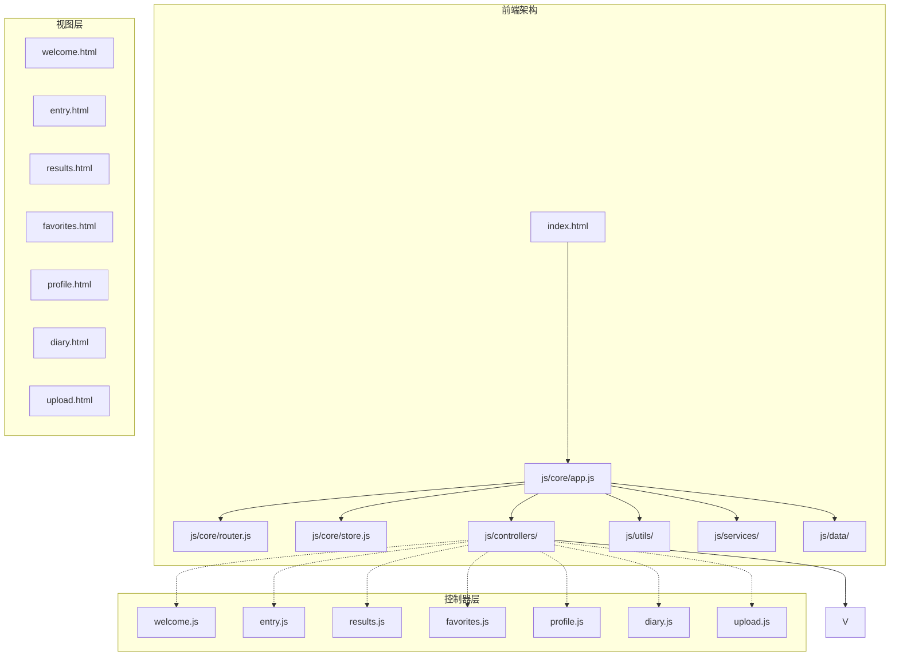
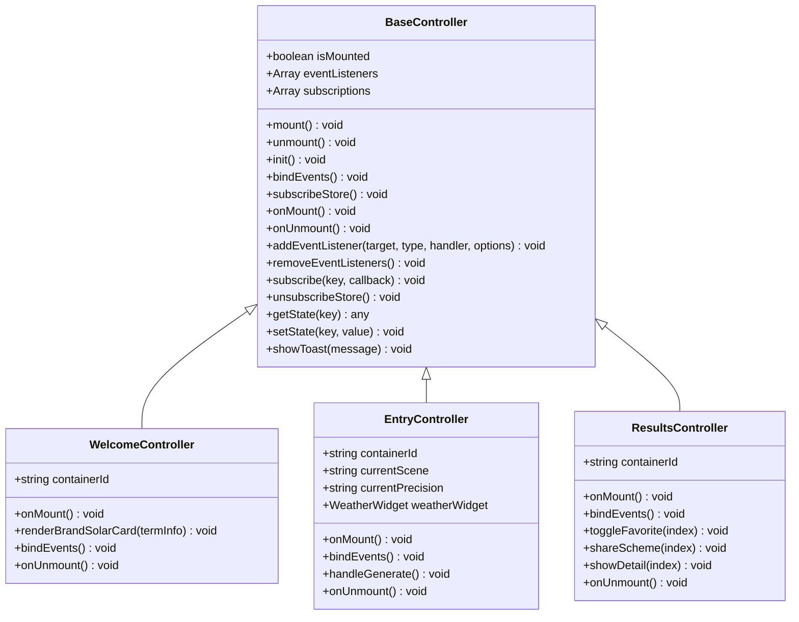
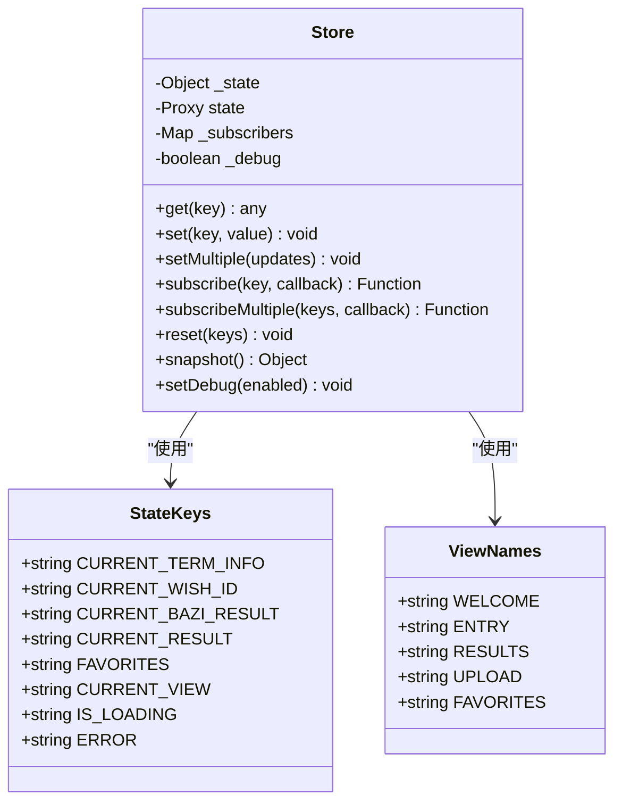
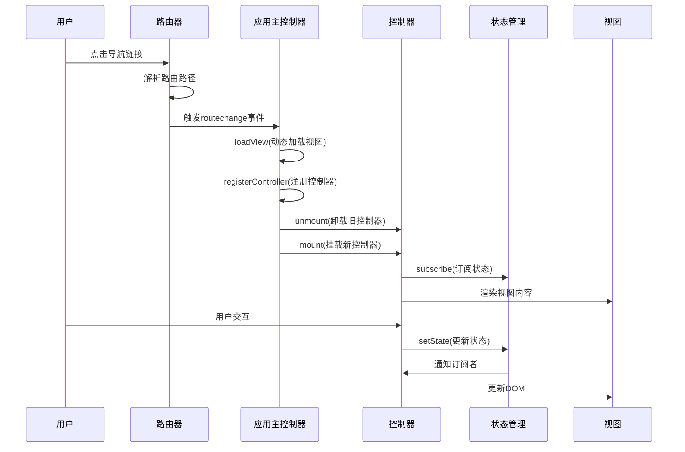
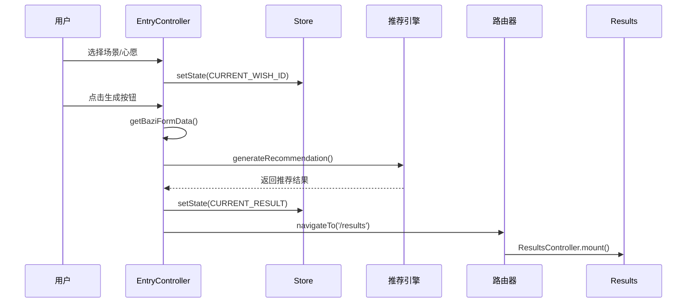
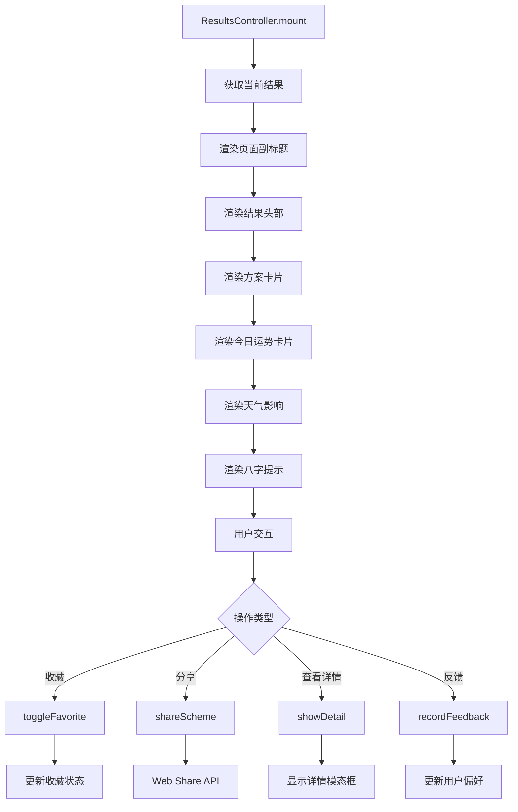
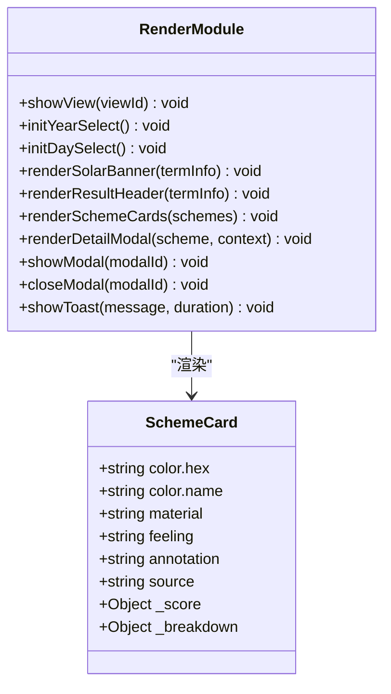
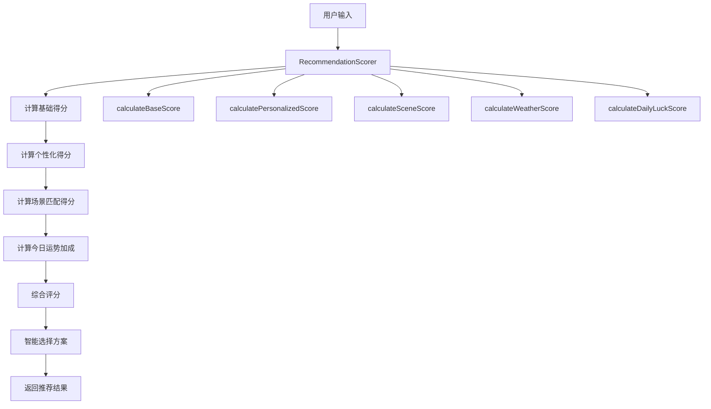
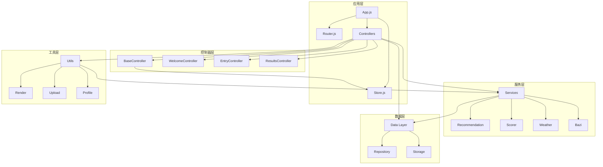

# MVC架构模式

<cite>
**本文档引用的文件**
- [js/controllers/base.js](file://js/controllers/base.js)
- [js/core/store.js](file://js/core/store.js)
- [js/core/app.js](file://js/core/app.js)
- [js/core/router.js](file://js/core/router.js)
- [js/controllers/welcome.js](file://js/controllers/welcome.js)
- [js/controllers/entry.js](file://js/controllers/entry.js)
- [js/controllers/results.js](file://js/controllers/results.js)
- [js/utils/render.js](file://js/utils/render.js)
- [js/services/recommendation.js](file://js/services/recommendation.js)
- [js/core/scorer.js](file://js/core/scorer.js)
- [js/data/repository.js](file://js/data/repository.js)
- [index.html](file://index.html)
</cite>

## 目录
1. [引言](#引言)
2. [项目结构](#项目结构)
3. [核心组件](#核心组件)
4. [架构概览](#架构概览)
5. [详细组件分析](#详细组件分析)
6. [依赖分析](#依赖分析)
7. [性能考虑](#性能考虑)
8. [故障排除指南](#故障排除指南)
9. [结论](#结论)

## 引言

五行穿搭建议项目是一个基于传统五行理论的个性化穿搭推荐系统。该项目采用MVC（Model-View-Controller）架构模式，通过清晰的职责分离实现了数据管理、视图渲染和业务逻辑处理的解耦。本文档将深入分析MVC模式在项目中的具体实现，包括BaseController基类的设计理念、Store状态管理机制与MVC的协同工作方式，以及各个功能模块的MVC实现。

## 项目结构

项目采用模块化的文件组织方式，按照功能层次进行划分：



**图表来源**
- [index.html](file://index.html#L1-L79)
- [js/core/app.js](file://js/core/app.js#L1-L206)

**章节来源**
- [index.html](file://index.html#L1-L79)
- [js/core/app.js](file://js/core/app.js#L1-L206)

## 核心组件

### BaseController基类设计

BaseController是整个MVC架构的核心基类，提供了统一的控制器生命周期管理和事件处理机制：



**图表来源**
- [js/controllers/base.js](file://js/controllers/base.js#L11-L131)
- [js/controllers/welcome.js](file://js/controllers/welcome.js#L13-L151)
- [js/controllers/entry.js](file://js/controllers/entry.js#L14-L241)
- [js/controllers/results.js](file://js/controllers/results.js#L13-L614)

BaseController的核心特性包括：

1. **生命周期管理**：提供mount/unmount方法，确保控制器的正确初始化和清理
2. **事件管理系统**：自动跟踪和清理事件监听器，防止内存泄漏
3. **状态订阅机制**：集成Store订阅，实现响应式UI更新
4. **工具方法**：提供统一的状态读写接口和Toast消息显示

**章节来源**
- [js/controllers/base.js](file://js/controllers/base.js#L1-L131)

### Store状态管理机制

Store模块实现了集中式的全局状态管理，采用Proxy代理模式实现响应式状态更新：



**图表来源**
- [js/core/store.js](file://js/core/store.js#L30-L212)

Store的关键特性：

1. **响应式状态**：使用Proxy拦截状态变更，自动触发订阅回调
2. **多键订阅**：支持单键和多键状态订阅，提高灵活性
3. **调试支持**：提供状态快照和调试开关
4. **安全重置**：支持选择性或完全重置状态

**章节来源**
- [js/core/store.js](file://js/core/store.js#L1-L212)

## 架构概览

项目采用MVC三层架构，通过App主控制器协调各模块间的交互：



**图表来源**
- [js/core/app.js](file://js/core/app.js#L145-L168)
- [js/core/router.js](file://js/core/router.js#L57-L79)

**章节来源**
- [js/core/app.js](file://js/core/app.js#L1-L206)
- [js/core/router.js](file://js/core/router.js#L1-L142)

## 详细组件分析

### 欢迎页控制器（WelcomeController）

WelcomeController展示了MVC模式在用户引导流程中的应用：

```mermaid
flowchart TD
A[用户进入应用] --> B[WelcomeController.mount]
B --> C[动态加载容器元素]
C --> D[绑定事件监听器]
D --> E[从Store获取节气信息]
E --> F[渲染节气横幅]
F --> G[绑定开始按钮事件]
G --> H[用户点击开始]
H --> I[navigateTo('/entry')]
I --> J[路由变化事件]
J --> K[EntryController挂载]
```

**图表来源**
- [js/controllers/welcome.js](file://js/controllers/welcome.js#L19-L150)

WelcomeController的MVC实现特点：

1. **Model层**：通过Store获取节气数据，无需直接访问外部API
2. **View层**：使用renderSolarBanner等工具函数进行DOM渲染
3. **Controller层**：处理用户交互，协调数据获取和视图更新

**章节来源**
- [js/controllers/welcome.js](file://js/controllers/welcome.js#L1-L151)

### 输入页控制器（EntryController）

EntryController负责处理用户输入和生成推荐结果：



**图表来源**
- [js/controllers/entry.js](file://js/controllers/entry.js#L131-L189)

EntryController的复杂业务逻辑处理：

1. **表单管理**：动态初始化年月日选择器，恢复上次输入
2. **精度控制**：支持简单和精确两种八字计算模式
3. **天气集成**：集成WeatherWidget组件提供实时天气信息
4. **数据持久化**：使用baziRepo保存用户输入

**章节来源**
- [js/controllers/entry.js](file://js/controllers/entry.js#L1-L241)

### 结果页控制器（ResultsController）

ResultsController实现了复杂的推荐结果展示和用户交互：



**图表来源**
- [js/controllers/results.js](file://js/controllers/results.js#L20-L46)

ResultsController的核心功能：

1. **个性化推荐**：基于用户偏好和历史反馈生成推荐
2. **动态评分**：集成RecommendationScorer进行智能评分
3. **用户反馈**：实现采纳和不喜欢两种反馈机制
4. **收藏管理**：集成favoritesRepo进行数据持久化

**章节来源**
- [js/controllers/results.js](file://js/controllers/results.js#L1-L614)

### 渲染工具模块（Render Module）

Render模块提供了统一的DOM渲染接口，体现了MVC中View层的最佳实践：



**图表来源**
- [js/utils/render.js](file://js/utils/render.js#L1-L487)

Render模块的设计优势：

1. **单一职责**：专门负责DOM操作，不参与业务逻辑
2. **可复用性**：提供通用的渲染函数，支持多种视图
3. **性能优化**：使用window.__currentSchemes缓存当前方案列表
4. **用户体验**：提供Toast消息和模态框等交互反馈

**章节来源**
- [js/utils/render.js](file://js/utils/render.js#L1-L487)

### 推荐算法服务

推荐算法模块展示了MVC中Model层的复杂数据处理能力：



**图表来源**
- [js/core/scorer.js](file://js/core/scorer.js#L29-L276)

推荐算法的核心特性：

1. **多维度评分**：支持节气、八字、场景、天气、心愿、历史、运势七个维度
2. **动态权重**：根据用户偏好调整各维度权重
3. **相生相克**：基于五行理论实现相生相克关系计算
4. **缓存机制**：使用Map缓存计算结果，提高性能

**章节来源**
- [js/core/scorer.js](file://js/core/scorer.js#L1-L317)

## 依赖分析

项目采用模块化设计，各组件间通过清晰的依赖关系协作：



**图表来源**
- [js/core/app.js](file://js/core/app.js#L6-L21)
- [js/controllers/base.js](file://js/controllers/base.js#L6-L6)

**章节来源**
- [js/core/app.js](file://js/core/app.js#L1-L206)
- [js/controllers/base.js](file://js/controllers/base.js#L1-L131)

## 性能考虑

### 内存管理

BaseController实现了完善的内存管理机制：

1. **事件监听器清理**：自动跟踪和移除所有事件监听器
2. **Store订阅管理**：统一管理Store订阅，防止内存泄漏
3. **控制器生命周期**：严格的mount/unmount生命周期管理

### 渲染优化

Render模块采用了多项性能优化策略：

1. **DOM缓存**：使用window.__currentSchemes缓存当前方案列表
2. **动画延迟**：方案卡片逐个显示，避免一次性大量DOM操作
3. **条件渲染**：只在必要时更新DOM元素

### 数据持久化

Repository模式提供了高效的数据持久化解决方案：

1. **批量操作**：支持批量读取和写入操作
2. **类型安全**：通过JSON序列化确保数据完整性
3. **错误处理**：使用safeStorage包装localStorage操作

## 故障排除指南

### 常见问题诊断

1. **控制器无法挂载**
   - 检查视图容器是否存在
   - 确认控制器继承自BaseController
   - 验证onMount方法是否正确实现

2. **状态更新不生效**
   - 确认订阅了正确的状态键
   - 检查Store.set方法调用
   - 验证订阅回调函数逻辑

3. **事件监听器失效**
   - 确认addEventListener方法使用正确
   - 检查事件绑定时机（应在onMount后）
   - 验证事件清理机制

### 调试技巧

1. **Store调试**
   ```javascript
   store.setDebug(true); // 启用调试模式
   console.log(store.snapshot()); // 查看状态快照
   ```

2. **控制器生命周期监控**
   - 在init、onMount、onUnmount方法中添加console.log
   - 监控事件监听器数量变化
   - 检查订阅数量和清理情况

3. **路由问题排查**
   - 检查路由配置是否正确
   - 验证视图文件路径
   - 确认控制器注册过程

**章节来源**
- [js/core/store.js](file://js/core/store.js#L184-L186)
- [js/controllers/base.js](file://js/controllers/base.js#L72-L85)

## 结论

五行穿搭建议项目成功地将MVC架构模式应用于单页应用开发中，实现了以下目标：

### 架构优势

1. **职责分离**：Model、View、Controller各司其职，代码结构清晰
2. **可维护性**：模块化设计便于功能扩展和代码维护
3. **可测试性**：清晰的接口设计支持单元测试和集成测试
4. **可扩展性**：插件化架构支持新功能快速集成

### 最佳实践总结

1. **BaseController基类**：提供了统一的生命周期管理和事件处理机制
2. **Store状态管理**：实现了响应式状态更新和订阅机制
3. **模块化设计**：按功能层次组织代码，提高可读性和可维护性
4. **性能优化**：采用缓存、延迟加载等技术提升用户体验

### 局限性分析

1. **学习成本**：MVC模式需要开发者理解各层职责和交互方式
2. **过度设计风险**：对于简单功能可能显得过于复杂
3. **调试复杂性**：多层抽象增加了调试难度
4. **性能开销**：频繁的状态更新可能带来性能影响

### 单页应用最佳实践

1. **路由管理**：使用history API实现无刷新导航
2. **状态管理**：集中式状态管理配合响应式更新
3. **组件复用**：合理设计可复用的组件和工具函数
4. **错误处理**：建立完善的错误处理和恢复机制

通过深入分析五行穿搭建议项目的MVC实现，我们可以看到现代前端开发中传统架构模式的优雅应用，为构建高质量的单页应用提供了宝贵的实践经验。