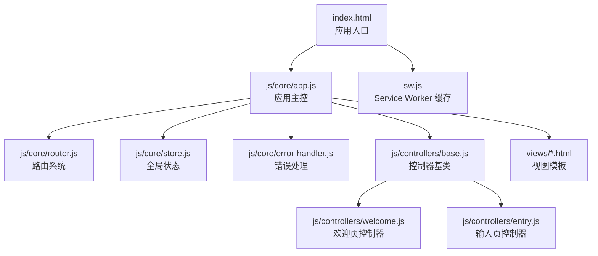
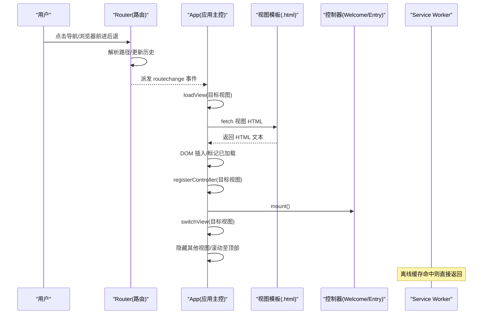
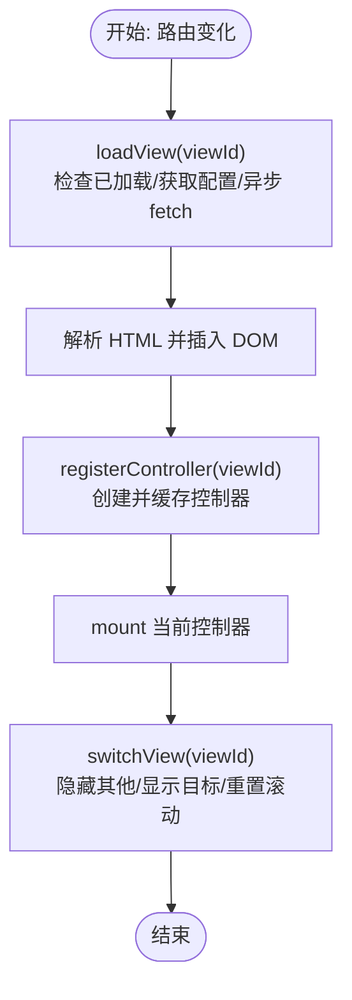
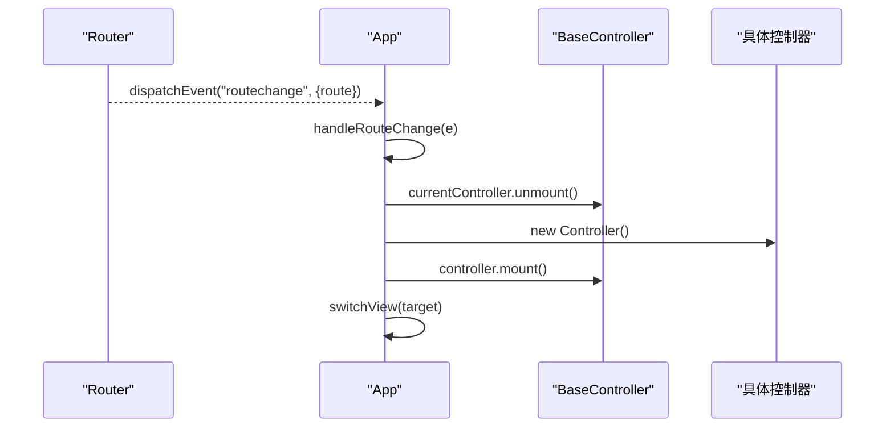
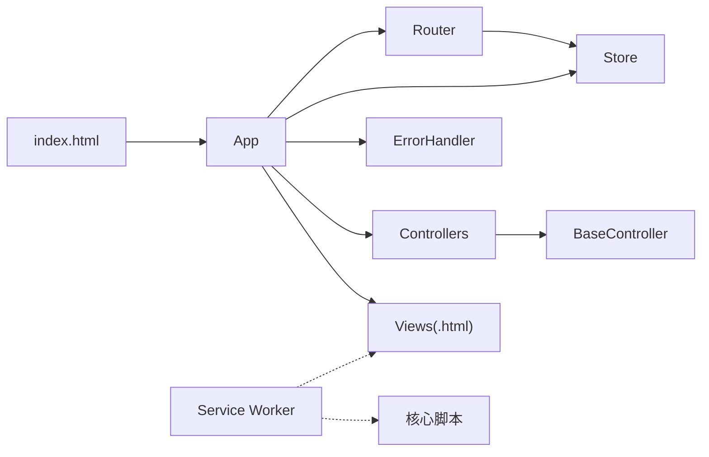

# 动态加载机制

<cite>
**本文引用的文件**
- [index.html](file://index.html)
- [sw.js](file://sw.js)
- [js/core/app.js](file://js/core/app.js)
- [js/core/router.js](file://js/core/router.js)
- [js/core/store.js](file://js/core/store.js)
- [js/core/error-handler.js](file://js/core/error-handler.js)
- [js/controllers/base.js](file://js/controllers/base.js)
- [js/controllers/welcome.js](file://js/controllers/welcome.js)
- [js/controllers/entry.js](file://js/controllers/entry.js)
- [js/utils/render.js](file://js/utils/render.js)
- [views/welcome.html](file://views/welcome.html)
- [views/entry.html](file://views/entry.html)
- [views/results.html](file://views/results.html)
</cite>

## 目录
1. [引言](#引言)
2. [项目结构](#项目结构)
3. [核心组件](#核心组件)
4. [架构总览](#架构总览)
5. [详细组件分析](#详细组件分析)
6. [依赖关系分析](#依赖关系分析)
7. [性能考量](#性能考量)
8. [故障排查指南](#故障排查指南)
9. [结论](#结论)
10. [附录](#附录)

## 引言
本文件围绕“五行穿搭建议”项目的动态加载机制进行系统性梳理，重点解释以下方面：
- 动态视图加载策略：按需加载、预加载与懒加载的实现原理与应用场景
- App 类中 loadView 方法的实现细节：视图 HTML 的异步加载、DOM 元素的动态插入与加载状态管理
- 控制器的动态注册机制：如何根据路由变化动态创建与销毁控制器实例
- 视图切换的实现原理：CSS 类切换、滚动位置重置与视图生命周期管理
- 性能优化策略：资源缓存、并发控制与错误处理
- 对用户体验与应用性能的影响及优化建议

## 项目结构
项目采用前端模块化与单页应用（SPA）架构，通过 Service Worker 提供离线缓存，配合路由系统与控制器驱动的视图动态加载。

图表来源
- [index.html](file://index.html#L58-L61)
- [js/core/app.js](file://js/core/app.js#L6-L21)
- [js/core/router.js](file://js/core/router.js#L9-L17)
- [js/core/store.js](file://js/core/store.js#L33-L51)
- [js/core/error-handler.js](file://js/core/error-handler.js#L5-L6)
- [js/controllers/base.js](file://js/controllers/base.js#L11-L16)
- [js/controllers/welcome.js](file://js/controllers/welcome.js#L13-L17)
- [js/controllers/entry.js](file://js/controllers/entry.js#L14-L21)
- [views/welcome.html](file://views/welcome.html#L1-L34)
- [views/entry.html](file://views/entry.html#L1-L234)
- [views/results.html](file://views/results.html#L1-L128)
- [sw.js](file://sw.js#L8-L47)

章节来源
- [index.html](file://index.html#L1-L79)
- [sw.js](file://sw.js#L1-L165)

## 核心组件
- 应用主控（App）：负责初始化、路由协调、全局事件、动态视图加载与控制器生命周期管理
- 路由系统（Router）：拦截链接点击与浏览器前进后退，维护当前路由状态并派发路由变化事件
- 控制器基类（BaseController）：提供 mount/unmount 生命周期、事件绑定与全局状态订阅能力
- 视图模板（views/*.html）：按需加载的静态 HTML 片段，作为视图容器
- Service Worker（sw.js）：离线缓存与 Stale-While-Revalidate 策略，提升加载性能与可用性
- 全局状态（store）：集中管理应用状态，驱动视图与控制器的响应式更新
- 错误处理（error-handler）：统一包装异步函数与网络请求，提供用户友好的错误提示

章节来源
- [js/core/app.js](file://js/core/app.js#L36-L196)
- [js/core/router.js](file://js/core/router.js#L25-L79)
- [js/controllers/base.js](file://js/controllers/base.js#L11-L131)
- [js/core/store.js](file://js/core/store.js#L30-L187)
- [js/core/error-handler.js](file://js/core/error-handler.js#L45-L79)
- [sw.js](file://sw.js#L52-L155)

## 架构总览
动态加载的整体流程如下：
- 应用启动时，预加载首屏视图并注册对应控制器
- 路由变化时，App 动态加载目标视图 HTML，注册控制器并卸载当前控制器
- 视图切换通过 CSS 类隐藏/显示与滚动重置实现
- Service Worker 在安装阶段预缓存核心资源，在 fetch 阶段采用缓存优先策略

图表来源
- [js/core/router.js](file://js/core/router.js#L27-L79)
- [js/core/app.js](file://js/core/app.js#L79-L104)
- [js/core/app.js](file://js/core/app.js#L110-L117)
- [js/core/app.js](file://js/core/app.js#L145-L184)
- [sw.js](file://sw.js#L112-L154)

## 详细组件分析

### App 类与动态视图加载
- 预加载与按需加载
  - 预加载：应用初始化时预加载首屏视图，减少首次进入延迟
  - 按需加载：路由变化时再加载目标视图，避免一次性加载全部视图
- 视图 HTML 异步加载
  - 使用 fetch 获取视图 HTML 文本
  - 通过临时容器解析并提取首个元素节点，再插入到应用容器
  - 使用 Set 记录已加载视图，避免重复加载
- 控制器动态注册
  - VIEW_CONFIG 将视图 ID 映射到控制器构造函数与 HTML 路径
  - registerController 根据视图 ID 创建控制器实例并缓存
- 视图切换
  - switchView 隐藏所有视图，显示目标视图并重置滚动位置
- 错误处理
  - loadView 内部捕获异常并记录日志，保证应用稳定性

图表来源
- [js/core/app.js](file://js/core/app.js#L79-L104)
- [js/core/app.js](file://js/core/app.js#L110-L117)
- [js/core/app.js](file://js/core/app.js#L145-L184)

章节来源
- [js/core/app.js](file://js/core/app.js#L23-L31)
- [js/core/app.js](file://js/core/app.js#L47-L73)
- [js/core/app.js](file://js/core/app.js#L79-L104)
- [js/core/app.js](file://js/core/app.js#L110-L117)
- [js/core/app.js](file://js/core/app.js#L145-L184)

### 路由系统与控制器生命周期
- 路由拦截
  - 拦截链接点击与 popstate 事件，统一通过 navigateTo 更新历史与标题
  - 触发 routechange 事件，携带当前与上一路径信息
- 控制器生命周期
  - BaseController 提供 mount/unmount 生命周期钩子
  - BaseController 在 mount 后绑定事件，确保子类容器已就绪
  - App 在切换视图时先卸载当前控制器，再挂载新控制器

图表来源
- [js/core/router.js](file://js/core/router.js#L57-L79)
- [js/controllers/base.js](file://js/controllers/base.js#L21-L42)
- [js/core/app.js](file://js/core/app.js#L145-L168)

章节来源
- [js/core/router.js](file://js/core/router.js#L25-L79)
- [js/controllers/base.js](file://js/controllers/base.js#L11-L131)
- [js/core/app.js](file://js/core/app.js#L145-L168)

### 视图模板与 DOM 结构
- 视图模板以独立 HTML 文件存在，包含唯一视图容器元素与语义化结构
- App 将视图 HTML 解析后插入到应用容器中，视图默认 hidden 或可见
- 控制器在 onMount 中定位容器并绑定事件，渲染内容

章节来源
- [views/welcome.html](file://views/welcome.html#L1-L34)
- [views/entry.html](file://views/entry.html#L1-L234)
- [views/results.html](file://views/results.html#L1-L128)
- [js/core/app.js](file://js/core/app.js#L91-L100)
- [js/controllers/welcome.js](file://js/controllers/welcome.js#L19-L35)
- [js/controllers/entry.js](file://js/controllers/entry.js#L23-L43)

### Service Worker 与资源缓存
- 预缓存：安装阶段缓存核心脚本、样式、视图与数据文件
- 缓存优先：fetch 拦截 GET 请求，优先返回缓存；后台异步更新缓存
- Stale-While-Revalidate：命中缓存后立即返回，同时发起网络请求更新缓存，提升首屏速度与一致性

章节来源
- [sw.js](file://sw.js#L52-L94)
- [sw.js](file://sw.js#L112-L154)

### 错误处理与用户体验
- withErrorHandler 包装异步函数，统一分发错误类型与用户提示
- initGlobalErrorHandler 捕获未处理异常与 Promise 拒绝，避免页面崩溃
- showToast 提供全局提示，改善用户反馈

章节来源
- [js/core/error-handler.js](file://js/core/error-handler.js#L45-L79)
- [js/core/error-handler.js](file://js/core/error-handler.js#L168-L189)
- [js/utils/render.js](file://js/utils/render.js#L457-L486)

## 依赖关系分析
- App 依赖 Router、Store、ErrorHandler、各控制器与视图配置
- 控制器依赖 BaseController、Router、Render 工具与数据仓库
- Router 依赖 Store 以同步当前视图状态
- Service Worker 与静态资源清单相互独立但共同提升性能

图表来源
- [js/core/app.js](file://js/core/app.js#L6-L21)
- [js/core/router.js](file://js/core/router.js#L6-L7)
- [js/core/store.js](file://js/core/store.js#L190-L212)
- [js/core/error-handler.js](file://js/core/error-handler.js#L5-L6)
- [js/controllers/base.js](file://js/controllers/base.js#L6-L7)
- [index.html](file://index.html#L58-L61)
- [sw.js](file://sw.js#L8-L47)

章节来源
- [js/core/app.js](file://js/core/app.js#L6-L21)
- [js/core/router.js](file://js/core/router.js#L6-L7)
- [js/core/store.js](file://js/core/store.js#L190-L212)
- [js/core/error-handler.js](file://js/core/error-handler.js#L5-L6)
- [js/controllers/base.js](file://js/controllers/base.js#L6-L7)
- [index.html](file://index.html#L58-L61)
- [sw.js](file://sw.js#L8-L47)

## 性能考量
- 资源缓存
  - Service Worker 预缓存核心资源，显著降低二次访问延迟
  - fetch 拦截采用缓存优先与后台更新策略，兼顾速度与新鲜度
- 并发控制
  - loadView 使用 Set 避免重复加载；建议在高并发路由切换时增加队列或去抖
- 错误处理
  - withErrorHandler 与 initGlobalErrorHandler 保障异常可控，减少页面崩溃
- 视图切换
  - switchView 仅切换 CSS 类与滚动重置，避免复杂动画导致卡顿
- 数据与渲染
  - render 工具集中处理 DOM 更新，避免频繁重排与回流

章节来源
- [sw.js](file://sw.js#L52-L94)
- [sw.js](file://sw.js#L112-L154)
- [js/core/app.js](file://js/core/app.js#L79-L104)
- [js/core/app.js](file://js/core/app.js#L174-L184)
- [js/core/error-handler.js](file://js/core/error-handler.js#L45-L79)
- [js/utils/render.js](file://js/utils/render.js#L13-L21)

## 故障排查指南
- 视图未显示
  - 检查视图 HTML 是否成功加载与插入 DOM
  - 确认 switchView 是否正确移除其他视图的 hidden 类并显示目标视图
- 控制器未挂载
  - 确认 registerController 是否被调用且控制器构造函数正确
  - 检查 BaseController.mount 是否执行 bindEvents 与 onMount
- 路由无效
  - 检查 ROUTES 配置与 navigateTo 是否正确派发 routechange
- 网络错误
  - 使用 withErrorHandler 包装异步函数，查看控制台错误日志
  - 确认 Service Worker 是否正常激活与缓存命中

章节来源
- [js/core/app.js](file://js/core/app.js#L145-L184)
- [js/controllers/base.js](file://js/controllers/base.js#L21-L42)
- [js/core/router.js](file://js/core/router.js#L57-L79)
- [js/core/error-handler.js](file://js/core/error-handler.js#L45-L79)
- [sw.js](file://sw.js#L74-L94)

## 结论
本项目通过 App 的动态视图加载、Router 的路由协调与 BaseController 的生命周期管理，实现了高效的 SPA 视图切换。结合 Service Worker 的离线缓存与统一错误处理，既提升了首屏性能与可用性，也增强了用户体验与稳定性。后续可在高并发路由切换场景引入队列/去抖与更细粒度的缓存策略，进一步优化性能与一致性。

## 附录
- 关键实现路径参考
  - 动态视图加载：[loadView](file://js/core/app.js#L79-L104)
  - 控制器注册：[registerController](file://js/core/app.js#L110-L117)
  - 路由变化处理：[handleRouteChange](file://js/core/app.js#L145-L168)
  - 视图切换：[switchView](file://js/core/app.js#L174-L184)
  - 路由初始化与导航：[initRouter/navigateTo](file://js/core/router.js#L25-L79)
  - 控制器基类生命周期：[BaseController](file://js/controllers/base.js#L21-L42)
  - Service Worker 预缓存与 fetch 拦截：[sw.js](file://sw.js#L52-L154)
  - 全局错误处理：[withErrorHandler/initGlobalErrorHandler](file://js/core/error-handler.js#L45-L79)