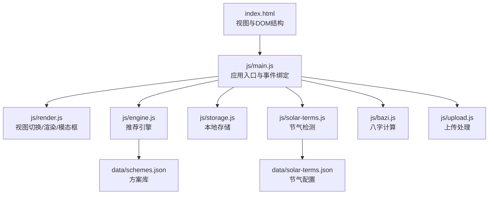
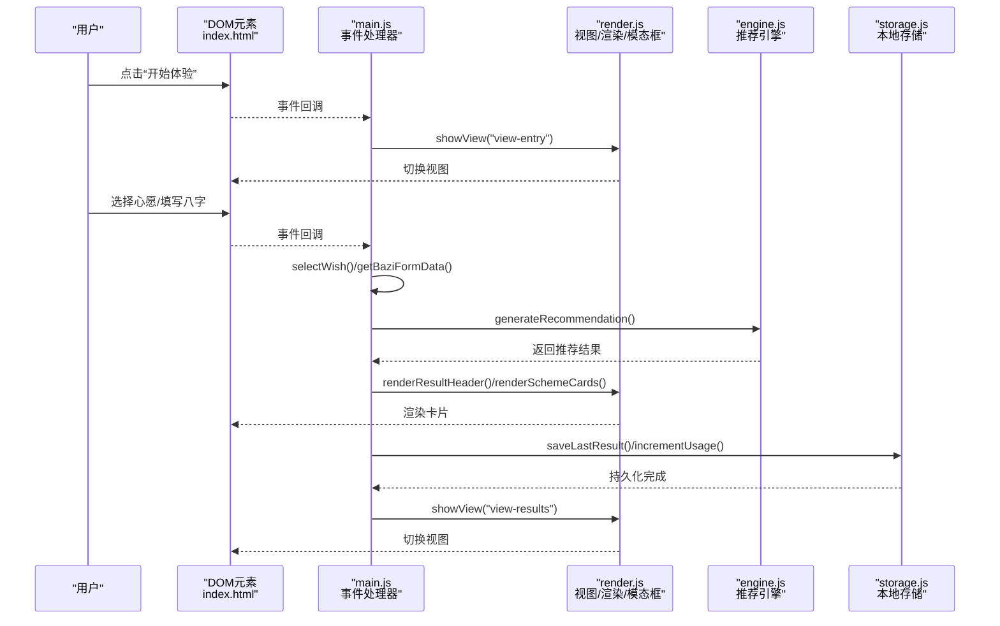
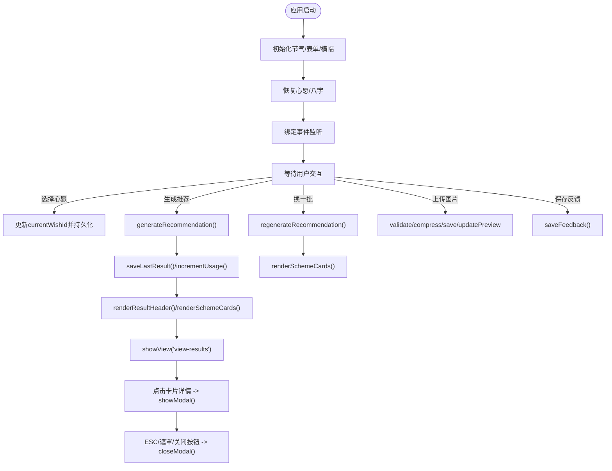
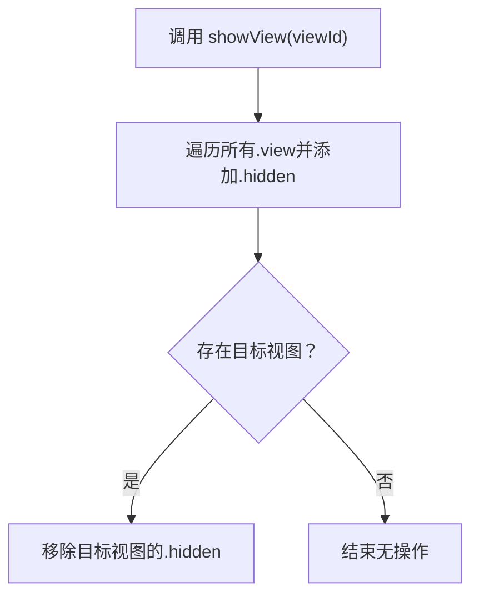
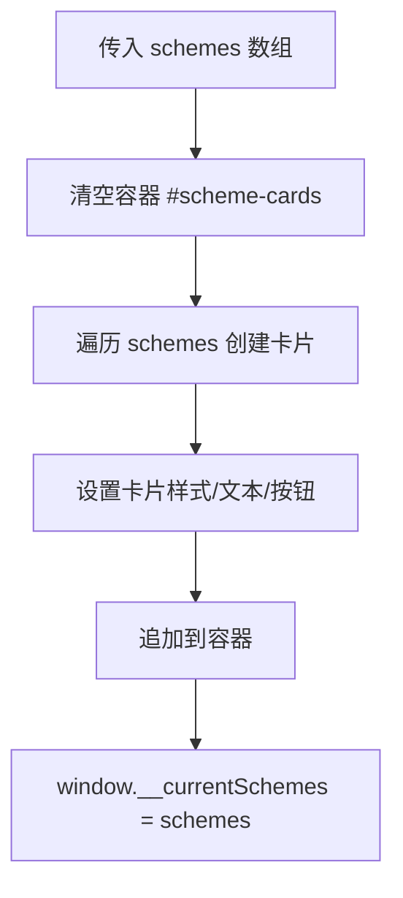
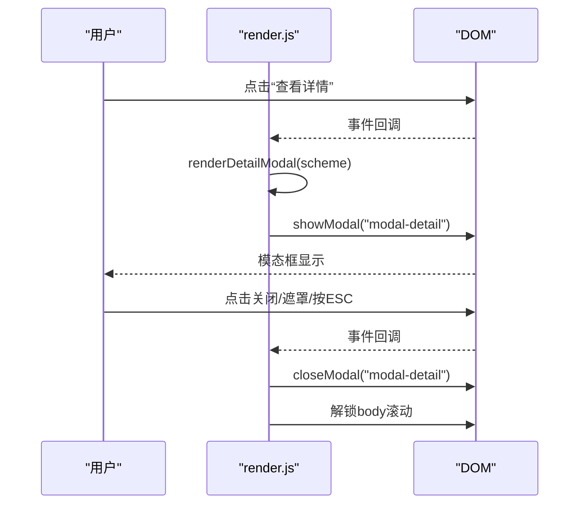
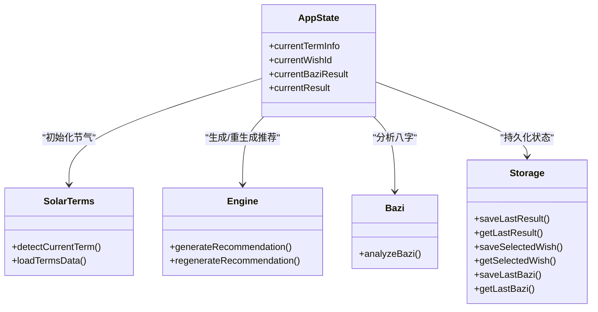
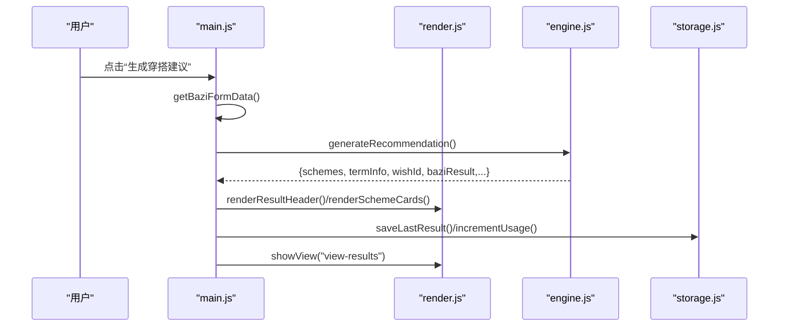
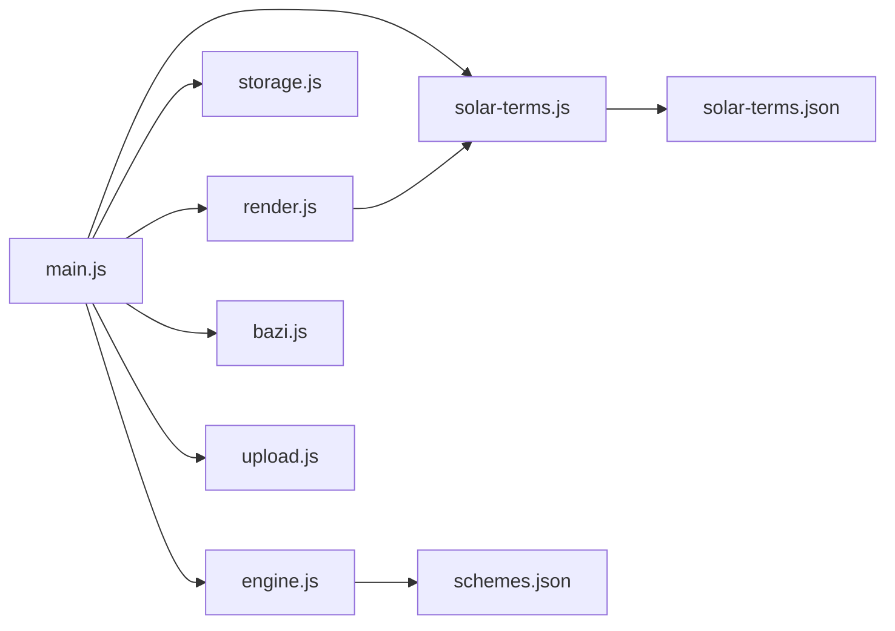

# UI状态管理

<cite>
**本文引用的文件**
- [index.html](file://index.html)
- [main.js](file://js/main.js)
- [render.js](file://js/render.js)
- [storage.js](file://js/storage.js)
- [engine.js](file://js/engine.js)
- [bazi.js](file://js/bazi.js)
- [solar-terms.js](file://js/solar-terms.js)
- [upload.js](file://js/upload.js)
- [schemes.json](file://data/schemes.json)
- [solar-terms.json](file://data/solar-terms.json)
</cite>

## 目录
1. [简介](#简介)
2. [项目结构](#项目结构)
3. [核心组件](#核心组件)
4. [架构总览](#架构总览)
5. [详细组件分析](#详细组件分析)
6. [依赖分析](#依赖分析)
7. [性能考虑](#性能考虑)
8. [故障排查指南](#故障排查指南)
9. [结论](#结论)

## 简介
本文件聚焦“五行穿搭建议”项目的UI状态管理数据流，系统梳理从状态更新、视图切换、数据渲染到数据持久化的完整链路。重点解释以下关键状态管理操作：
- 视图切换函数 showView()
- 数据渲染 renderSchemeCards()
- 模态框处理 showModal()/closeModal()
- 应用状态 currentTermInfo、currentWishId、currentBaziResult、currentResult 的传递与更新机制
- 状态变化对UI渲染的影响、事件驱动的状态更新、状态同步与一致性保障
- 状态管理最佳实践与性能优化建议

## 项目结构
应用采用模块化组织，HTML定义视图骨架，JS模块负责状态、渲染、业务逻辑与持久化，JSON数据提供静态配置与方案库。

图表来源
- [index.html](file://index.html#L20-L236)
- [main.js](file://js/main.js#L1-L317)
- [render.js](file://js/render.js#L1-L272)
- [engine.js](file://js/engine.js#L1-L335)
- [storage.js](file://js/storage.js#L1-L116)
- [solar-terms.js](file://js/solar-terms.js#L1-L118)
- [bazi.js](file://js/bazi.js#L1-L193)
- [upload.js](file://js/upload.js#L1-L145)
- [schemes.json](file://data/schemes.json#L1-L509)
- [solar-terms.json](file://data/solar-terms.json#L1-L42)

章节来源
- [index.html](file://index.html#L20-L236)
- [main.js](file://js/main.js#L1-L317)

## 核心组件
- 应用状态区：集中于 main.js 中的四个全局状态变量，承载当前节气、心愿、八字与推荐结果。
- 视图与事件：index.html 提供多视图容器与交互元素，main.js 绑定事件驱动状态变更。
- 渲染层：render.js 负责视图切换、卡片渲染、模态框显示与Toast提示。
- 引擎与数据：engine.js 基于节气、心愿、八字生成/重生成推荐；solar-terms.js 与 bazi.js 提供基础数据与计算。
- 持久化：storage.js 封装localStorage存取，支持心愿、八字、结果、反馈、上传图片与使用统计。
- 上传与预览：upload.js 负责文件校验、压缩、拖拽/点击上传与预览更新。

章节来源
- [main.js](file://js/main.js#L17-L22)
- [render.js](file://js/render.js#L8-L16)
- [storage.js](file://js/storage.js#L51-L115)
- [engine.js](file://js/engine.js#L268-L334)
- [solar-terms.js](file://js/solar-terms.js#L36-L103)
- [bazi.js](file://js/bazi.js#L182-L192)
- [upload.js](file://js/upload.js#L12-L144)

## 架构总览
下图展示从用户交互到UI渲染与持久化的端到端数据流。

图表来源
- [index.html](file://index.html#L24-L155)
- [main.js](file://js/main.js#L72-L244)
- [render.js](file://js/render.js#L8-L127)
- [engine.js](file://js/engine.js#L268-L310)
- [storage.js](file://js/storage.js#L60-L99)

## 详细组件分析

### 状态与生命周期
- 初始化阶段：main.js 在页面加载完成后初始化节气信息、表单、节气横幅，并恢复上次心愿与八字。
- 运行阶段：事件驱动的状态更新贯穿应用，包括心愿选择、生成推荐、换一批、上传图片、保存反馈等。
- 结果阶段：推荐结果被持久化，视图切换至结果页，渲染方案卡片并暴露详情模态框。

图表来源
- [main.js](file://js/main.js#L26-L67)
- [main.js](file://js/main.js#L158-L164)
- [main.js](file://js/main.js#L202-L244)
- [main.js](file://js/main.js#L249-L269)
- [main.js](file://js/main.js#L274-L292)
- [main.js](file://js/main.js#L297-L313)
- [render.js](file://js/render.js#L198-L215)
- [render.js](file://js/render.js#L114-L127)

章节来源
- [main.js](file://js/main.js#L26-L67)
- [main.js](file://js/main.js#L158-L164)
- [main.js](file://js/main.js#L202-L244)
- [main.js](file://js/main.js#L249-L269)
- [main.js](file://js/main.js#L274-L292)
- [main.js](file://js/main.js#L297-L313)
- [render.js](file://js/render.js#L198-L215)
- [render.js](file://js/render.js#L114-L127)

### 视图切换 showView()
- 功能：隐藏所有视图容器，显示目标视图。
- 实现要点：通过类名控制隐藏/显示，确保同一时刻仅有一个视图可见。
- 影响范围：欢迎页、信息输入页、结果页、上传页。

图表来源
- [render.js](file://js/render.js#L8-L16)

章节来源
- [render.js](file://js/render.js#L8-L16)

### 数据渲染 renderSchemeCards()
- 功能：将推荐方案数组渲染为卡片列表，注入动画延迟，保存到全局供详情模态框使用。
- 实现要点：清空容器、逐项创建卡片节点、设置关键词与注释、保存 window.__currentSchemes。
- 性能注意：批量插入DOM，避免频繁回流；动画延迟通过样式属性实现。

图表来源
- [render.js](file://js/render.js#L114-L127)

章节来源
- [render.js](file://js/render.js#L114-L127)

### 模态框处理 showModal()/closeModal()
- 功能：显示/关闭详情模态框，同时锁定/释放body滚动。
- 实现要点：切换模态框 hidden 类，设置 body overflow 控制滚动。
- 事件绑定：模态框关闭按钮、遮罩层点击、ESC键。

图表来源
- [render.js](file://js/render.js#L159-L193)
- [render.js](file://js/render.js#L198-L215)
- [main.js](file://js/main.js#L138-L152)

章节来源
- [render.js](file://js/render.js#L159-L193)
- [render.js](file://js/render.js#L198-L215)
- [main.js](file://js/main.js#L138-L152)

### 应用状态 currentTermInfo、currentWishId、currentBaziResult、currentResult
- currentTermInfo：节气信息，包含当前节气、下个节气、季节与五行名称，初始化于应用启动。
- currentWishId：用户选择的心愿ID，支持恢复与持久化。
- currentBaziResult：八字分析结果，包含四柱、五行分布与推荐。
- currentResult：最终推荐结果，包含方案数组、节气信息、心愿ID、八字结果与生成时间。

图表来源
- [main.js](file://js/main.js#L17-L22)
- [solar-terms.js](file://js/solar-terms.js#L36-L103)
- [engine.js](file://js/engine.js#L268-L334)
- [bazi.js](file://js/bazi.js#L182-L192)
- [storage.js](file://js/storage.js#L51-L115)

章节来源
- [main.js](file://js/main.js#L17-L22)
- [solar-terms.js](file://js/solar-terms.js#L36-L103)
- [engine.js](file://js/engine.js#L268-L334)
- [bazi.js](file://js/bazi.js#L182-L192)
- [storage.js](file://js/storage.js#L51-L115)

### 事件驱动的状态更新与UI渲染
- 心愿选择：selectWish() 更新激活态样式并写入持久化。
- 生成推荐：handleGenerate() 收集八字表单，分析八字，调用引擎生成推荐，渲染结果并切换视图。
- 换一批：handleRegenerate() 基于排除ID重新生成，更新渲染并持久化。
- 上传图片：handleFileUpload() 校验/压缩/保存/预览，更新使用统计。
- 保存反馈：handleSaveFeedback() 写入当日反馈并清空输入。

图表来源
- [main.js](file://js/main.js#L202-L244)
- [render.js](file://js/render.js#L104-L127)
- [engine.js](file://js/engine.js#L268-L310)
- [storage.js](file://js/storage.js#L60-L99)

章节来源
- [main.js](file://js/main.js#L202-L244)
- [render.js](file://js/render.js#L104-L127)
- [engine.js](file://js/engine.js#L268-L310)
- [storage.js](file://js/storage.js#L60-L99)

### 状态同步与一致性保障
- 单一事实源：推荐结果 currentResult 作为渲染与持久化的唯一依据。
- 事件顺序：生成/重生成均先更新内存状态，再渲染，最后持久化，保证UI与存储一致。
- 全局共享：renderSchemeCards() 将当前方案数组保存到 window.__currentSchemes，供详情模态框读取，避免重复加载。

章节来源
- [main.js](file://js/main.js#L230-L240)
- [main.js](file://js/main.js#L261-L268)
- [render.js](file://js/render.js#L125-L127)

## 依赖分析
- 模块耦合：
  - main.js 依赖 render.js、storage.js、engine.js、solar-terms.js、bazi.js、upload.js。
  - render.js 依赖 solar-terms.js 的颜色映射。
  - engine.js 依赖 data/schemes.json 与 data/solar-terms.json。
- 外部依赖：fetch 用于加载JSON数据；localStorage 用于本地持久化；FileReader/Canvas 用于图片压缩。

图表来源
- [main.js](file://js/main.js#L5-L15)
- [render.js](file://js/render.js#L1-L16)
- [engine.js](file://js/engine.js#L39-L79)
- [solar-terms.js](file://js/solar-terms.js#L18-L29)

章节来源
- [main.js](file://js/main.js#L5-L15)
- [engine.js](file://js/engine.js#L39-L79)
- [solar-terms.js](file://js/solar-terms.js#L18-L29)

## 性能考虑
- 渲染优化
  - 批量DOM插入：renderSchemeCards() 清空容器后一次性追加卡片，减少回流。
  - 动画延迟：通过样式属性设置动画延迟，避免逐项设置样式带来的抖动。
- I/O优化
  - 并行加载：generateRecommendation() 使用 Promise.all 并行加载方案、心愿模板与八字模板。
  - 缓存策略：engine.js 内部缓存已加载数据，避免重复请求。
- 存储优化
  - localStorage封装：storage.js 统一封装序列化/反序列化与异常处理，降低错误风险。
  - 前缀隔离：统一前缀避免键冲突。
- 上传优化
  - 压缩策略：upload.js 先按最大边缩放，再按目标大小调整质量，兼顾清晰度与体积。
  - 事件去抖：input重置以允许重复选择同一文件，避免事件阻塞。

章节来源
- [render.js](file://js/render.js#L114-L127)
- [engine.js](file://js/engine.js#L270-L274)
- [storage.js](file://js/storage.js#L7-L23)
- [upload.js](file://js/upload.js#L31-L82)

## 故障排查指南
- 生成失败
  - 现象：生成推荐后提示失败。
  - 排查：检查 generateRecommendation() 是否返回有效结果；确认 data/schemes.json 可正常加载。
  - 参考路径：[main.js](file://js/main.js#L230-L244)，[engine.js](file://js/engine.js#L268-L310)
- 换一批无效
  - 现象：点击“换一批”无响应或提示暂无更多。
  - 排查：确认 excludeIds 正确传递；检查 available 过滤是否生效。
  - 参考路径：[main.js](file://js/main.js#L252-L269)，[engine.js](file://js/engine.js#L315-L334)
- 模态框无法关闭
  - 现象：点击关闭/遮罩/ESC无效。
  - 排查：确认事件绑定是否存在；检查 showModal()/closeModal() 是否被正确调用。
  - 参考路径：[main.js](file://js/main.js#L138-L152)，[render.js](file://js/render.js#L198-L215)
- 上传失败
  - 现象：上传后提示失败或无预览。
  - 排查：验证文件类型/大小；检查压缩过程与异常捕获；确认本地存储写入。
  - 参考路径：[main.js](file://js/main.js#L274-L292)，[upload.js](file://js/upload.js#L12-L82)，[storage.js](file://js/storage.js#L83-L89)

章节来源
- [main.js](file://js/main.js#L230-L244)
- [main.js](file://js/main.js#L252-L269)
- [main.js](file://js/main.js#L138-L152)
- [render.js](file://js/render.js#L198-L215)
- [main.js](file://js/main.js#L274-L292)
- [upload.js](file://js/upload.js#L12-L82)
- [storage.js](file://js/storage.js#L83-L89)

## 结论
本项目通过明确的模块职责与事件驱动的状态更新，实现了从节气、心愿、八字到推荐方案的完整数据流。showView()、renderSchemeCards()、showModal()/closeModal() 等关键函数构成了UI状态管理的核心能力。配合storage.js的本地持久化与engine.js的高效推荐算法，系统在保证一致性的同时具备良好的扩展性与可维护性。建议后续可在以下方面持续优化：
- 将 window.__currentSchemes 改为模块级私有状态，避免全局污染。
- 对渲染函数增加防抖/节流，提升复杂场景下的交互流畅度。
- 增加错误边界与重试机制，提升上传与网络请求的鲁棒性。