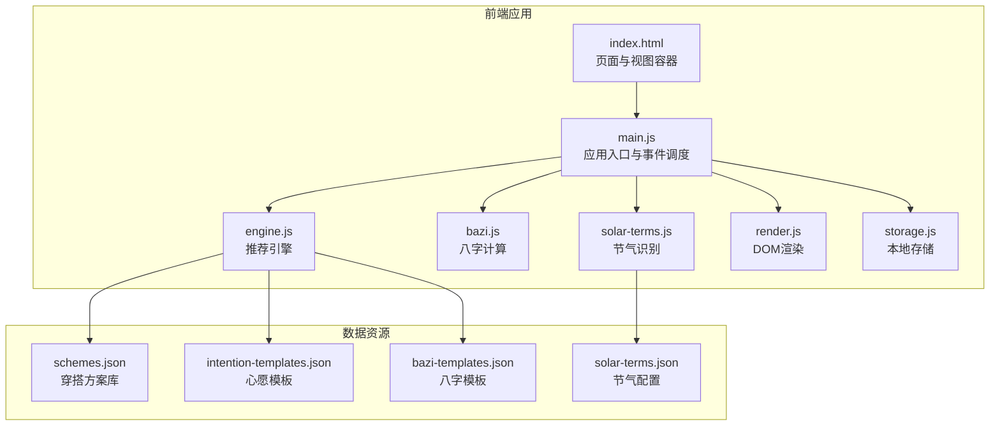
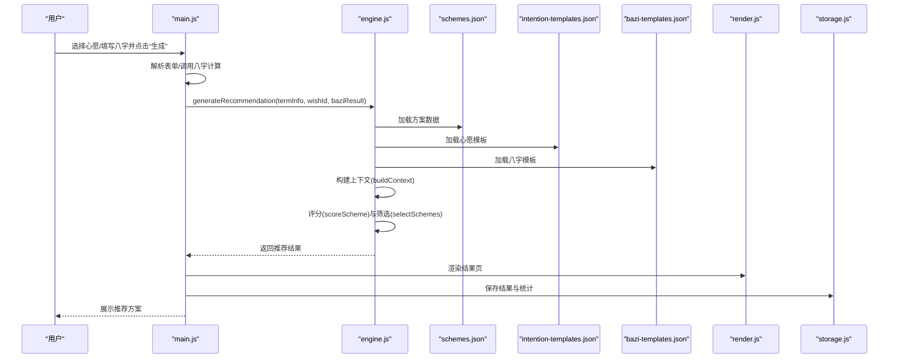
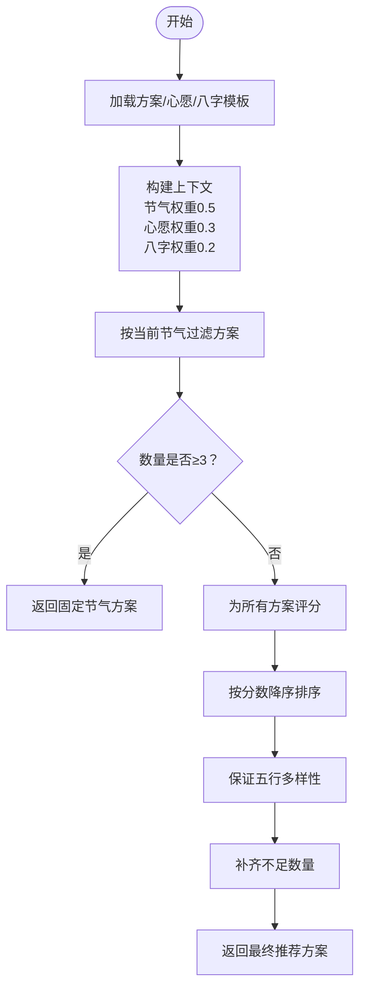
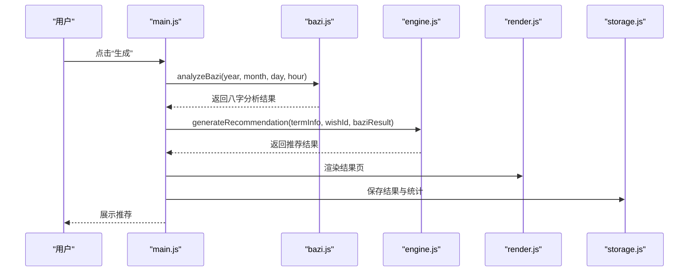
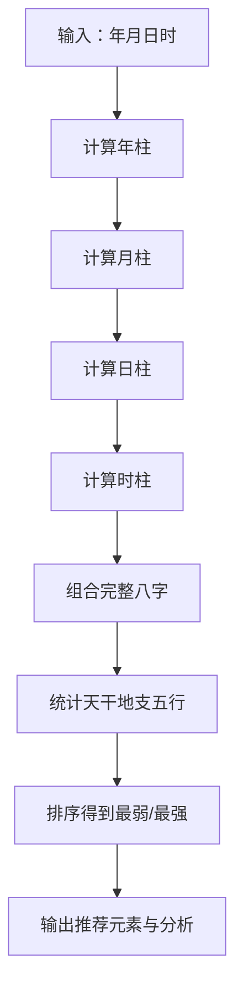
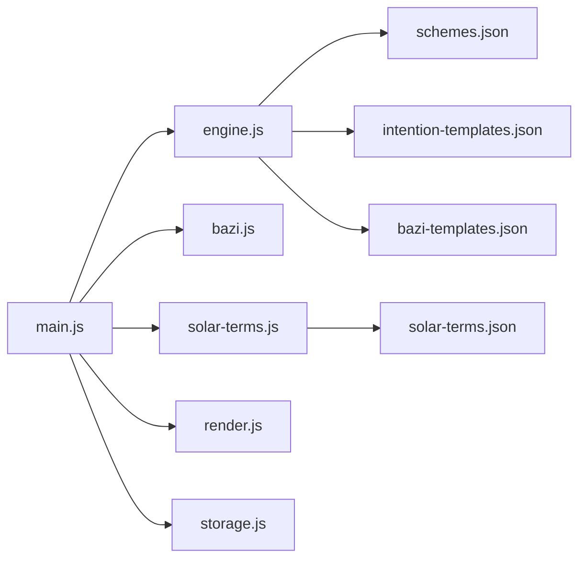

# 推荐计算与算法

<cite>
**本文引用的文件列表**
- [engine.js](file://js/engine.js)
- [main.js](file://js/main.js)
- [bazi.js](file://js/bazi.js)
- [solar-terms.js](file://js/solar-terms.js)
- [render.js](file://js/render.js)
- [storage.js](file://js/storage.js)
- [schemes.json](file://data/schemes.json)
- [intention-templates.json](file://data/intention-templates.json)
- [bazi-templates.json](file://data/bazi-templates.json)
- [solar-terms.json](file://data/solar-terms.json)
- [index.html](file://index.html)
</cite>

## 目录
1. [简介](#简介)
2. [项目结构](#项目结构)
3. [核心组件](#核心组件)
4. [架构总览](#架构总览)
5. [详细组件分析](#详细组件分析)
6. [依赖关系分析](#依赖关系分析)
7. [性能考量](#性能考量)
8. [故障排查指南](#故障排查指南)
9. [结论](#结论)

## 简介
本文件面向“五行穿搭建议”项目，聚焦推荐系统的数据流与算法实现，系统性梳理从输入参数接收、数据加载、算法计算到最终结果输出的完整流程。重点解释 generateRecommendation() 与 regenerateRecommendation() 的数据传递机制、权重计算逻辑、方案筛选算法，并分析 schemes.json、intention-templates.json、bazi-templates.json 的读取与匹配规则，以及算法参数传递、中间结果存储与传递、结果排序与过滤机制。最后给出性能优化建议与调试技巧，帮助开发者快速定位问题并提升系统稳定性与效率。

## 项目结构
项目采用前端单页应用架构，核心模块包括：
- 引擎模块：负责数据加载、上下文构建、评分与筛选、推荐生成与重生成
- 应用入口：负责初始化、事件绑定、调用引擎、渲染与存储
- 八字模块：负责八字计算、五行统计与推荐元素
- 节气模块：负责节气检测、当前节气与季节信息
- 渲染模块：负责视图切换、卡片渲染、模态框与提示
- 存储模块：负责本地持久化与统计数据
- 数据资源：包含方案、节气、心愿模板、八字模板等JSON数据

图表来源
- [index.html](file://index.html#L1-L236)
- [main.js](file://js/main.js#L1-L317)
- [engine.js](file://js/engine.js#L1-L335)
- [bazi.js](file://js/bazi.js#L1-L193)
- [solar-terms.js](file://js/solar-terms.js#L1-L118)
- [render.js](file://js/render.js#L1-L272)
- [storage.js](file://js/storage.js#L1-L116)
- [schemes.json](file://data/schemes.json#L1-L509)
- [intention-templates.json](file://data/intention-templates.json#L1-L253)
- [bazi-templates.json](file://data/bazi-templates.json#L1-L103)
- [solar-terms.json](file://data/solar-terms.json#L1-L42)

章节来源
- [index.html](file://index.html#L1-L236)
- [main.js](file://js/main.js#L1-L317)
- [engine.js](file://js/engine.js#L1-L335)

## 核心组件
- 推荐引擎（engine.js）
  - 数据加载：异步加载方案、心愿模板、八字模板
  - 上下文构建：整合节气、心愿、八字信息
  - 评分与筛选：基于五行相生/相克与权重进行打分与多样性保证
  - 结果封装：返回推荐方案、模板与生成时间戳
- 应用入口（main.js）
  - 初始化：加载节气、恢复用户选择、绑定事件
  - 调用引擎：生成与重生成推荐
  - 渲染与存储：渲染结果、保存结果与使用统计
- 八字模块（bazi.js）
  - 计算四柱：年、月、日、时柱
  - 五行统计：天干地支计数
  - 推荐元素：最弱五行作为推荐补充方向
- 节气模块（solar-terms.js）
  - 当前节气检测：基于solar-terms.json解析当前节气与季节
  - 五行颜色映射：用于界面展示
- 渲染模块（render.js）
  - 视图切换：欢迎页、输入页、结果页、上传页、详情模态框
  - 卡片渲染：方案卡片与详情展示
  - 提示与预览：Toast消息与上传预览
- 存储模块（storage.js）
  - 本地持久化：八字、结果、反馈、上传、使用统计
  - 前缀键管理：统一命名空间避免冲突

章节来源
- [engine.js](file://js/engine.js#L1-L335)
- [main.js](file://js/main.js#L1-L317)
- [bazi.js](file://js/bazi.js#L1-L193)
- [solar-terms.js](file://js/solar-terms.js#L1-L118)
- [render.js](file://js/render.js#L1-L272)
- [storage.js](file://js/storage.js#L1-L116)

## 架构总览
推荐系统采用“数据驱动 + 模块化”的设计，核心流程如下：
- 输入层：节气信息、心愿ID、八字结果
- 数据层：从JSON资源加载方案、心愿模板、八字模板
- 计算层：构建上下文、评分、筛选、多样性保证
- 输出层：返回推荐方案与附加模板，渲染到UI

图表来源
- [main.js](file://js/main.js#L200-L244)
- [engine.js](file://js/engine.js#L268-L310)
- [schemes.json](file://data/schemes.json#L1-L509)
- [intention-templates.json](file://data/intention-templates.json#L1-L253)
- [bazi-templates.json](file://data/bazi-templates.json#L1-L103)
- [render.js](file://js/render.js#L104-L127)
- [storage.js](file://js/storage.js#L60-L66)

## 详细组件分析

### 推荐引擎（engine.js）
- 数据加载
  - loadSchemes()/loadIntentionTemplates()/loadBaziTemplates()：首次访问时异步拉取JSON，缓存于内存，后续直接返回
  - 并行加载：generateRecommendation()内部使用Promise.all并发加载三类数据，降低等待时间
- 上下文构建
  - buildContext()：提取节气五行、心愿权重、八字五行与权重，形成推荐上下文对象
  - 权重分配：节气权重0.5、心愿权重0.3、八字权重0.2
- 评分与筛选
  - scoreScheme()：对每个方案按节气匹配与八字匹配打分，匹配度越高分数越高
  - selectSchemes()：先按当前节气过滤，若不足再按得分排序，确保五行多样性，最后补齐
- 模板匹配
  - findBestIntentionTemplate()：按心愿类型与当前节气在模板集中查找最近节气的模板
  - findBestBaziTemplate()：按八字最强五行与年份匹配模板，优先当年，否则任意年份
- 结果封装
  - generateRecommendation()：返回方案数组、节气信息、心愿ID、匹配模板、八字结果、生成时间
  - regenerateRecommendation()：在排除已选方案的基础上重新生成

图表来源
- [engine.js](file://js/engine.js#L218-L259)

章节来源
- [engine.js](file://js/engine.js#L39-L79)
- [engine.js](file://js/engine.js#L157-L173)
- [engine.js](file://js/engine.js#L178-L199)
- [engine.js](file://js/engine.js#L218-L259)
- [engine.js](file://js/engine.js#L268-L310)
- [engine.js](file://js/engine.js#L315-L334)

### 应用入口（main.js）
- 初始化与事件绑定：加载节气、恢复心愿与八字、绑定按钮事件
- 生成推荐：收集表单数据，调用generateRecommendation()，渲染结果并保存
- 重生成推荐：基于已选方案ID集合排除，调用regenerateRecommendation()，更新UI
- 上传与反馈：文件校验、压缩、存储与预览，保存反馈文本

图表来源
- [main.js](file://js/main.js#L200-L244)
- [bazi.js](file://js/bazi.js#L182-L192)
- [engine.js](file://js/engine.js#L268-L310)
- [render.js](file://js/render.js#L104-L127)
- [storage.js](file://js/storage.js#L60-L66)

章节来源
- [main.js](file://js/main.js#L26-L67)
- [main.js](file://js/main.js#L200-L244)
- [main.js](file://js/main.js#L249-L269)

### 八字模块（bazi.js）
- 四柱计算：年、月、日、时柱分别计算，组合为完整八字字符串
- 五行统计：遍历天干地支，统计各五行出现次数
- 推荐元素：按计数排序，最弱五行作为推荐补充方向，最强五行作为可泄方向

图表来源
- [bazi.js](file://js/bazi.js#L111-L124)
- [bazi.js](file://js/bazi.js#L129-L153)
- [bazi.js](file://js/bazi.js#L158-L172)

章节来源
- [bazi.js](file://js/bazi.js#L111-L124)
- [bazi.js](file://js/bazi.js#L129-L172)

### 节气模块（solar-terms.js）
- 当前节气检测：基于solar-terms.json中的节气列表与日期范围，定位当前节气与下一节气
- 季节映射：根据节气ID映射到对应季节与五行
- 五行颜色：提供节气对应的背景与文字颜色，用于界面展示

章节来源
- [solar-terms.js](file://js/solar-terms.js#L36-L103)
- [solar-terms.js](file://js/solar-terms.js#L108-L117)

### 渲染模块（render.js）
- 视图切换：根据ID显示/隐藏视图容器
- 方案卡片：动态生成卡片，包含颜色条、关键词、注解与来源
- 详情模态框：展示方案的详细解读与典籍出处
- Toast提示：统一的消息提示样式与动画
- 上传预览：根据是否存在上传图片决定占位符与预览区显示

章节来源
- [render.js](file://js/render.js#L8-L16)
- [render.js](file://js/render.js#L114-L154)
- [render.js](file://js/render.js#L159-L193)
- [render.js](file://js/render.js#L242-L271)

### 存储模块（storage.js）
- 键空间：统一前缀wuxing_，避免键名冲突
- 业务方法：保存/读取最近八字、最近结果、反馈、上传图片、使用统计
- 原子操作：封装localStorage读写，异常安全

章节来源
- [storage.js](file://js/storage.js#L5-L49)
- [storage.js](file://js/storage.js#L52-L115)

### 数据资源（JSON）
- schemes.json：包含509条穿搭方案，每条包含ID、节气ID、颜色（名称、十六进制、五行）、材质、感受、注解与来源
- intention-templates.json：包含25组心愿模板，按心愿类型与节气匹配
- bazi-templates.json：包含10组八字模板，按日主五行与年份匹配
- solar-terms.json：包含24个节气的ID、名称、五行、月份与日期范围，以及季节映射与中文名称

章节来源
- [schemes.json](file://data/schemes.json#L1-L509)
- [intention-templates.json](file://data/intention-templates.json#L1-L253)
- [bazi-templates.json](file://data/bazi-templates.json#L1-L103)
- [solar-terms.json](file://data/solar-terms.json#L1-L42)

## 依赖关系分析
- 模块耦合
  - main.js 依赖 engine.js、bazi.js、solar-terms.js、render.js、storage.js
  - engine.js 依赖 schemes.json、intention-templates.json、bazi-templates.json
  - solar-terms.js 依赖 solar-terms.json
- 数据依赖
  - generateRecommendation() 并行依赖三类数据源，减少I/O等待
  - selectSchemes() 依赖 schemes.json 中的方案与节气字段
  - findBestIntentionTemplate() 依赖 intention-templates.json 的意图与节气字段
  - findBestBaziTemplate() 依赖 bazi-templates.json 的baZiKey与年份字段
- 外部依赖
  - fetch API 用于加载JSON数据
  - localStorage 用于本地持久化

图表来源
- [main.js](file://js/main.js#L5-L15)
- [engine.js](file://js/engine.js#L5-L7)
- [solar-terms.js](file://js/solar-terms.js#L5-L29)
- [schemes.json](file://data/schemes.json#L1-L509)
- [intention-templates.json](file://data/intention-templates.json#L1-L253)
- [bazi-templates.json](file://data/bazi-templates.json#L1-L103)
- [solar-terms.json](file://data/solar-terms.json#L1-L42)

章节来源
- [main.js](file://js/main.js#L5-L15)
- [engine.js](file://js/engine.js#L5-L7)

## 性能考量
- 并行加载：generateRecommendation() 使用 Promise.all 并行加载三类数据，显著降低首屏等待时间
- 内存缓存：engine.js 对三类数据设置内存缓存，避免重复网络请求
- 评分与筛选复杂度
  - 评分：O(n)，n为方案总数
  - 排序：O(n log n)
  - 多样性保证：Set维护已用五行，插入/查询均为平均O(1)，整体仍受排序主导
- 建议优化
  - 预加载：在应用初始化阶段提前触发 loadSchemes/loadIntentionTemplates/loadBaziTemplates，利用空闲时间填充缓存
  - 分页/懒加载：若方案规模扩大，可考虑按节气分页或虚拟滚动
  - 本地缓存策略：结合 localStorage 缓存最新结果，减少重复计算
  - 模板匹配优化：对 intention-templates.json 与 bazi-templates.json 建立索引（按意图/年份），减少线性扫描
  - 压缩与去重：对大型JSON进行gzip传输与客户端解压，减少带宽占用

[本节为通用性能建议，无需特定文件引用]

## 故障排查指南
- 数据加载失败
  - 症状：控制台打印“Failed to load ...”错误
  - 排查：检查 data 目录下 JSON 文件是否存在、路径是否正确、服务器是否允许跨域
  - 相关代码位置
    - [engine.js](file://js/engine.js#L42-L48)
    - [engine.js](file://js/engine.js#L57-L63)
    - [engine.js](file://js/engine.js#L72-L78)
- 生成推荐为空
  - 症状：generateRecommendation() 返回null或空数组
  - 排查：确认 schemes.json 是否存在且包含schemes字段；检查buildContext是否正确设置termId
  - 相关代码位置
    - [engine.js](file://js/engine.js#L276-L279)
    - [engine.js](file://js/engine.js#L282-L283)
- 节气识别异常
  - 症状：detectCurrentTerm() 无法定位当前节气
  - 排查：核对 solar-terms.json 的日期范围与月份字段；确认系统时区转换逻辑
  - 相关代码位置
    - [solar-terms.js](file://js/solar-terms.js#L36-L103)
- 八字计算异常
  - 症状：analyzeBazi() 返回空或异常
  - 排查：确认输入年月日时合法；检查天干地支映射与计算公式
  - 相关代码位置
    - [bazi.js](file://js/bazi.js#L182-L192)
- 渲染与存储问题
  - 症状：结果未渲染或本地存储失败
  - 排查：检查DOM节点是否存在；确认localStorage可用；查看storage.js的set/get异常捕获
  - 相关代码位置
    - [render.js](file://js/render.js#L114-L127)
    - [storage.js](file://js/storage.js#L7-L23)

章节来源
- [engine.js](file://js/engine.js#L42-L48)
- [engine.js](file://js/engine.js#L57-L63)
- [engine.js](file://js/engine.js#L72-L78)
- [engine.js](file://js/engine.js#L276-L279)
- [solar-terms.js](file://js/solar-terms.js#L36-L103)
- [bazi.js](file://js/bazi.js#L182-L192)
- [render.js](file://js/render.js#L114-L127)
- [storage.js](file://js/storage.js#L7-L23)

## 结论
本项目以清晰的模块划分与数据驱动的方式实现了“五行穿搭建议”的推荐系统。generateRecommendation() 与 regenerateRecommendation() 通过并行加载、上下文构建、评分与多样性筛选，形成了稳定高效的推荐流程。配合节气与八字的多维信息，系统能够为用户提供贴近时节与个人命理的穿搭建议。未来可在缓存策略、模板索引与分页加载等方面进一步优化，以支撑更大规模的数据与更高的并发需求。