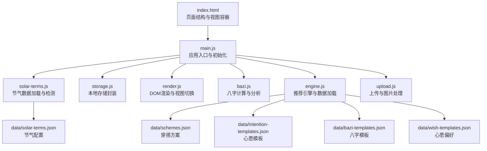
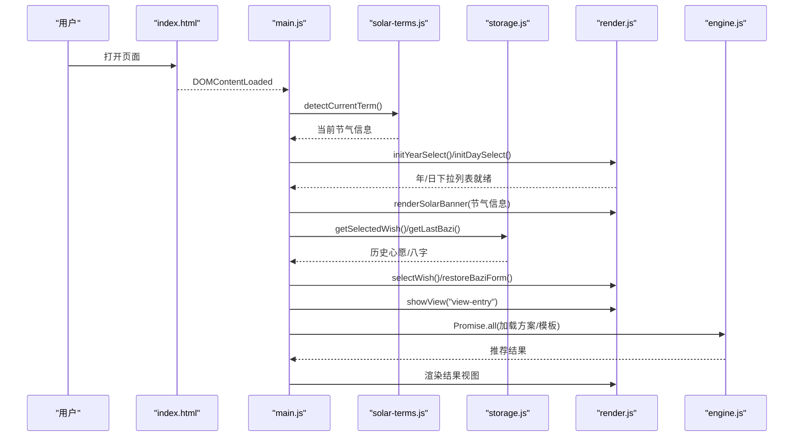
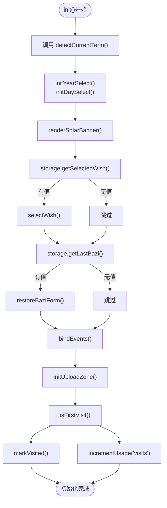
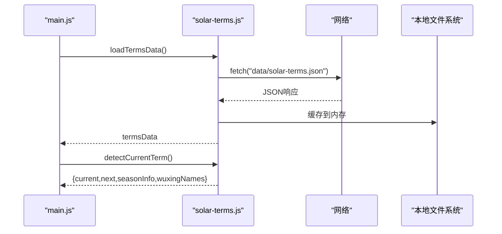
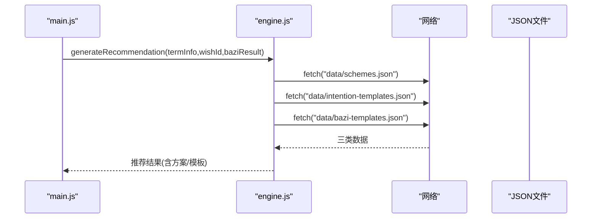
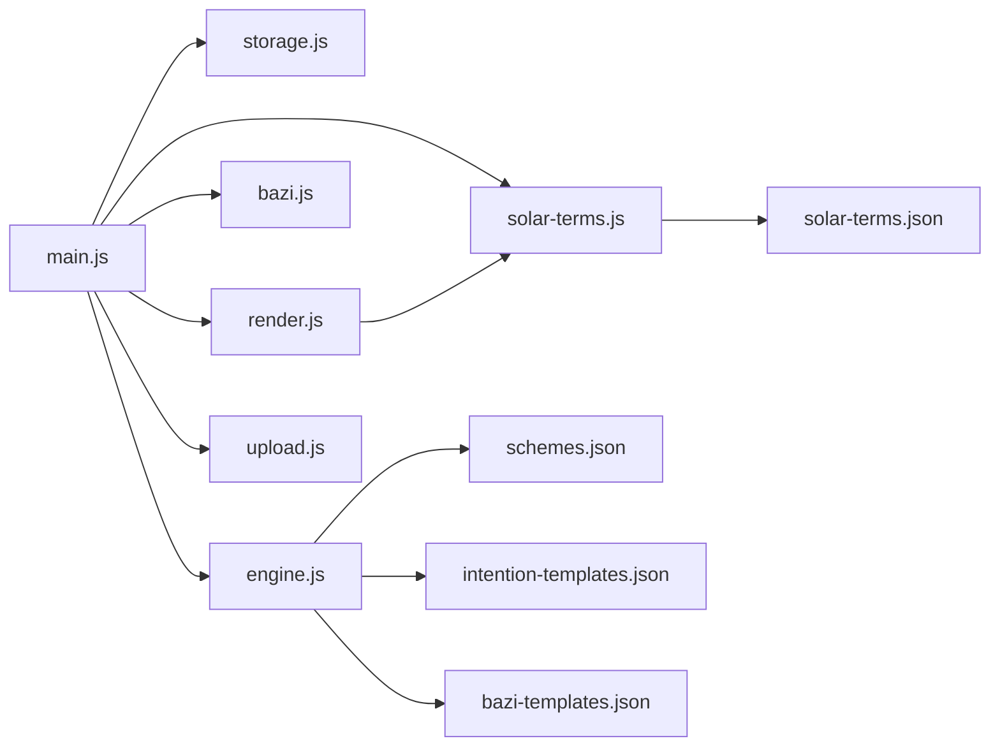

# 数据加载与初始化

<cite>
**本文档引用的文件**
- [index.html](file://index.html)
- [main.js](file://js/main.js)
- [solar-terms.js](file://js/solar-terms.js)
- [storage.js](file://js/storage.js)
- [render.js](file://js/render.js)
- [bazi.js](file://js/bazi.js)
- [engine.js](file://js/engine.js)
- [upload.js](file://js/upload.js)
- [solar-terms.json](file://data/solar-terms.json)
- [schemes.json](file://data/schemes.json)
- [intention-templates.json](file://data/intention-templates.json)
- [bazi-templates.json](file://data/bazi-templates.json)
- [wish-templates.json](file://data/wish-templates.json)
</cite>

## 目录
1. [简介](#简介)
2. [项目结构](#项目结构)
3. [核心组件](#核心组件)
4. [架构总览](#架构总览)
5. [详细组件分析](#详细组件分析)
6. [依赖关系分析](#依赖关系分析)
7. [性能考虑](#性能考虑)
8. [故障排查指南](#故障排查指南)
9. [结论](#结论)

## 简介
本文件聚焦于“五行穿搭建议”项目在应用启动阶段的数据加载与初始化流程，涵盖以下关键主题：
- 从加载节气数据、初始化表单控件到恢复用户历史选择的完整过程
- 静态JSON数据的加载机制与异步数据获取处理
- 数据验证与错误处理策略
- init()函数中的数据初始化步骤解析（detectCurrentTerm()、selectWish()、restoreBaziForm()等）
- 数据加载的优先级与依赖关系
- 数据加载失败的处理与回退策略
- 性能优化建议与调试方法

## 项目结构
该项目采用模块化的前端架构，HTML页面负责视图结构，JavaScript模块分别承担数据加载、业务逻辑、渲染与交互等功能。数据资源位于data目录，均为静态JSON文件。

图表来源
- [index.html](file://index.html#L1-L236)
- [main.js](file://js/main.js#L1-L317)
- [solar-terms.js](file://js/solar-terms.js#L1-L118)
- [engine.js](file://js/engine.js#L1-L335)
- [solar-terms.json](file://data/solar-terms.json#L1-L42)
- [schemes.json](file://data/schemes.json#L1-L509)
- [intention-templates.json](file://data/intention-templates.json#L1-L253)
- [bazi-templates.json](file://data/bazi-templates.json#L1-L103)
- [wish-templates.json](file://data/wish-templates.json#L1-L47)

章节来源
- [index.html](file://index.html#L1-L236)
- [main.js](file://js/main.js#L1-L317)

## 核心组件
- 应用入口与初始化：负责在DOM加载完成后执行init()，协调各模块完成数据加载与界面初始化。
- 节气模块：负责加载节气配置、计算当前节气与季节信息，并提供节气相关的颜色映射。
- 推荐引擎：负责加载方案、心愿模板与八字模板，构建推荐上下文并进行方案评分与选择。
- 存储模块：封装localStorage的读写，提供心愿、八字、结果、反馈、上传图片、使用统计等业务方法。
- 渲染模块：负责视图切换、表单初始化、节气横幅渲染、结果卡片渲染、模态框与提示等。
- 八字模块：提供简化版的八字计算与五行分析。
- 上传模块：提供文件校验、图片压缩与拖拽上传功能。

章节来源
- [main.js](file://js/main.js#L26-L67)
- [solar-terms.js](file://js/solar-terms.js#L18-L103)
- [engine.js](file://js/engine.js#L39-L79)
- [storage.js](file://js/storage.js#L52-L115)
- [render.js](file://js/render.js#L18-L127)
- [bazi.js](file://js/bazi.js#L111-L192)
- [upload.js](file://js/upload.js#L12-L144)

## 架构总览
应用启动时序如下：DOMContentLoaded触发init()，init()依次完成节气检测、表单初始化、节气横幅渲染、历史恢复、事件绑定与上传区域初始化。推荐引擎在生成与换一批时异步加载方案与模板数据。

图表来源
- [main.js](file://js/main.js#L26-L67)
- [solar-terms.js](file://js/solar-terms.js#L36-L103)
- [render.js](file://js/render.js#L18-L71)
- [engine.js](file://js/engine.js#L268-L310)

## 详细组件分析

### 初始化流程与数据加载步骤
init()函数是应用启动的核心，其职责包括：
- 检测当前节气：调用detectCurrentTerm()获取节气信息，包含当前节气、下一节气、季节信息与五行名称映射。
- 初始化表单：调用initYearSelect()与initDaySelect()生成年份与日期下拉选项。
- 渲染节气横幅：调用renderSolarBanner()展示当前节气与对应五行颜色。
- 恢复用户历史：
  - 从localStorage读取上次选择的心愿，若存在则调用selectWish()更新UI并持久化。
  - 从localStorage读取上次输入的八字，若存在则调用restoreBaziForm()填充表单。
- 绑定事件：注册视图切换、心愿选择、生成/换一批、上传、反馈等事件。
- 初始化上传区域：调用initUploadZone()设置上传交互。
- 首次访问标记与使用统计：检查是否首次访问并标记，同时增加访问次数与生成次数。

图表来源
- [main.js](file://js/main.js#L26-L67)
- [storage.js](file://js/storage.js#L101-L115)
- [render.js](file://js/render.js#L18-L71)

章节来源
- [main.js](file://js/main.js#L26-L67)

### 节气数据加载机制
节气数据来自data/solar-terms.json，solar-terms.js提供以下能力：
- loadTermsData()：首次加载后缓存，避免重复请求。
- detectCurrentTerm()：基于当前UTC+8时间，查找当前节气与下一节气，并确定季节信息。
- getWuxingColor()：提供五行到颜色的映射，用于节气横幅的视觉呈现。

图表来源
- [solar-terms.js](file://js/solar-terms.js#L18-L103)
- [solar-terms.json](file://data/solar-terms.json#L1-L42)

章节来源
- [solar-terms.js](file://js/solar-terms.js#L18-L103)
- [solar-terms.json](file://data/solar-terms.json#L1-L42)

### 推荐引擎的数据加载与处理
推荐引擎在生成与换一批时异步加载三类数据：
- 方案数据：data/schemes.json，包含按节气分类的穿搭方案。
- 心愿模板：data/intention-templates.json，按心愿类型与节气匹配的模板。
- 八字模板：data/bazi-templates.json，按日主强弱与年份匹配的模板。

加载策略：
- generateRecommendation()使用Promise.all并发加载三类数据，提升性能。
- regenerateRecommendation()仅加载方案数据，过滤掉已排除的方案ID。

图表来源
- [engine.js](file://js/engine.js#L268-L310)
- [schemes.json](file://data/schemes.json#L1-L509)
- [intention-templates.json](file://data/intention-templates.json#L1-L253)
- [bazi-templates.json](file://data/bazi-templates.json#L1-L103)

章节来源
- [engine.js](file://js/engine.js#L268-L334)

### 本地存储与历史恢复
存储模块提供统一的键空间与业务方法：
- 心愿：getSelectedWish()/saveSelectedWish()
- 八字：getLastBazi()/saveLastBazi()
- 结果：getLastResult()/saveLastResult()
- 上传图片：getUploadedOutfit()/saveUploadedOutfit()/removeUploadedOutfit()
- 反馈：getFeedback()/saveFeedback()
- 使用统计：getUsageStats()/incrementUsage()
- 首次访问：isFirstVisit()/markVisited()

init()中通过这些方法恢复用户历史，确保用户体验连贯。

章节来源
- [storage.js](file://js/storage.js#L52-L115)
- [main.js](file://js/main.js#L40-L50)

### 表单初始化与渲染
- 年份下拉：initYearSelect()生成1950年至当前年减16岁的选项。
- 日期下拉：initDaySelect()生成1-31日选项。
- 节气横幅：renderSolarBanner()显示当前节气名称与对应五行标签。
- 结果页标题：renderResultHeader()显示节气与五行名称。
- 方案卡片：renderSchemeCards()渲染推荐方案列表，并保存到全局供详情模态框使用。

章节来源
- [render.js](file://js/render.js#L18-L127)

### 八字计算与分析
- calcBazi()：计算四柱（年/月/日/时）天干地支。
- calcWuxingProfile()：统计天干地支的五行分布。
- getRecommendElement()：根据最弱与最强五行给出推荐与分析。
- analyzeBazi()：整合计算结果，输出包含八字、五行分布与推荐的结构。

章节来源
- [bazi.js](file://js/bazi.js#L111-L192)

### 上传与图片处理
- validateFile()：校验文件类型与大小。
- compressImage()：按目标尺寸与大小压缩图片，保证传输效率。
- initUploadZone()：提供点击、键盘与拖拽上传支持。

章节来源
- [upload.js](file://js/upload.js#L12-L144)

## 依赖关系分析
- main.js依赖solar-terms.js、storage.js、render.js、bazi.js、engine.js、upload.js。
- solar-terms.js依赖data/solar-terms.json。
- engine.js依赖data/schemes.json、data/intention-templates.json、data/bazi-templates.json。
- storage.js依赖浏览器localStorage。
- render.js依赖DOM与solar-terms.js的颜色映射。
- bazi.js为纯计算模块，无外部依赖。
- upload.js依赖Canvas与FileReader。

图表来源
- [main.js](file://js/main.js#L5-L16)
- [solar-terms.js](file://js/solar-terms.js#L5)
- [engine.js](file://js/engine.js#L5-L8)
- [solar-terms.json](file://data/solar-terms.json#L1-L42)
- [schemes.json](file://data/schemes.json#L1-L509)
- [intention-templates.json](file://data/intention-templates.json#L1-L253)
- [bazi-templates.json](file://data/bazi-templates.json#L1-L103)

章节来源
- [main.js](file://js/main.js#L5-L16)

## 性能考虑
- 并发加载：generateRecommendation()使用Promise.all并发加载方案与模板，减少等待时间。
- 缓存策略：loadTermsData()与loadSchemes()等在内存中缓存数据，避免重复fetch。
- 异步渲染：init()中先完成数据加载与表单初始化，再进行视图切换，避免阻塞。
- 图片压缩：compressImage()在客户端进行压缩，降低网络传输与存储压力。
- 本地存储：使用localStorage减少服务器请求，提高响应速度。

[本节为通用性能建议，无需特定文件来源]

## 故障排查指南
- 节气数据加载失败
  - 现象：节气横幅为空或默认值。
  - 排查：确认data/solar-terms.json可访问且格式正确；检查控制台fetch错误；验证solar-terms.js的loadTermsData()返回值。
  - 处理：在网络异常时提供降级显示（例如默认节气），并在重试后自动恢复。
- 推荐数据加载失败
  - 现象：生成推荐失败或换一批无结果。
  - 排查：检查data/schemes.json、data/intention-templates.json、data/bazi-templates.json是否存在与可访问；查看engine.js的错误日志。
  - 处理：使用Promise.all的错误捕获，提供用户提示并允许重试。
- 本地存储异常
  - 现象：心愿/八字/结果无法恢复或保存失败。
  - 排查：检查浏览器localStorage可用性；查看storage.js的get/set异常。
  - 处理：提供兜底逻辑（如降级为内存状态）并提示用户清理缓存。
- 上传失败
  - 现象：图片无法上传或压缩失败。
  - 排查：validateFile()返回的错误信息；compressImage()的Canvas绘制与toDataURL异常。
  - 处理：提示用户更换文件或调整格式；限制最大文件大小与类型。

章节来源
- [solar-terms.js](file://js/solar-terms.js#L21-L28)
- [engine.js](file://js/engine.js#L41-L48)
- [storage.js](file://js/storage.js#L7-L23)
- [upload.js](file://js/upload.js#L31-L82)

## 结论
本项目在启动阶段通过明确的初始化流程与模块化设计，实现了节气数据、表单控件与用户历史的高效加载与恢复。推荐引擎采用并发加载与缓存策略，结合本地存储与图片压缩，兼顾了性能与用户体验。针对可能出现的网络与存储异常，提供了清晰的错误处理与回退机制。建议在后续版本中进一步增强数据校验与错误提示，优化首屏渲染与离线能力，以提升稳定性与可维护性。