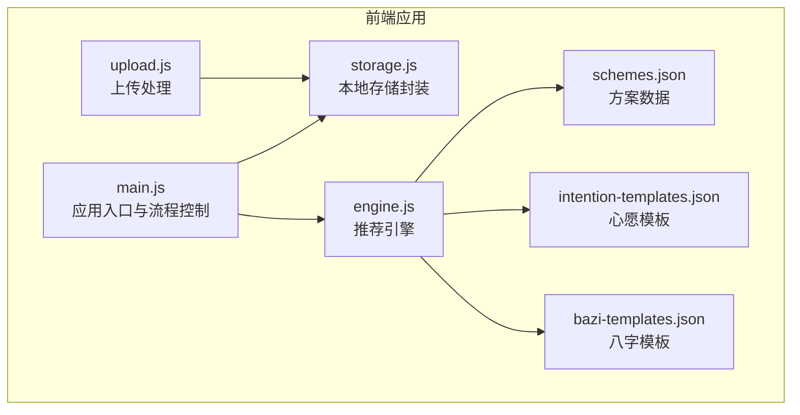
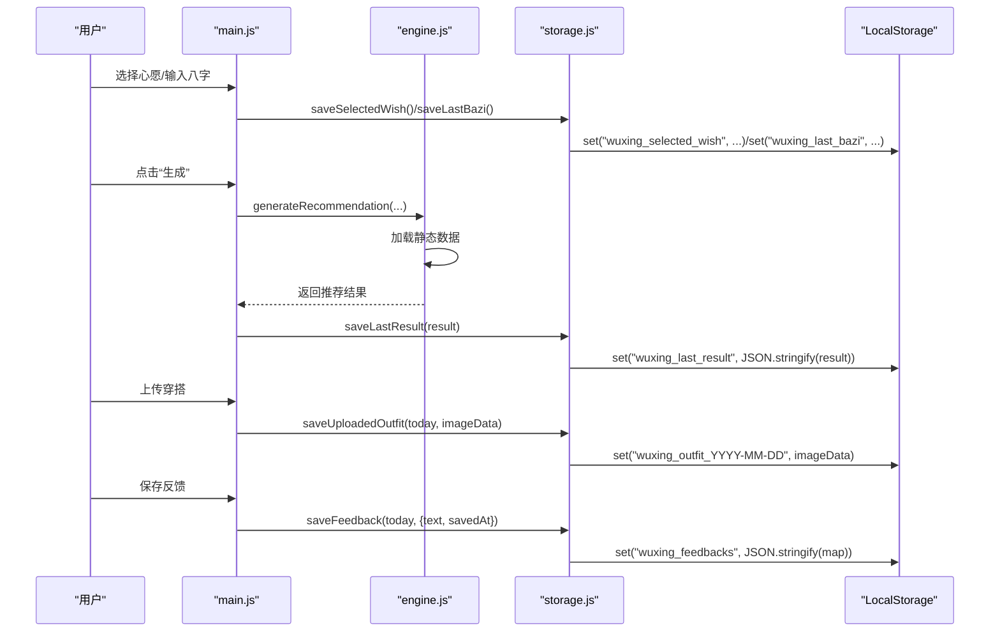
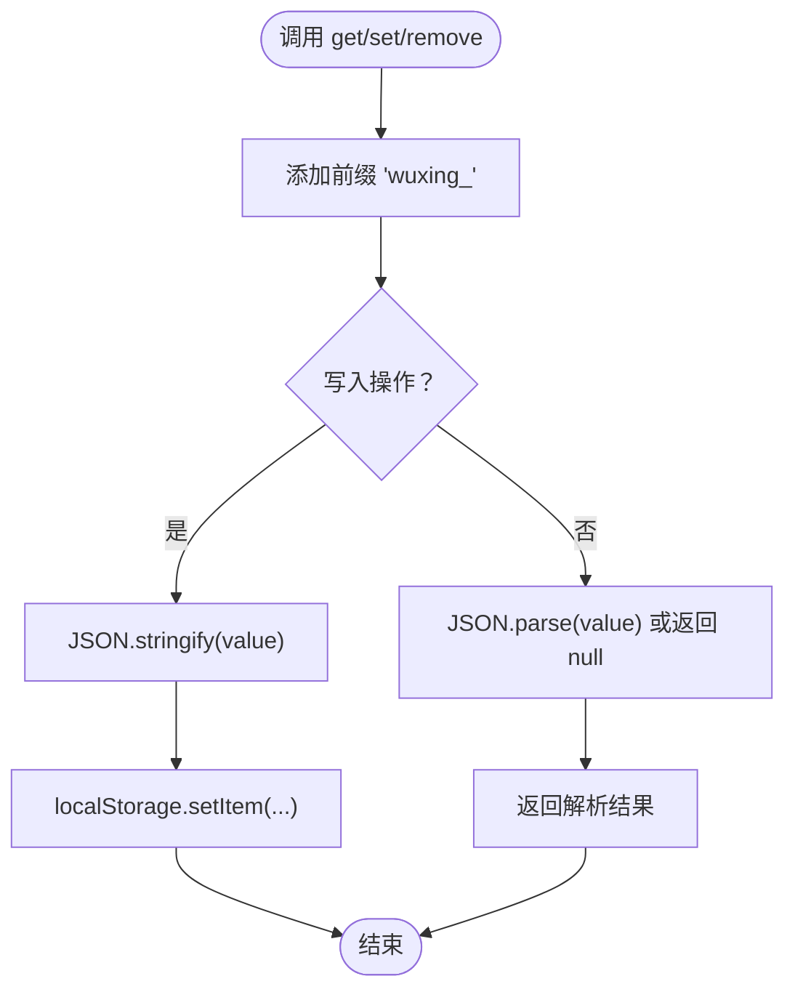
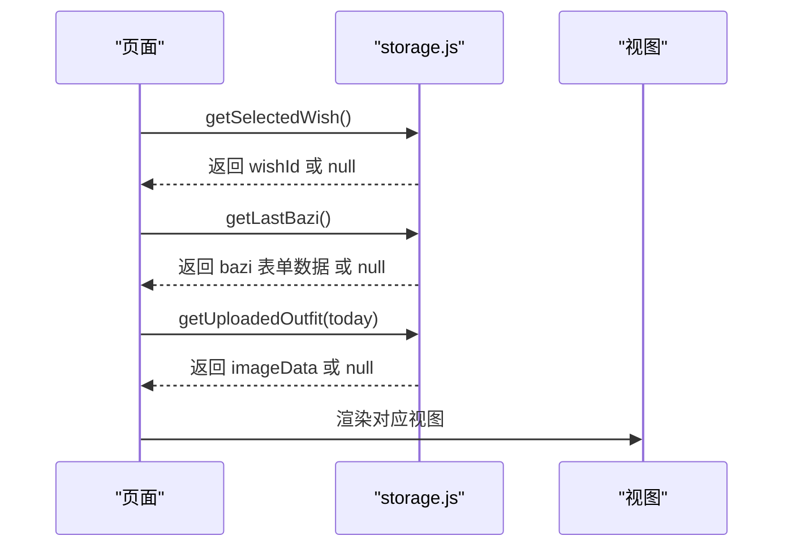
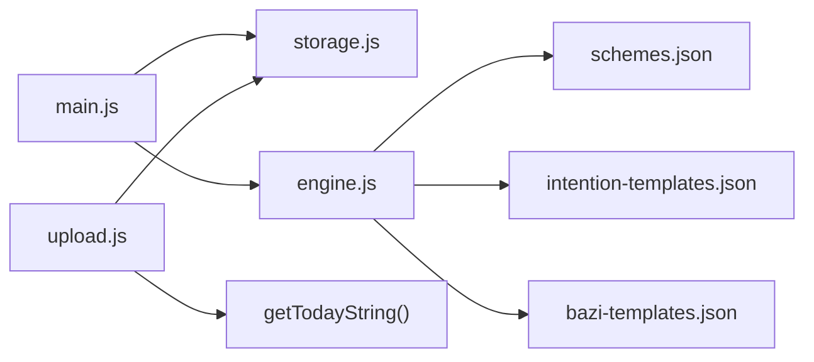

# 数据持久化

<cite>
**本文引用的文件列表**
- [storage.js](file://js/storage.js)
- [main.js](file://js/main.js)
- [engine.js](file://js/engine.js)
- [upload.js](file://js/upload.js)
- [schemes.json](file://data/schemes.json)
- [intention-templates.json](file://data/intention-templates.json)
- [bazi-templates.json](file://data/bazi-templates.json)
- [index.html](file://index.html)
</cite>

## 目录
1. [简介](#简介)
2. [项目结构](#项目结构)
3. [核心组件](#核心组件)
4. [架构总览](#架构总览)
5. [详细组件分析](#详细组件分析)
6. [依赖分析](#依赖分析)
7. [性能考量](#性能考量)
8. [故障排查指南](#故障排查指南)
9. [结论](#结论)
10. [附录](#附录)

## 简介
本文件面向“五行穿搭建议”项目，系统化梳理数据持久化的存储与检索机制，覆盖从数据保存、本地存储管理到数据恢复的完整流程。重点解释以下方面：
- LocalStorage 使用策略与键空间管理
- 数据序列化与反序列化
- 数据版本管理与迁移机制现状
- 关键持久化操作 saveLastResult()、getSelectedWish()、saveUploadedOutfit() 的数据格式与存储结构
- 缓存策略、存储容量限制、数据清理与维护机制
- 数据安全、备份恢复与性能优化建议

## 项目结构
该项目采用前端单页应用架构，数据持久化集中在独立模块中，业务逻辑通过导入该模块完成读写。核心文件与职责如下：
- js/storage.js：统一的本地存储封装，提供通用 get/set/remove/clearAll 及业务方法
- js/main.js：应用入口与业务流程控制，负责在合适时机调用存储模块
- js/engine.js：推荐引擎，加载静态数据并生成推荐结果
- js/upload.js：上传处理，包含文件验证、压缩与日期键管理
- data/*.json：静态数据源，供引擎加载使用
- index.html：页面结构与视图切换，承载用户交互

图表来源
- [main.js](file://js/main.js#L1-L317)
- [engine.js](file://js/engine.js#L1-L335)
- [upload.js](file://js/upload.js#L1-L145)
- [storage.js](file://js/storage.js#L1-L116)
- [schemes.json](file://data/schemes.json#L1-L509)
- [intention-templates.json](file://data/intention-templates.json#L1-L253)
- [bazi-templates.json](file://data/bazi-templates.json#L1-L103)

章节来源
- [main.js](file://js/main.js#L1-L317)
- [storage.js](file://js/storage.js#L1-L116)
- [engine.js](file://js/engine.js#L1-L335)
- [upload.js](file://js/upload.js#L1-L145)
- [schemes.json](file://data/schemes.json#L1-L509)
- [intention-templates.json](file://data/intention-templates.json#L1-L253)
- [bazi-templates.json](file://data/bazi-templates.json#L1-L103)

## 核心组件
- 本地存储封装模块（storage.js）
  - 提供统一的 get/set/remove/clearAll 方法，并以固定前缀组织键空间
  - 提供业务方法：保存/读取上次心愿、上次八字、上次结果、反馈、上传的穿搭图片、使用统计、首次访问标记等
- 应用入口模块（main.js）
  - 初始化阶段恢复上次心愿与八字
  - 生成/换一批推荐时保存结果
  - 上传图片时按日期键保存压缩后的图片数据
  - 保存反馈时按日期键保存文本与时间戳
- 推荐引擎模块（engine.js）
  - 异步加载静态数据，构建推荐上下文并评分选择方案
  - 生成结果对象包含方案、节气信息、心愿ID、模板匹配、生成时间等
- 上传模块（upload.js）
  - 文件校验、压缩、拖拽/点击上传、日期键生成

章节来源
- [storage.js](file://js/storage.js#L1-L116)
- [main.js](file://js/main.js#L1-L317)
- [engine.js](file://js/engine.js#L1-L335)
- [upload.js](file://js/upload.js#L1-L145)

## 架构总览
下图展示数据持久化在应用中的端到端流程：用户操作触发业务逻辑，业务逻辑调用存储模块进行读写，存储模块基于 LocalStorage 完成序列化/反序列化与键管理。

图表来源
- [main.js](file://js/main.js#L40-L66)
- [main.js](file://js/main.js#L202-L244)
- [main.js](file://js/main.js#L249-L269)
- [main.js](file://js/main.js#L274-L292)
- [main.js](file://js/main.js#L297-L313)
- [storage.js](file://js/storage.js#L52-L89)
- [engine.js](file://js/engine.js#L268-L310)
- [upload.js](file://js/upload.js#L141-L144)

## 详细组件分析

### 本地存储封装模块（storage.js）
- 键空间与前缀
  - 所有键均以固定前缀标识，避免与其他应用或浏览器扩展冲突
  - 提供按前缀批量查询与清理能力
- 序列化与反序列化
  - 写入时使用 JSON.stringify，读取时使用 JSON.parse；异常时返回空值或默认值
- 业务方法概览
  - 心愿与八字：保存/读取上次选择的心愿 ID 与八字表单数据
  - 推荐结果：保存/读取上次生成的推荐结果
  - 反馈：按日期键保存文本与时间戳
  - 上传的穿搭：按日期键保存压缩后的图片数据
  - 使用统计：访问次数、生成次数、上传次数
  - 首次访问标记：布尔值
- 清理与维护
  - 支持按前缀批量删除
  - 支持清空所有带前缀的键

图表来源
- [storage.js](file://js/storage.js#L7-L27)

章节来源
- [storage.js](file://js/storage.js#L1-L116)

### 关键持久化操作详解

#### saveLastResult(result) 与 getLastResult()
- 存储结构
  - 键名："wuxing_last_result"
  - 值：推荐结果对象（包含方案数组、节气信息、心愿ID、模板匹配、生成时间等）
- 数据格式要点
  - 方案数组：每个元素包含ID、所属节气、颜色信息、材质、感觉、注释与来源
  - 模板匹配：可能包含心愿模板与八字模板的匹配结果
  - 时间戳：生成时间，便于后续统计与调试
- 使用场景
  - 生成推荐后保存，换一批时更新，页面刷新后恢复

章节来源
- [storage.js](file://js/storage.js#L60-L66)
- [engine.js](file://js/engine.js#L268-L310)
- [main.js](file://js/main.js#L231-L233)

#### getSelectedWish() 与 saveSelectedWish(wishId)
- 存储结构
  - 键名："wuxing_selected_wish"
  - 值：心愿ID（字符串）
- 使用场景
  - 页面初始化时恢复上次选择的心愿
  - 用户切换心愿时保存当前选择

章节来源
- [storage.js](file://js/storage.js#L109-L115)
- [main.js](file://js/main.js#L40-L44)

#### saveUploadedOutfit(date, imageData) 与 getUploadedOutfit(date)
- 存储结构
  - 键名："wuxing_outfit_YYYY-MM-DD"
  - 值：压缩后的图片数据（Base64 Data URL）
- 数据格式要点
  - 上传前已进行尺寸与质量压缩，确保体积可控
  - 以日期作为键，天然支持多日记录
- 使用场景
  - 上传成功后按当日日期保存
  - 进入上传视图时按当日日期恢复预览

章节来源
- [storage.js](file://js/storage.js#L79-L89)
- [upload.js](file://js/upload.js#L31-L82)
- [upload.js](file://js/upload.js#L141-L144)
- [main.js](file://js/main.js#L108-L113)
- [main.js](file://js/main.js#L283-L285)

#### saveFeedback(date, feedback) 与 getFeedback(date)
- 存储结构
  - 键名："wuxing_feedbacks"
  - 值：对象映射，键为日期，值为反馈对象（包含文本与保存时间）
- 数据格式要点
  - 反馈对象包含文本与保存时间戳
  - 整体以对象形式存储，便于按日期快速检索
- 使用场景
  - 用户保存反馈时按当日日期写入
  - 上传视图显示反馈区时读取

章节来源
- [storage.js](file://js/storage.js#L68-L77)
- [main.js](file://js/main.js#L297-L313)

### 数据恢复流程
- 页面初始化
  - 恢复上次选择的心愿与八字表单
  - 若存在上次推荐结果，可直接渲染结果视图
- 上传视图
  - 按当日日期尝试恢复已上传的图片预览
- 反馈区
  - 显示当日反馈（若存在）

图表来源
- [main.js](file://js/main.js#L40-L66)
- [main.js](file://js/main.js#L108-L113)
- [storage.js](file://js/storage.js#L109-L115)
- [storage.js](file://js/storage.js#L52-L58)
- [storage.js](file://js/storage.js#L79-L81)

章节来源
- [main.js](file://js/main.js#L40-L66)
- [main.js](file://js/main.js#L108-L113)
- [storage.js](file://js/storage.js#L52-L58)
- [storage.js](file://js/storage.js#L79-L81)
- [storage.js](file://js/storage.js#L109-L115)

### 数据版本管理与迁移机制
- 当前实现
  - 未发现显式的版本号字段或自动迁移逻辑
  - 业务方法返回默认值（如使用统计的默认结构）以兼容新旧数据
- 建议
  - 引入版本号字段，新增业务方法时检查版本并执行迁移
  - 对于复杂结构（如 feedbacks），可考虑分层迁移策略
  - 在存储模块中增加迁移函数，集中处理键结构变更

章节来源
- [storage.js](file://js/storage.js#L91-L99)

### 数据缓存策略
- 本地缓存
  - 以 LocalStorage 为核心，键空间前缀隔离
  - 业务方法提供默认值，避免因缺失导致崩溃
- 静态数据缓存
  - 推荐引擎异步加载静态数据一次并缓存，避免重复请求
- 建议
  - 对频繁访问的键（如 last_result）可在内存中短期缓存
  - 对大对象（如 feedbacks）可考虑分段存储或懒加载

章节来源
- [engine.js](file://js/engine.js#L39-L79)
- [storage.js](file://js/storage.js#L91-L99)

### 存储容量限制与清理机制
- 容量限制
  - LocalStorage 容量通常在 5-10MB 左右，具体取决于浏览器
  - 上传的图片为压缩后的 Base64，单张约几十 KB 到数百 KB
- 清理策略
  - 提供按前缀批量删除与全量清理接口
  - 可结合使用统计定期清理历史数据（如超过一定天数的穿搭图片）
- 建议
  - 为 feedbacks 设置最大条目数，超出时按日期淘汰
  - 对 outift_* 键设置生命周期，定期清理过期项

章节来源
- [storage.js](file://js/storage.js#L29-L49)
- [storage.js](file://js/storage.js#L79-L89)

### 数据安全、备份与恢复
- 安全性
  - 数据仅存储在本地，无需网络传输
  - 建议在需要时对敏感信息（如有）进行加密存储
- 备份与恢复
  - 可通过浏览器开发者工具导出 LocalStorage 内容
  - 建议提供导出/导入功能，便于用户跨设备迁移
- 建议
  - 提供一键导出所有带前缀的键值
  - 提供导入功能，支持版本升级时的数据迁移

章节来源
- [storage.js](file://js/storage.js#L40-L49)

## 依赖分析
- 模块耦合
  - main.js 依赖 storage.js 与 engine.js
  - engine.js 依赖 data/*.json
  - upload.js 依赖 storage.js 与自身日期工具
- 外部依赖
  - 浏览器 LocalStorage API
  - Fetch API（加载静态数据）
  - Canvas API（图片压缩）

图表来源
- [main.js](file://js/main.js#L1-L16)
- [engine.js](file://js/engine.js#L1-L79)
- [upload.js](file://js/upload.js#L1-L145)
- [storage.js](file://js/storage.js#L1-L116)

章节来源
- [main.js](file://js/main.js#L1-L16)
- [engine.js](file://js/engine.js#L1-L79)
- [upload.js](file://js/upload.js#L1-L145)
- [storage.js](file://js/storage.js#L1-L116)

## 性能考量
- 序列化成本
  - 大对象（如 feedbacks）频繁序列化/反序列化会带来开销
  - 建议对大对象进行分片或延迟序列化
- I/O 次数
  - 减少不必要的 set/get 调用，合并写入
  - 对高频读取的键进行内存缓存
- 存储体积
  - 图片压缩已有效控制体积
  - 可考虑对历史数据进行归档或压缩存储

## 故障排查指南
- 常见问题
  - 读取为空：确认键是否存在、是否被清理、是否跨域或隐私模式限制
  - 写入失败：检查浏览器 LocalStorage 是否可用、容量是否不足
  - 解析错误：确认存储值是否为合法 JSON
- 排查步骤
  - 在浏览器开发者工具的 Application/Local Storage 中查看键值
  - 检查 storage.js 的 get/set 实现是否抛出异常
  - 验证 main.js 调用时机是否正确（如初始化、生成、上传、保存反馈）

章节来源
- [storage.js](file://js/storage.js#L7-L27)
- [main.js](file://js/main.js#L40-L66)
- [main.js](file://js/main.js#L202-L244)
- [main.js](file://js/main.js#L274-L292)
- [main.js](file://js/main.js#L297-L313)

## 结论
本项目的数据持久化以 storage.js 为核心，围绕 LocalStorage 提供了统一的键空间管理、序列化/反序列化与业务方法封装。通过在 main.js 中恰当的调用时机，实现了心愿、八字、推荐结果、反馈与上传图片的本地持久化。当前未发现显式的版本管理与迁移机制，建议引入版本号与迁移函数以增强长期可维护性。同时，针对容量限制与性能优化，建议增加清理策略与缓存机制，并提供导出/导入能力以便用户备份与迁移。

## 附录
- 术语
  - 五行为木、火、土、金、水
  - 节气指二十四节气，与推荐方案绑定
  - 心愿指用户选择的短期目标（如求职、贵人运、远行顺利、静心专注、健康舒畅）