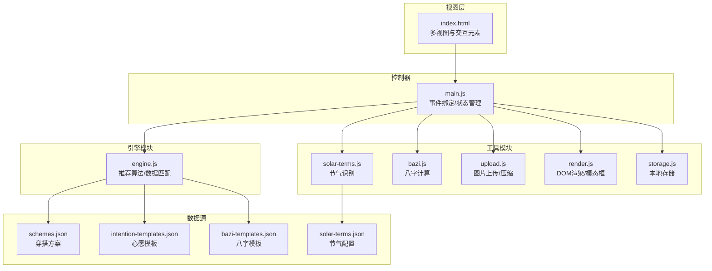
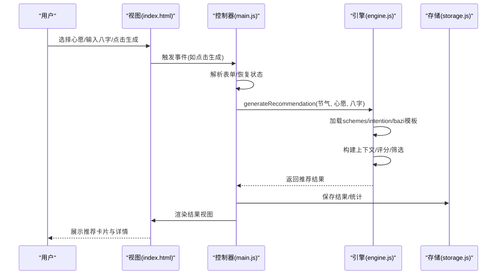
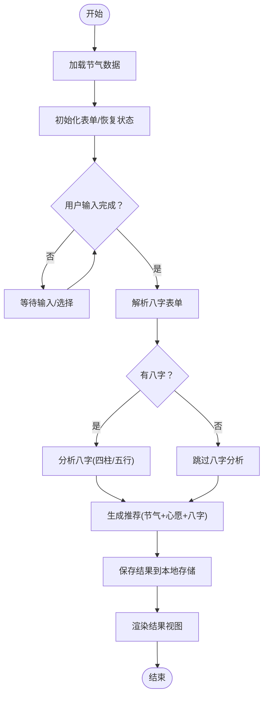
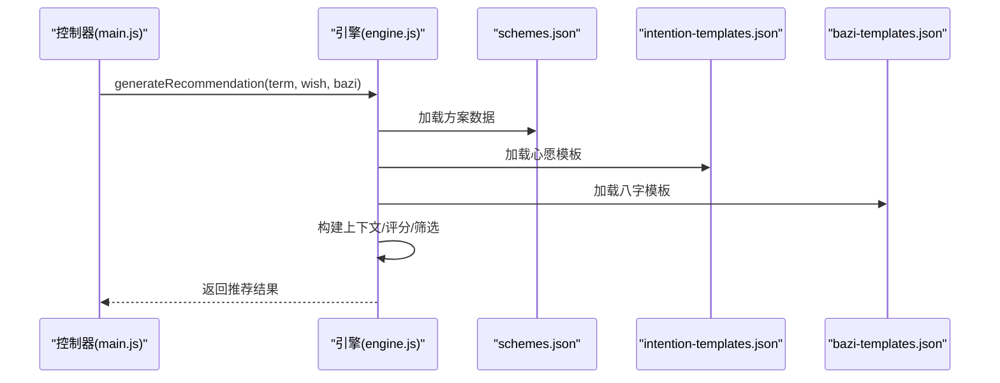
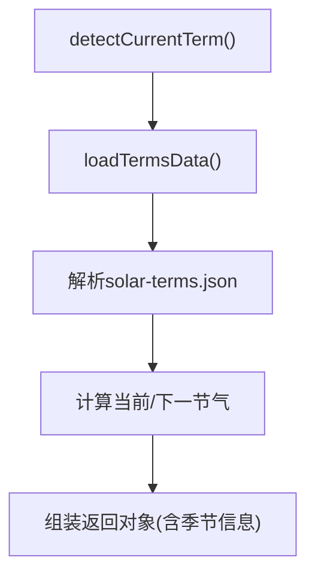
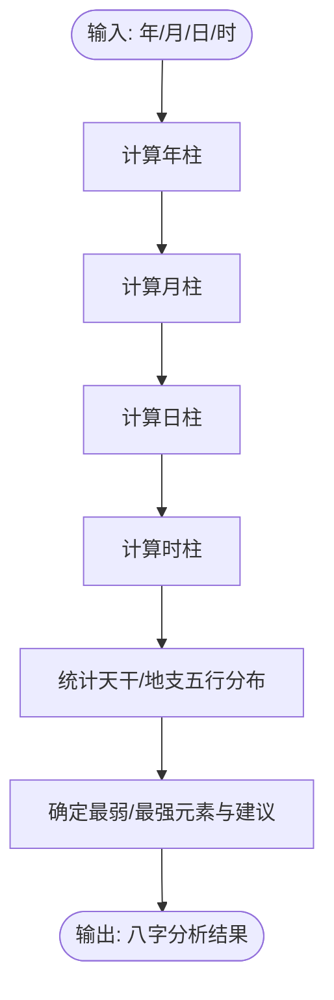
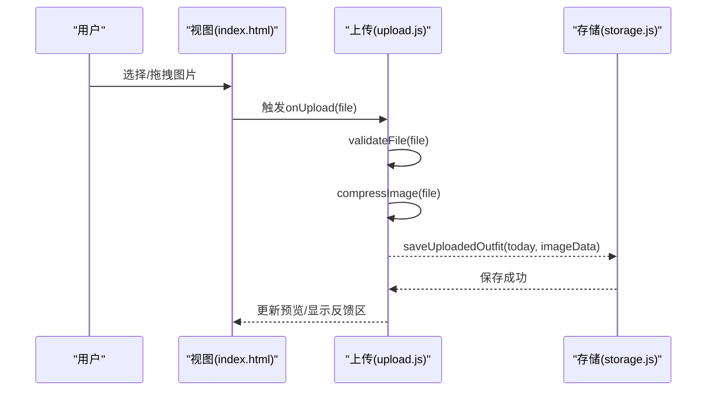
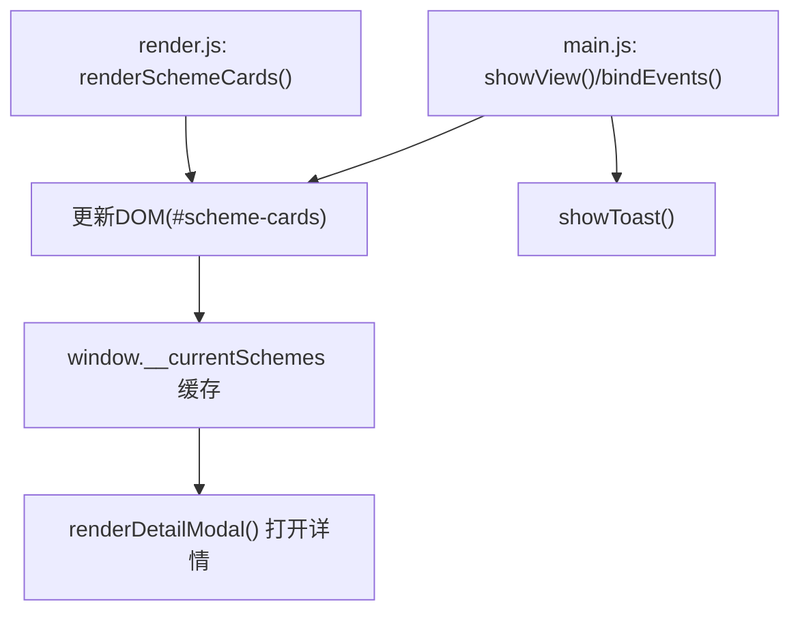
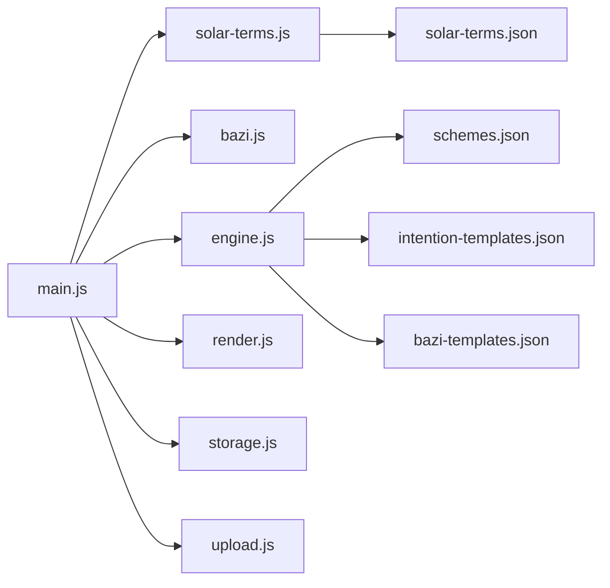

# 数据流设计

<cite>
**本文档引用的文件**
- [index.html](file://index.html)
- [main.js](file://js/main.js)
- [engine.js](file://js/engine.js)
- [bazi.js](file://js/bazi.js)
- [render.js](file://js/render.js)
- [storage.js](file://js/storage.js)
- [solar-terms.js](file://js/solar-terms.js)
- [upload.js](file://js/upload.js)
- [schemes.json](file://data/schemes.json)
- [intention-templates.json](file://data/intention-templates.json)
- [bazi-templates.json](file://data/bazi-templates.json)
- [solar-terms.json](file://data/solar-terms.json)
</cite>

## 目录
1. [简介](#简介)
2. [项目结构](#项目结构)
3. [核心组件](#核心组件)
4. [架构总览](#架构总览)
5. [详细组件分析](#详细组件分析)
6. [依赖关系分析](#依赖关系分析)
7. [性能考虑](#性能考虑)
8. [故障排查指南](#故障排查指南)
9. [结论](#结论)
10. [附录](#附录)

## 简介
本项目为“五行穿搭建议”应用，围绕“节气—心愿—八字—推荐方案”的数据主线，实现从用户输入到推荐结果的完整数据流闭环。系统采用模块化设计，数据在各模块间通过参数传递、状态共享与事件驱动的方式流转，同时具备本地存储、缓存与错误处理机制，确保用户体验与数据一致性。

## 项目结构
前端采用HTML + ES模块化JS + 本地静态JSON数据的轻量架构：
- 视图层：index.html定义多视图结构与交互元素
- 控制器：main.js负责事件绑定、状态管理和跨模块协调
- 引擎：engine.js执行推荐算法与数据匹配
- 工具：bazi.js、solar-terms.js、upload.js、render.js、storage.js分别处理八字计算、节气识别、上传处理、渲染与本地存储
- 数据：data目录下提供静态JSON配置

图表来源
- [index.html](file://index.html#L20-L236)
- [main.js](file://js/main.js#L1-L317)
- [engine.js](file://js/engine.js#L1-L335)
- [solar-terms.js](file://js/solar-terms.js#L1-L118)
- [bazi.js](file://js/bazi.js#L1-L193)
- [render.js](file://js/render.js#L1-L272)
- [storage.js](file://js/storage.js#L1-L116)
- [upload.js](file://js/upload.js#L1-L145)
- [schemes.json](file://data/schemes.json#L1-L509)
- [intention-templates.json](file://data/intention-templates.json#L1-L253)
- [bazi-templates.json](file://data/bazi-templates.json#L1-L103)
- [solar-terms.json](file://data/solar-terms.json#L1-L42)

章节来源
- [index.html](file://index.html#L20-L236)
- [main.js](file://js/main.js#L1-L317)

## 核心组件
- 应用入口与状态管理：main.js负责初始化、事件绑定、状态持久化与跨模块协调
- 推荐引擎：engine.js加载静态数据、构建上下文、评分与筛选方案
- 节气识别：solar-terms.js解析当前节气与季节信息
- 八字计算：bazi.js进行四柱推算与五行分布统计
- 上传处理：upload.js验证与压缩图片，提供拖拽/键盘支持
- 渲染模块：render.js负责视图切换、卡片渲染、模态框与Toast提示
- 本地存储：storage.js封装localStorage操作，提供业务键值方法

章节来源
- [main.js](file://js/main.js#L17-L67)
- [engine.js](file://js/engine.js#L5-L79)
- [solar-terms.js](file://js/solar-terms.js#L5-L29)
- [bazi.js](file://js/bazi.js#L5-L34)
- [upload.js](file://js/upload.js#L5-L26)
- [render.js](file://js/render.js#L5-L16)
- [storage.js](file://js/storage.js#L5-L49)

## 架构总览
系统采用“事件驱动 + 参数传递 + 状态共享”的数据流模式：
- 用户输入通过事件触发（点击、选择、拖拽等）
- 控制器接收事件并更新应用状态
- 引擎模块根据状态与静态数据计算推荐
- 渲染模块将结果映射到DOM
- 本地存储模块持久化关键状态

图表来源
- [index.html](file://index.html#L38-L156)
- [main.js](file://js/main.js#L202-L244)
- [engine.js](file://js/engine.js#L268-L310)
- [storage.js](file://js/storage.js#L60-L66)

## 详细组件分析

### 数据流总览（从输入到结果）
- 输入阶段：心愿标签选择、八字表单输入、上传图片
- 处理阶段：节气识别、八字分析、推荐计算、评分与筛选
- 输出阶段：渲染推荐卡片、详情模态框、Toast提示
- 持久化：本地存储最近结果、心愿、八字、反馈与使用统计

图表来源
- [main.js](file://js/main.js#L26-L67)
- [main.js](file://js/main.js#L202-L244)
- [engine.js](file://js/engine.js#L268-L310)
- [storage.js](file://js/storage.js#L60-L66)

章节来源
- [main.js](file://js/main.js#L202-L244)
- [engine.js](file://js/engine.js#L268-L310)
- [storage.js](file://js/storage.js#L60-L66)

### 推荐引擎数据流（engine.js）
- 数据加载：并行加载schemes、intention-templates、bazi-templates
- 上下文构建：整合节气、心愿、八字权重
- 评分与筛选：按节气匹配度、相生关系打分，保证五行多样性
- 结果输出：返回包含方案列表与模板信息的结果对象

图表来源
- [engine.js](file://js/engine.js#L268-L310)
- [schemes.json](file://data/schemes.json#L1-L509)
- [intention-templates.json](file://data/intention-templates.json#L1-L253)
- [bazi-templates.json](file://data/bazi-templates.json#L1-L103)

章节来源
- [engine.js](file://js/engine.js#L268-L334)

### 节气识别数据流（solar-terms.js）
- UTC+8时间转换
- 加载节气配置，定位当前节气与下一节气
- 提供节气名称与五行映射，以及对应颜色

图表来源
- [solar-terms.js](file://js/solar-terms.js#L36-L103)
- [solar-terms.json](file://data/solar-terms.json#L1-L42)

章节来源
- [solar-terms.js](file://js/solar-terms.js#L36-L103)

### 八字计算数据流（bazi.js）
- 年柱/月柱/日柱/时柱计算（简化版）
- 五行分布统计与推荐元素（最弱/最强/建议补充）

图表来源
- [bazi.js](file://js/bazi.js#L111-L192)

章节来源
- [bazi.js](file://js/bazi.js#L111-L192)

### 上传与反馈数据流（upload.js + storage.js）
- 文件验证与压缩（Canvas压缩到目标大小）
- 上传区域支持点击/拖拽/键盘激活
- 本地存储今日穿搭图片与反馈文本

图表来源
- [upload.js](file://js/upload.js#L12-L82)
- [upload.js](file://js/upload.js#L87-L136)
- [storage.js](file://js/storage.js#L79-L89)

章节来源
- [upload.js](file://js/upload.js#L12-L145)
- [storage.js](file://js/storage.js#L79-L115)

### 渲染与状态共享（render.js + main.js）
- 视图切换：welcome/entry/results/upload
- 卡片渲染：scheme-cards容器动态插入
- 全局状态：window.__currentSchemes供详情模态框使用
- Toast提示：统一的消息展示

图表来源
- [render.js](file://js/render.js#L114-L127)
- [render.js](file://js/render.js#L159-L193)
- [main.js](file://js/main.js#L72-L153)

章节来源
- [render.js](file://js/render.js#L8-L272)
- [main.js](file://js/main.js#L72-L153)

## 依赖关系分析
- 模块耦合
  - main.js对其他模块存在导入依赖，承担协调职责
  - engine.js对data目录JSON存在直接依赖
  - render.js与DOM强耦合，但通过函数接口隔离
  - storage.js提供统一键空间，避免分散的键名管理
- 数据依赖
  - 推荐结果依赖schemes、intention-templates、bazi-templates
  - 节气识别依赖solar-terms.json
  - 八字分析依赖天干地支与五行映射
- 外部依赖
  - fetch用于异步加载JSON
  - Canvas用于图片压缩
  - localStorage用于本地持久化

图表来源
- [main.js](file://js/main.js#L5-L15)
- [engine.js](file://js/engine.js#L39-L79)
- [solar-terms.js](file://js/solar-terms.js#L18-L29)

章节来源
- [main.js](file://js/main.js#L5-L15)
- [engine.js](file://js/engine.js#L39-L79)

## 性能考虑
- 数据加载优化
  - engine.js中对三个JSON采用Promise.all并行加载，减少等待时间
  - 节气数据与方案数据在首次使用后可缓存于内存变量，避免重复请求
- 计算复杂度
  - 评分与筛选在方案数量有限的情况下（约500条方案）时间复杂度可控
  - 评分函数与相生判断为O(1)，整体线性于方案数
- 渲染优化
  - 使用requestAnimationFrame动画延迟（卡片逐个出现），提升视觉体验
  - DOM更新集中在容器内批量插入，减少回流
- 存储与缓存
  - localStorage键前缀统一，便于清理与维护
  - 使用window.__currentSchemes临时缓存当前结果，避免重复渲染

章节来源
- [engine.js](file://js/engine.js#L270-L274)
- [render.js](file://js/render.js#L132-L154)
- [storage.js](file://js/storage.js#L5-L49)

## 故障排查指南
- 节气识别异常
  - 现象：无法正确识别当前节气
  - 排查：确认solar-terms.json格式与字段完整；检查getUTC8Date时区转换逻辑
- 推荐为空
  - 现象：生成失败或无更多推荐
  - 排查：检查schemes.json是否加载成功；确认generateRecommendation返回值；检查换一批时excludeIds是否导致过滤过度
- 八字分析异常
  - 现象：分析结果为空或异常
  - 排查：确认输入年月日时合法；检查calcWuxingProfile与getRecommendElement逻辑
- 上传失败
  - 现象：文件过大/格式不符/压缩失败
  - 排查：validateFile与compressImage错误分支；Canvas绘制失败；localStorage写入异常
- 渲染问题
  - 现象：卡片不显示/详情模态框空白
  - 排查：renderSchemeCards是否正确设置window.__currentSchemes；renderDetailModal参数是否有效

章节来源
- [solar-terms.js](file://js/solar-terms.js#L36-L103)
- [engine.js](file://js/engine.js#L268-L334)
- [bazi.js](file://js/bazi.js#L182-L192)
- [upload.js](file://js/upload.js#L12-L82)
- [render.js](file://js/render.js#L114-L193)

## 结论
本项目通过清晰的模块划分与事件驱动的数据流，实现了从用户输入到推荐结果的高效闭环。静态JSON数据与本地存储相结合，既保证了离线可用性，又提供了良好的用户体验。建议后续可在以下方面持续优化：
- 对schemes与模板数据引入版本控制与增量更新
- 在移动端增加网络状态检测与离线提示
- 对Canvas压缩增加进度反馈与失败重试
- 增加埋点统计与A/B测试能力

## 附录

### 数据格式标准化
- 节气数据：包含节气ID、名称、五行、月份与日期范围，以及季节映射
- 方案数据：包含方案ID、所属节气、颜色（名称、十六进制、五行）、材质、感受、注解与出处
- 心愿模板：按心愿类型与节气匹配，提供颜色、材质、感受、注解与出处
- 八字模板：按日主五行与年份匹配，提供颜色、材质、感受、注解与出处

章节来源
- [solar-terms.json](file://data/solar-terms.json#L1-L42)
- [schemes.json](file://data/schemes.json#L1-L509)
- [intention-templates.json](file://data/intention-templates.json#L1-L253)
- [bazi-templates.json](file://data/bazi-templates.json#L1-L103)

### 错误处理机制
- 异步加载失败：捕获fetch异常并记录日志
- 表单校验：validateFile统一校验文件类型与大小
- 图片压缩：Canvas绘制失败与读取失败的错误分支
- 本地存储：try/catch包裹localStorage读写，失败时返回默认值或空

章节来源
- [solar-terms.js](file://js/solar-terms.js#L21-L28)
- [engine.js](file://js/engine.js#L41-L48)
- [upload.js](file://js/upload.js#L31-L82)
- [storage.js](file://js/storage.js#L7-L23)

### 缓存策略
- 内存缓存：节气数据、方案数据、模板数据在首次加载后缓存
- 本地缓存：最近结果、心愿、八字、反馈与使用统计
- 临时缓存：window.__currentSchemes用于详情模态框

章节来源
- [engine.js](file://js/engine.js#L39-L79)
- [storage.js](file://js/storage.js#L52-L115)