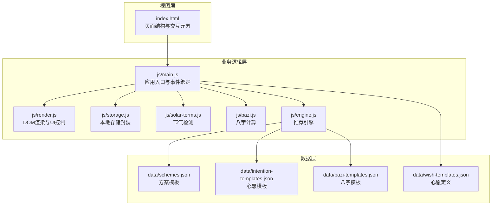
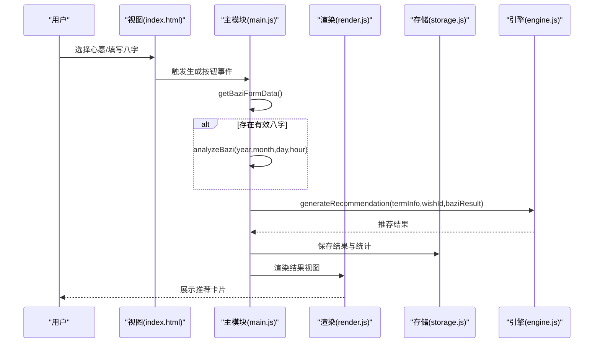
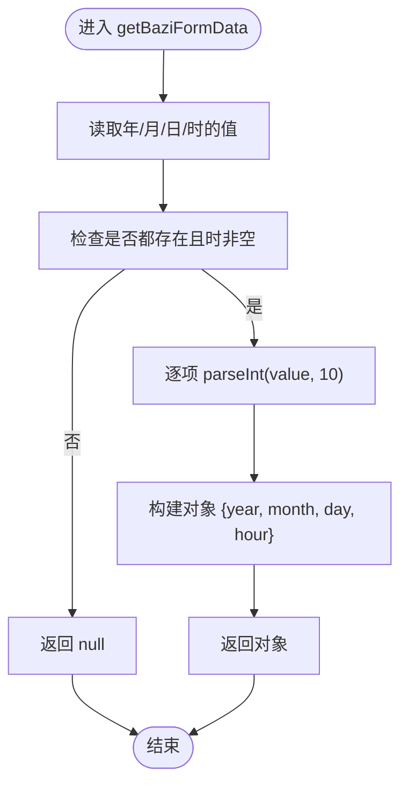
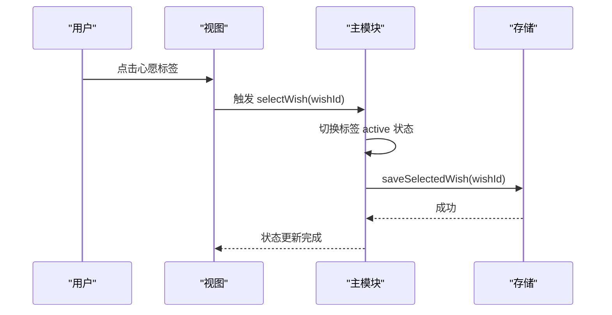
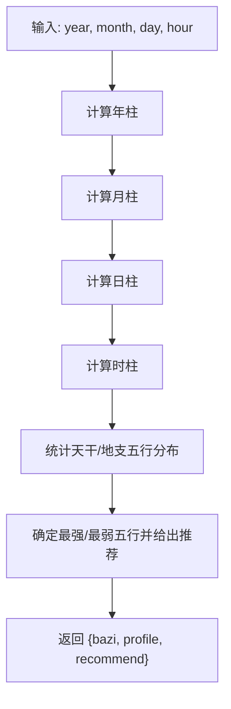
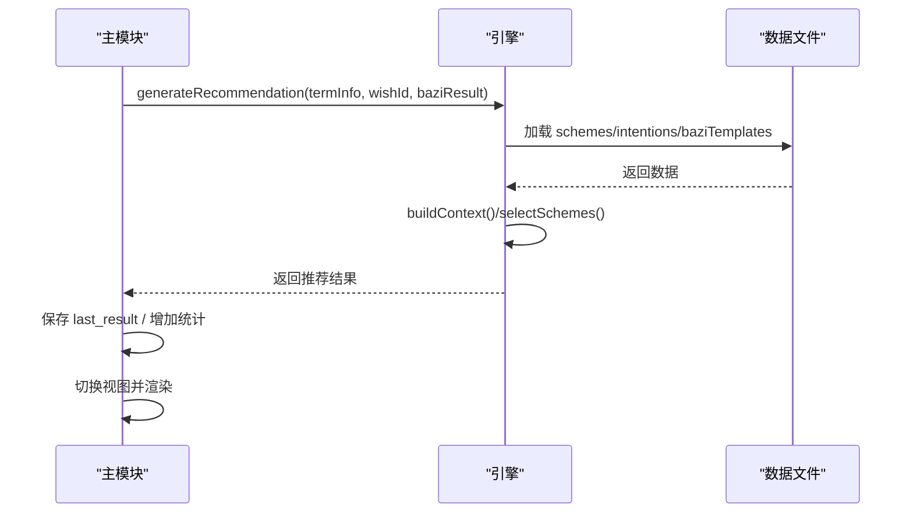
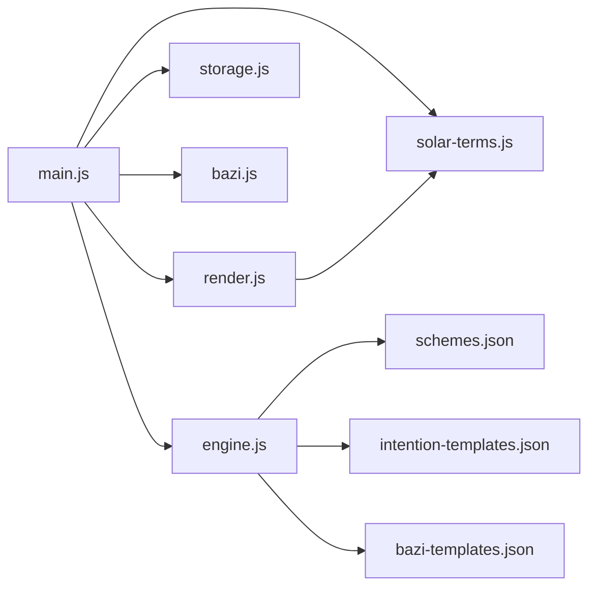

# 用户输入处理

<cite>
**本文档引用的文件**
- [index.html](file://index.html)
- [main.js](file://js/main.js)
- [bazi.js](file://js/bazi.js)
- [engine.js](file://js/engine.js)
- [render.js](file://js/render.js)
- [storage.js](file://js/storage.js)
- [solar-terms.js](file://js/solar-terms.js)
- [bazi-templates.json](file://data/bazi-templates.json)
- [wish-templates.json](file://data/wish-templates.json)
- [intention-templates.json](file://data/intention-templates.json)
- [schemes.json](file://data/schemes.json)
</cite>

## 目录
1. [简介](#简介)
2. [项目结构](#项目结构)
3. [核心组件](#核心组件)
4. [架构总览](#架构总览)
5. [详细组件分析](#详细组件分析)
6. [依赖关系分析](#依赖关系分析)
7. [性能考量](#性能考量)
8. [故障排查指南](#故障排查指南)
9. [结论](#结论)

## 简介
本文件聚焦“用户输入处理”的数据流，覆盖从表单收集、八字信息验证、心愿选择状态管理，到最终与推荐引擎对接的完整链路。重点解析以下关键流程：
- 表单数据获取：getBaziFormData() 的字段提取与类型转换
- 八字验证：validateBazi() 的规则与边界条件
- 心愿状态：selectWish() 的状态切换与持久化
- 输入变更与应用状态同步：事件绑定、状态更新与后续推荐计算
- 数据格式转换、类型检查与边界处理
- 用户体验优化与最佳实践

## 项目结构
系统采用模块化组织，HTML 页面承载视图，JS 模块负责业务逻辑、渲染与存储，JSON 数据文件提供静态模板与配置。

图表来源
- [index.html](file://index.html#L1-L236)
- [main.js](file://js/main.js#L1-L317)
- [render.js](file://js/render.js#L1-L272)
- [storage.js](file://js/storage.js#L1-L116)
- [solar-terms.js](file://js/solar-terms.js#L1-L118)
- [bazi.js](file://js/bazi.js#L1-L193)
- [engine.js](file://js/engine.js#L1-L335)
- [schemes.json](file://data/schemes.json#L1-L509)
- [intention-templates.json](file://data/intention-templates.json#L1-L253)
- [bazi-templates.json](file://data/bazi-templates.json#L1-L103)
- [wish-templates.json](file://data/wish-templates.json#L1-L47)

章节来源
- [index.html](file://index.html#L1-L236)
- [main.js](file://js/main.js#L1-L317)

## 核心组件
- 应用入口与事件绑定：初始化节气、恢复用户状态、绑定交互事件
- 表单数据采集：getBaziFormData() 提取并校验八字字段
- 心愿状态管理：selectWish() 切换选中状态并持久化
- 八字计算：analyzeBazi() 将输入转换为四柱与五行分布
- 推荐引擎：generateRecommendation() 结合节气、心愿、八字生成方案
- 渲染与存储：render.js 控制视图切换与卡片渲染；storage.js 管理本地持久化

章节来源
- [main.js](file://js/main.js#L17-L164)
- [bazi.js](file://js/bazi.js#L182-L193)
- [engine.js](file://js/engine.js#L268-L310)
- [render.js](file://js/render.js#L1-L272)
- [storage.js](file://js/storage.js#L1-L116)

## 架构总览
用户输入处理的关键路径如下：
- 用户在“信息输入”视图选择心愿与填写八字
- 主模块捕获事件，调用 getBaziFormData() 获取表单数据
- 若存在八字，调用 analyzeBazi() 计算四柱与五行推荐
- 调用 generateRecommendation() 生成推荐方案
- 渲染结果视图并保存结果到本地存储

图表来源
- [index.html](file://index.html#L38-L125)
- [main.js](file://js/main.js#L181-L244)
- [engine.js](file://js/engine.js#L268-L310)
- [render.js](file://js/render.js#L104-L127)
- [storage.js](file://js/storage.js#L60-L66)

## 详细组件分析

### 表单数据采集：getBaziFormData()
- 字段来源：年、月、日、时四个下拉选择器
- 类型转换：将字符串值转换为十进制整数
- 验证规则：要求年、月、日、时均存在且时非空字符串
- 返回值：满足条件时返回包含四个字段的对象；否则返回空值

图表来源
- [main.js](file://js/main.js#L181-L197)

章节来源
- [main.js](file://js/main.js#L181-L197)

### 八字验证与边界条件
- 输入边界：年份范围由年选择器初始化决定（例如 1950–当前年减 16 岁），确保用户至少 16 岁
- 月份与日期：月份固定 1–12，日期固定 1–31
- 时辰：0–11 对应子–亥时
- 有效性判定：getBaziFormData() 返回 null 表示输入不完整或无效
- 后续处理：若为空，主模块将 currentBaziResult 设为 null，不影响推荐流程（仅不启用八字维度）

章节来源
- [render.js](file://js/render.js#L21-L50)
- [main.js](file://js/main.js#L181-L197)

### 心愿选择状态管理：selectWish()
- 交互行为：点击心愿标签切换 active 类名
- 状态存储：将当前心愿ID写入本地存储，下次启动自动恢复
- 视图联动：渲染层根据 wishId 决定显示与样式

图表来源
- [main.js](file://js/main.js#L158-L164)
- [storage.js](file://js/storage.js#L109-L115)

章节来源
- [main.js](file://js/main.js#L158-L164)
- [storage.js](file://js/storage.js#L109-L115)

### 八字计算与推荐：analyzeBazi()
- 计算流程：年柱、月柱、日柱、时柱分别计算，汇总为完整八字
- 五行分布：统计天干与地支的五行数量，输出最强与最弱
- 推荐策略：推荐补充最弱五行，并给出简要分析

图表来源
- [bazi.js](file://js/bazi.js#L111-L192)

章节来源
- [bazi.js](file://js/bazi.js#L111-L192)

### 推荐计算与输入同步
- 输入同步：handleGenerate() 在生成前读取 wishId 与 baziResult，作为 generateRecommendation() 的上下文参数
- 上下文构建：buildContext() 将节气、心愿、八字权重组合为评分上下文
- 方案选择：selectSchemes() 基于权重与相生关系打分，保证多样性与相关性
- 结果保存：生成完成后保存 last_result 并切换视图

图表来源
- [main.js](file://js/main.js#L202-L244)
- [engine.js](file://js/engine.js#L268-L310)

章节来源
- [main.js](file://js/main.js#L202-L244)
- [engine.js](file://js/engine.js#L268-L310)

## 依赖关系分析
- 模块耦合
  - main.js 依赖 render.js、storage.js、solar-terms.js、bazi.js、engine.js
  - engine.js 依赖 schemes.json、intention-templates.json、bazi-templates.json
  - render.js 依赖 solar-terms.js 的颜色映射
- 数据流向
  - 用户输入 → main.js → bazi.js/engine.js → render.js → storage.js
- 外部依赖
  - fetch 加载 JSON 数据文件
  - localStorage 本地持久化

图表来源
- [main.js](file://js/main.js#L1-L16)
- [engine.js](file://js/engine.js#L39-L79)
- [render.js](file://js/render.js#L76-L99)

章节来源
- [main.js](file://js/main.js#L1-L16)
- [engine.js](file://js/engine.js#L39-L79)
- [render.js](file://js/render.js#L76-L99)

## 性能考量
- 异步加载：推荐引擎使用 Promise.all 并行加载多份模板数据，减少等待时间
- 本地存储：使用 localStorage 缓存用户选择与结果，避免重复计算与网络请求
- 渲染优化：卡片渲染采用批量插入与动画延迟，提升首屏体验
- 边界处理：getBaziFormData() 在输入不完整时直接返回空，避免后续复杂计算

[本节为通用指导，无需列出具体文件来源]

## 故障排查指南
- 八字输入无效
  - 症状：生成失败或提示“请重试”
  - 排查：确认年、月、日、时均已选择且时非空；检查 getBaziFormData() 是否返回 null
  - 处理：引导用户补齐必填项
- 心愿未生效
  - 症状：推荐未体现心愿偏好
  - 排查：确认 selectWish() 已更新 active 状态并保存到 storage
  - 处理：刷新页面或重新选择心愿
- 推荐重复或相似
  - 症状：多次生成结果高度相似
  - 排查：检查 generateRecommendation() 的 excludeIds 逻辑与 selectSchemes() 的多样性策略
  - 处理：使用“换一批”功能或调整心愿/八字输入
- 视图切换异常
  - 症状：无法从输入页跳转到结果页
  - 排查：确认 handleGenerate() 中的视图切换与渲染调用顺序
  - 处理：检查控制台错误与 DOM 元素是否存在

章节来源
- [main.js](file://js/main.js#L202-L244)
- [render.js](file://js/render.js#L8-L16)
- [storage.js](file://js/storage.js#L109-L115)

## 结论
本项目通过清晰的模块划分与事件驱动的数据流，实现了从用户输入到推荐结果的闭环。getBaziFormData() 提供了简洁可靠的输入提取与基础校验，selectWish() 实现了心愿状态的可视化与持久化，analyzeBazi() 将传统命理概念转化为可计算的五行分布，最终由 engine.js 结合节气与心愿生成个性化方案。建议在后续迭代中进一步增强输入校验的提示信息与容错处理，持续优化推荐算法的多样性与解释性，以提升用户体验与信任度。