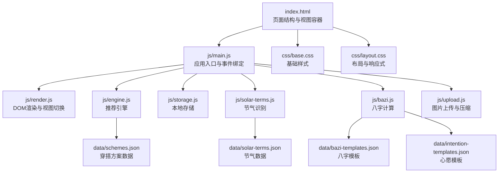
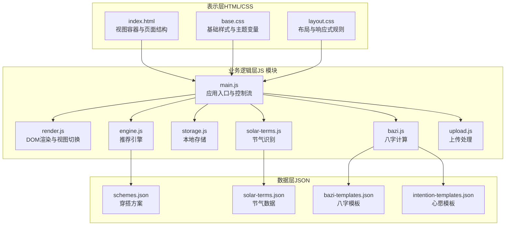
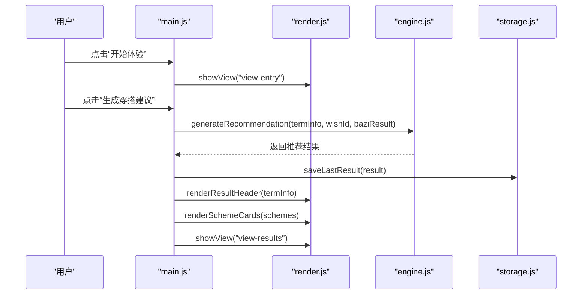
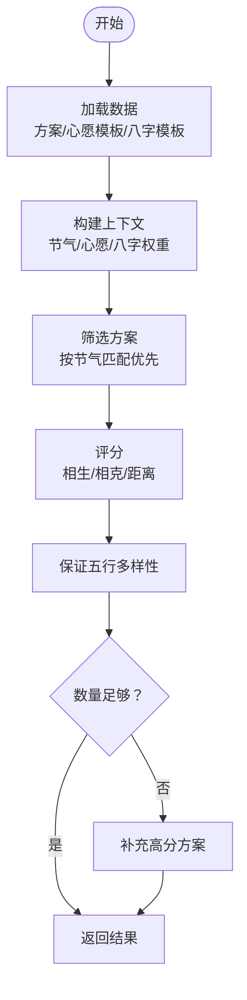
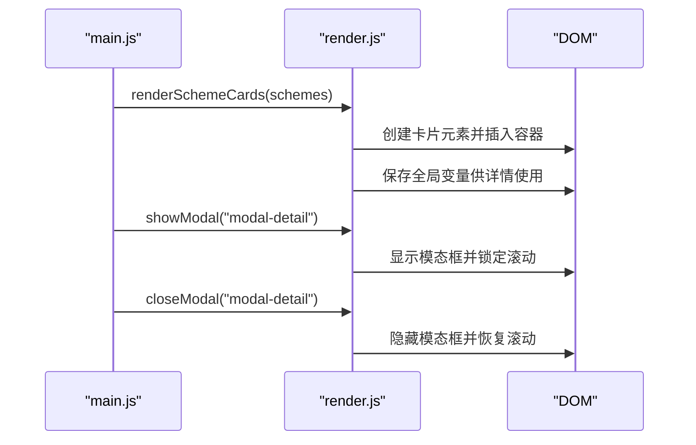
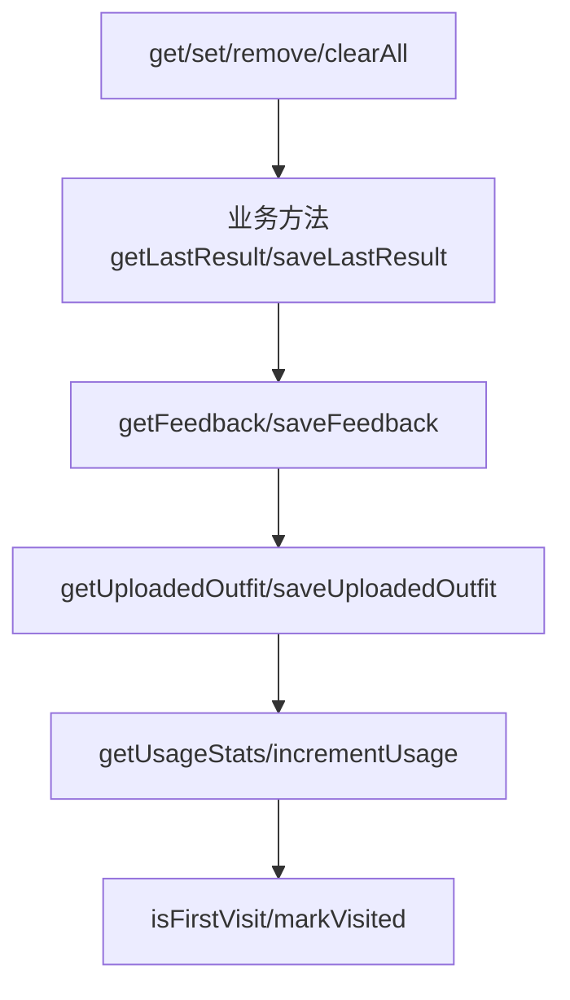
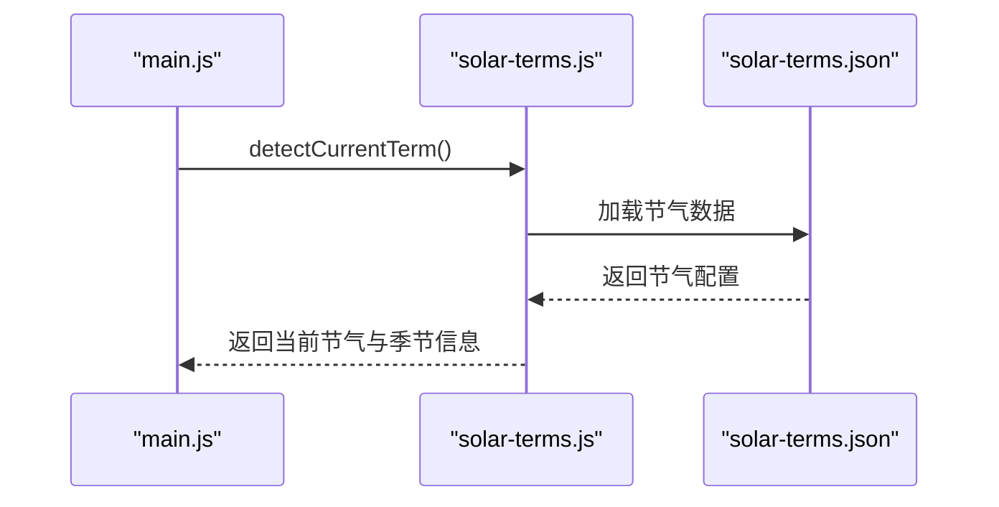
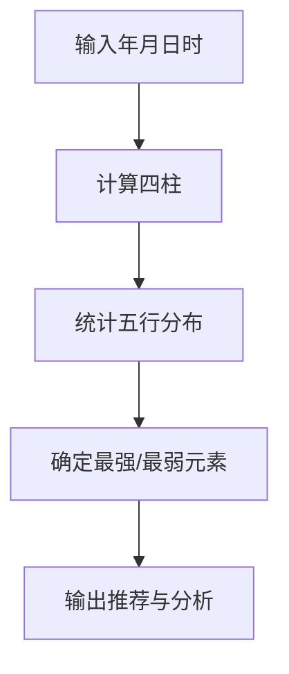
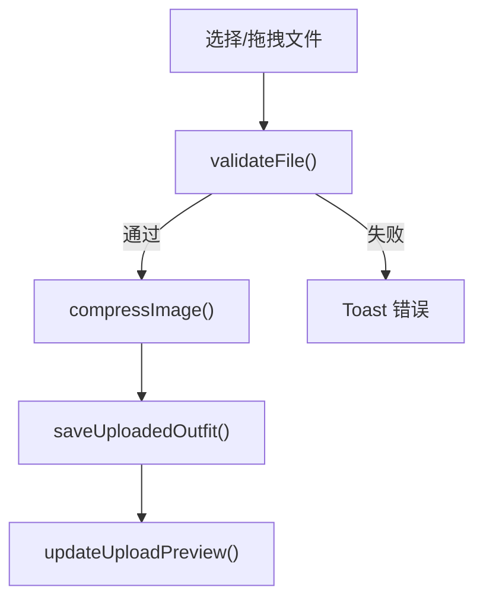
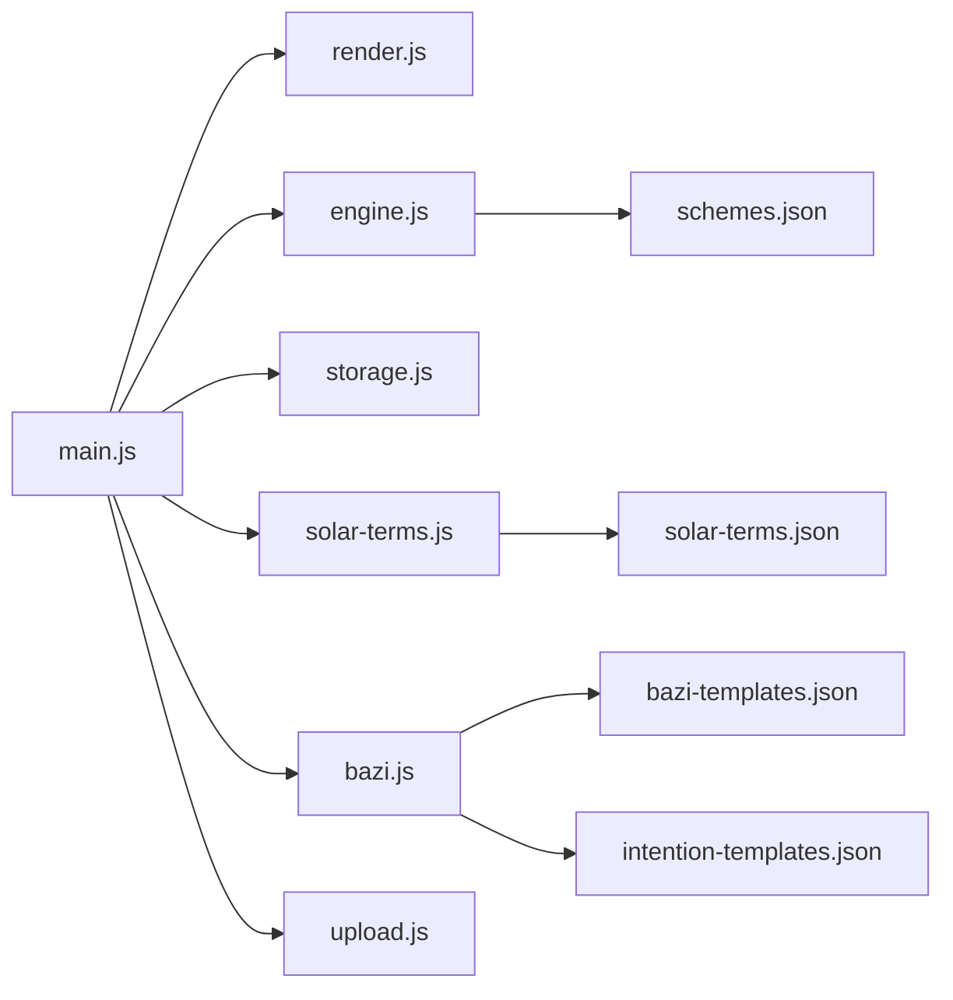

# 整体架构模式

<cite>
**本文档引用的文件**
- [index.html](file://index.html)
- [main.js](file://js/main.js)
- [engine.js](file://js/engine.js)
- [render.js](file://js/render.js)
- [storage.js](file://js/storage.js)
- [solar-terms.js](file://js/solar-terms.js)
- [bazi.js](file://js/bazi.js)
- [upload.js](file://js/upload.js)
- [schemes.json](file://data/schemes.json)
- [base.css](file://css/base.css)
- [layout.css](file://css/layout.css)
</cite>

## 目录
1. [引言](#引言)
2. [项目结构](#项目结构)
3. [核心组件](#核心组件)
4. [架构总览](#架构总览)
5. [详细组件分析](#详细组件分析)
6. [依赖关系分析](#依赖关系分析)
7. [性能考量](#性能考量)
8. [故障排查指南](#故障排查指南)
9. [结论](#结论)

## 引言
本项目是一个基于传统节气与五行理论的“五行穿搭建议”单页应用（SPA）。系统采用纯原生 JavaScript 实现，不依赖任何现代前端框架，通过模块化设计与清晰的分层架构，实现了从数据加载、业务逻辑处理到界面渲染与用户交互的完整闭环。本文档旨在系统阐述该 SPA 的整体架构模式，解释为何选择纯原生实现，以及如何通过模块化、事件驱动与状态管理等手段构建可维护、可扩展的应用。

## 项目结构
项目采用“页面 + 模块化脚本 + 数据文件 + 样式表”的组织方式：
- 页面结构：index.html 定义视图容器与各页面布局
- 表示层：CSS 文件定义基础样式、布局与响应式规则
- 业务逻辑层：ES6 模块化的 JavaScript 文件负责功能实现
- 数据层：JSON 文件提供穿搭方案、节气与模板数据
- 资源与工具：上传处理、本地存储、节气识别、八字计算等

图表来源
- [index.html](file://index.html#L20-L236)
- [main.js](file://js/main.js#L1-L317)
- [render.js](file://js/render.js#L1-L272)
- [engine.js](file://js/engine.js#L1-L335)
- [storage.js](file://js/storage.js#L1-L116)
- [solar-terms.js](file://js/solar-terms.js#L1-L118)
- [bazi.js](file://js/bazi.js#L1-L193)
- [upload.js](file://js/upload.js#L1-L145)
- [schemes.json](file://data/schemes.json#L1-L509)
- [base.css](file://css/base.css#L1-L168)
- [layout.css](file://css/layout.css#L1-L252)

章节来源
- [index.html](file://index.html#L20-L236)
- [main.js](file://js/main.js#L1-L317)
- [base.css](file://css/base.css#L1-L168)
- [layout.css](file://css/layout.css#L1-L252)

## 核心组件
- 应用入口与控制流：main.js 负责初始化、事件绑定、状态更新与流程编排
- 推荐引擎：engine.js 负责加载数据、构建上下文、评分与筛选方案
- 视图渲染：render.js 负责 DOM 操作、视图切换、模态框与提示
- 本地存储：storage.js 提供统一的键值存取与统计
- 节气识别：solar-terms.js 负责当前节气检测与五行颜色映射
- 八字计算：bazi.js 提供简化版八字四柱与五行分析
- 上传处理：upload.js 负责文件校验、压缩与拖拽上传
- 数据文件：JSON 文件提供穿搭方案、节气与模板数据

章节来源
- [main.js](file://js/main.js#L1-L317)
- [engine.js](file://js/engine.js#L1-L335)
- [render.js](file://js/render.js#L1-L272)
- [storage.js](file://js/storage.js#L1-L116)
- [solar-terms.js](file://js/solar-terms.js#L1-L118)
- [bazi.js](file://js/bazi.js#L1-L193)
- [upload.js](file://js/upload.js#L1-L145)

## 架构总览
系统采用“模块化单页应用（SPA）+ 分层架构”的设计：
- 表示层（HTML/CSS）：负责静态结构与视觉表现，通过 CSS 变量与响应式布局实现主题一致性与跨端适配
- 业务逻辑层（JavaScript 模块）：通过 ES6 模块系统组织功能，实现高内聚低耦合
- 数据层（JSON 文件）：提供静态数据支撑推荐算法与展示内容
- 事件驱动与状态管理：通过 DOM 事件绑定与应用状态变量实现响应式交互

图表来源
- [index.html](file://index.html#L20-L236)
- [base.css](file://css/base.css#L1-L168)
- [layout.css](file://css/layout.css#L1-L252)
- [main.js](file://js/main.js#L1-L317)
- [render.js](file://js/render.js#L1-L272)
- [engine.js](file://js/engine.js#L1-L335)
- [storage.js](file://js/storage.js#L1-L116)
- [solar-terms.js](file://js/solar-terms.js#L1-L118)
- [bazi.js](file://js/bazi.js#L1-L193)
- [upload.js](file://js/upload.js#L1-L145)
- [schemes.json](file://data/schemes.json#L1-L509)

## 详细组件分析

### 应用入口与事件驱动架构（main.js）
- 初始化流程：加载节气信息、初始化表单、渲染节气横幅、恢复用户偏好、绑定事件、初始化上传区域、统计访问
- 事件绑定策略：采用直接绑定与事件委托相结合的方式，如详情按钮使用委托避免重复绑定
- 状态管理：通过应用级变量维护当前节气、心愿、八字、推荐结果等状态
- 控制流编排：在生成与换一批等操作中协调多个模块（渲染、存储、引擎）

图表来源
- [main.js](file://js/main.js#L72-L153)
- [render.js](file://js/render.js#L8-L16)
- [engine.js](file://js/engine.js#L268-L310)
- [storage.js](file://js/storage.js#L60-L66)

章节来源
- [main.js](file://js/main.js#L26-L67)
- [main.js](file://js/main.js#L72-L153)
- [main.js](file://js/main.js#L202-L244)

### 推荐引擎（engine.js）
- 数据加载：异步加载方案、心愿模板与八字模板，Promise 并行优化
- 上下文构建：综合节气、心愿与八字分析结果，形成加权评分上下文
- 评分与筛选：依据五行相生相克与节气距离计算得分，确保方案多样性与高分优先
- 结果封装：返回包含方案列表、节气信息、模板匹配与生成时间的结果对象

图表来源
- [engine.js](file://js/engine.js#L268-L310)
- [engine.js](file://js/engine.js#L157-L173)
- [engine.js](file://js/engine.js#L218-L259)

章节来源
- [engine.js](file://js/engine.js#L39-L79)
- [engine.js](file://js/engine.js#L157-L173)
- [engine.js](file://js/engine.js#L218-L259)
- [engine.js](file://js/engine.js#L268-L310)

### 视图渲染与状态呈现（render.js）
- 视图切换：通过隐藏/显示类名实现多视图切换
- DOM 操作：动态创建卡片、设置动画延迟、更新模态框内容
- 交互反馈：Toast 消息、模态框开闭、上传预览更新
- 事件委托：在容器上监听按钮点击，避免重复绑定

图表来源
- [render.js](file://js/render.js#L114-L127)
- [render.js](file://js/render.js#L198-L215)
- [render.js](file://js/render.js#L242-L271)

章节来源
- [render.js](file://js/render.js#L8-L16)
- [render.js](file://js/render.js#L114-L127)
- [render.js](file://js/render.js#L198-L215)
- [render.js](file://js/render.js#L242-L271)

### 本地存储与持久化（storage.js）
- 统一前缀：所有键值均带前缀，避免冲突
- 业务方法：提供最后结果、反馈、上传图片、使用统计、首次访问标记等方法
- 原子性：读写均进行 JSON 解析/序列化与异常捕获

图表来源
- [storage.js](file://js/storage.js#L7-L27)
- [storage.js](file://js/storage.js#L52-L115)

章节来源
- [storage.js](file://js/storage.js#L1-L116)

### 节气识别与颜色映射（solar-terms.js）
- UTC+8 时间转换：确保节气判断基于正确时区
- 数据加载：异步加载节气配置，包含节气顺序、名称映射与季节信息
- 当前节气检测：遍历节气表定位当前节气与下一节气
- 五行颜色映射：提供节气对应的视觉颜色

图表来源
- [solar-terms.js](file://js/solar-terms.js#L36-L103)
- [solar-terms.js](file://js/solar-terms.js#L18-L29)

章节来源
- [solar-terms.js](file://js/solar-terms.js#L10-L13)
- [solar-terms.js](file://js/solar-terms.js#L36-L103)

### 八字计算与推荐（bazi.js）
- 四柱计算：简化版年、月、日、时柱计算，基于天干地支与遁法
- 五行分布：统计天干地支五行出现次数，得出强弱分析
- 推荐策略：推荐补充最弱五行，给出简要分析文本

图表来源
- [bazi.js](file://js/bazi.js#L111-L124)
- [bazi.js](file://js/bazi.js#L129-L153)
- [bazi.js](file://js/bazi.js#L182-L192)

章节来源
- [bazi.js](file://js/bazi.js#L111-L124)
- [bazi.js](file://js/bazi.js#L129-L153)
- [bazi.js](file://js/bazi.js#L182-L192)

### 上传处理与压缩（upload.js）
- 文件验证：类型、大小检查
- 图像压缩：Canvas 缩放与质量迭代压缩，目标大小与最大边约束
- 上传区域：点击、键盘激活、拖拽支持，回调驱动处理

图表来源
- [upload.js](file://js/upload.js#L12-L26)
- [upload.js](file://js/upload.js#L31-L82)
- [upload.js](file://js/upload.js#L87-L136)

章节来源
- [upload.js](file://js/upload.js#L12-L26)
- [upload.js](file://js/upload.js#L31-L82)
- [upload.js](file://js/upload.js#L87-L136)

## 依赖关系分析
- 模块导入：main.js 作为入口，集中导入并导出各模块接口，形成清晰的依赖链
- 数据依赖：engine.js 依赖 JSON 数据文件；solar-terms.js 依赖节气配置；bazi.js 依赖模板数据
- 事件耦合：main.js 与 render.js 通过函数调用耦合，避免直接 DOM 依赖
- 存储解耦：storage.js 对外暴露统一接口，被多个模块复用

图表来源
- [main.js](file://js/main.js#L5-L15)
- [engine.js](file://js/engine.js#L39-L79)
- [solar-terms.js](file://js/solar-terms.js#L18-L29)
- [bazi.js](file://js/bazi.js#L1-L193)
- [schemes.json](file://data/schemes.json#L1-L509)

章节来源
- [main.js](file://js/main.js#L5-L15)

## 性能考量
- 模块加载：使用 ES6 模块与按需加载，减少初始包体
- 数据加载：Promise 并行加载多份数据，缩短首屏等待
- DOM 操作：批量插入与事件委托减少重排重绘
- 图像处理：Canvas 压缩与质量迭代，兼顾体积与清晰度
- 本地存储：键值前缀与结构化存储，避免频繁序列化开销

## 故障排查指南
- 节气识别失败：检查节气数据加载是否成功，确认时区转换逻辑
- 推荐为空：确认 JSON 数据完整性与网络请求状态
- 上传失败：检查文件类型与大小限制，确认 Canvas 压缩流程
- 视图不切换：检查视图类名切换逻辑与容器存在性
- 存储异常：确认浏览器本地存储可用性与键名前缀

章节来源
- [solar-terms.js](file://js/solar-terms.js#L21-L28)
- [engine.js](file://js/engine.js#L41-L48)
- [upload.js](file://js/upload.js#L35-L81)
- [render.js](file://js/render.js#L8-L16)
- [storage.js](file://js/storage.js#L7-L27)

## 结论
本项目通过纯原生 JavaScript 实现了一个结构清晰、职责分明的单页应用。模块化设计与 ES6 模块系统提供了良好的代码组织与依赖管理；事件驱动与状态管理使交互响应流畅；分层架构明确了表示层、业务层与数据层的边界。该架构既适合初学者理解 SPA 的核心概念，也为进阶开发者提供了可扩展的技术决策背景与实践参考。