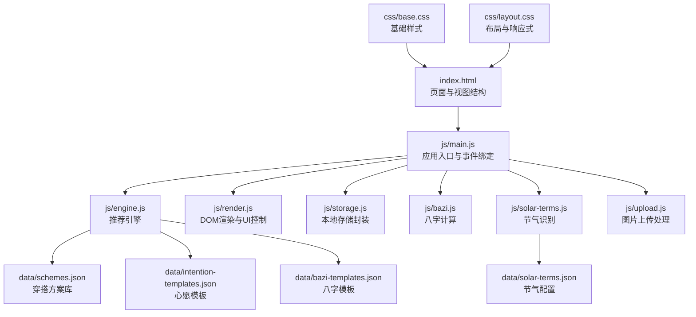
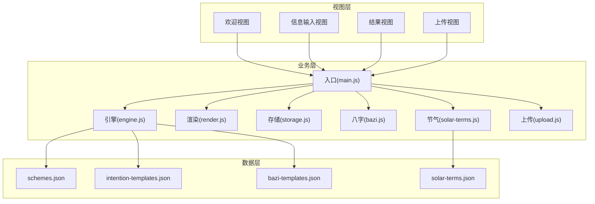
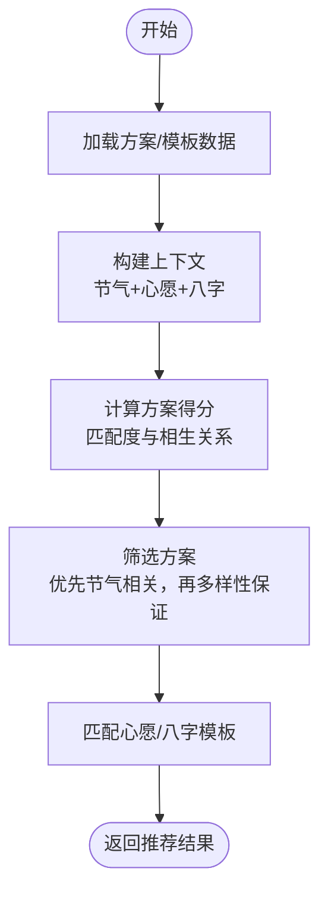
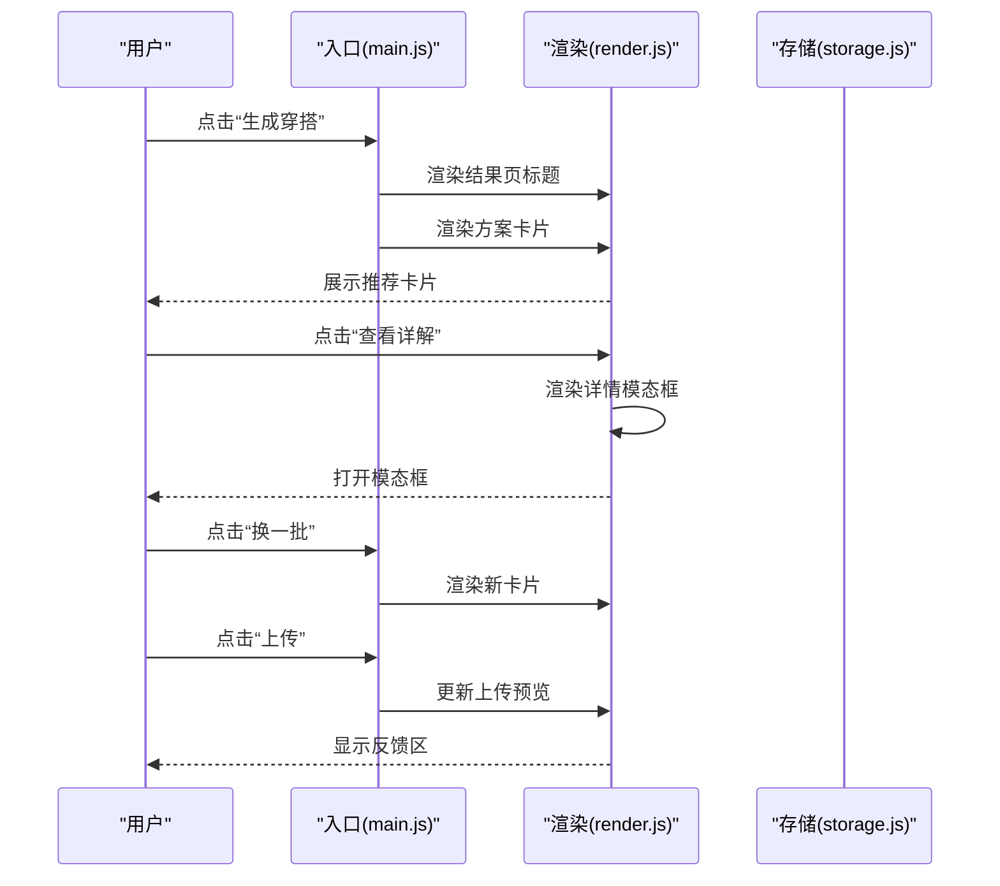
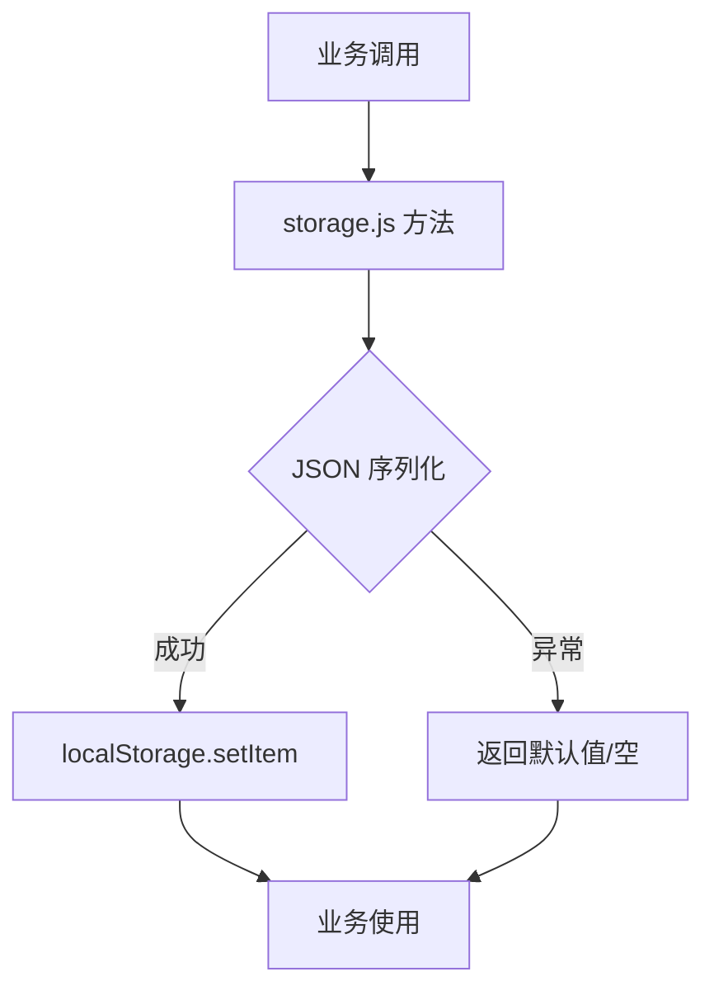
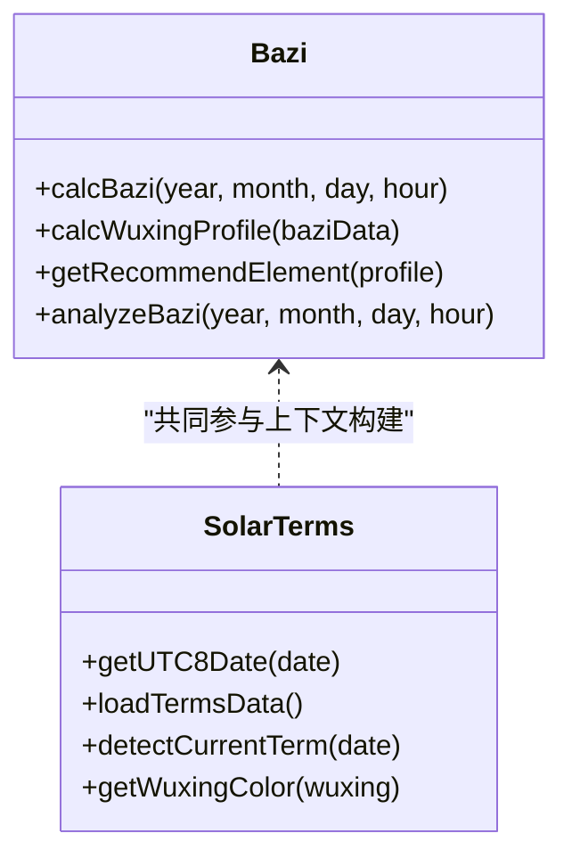
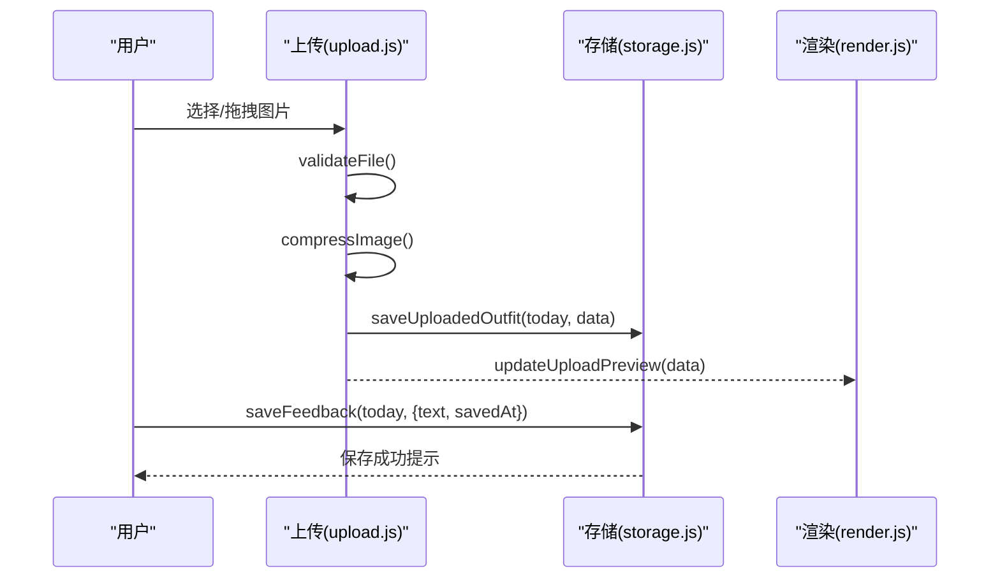
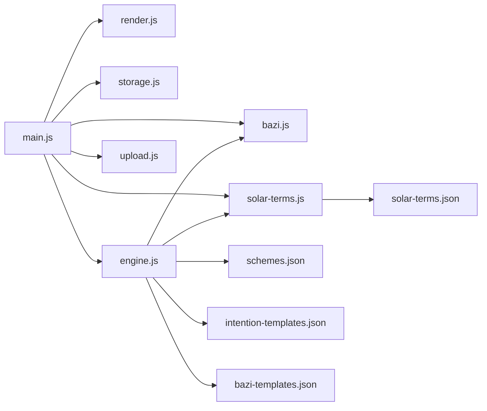

# 架构设计

<cite>
**本文引用的文件**
- [index.html](file://index.html)
- [main.js](file://js/main.js)
- [engine.js](file://js/engine.js)
- [render.js](file://js/render.js)
- [storage.js](file://js/storage.js)
- [bazi.js](file://js/bazi.js)
- [solar-terms.js](file://js/solar-terms.js)
- [upload.js](file://js/upload.js)
- [schemes.json](file://data/schemes.json)
- [intention-templates.json](file://data/intention-templates.json)
- [bazi-templates.json](file://data/bazi-templates.json)
- [solar-terms.json](file://data/solar-terms.json)
- [base.css](file://css/base.css)
- [layout.css](file://css/layout.css)
</cite>

## 目录
1. [简介](#简介)
2. [项目结构](#项目结构)
3. [核心组件](#核心组件)
4. [架构总览](#架构总览)
5. [详细组件分析](#详细组件分析)
6. [依赖关系分析](#依赖关系分析)
7. [性能考量](#性能考量)
8. [故障排查指南](#故障排查指南)
9. [结论](#结论)
10. [附录](#附录)

## 简介
本项目是一个基于传统节气与五行理论的“五行穿搭建议”单页应用（SPA）。系统通过识别当前节气、收集用户心愿与生辰八字（可选），结合内置方案库与模板库，生成符合时令与个人五行的穿搭推荐，并提供上传穿搭照片与反馈记录功能。应用采用纯原生 JavaScript 实现，模块化组织，数据持久化于浏览器本地存储，界面通过 CSS 变量与响应式布局实现一致的视觉风格。

## 项目结构
项目采用“页面 + 模块化脚本 + 数据资源 + 样式层”的组织方式：
- 页面与视图：index.html 定义多视图结构与交互元素
- 模块化脚本：js/ 下按功能拆分为入口、引擎、渲染、存储、八字、节气、上传等模块
- 数据资源：data/ 下存放 JSON 格式的方案、模板与节气配置
- 样式层：css/ 下按基础、布局、组件、动画等层次组织

图表来源
- [index.html](file://index.html#L20-L236)
- [main.js](file://js/main.js#L1-L317)
- [engine.js](file://js/engine.js#L1-L335)
- [render.js](file://js/render.js#L1-L272)
- [storage.js](file://js/storage.js#L1-L116)
- [bazi.js](file://js/bazi.js#L1-L193)
- [solar-terms.js](file://js/solar-terms.js#L1-L118)
- [upload.js](file://js/upload.js#L1-L145)
- [schemes.json](file://data/schemes.json#L1-L509)
- [intention-templates.json](file://data/intention-templates.json#L1-L253)
- [bazi-templates.json](file://data/bazi-templates.json#L1-L103)
- [solar-terms.json](file://data/solar-terms.json#L1-L42)
- [base.css](file://css/base.css#L1-L168)
- [layout.css](file://css/layout.css#L1-L252)

章节来源
- [index.html](file://index.html#L20-L236)
- [main.js](file://js/main.js#L1-L317)
- [base.css](file://css/base.css#L1-L168)
- [layout.css](file://css/layout.css#L1-L252)

## 核心组件
- 应用入口模块（main.js）
  - 负责初始化、事件绑定、视图切换、业务流程编排
  - 与渲染、存储、上传、引擎模块协作
- 推荐引擎模块（engine.js）
  - 负责加载方案与模板、构建推荐上下文、评分与筛选
- 渲染模块（render.js）
  - 负责视图切换、DOM 渲染、模态框、Toast 提示
- 存储模块（storage.js）
  - 负责本地存储封装、键空间前缀、使用统计
- 八字模块（bazi.js）
  - 负责简化版八字计算、五行分布统计、推荐元素
- 节气模块（solar-terms.js）
  - 负责加载节气数据、检测当前节气、获取节气对应颜色
- 上传模块（upload.js）
  - 负责文件校验、图片压缩、拖拽上传、日期键管理

章节来源
- [main.js](file://js/main.js#L1-L317)
- [engine.js](file://js/engine.js#L1-L335)
- [render.js](file://js/render.js#L1-L272)
- [storage.js](file://js/storage.js#L1-L116)
- [bazi.js](file://js/bazi.js#L1-L193)
- [solar-terms.js](file://js/solar-terms.js#L1-L118)
- [upload.js](file://js/upload.js#L1-L145)

## 架构总览
系统采用模块化单页应用（SPA）架构，页面通过视图切换实现无刷新导航。数据流自上而下：用户交互触发入口模块，入口模块协调引擎与渲染模块，引擎从数据资源加载并计算推荐，渲染模块更新 DOM，存储模块负责本地持久化。

图表来源
- [index.html](file://index.html#L24-L196)
- [main.js](file://js/main.js#L26-L67)
- [engine.js](file://js/engine.js#L39-L79)
- [solar-terms.js](file://js/solar-terms.js#L18-L29)
- [schemes.json](file://data/schemes.json#L1-L509)
- [intention-templates.json](file://data/intention-templates.json#L1-L253)
- [bazi-templates.json](file://data/bazi-templates.json#L1-L103)
- [solar-terms.json](file://data/solar-terms.json#L1-L42)

## 详细组件分析

### 推荐引擎工作原理
推荐引擎的核心流程包括：加载数据、构建上下文、评分与筛选、模板匹配。评分综合考虑节气五行、心愿偏好与八字推荐，最终输出3个方案卡片。

图表来源
- [engine.js](file://js/engine.js#L268-L310)
- [engine.js](file://js/engine.js#L157-L173)
- [engine.js](file://js/engine.js#L178-L199)
- [engine.js](file://js/engine.js#L218-L259)
- [engine.js](file://js/engine.js#L288-L310)

章节来源
- [engine.js](file://js/engine.js#L1-L335)
- [schemes.json](file://data/schemes.json#L1-L509)
- [intention-templates.json](file://data/intention-templates.json#L1-L253)
- [bazi-templates.json](file://data/bazi-templates.json#L1-L103)

### 渲染系统实现
渲染系统负责视图切换、卡片渲染、模态框展示与 Toast 提示。通过统一的工具函数减少对 DOM 的直接操作，提升可维护性。

图表来源
- [main.js](file://js/main.js#L202-L244)
- [main.js](file://js/main.js#L249-L269)
- [main.js](file://js/main.js#L106-L113)
- [render.js](file://js/render.js#L104-L127)
- [render.js](file://js/render.js#L159-L193)
- [render.js](file://js/render.js#L219-L237)

章节来源
- [render.js](file://js/render.js#L1-L272)

### 存储系统数据管理机制
存储系统以统一前缀封装 localStorage，提供业务级方法（如最后结果、反馈、上传图片、使用统计等），并支持按前缀批量清理。

图表来源
- [storage.js](file://js/storage.js#L7-L23)
- [storage.js](file://js/storage.js#L52-L115)

章节来源
- [storage.js](file://js/storage.js#L1-L116)

### 八字与节气模块
- 八字模块提供简化版四柱计算、五行分布统计与推荐元素，作为引擎上下文的一部分
- 节气模块负责 UTC+8 时间转换、节气识别与季节信息提取

图表来源
- [bazi.js](file://js/bazi.js#L111-L192)
- [solar-terms.js](file://js/solar-terms.js#L36-L103)

章节来源
- [bazi.js](file://js/bazi.js#L1-L193)
- [solar-terms.js](file://js/solar-terms.js#L1-L118)

### 上传与反馈流程
上传模块负责文件验证、图片压缩、拖拽上传与预览更新；反馈模块将用户文本与时间戳存入本地存储。

图表来源
- [upload.js](file://js/upload.js#L12-L82)
- [upload.js](file://js/upload.js#L87-L136)
- [storage.js](file://js/storage.js#L79-L89)
- [storage.js](file://js/storage.js#L306-L313)
- [render.js](file://js/render.js#L219-L237)

章节来源
- [upload.js](file://js/upload.js#L1-L145)
- [storage.js](file://js/storage.js#L1-L116)

## 依赖关系分析
- 入口模块依赖渲染、存储、上传、引擎、八字、节气模块
- 引擎模块依赖数据资源与节气/八字模块
- 渲染模块依赖入口模块提供的回调与存储模块的状态
- 存储模块被入口与上传模块广泛使用
- 上传模块依赖入口模块的回调

图表来源
- [main.js](file://js/main.js#L5-L15)
- [engine.js](file://js/engine.js#L39-L79)
- [solar-terms.js](file://js/solar-terms.js#L18-L29)
- [schemes.json](file://data/schemes.json#L1-L509)
- [intention-templates.json](file://data/intention-templates.json#L1-L253)
- [bazi-templates.json](file://data/bazi-templates.json#L1-L103)
- [solar-terms.json](file://data/solar-terms.json#L1-L42)

章节来源
- [main.js](file://js/main.js#L1-L317)
- [engine.js](file://js/engine.js#L1-L335)

## 性能考量
- 模块化与懒加载：数据资源通过异步加载，避免首屏阻塞
- 评分与筛选：在内存中进行，复杂度与方案数量线性相关，建议限制候选集规模
- 图片压缩：在客户端完成，降低网络传输与服务器压力
- 本地存储：避免频繁写入，合并更新策略（如使用对象聚合）

## 故障排查指南
- 生成失败
  - 检查数据资源是否加载成功
  - 确认节气识别与上下文构建是否正常
- 上传失败
  - 检查文件类型与大小限制
  - 确认压缩流程是否抛错
- 本地存储异常
  - 检查浏览器是否禁用 localStorage 或存储空间不足
  - 使用批量清理方法恢复

章节来源
- [engine.js](file://js/engine.js#L41-L48)
- [solar-terms.js](file://js/solar-terms.js#L21-L28)
- [upload.js](file://js/upload.js#L12-L26)
- [upload.js](file://js/upload.js#L31-L82)
- [storage.js](file://js/storage.js#L7-L23)

## 结论
本项目以纯原生 JavaScript 实现了完整的 SPA 架构，模块边界清晰、职责单一，数据持久化与渲染逻辑分离，具备良好的可维护性与扩展性。推荐引擎融合时令、心愿与个人命理，形成可解释的推荐依据；上传与反馈机制完善用户体验闭环。未来可在以下方面持续优化：引入缓存策略、增强错误监控、扩展模板与方案库、增加离线能力与数据迁移机制。

## 附录
- 技术决策背景
  - 选择纯原生 JavaScript：减少第三方依赖，便于部署与维护，适配移动端与现代浏览器
  - 模块化组织：按功能拆分，提高代码复用与测试便利性
  - 本地存储：保障隐私与离线可用性，避免服务端依赖
  - 响应式布局：使用 CSS 变量与媒体查询，兼顾桌面与移动体验