# 架构设计

<cite>
**本文引用的文件**
- [js/core/app.js](file://js/core/app.js)
- [js/core/router.js](file://js/core/router.js)
- [js/core/store.js](file://js/core/store.js)
- [js/controllers/base.js](file://js/controllers/base.js)
- [js/controllers/welcome.js](file://js/controllers/welcome.js)
- [js/core/error-handler.js](file://js/core/error-handler.js)
- [js/core/scorer.js](file://js/core/scorer.js)
- [js/services/engine.js](file://js/services/engine.js)
- [js/services/recommendation.js](file://js/services/recommendation.js)
- [js/data/repository.js](file://js/data/repository.js)
- [js/data/data-manager.js](file://js/data/data-manager.js)
- [js/utils/render.js](file://js/utils/render.js)
- [js/utils/share.js](file://js/utils/share.js)
- [js/utils/upload.js](file://js/utils/upload.js)
</cite>

## 目录
1. [引言](#引言)
2. [项目结构](#项目结构)
3. [核心组件](#核心组件)
4. [架构总览](#架构总览)
5. [详细组件分析](#详细组件分析)
6. [依赖分析](#依赖分析)
7. [性能考虑](#性能考虑)
8. [故障排查指南](#故障排查指南)
9. [结论](#结论)

## 引言
本项目采用前端单页应用架构，围绕“模型-视图-控制器”（MVC）模式组织代码，结合轻量路由与集中式状态管理，实现“五行穿搭建议”的交互流程。系统通过控制器负责视图生命周期与事件绑定，视图通过服务层进行业务计算，状态通过 Store 集中管理，并通过错误处理器统一兜底。

## 项目结构
项目采用按职责分层的模块化组织方式：
- 核心层：应用入口、路由、状态、评分器、错误处理
- 控制器层：各视图对应的控制器，封装挂载/卸载与事件绑定
- 服务层：推荐引擎、天气、解释文案、运势等业务逻辑
- 数据层：仓库（Repository）、数据管理（导入/导出）、本地存储
- 工具层：渲染、分享、上传等辅助能力
- 视图层：HTML 页面与样式

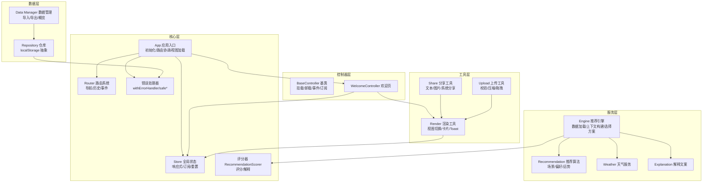

**图表来源**
- [js/core/app.js](file://js/core/app.js#L36-L196)
- [js/core/router.js](file://js/core/router.js#L25-L79)
- [js/core/store.js](file://js/core/store.js#L30-L187)
- [js/controllers/base.js](file://js/controllers/base.js#L11-L131)
- [js/controllers/welcome.js](file://js/controllers/welcome.js#L13-L134)
- [js/core/error-handler.js](file://js/core/error-handler.js#L45-L189)
- [js/core/scorer.js](file://js/core/scorer.js#L14-L317)
- [js/services/engine.js](file://js/services/engine.js#L1-L425)
- [js/services/recommendation.js](file://js/services/recommendation.js#L1-L466)
- [js/data/repository.js](file://js/data/repository.js#L46-L394)
- [js/data/data-manager.js](file://js/data/data-manager.js#L48-L376)
- [js/utils/render.js](file://js/utils/render.js#L13-L487)
- [js/utils/share.js](file://js/utils/share.js#L14-L333)
- [js/utils/upload.js](file://js/utils/upload.js#L12-L145)

**章节来源**
- [js/core/app.js](file://js/core/app.js#L23-L31)
- [js/core/router.js](file://js/core/router.js#L9-L17)
- [js/core/store.js](file://js/core/store.js#L33-L51)
- [js/controllers/base.js](file://js/controllers/base.js#L11-L16)
- [js/services/engine.js](file://js/services/engine.js#L60-L85)

## 核心组件
- App 应用入口：负责全局初始化、视图预加载、路由协调、错误处理、统计初始化与视图切换。
- Router 路由系统：提供导航、历史记录、链接拦截、路由变更事件与 Store 同步。
- Store 全局状态：集中管理节气、用户输入、推荐结果、收藏、UI 状态等，支持订阅与重置。
- BaseController 控制器基类：统一挂载/卸载生命周期、事件绑定/解绑、Store 订阅/取消订阅、状态读写。
- Engine 推荐引擎：加载数据、构建上下文、评分与梯度选择、生成解释。
- Recommendation 推荐算法：场景偏好、用户偏好、今日运势、反馈闭环。
- Repository 仓库：抽象 localStorage 存取，提供收藏、偏好、反馈、八字、统计、穿搭照片等仓储。
- Data Manager 数据管理：导出/导入/概览/清理，保障用户数据可迁移。
- Render 渲染工具：视图切换、卡片渲染、Toast、模态框、详情面板。
- Share 分享工具：文本复制、图片生成、系统分享。
- Upload 上传工具：文件校验、压缩、拖拽上传、日期键管理。

**章节来源**
- [js/core/app.js](file://js/core/app.js#L36-L196)
- [js/core/router.js](file://js/core/router.js#L25-L128)
- [js/core/store.js](file://js/core/store.js#L30-L187)
- [js/controllers/base.js](file://js/controllers/base.js#L11-L131)
- [js/services/engine.js](file://js/services/engine.js#L323-L393)
- [js/services/recommendation.js](file://js/services/recommendation.js#L323-L379)
- [js/data/repository.js](file://js/data/repository.js#L46-L394)
- [js/data/data-manager.js](file://js/data/data-manager.js#L48-L376)
- [js/utils/render.js](file://js/utils/render.js#L13-L487)
- [js/utils/share.js](file://js/utils/share.js#L14-L333)
- [js/utils/upload.js](file://js/utils/upload.js#L12-L145)

## 架构总览
系统采用 MVC 与轻量前端架构：
- 模型（Model）：Store 状态、Repository 仓储、服务层数据与算法
- 视图（View）：HTML 页面与渲染工具
- 控制器（Controller）：各视图控制器，负责生命周期与事件绑定

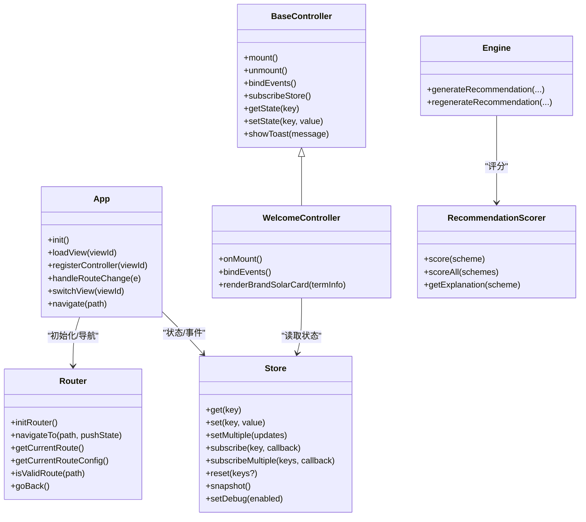

**图表来源**
- [js/core/app.js](file://js/core/app.js#L36-L196)
- [js/core/router.js](file://js/core/router.js#L25-L128)
- [js/core/store.js](file://js/core/store.js#L30-L187)
- [js/controllers/base.js](file://js/controllers/base.js#L11-L131)
- [js/controllers/welcome.js](file://js/controllers/welcome.js#L13-L134)
- [js/core/scorer.js](file://js/core/scorer.js#L14-L317)
- [js/services/engine.js](file://js/services/engine.js#L323-L393)

## 详细组件分析

### App 类与初始化流程
- 初始化阶段：安装全局错误处理器、定位应用容器、预加载首屏视图、注册首屏控制器、监听路由变化、加载基础数据、初始化路由、统计标记。
- 视图加载：按需加载 HTML，插入到应用容器，避免重复加载。
- 控制器注册：延迟注册，避免不必要的实例化。
- 路由联动：路由变化时卸载旧控制器、挂载新控制器、切换视图显示。
- 导航接口：对外暴露导航方法，内部委托 Router。

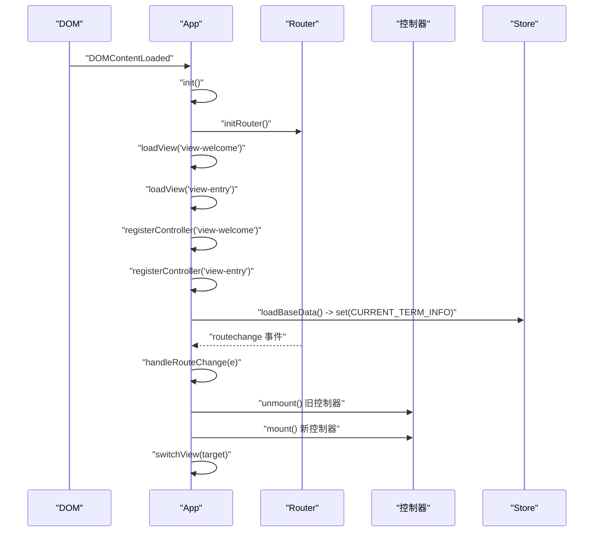

**图表来源**
- [js/core/app.js](file://js/core/app.js#L47-L73)
- [js/core/app.js](file://js/core/app.js#L145-L168)
- [js/core/router.js](file://js/core/router.js#L27-L75)
- [js/core/store.js](file://js/core/store.js#L122-L131)

**章节来源**
- [js/core/app.js](file://js/core/app.js#L47-L196)

### Router 路由管理机制
- 路由配置：路径到视图与标题的映射。
- 导航：拦截链接点击，支持 pushState 与历史回退；更新页面标题与 Store。
- 路由事件：触发自定义 routechange 事件，携带路径、路由配置与来源。
- 辅助：获取当前路由、校验有效性、返回上一页、生成路由链接。

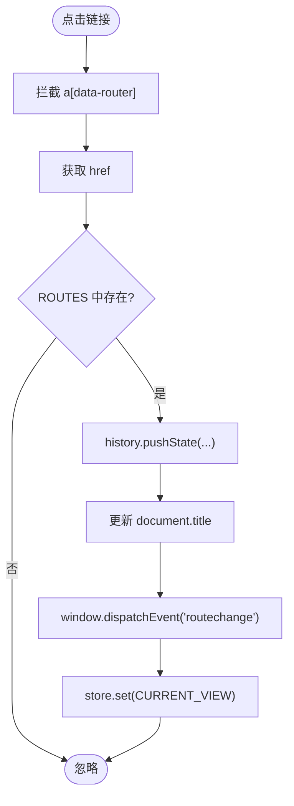

**图表来源**
- [js/core/router.js](file://js/core/router.js#L42-L79)

**章节来源**
- [js/core/router.js](file://js/core/router.js#L25-L128)

### Store 状态管理策略
- 响应式状态：通过 Proxy 拦截 set，在值真正变化时触发通知。
- 订阅机制：按状态键订阅，支持批量订阅与取消。
- 状态键常量：避免硬编码，集中管理键名。
- 调试与快照：可开启调试与状态快照。
- 重置策略：支持按键重置或全量重置。

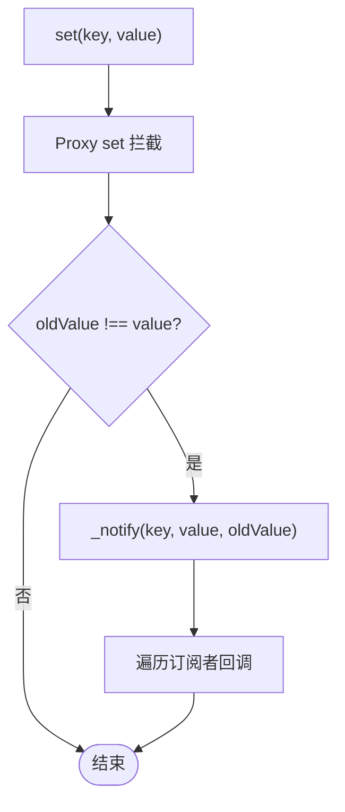

**图表来源**
- [js/core/store.js](file://js/core/store.js#L11-L25)
- [js/core/store.js](file://js/core/store.js#L130-L141)

**章节来源**
- [js/core/store.js](file://js/core/store.js#L30-L187)

### BaseController 基类设计
- 生命周期：mount/unmount，保证重复挂载安全。
- 事件管理：统一添加/移除事件监听，避免内存泄漏。
- Store 交互：提供 getState/ setState 与 subscribe/ unsubscribe。
- 工具方法：统一 Toast 触发，便于跨控制器复用。

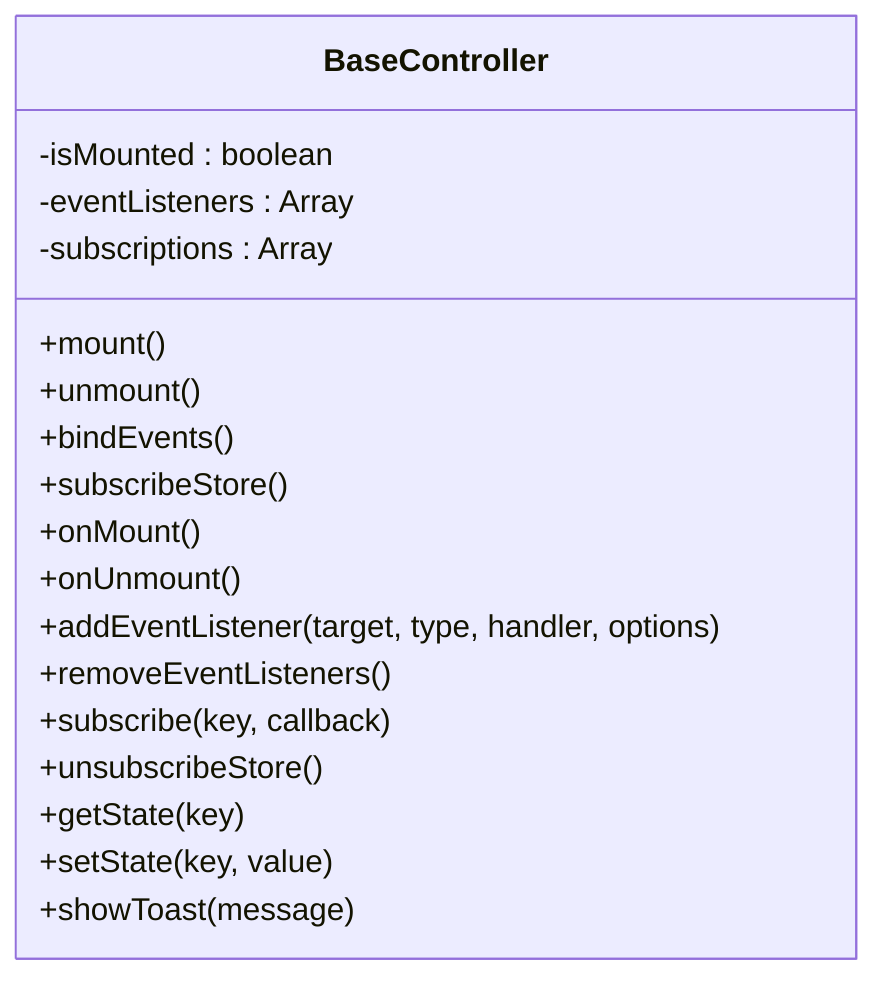

**图表来源**
- [js/controllers/base.js](file://js/controllers/base.js#L11-L131)

**章节来源**
- [js/controllers/base.js](file://js/controllers/base.js#L11-L131)

### WelcomeController 控制器
- 动态容器：在 onMount 时查找视图容器，避免静态依赖。
- 事件绑定：开始按钮跳转到选择心愿页。
- 渲染：根据当前节气信息渲染品牌节气卡片，包含节气图标、名称、描述、五行标签与宜穿颜色。

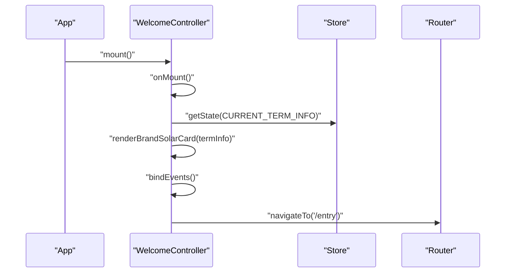

**图表来源**
- [js/controllers/welcome.js](file://js/controllers/welcome.js#L19-L128)

**章节来源**
- [js/controllers/welcome.js](file://js/controllers/welcome.js#L13-L134)

### 推荐引擎与评分器
- Engine：并行加载方案、心愿模板、八字模板；构建上下文（节气、心愿、八字、天气、场景偏好、今日运势）；使用 RecommendationScorer 批量评分并梯度选择方案；生成解释。
- Scorer：封装评分维度（节气、八字、场景、天气、心愿、历史、运势），支持缓存与解释生成。

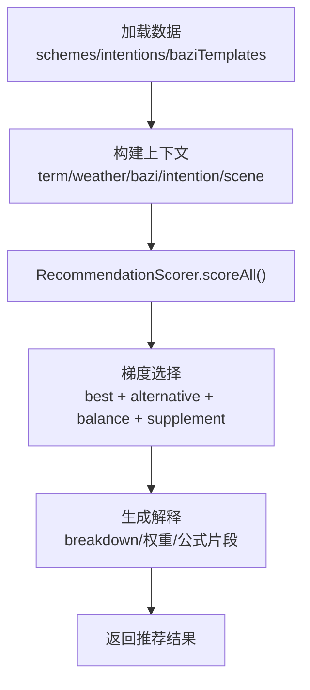

**图表来源**
- [js/services/engine.js](file://js/services/engine.js#L323-L393)
- [js/core/scorer.js](file://js/core/scorer.js#L266-L276)

**章节来源**
- [js/services/engine.js](file://js/services/engine.js#L323-L393)
- [js/core/scorer.js](file://js/core/scorer.js#L14-L317)

### 数据层与数据管理
- Repository：抽象 localStorage，提供收藏、偏好、反馈、八字、统计、穿搭照片等仓储，统一安全存取。
- Data Manager：导出/导入/预览/清理，支持版本校验与数据概览，保障用户数据可迁移。

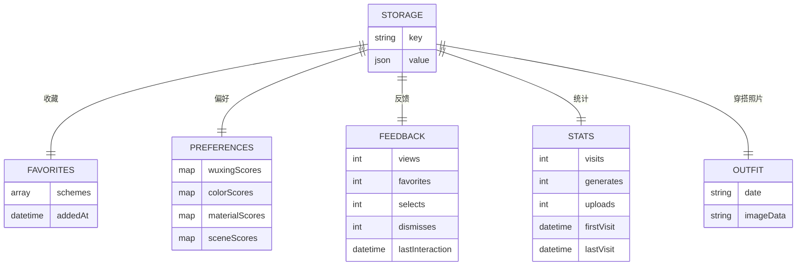

**图表来源**
- [js/data/repository.js](file://js/data/repository.js#L8-L21)
- [js/data/repository.js](file://js/data/repository.js#L86-L146)
- [js/data/repository.js](file://js/data/repository.js#L151-L201)
- [js/data/repository.js](file://js/data/repository.js#L206-L259)
- [js/data/repository.js](file://js/data/repository.js#L264-L287)
- [js/data/repository.js](file://js/data/repository.js#L292-L337)
- [js/data/repository.js](file://js/data/repository.js#L342-L377)
- [js/data/data-manager.js](file://js/data/data-manager.js#L48-L72)

**章节来源**
- [js/data/repository.js](file://js/data/repository.js#L46-L394)
- [js/data/data-manager.js](file://js/data/data-manager.js#L48-L376)

### 组件通信机制
- 事件系统：Router 触发 routechange，App 监听并驱动控制器切换；控制器通过 window.dispatchEvent 触发全局 Toast。
- 状态管理：Store 提供响应式状态与订阅，控制器通过 getState/ setState 与 Store 交互；Engine 与 Recommendation 通过 Store 写入节气、心愿、结果等。
- 数据流控制：数据从服务层（Engine/Recommendation）流向渲染层（Render），同时通过 Repository/Data Manager 形成闭环（反馈、偏好、收藏）。

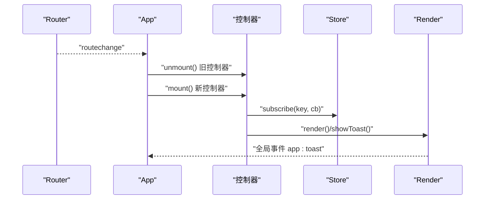

**图表来源**
- [js/core/router.js](file://js/core/router.js#L73-L75)
- [js/core/app.js](file://js/core/app.js#L155-L164)
- [js/controllers/base.js](file://js/controllers/base.js#L126-L129)
- [js/utils/render.js](file://js/utils/render.js#L457-L486)

**章节来源**
- [js/core/router.js](file://js/core/router.js#L73-L75)
- [js/core/app.js](file://js/core/app.js#L155-L164)
- [js/controllers/base.js](file://js/controllers/base.js#L126-L129)
- [js/utils/render.js](file://js/utils/render.js#L457-L486)

## 依赖分析
- 模块耦合：App 依赖 Router/Store/Error；控制器依赖 Store/BaseController；Engine 依赖 Scorer/Recommendation/Weather；Render 依赖 Store/Explanation。
- 外部依赖：fetch/safeFetch、localStorage/safeStorage、Canvas（分享图片）、Navigator.share（系统分享）。
- 潜在循环：当前文件间未见直接循环依赖；若未来扩展控制器间互相引用需谨慎。

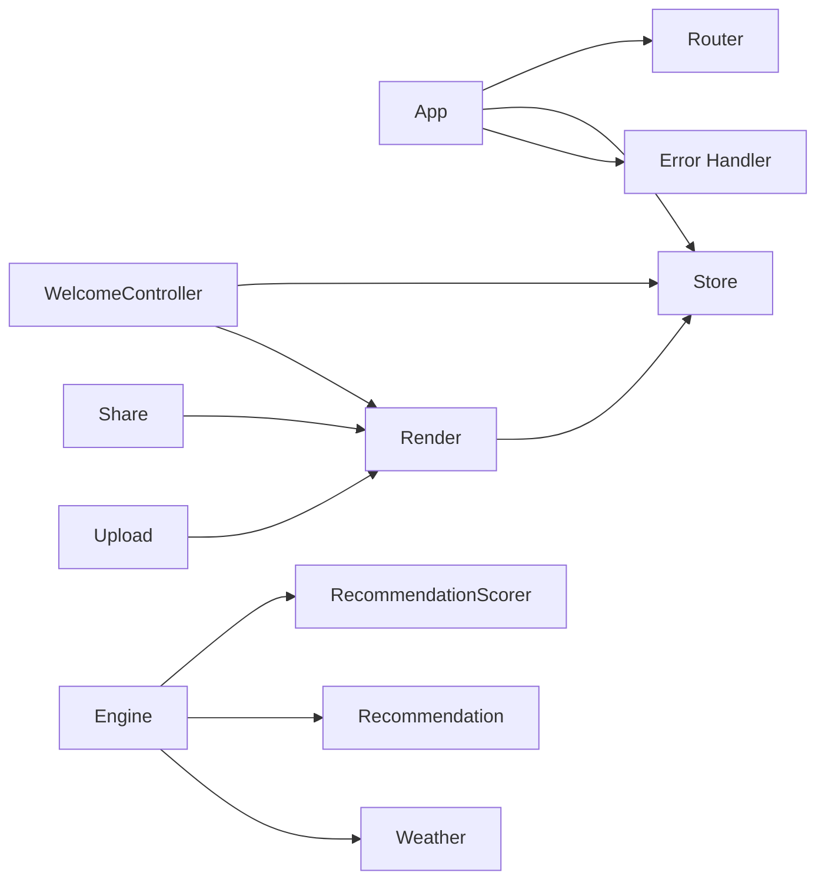

**图表来源**
- [js/core/app.js](file://js/core/app.js#L6-L21)
- [js/controllers/welcome.js](file://js/controllers/welcome.js#L5-L8)
- [js/services/engine.js](file://js/services/engine.js#L6-L9)
- [js/utils/render.js](file://js/utils/render.js#L5-L8)

**章节来源**
- [js/core/app.js](file://js/core/app.js#L6-L21)
- [js/controllers/welcome.js](file://js/controllers/welcome.js#L5-L8)
- [js/services/engine.js](file://js/services/engine.js#L6-L9)
- [js/utils/render.js](file://js/utils/render.js#L5-L8)

## 性能考虑
- 按需加载与懒执行：App 预加载首屏视图，其余视图在路由切换时动态加载，减少初始包体。
- 响应式状态与订阅：Store 的 Proxy 拦截与订阅通知，避免不必要渲染；建议控制器仅订阅所需键。
- 评分缓存：Scorer 对单方案评分结果进行缓存，提升批量评分效率。
- 渲染优化：Render 使用动画延迟与一次性插入 DOM，减少重排；Toast 采用一次性创建与复用策略。
- 网络与存储：withErrorHandler/safeFetch/safeStorage 提供超时与异常兜底，避免阻塞主线程。

[本节为通用指导，无需特定文件分析]

## 故障排查指南
- 全局错误捕获：initGlobalErrorHandler 捕获未处理 Promise 与全局错误，统一显示用户提示。
- 包装函数 withErrorHandler：对异步函数进行统一包装，支持错误类型映射、静默处理与自定义回调。
- 安全存储：safeStorage 包裹 localStorage 操作，捕获配额不足等异常。
- 网络请求：safeFetch 提供超时控制与状态码校验，safeJsonParse 处理 JSON 解析异常。
- 控制器事件：BaseController 统一事件绑定与解绑，避免重复绑定与内存泄漏。
- 视图切换：App.switchView 保证仅显示目标视图，滚动回到顶部。

**章节来源**
- [js/core/error-handler.js](file://js/core/error-handler.js#L168-L189)
- [js/core/error-handler.js](file://js/core/error-handler.js#L45-L79)
- [js/core/error-handler.js](file://js/core/error-handler.js#L153-L163)
- [js/core/error-handler.js](file://js/core/error-handler.js#L101-L133)
- [js/controllers/base.js](file://js/controllers/base.js#L72-L85)
- [js/core/app.js](file://js/core/app.js#L174-L184)

## 结论
本项目以 MVC 为核心，结合轻量路由与集中式状态管理，实现了清晰的职责分离与良好的可维护性。通过控制器基类统一生命周期与事件管理，通过 Store 集中式状态与订阅，通过 Engine/Scorer 封装复杂评分逻辑，配合 Repository/Data Manager 的数据闭环，形成从输入到输出的完整链路。未来可在以下方面持续演进：引入更细粒度的模块拆分、增加单元测试覆盖、优化首屏性能与缓存策略、扩展多语言与无障碍能力。