# 模块化系统

<cite>
**本文引用的文件**
- [index.html](file://index.html)
- [js/core/app.js](file://js/core/app.js)
- [js/core/router.js](file://js/core/router.js)
- [js/core/store.js](file://js/core/store.js)
- [js/core/error-handler.js](file://js/core/error-handler.js)
- [js/core/scorer.js](file://js/core/scorer.js)
- [js/core/scoring-config.js](file://js/core/scoring-config.js)
- [js/controllers/base.js](file://js/controllers/base.js)
- [js/controllers/welcome.js](file://js/controllers/welcome.js)
- [js/controllers/results.js](file://js/controllers/results.js)
- [js/components/base.js](file://js/components/base.js)
- [js/components/weather-widget.js](file://js/components/weather-widget.js)
- [js/data/repository.js](file://js/data/repository.js)
- [js/data/data-manager.js](file://js/data/data-manager.js)
- [js/services/engine.js](file://js/services/engine.js)
- [js/services/recommendation.js](file://js/services/recommendation.js)
- [js/services/weather.js](file://js/services/weather.js)
- [js/utils/render.js](file://js/utils/render.js)
</cite>

## 目录
1. [引言](#引言)
2. [项目结构](#项目结构)
3. [核心组件](#核心组件)
4. [架构总览](#架构总览)
5. [详细组件分析](#详细组件分析)
6. [依赖分析](#依赖分析)
7. [性能考虑](#性能考虑)
8. [故障排查指南](#故障排查指南)
9. [结论](#结论)
10. [附录](#附录)

## 引言
本项目采用 ES6 模块化体系，围绕“应用主模块、路由模块、状态模块”三大核心，结合“控制器层、服务层、数据仓库层、工具层”的分层设计，构建了可维护、可测试、可扩展的前端架构。模块之间通过显式的导入导出进行耦合，配合统一的错误处理与状态管理，确保模块生命周期清晰、职责边界明确。

## 项目结构
项目采用按层次与职责混合的组织方式：
- 核心层：应用入口、路由、状态、错误处理、评分器与评分配置
- 控制器层：每个视图对应一个控制器，负责视图生命周期与事件绑定
- 组件层：可复用的 UI 组件基类
- 服务层：业务引擎、推荐、天气、解释等服务
- 数据层：数据仓库与数据导出导入
- 工具层：渲染、分享、上传等工具方法
- 视图与样式：HTML 页面与样式资源

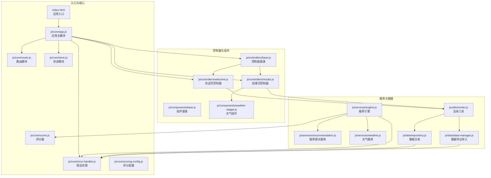

图表来源
- [index.html](file://index.html#L58-L61)
- [js/core/app.js](file://js/core/app.js#L6-L21)
- [js/core/router.js](file://js/core/router.js#L6-L17)
- [js/core/store.js](file://js/core/store.js#L30-L63)
- [js/core/error-handler.js](file://js/core/error-handler.js#L5-L15)
- [js/core/scorer.js](file://js/core/scorer.js#L14-L22)
- [js/controllers/base.js](file://js/controllers/base.js#L11-L16)
- [js/controllers/welcome.js](file://js/controllers/welcome.js#L13-L17)
- [js/controllers/results.js](file://js/controllers/results.js#L13-L17)
- [js/components/base.js](file://js/components/base.js#L9-L20)
- [js/components/weather-widget.js](file://js/components/weather-widget.js)
- [js/services/engine.js](file://js/services/engine.js#L6-L9)
- [js/services/recommendation.js](file://js/services/recommendation.js)
- [js/services/weather.js](file://js/services/weather.js)
- [js/data/repository.js](file://js/data/repository.js#L46-L81)
- [js/data/data-manager.js](file://js/data/data-manager.js#L24-L42)
- [js/utils/render.js](file://js/utils/render.js#L5-L8)

章节来源
- [index.html](file://index.html#L58-L61)
- [js/core/app.js](file://js/core/app.js#L23-L31)
- [js/core/router.js](file://js/core/router.js#L9-L17)
- [js/core/store.js](file://js/core/store.js#L33-L51)

## 核心组件
- 应用主模块（App）：负责应用初始化、视图动态加载、控制器注册与切换、路由事件处理、基础数据加载与统计初始化。
- 路由模块（Router）：提供路由初始化、导航、历史记录、事件派发与路由校验。
- 状态模块（Store）：集中式状态管理，提供响应式状态、订阅通知、批量更新与重置。
- 错误处理模块（Error Handler）：统一包装异步函数、安全的 fetch 与 JSON 解析、存储操作封装、全局错误监听。
- 评分器（RecommendationScorer）：封装推荐评分逻辑，支持缓存、权重动态调整与解释输出。
- 控制器基类（BaseController）：统一控制器生命周期、事件绑定与状态订阅管理。
- 组件基类（Component）：统一组件生命周期、事件绑定与渲染管理。
- 数据仓库（Repository）：抽象存储实现，提供收藏、偏好、反馈、八字、统计、穿搭照片等仓储能力。
- 数据管理（Data Manager）：数据导出/导入、校验、预览与概览展示。
- 渲染工具（Render）：DOM 渲染、模态框、Toast、卡片生成与解释展示。

章节来源
- [js/core/app.js](file://js/core/app.js#L36-L196)
- [js/core/router.js](file://js/core/router.js#L25-L141)
- [js/core/store.js](file://js/core/store.js#L30-L212)
- [js/core/error-handler.js](file://js/core/error-handler.js#L45-L189)
- [js/core/scorer.js](file://js/core/scorer.js#L14-L316)
- [js/controllers/base.js](file://js/controllers/base.js#L11-L130)
- [js/components/base.js](file://js/components/base.js#L9-L106)
- [js/data/repository.js](file://js/data/repository.js#L46-L393)
- [js/data/data-manager.js](file://js/data/data-manager.js#L48-L375)
- [js/utils/render.js](file://js/utils/render.js#L13-L486)

## 架构总览
应用启动流程：index.html 通过 ES 模块引入 app.js 的 bootstrap 函数，App 在 DOMContentLoaded 时初始化，注册路由、加载基础数据、初始化统计，并监听路由变化事件。路由变化事件驱动 App 动态加载视图、注册控制器、卸载旧控制器并切换视图显示。控制器通过 BaseController 生命周期管理与 Store 订阅进行数据驱动渲染；服务层通过 Engine 调用评分器与天气/推荐服务，最终由渲染工具输出到 DOM。

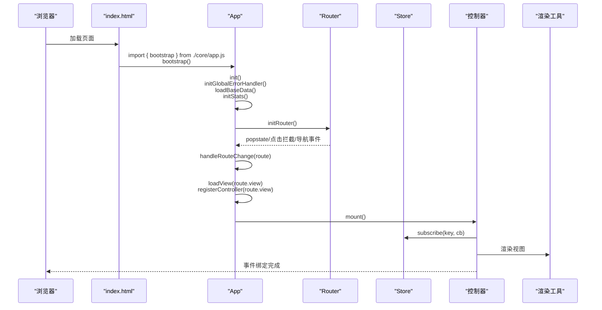

图表来源
- [index.html](file://index.html#L58-L61)
- [js/core/app.js](file://js/core/app.js#L47-L73)
- [js/core/router.js](file://js/core/router.js#L25-L79)
- [js/core/store.js](file://js/core/store.js#L99-L141)
- [js/utils/render.js](file://js/utils/render.js#L13-L21)

## 详细组件分析

### 应用主模块（App）
- 职责：应用初始化、视图动态加载、控制器注册与切换、路由事件处理、基础数据与统计初始化。
- 关键点：
  - 视图配置与延迟加载，避免首屏阻塞
  - 控制器 Map 管理，按需注册与卸载
  - 路由变化事件驱动视图切换
  - 通过 withErrorHandler 包装基础数据加载，统一错误处理
- 生命周期：构造 -> init -> handleRouteChange -> mount/unmount

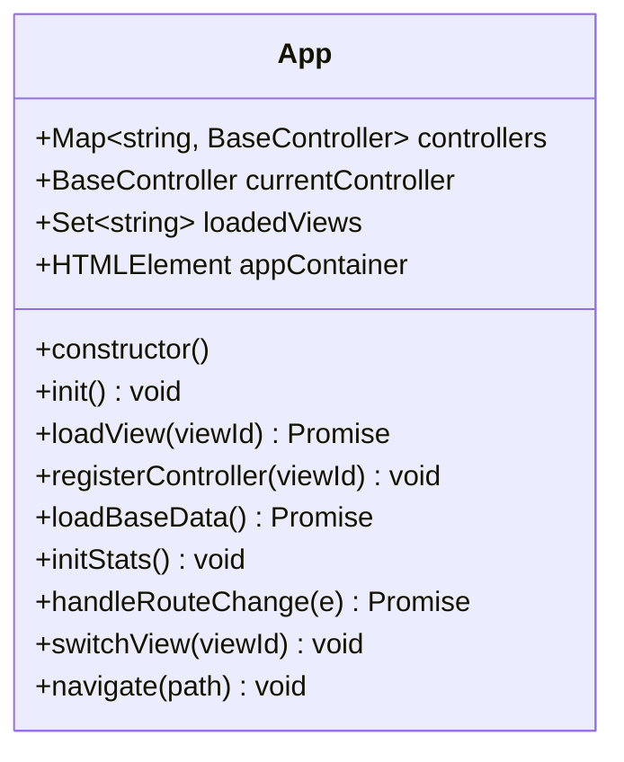

图表来源
- [js/core/app.js](file://js/core/app.js#L36-L196)

章节来源
- [js/core/app.js](file://js/core/app.js#L47-L196)

### 路由模块（Router）
- 职责：路由初始化、导航、历史记录、事件派发、路由校验与链接生成。
- 关键点：
  - popstate 监听浏览器前进后退
  - click 委托拦截内部链接
  - navigateTo 推入历史、更新标题、派发 routechange 事件
  - Store 写入 currentView

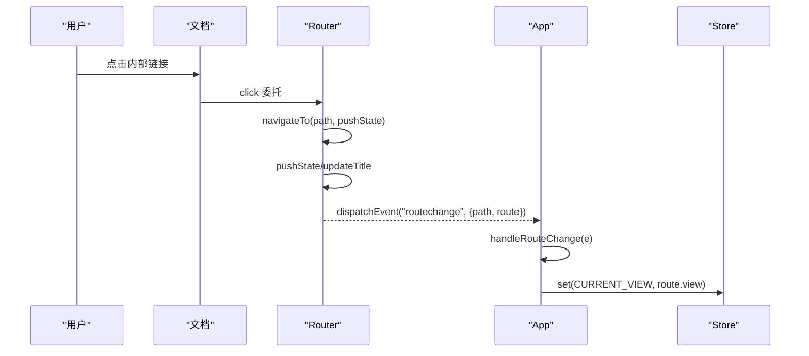

图表来源
- [js/core/router.js](file://js/core/router.js#L42-L79)
- [js/core/store.js](file://js/core/store.js#L79-L81)

章节来源
- [js/core/router.js](file://js/core/router.js#L25-L141)

### 状态模块（Store）
- 职责：集中式状态管理，响应式状态、订阅通知、批量更新与重置。
- 关键点：
  - Proxy 包装状态，set 时触发 onChange
  - 订阅者集合 Map，支持多键订阅与批量取消
  - 调试模式与快照
  - StateKeys 常量避免硬编码

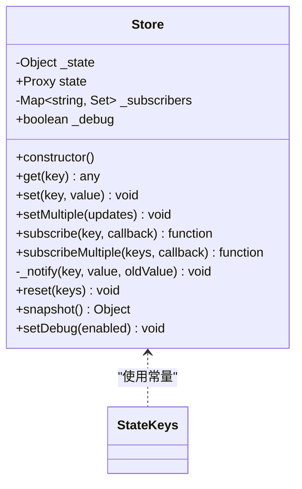

图表来源
- [js/core/store.js](file://js/core/store.js#L30-L187)
- [js/core/store.js](file://js/core/store.js#L193-L211)

章节来源
- [js/core/store.js](file://js/core/store.js#L30-L212)

### 错误处理模块（Error Handler）
- 职责：统一包装异步函数、安全的 fetch/JSON 解析、存储操作封装、全局错误监听。
- 关键点：
  - withErrorHandler 统一捕获与转换为 AppError
  - safeFetch/safeJsonParse/safeStorage 提供安全操作
  - initGlobalErrorHandler 捕获未处理 Promise 与全局错误

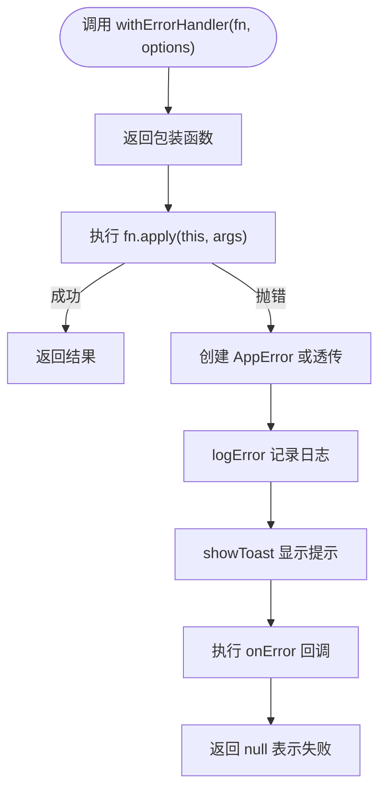

图表来源
- [js/core/error-handler.js](file://js/core/error-handler.js#L45-L79)
- [js/core/error-handler.js](file://js/core/error-handler.js#L84-L92)
- [js/core/error-handler.js](file://js/core/error-handler.js#L101-L133)

章节来源
- [js/core/error-handler.js](file://js/core/error-handler.js#L45-L189)

### 评分器（RecommendationScorer）
- 职责：封装推荐评分逻辑，支持缓存、权重动态调整与解释输出。
- 关键点：
  - scoreAll 批量评分并排序
  - score 方法按维度计算得分并缓存
  - getExplanation 输出推荐理由

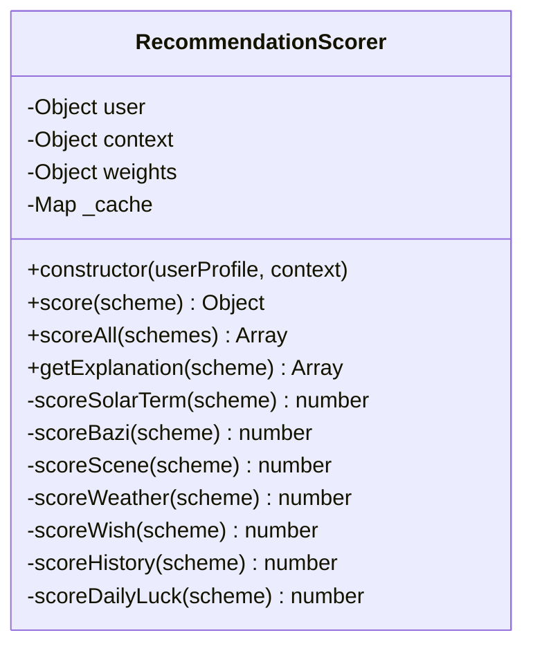

图表来源
- [js/core/scorer.js](file://js/core/scorer.js#L14-L316)
- [js/core/scoring-config.js](file://js/core/scoring-config.js)

章节来源
- [js/core/scorer.js](file://js/core/scorer.js#L29-L276)

### 控制器基类（BaseController）
- 职责：统一控制器生命周期、事件绑定与状态订阅管理。
- 关键点：
  - mount/unmount 生命周期
  - addEventListener/removeEventListeners 自动管理
  - subscribeStore/unsubscribeStore 管理 Store 订阅

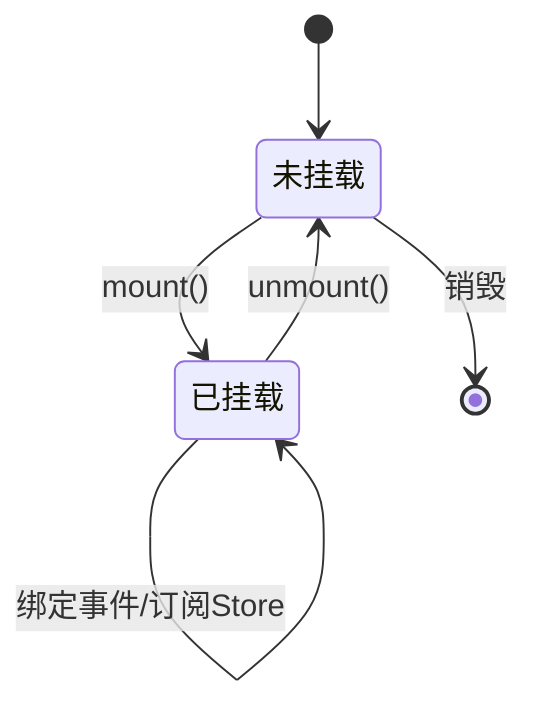

图表来源
- [js/controllers/base.js](file://js/controllers/base.js#L21-L42)
- [js/controllers/base.js](file://js/controllers/base.js#L72-L103)

章节来源
- [js/controllers/base.js](file://js/controllers/base.js#L11-L130)

### 组件基类（Component）
- 职责：统一组件生命周期、事件绑定与渲染管理。
- 关键点：
  - setState 合并状态并在挂载后自动渲染
  - mount/unmount 生命周期与事件管理

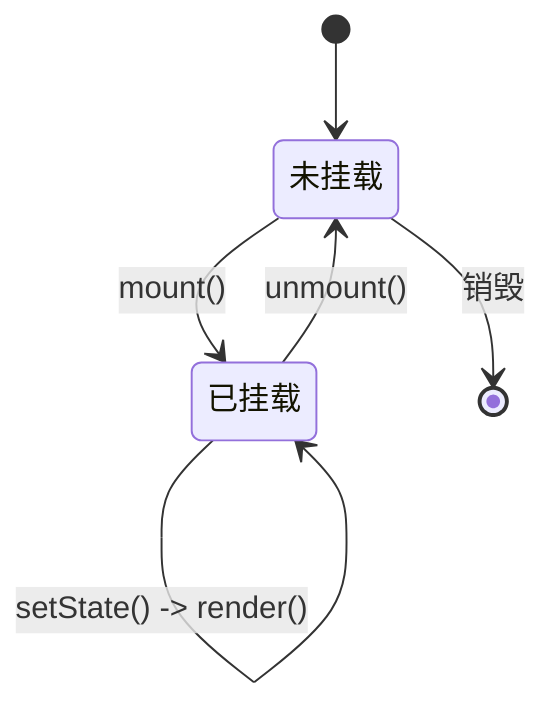

图表来源
- [js/components/base.js](file://js/components/base.js#L36-L56)
- [js/components/base.js](file://js/components/base.js#L92-L105)

章节来源
- [js/components/base.js](file://js/components/base.js#L9-L106)

### 数据仓库（Repository）
- 职责：抽象存储实现，提供收藏、偏好、反馈、八字、统计、穿搭照片等仓储能力。
- 关键点：
  - BaseRepository 提供 get/set/remove/exists
  - 各具体仓库类提供业务语义方法
  - 通过 safeStorage 封装 localStorage 操作

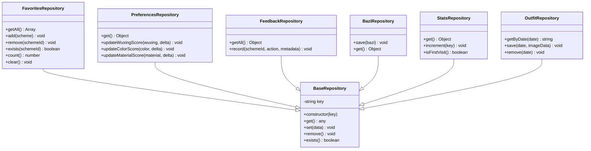

图表来源
- [js/data/repository.js](file://js/data/repository.js#L46-L81)
- [js/data/repository.js](file://js/data/repository.js#L86-L146)
- [js/data/repository.js](file://js/data/repository.js#L151-L201)
- [js/data/repository.js](file://js/data/repository.js#L206-L259)
- [js/data/repository.js](file://js/data/repository.js#L264-L287)
- [js/data/repository.js](file://js/data/repository.js#L292-L337)
- [js/data/repository.js](file://js/data/repository.js#L342-L377)

章节来源
- [js/data/repository.js](file://js/data/repository.js#L46-L393)

### 数据管理（Data Manager）
- 职责：数据导出/导入、校验、预览与概览展示。
- 关键点：
  - exportData/validateImportData/importData/readImportFile
  - 下载备份文件、清理数据、格式化字节大小

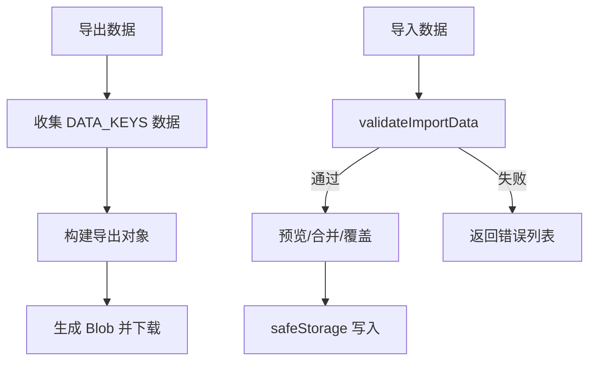

图表来源
- [js/data/data-manager.js](file://js/data/data-manager.js#L48-L99)
- [js/data/data-manager.js](file://js/data/data-manager.js#L106-L135)
- [js/data/data-manager.js](file://js/data/data-manager.js#L143-L184)
- [js/data/data-manager.js](file://js/data/data-manager.js#L191-L220)
- [js/data/data-manager.js](file://js/data/data-manager.js#L225-L229)
- [js/data/data-manager.js](file://js/data/data-manager.js#L235-L284)
- [js/data/data-manager.js](file://js/data/data-manager.js#L290-L354)

章节来源
- [js/data/data-manager.js](file://js/data/data-manager.js#L48-L375)

### 渲染工具（Render）
- 职责：DOM 渲染、模态框、Toast、卡片生成与解释展示。
- 关键点：
  - renderSchemeCards/createSchemeCard/generateSchemeExplanation
  - renderDetailModal/showModal/closeModal
  - showToast/toast 动画与移除

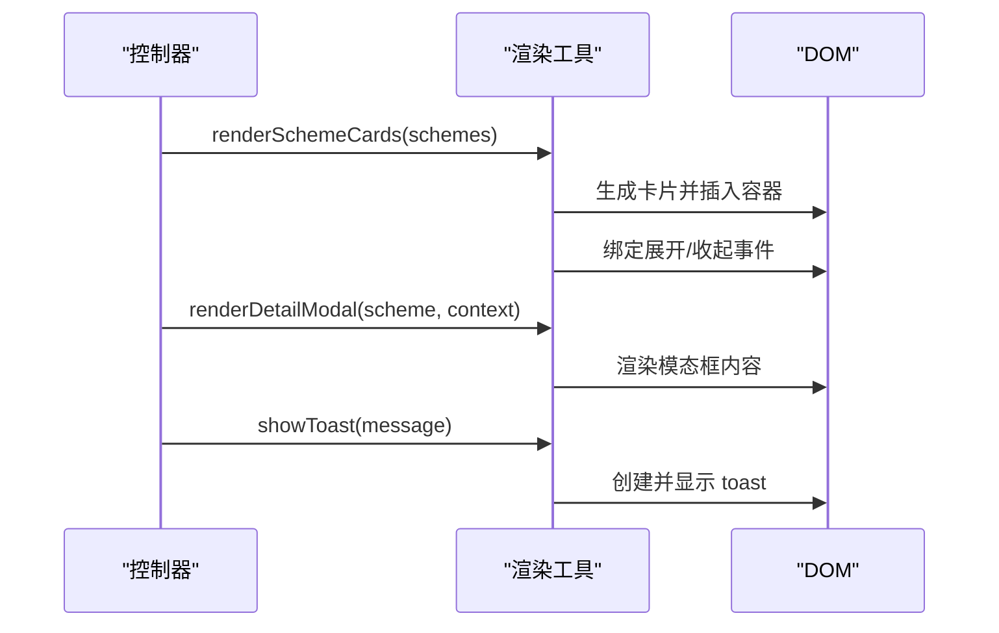

图表来源
- [js/utils/render.js](file://js/utils/render.js#L119-L132)
- [js/utils/render.js](file://js/utils/render.js#L324-L365)
- [js/utils/render.js](file://js/utils/render.js#L457-L486)

章节来源
- [js/utils/render.js](file://js/utils/render.js#L13-L486)

### 控制器示例：欢迎页与结果页
- 欢迎页控制器（WelcomeController）：动态渲染节气横幅、绑定开始按钮导航。
- 结果页控制器（ResultsController）：渲染结果页标题、方案卡片、今日运势、天气影响、收藏/分享/反馈、模态框交互。

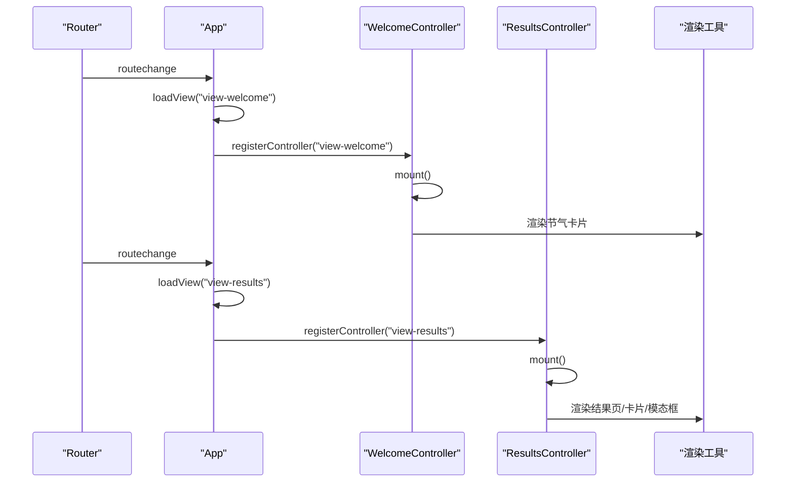

图表来源
- [js/controllers/welcome.js](file://js/controllers/welcome.js#L19-L35)
- [js/controllers/results.js](file://js/controllers/results.js#L20-L46)
- [js/utils/render.js](file://js/utils/render.js#L109-L132)

章节来源
- [js/controllers/welcome.js](file://js/controllers/welcome.js#L13-L151)
- [js/controllers/results.js](file://js/controllers/results.js#L13-L614)

## 依赖分析
- 模块导入导出：各模块通过显式 import/export 组织依赖，避免隐式全局污染
- 核心依赖链：App -> Router/Store/Error-Handler -> Controllers -> Services/Render -> Repositories/DataManager
- 低耦合高内聚：控制器仅依赖 Store 与渲染工具；服务层依赖错误处理与评分配置；数据层通过仓库抽象屏蔽存储细节
- 循环依赖规避：通过单一入口（App）协调模块间协作，避免直接相互引用

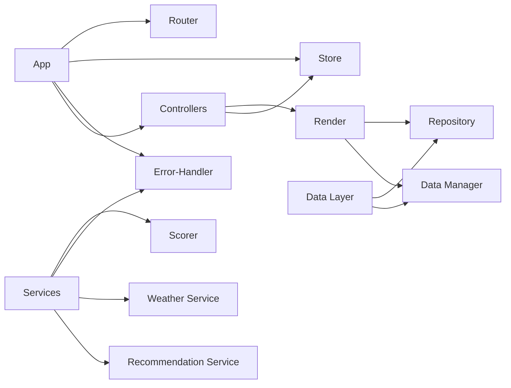

图表来源
- [js/core/app.js](file://js/core/app.js#L6-L21)
- [js/core/router.js](file://js/core/router.js#L6-L17)
- [js/core/store.js](file://js/core/store.js#L6-L7)
- [js/core/error-handler.js](file://js/core/error-handler.js#L5-L6)
- [js/core/scorer.js](file://js/core/scorer.js#L6-L12)
- [js/services/engine.js](file://js/services/engine.js#L6-L9)
- [js/data/repository.js](file://js/data/repository.js#L6-L7)
- [js/data/data-manager.js](file://js/data/data-manager.js#L6-L7)
- [js/utils/render.js](file://js/utils/render.js#L5-L8)

章节来源
- [js/core/app.js](file://js/core/app.js#L6-L21)
- [js/services/engine.js](file://js/services/engine.js#L6-L9)

## 性能考虑
- 模块懒加载：App 动态加载视图与按需注册控制器，减少首屏负载
- 评分缓存：RecommendationScorer 对单方案评分结果进行缓存，避免重复计算
- 事件委托与自动管理：BaseController/Component 统一事件绑定与解绑，降低内存泄漏风险
- 安全存储：Repository 与 DataManager 通过 safeStorage 包装 localStorage，避免异常中断
- 渲染优化：渲染工具按需生成 DOM，Toast 动画与移除避免长驻节点

## 故障排查指南
- 路由无效或跳转异常：检查 Router 的 isValidRoute 与 navigateTo 的 pushState 行为，确认路由配置与事件派发
- 视图不显示或切换失败：检查 App 的 loadView 与 switchView，确认视图 ID 与 DOM 结构一致
- 状态不更新：检查 Store 的 subscribe 与 _notify，确认键名常量与订阅回调
- 错误未提示：检查 withErrorHandler 的 silent/onError 选项与 initGlobalErrorHandler 的全局监听
- 数据导入失败：检查 validateImportData 的版本与结构校验，确认文件类型与 JSON 解析

章节来源
- [js/core/router.js](file://js/core/router.js#L110-L112)
- [js/core/router.js](file://js/core/router.js#L57-L79)
- [js/core/app.js](file://js/core/app.js#L79-L104)
- [js/core/app.js](file://js/core/app.js#L174-L184)
- [js/core/store.js](file://js/core/store.js#L99-L141)
- [js/core/error-handler.js](file://js/core/error-handler.js#L45-L79)
- [js/core/error-handler.js](file://js/core/error-handler.js#L168-L189)
- [js/data/data-manager.js](file://js/data/data-manager.js#L106-L135)

## 结论
本项目通过 ES6 模块化与分层架构，实现了清晰的职责划分与模块间协作。App 主模块协调路由与视图，Router/Store 提供状态与导航基础设施，控制器与组件基类统一生命周期管理，服务层封装业务逻辑，数据层抽象存储能力，工具层提供渲染与交互支持。该设计提升了代码的可维护性、可测试性与可扩展性，便于后续迭代与功能拓展。

## 附录
- 模块导入导出示例路径
  - 应用主模块导入路由、状态、错误处理与控制器：[js/core/app.js](file://js/core/app.js#L6-L21)
  - 路由模块导入状态：[js/core/router.js](file://js/core/router.js#L6-L7)
  - 控制器基类导入状态：[js/controllers/base.js](file://js/controllers/base.js#L6-L7)
  - 评分器导入评分配置：[js/core/scorer.js](file://js/core/scorer.js#L6-L12)
  - 数据仓库导入错误处理：[js/data/repository.js](file://js/data/repository.js#L6-L7)
  - 数据管理导入错误处理：[js/data/data-manager.js](file://js/data/data-manager.js#L6-L7)
  - 渲染工具导入存储与解释：[js/utils/render.js](file://js/utils/render.js#L5-L8)
- 模块设计规范
  - 常量与配置：统一导出常量（如 StateKeys、StorageKeys、ErrorTypes），避免硬编码
  - 单一职责：每个模块聚焦单一领域，通过显式接口暴露能力
  - 生命周期：控制器与组件遵循 mount/unmount 流程，自动管理事件与订阅
  - 错误处理：统一使用 withErrorHandler 包装异步操作，保证用户体验与可观测性
  - 数据抽象：仓库层屏蔽存储实现差异，提供一致的 CRUD 接口