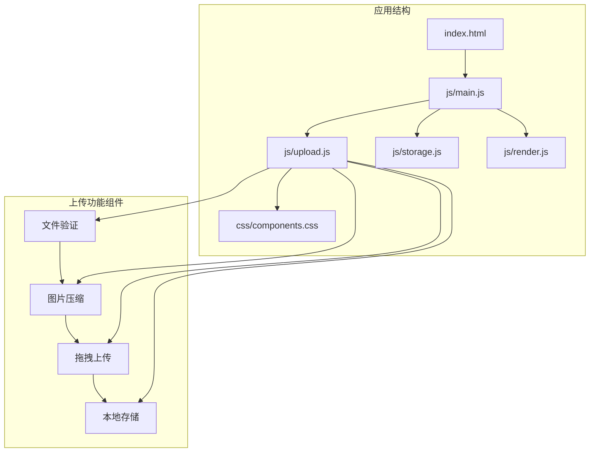
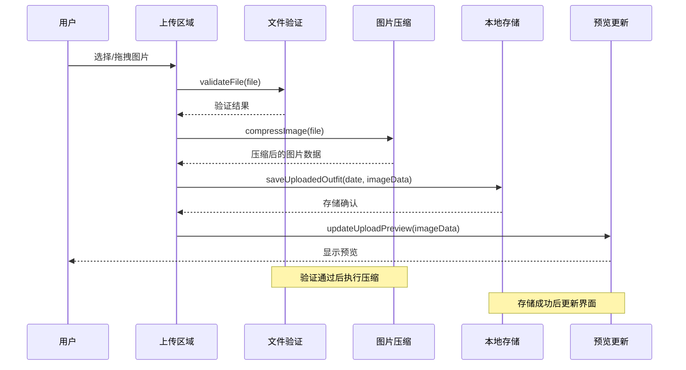
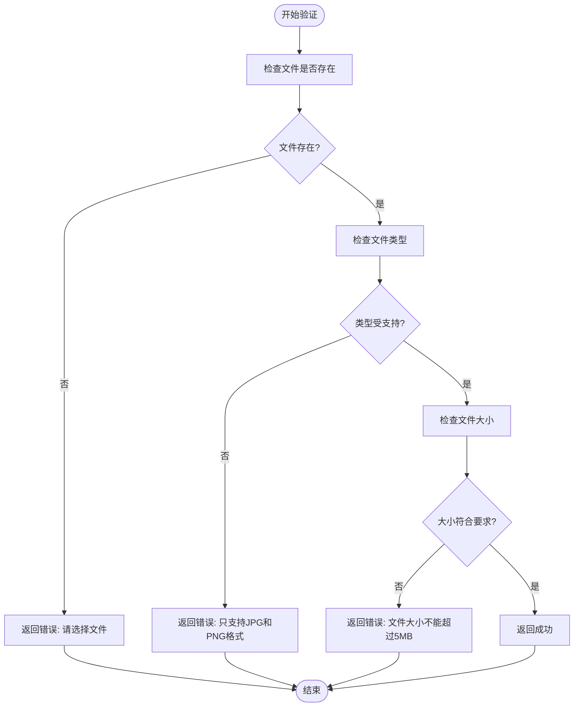
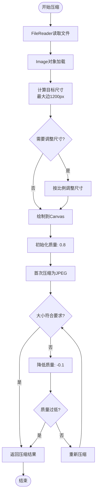
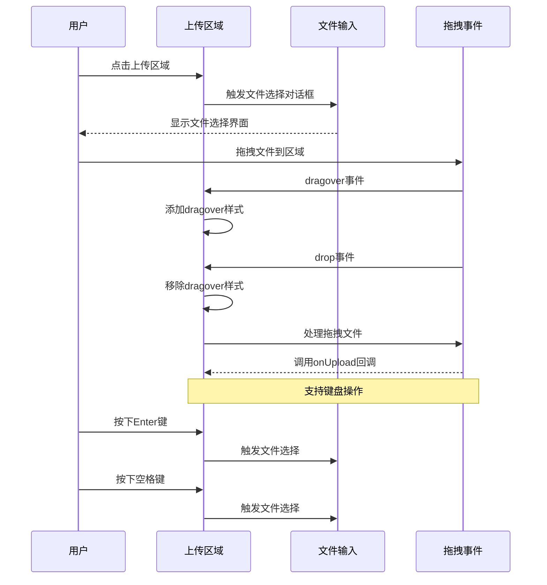
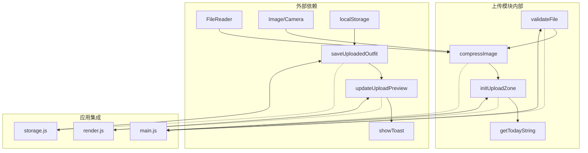
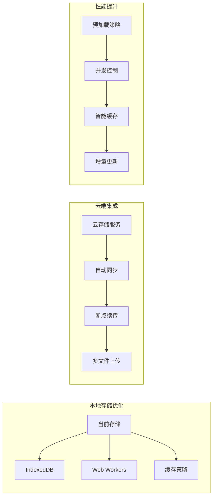

# 上传处理模块 (upload.js)

<cite>
**本文档引用的文件**
- [upload.js](file://js/upload.js)
- [main.js](file://js/main.js)
- [index.html](file://index.html)
- [storage.js](file://js/storage.js)
- [render.js](file://js/render.js)
- [components.css](file://css/components.css)
</cite>

## 目录
1. [简介](#简介)
2. [项目结构](#项目结构)
3. [核心组件](#核心组件)
4. [架构概览](#架构概览)
5. [详细组件分析](#详细组件分析)
6. [依赖关系分析](#依赖关系分析)
7. [性能考虑](#性能考虑)
8. [故障排除指南](#故障排除指南)
9. [结论](#结论)
10. [扩展指导](#扩展指导)

## 简介

上传处理模块是"五行穿搭建议"应用中的核心功能模块，负责处理用户上传的穿搭照片。该模块实现了完整的文件验证、图片压缩、拖拽上传和本地存储等功能，为用户提供流畅的图片上传体验。

该模块采用模块化设计，通过ES6模块系统导出独立的功能函数，便于在应用中灵活使用和测试。模块支持JPG和PNG格式的图片上传，具备5MB大小限制和智能压缩功能，确保上传效率和用户体验。

## 项目结构

上传处理模块位于JavaScript目录下，与主应用逻辑和其他功能模块协同工作：



**图表来源**
- [upload.js](file://js/upload.js#L1-L145)
- [main.js](file://js/main.js#L1-L317)
- [index.html](file://index.html#L157-L196)

**章节来源**
- [upload.js](file://js/upload.js#L1-L145)
- [main.js](file://js/main.js#L1-L317)
- [index.html](file://index.html#L157-L196)

## 核心组件

上传处理模块包含以下核心功能组件：

### 文件验证组件
- **类型检查**: 严格验证文件MIME类型，仅支持JPG和PNG格式
- **大小限制**: 实现5MB文件大小上限控制
- **格式验证**: 检查文件类型是否符合要求
- **安全性过滤**: 防止恶意文件上传

### 图片压缩组件
- **尺寸调整**: 自动计算最大边长1200px的目标尺寸
- **质量控制**: 使用0.8初始质量，动态调整至200KB目标大小
- **格式转换**: 统一转换为JPEG格式，保持最佳压缩效果
- **智能优化**: 通过循环调整质量参数达到最优压缩效果

### 拖拽上传组件
- **拖放事件处理**: 支持dragover、dragleave、drop事件
- **文件接收**: 处理拖拽文件的接收和验证
- **预览生成**: 实时显示上传预览效果
- **键盘支持**: 提供键盘操作支持（Enter键和空格键）

### 进度管理组件
- **状态跟踪**: 监控上传过程的各个阶段
- **错误处理**: 统一处理各种上传异常情况
- **用户反馈**: 通过Toast消息提供实时反馈

**章节来源**
- [upload.js](file://js/upload.js#L5-L26)
- [upload.js](file://js/upload.js#L31-L82)
- [upload.js](file://js/upload.js#L87-L136)

## 架构概览

上传处理模块采用分层架构设计，各组件职责明确，相互协作：



**图表来源**
- [upload.js](file://js/upload.js#L12-L26)
- [upload.js](file://js/upload.js#L31-L82)
- [main.js](file://js/main.js#L274-L292)
- [storage.js](file://js/storage.js#L83-L85)

## 详细组件分析

### 文件验证机制

文件验证组件实现了多层次的安全检查，确保上传文件的质量和安全性：



**图表来源**
- [upload.js](file://js/upload.js#L12-L26)

#### 验证规则详解

| 验证类型 | 规则描述 | 限制值 | 错误信息 |
|---------|----------|--------|----------|
| 文件存在性 | 检查文件对象是否为空 | 无 | 请选择文件 |
| 文件类型 | 仅允许JPG和PNG格式 | image/jpeg, image/png | 只支持JPG和PNG格式 |
| 文件大小 | 限制最大5MB | 5MB | 文件大小不能超过5MB |

**章节来源**
- [upload.js](file://js/upload.js#L12-L26)

### 图片压缩算法实现

图片压缩组件采用了智能的压缩策略，平衡了图片质量和文件大小：



**图表来源**
- [upload.js](file://js/upload.js#L31-L82)

#### 压缩参数配置

| 参数名称 | 默认值 | 作用 | 优化策略 |
|---------|--------|------|----------|
| 最大文件大小 | 5MB | 限制上传文件大小 | 防止服务器压力 |
| 目标压缩大小 | 200KB | 压缩后目标大小 | 平衡质量与体积 |
| 质量系数 | 0.8 | 初始压缩质量 | 智能递减调整 |
| 最大边长 | 1200px | 图片最大尺寸 | 保持清晰度 |
| 质量递减步长 | 0.1 | 质量调整幅度 | 精细控制压缩效果 |

**章节来源**
- [upload.js](file://js/upload.js#L5-L7)
- [upload.js](file://js/upload.js#L31-L82)

### 拖拽上传功能实现

拖拽上传功能提供了直观的用户交互体验，支持多种文件选择方式：



**图表来源**
- [upload.js](file://js/upload.js#L87-L136)
- [index.html](file://index.html#L169-L186)

#### 事件处理机制

| 事件类型 | 处理逻辑 | 用户体验 |
|---------|----------|----------|
| click | 触发隐藏的文件输入框 | 直观的点击操作 |
| keydown | 支持Enter和空格键 | 键盘可达性 |
| dragover | 添加视觉反馈样式 | 即时的拖拽提示 |
| dragleave | 移除视觉反馈样式 | 清晰的状态变化 |
| drop | 处理拖拽文件并调用回调 | 流畅的拖拽体验 |

**章节来源**
- [upload.js](file://js/upload.js#L87-L136)
- [index.html](file://index.html#L169-L186)

### 上传进度管理

上传进度管理组件提供了完整的状态跟踪和错误处理机制：

```mermaid
stateDiagram-v2
[*] --> 空闲
空闲 --> 验证中 : 用户选择文件
验证中 --> 压缩中 : 验证通过
验证中 --> 错误状态 : 验证失败
压缩中 --> 存储中 : 压缩完成
压缩中 --> 错误状态 : 压缩失败
存储中 --> 成功状态 : 存储完成
存储中 --> 错误状态 : 存储失败
成功状态 --> 空闲 : 更新预览
错误状态 --> 空闲 : 显示错误信息
状态颜色编码 :
验证中 -> 绿色
压缩中 -> 蓝色
存储中 -> 黄色
成功状态 -> 绿色
错误状态 -> 红色
```

**图表来源**
- [main.js](file://js/main.js#L274-L292)

#### 错误处理策略

| 错误类型 | 处理方式 | 用户反馈 |
|---------|----------|----------|
| 文件验证失败 | 显示具体错误信息 | Toast提示错误原因 |
| 文件读取失败 | 捕获并处理异常 | 弹出重试提示 |
| 图片加载失败 | 终止压缩流程 | 显示加载错误 |
| 存储失败 | 回滚操作并记录日志 | 提示存储问题 |

**章节来源**
- [main.js](file://js/main.js#L274-L292)

## 依赖关系分析

上传处理模块与其他应用组件的依赖关系如下：



**图表来源**
- [upload.js](file://js/upload.js#L12-L144)
- [main.js](file://js/main.js#L15-L15)
- [storage.js](file://js/storage.js#L83-L85)
- [render.js](file://js/render.js#L220-L237)

### 模块间耦合度分析

| 组件 | 内聚性 | 耦合度 | 依赖关系 |
|------|--------|--------|----------|
| validateFile | 高内聚 | 低耦合 | 独立功能模块 |
| compressImage | 高内聚 | 中等耦合 | FileReader, Canvas API |
| initUploadZone | 中等内聚 | 低耦合 | DOM事件处理 |
| getTodayString | 高内聚 | 低耦合 | 日期处理工具 |

**章节来源**
- [upload.js](file://js/upload.js#L12-L144)
- [main.js](file://js/main.js#L15-L15)

## 性能考虑

### 内存优化策略

1. **及时释放资源**: 图片压缩完成后立即清理Canvas和Image对象
2. **渐进式处理**: 采用异步处理避免阻塞主线程
3. **内存监控**: 定期检查内存使用情况，防止内存泄漏

### 网络传输优化

1. **智能压缩**: 通过质量递减算法达到最佳压缩比
2. **尺寸控制**: 限制最大边长1200px，减少传输数据量
3. **格式统一**: 统一转换为JPEG格式，提高兼容性

### 用户体验优化

1. **即时反馈**: 通过CSS类名变化提供视觉反馈
2. **错误提示**: 明确的错误信息帮助用户解决问题
3. **状态保持**: 支持重复选择同一文件进行重新上传

## 故障排除指南

### 常见问题及解决方案

| 问题类型 | 症状表现 | 可能原因 | 解决方案 |
|---------|----------|----------|----------|
| 文件无法选择 | 点击无效 | 事件绑定失败 | 检查DOM元素ID |
| 图片不显示 | 预览空白 | 压缩失败 | 检查Canvas API支持 |
| 大小限制错误 | 提示文件过大 | 配置参数错误 | 验证MAX_FILE_SIZE设置 |
| 拖拽无响应 | 无法拖拽文件 | 事件处理异常 | 检查drag事件监听 |

### 调试技巧

1. **控制台日志**: 在关键节点添加console.log输出
2. **浏览器开发者工具**: 使用Network面板监控文件传输
3. **性能分析**: 使用Performance面板分析CPU使用情况

**章节来源**
- [main.js](file://js/main.js#L288-L291)

## 结论

上传处理模块通过精心设计的架构和实现，为用户提供了高效、安全、友好的图片上传体验。模块具有以下优势：

1. **安全性**: 多层次文件验证机制有效防止恶意文件上传
2. **性能**: 智能压缩算法在保证质量的同时优化传输效率
3. **用户体验**: 支持多种文件选择方式，提供即时反馈
4. **可维护性**: 模块化设计便于功能扩展和代码维护

该模块为后续的功能扩展奠定了良好的基础，可以轻松集成云端存储、批量上传等高级功能。

## 扩展指导

### 文件存储优化



### 批量上传支持

1. **队列管理**: 实现文件上传队列，支持顺序和并发处理
2. **进度跟踪**: 提供整体上传进度和单个文件进度
3. **错误恢复**: 支持部分失败时的重试机制
4. **取消功能**: 允许用户取消正在进行的上传任务

### 云端集成扩展

1. **API接口**: 设计RESTful API接口规范
2. **认证机制**: 实现OAuth或JWT认证方案
3. **CDN集成**: 优化图片分发和缓存策略
4. **备份机制**: 实现数据备份和恢复功能

### 安全防护增强

1. **内容扫描**: 集成恶意文件检测服务
2. **访问控制**: 实现基于角色的文件访问权限
3. **审计日志**: 记录所有文件操作历史
4. **数据加密**: 对敏感文件进行端到端加密

### 用户体验改进

1. **拖拽增强**: 支持多文件拖拽和文件夹拖拽
2. **预览优化**: 实现缩略图预览和全屏查看
3. **手势支持**: 添加移动端手势操作支持
4. **无障碍访问**: 完善屏幕阅读器支持

这些扩展功能可以在不影响现有核心功能的前提下逐步实现，为用户提供更加完善的图片上传解决方案。