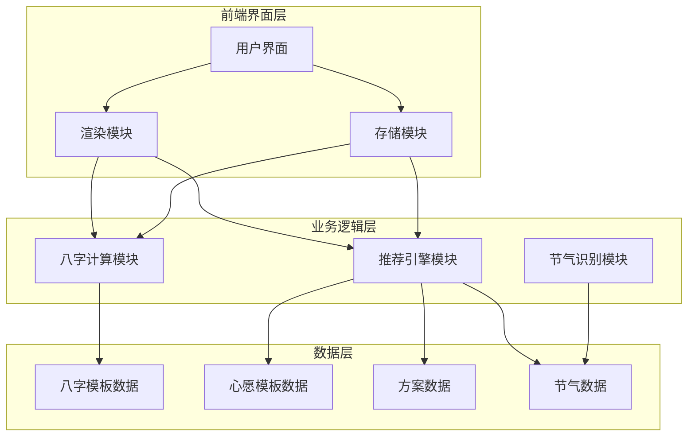
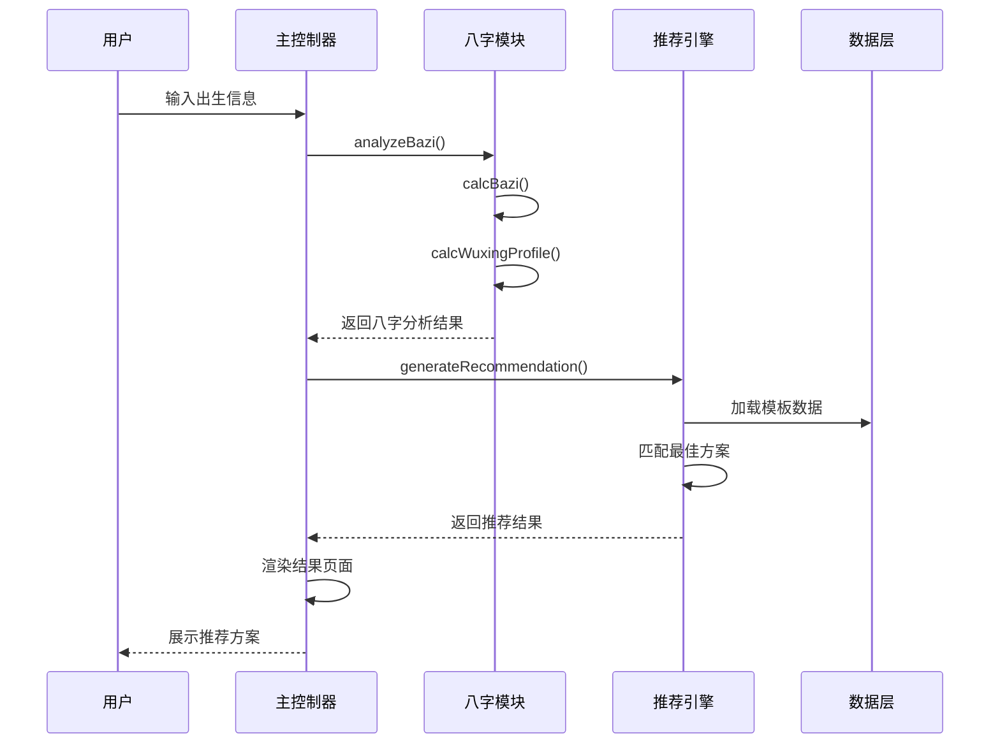
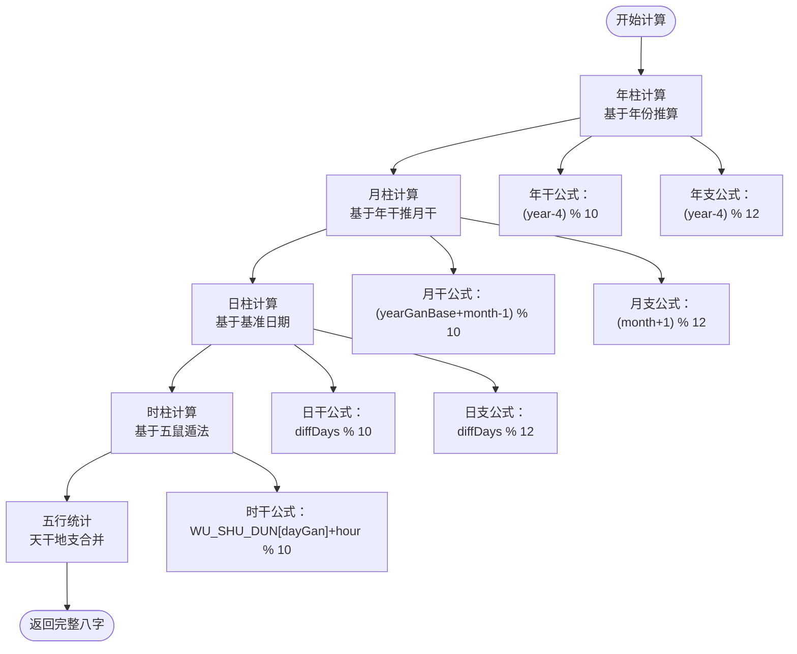
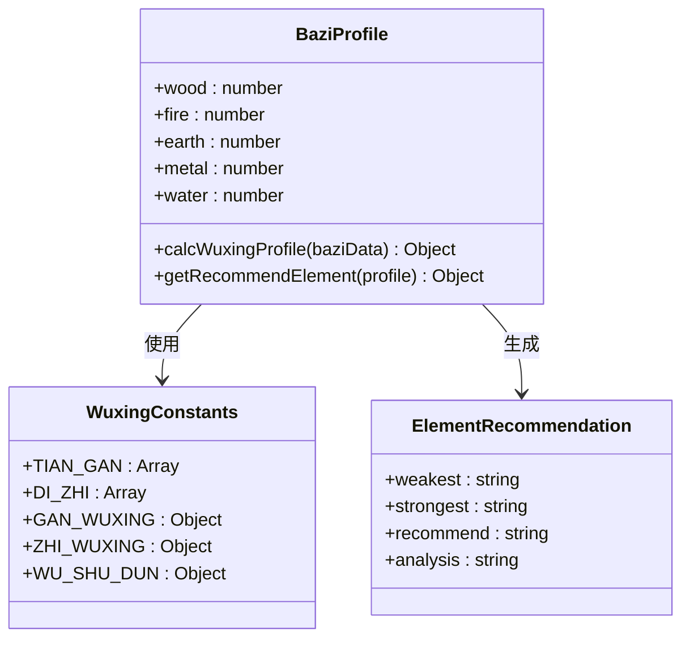
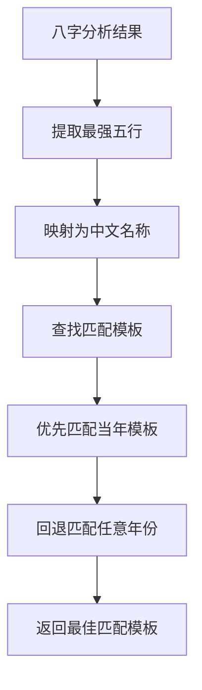
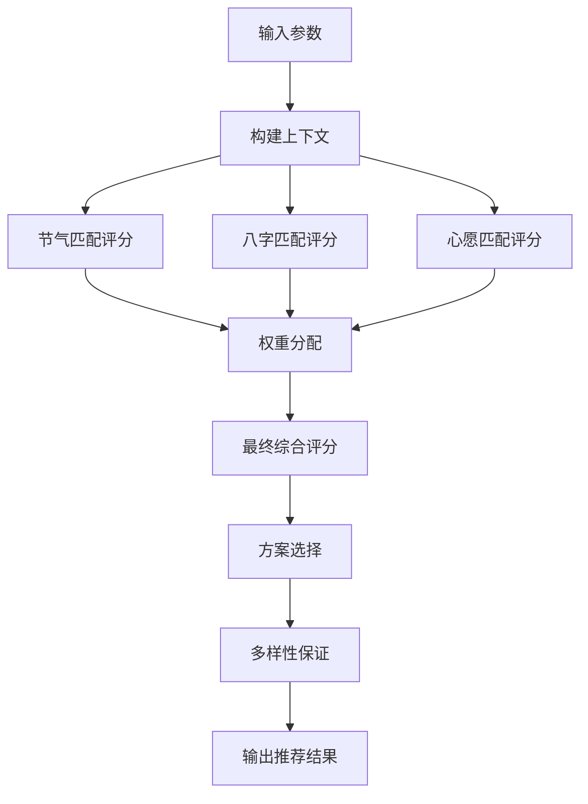
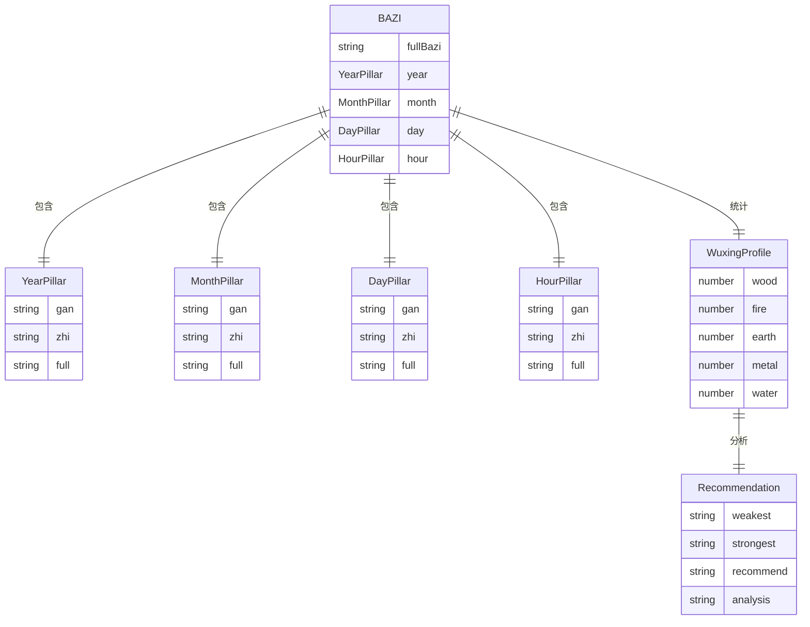
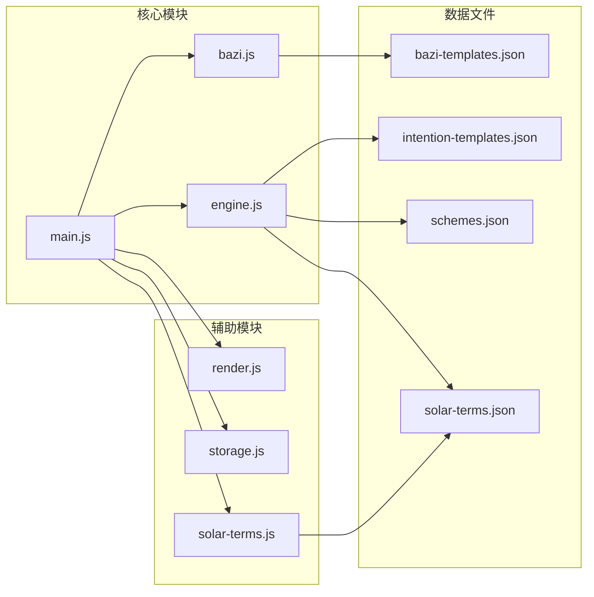
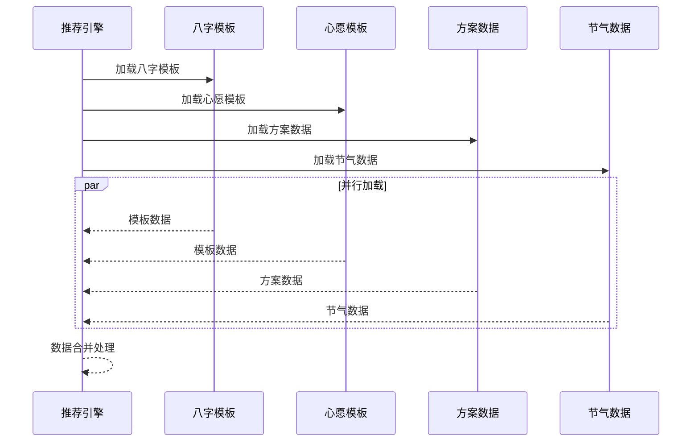

# 八字分析模块 (bazi.js) 技术文档

<cite>
**本文档引用的文件**
- [bazi.js](file://js/bazi.js)
- [engine.js](file://js/engine.js)
- [main.js](file://js/main.js)
- [render.js](file://js/render.js)
- [storage.js](file://js/storage.js)
- [solar-terms.js](file://js/solar-terms.js)
- [bazi-templates.json](file://data/bazi-templates.json)
- [intention-templates.json](file://data/intention-templates.json)
- [schemes.json](file://data/schemes.json)
- [solar-terms.json](file://data/solar-terms.json)
</cite>

## 目录
1. [简介](#简介)
2. [项目结构](#项目结构)
3. [核心组件](#核心组件)
4. [架构概览](#架构概览)
5. [详细组件分析](#详细组件分析)
6. [依赖关系分析](#依赖关系分析)
7. [性能考虑](#性能考虑)
8. [故障排除指南](#故障排除指南)
9. [结论](#结论)
10. [附录](#附录)

## 简介

八字分析模块是"wuxing-fashion"项目的核心功能模块，专注于传统命理学中的八字（四柱）计算与分析。该模块实现了完整的八字推算算法，包括天干地支推算、五行统计分析和命理模板匹配系统。通过精确的算法实现和丰富的数据模板，为用户提供个性化的五行平衡建议和服饰搭配推荐。

## 项目结构

该项目采用模块化架构设计，主要分为以下几个核心模块：

**图表来源**
- [main.js](file://js/main.js#L1-L317)
- [bazi.js](file://js/bazi.js#L1-L193)
- [engine.js](file://js/engine.js#L1-L335)

**章节来源**
- [main.js](file://js/main.js#L1-L317)
- [bazi.js](file://js/bazi.js#L1-L193)
- [engine.js](file://js/engine.js#L1-L335)

## 核心组件

### 八字计算引擎

八字计算模块实现了完整的传统命理学算法，包括：
- **天干地支推算**：基于精确的数学公式计算年柱、月柱、日柱、时柱
- **五行属性统计**：自动统计天干地支的五行属性分布
- **命理分析**：提供五行平衡分析和推荐建议

### 推荐引擎

推荐引擎模块负责：
- **模板匹配**：根据八字分析结果匹配最适合的服饰模板
- **权重计算**：综合考虑节气、心愿、八字等因素进行智能推荐
- **多样性保证**：确保推荐结果的五行多样性

### 数据管理系统

数据管理模块提供：
- **本地存储**：持久化用户选择和历史记录
- **动态加载**：异步加载各类模板数据
- **状态管理**：维护应用的全局状态

**章节来源**
- [bazi.js](file://js/bazi.js#L1-L193)
- [engine.js](file://js/engine.js#L1-L335)
- [storage.js](file://js/storage.js#L1-L116)

## 架构概览

系统采用分层架构设计，各模块职责明确，耦合度低：

**图表来源**
- [main.js](file://js/main.js#L200-L244)
- [bazi.js](file://js/bazi.js#L182-L192)
- [engine.js](file://js/engine.js#L268-L310)

## 详细组件分析

### 八字计算算法实现

#### 天干地支推算算法

八字计算模块实现了精确的传统命理学算法：

**图表来源**
- [bazi.js](file://js/bazi.js#L39-L101)

##### 年柱计算算法

年柱计算基于"天干地支纪年法"，使用以下公式：
- **年干索引**：`(year - 4) % 10`
- **年支索引**：`(year - 4) % 12`

这个算法遵循了传统的"六十甲子"纪年体系，其中甲子年对应 `(year - 4) % 60 = 0`。

##### 月柱计算算法

月柱计算采用"年干推月法"：
- **基础月干**：`yearGanIndex % 5) * 2`
- **月干索引**：`(基础月干 + month - 1) % 10`
- **月支索引**：`(month + 1) % 12`

这种方法确保了月柱与年柱的协调性和准确性。

##### 日柱计算算法

日柱计算使用"基准日期法"：
- **基准日期**：1900年1月31日为甲子日
- **差值计算**：`Math.floor((targetDate - baseDate) / (1000*60*60*24))`
- **日干索引**：`diffDays % 10`
- **日支索引**：`diffDays % 12`

##### 时柱计算算法

时柱计算基于"五鼠遁法"这一传统命理学方法：
- **时干基础**：根据日干查找对应的遁数
- **时干索引**：`(WU_SHU_DUN[dayGan] + hour) % 10`
- **时支索引**：`hour`

**章节来源**
- [bazi.js](file://js/bazi.js#L39-L101)

#### 五行统计分析

五行统计模块实现了完整的五行属性分析：

**图表来源**
- [bazi.js](file://js/bazi.js#L129-L172)

##### 五行属性映射

系统建立了完整的天干地支与五行属性的映射关系：

| 五行 | 天干 | 地支 |
|------|------|------|
| 木 | 甲、乙 | 寅、卯 |
| 火 | 丙、丁 | 巳、午 |
| 土 | 戊、己 | 丑、辰、未、戌 |
| 金 | 庚、辛 | 申、酉 |
| 水 | 壬、癸 | 子、亥 |

##### 五行平衡判断机制

推荐系统采用"最弱元素优先补充"的原则：
1. **统计分析**：分别统计天干和地支的五行分布
2. **排序比较**：按出现频率升序排列
3. **推荐策略**：推荐出现次数最少的五行作为补充目标
4. **平衡建议**：同时给出最强五行的调节建议

**章节来源**
- [bazi.js](file://js/bazi.js#L129-L172)

### 命理模板系统

#### 八字模板匹配

八字模板系统为不同五行属性的日主提供专门的分析规则：

**图表来源**
- [engine.js](file://js/engine.js#L124-L152)

模板系统支持10种不同的八字类型，每种类型都有对应的节气、颜色、材质和情感描述：

| 类型 | 对应节气 | 主要特征 | 材质建议 |
|------|----------|----------|----------|
| 木旺 | 春季节气 | 生机勃勃 | 柔软亲肤 |
| 火旺 | 夏季节气 | 热情奔放 | 透气凉爽 |
| 土旺 | 长夏节气 | 厚重稳重 | 保暖护体 |
| 金旺 | 秋季节气 | 清肃收敛 | 轻薄飘逸 |
| 水旺 | 冬季节气 | 深沉内敛 | 保暖蓄能 |

**章节来源**
- [bazi-templates.json](file://data/bazi-templates.json#L1-L103)

#### 心愿模板系统

心愿模板系统根据用户的特定需求提供个性化建议：

| 心愿类型 | 对应节气 | 颜色特征 | 材质特点 |
|----------|----------|----------|----------|
| 求职 | 春季节气 | 清新明亮 | 轻薄透气 |
| 贵人运 | 夏季节气 | 温暖柔和 | 亲肤舒适 |
| 远行顺利 | 秋季节气 | 深沉内敛 | 保暖实用 |
| 静心专注 | 夏至节气 | 深静内敛 | 凉爽舒适 |
| 健康舒畅 | 秋冬节气 | 温厚稳重 | 保暖护体 |

**章节来源**
- [intention-templates.json](file://data/intention-templates.json#L1-L253)

### 推荐引擎算法

#### 方案评分系统

推荐引擎采用多维度评分算法：

**图表来源**
- [engine.js](file://js/engine.js#L178-L259)

##### 评分权重分配

| 维度 | 权重 | 评分标准 |
|------|------|----------|
| 节气匹配 | 50% | 完全匹配：100分，相生关系：60分 |
| 八字匹配 | 20% | 完全匹配：100分，相生关系：60分 |
| 心愿匹配 | 30% | 完全匹配：100分，相生关系：60分 |

##### 相生关系判断

系统实现了完整的五行相生关系判断：
- 木生火：木元素增强火元素效果
- 火生土：火元素增强土元素效果  
- 土生金：土元素增强金元素效果
- 金生水：金元素增强水元素效果
- 水生木：水元素增强木元素效果

**章节来源**
- [engine.js](file://js/engine.js#L178-L259)

### 数据结构设计

#### 八字数据模型

八字数据采用标准化的数据结构设计：

**图表来源**
- [bazi.js](file://js/bazi.js#L111-L124)
- [bazi.js](file://js/bazi.js#L129-L172)

#### 节气数据模型

节气数据采用统一的结构设计：

| 字段 | 类型 | 描述 | 示例 |
|------|------|------|------|
| id | string | 节气标识符 | "lichun" |
| name | string | 节气名称 | "立春" |
| wuxing | string | 五行属性 | "wood" |
| month | number | 月份 | 2 |
| dayRange | array | 日期范围 | [3, 5] |

**章节来源**
- [bazi.js](file://js/bazi.js#L111-L124)
- [solar-terms.json](file://data/solar-terms.json#L1-L42)

## 依赖关系分析

### 模块间依赖关系

**图表来源**
- [main.js](file://js/main.js#L5-L15)
- [bazi.js](file://js/bazi.js#L1-L193)
- [engine.js](file://js/engine.js#L1-L335)

### 数据依赖关系

系统采用异步数据加载机制，确保模块间的松耦合：

**图表来源**
- [engine.js](file://js/engine.js#L268-L274)

**章节来源**
- [main.js](file://js/main.js#L5-L15)
- [engine.js](file://js/engine.js#L268-L274)

## 性能考虑

### 算法复杂度分析

#### 时间复杂度

| 操作 | 复杂度 | 说明 |
|------|--------|------|
| 八字计算 | O(1) | 所有计算都是常数时间 |
| 五行统计 | O(n) | n为天干地支数量（固定为8） |
| 模板匹配 | O(m) | m为模板数量 |
| 方案评分 | O(k log k) | k为方案数量，需要排序 |

#### 空间复杂度

- **八字数据结构**：O(1) - 固定大小的结构体
- **模板数据**：O(n) - n为模板总数
- **运行时缓存**：O(1) - 缓存少量数据

### 优化策略

1. **数据缓存**：模板数据在首次加载后缓存在内存中
2. **异步加载**：避免阻塞主线程
3. **算法简化**：使用数学公式直接计算，避免复杂的循环
4. **内存管理**：及时清理不需要的临时变量

## 故障排除指南

### 常见问题及解决方案

#### 八字计算错误

**问题**：计算结果与预期不符
**可能原因**：
- 出生时间输入错误
- 时区转换问题
- 公式实现错误

**解决方法**：
1. 验证输入的年月日时是否正确
2. 检查时区设置是否为UTC+8
3. 对照标准的天干地支表进行验证

#### 推荐结果异常

**问题**：推荐结果不符合预期
**可能原因**：
- 模板数据配置错误
- 评分权重设置不当
- 节气识别错误

**解决方法**：
1. 检查模板数据的完整性
2. 验证评分权重的合理性
3. 确认节气数据的准确性

#### 性能问题

**问题**：页面响应缓慢
**可能原因**：
- 数据加载阻塞
- DOM操作过多
- 内存泄漏

**解决方法**：
1. 优化数据加载策略
2. 减少不必要的DOM操作
3. 定期检查内存使用情况

**章节来源**
- [bazi.js](file://js/bazi.js#L1-L193)
- [engine.js](file://js/engine.js#L1-L335)

## 结论

八字分析模块实现了传统命理学与现代技术的完美结合。通过精确的算法实现和丰富的数据模板，为用户提供了准确、个性化的命理分析和推荐服务。

### 主要优势

1. **算法准确性**：采用经过验证的传统命理学算法
2. **数据丰富性**：包含完整的八字模板、心愿模板和方案数据
3. **用户体验**：提供直观的界面和流畅的操作体验
4. **扩展性强**：模块化设计便于功能扩展和维护

### 技术特色

1. **精确计算**：基于数学公式的八字推算算法
2. **智能推荐**：多维度评分和模板匹配系统
3. **实时响应**：异步数据加载和缓存机制
4. **本地存储**：持久化用户偏好和历史记录

## 附录

### 算法验证方法

#### 标准对照验证

1. **基准测试**：使用已知的八字案例进行对比验证
2. **专家审核**：邀请命理学专家对算法结果进行审核
3. **历史验证**：对比历史记录和实际案例

#### 性能测试

1. **负载测试**：模拟大量并发请求的处理能力
2. **内存测试**：检查内存使用和垃圾回收情况
3. **兼容性测试**：验证不同浏览器和设备的兼容性

### 扩展开发指导

#### 自定义分析规则

1. **规则定义**：在相应的JSON文件中添加新的规则
2. **算法实现**：在bazi.js中实现对应的计算函数
3. **模板更新**：在bazi-templates.json中添加新的模板

#### 算法优化建议

1. **缓存策略**：实现更高效的缓存机制
2. **并行处理**：利用Web Workers进行并行计算
3. **增量更新**：实现数据的增量更新和同步