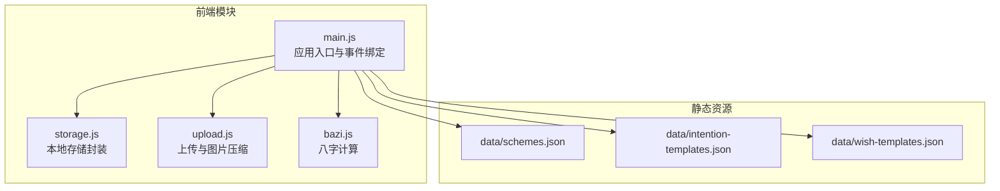
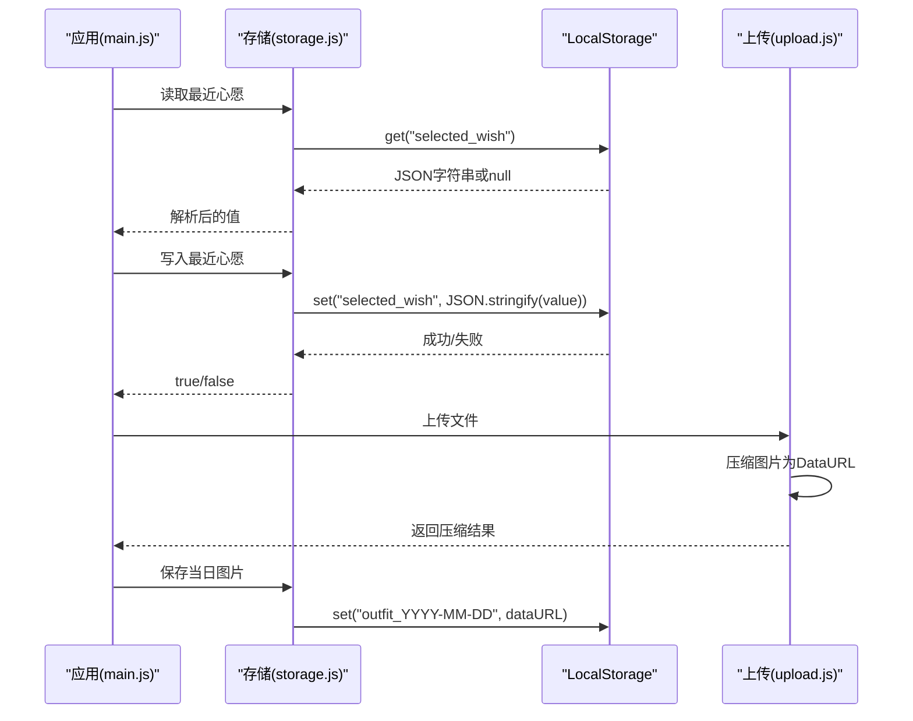
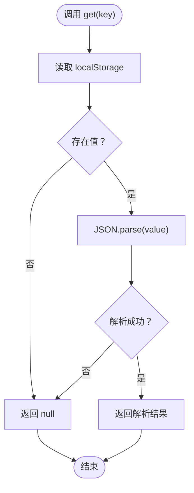
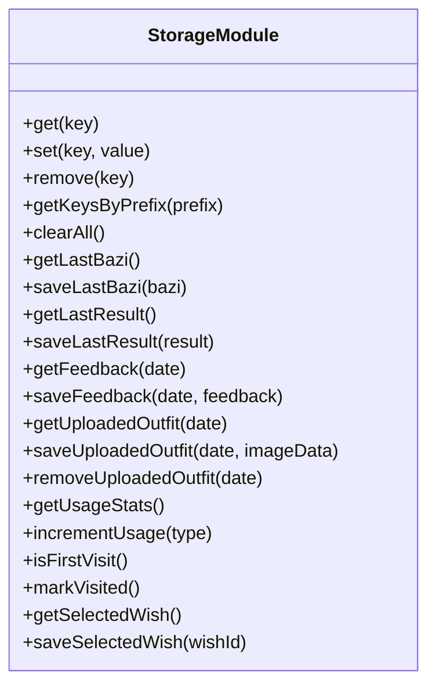
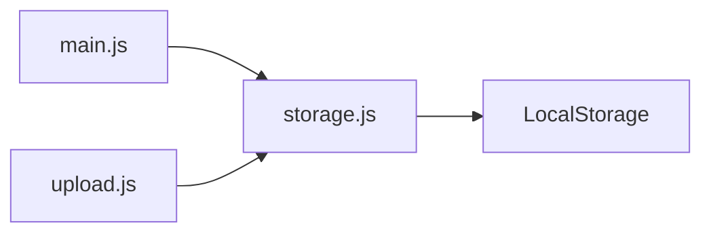

# 存储模块 (storage.js)

<cite>
**本文档引用的文件**
- [storage.js](file://js/storage.js)
- [main.js](file://js/main.js)
- [upload.js](file://js/upload.js)
- [bazi.js](file://js/bazi.js)
- [schemes.json](file://data/schemes.json)
- [intention-templates.json](file://data/intention-templates.json)
- [wish-templates.json](file://data/wish-templates.json)
</cite>

## 目录
1. [简介](#简介)
2. [项目结构](#项目结构)
3. [核心组件](#核心组件)
4. [架构总览](#架构总览)
5. [详细组件分析](#详细组件分析)
6. [依赖关系分析](#依赖关系分析)
7. [性能考量](#性能考量)
8. [故障排查指南](#故障排查指南)
9. [结论](#结论)
10. [附录](#附录)

## 简介
本文件为存储模块（storage.js）的全面技术文档，聚焦LocalStorage封装设计与数据持久化策略。文档从系统架构、组件关系、数据流、处理逻辑、集成点、错误处理与性能特性等维度进行深入剖析，并结合实际业务场景（心愿选择、八字信息、推荐结果、上传图片、用户反馈）说明数据存储格式与访问模式，同时给出安全与隐私保护、数据迁移、缓存机制、备份恢复、版本兼容与存储空间管理的最佳实践建议，以及离线增强与数据同步的扩展指导。

## 项目结构
存储模块位于 js/storage.js，采用单一职责的工具模块设计，围绕LocalStorage提供统一的键值管理、序列化/反序列化、前缀化命名空间、业务方法封装与清理能力。应用主流程在 main.js 中通过导入 storage 模块实现数据的读写与恢复。

图表来源
- [storage.js](file://js/storage.js#L1-L116)
- [main.js](file://js/main.js#L1-L317)
- [upload.js](file://js/upload.js#L1-L145)
- [bazi.js](file://js/bazi.js#L1-L193)
- [schemes.json](file://data/schemes.json#L1-L509)
- [intention-templates.json](file://data/intention-templates.json#L1-L253)
- [wish-templates.json](file://data/wish-templates.json#L1-L47)

章节来源
- [storage.js](file://js/storage.js#L1-L116)
- [main.js](file://js/main.js#L1-L317)

## 核心组件
- 基础封装层
  - get(key): 读取并解析JSON值，异常时返回null
  - set(key, value): 序列化后写入，异常时返回false
  - remove(key): 删除指定键
  - getKeysByPrefix(prefix): 枚举带前缀的键集合
  - clearAll(): 清空所有带前缀的键
- 业务方法层
  - 最近一次八字：getLastBazi/saveLastBazi
  - 最近一次推荐结果：getLastResult/saveLastResult
  - 用户反馈：getFeedback/saveFeedback（按日期聚合）
  - 上传图片：getUploadedOutfit/saveUploadedOutfit/removeUploadedOutfit（按日期键）
  - 使用统计：getUsageStats/incrementUsage
  - 首次访问：isFirstVisit/markVisited
  - 选中的心愿：getSelectedWish/saveSelectedWish

章节来源
- [storage.js](file://js/storage.js#L7-L115)

## 架构总览
存储模块作为应用的数据持久化抽象层，向上提供业务语义化的API，向下依赖浏览器LocalStorage。应用主流程在初始化与交互过程中调用存储模块完成状态恢复与数据写入，上传模块负责将压缩后的图片数据以字符串形式写入LocalStorage，反馈模块以日期为键聚合用户输入。

图表来源
- [main.js](file://js/main.js#L40-L44)
- [main.js](file://js/main.js#L109-L113)
- [storage.js](file://js/storage.js#L16-L23)
- [storage.js](file://js/storage.js#L79-L85)
- [upload.js](file://js/upload.js#L31-L82)

## 详细组件分析

### 基础封装层设计
- 前缀化命名空间
  - 所有键名统一加上前缀，避免与其他模块或第三方脚本冲突
- 序列化与反序列化
  - 写入时使用JSON.stringify，读取时使用JSON.parse，异常捕获返回默认值
- 错误恢复机制
  - 写入失败返回false，读取失败返回null，保证上层调用不会崩溃
- 键枚举与清理
  - 支持按前缀枚举与批量清理，便于调试与迁移

图表来源
- [storage.js](file://js/storage.js#L7-L14)

章节来源
- [storage.js](file://js/storage.js#L7-L49)

### 业务方法层设计
- 最近一次八字
  - 存储结构：对象，包含年、月、日、时字段
  - 访问模式：直接读取/写入，用于表单恢复与计算
- 最近一次推荐结果
  - 存储结构：对象，包含推荐方案数组等
  - 访问模式：生成/换一批后覆盖写入
- 用户反馈
  - 存储结构：对象，键为日期字符串，值为反馈对象（文本+时间戳）
  - 访问模式：按日期查询与追加
- 上传图片
  - 存储结构：字符串（DataURL），键为“outfit_YYYY-MM-DD”
  - 访问模式：按日期读取/删除，支持预览与移除
- 使用统计
  - 存储结构：对象，包含访问次数、生成次数、上传次数
  - 访问模式：原子性递增
- 首次访问与选中心愿
  - 存储结构：布尔值与字符串
  - 访问模式：标记与读取

图表来源
- [storage.js](file://js/storage.js#L7-L115)

章节来源
- [storage.js](file://js/storage.js#L52-L115)

### 数据类型与存储策略

- 心愿选择
  - 存储格式：字符串（心愿ID）
  - 访问模式：初始化时读取，用户切换时写入
  - 参考路径：[main.js](file://js/main.js#L40-L44)、[storage.js](file://js/storage.js#L109-L115)
- 八字信息
  - 存储格式：对象（年、月、日、时）
  - 访问模式：表单恢复与计算前读取
  - 参考路径：[main.js](file://js/main.js#L46-L50)、[bazi.js](file://js/bazi.js#L182-L192)、[storage.js](file://js/storage.js#L52-L58)
- 推荐结果
  - 存储格式：对象（包含推荐方案数组等）
  - 访问模式：生成/换一批后覆盖
  - 参考路径：[main.js](file://js/main.js#L224-L244)、[main.js](file://js/main.js#L254-L269)、[storage.js](file://js/storage.js#L60-L66)
- 上传图片
  - 存储格式：字符串（DataURL）
  - 访问模式：按日期键读取/删除，支持预览
  - 参考路径：[upload.js](file://js/upload.js#L31-L82)、[main.js](file://js/main.js#L109-L113)、[storage.js](file://js/storage.js#L79-L89)
- 用户反馈
  - 存储格式：对象（键为日期，值为反馈对象）
  - 访问模式：按日期查询与追加
  - 参考路径：[main.js](file://js/main.js#L297-L313)、[storage.js](file://js/storage.js#L68-L77)

章节来源
- [main.js](file://js/main.js#L40-L313)
- [upload.js](file://js/upload.js#L31-L82)
- [bazi.js](file://js/bazi.js#L182-L192)
- [storage.js](file://js/storage.js#L52-L89)

### 缓存机制与性能优化
- 缓存策略
  - 本地缓存：LocalStorage作为前端缓存，减少重复请求与计算
  - 会话缓存：应用运行期间在内存中维护当前状态（如当前心愿ID、当前结果等）
- 性能优化
  - 序列化开销：仅在必要时进行JSON操作，避免频繁读写
  - 键枚举：按需使用getKeysByPrefix，避免全量扫描
  - 图片存储：上传前压缩为DataURL，减小体积但占用内存，注意控制图片数量与生命周期
  - 使用统计：原子性递增，避免竞态

章节来源
- [storage.js](file://js/storage.js#L7-L49)
- [upload.js](file://js/upload.js#L31-L82)
- [main.js](file://js/main.js#L92-L113)

### 错误处理与恢复机制
- 写入失败
  - set返回false，上层可降级处理或提示用户
- 读取失败
  - get返回null，上层使用默认值或重新计算
- 清理与迁移
  - clearAll可用于重置，getKeysByPrefix用于诊断与迁移

章节来源
- [storage.js](file://js/storage.js#L7-L27)

## 依赖关系分析
- 对外依赖
  - 浏览器LocalStorage API
  - 应用主流程（main.js）通过导入storage模块进行数据读写
  - 上传模块（upload.js）与存储模块协作完成图片持久化
- 内部耦合
  - 业务方法与具体键名强耦合，便于语义化调用
  - 建议通过配置中心或常量文件统一管理键名，提升可维护性

图表来源
- [main.js](file://js/main.js#L5)
- [upload.js](file://js/upload.js#L1-L145)
- [storage.js](file://js/storage.js#L1-L116)

章节来源
- [main.js](file://js/main.js#L5-L15)
- [upload.js](file://js/upload.js#L1-L145)
- [storage.js](file://js/storage.js#L1-L116)

## 性能考量
- 写入性能
  - JSON序列化与LocalStorage写入均为同步操作，建议批量写入或合并更新
- 读取性能
  - get/set为O(1)，但频繁读取可能触发磁盘IO，建议在内存中缓存热点数据
- 存储容量
  - LocalStorage容量有限，建议：
    - 控制图片数量与尺寸
    - 定期清理过期数据（如历史日期的图片）
    - 使用键前缀与命名规范，便于清理
- 并发与竞态
  - 同步API下并发风险较低，但使用统计等需要确保原子性

[本节为通用性能讨论，无需特定文件来源]

## 故障排查指南
- 写入失败
  - 现象：set返回false
  - 排查：检查存储配额、浏览器设置、跨域限制
  - 处理：降级到内存缓存或提示用户清理空间
- 读取异常
  - 现象：get返回null
  - 排查：确认键名是否正确、数据是否被清理
  - 处理：回退到默认值或重新生成
- 图片无法显示
  - 现象：按日期读取不到图片
  - 排查：确认日期格式一致、图片是否被移除
  - 处理：重新上传或检查键前缀
- 使用统计不准确
  - 现象：访问/生成/上传计数异常
  - 排查：检查incrementUsage调用频率与并发
  - 处理：确保原子性更新

章节来源
- [storage.js](file://js/storage.js#L7-L27)
- [main.js](file://js/main.js#L109-L113)
- [upload.js](file://js/upload.js#L31-L82)

## 结论
storage.js通过前缀化命名空间、统一的序列化/反序列化与健壮的错误恢复机制，为应用提供了简洁可靠的本地存储能力。结合main.js的业务流程与upload.js的图片处理，实现了从用户交互到数据持久化的完整闭环。建议在后续迭代中引入配置化键名、定期清理策略与版本迁移方案，进一步提升可维护性与稳定性。

[本节为总结性内容，无需特定文件来源]

## 附录

### 安全与隐私保护
- 数据最小化：仅存储必要的交互数据与临时结果
- 明确标识：使用前缀避免污染其他脚本
- 清理策略：提供clearAll与按日期清理接口，支持用户主动删除

章节来源
- [storage.js](file://js/storage.js#L5-L49)

### 数据迁移策略
- 版本升级：通过clearAll或getKeysByPrefix识别旧键，执行迁移脚本
- 迁移示例：将旧键映射到新键，再删除旧键
- 兼容性：保持向后兼容的读取逻辑，逐步淘汰旧格式

章节来源
- [storage.js](file://js/storage.js#L29-L49)

### 备份与恢复
- 备份：导出LocalStorage中的关键键值，保存为JSON文件
- 恢复：在新环境导入对应键值，确保前缀与格式一致
- 建议：提供一键导出/导入功能，便于用户迁移

章节来源
- [storage.js](file://js/storage.js#L29-L49)

### 存储空间管理
- 图片清理：按日期键定期清理过期图片
- 统计清理：限制统计数据保留周期
- 监控告警：检测存储使用率，提示用户清理

章节来源
- [storage.js](file://js/storage.js#L79-L99)
- [upload.js](file://js/upload.js#L31-L82)

### 离线增强与数据同步扩展
- 离线能力：将常用数据（如最近结果、反馈、图片）缓存于LocalStorage，提升离线可用性
- 同步扩展：未来可引入IndexedDB或Service Worker，实现后台同步与增量更新
- 版本控制：为数据结构增加版本号，支持自动迁移

[本节为概念性扩展建议，无需特定文件来源]