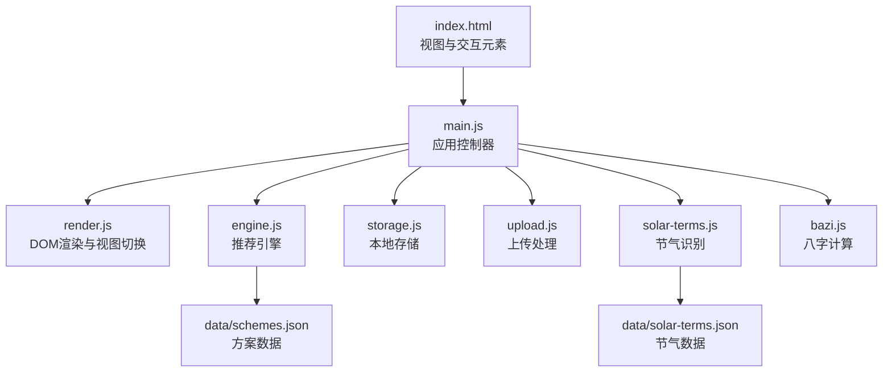
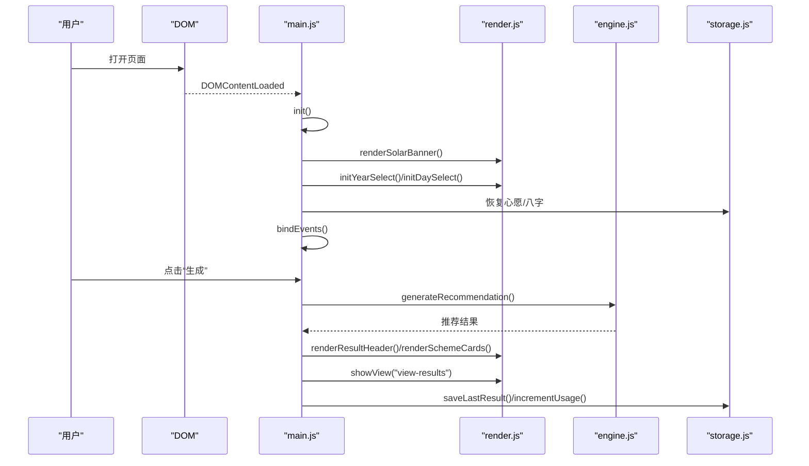
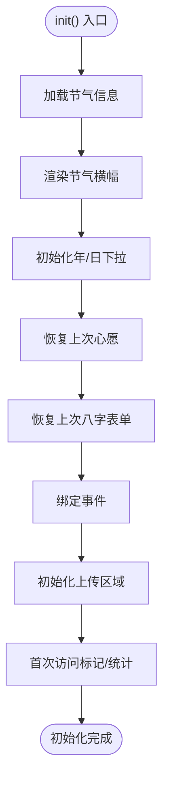
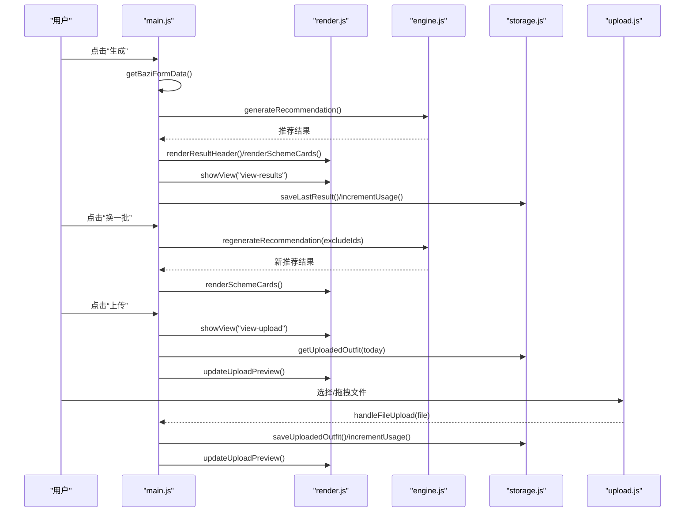
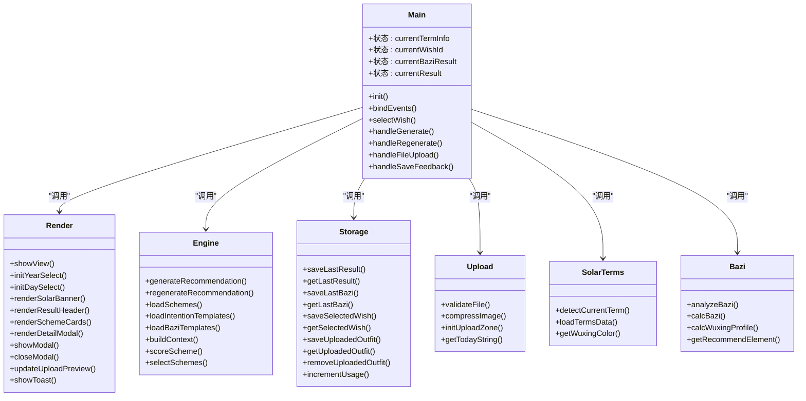
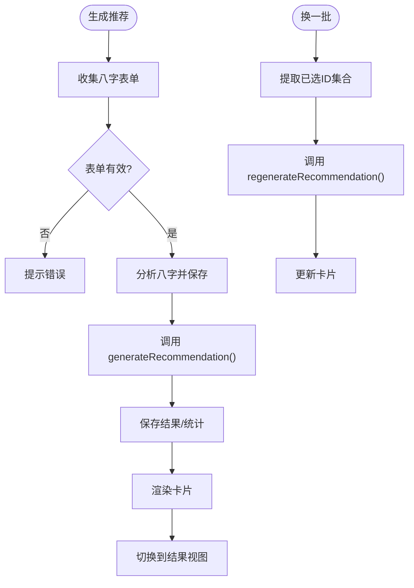
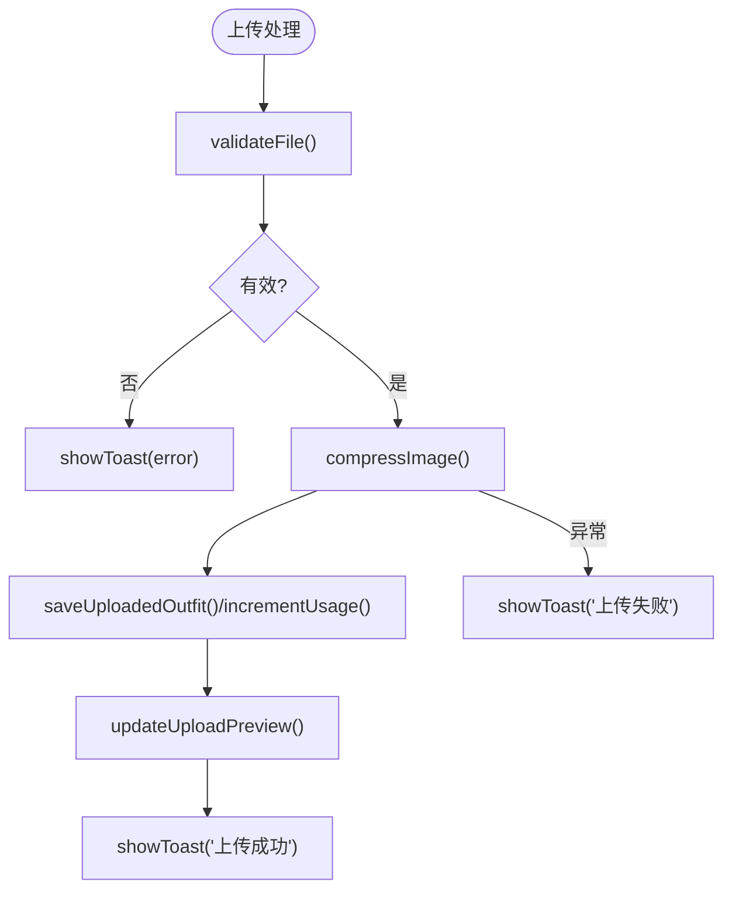
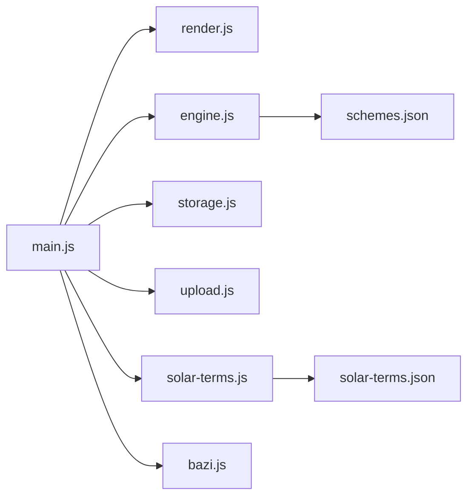

# 应用入口模块 (main.js)

<cite>
**本文档引用的文件**
- [main.js](file://js/main.js)
- [index.html](file://index.html)
- [engine.js](file://js/engine.js)
- [render.js](file://js/render.js)
- [solar-terms.js](file://js/solar-terms.js)
- [storage.js](file://js/storage.js)
- [upload.js](file://js/upload.js)
- [bazi.js](file://js/bazi.js)
- [schemes.json](file://data/schemes.json)
- [solar-terms.json](file://data/solar-terms.json)
</cite>

## 目录
1. [简介](#简介)
2. [项目结构](#项目结构)
3. [核心组件](#核心组件)
4. [架构总览](#架构总览)
5. [详细组件分析](#详细组件分析)
6. [依赖关系分析](#依赖关系分析)
7. [性能考量](#性能考量)
8. [故障排查指南](#故障排查指南)
9. [结论](#结论)
10. [附录](#附录)

## 简介
本文件为应用入口模块（main.js）的深度技术文档，聚焦于其作为应用控制器的核心职责：初始化流程管理、事件绑定机制、状态管理与模块协调。文档将详细解析 init() 初始化步骤（节气信息加载、表单初始化、视图渲染与事件绑定）、bindEvents() 中各类用户交互事件的处理逻辑（心愿选择、生成推荐、换一批、上传处理等），并阐明与其他模块的协作方式、错误处理策略、性能优化与扩展性设计，最后提供重构与维护的最佳实践建议。

## 项目结构
应用采用模块化组织，入口模块负责协调各子模块完成完整的业务闭环：
- HTML 页面定义视图结构与交互元素
- main.js 作为应用控制器，协调渲染、引擎、存储、上传、节气与八字模块
- engine.js 提供推荐算法与方案选择
- render.js 负责 DOM 视图切换与卡片渲染
- solar-terms.js 提供节气识别与颜色映射
- storage.js 提供本地持久化与统计
- upload.js 处理文件校验、压缩与上传区域初始化
- bazi.js 提供简化版八字计算与五行分析

图表来源
- [main.js](file://js/main.js#L1-L317)
- [index.html](file://index.html#L1-L236)
- [engine.js](file://js/engine.js#L1-L335)
- [render.js](file://js/render.js#L1-L272)
- [solar-terms.js](file://js/solar-terms.js#L1-L118)
- [storage.js](file://js/storage.js#L1-L116)
- [upload.js](file://js/upload.js#L1-L145)
- [bazi.js](file://js/bazi.js#L1-L193)
- [schemes.json](file://data/schemes.json#L1-L200)
- [solar-terms.json](file://data/solar-terms.json#L1-L42)

章节来源
- [main.js](file://js/main.js#L1-L317)
- [index.html](file://index.html#L1-L236)

## 核心组件
- 应用状态管理
  - 当前节气信息：currentTermInfo
  - 当前心愿ID：currentWishId
  - 八字分析结果：currentBaziResult
  - 最终推荐结果：currentResult
- 初始化流程
  - 节气检测与横幅渲染
  - 表单下拉初始化
  - 心愿与八字恢复
  - 事件绑定与上传区域初始化
  - 首次访问标记与使用统计
- 事件处理
  - 视图切换按钮
  - 心愿标签选择
  - 生成与换一批
  - 上传区域交互与反馈保存
  - 详情模态框的打开与关闭

章节来源
- [main.js](file://js/main.js#L17-L67)

## 架构总览
main.js 作为应用控制器，承担以下职责：
- 生命周期启动：DOMContentLoaded 触发 init()
- 状态初始化：加载节气、恢复用户选择与表单
- 事件委派：统一绑定页面交互事件
- 协调执行：调用渲染、引擎、存储、上传等模块
- 结果回显：渲染推荐卡片并切换视图

图表来源
- [main.js](file://js/main.js#L26-L67)
- [render.js](file://js/render.js#L5-L16)
- [engine.js](file://js/engine.js#L268-L310)
- [storage.js](file://js/storage.js#L60-L66)

## 详细组件分析

### 初始化流程（init）
- 节气信息加载
  - 调用节气识别模块，获取当前节气与季节信息，并渲染欢迎页横幅
- 表单初始化
  - 年份下拉：从起始年到当前年减16岁区间填充选项
  - 日期下拉：1-31日选项
- 视图渲染
  - 渲染节气横幅与心愿标签样式更新
- 数据恢复
  - 恢复上次选择的心愿ID
  - 恢复上次输入的八字表单
- 事件绑定
  - 统一调用 bindEvents() 绑定交互事件
- 上传区域初始化
  - 初始化拖拽/点击上传区域，并传入回调处理文件
- 首次访问与统计
  - 标记首次访问并增加访问次数

图表来源
- [main.js](file://js/main.js#L26-L67)
- [render.js](file://js/render.js#L54-L71)
- [storage.js](file://js/storage.js#L109-L115)

章节来源
- [main.js](file://js/main.js#L26-L67)

### 事件绑定机制（bindEvents）
- 视图切换
  - “开始体验”、“返回”系列按钮切换视图
- 心愿选择
  - 点击心愿标签，切换激活样式并保存选择
- 生成与换一批
  - 生成：收集八字表单，调用引擎生成推荐，渲染结果并切换视图
  - 换一批：基于已排除ID重新生成，保持节气与心愿上下文
- 上传区域
  - 切换到上传视图，若当日已有图片则预览
  - 移除图片：清除本地存储并更新预览
- 详情模态框
  - 委托点击“查看详解”，渲染详情并显示模态框
  - 关闭：点击关闭按钮、背景遮罩或按ESC键
- 反馈保存
  - 校验输入非空，保存到本地存储并清空输入

图表来源
- [main.js](file://js/main.js#L72-L153)
- [main.js](file://js/main.js#L202-L244)
- [main.js](file://js/main.js#L249-L269)
- [main.js](file://js/main.js#L274-L292)
- [render.js](file://js/render.js#L114-L127)
- [engine.js](file://js/engine.js#L268-L310)
- [engine.js](file://js/engine.js#L315-L334)
- [storage.js](file://js/storage.js#L79-L89)

章节来源
- [main.js](file://js/main.js#L72-L153)
- [main.js](file://js/main.js#L202-L244)
- [main.js](file://js/main.js#L249-L269)
- [main.js](file://js/main.js#L274-L292)

### 状态管理与模块协调
- 应用状态
  - currentTermInfo：节气上下文
  - currentWishId：心愿上下文
  - currentBaziResult：八字分析结果
  - currentResult：最终推荐结果
- 协作方式
  - 渲染模块：负责视图切换、卡片渲染、模态框控制与Toast提示
  - 引擎模块：加载方案与模板数据，构建上下文，评分与筛选方案
  - 存储模块：持久化用户选择、结果、反馈与上传图片，统计访问次数
  - 上传模块：文件校验、压缩、拖拽/点击交互与预览更新
  - 节气模块：加载节气数据，识别当前节气与季节
  - 八字模块：简化版八字计算与五行分析

图表来源
- [main.js](file://js/main.js#L1-L317)
- [render.js](file://js/render.js#L1-L272)
- [engine.js](file://js/engine.js#L1-L335)
- [storage.js](file://js/storage.js#L1-L116)
- [upload.js](file://js/upload.js#L1-L145)
- [solar-terms.js](file://js/solar-terms.js#L1-L118)
- [bazi.js](file://js/bazi.js#L1-L193)

章节来源
- [main.js](file://js/main.js#L1-L317)

### 推荐生成与换一批流程
- 生成推荐
  - 收集八字表单，若有效则分析八字并保存
  - 调用引擎生成推荐，保存结果并渲染卡片
  - 切换到结果视图
- 换一批
  - 基于已选方案ID集合排除重复
  - 重新生成推荐并更新卡片

图表来源
- [main.js](file://js/main.js#L202-L244)
- [main.js](file://js/main.js#L249-L269)
- [engine.js](file://js/engine.js#L268-L310)
- [engine.js](file://js/engine.js#L315-L334)

章节来源
- [main.js](file://js/main.js#L202-L244)
- [main.js](file://js/main.js#L249-L269)
- [engine.js](file://js/engine.js#L268-L310)
- [engine.js](file://js/engine.js#L315-L334)

### 上传处理流程
- 文件校验：类型、大小
- 图片压缩：按目标大小迭代降低质量
- 本地存储与预览更新：保存图片并显示反馈区
- 错误处理：捕获异常并提示

图表来源
- [main.js](file://js/main.js#L274-L292)
- [upload.js](file://js/upload.js#L12-L26)
- [upload.js](file://js/upload.js#L31-L82)
- [storage.js](file://js/storage.js#L83-L89)
- [render.js](file://js/render.js#L220-L237)

章节来源
- [main.js](file://js/main.js#L274-L292)
- [upload.js](file://js/upload.js#L12-L26)
- [upload.js](file://js/upload.js#L31-L82)
- [storage.js](file://js/storage.js#L83-L89)
- [render.js](file://js/render.js#L220-L237)

## 依赖关系分析
- 模块耦合
  - main.js 对 render、engine、storage、upload、solar-terms、bazi 具有直接依赖
  - engine.js 依赖 data/schemes.json 与 data/solar-terms.json
  - solar-terms.js 依赖 data/solar-terms.json
- 耦合度与内聚性
  - main.js 聚合了业务流程，内聚性良好
  - 各模块职责清晰，耦合主要体现在数据传递与回调
- 潜在循环依赖
  - 未发现循环依赖
- 外部依赖
  - fetch API 加载 JSON 数据
  - FileReader/Canvas API 处理图片压缩
  - localStorage API 持久化

图表来源
- [main.js](file://js/main.js#L5-L15)
- [engine.js](file://js/engine.js#L39-L79)
- [solar-terms.js](file://js/solar-terms.js#L18-L29)

章节来源
- [main.js](file://js/main.js#L5-L15)
- [engine.js](file://js/engine.js#L39-L79)
- [solar-terms.js](file://js/solar-terms.js#L18-L29)

## 性能考量
- 异步加载与并发
  - 推荐引擎使用 Promise.all 并发加载方案、心愿模板与八字模板，减少等待时间
- DOM 操作最小化
  - 渲染模块批量插入节点，避免频繁重排
- 图片压缩策略
  - 先缩放再按目标大小迭代降低质量，兼顾体积与清晰度
- 缓存与去抖
  - 节气与模板数据在内存中缓存，避免重复请求
- 事件委托
  - 使用事件委托减少监听器数量，提升交互性能

章节来源
- [engine.js](file://js/engine.js#L270-L274)
- [render.js](file://js/render.js#L114-L127)
- [upload.js](file://js/upload.js#L31-L82)
- [solar-terms.js](file://js/solar-terms.js#L18-L29)

## 故障排查指南
- 节气数据加载失败
  - 现象：节气横幅为空或默认值
  - 排查：检查 data/solar-terms.json 是否可访问，网络请求是否被拦截
  - 参考：节气模块的加载与错误日志
- 推荐结果为空
  - 现象：生成失败提示
  - 排查：确认 schemes.json 数据完整，上下文 termId 与 wishId 正确
  - 参考：引擎模块的上下文构建与选择逻辑
- 上传失败
  - 现象：上传失败提示
  - 排查：文件类型/大小限制、Canvas 转码异常、localStorage 写入失败
  - 参考：上传模块的校验与压缩流程
- 本地存储异常
  - 现象：无法保存/读取心愿、结果或图片
  - 排查：浏览器隐私模式、存储配额、序列化异常
  - 参考：存储模块的 get/set 实现

章节来源
- [solar-terms.js](file://js/solar-terms.js#L21-L28)
- [engine.js](file://js/engine.js#L268-L279)
- [upload.js](file://js/upload.js#L31-L82)
- [storage.js](file://js/storage.js#L7-L23)

## 结论
main.js 作为应用控制器，通过清晰的状态管理、模块化的事件绑定与稳健的流程编排，实现了从节气识别、心愿与八字输入、推荐生成到上传反馈的完整用户体验。其设计具备良好的扩展性与可维护性，便于后续功能迭代与性能优化。

## 附录
- 最佳实践建议
  - 将状态集中管理，避免散落的全局变量
  - 对异步操作统一错误处理与重试策略
  - 对关键路径进行性能监控与埋点
  - 将配置项（如文件大小、目标压缩大小）抽离为常量
  - 对事件委托与 DOM 查询进行边界检查，增强健壮性
- 扩展性设计
  - 引擎模块可扩展更多模板与评分维度
  - 渲染模块可抽象出通用组件与动画系统
  - 存储模块可引入版本迁移与增量备份