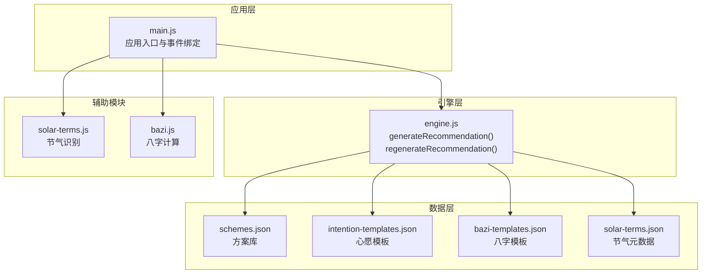
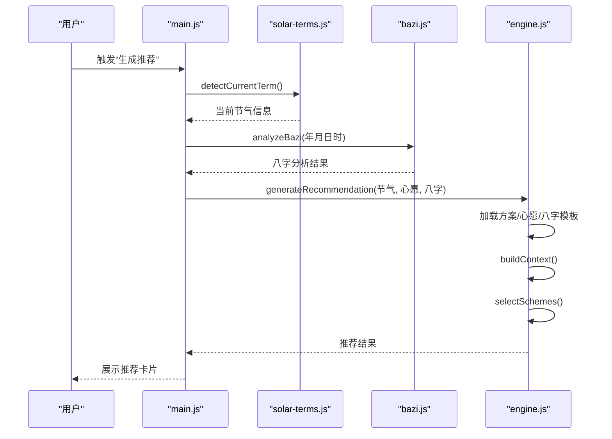
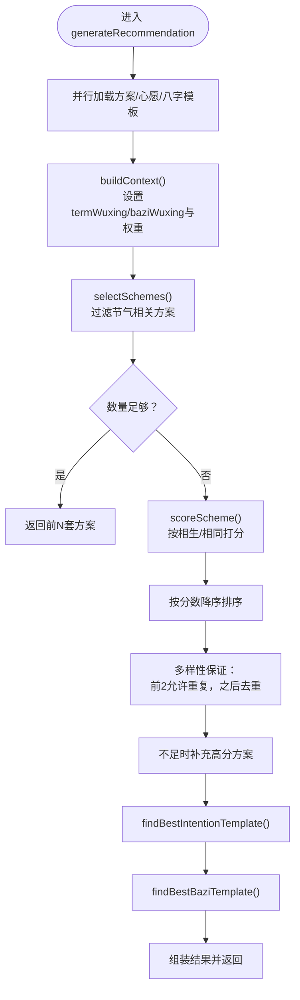
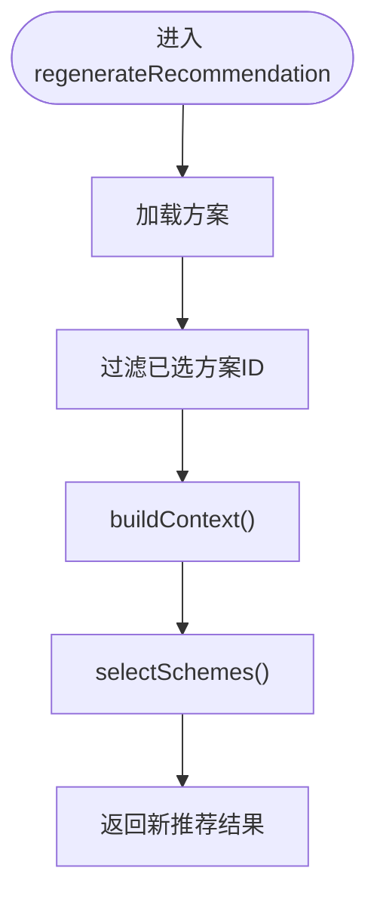
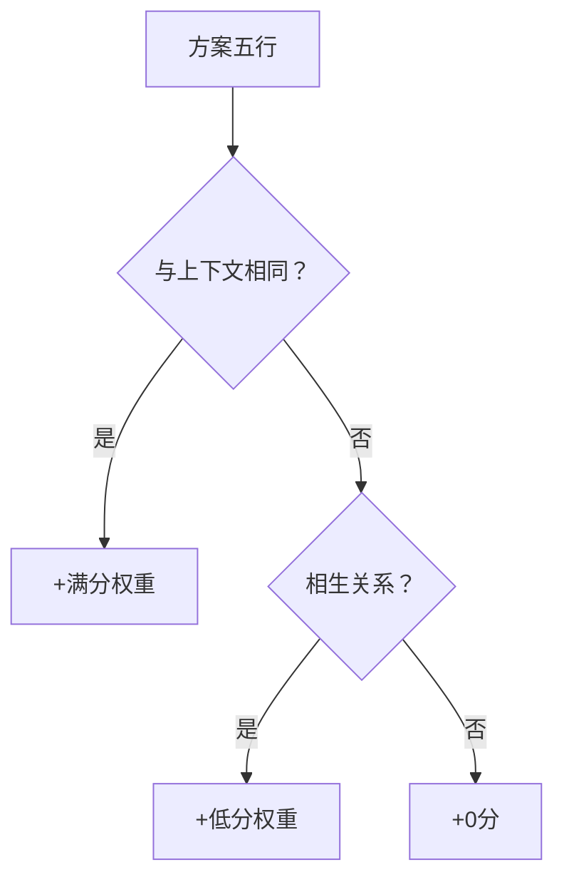
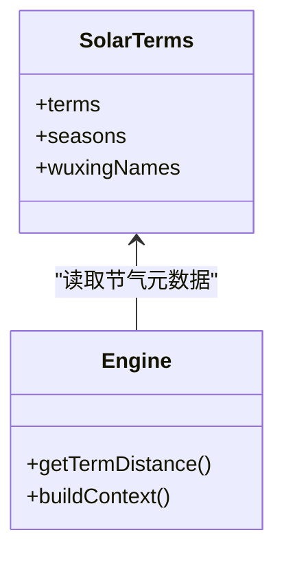
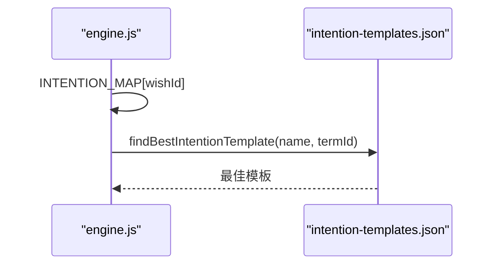
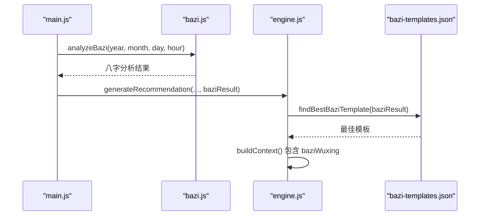
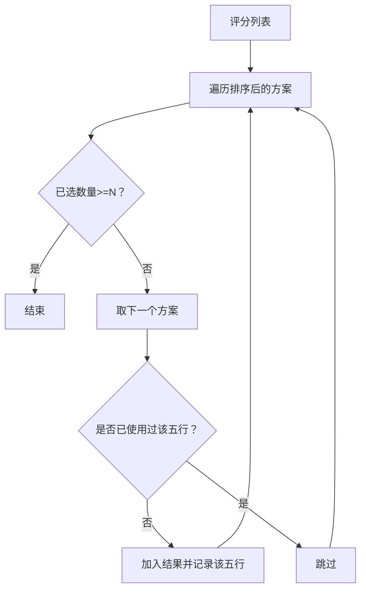
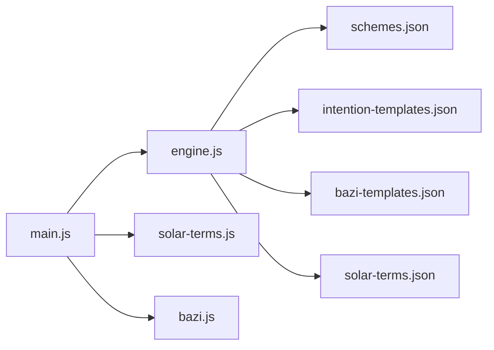

# 推荐引擎模块 (engine.js)

<cite>
**本文引用的文件**
- [engine.js](file://js/engine.js)
- [schemes.json](file://data/schemes.json)
- [intention-templates.json](file://data/intention-templates.json)
- [bazi-templates.json](file://data/bazi-templates.json)
- [solar-terms.json](file://data/solar-terms.json)
- [main.js](file://js/main.js)
- [bazi.js](file://js/bazi.js)
- [solar-terms.js](file://js/solar-terms.js)
</cite>

## 目录
1. [简介](#简介)
2. [项目结构](#项目结构)
3. [核心组件](#核心组件)
4. [架构总览](#架构总览)
5. [详细组件分析](#详细组件分析)
6. [依赖关系分析](#依赖关系分析)
7. [性能考量](#性能考量)
8. [故障排查指南](#故障排查指南)
9. [结论](#结论)
10. [附录](#附录)

## 简介
本技术文档聚焦于推荐引擎模块（engine.js），系统阐述 generateRecommendation() 与 regenerateRecommendation() 的核心算法实现，深入解析“五行相生相克”理论在穿搭推荐中的应用方式，包括权重计算、评分机制与筛选逻辑；同时说明节气因素、心愿偏好、八字命理对推荐结果的影响程度与计算方法，并给出多样性保证机制、参数调优策略、性能优化建议与质量评估方法，最后提供算法扩展与自定义规则的实现指导。

## 项目结构
推荐引擎位于前端模块化架构中，与节气识别、八字计算、渲染与存储模块协同工作：
- 引擎模块：负责加载方案数据、构建上下文、评分与选择方案、生成/重新生成推荐。
- 数据资源：方案库、心愿模板、八字模板、节气元数据。
- 应用入口：负责收集用户输入（心愿、八字）、调用引擎、渲染结果。
- 辅助模块：节气识别、八字计算。

图表来源
- [engine.js](file://js/engine.js#L268-L334)
- [main.js](file://js/main.js#L202-L269)
- [solar-terms.js](file://js/solar-terms.js#L36-L103)
- [bazi.js](file://js/bazi.js#L182-L192)

章节来源
- [engine.js](file://js/engine.js#L1-L335)
- [main.js](file://js/main.js#L1-L317)

## 核心组件
- generateRecommendation(termInfo, wishId, baziResult)
  - 异步加载方案、心愿模板、八字模板
  - 构建推荐上下文（节气、心愿、八字权重）
  - 选择并返回前 N 套方案，附加模板建议
- regenerateRecommendation(termInfo, wishId, baziResult, excludeIds)
  - 在排除已选方案 ID 的前提下重新生成推荐
- 上下文构建与评分
  - buildContext()：设置节气、心愿、八字的五行属性与权重
  - scoreScheme()：依据“相生/相同”给予不同分数
  - selectSchemes()：优先节气相关方案，不足时按得分排序并保证多样性
- 五行相生关系
  - isGenerating(from, to)：判断是否相生
- 节气与心愿模板匹配
  - getTermDistance()：计算节气循环距离
  - findBestIntentionTemplate()：按节气距离最近匹配心愿模板
  - findBestBaziTemplate()：按“日主某元素旺”与年份匹配八字模板

章节来源
- [engine.js](file://js/engine.js#L268-L334)
- [engine.js](file://js/engine.js#L157-L173)
- [engine.js](file://js/engine.js#L178-L199)
- [engine.js](file://js/engine.js#L218-L259)
- [engine.js](file://js/engine.js#L204-L213)
- [engine.js](file://js/engine.js#L84-L99)
- [engine.js](file://js/engine.js#L104-L119)
- [engine.js](file://js/engine.js#L124-L152)

## 架构总览
推荐流程从应用入口开始，采集节气、心愿与八字信息，调用引擎生成推荐；引擎内部加载数据、构建上下文、评分与筛选，最终返回结果给渲染层。

图表来源
- [main.js](file://js/main.js#L202-L244)
- [solar-terms.js](file://js/solar-terms.js#L36-L103)
- [bazi.js](file://js/bazi.js#L182-L192)
- [engine.js](file://js/engine.js#L268-L310)

## 详细组件分析

### generateRecommendation() 核心算法
- 数据加载
  - 并行加载方案、心愿模板、八字模板，避免串行阻塞
- 上下文构建
  - 节气权重：0.5
  - 心愿权重：0.3
  - 八字权重：0.2
  - 从当前节气获取 wuxing，从八字结果提取 recommend.recommend 作为推荐五行
- 方案选择
  - 优先筛选与当前节气相同的方案
  - 若不足数量，则按 scoreScheme() 打分排序
  - 保证五行多样性：前两个方案允许重复，之后要求不同五行
  - 不足时补充高分方案
- 模板匹配
  - 心愿模板：按节气距离最近匹配
  - 八字模板：按“日主某元素旺”与年份匹配

图表来源
- [engine.js](file://js/engine.js#L268-L310)
- [engine.js](file://js/engine.js#L157-L173)
- [engine.js](file://js/engine.js#L218-L259)
- [engine.js](file://js/engine.js#L178-L199)
- [engine.js](file://js/engine.js#L104-L119)
- [engine.js](file://js/engine.js#L124-L152)

章节来源
- [engine.js](file://js/engine.js#L268-L310)

### regenerateRecommendation() 算法
- 输入：当前节气、心愿、八字、已选方案 ID 列表
- 步骤：
  - 过滤掉 excludeIds 对应的方案
  - 使用相同上下文与评分策略重新选择
  - 返回新的推荐结果

图表来源
- [engine.js](file://js/engine.js#L315-L334)

章节来源
- [engine.js](file://js/engine.js#L315-L334)

### 五行相生相克在推荐中的应用
- 相生关系
  - 木生火、火生土、土生金、金生水、水生木
  - 当方案五行与上下文（节气/八字）一致时，获得满分权重
  - 当方案五行被上下文所生（相生）时，获得较低权重
- 评分机制
  - 节气影响权重：0.5
  - 八字影响权重：0.2
  - 心愿模板权重：0.3（在模板匹配阶段体现，非直接参与方案打分）
- 筛选逻辑
  - 优先选择与当前节气相同的方案
  - 若数量不足，按得分排序
  - 保证五行多样性，避免重复

图表来源
- [engine.js](file://js/engine.js#L204-L213)
- [engine.js](file://js/engine.js#L178-L199)

章节来源
- [engine.js](file://js/engine.js#L204-L213)
- [engine.js](file://js/engine.js#L178-L199)

### 节气因素对推荐的影响
- 节气元数据包含每个节气的 wuxing 与月份范围
- 引擎通过当前节气的 wuxing 作为主要匹配目标
- 节气距离计算采用循环序列，确保跨年边界正确
- 季节信息用于辅助展示与理解

图表来源
- [solar-terms.json](file://data/solar-terms.json#L1-L42)
- [engine.js](file://js/engine.js#L84-L99)
- [engine.js](file://js/engine.js#L157-L173)

章节来源
- [solar-terms.json](file://data/solar-terms.json#L1-L42)
- [engine.js](file://js/engine.js#L84-L99)
- [engine.js](file://js/engine.js#L157-L173)

### 心愿偏好对推荐的影响
- 心愿 ID 映射到心愿名称
- 引擎按当前节气与心愿名称匹配最佳模板
- 模板提供颜色、材质、触感等建议，用于丰富推荐描述
- 心愿权重参与上下文构建，但模板匹配独立于方案打分

图表来源
- [engine.js](file://js/engine.js#L10-L16)
- [engine.js](file://js/engine.js#L104-L119)
- [intention-templates.json](file://data/intention-templates.json#L1-L253)

章节来源
- [engine.js](file://js/engine.js#L10-L16)
- [engine.js](file://js/engine.js#L104-L119)
- [intention-templates.json](file://data/intention-templates.json#L1-L253)

### 八字命理对推荐的影响
- 八字计算（简化版）输出四柱与五行分布
- 推荐五行取“最弱者”，作为命理层面的补充建议
- 八字模板按“日主某元素旺”与年份匹配，提供颜色、材质、触感建议
- 引擎将命理推荐五行纳入上下文权重分配

图表来源
- [main.js](file://js/main.js#L208-L221)
- [bazi.js](file://js/bazi.js#L182-L192)
- [engine.js](file://js/engine.js#L124-L152)
- [engine.js](file://js/engine.js#L157-L173)
- [bazi-templates.json](file://data/bazi-templates.json#L1-L103)

章节来源
- [bazi.js](file://js/bazi.js#L182-L192)
- [engine.js](file://js/engine.js#L124-L152)
- [engine.js](file://js/engine.js#L157-L173)
- [bazi-templates.json](file://data/bazi-templates.json#L1-L103)

### 推荐方案多样性保证机制
- 优先节气相关方案：若满足数量，直接返回
- 否则按得分排序，前两个方案允许重复，之后去重
- 不足时补充高分方案，确保输出稳定且多样化

图表来源
- [engine.js](file://js/engine.js#L218-L259)

章节来源
- [engine.js](file://js/engine.js#L218-L259)

### 排除已选方案的逻辑
- regenerateRecommendation() 将当前结果中的方案 ID 收集为排除集合
- 重新加载方案后过滤掉这些 ID
- 再次执行 selectSchemes()，确保换一批的多样性与新鲜度

章节来源
- [engine.js](file://js/engine.js#L315-L334)
- [main.js](file://js/main.js#L252-L259)

## 依赖关系分析
- 模块耦合
  - engine.js 依赖数据资源（schemes.json、intention-templates.json、bazi-templates.json、solar-terms.json）
  - 与 main.js 的交互通过函数调用，耦合度低
  - 与 solar-terms.js、bazi.js 的交互仅限于数据结构与工具函数
- 外部依赖
  - fetch API 用于异步加载 JSON 数据
  - 本地存储用于持久化用户选择与结果

图表来源
- [engine.js](file://js/engine.js#L39-L79)
- [main.js](file://js/main.js#L202-L269)
- [solar-terms.js](file://js/solar-terms.js#L36-L103)
- [bazi.js](file://js/bazi.js#L182-L192)

章节来源
- [engine.js](file://js/engine.js#L39-L79)
- [main.js](file://js/main.js#L202-L269)

## 性能考量
- 并行加载
  - generateRecommendation() 中对三个数据源使用 Promise.all，减少等待时间
- 评分与排序
  - selectSchemes() 对所有方案进行一次 map + sort，复杂度 O(n log n)
  - 多样性保证阶段为线性扫描，整体仍为 O(n log n)
- 数据规模
  - 方案库约 500 条，模板库约 250 条，性能可接受
- 优化建议
  - 缓存已加载数据（schemes、intention、bazi）以避免重复请求
  - 对模板匹配增加索引（按 intention、solarTerm 分类）
  - 评分函数可预计算相生关系矩阵，降低运行时判断成本
  - 对大数据量场景可考虑懒加载或分页

[本节为通用性能讨论，无需特定文件来源]

## 故障排查指南
- 数据加载失败
  - 现象：控制台报错，返回 null
  - 排查：检查 data 目录路径与网络权限；确认 JSON 格式正确
- 节气识别异常
  - 现象：节气 wuxing 为空或错误
  - 排查：确认 solar-terms.json 的 terms 数组与 seasons 字段完整
- 八字模板未命中
  - 现象：baziTemplate 为空
  - 排查：确认 baziResult.recommend.recommend 有效；检查 baZiKey 与年份匹配逻辑
- 心愿模板未命中
  - 现象：intentionTemplate 为空
  - 排查：确认 wishId 映射与 intention 名称一致；检查 solarTerm 匹配

章节来源
- [engine.js](file://js/engine.js#L41-L48)
- [engine.js](file://js/engine.js#L56-L63)
- [engine.js](file://js/engine.js#L70-L78)
- [engine.js](file://js/engine.js#L104-L119)
- [engine.js](file://js/engine.js#L124-L152)

## 结论
推荐引擎模块以“五行相生相克”为核心，结合节气、心愿与八字命理，形成多维度权重评分与多样性保障的推荐流程。generateRecommendation() 提供首次推荐，regenerateRecommendation() 实现换一批功能。通过并行加载、评分排序与多样性约束，系统在可用性与可解释性之间取得平衡。后续可在缓存、索引与评分矩阵方面进一步优化，并扩展自定义规则与模板体系。

[本节为总结性内容，无需特定文件来源]

## 附录

### 算法参数调优指南
- 权重调整
  - 节气权重：当前 0.5，若希望更强调命理，可提升至 0.6
  - 八字权重：当前 0.2，若希望更强调心愿，可降至 0.1
  - 心愿模板：作为描述增强，不直接参与打分，但可影响用户感知
- 评分阈值
  - 相同：满分权重
  - 相生：低分权重
  - 其他：0 分
- 多样性阈值
  - 前 2 允许重复，第 3 个起强制去重
- 模板匹配
  - 心愿模板：按节气距离最近匹配
  - 八字模板：优先匹配当年，否则匹配任意年份

章节来源
- [engine.js](file://js/engine.js#L157-L173)
- [engine.js](file://js/engine.js#L178-L199)
- [engine.js](file://js/engine.js#L218-L259)
- [engine.js](file://js/engine.js#L104-L119)
- [engine.js](file://js/engine.js#L124-L152)

### 推荐质量评估方法
- 一致性评估
  - 检查节气相关方案占比与得分分布
- 多样性评估
  - 统计输出方案的五行分布，避免过度集中在某一元素
- 用户反馈
  - 收集用户对“颜色/材质/触感”的满意度与改进建议
- A/B 测试
  - 对权重与多样性策略进行对照实验，观察点击率与留存率变化

[本节为通用评估方法，无需特定文件来源]

### 算法扩展与自定义规则实现指导
- 新增心愿类型
  - 在 wish-templates.json 中添加心愿条目，更新 INTENTION_MAP
  - 在 intention-templates.json 中补充对应节气模板
- 自定义模板
  - 在 bazi-templates.json 中新增 baZiKey 与建议字段
  - 在 engine.js 中保持 findBestBaziTemplate() 的匹配逻辑不变
- 扩展评分维度
  - 在 scoreScheme() 中增加材质/触感偏好权重
  - 在 selectSchemes() 中扩展多样性约束（如按季节/场合）
- 数据驱动
  - 将权重与阈值抽取为配置项，便于 A/B 调参
  - 对模板匹配引入相似度评分，而非仅最近节气

章节来源
- [engine.js](file://js/engine.js#L10-L16)
- [engine.js](file://js/engine.js#L104-L119)
- [engine.js](file://js/engine.js#L124-L152)
- [engine.js](file://js/engine.js#L178-L199)
- [engine.js](file://js/engine.js#L218-L259)
- [schemes.json](file://data/schemes.json#L1-L509)
- [intention-templates.json](file://data/intention-templates.json#L1-L253)
- [bazi-templates.json](file://data/bazi-templates.json#L1-L103)