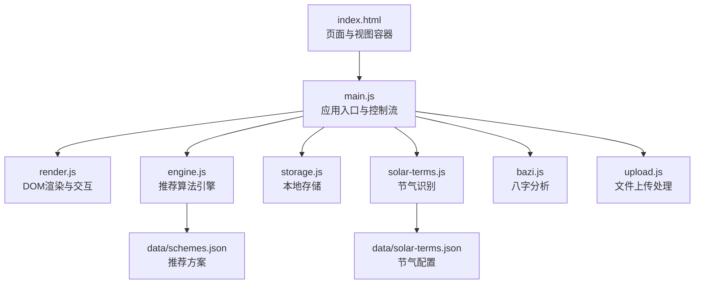
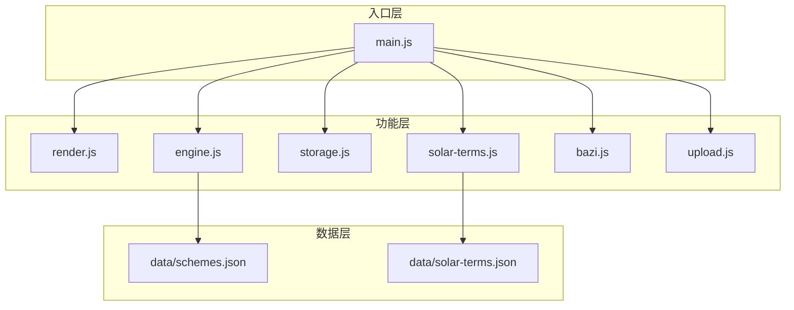
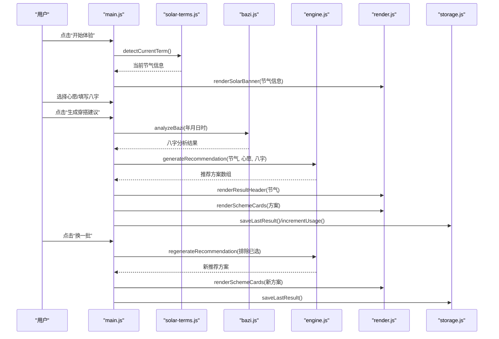
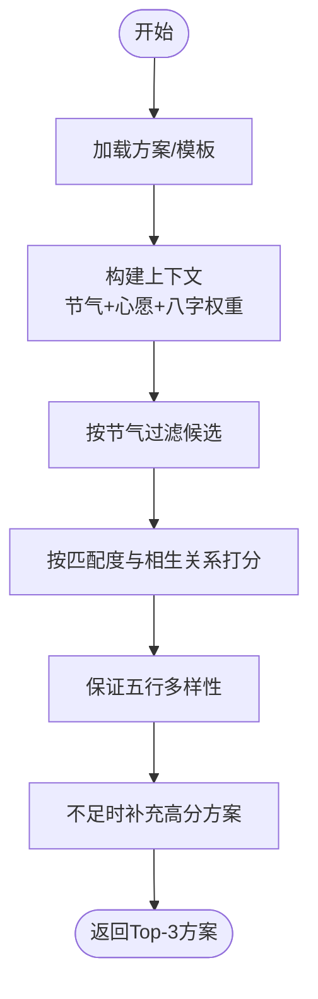
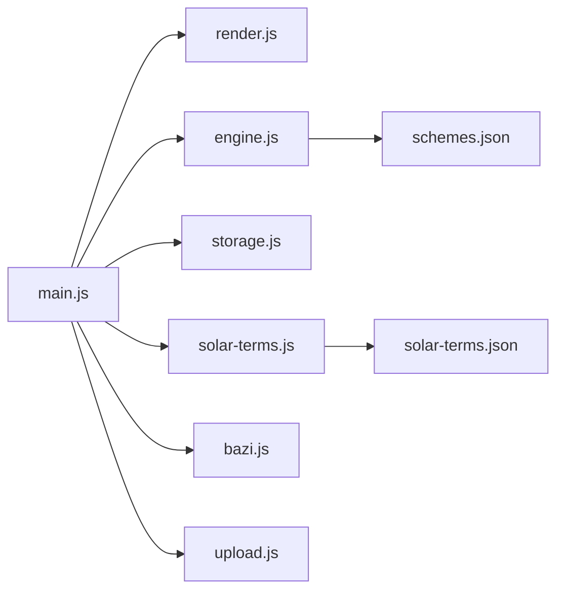

# 模块设计与职责

<cite>
**本文引用的文件列表**
- [index.html](file://index.html)
- [main.js](file://js/main.js)
- [engine.js](file://js/engine.js)
- [render.js](file://js/render.js)
- [storage.js](file://js/storage.js)
- [solar-terms.js](file://js/solar-terms.js)
- [bazi.js](file://js/bazi.js)
- [upload.js](file://js/upload.js)
- [schemes.json](file://data/schemes.json)
- [solar-terms.json](file://data/solar-terms.json)
</cite>

## 目录
1. [简介](#简介)
2. [项目结构](#项目结构)
3. [核心模块](#核心模块)
4. [架构总览](#架构总览)
5. [关键组件深度分析](#关键组件深度分析)
6. [依赖关系分析](#依赖关系分析)
7. [性能考量](#性能考量)
8. [故障排查指南](#故障排查指南)
9. [结论](#结论)
10. [附录：扩展指南与最佳实践](#附录扩展指南与最佳实践)

## 简介
本项目是一个“五行穿搭建议”应用，围绕节气与八字两大传统文化要素，为用户提供基于当前节气、个人心愿以及可选八字信息的个性化穿搭推荐。系统采用模块化设计，将应用入口、推荐引擎、UI渲染、数据持久化、节气逻辑、八字分析、文件上传等功能拆分为独立模块，明确职责边界，提升可维护性、可测试性与可扩展性。

## 项目结构
应用采用前端单页结构，HTML定义视图与交互元素，JS模块负责业务逻辑与数据流，CSS提供样式与动画，JSON数据文件承载推荐方案与节气配置。

图表来源
- [index.html](file://index.html#L1-L236)
- [main.js](file://js/main.js#L1-L317)
- [engine.js](file://js/engine.js#L1-L335)
- [render.js](file://js/render.js#L1-L272)
- [storage.js](file://js/storage.js#L1-L116)
- [solar-terms.js](file://js/solar-terms.js#L1-L118)
- [bazi.js](file://js/bazi.js#L1-L193)
- [upload.js](file://js/upload.js#L1-L145)
- [schemes.json](file://data/schemes.json#L1-L509)
- [solar-terms.json](file://data/solar-terms.json#L1-L42)

章节来源
- [index.html](file://index.html#L1-L236)
- [main.js](file://js/main.js#L1-L317)

## 核心模块
- main.js：应用入口与控制流，负责初始化、事件绑定、协调各模块协作、状态管理与视图切换。
- engine.js：推荐算法引擎，加载方案与模板、构建上下文、评分与筛选、生成/换一批推荐。
- render.js：UI渲染与交互，负责视图切换、卡片渲染、模态框、上传预览、Toast提示等。
- storage.js：本地存储封装，统一键空间、业务方法（心愿、八字、结果、反馈、用量统计）。
- solar-terms.js：节气识别与计算，加载节气数据、检测当前节气、获取节气对应五行颜色。
- bazi.js：八字分析，计算四柱、统计五行、给出推荐元素。
- upload.js：文件上传处理，验证、压缩、拖拽/键盘支持、获取今日日期字符串。

章节来源
- [main.js](file://js/main.js#L1-L317)
- [engine.js](file://js/engine.js#L1-L335)
- [render.js](file://js/render.js#L1-L272)
- [storage.js](file://js/storage.js#L1-L116)
- [solar-terms.js](file://js/solar-terms.js#L1-L118)
- [bazi.js](file://js/bazi.js#L1-L193)
- [upload.js](file://js/upload.js#L1-L145)

## 架构总览
应用采用“入口控制器 + 功能模块”的分层架构：
- 入口控制器（main.js）负责生命周期、事件路由、状态聚合与跨模块编排。
- 功能模块各自保持纯函数与最小依赖，通过导出函数进行交互。
- 数据通过JSON文件与localStorage在模块间传递，避免紧耦合。

图表来源
- [main.js](file://js/main.js#L1-L317)
- [engine.js](file://js/engine.js#L1-L335)
- [render.js](file://js/render.js#L1-L272)
- [storage.js](file://js/storage.js#L1-L116)
- [solar-terms.js](file://js/solar-terms.js#L1-L118)
- [bazi.js](file://js/bazi.js#L1-L193)
- [upload.js](file://js/upload.js#L1-L145)
- [schemes.json](file://data/schemes.json#L1-L509)
- [solar-terms.json](file://data/solar-terms.json#L1-L42)

## 关键组件深度分析

### main.js：应用入口与控制流
- 职责边界
  - 初始化：加载节气信息、初始化表单、渲染节气横幅、恢复上次选择与八字、绑定事件、初始化上传区、统计访问。
  - 事件处理：开始/返回按钮、心愿标签、生成/换一批、上传/移除图片、保存反馈、详情模态框。
  - 协调：收集八字表单、调用八字分析、调用推荐引擎、渲染结果、持久化结果与用量。
- 设计原则
  - 单一职责：入口负责编排，不直接处理复杂业务。
  - 依赖注入：通过导入各模块函数，避免硬编码。
  - 状态管理：集中管理当前节气、心愿、八字、推荐结果等。
- 数据流
  - 输入：用户交互事件、表单数据、文件。
  - 处理：调用分析/引擎/渲染/存储模块。
  - 输出：更新DOM、持久化数据、统计计数。

图表来源
- [main.js](file://js/main.js#L26-L244)
- [solar-terms.js](file://js/solar-terms.js#L36-L103)
- [bazi.js](file://js/bazi.js#L182-L192)
- [engine.js](file://js/engine.js#L268-L310)
- [render.js](file://js/render.js#L104-L127)
- [storage.js](file://js/storage.js#L60-L66)

章节来源
- [main.js](file://js/main.js#L1-L317)

### engine.js：推荐算法引擎
- 职责边界
  - 数据加载：异步加载推荐方案、心愿模板、八字模板。
  - 上下文构建：整合节气、心愿、八字信息，设置权重。
  - 评分与筛选：按节气匹配、相生关系、多样性约束打分，选择Top-N。
  - 结果组装：返回包含方案、模板、时间戳等的完整结果。
- 设计原则
  - 纯函数：评分与筛选逻辑可独立测试。
  - 可扩展：权重、模板匹配策略可配置。
  - 并行加载：Promise.all并发加载多源数据。
- 数据结构
  - 方案：包含ID、节气ID、颜色（名称/HEX/五行）、材质、感受、注解、出处。
  - 模板：心愿模板与八字模板，按节气/元素匹配。

图表来源
- [engine.js](file://js/engine.js#L268-L310)
- [engine.js](file://js/engine.js#L157-L173)
- [engine.js](file://js/engine.js#L218-L259)

章节来源
- [engine.js](file://js/engine.js#L1-L335)
- [schemes.json](file://data/schemes.json#L1-L509)
- [solar-terms.json](file://data/solar-terms.json#L1-L42)

### render.js：UI渲染与交互
- 职责边界
  - 视图切换：显示/隐藏视图容器。
  - 表单初始化：年份/日期选择器。
  - 节气横幅：名称与五行标识。
  - 结果渲染：标题、方案卡片、详情模态框。
  - 上传预览：占位/预览切换、反馈区显示。
  - 提示：Toast消息。
- 设计原则
  - 低耦合：仅操作DOM，不关心业务细节。
  - 可复用：导出函数便于main.js调用。
  - 可测试：通过模拟DOM即可测试渲染行为。

章节来源
- [render.js](file://js/render.js#L1-L272)

### storage.js：本地存储管理
- 职责边界
  - 统一封装：键前缀、序列化/反序列化、批量清理。
  - 业务方法：最近八字、最近结果、反馈、上传图片、用量统计、首次访问标记、选中心愿。
- 设计原则
  - 命名规范：统一前缀与命名空间。
  - 容错：异常捕获，失败回退。
  - 可扩展：新增业务键只需添加方法。

章节来源
- [storage.js](file://js/storage.js#L1-L116)

### solar-terms.js：节气逻辑
- 职责边界
  - UTC+8时间转换。
  - 节气数据加载与缓存。
  - 当前节气检测：基于月份/日期范围，回退默认值。
  - 季节信息与五行名称映射。
  - 五行颜色查询。
- 设计原则
  - 纯函数：输入输出确定性。
  - 缓存：避免重复请求。
  - 容错：数据缺失时提供默认值。

章节来源
- [solar-terms.js](file://js/solar-terms.js#L1-L118)
- [solar-terms.json](file://data/solar-terms.json#L1-L42)

### bazi.js：八字分析
- 职责边界
  - 计算四柱：年/月/日/时柱（简化版）。
  - 五行统计：天干地支分别统计，合并计数。
  - 推荐元素：最弱五行推荐补充，最强五行建议适度泄之。
  - 分析文本：生成简要分析文案。
- 设计原则
  - 模块化：计算、统计、推荐分离。
  - 可读性：清晰的映射与注释。
  - 可测试：导出纯函数，便于单元测试。

章节来源
- [bazi.js](file://js/bazi.js#L1-L193)

### upload.js：文件处理
- 职责边界
  - 文件验证：类型、大小。
  - 图片压缩：Canvas缩放与质量迭代压缩至目标大小。
  - 上传区：点击/键盘/拖拽支持，回调驱动。
  - 工具：获取今日日期字符串。
- 设计原则
  - 异步：压缩使用Promise。
  - 可靠：错误处理与回退。
  - 可用性：多交互方式。

章节来源
- [upload.js](file://js/upload.js#L1-L145)

## 依赖关系分析
- 模块间依赖
  - main.js 导入并协调 render、engine、storage、solar-terms、bazi、upload。
  - engine.js 依赖 data/schemes.json 与 data/solar-terms.json（通过fetch加载）。
  - solar-terms.js 依赖 data/solar-terms.json。
  - bazi.js 为纯计算模块，无外部依赖。
  - render.js 与 upload.js 依赖 DOM API。
  - storage.js 依赖浏览器 localStorage。
- 耦合与内聚
  - 耦合：main.js 与各模块存在调用耦合，但均为单向调用，无循环依赖。
  - 内聚：各模块内部职责单一，函数粒度清晰。
- 外部依赖
  - fetch：加载JSON数据。
  - localStorage：本地持久化。
  - Canvas/FileReader：图片压缩与预览。

图表来源
- [main.js](file://js/main.js#L5-L15)
- [engine.js](file://js/engine.js#L42-L79)
- [solar-terms.js](file://js/solar-terms.js#L21-L29)

章节来源
- [main.js](file://js/main.js#L1-L317)
- [engine.js](file://js/engine.js#L1-L335)
- [solar-terms.js](file://js/solar-terms.js#L1-L118)

## 性能考量
- 数据加载
  - engine.js 使用 Promise.all 并行加载方案与模板，减少等待时间。
  - solar-terms.js 对节气数据进行缓存，避免重复请求。
- 渲染优化
  - render.js 的卡片渲染使用一次性innerHTML拼接，减少多次DOM操作。
  - 动画延迟按索引递增，营造有序入场效果。
- 上传与压缩
  - upload.js 先缩放再压缩，逐步降低质量，兼顾体积与清晰度。
- 存储
  - storage.js 使用统一前缀与JSON序列化，避免键冲突与解析错误。

[本节为通用性能讨论，无需特定文件引用]

## 故障排查指南
- 推荐为空
  - 检查节气数据是否加载成功（网络/路径）。
  - 确认方案数据格式正确且包含schemes字段。
- 节气显示异常
  - 核对当前日期与节气范围，确认默认回退逻辑生效。
- 八字分析异常
  - 检查输入年月日时是否有效，确保计算函数正常执行。
- 上传失败
  - 检查文件类型与大小限制，确认Canvas绘制与toDataURL可用。
- 本地存储异常
  - 检查浏览器localStorage可用性与容量限制，确认键前缀一致。

章节来源
- [engine.js](file://js/engine.js#L270-L279)
- [solar-terms.js](file://js/solar-terms.js#L36-L103)
- [bazi.js](file://js/bazi.js#L182-L192)
- [upload.js](file://js/upload.js#L12-L26)
- [storage.js](file://js/storage.js#L7-L23)

## 结论
本项目通过模块化设计实现了清晰的职责划分与稳定的依赖关系。入口控制器统一编排，功能模块各司其职，数据与UI分离，既提升了可维护性与可测试性，也为后续扩展（如增加更多模板、支持更多心愿、接入更多数据源）提供了良好基础。

[本节为总结性内容，无需特定文件引用]

## 附录：扩展指南与最佳实践

### 扩展指南
- 新增推荐模板
  - 在 data 目录新增模板JSON，engine.js 中相应加载与匹配逻辑。
  - 注意模板字段与现有结构保持一致。
- 支持更多心愿
  - 在 main.js 中扩展心愿标签与映射，确保 INTENTION_MAP 与模板匹配逻辑兼容。
- 增强八字分析
  - 在 bazi.js 中完善计算细节（如考虑节气边界、更精细的时区处理），保持对外接口稳定。
- 上传能力增强
  - 在 upload.js 中增加更多格式支持或压缩参数调整，注意用户体验与性能平衡。
- UI扩展
  - 在 render.js 中新增渲染函数，遵循现有命名与DOM约定。

### 最佳实践
- 保持模块纯函数化：尽量将业务逻辑抽离为纯函数，便于测试与复用。
- 明确接口契约：模块间通过函数签名传递数据，避免共享可变状态。
- 统一错误处理：在入口层集中处理错误与回退，保证用户体验一致性。
- 数据版本化：对JSON数据增加版本号或校验，避免结构变更导致的运行时错误。
- 性能监控：对关键流程（加载、压缩、渲染）埋点，持续优化。

[本节为通用指导，无需特定文件引用]