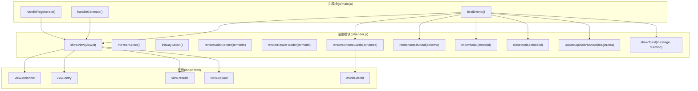
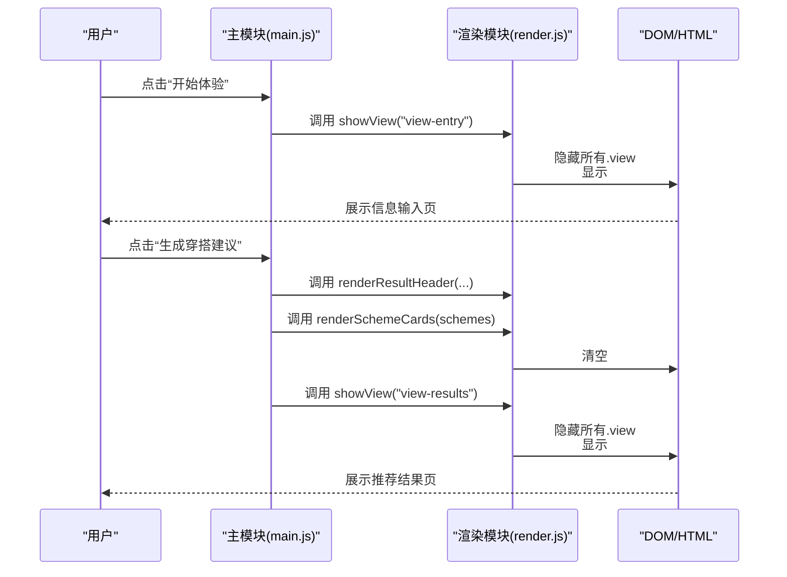
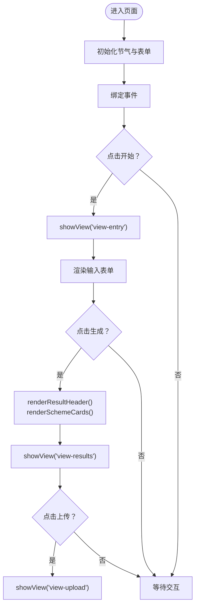
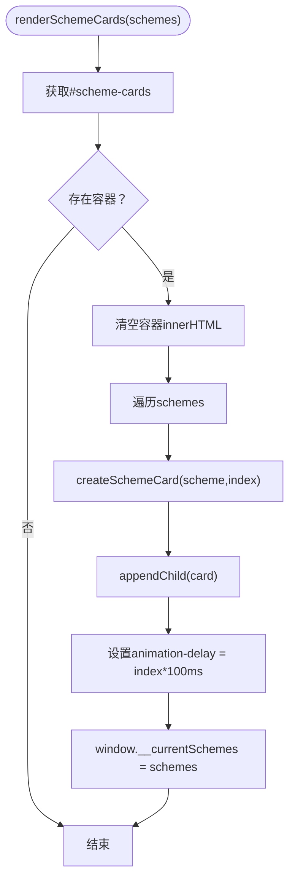
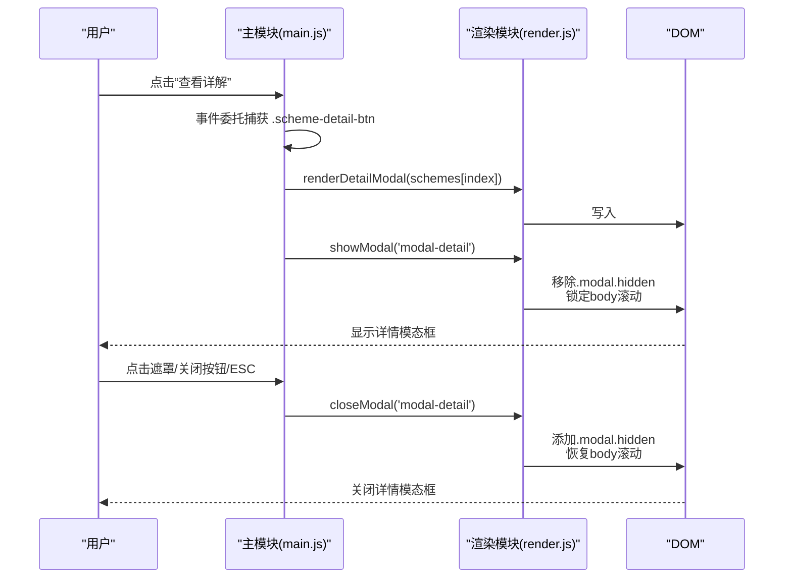
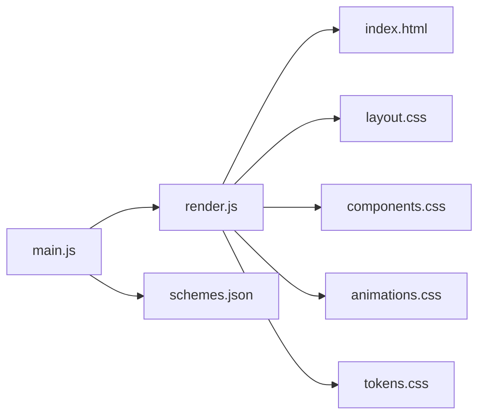

# 渲染模块 (render.js)

<cite>
**本文引用的文件列表**
- [render.js](file://js/render.js)
- [main.js](file://js/main.js)
- [index.html](file://index.html)
- [base.css](file://css/base.css)
- [layout.css](file://css/layout.css)
- [components.css](file://css/components.css)
- [animations.css](file://css/animations.css)
- [tokens.css](file://css/tokens.css)
- [schemes.json](file://data/schemes.json)
</cite>

## 目录
1. [简介](#简介)
2. [项目结构](#项目结构)
3. [核心组件](#核心组件)
4. [架构总览](#架构总览)
5. [详细组件分析](#详细组件分析)
6. [依赖关系分析](#依赖关系分析)
7. [性能考量](#性能考量)
8. [故障排查指南](#故障排查指南)
9. [结论](#结论)
10. [附录](#附录)

## 简介
本文件为渲染模块的技术文档，聚焦于视图管理系统、页面布局与响应式设计、UI 组件渲染函数（如渲染方案卡片、详情模态框等）、用户交互处理（事件委托、模态框管理、动画控制）、CSS 类名与样式状态切换逻辑，并提供组件复用策略、性能优化技巧与跨浏览器兼容性处理建议，以及自定义组件开发与样式扩展的最佳实践。

## 项目结构
渲染模块位于 js/render.js，负责：
- 视图切换：通过隐藏/显示具有统一类名的视图容器实现
- 表单初始化：年份、日期下拉框的动态生成
- 节气横幅与结果页标题渲染：根据当前节气信息更新文案与样式
- 方案卡片渲染：批量生成卡片并保存当前方案集合以供详情模态框使用
- 详情模态框渲染：按方案对象渲染详细信息
- 模态框显示/隐藏：控制遮罩层与内容区的可见性，并处理滚动锁定
- 上传预览更新：根据图片数据切换占位与预览状态
- Toast 提示：动态创建并自动消失的消息提示
- 五行颜色映射：根据五行动态设置元素背景与文字颜色

图表来源
- [render.js](file://js/render.js#L8-L16)
- [render.js](file://js/render.js#L21-L35)
- [render.js](file://js/render.js#L40-L50)
- [render.js](file://js/render.js#L55-L71)
- [render.js](file://js/render.js#L104-L109)
- [render.js](file://js/render.js#L114-L127)
- [render.js](file://js/render.js#L159-L193)
- [render.js](file://js/render.js#L198-L215)
- [render.js](file://js/render.js#L220-L237)
- [render.js](file://js/render.js#L242-L271)
- [main.js](file://js/main.js#L72-L153)
- [main.js](file://js/main.js#L202-L244)
- [main.js](file://js/main.js#L249-L269)
- [index.html](file://index.html#L24-L36)
- [index.html](file://index.html#L39-L125)
- [index.html](file://index.html#L127-L155)
- [index.html](file://index.html#L157-L196)
- [index.html](file://index.html#L199-L214)

章节来源
- [render.js](file://js/render.js#L1-L272)
- [main.js](file://js/main.js#L1-L317)
- [index.html](file://index.html#L1-L236)

## 核心组件
- 视图切换 showView(viewId)
  - 功能：隐藏所有视图容器，显示目标视图
  - 实现要点：遍历所有视图节点添加隐藏类，再为目标视图移除隐藏类
  - 适用场景：从欢迎页跳转到信息输入页、从结果页跳转到上传页等
- 年份/日期选择器初始化 initYearSelect()/initDaySelect()
  - 功能：动态生成年份/日期选项
  - 实现要点：计算起止范围，循环创建 option 并追加到 select
- 节气横幅渲染 renderSolarBanner(termInfo)
  - 功能：更新节气名称与五行元素标签的文本与样式
  - 实现要点：根据五行动态设置背景色与文字色
- 结果页标题渲染 renderResultHeader(termInfo)
  - 功能：展示当前节气与五行名称
- 方案卡片渲染 renderSchemeCards(schemes)
  - 功能：批量渲染方案卡片，支持动画延迟与全局保存当前方案集合
  - 实现要点：清空容器、逐项创建卡片、设置动画延迟、保存到全局变量
- 详情模态框渲染 renderDetailModal(scheme)
  - 功能：按方案对象渲染详细信息（色彩、材质、感受、五行解读、典籍出处）
- 模态框管理 showModal()/closeModal()
  - 功能：显示/隐藏模态框并处理 body 滚动锁定
- 上传预览更新 updateUploadPreview(imageData)
  - 功能：根据图片数据切换占位与预览状态，并显示反馈区域
- Toast 提示 showToast(message, duration)
  - 功能：动态创建并自动消失的提示消息

章节来源
- [render.js](file://js/render.js#L8-L16)
- [render.js](file://js/render.js#L21-L35)
- [render.js](file://js/render.js#L40-L50)
- [render.js](file://js/render.js#L55-L71)
- [render.js](file://js/render.js#L104-L109)
- [render.js](file://js/render.js#L114-L127)
- [render.js](file://js/render.js#L159-L193)
- [render.js](file://js/render.js#L198-L215)
- [render.js](file://js/render.js#L220-L237)
- [render.js](file://js/render.js#L242-L271)

## 架构总览
渲染模块与主模块协同工作：
- 主模块负责业务流程与事件绑定，渲染模块负责 UI 的具体呈现
- 视图切换由渲染模块统一管理，主模块通过调用渲染函数完成页面导航
- 详情模态框通过事件委托触发，渲染模块负责填充内容与显示

图表来源
- [main.js](file://js/main.js#L72-L100)
- [main.js](file://js/main.js#L202-L244)
- [render.js](file://js/render.js#L8-L16)
- [render.js](file://js/render.js#L104-L109)
- [render.js](file://js/render.js#L114-L127)

## 详细组件分析

### 视图管理系统与页面布局
- 视图容器与切换
  - 所有视图容器均带有统一类名，初始默认隐藏，通过切换类名实现显示/隐藏
  - 切换逻辑简单可靠，避免复杂的状态机
- 页面布局与响应式
  - 布局采用弹性列与网格组合，移动端优先，桌面端增强
  - 使用 CSS 变量与断点，适配不同屏幕尺寸
- 样式状态切换
  - 通过隐藏类与可见性类实现状态切换，避免直接操作 display 的副作用

图表来源
- [index.html](file://index.html#L24-L36)
- [index.html](file://index.html#L39-L125)
- [index.html](file://index.html#L127-L155)
- [index.html](file://index.html#L157-L196)
- [render.js](file://js/render.js#L8-L16)
- [render.js](file://js/render.js#L104-L109)
- [render.js](file://js/render.js#L114-L127)
- [main.js](file://js/main.js#L72-L100)
- [main.js](file://js/main.js#L202-L244)

章节来源
- [index.html](file://index.html#L24-L36)
- [index.html](file://index.html#L39-L125)
- [index.html](file://index.html#L127-L155)
- [index.html](file://index.html#L157-L196)
- [layout.css](file://css/layout.css#L12-L22)
- [base.css](file://css/base.css#L153-L155)

### UI 组件渲染函数

#### renderSchemeCards(schemes)
- 参数设计
  - schemes: 数组，每个元素包含颜色、材质、感受、注解、出处等字段
- 实现原理
  - 清空容器，逐项创建卡片元素，设置动画延迟，最后保存到全局供详情模态框使用
- 性能与可维护性
  - 单次清空+批量插入，减少多次 DOM 操作
  - 全局保存当前方案集合，避免重复查询

图表来源
- [render.js](file://js/render.js#L114-L127)
- [render.js](file://js/render.js#L132-L154)

章节来源
- [render.js](file://js/render.js#L114-L127)
- [render.js](file://js/render.js#L132-L154)

#### renderDetailModal(scheme)
- 参数设计
  - scheme: 对象，包含颜色、材质、感受、注解、出处等字段
- 实现原理
  - 将方案信息格式化为 HTML 片段，写入模态框主体
- 注意事项
  - 依赖全局保存的方案集合进行索引定位，确保数据一致性

章节来源
- [render.js](file://js/render.js#L159-L193)

#### showModal()/closeModal()
- 功能
  - 显示/隐藏模态框，同时锁定/恢复 body 滚动
- 交互细节
  - 支持点击遮罩层、点击关闭按钮、按 ESC 键关闭

章节来源
- [render.js](file://js/render.js#L198-L215)
- [main.js](file://js/main.js#L138-L152)

#### updateUploadPreview(imageData)
- 功能
  - 根据图片数据切换占位与预览状态，并显示反馈区域
- 适用场景
  - 上传成功后即时反馈，提升用户体验

章节来源
- [render.js](file://js/render.js#L220-L237)

#### showToast(message, duration)
- 功能
  - 动态创建 Toast，自动定时消失
- 设计要点
  - 避免重复创建多个 Toast，先移除旧的再创建新的

章节来源
- [render.js](file://js/render.js#L242-L271)

### 用户交互处理机制

#### 事件委托与模态框管理
- 事件委托
  - 在容器上监听按钮点击，通过 closest() 精确识别目标按钮
- 模态框管理
  - 渲染详情内容后显示模态框；支持多种关闭方式

图表来源
- [main.js](file://js/main.js#L125-L152)
- [render.js](file://js/render.js#L159-L193)
- [render.js](file://js/render.js#L198-L215)

章节来源
- [main.js](file://js/main.js#L125-L152)
- [render.js](file://js/render.js#L159-L193)
- [render.js](file://js/render.js#L198-L215)

#### 动画效果控制
- 视图切换动画
  - 通过 CSS 动画类实现淡入效果
- 卡片入场动画
  - 通过 nth-child 的延迟实现错峰入场
- 模态框动画
  - 遮罩层淡入，内容区缩放淡入
- 减少运动模式
  - 通过媒体查询降低动画时长与次数

章节来源
- [animations.css](file://css/animations.css#L96-L124)
- [animations.css](file://css/animations.css#L198-L206)

### CSS 类名管理与样式状态切换
- 隐藏类 .hidden
  - 通过添加/移除类名控制显示/隐藏
- 可见性类 .invisible
  - 控制可见性但保留布局空间
- 按钮与标签的激活状态
  - 通过 active 类实现选中态样式
- 模态框与上传区域的交互态
  - 通过 dragover 类实现拖拽高亮

章节来源
- [base.css](file://css/base.css#L153-L159)
- [components.css](file://css/components.css#L83-L87)
- [components.css](file://css/components.css#L177-L180)
- [components.css](file://css/components.css#L241-L243)

## 依赖关系分析
- 渲染模块依赖
  - DOM 查询与操作：视图容器、模态框、表单控件
  - CSS 类名与样式：隐藏类、动画类、组件样式
  - 数据：方案集合（全局保存）、节气信息
- 主模块依赖
  - 渲染模块导出的函数作为 UI 层接口
  - 存储模块、引擎模块、上传模块等提供数据与行为

图表来源
- [main.js](file://js/main.js#L9-L14)
- [render.js](file://js/render.js#L1-L272)
- [index.html](file://index.html#L1-L236)
- [layout.css](file://css/layout.css#L1-L252)
- [components.css](file://css/components.css#L1-L338)
- [animations.css](file://css/animations.css#L1-L207)
- [tokens.css](file://css/tokens.css#L1-L109)
- [schemes.json](file://data/schemes.json#L1-L509)

章节来源
- [main.js](file://js/main.js#L9-L14)
- [render.js](file://js/render.js#L1-L272)

## 性能考量
- DOM 操作优化
  - 批量插入：renderSchemeCards 一次性清空并插入，减少回流
  - 事件委托：在容器上监听，避免为每个按钮单独绑定
- 动画与过渡
  - 使用 transform/opacity 等可合成属性，避免触发布局与绘制
  - 通过媒体查询为减少运动模式提供降级
- 资源加载
  - 图片压缩与本地存储，减少网络请求与服务器压力
- 可访问性
  - 使用语义化标签与 aria 属性，确保键盘可达与屏幕阅读器友好

[本节为通用性能建议，无需特定文件引用]

## 故障排查指南
- 视图无法切换
  - 检查目标视图 ID 是否正确，确认容器是否带有 .view 类
  - 章节来源
    - [render.js](file://js/render.js#L8-L16)
    - [index.html](file://index.html#L24-L36)
- 卡片不显示或不出现动画
  - 确认容器存在且已清空，检查动画延迟是否生效
  - 章节来源
    - [render.js](file://js/render.js#L114-L127)
    - [animations.css](file://css/animations.css#L100-L115)
- 模态框无法关闭
  - 检查事件绑定与 ESC 键监听，确认类名切换逻辑
  - 章节来源
    - [main.js](file://js/main.js#L138-L152)
    - [render.js](file://js/render.js#L198-L215)
- 上传预览不更新
  - 检查 imageData 是否为空，确认占位与预览元素是否存在
  - 章节来源
    - [render.js](file://js/render.js#L220-L237)
- Toast 不消失
  - 检查定时器与透明度过渡，确认只保留一个 Toast
  - 章节来源
    - [render.js](file://js/render.js#L242-L271)

## 结论
渲染模块通过简洁的视图切换与组件化渲染函数，实现了清晰的页面导航与丰富的交互体验。配合完善的事件委托、模态框管理与动画控制，整体用户体验流畅。建议在后续迭代中进一步抽象公共渲染逻辑、引入虚拟滚动以提升大量卡片场景的性能，并持续优化无障碍与跨浏览器兼容性。

## 附录

### 自定义组件开发与样式扩展最佳实践
- 组件化原则
  - 将 UI 片段封装为独立函数，明确输入参数与输出结构
  - 使用统一的数据模型，便于复用与测试
- 样式组织
  - 以组件维度组织样式，避免全局污染
  - 使用 CSS 变量与命名空间，便于主题定制
- 动画与交互
  - 优先使用 transform/opacity，减少布局抖动
  - 提供减少运动模式支持，尊重用户偏好
- 可访问性
  - 为交互元素提供 aria 属性与键盘支持
  - 使用语义化标签与合理的焦点顺序

[本节为通用实践建议，无需特定文件引用]