# 节气处理模块 (solar-terms.js) 技术文档

<cite>
**本文档引用的文件**
- [solar-terms.js](file://js/solar-terms.js)
- [solar-terms.json](file://data/solar-terms.json)
- [engine.js](file://js/engine.js)
- [main.js](file://js/main.js)
- [render.js](file://js/render.js)
- [schemes.json](file://data/schemes.json)
- [intention-templates.json](file://data/intention-templates.json)
- [bazi-templates.json](file://data/bazi-templates.json)
</cite>

## 目录
1. [简介](#简介)
2. [项目结构](#项目结构)
3. [核心组件](#核心组件)
4. [架构概览](#架构概览)
5. [详细组件分析](#详细组件分析)
6. [依赖关系分析](#依赖关系分析)
7. [性能考虑](#性能考虑)
8. [故障排除指南](#故障排除指南)
9. [结论](#结论)
10. [附录](#附录)

## 简介

节气处理模块是"五行时尚"应用的核心功能模块之一，负责实现中国传统二十四节气的智能识别与处理。该模块基于中国传统的阴阳五行理论，结合现代JavaScript技术，实现了精确的节气检测算法、五行属性映射机制以及节气对穿搭推荐的影响计算。

该模块的主要功能包括：
- 基于UTC+8时区的精确日期计算
- 节气边界判断与当前节气识别
- 五行属性映射与颜色系统
- 节气数据结构设计与管理
- 节气对穿搭推荐的影响机制
- 权重计算与推荐算法

## 项目结构

节气处理模块在项目中的组织结构如下：

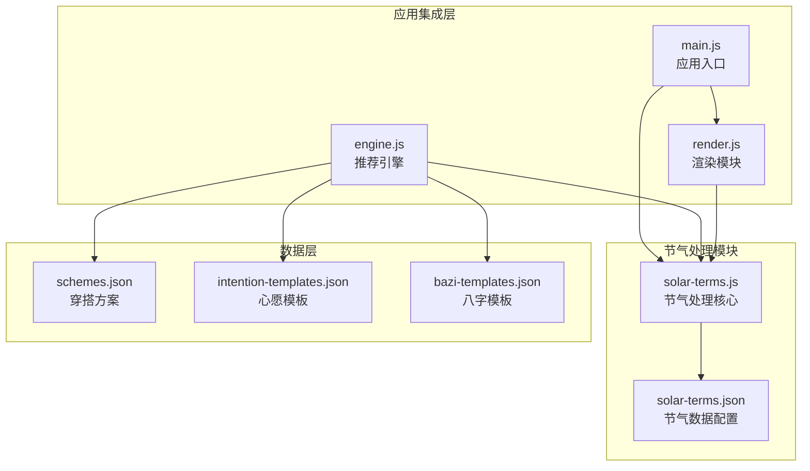

**图表来源**
- [solar-terms.js](file://js/solar-terms.js#L1-L118)
- [solar-terms.json](file://data/solar-terms.json#L1-L42)
- [main.js](file://js/main.js#L1-L317)
- [engine.js](file://js/engine.js#L1-L335)

**章节来源**
- [solar-terms.js](file://js/solar-terms.js#L1-L118)
- [solar-terms.json](file://data/solar-terms.json#L1-L42)

## 核心组件

### 节气数据管理组件

节气数据管理组件负责节气数据的加载、存储和访问控制：

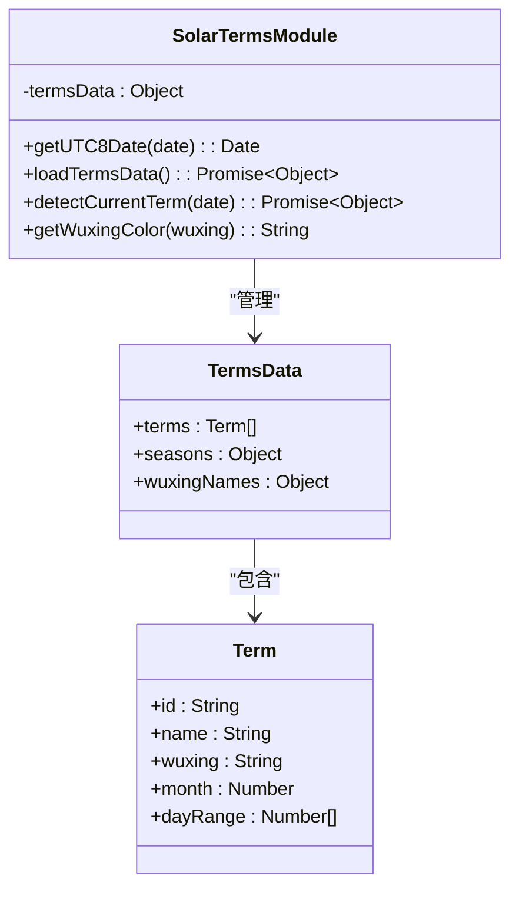

**图表来源**
- [solar-terms.js](file://js/solar-terms.js#L5-L118)
- [solar-terms.json](file://data/solar-terms.json#L2-L41)

### 五行属性映射系统

五行属性映射系统实现了节气与五行元素的精确对应关系：

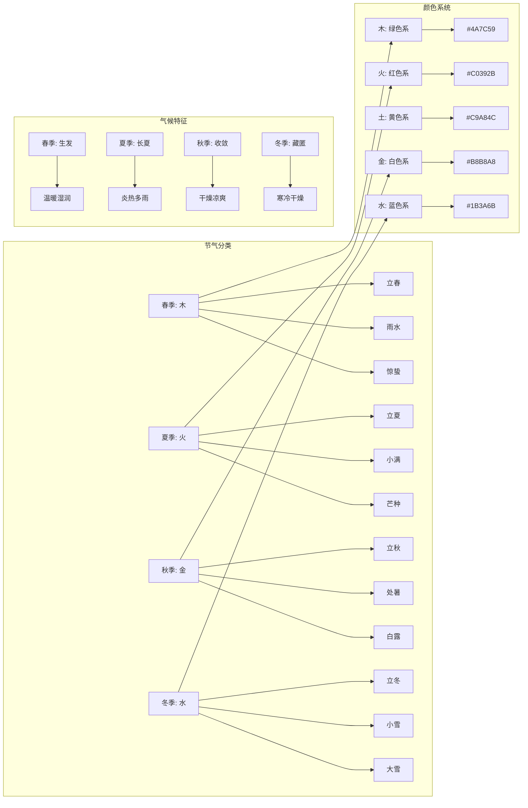

**图表来源**
- [solar-terms.json](file://data/solar-terms.json#L28-L40)

**章节来源**
- [solar-terms.js](file://js/solar-terms.js#L108-L117)
- [solar-terms.json](file://data/solar-terms.json#L28-L40)

## 架构概览

节气处理模块采用模块化架构设计，与其他系统组件形成清晰的职责分离：

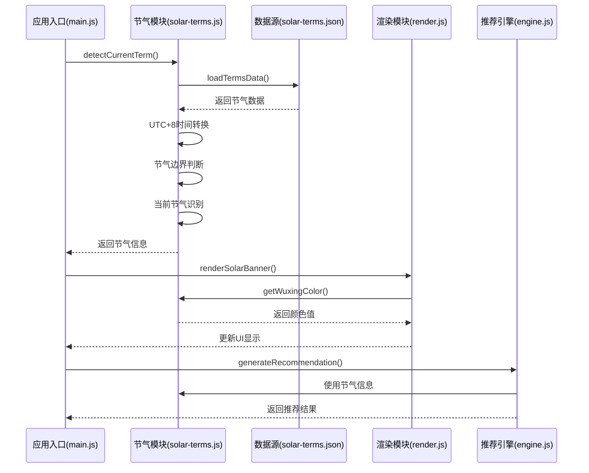

**图表来源**
- [main.js](file://js/main.js#L26-L67)
- [solar-terms.js](file://js/solar-terms.js#L36-L103)
- [render.js](file://js/render.js#L55-L71)
- [engine.js](file://js/engine.js#L268-L310)

## 详细组件分析

### 节气检测算法实现

节气检测算法是模块的核心功能，其实现原理如下：

#### 时间计算与转换

算法首先进行UTC+8时区的时间转换，确保节气计算的准确性：

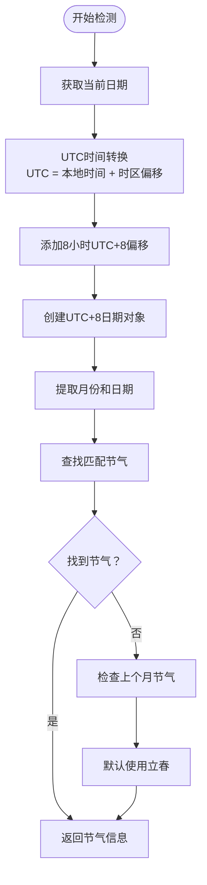

**图表来源**
- [solar-terms.js](file://js/solar-terms.js#L10-L13)
- [solar-terms.js](file://js/solar-terms.js#L36-L77)

#### 节气边界判断逻辑

节气边界判断采用精确的日期范围匹配算法：

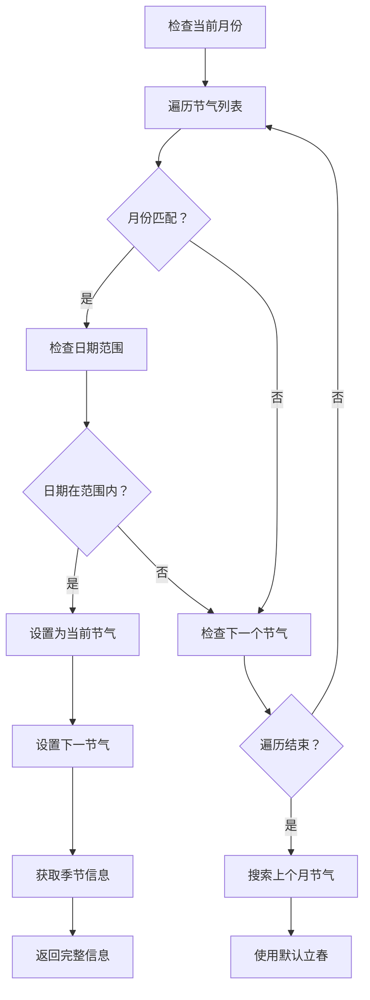

**图表来源**
- [solar-terms.js](file://js/solar-terms.js#L47-L77)

**章节来源**
- [solar-terms.js](file://js/solar-terms.js#L36-L103)

### 五行属性映射机制

五行属性映射机制实现了节气与五行元素的精确对应关系：

#### 五行与颜色的对应关系

| 五行 | 中文名称 | 颜色代码 | 主要色调 |
|------|----------|----------|----------|
| wood | 木 | #4A7C59 | 绿色系，嫩绿色 |
| fire | 火 | #C0392B | 红色系，朱红色 |
| earth | 土 | #C9A84C | 黄色系，米色 |
| metal | 金 | #B8B8A8 | 白色系，银灰色 |
| water | 水 | #1B3A6B | 蓝色系，深蓝色 |

#### 五行相生相克关系

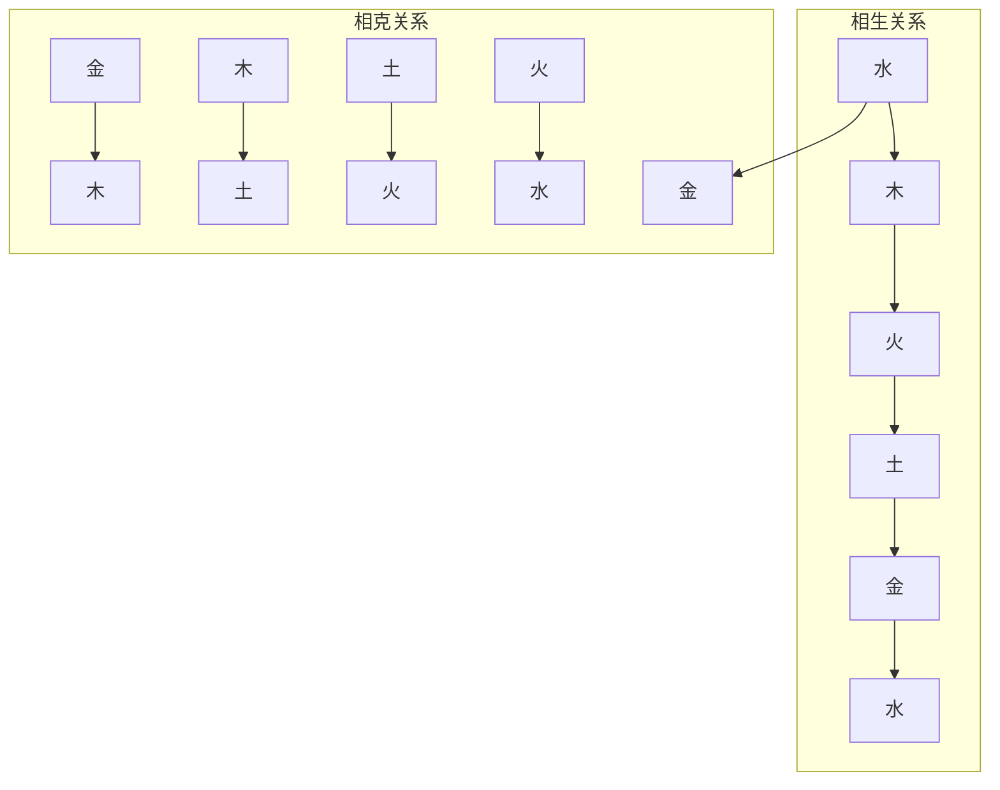

**图表来源**
- [engine.js](file://js/engine.js#L204-L213)

**章节来源**
- [solar-terms.js](file://js/solar-terms.js#L108-L117)
- [engine.js](file://js/engine.js#L204-L213)

### 节气数据结构设计

节气数据结构采用JSON格式，包含完整的节气信息：

#### 节气数据模型

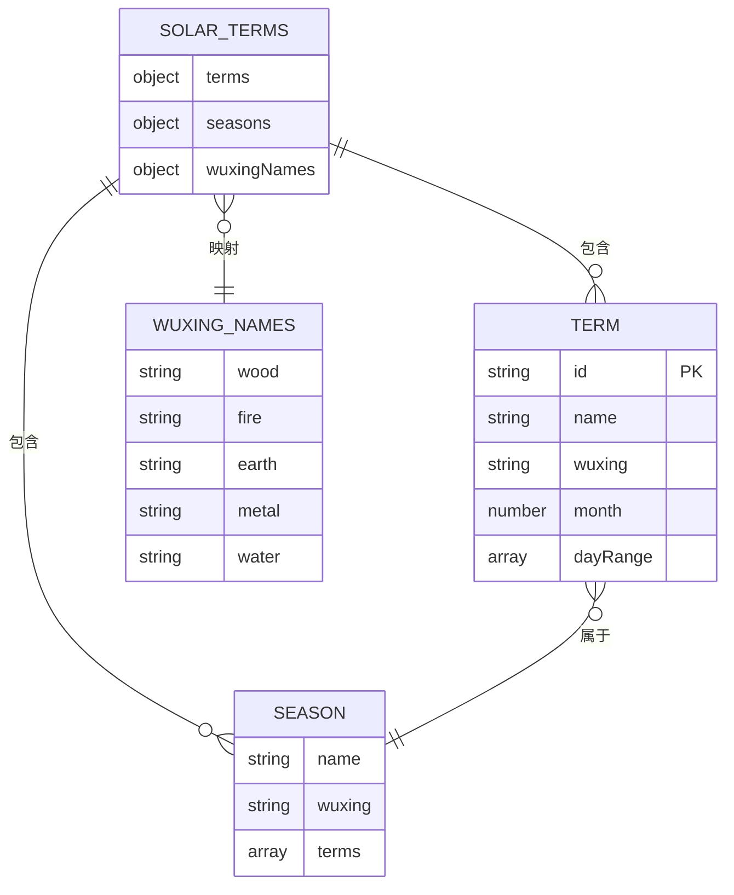

**图表来源**
- [solar-terms.json](file://data/solar-terms.json#L1-L42)

#### 节气数据字段说明

| 字段名 | 类型 | 描述 | 示例值 |
|--------|------|------|--------|
| id | string | 节气唯一标识符 | "lichun" |
| name | string | 节气中文名称 | "立春" |
| wuxing | string | 五行属性 | "wood" |
| month | number | 节气所在月份 | 2 |
| dayRange | array | 日期范围 [起始, 结束] | [3, 5] |
| seasons | object | 季节映射 | {spring: {...}} |
| wuxingNames | object | 五行中文名称 | {wood: "木"} |

**章节来源**
- [solar-terms.json](file://data/solar-terms.json#L2-L41)

### 节气对穿搭推荐的影响机制

节气对穿搭推荐的影响机制通过权重计算实现：

#### 权重分配策略

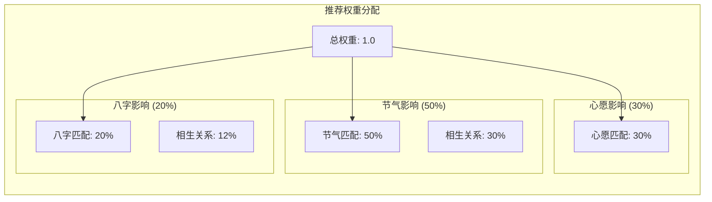

**图表来源**
- [engine.js](file://js/engine.js#L157-L173)
- [engine.js](file://js/engine.js#L178-L199)

#### 匹配评分算法

评分算法基于五行相生相克关系实现：

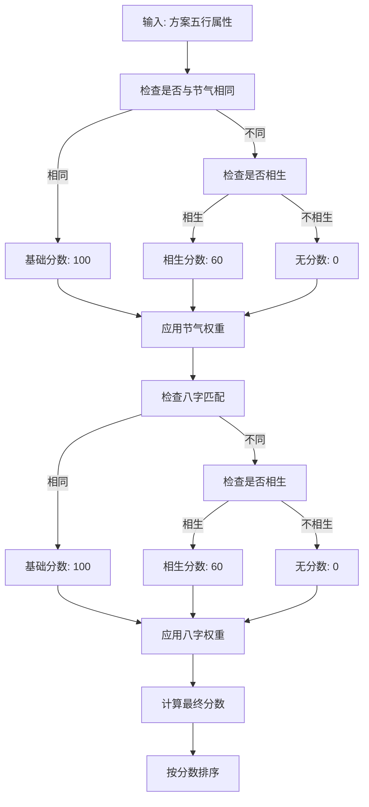

**图表来源**
- [engine.js](file://js/engine.js#L178-L199)
- [engine.js](file://js/engine.js#L204-L213)

**章节来源**
- [engine.js](file://js/engine.js#L157-L199)

## 依赖关系分析

节气处理模块与其他系统组件的依赖关系如下：

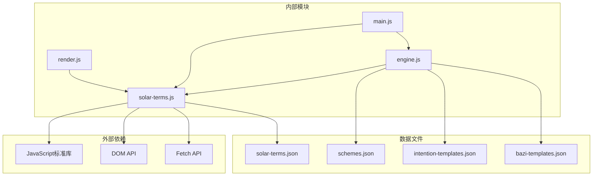

**图表来源**
- [solar-terms.js](file://js/solar-terms.js#L1-L118)
- [engine.js](file://js/engine.js#L1-L335)
- [main.js](file://js/main.js#L1-L317)
- [render.js](file://js/render.js#L1-L200)

**章节来源**
- [solar-terms.js](file://js/solar-terms.js#L18-L29)
- [engine.js](file://js/engine.js#L268-L274)

## 性能考虑

### 算法复杂度分析

节气检测算法的时间复杂度为O(n)，其中n为节气总数（24个）：

- **时间复杂度**: O(n) - 线性搜索节气列表
- **空间复杂度**: O(1) - 常量额外空间
- **数据加载**: 异步加载，避免阻塞主线程

### 优化策略

1. **缓存机制**: 已实现全局数据缓存，避免重复加载
2. **异步处理**: 使用Promise和async/await避免阻塞
3. **内存优化**: 及时释放不需要的数据引用
4. **算法优化**: 节气列表按顺序排列，便于快速查找

### 性能监控建议

```javascript
// 性能监控示例
console.time('节气检测耗时');
const result = await detectCurrentTerm();
console.timeEnd('节气检测耗时');

// 内存使用监控
console.log('内存使用:', performance.memory.usedJSHeapSize);
```

## 故障排除指南

### 常见问题及解决方案

#### 节气数据加载失败

**问题症状**: 控制台出现数据加载错误

**可能原因**:
- JSON文件路径错误
- 文件格式不正确
- 网络请求失败

**解决方案**:
1. 检查文件路径是否正确
2. 验证JSON格式的有效性
3. 确认网络连接正常

#### 节气识别错误

**问题症状**: 返回的节气与实际不符

**可能原因**:
- 时区计算错误
- 日期范围判断异常
- 数据配置错误

**解决方案**:
1. 验证UTC+8转换逻辑
2. 检查日期范围配置
3. 确认节气顺序正确

#### 推荐结果异常

**问题症状**: 穿搭推荐不符合预期

**可能原因**:
- 权重分配不合理
- 评分算法错误
- 五行相生关系配置错误

**解决方案**:
1. 检查权重配置
2. 验证评分算法
3. 确认相生关系映射

**章节来源**
- [solar-terms.js](file://js/solar-terms.js#L25-L28)
- [engine.js](file://js/engine.js#L46-L48)

## 结论

节气处理模块成功实现了中国传统节气系统的现代化应用，具有以下特点：

1. **准确性**: 基于精确的日期计算和边界判断算法
2. **完整性**: 覆盖所有24个节气及其对应的五行属性
3. **可扩展性**: 模块化设计便于功能扩展和维护
4. **实用性**: 与穿搭推荐系统无缝集成，提供智能化服务

该模块为"五行时尚"应用提供了坚实的传统文化基础，通过现代技术手段实现了传统智慧的数字化传承。

## 附录

### 数据扩展指南

#### 添加新的节气规则

1. 在[solar-terms.json](file://data/solar-terms.json)中添加新节气配置
2. 更新节气顺序数组
3. 添加相应的颜色映射
4. 测试节气边界判断逻辑

#### 自定义节气规则

```javascript
// 自定义节气检测函数
function detectCustomTerm(date, customRules) {
    // 实现自定义逻辑
    return customTermInfo;
}
```

#### 国际化支持

模块已具备国际化基础，可通过以下方式扩展：

1. 添加多语言节气名称映射
2. 支持不同地区的节气日期调整
3. 提供多语言的五行属性说明

**章节来源**
- [solar-terms.json](file://data/solar-terms.json#L2-L26)
- [engine.js](file://js/engine.js#L29-L34)