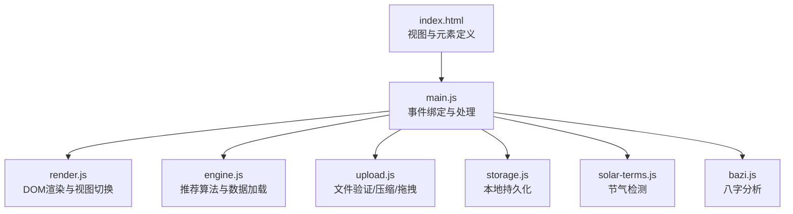
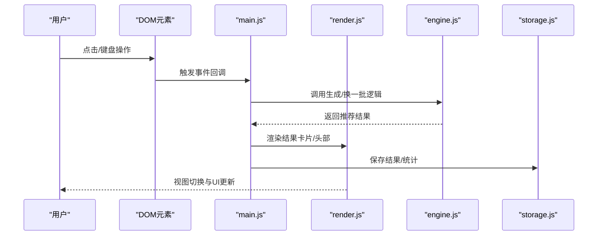
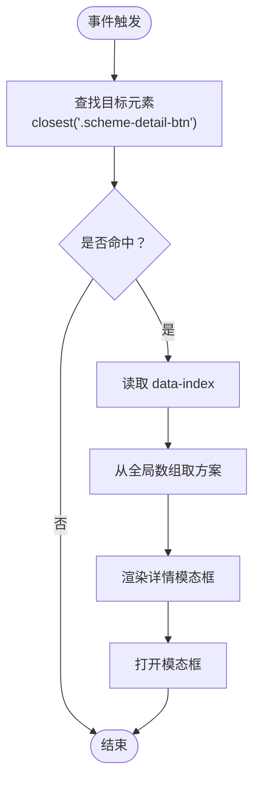
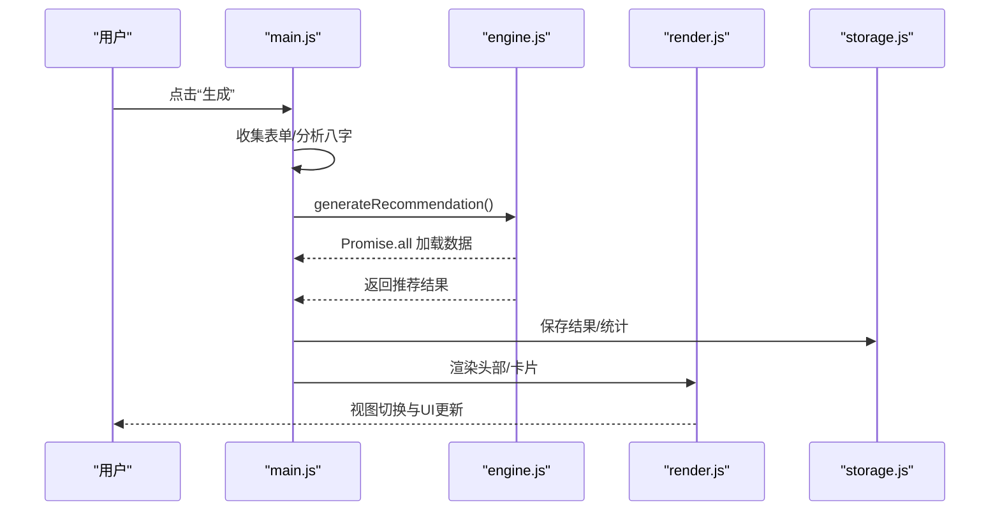
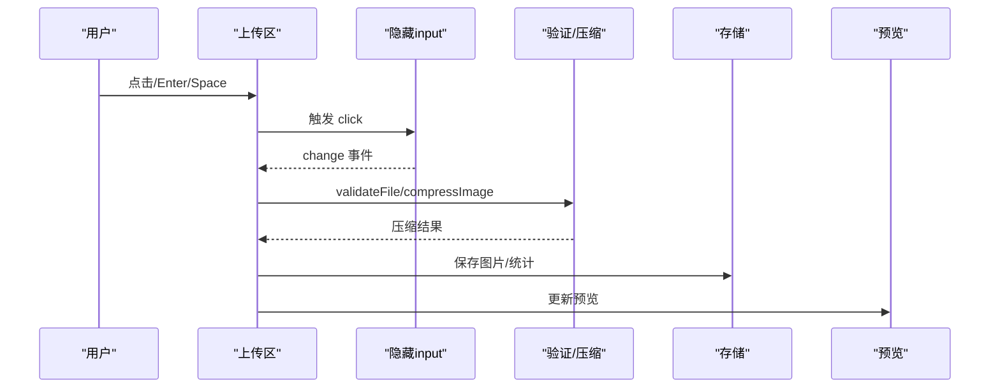
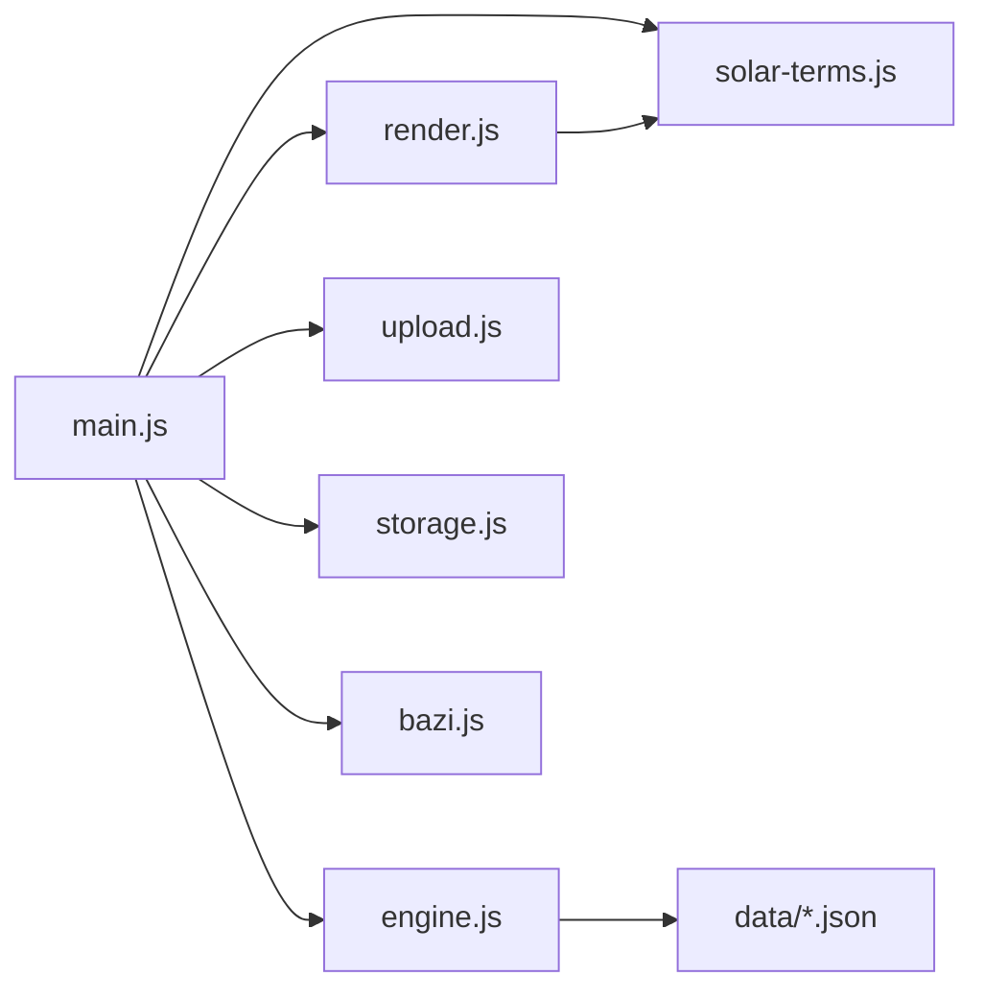

# 事件驱动模式

<cite>
**本文引用的文件**
- [main.js](file://js/main.js)
- [index.html](file://index.html)
- [render.js](file://js/render.js)
- [engine.js](file://js/engine.js)
- [upload.js](file://js/upload.js)
- [storage.js](file://js/storage.js)
- [solar-terms.js](file://js/solar-terms.js)
- [bazi.js](file://js/bazi.js)
</cite>

## 目录
1. [简介](#简介)
2. [项目结构](#项目结构)
3. [核心组件](#核心组件)
4. [架构总览](#架构总览)
5. [详细组件分析](#详细组件分析)
6. [依赖分析](#依赖分析)
7. [性能考虑](#性能考虑)
8. [故障排查指南](#故障排查指南)
9. [结论](#结论)

## 简介
本文件聚焦于“五行穿搭建议”项目中的事件驱动模式，系统性解析 main.js 中的事件绑定机制与事件处理流程，涵盖：
- DOM 事件监听器的注册方式（按钮点击、键盘事件、模态框事件）
- 事件委托模式在动态内容中的应用（如 scheme-cards 的点击事件）
- 异步事件处理（Promise 链式调用与 async/await）
- 事件冒泡与捕获在组件交互中的作用
- 事件处理最佳实践与性能优化建议

## 项目结构
该项目采用模块化组织，前端入口为 index.html，核心逻辑集中在 js 目录下，main.js 作为应用入口与事件中枢，协调渲染、引擎、上传、存储等模块。

图表来源
- [index.html](file://index.html#L20-L236)
- [main.js](file://js/main.js#L1-L317)
- [render.js](file://js/render.js#L1-L272)
- [engine.js](file://js/engine.js#L1-L335)
- [upload.js](file://js/upload.js#L1-L145)
- [storage.js](file://js/storage.js#L1-L116)
- [solar-terms.js](file://js/solar-terms.js#L1-L118)
- [bazi.js](file://js/bazi.js#L1-L193)

章节来源
- [index.html](file://index.html#L20-L236)
- [main.js](file://js/main.js#L1-L317)

## 核心组件
- 事件中枢：main.js 负责初始化、事件绑定与异步处理流程编排
- 视图渲染：render.js 提供视图切换、卡片渲染、模态框控制、Toast 提示
- 推荐引擎：engine.js 负责数据加载、上下文构建、评分与方案选择
- 上传模块：upload.js 提供文件校验、压缩、拖拽上传与键盘支持
- 存储模块：storage.js 提供本地持久化与统计
- 辅助模块：solar-terms.js 负节气检测，bazi.js 负责八字分析

章节来源
- [main.js](file://js/main.js#L1-L317)
- [render.js](file://js/render.js#L1-L272)
- [engine.js](file://js/engine.js#L1-L335)
- [upload.js](file://js/upload.js#L1-L145)
- [storage.js](file://js/storage.js#L1-L116)
- [solar-terms.js](file://js/solar-terms.js#L1-L118)
- [bazi.js](file://js/bazi.js#L1-L193)

## 架构总览
事件驱动架构围绕 main.js 展开，用户交互触发 DOM 事件，事件处理器通过模块间协作完成业务闭环，并通过渲染模块更新 UI。

图表来源
- [main.js](file://js/main.js#L72-L153)
- [render.js](file://js/render.js#L8-L16)
- [engine.js](file://js/engine.js#L268-L310)
- [storage.js](file://js/storage.js#L64-L66)

## 详细组件分析

### 事件绑定与处理总览
- 初始化：应用在 DOMContentLoaded 时执行 init，随后绑定各类事件监听器
- 事件类型：点击事件（导航、生成、上传、详情）、键盘事件（ESC 关闭模态框、Enter/Space 触发上传区）、拖拽事件（上传区）
- 委托策略：对动态生成的卡片容器使用事件委托，避免重复绑定

章节来源
- [main.js](file://js/main.js#L26-L67)
- [main.js](file://js/main.js#L72-L153)

### DOM 事件监听器注册方式
- 导航按钮：通过 getElementById 获取元素并添加 click 监听，实现视图切换
- 心愿标签：通过 querySelectorAll 遍历标签并逐个绑定 click 监听，实现心愿选择与状态持久化
- 生成/换一批：绑定 click 监听，内部封装异步处理逻辑
- 上传区域：绑定 click、keydown、change、dragover/dragleave/drop 等事件，实现多形态交互
- 模态框：绑定关闭按钮与 backdrop 点击，以及 ESC 键盘事件

章节来源
- [main.js](file://js/main.js#L72-L153)
- [index.html](file://index.html#L32-L153)
- [upload.js](file://js/upload.js#L87-L136)

### 事件委托模式：scheme-cards 容器
- 委托对象：容器 #scheme-cards
- 匹配规则：使用 closest 匹配 .scheme-detail-btn，提取 data-index
- 动态内容：卡片由渲染模块动态生成，委托避免重复绑定
- 交互流程：点击“查看详情”按钮 -> 读取索引 -> 从全局数组取方案 -> 渲染详情模态框 -> 打开模态框

图表来源
- [main.js](file://js/main.js#L125-L136)
- [render.js](file://js/render.js#L114-L127)
- [render.js](file://js/render.js#L159-L193)

章节来源
- [main.js](file://js/main.js#L125-L136)
- [render.js](file://js/render.js#L114-L127)
- [render.js](file://js/render.js#L159-L193)

### 异步事件处理：Promise 链式调用与 async/await
- 数据加载：推荐引擎使用 Promise.all 并行加载多个数据源，提升启动效率
- 生成流程：handleGenerate 内部先收集表单数据，再调用 analyzeBazi，最后调用 generateRecommendation（异步），等待结果后保存并渲染
- 换一批流程：handleRegenerate 传入已排除的方案 ID，调用 regenerateRecommendation（异步）并更新 UI
- 上传流程：handleFileUpload 先 validateFile，再异步 compressImage，最后保存到 storage 并更新预览

图表来源
- [main.js](file://js/main.js#L202-L244)
- [engine.js](file://js/engine.js#L268-L310)
- [render.js](file://js/render.js#L104-L127)
- [storage.js](file://js/storage.js#L64-L66)

章节来源
- [main.js](file://js/main.js#L202-L244)
- [engine.js](file://js/engine.js#L268-L310)

### 事件冒泡与捕获机制的作用
- 冒泡传播：模态框的 backdrop 点击与 ESC 键盘事件均在冒泡阶段被父级监听器捕获，统一关闭模态框，避免重复绑定
- 阻止传播：上传区域“移除图片”按钮使用 stopPropagation，防止事件向上冒泡影响父级容器
- 委托与冒泡：scheme-cards 使用事件委托，利用冒泡在容器层统一处理子元素事件，减少内存占用

章节来源
- [main.js](file://js/main.js#L143-L152)
- [main.js](file://js/main.js#L117-L118)
- [main.js](file://js/main.js#L125-L136)

### 上传模块的事件处理
- 点击触发：上传区点击触发隐藏 input 的 click
- 键盘支持：Enter/Space 触发点击，提升可访问性
- 文件变更：监听 input change，调用回调处理文件
- 拖拽支持：dragover/dragleave/drop 实现拖拽上传
- 事件组合：多种事件协同，覆盖点击、键盘、拖拽三种主流交互

图表来源
- [upload.js](file://js/upload.js#L87-L136)
- [main.js](file://js/main.js#L274-L292)
- [render.js](file://js/render.js#L220-L237)
- [storage.js](file://js/storage.js#L83-L85)

章节来源
- [upload.js](file://js/upload.js#L87-L136)
- [main.js](file://js/main.js#L274-L292)

### 模态框事件处理
- 关闭按钮：点击关闭
- 背景遮罩：点击关闭
- ESC 键：按下 ESC 关闭
- 交互一致性：三种方式统一调用 closeModal，确保行为一致

章节来源
- [main.js](file://js/main.js#L139-L152)
- [render.js](file://js/render.js#L198-L215)

## 依赖分析
- main.js 依赖 render、engine、upload、storage、solar-terms、bazi 模块
- render.js 依赖 solar-terms.js 的颜色映射函数
- engine.js 依赖 data 目录下的 JSON 数据（通过 fetch 异步加载）
- upload.js 依赖 FileReader、Canvas API 进行图片压缩
- storage.js 依赖 localStorage 进行本地持久化

图表来源
- [main.js](file://js/main.js#L5-L15)
- [render.js](file://js/render.js#L1-L272)
- [engine.js](file://js/engine.js#L1-L335)
- [upload.js](file://js/upload.js#L1-L145)
- [storage.js](file://js/storage.js#L1-L116)
- [solar-terms.js](file://js/solar-terms.js#L1-L118)
- [bazi.js](file://js/bazi.js#L1-L193)

章节来源
- [main.js](file://js/main.js#L5-L15)
- [engine.js](file://js/engine.js#L39-L79)

## 性能考虑
- 事件委托：对动态生成的卡片使用委托，避免重复绑定，降低内存占用
- 并行加载：推荐引擎使用 Promise.all 并行加载数据，缩短首屏等待
- 异步处理：上传与生成流程均采用异步，避免阻塞主线程
- 本地存储：使用 localStorage 缓存用户选择与结果，减少重复请求
- 事件传播控制：必要时使用 stopPropagation 防止事件冒泡带来的额外处理
- 可访问性：上传区支持键盘触发，提升可用性

## 故障排查指南
- 事件未生效
  - 检查 DOMContentLoaded 是否正确触发 init
  - 确认元素 ID/类名与绑定代码一致
- 详情模态框无法打开
  - 检查 data-index 是否存在且正确
  - 确认全局数组 __currentSchemes 已赋值
- 上传失败
  - 检查文件类型与大小限制
  - 确认 Canvas 压缩过程未抛错
- 生成/换一批无响应
  - 检查网络请求与数据加载
  - 确认 Promise 链式调用未中断
- 模态框 ESC 不生效
  - 确认键盘事件监听是否绑定到 document

章节来源
- [main.js](file://js/main.js#L125-L136)
- [main.js](file://js/main.js#L274-L292)
- [main.js](file://js/main.js#L202-L244)
- [main.js](file://js/main.js#L148-L152)

## 结论
本项目在事件驱动模式上实现了清晰的职责分离与良好的扩展性：
- 事件委托与模块化设计降低了耦合度
- 异步处理保证了用户体验与性能
- 多事件形态（点击、键盘、拖拽）提升了可访问性
- 建议持续关注事件内存泄漏风险，定期清理不再使用的监听器，并在复杂场景引入事件节流/防抖策略