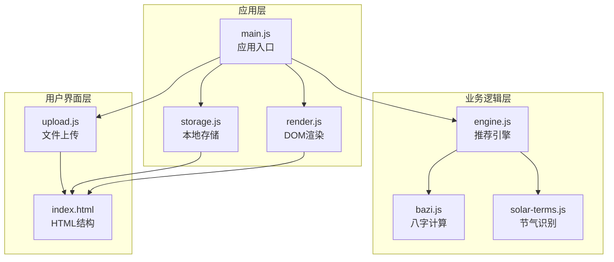
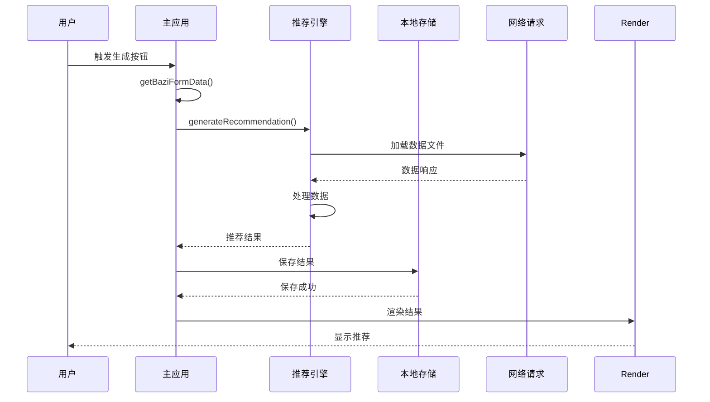
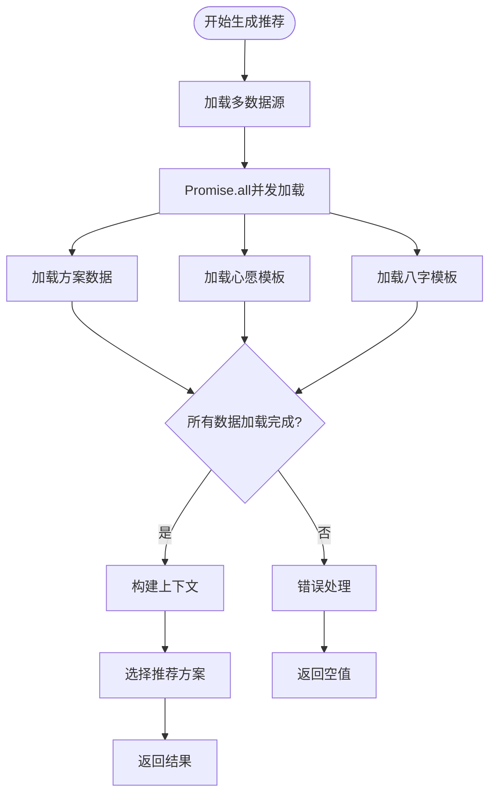
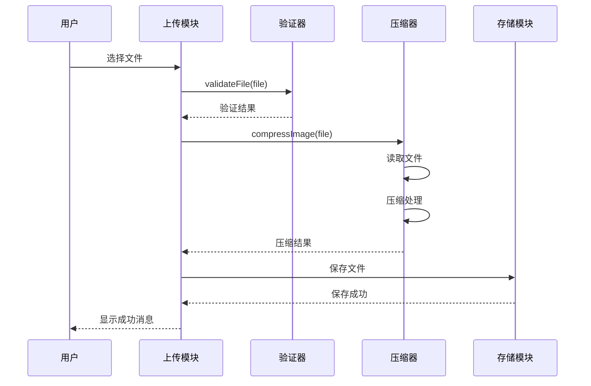
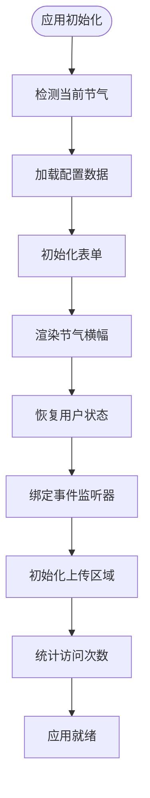
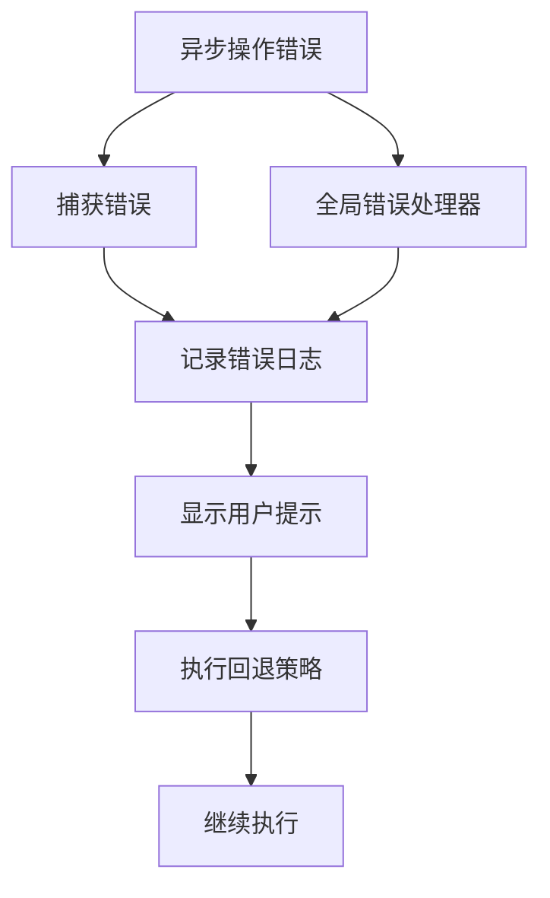
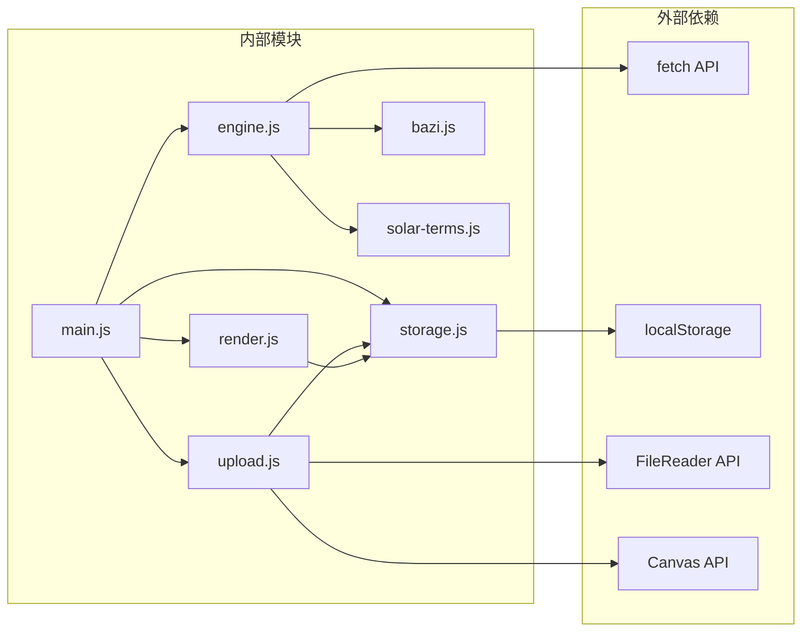

# 异步通信机制

<cite>
**本文档引用的文件**
- [main.js](file://js/main.js)
- [engine.js](file://js/engine.js)
- [upload.js](file://js/upload.js)
- [render.js](file://js/render.js)
- [bazi.js](file://js/bazi.js)
- [storage.js](file://js/storage.js)
- [solar-terms.js](file://js/solar-terms.js)
- [index.html](file://index.html)
</cite>

## 目录
1. [引言](#引言)
2. [项目结构](#项目结构)
3. [核心组件](#核心组件)
4. [架构概览](#架构概览)
5. [详细组件分析](#详细组件分析)
6. [依赖分析](#依赖分析)
7. [性能考虑](#性能考虑)
8. [故障排除指南](#故障排除指南)
9. [结论](#结论)

## 引言

本文档深入分析五行穿搭建议项目的异步通信机制，重点涵盖以下方面：
- Promise和async/await的使用场景与最佳实践
- handleGenerate()和handleRegenerate()中的异步数据获取和处理流程
- 文件上传过程中的异步操作，包括validateFile()和compressImage()的异步调用
- 错误处理和异常传播机制
- 并发异步操作的管理和性能优化策略
- 异步编程的最佳实践和调试技巧

该项目采用模块化的JavaScript架构，通过现代浏览器API实现高效的异步数据处理和用户交互体验。

## 项目结构

项目采用模块化设计，主要包含以下核心模块：

**图表来源**
- [main.js](file://js/main.js#L1-L317)
- [engine.js](file://js/engine.js#L1-L335)
- [upload.js](file://js/upload.js#L1-L145)
- [render.js](file://js/render.js#L1-L272)
- [bazi.js](file://js/bazi.js#L1-L193)
- [solar-terms.js](file://js/solar-terms.js#L1-L118)
- [index.html](file://index.html#L1-L236)

**章节来源**
- [main.js](file://js/main.js#L1-L317)
- [index.html](file://index.html#L1-L236)

## 核心组件

### 异步操作模式概述

项目中的异步操作主要分为以下几类：

1. **数据加载异步操作**：通过fetch API异步加载JSON配置文件
2. **文件处理异步操作**：图片验证、压缩等基于Promise的操作
3. **用户交互异步操作**：事件监听器中的异步回调处理
4. **存储异步操作**：localStorage的异步读写操作

### Promise使用场景

项目广泛使用Promise模式处理异步操作：

- **并发数据加载**：使用Promise.all()并行加载多个数据源
- **文件处理链**：通过Promise链式调用实现复杂的文件处理流程
- **错误处理**：统一的try-catch和Promise.catch机制

**章节来源**
- [engine.js](file://js/engine.js#L268-L310)
- [upload.js](file://js/upload.js#L31-L82)

## 架构概览

项目采用分层架构设计，异步操作贯穿整个应用生命周期：

**图表来源**
- [main.js](file://js/main.js#L202-L244)
- [engine.js](file://js/engine.js#L268-L310)
- [storage.js](file://js/storage.js#L64-L66)

## 详细组件分析

### 推荐引擎异步处理

推荐引擎是项目的核心异步处理模块，负责协调多个数据源的异步加载和处理。

#### 并发数据加载机制

**图表来源**
- [engine.js](file://js/engine.js#L268-L310)

#### 关键异步方法分析

**generateRecommendation()方法**：
- 使用Promise.all()并发加载三个数据源
- 实现了完整的异步错误处理机制
- 支持超时和失败回退策略

**regenerateRecommendation()方法**：
- 基于现有数据进行增量处理
- 支持排除已选择的方案
- 实现了高效的内存管理

**章节来源**
- [engine.js](file://js/engine.js#L268-L334)

### 文件上传异步处理

文件上传模块实现了完整的异步文件处理流程，包括验证、压缩和存储。

#### 文件上传处理流程

**图表来源**
- [upload.js](file://js/upload.js#L274-L292)
- [upload.js](file://js/upload.js#L12-L26)
- [upload.js](file://js/upload.js#L31-L82)

#### 异步文件处理实现

**validateFile()函数**：
- 同步验证文件类型、大小等基础属性
- 返回包含验证结果的对象
- 不涉及异步操作，确保快速响应

**compressImage()函数**：
- 基于Promise实现异步图片压缩
- 使用FileReader和Canvas API进行图像处理
- 实现自适应质量压缩算法

**章节来源**
- [upload.js](file://js/upload.js#L12-L82)

### 应用初始化异步流程

应用启动时需要执行多项异步初始化任务：

**图表来源**
- [main.js](file://js/main.js#L26-L67)

**章节来源**
- [main.js](file://js/main.js#L26-L67)

### 错误处理和异常传播

项目实现了多层次的错误处理机制：

#### 错误处理策略

1. **数据加载错误处理**：网络请求失败时提供默认值
2. **文件处理错误处理**：压缩失败时回退到原始文件
3. **用户交互错误处理**：验证失败时显示友好提示
4. **存储错误处理**：本地存储失败时记录日志但不影响功能

#### 异常传播机制

**图表来源**
- [main.js](file://js/main.js#L282-L291)
- [engine.js](file://js/engine.js#L45-L48)

**章节来源**
- [main.js](file://js/main.js#L282-L291)
- [engine.js](file://js/engine.js#L45-L78)

## 依赖分析

项目模块间的依赖关系呈现清晰的层次结构：

**图表来源**
- [main.js](file://js/main.js#L5-L15)
- [engine.js](file://js/engine.js#L1-L8)
- [upload.js](file://js/upload.js#L1-L7)

**章节来源**
- [main.js](file://js/main.js#L5-L15)
- [engine.js](file://js/engine.js#L1-L8)

## 性能考虑

### 并发优化策略

1. **Promise.all并发加载**：同时加载多个独立的数据源
2. **异步文件处理**：避免阻塞主线程的文件压缩操作
3. **懒加载策略**：按需加载非关键资源

### 内存管理

1. **数据缓存机制**：避免重复加载相同数据
2. **及时清理资源**：释放不再使用的DOM元素和事件监听器
3. **压缩策略**：控制图片文件大小以减少内存占用

### 用户体验优化

1. **即时反馈**：异步操作过程中提供视觉反馈
2. **错误恢复**：失败时提供优雅的降级方案
3. **进度指示**：长耗时操作显示进度条

## 故障排除指南

### 常见问题诊断

**数据加载失败**：
- 检查网络连接和文件路径
- 验证JSON文件格式正确性
- 查看浏览器开发者工具的网络面板

**文件上传失败**：
- 确认文件格式和大小限制
- 检查浏览器兼容性
- 验证Canvas API可用性

**存储操作异常**：
- 检查浏览器隐私设置
- 确认localStorage容量限制
- 验证数据序列化格式

### 调试技巧

1. **使用浏览器开发者工具**监控异步操作
2. **添加详细的日志记录**跟踪异步流程
3. **使用Promise链式调用**便于错误定位
4. **实施渐进式测试**逐步验证异步功能

**章节来源**
- [main.js](file://js/main.js#L282-L291)
- [engine.js](file://js/engine.js#L45-L78)

## 结论

五行穿搭建议项目展现了现代JavaScript异步编程的最佳实践：

1. **架构设计**：清晰的模块化架构和明确的职责分离
2. **异步模式**：合理运用Promise和async/await提升代码可读性和维护性
3. **性能优化**：通过并发处理和缓存机制提升用户体验
4. **错误处理**：建立完善的异常处理和回退机制
5. **用户体验**：提供流畅的异步操作反馈和优雅的降级方案

该项目为移动端Web应用的异步通信提供了优秀的参考范例，特别是在数据加载、文件处理和用户交互方面的异步处理策略值得借鉴和学习。