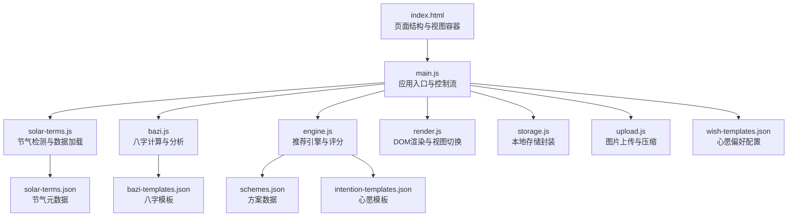
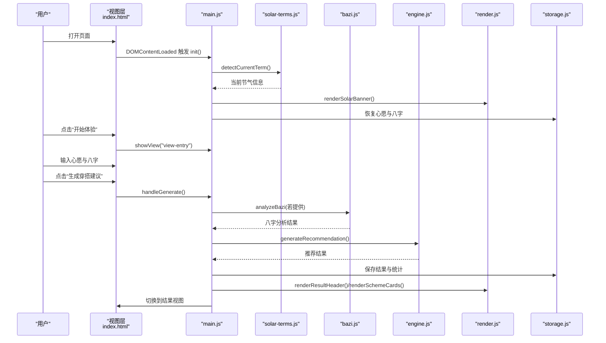
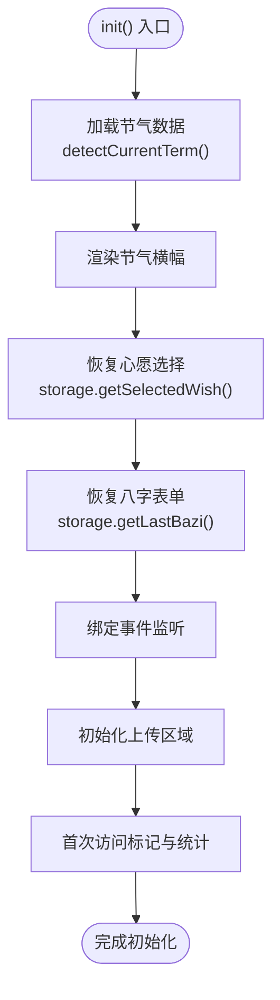
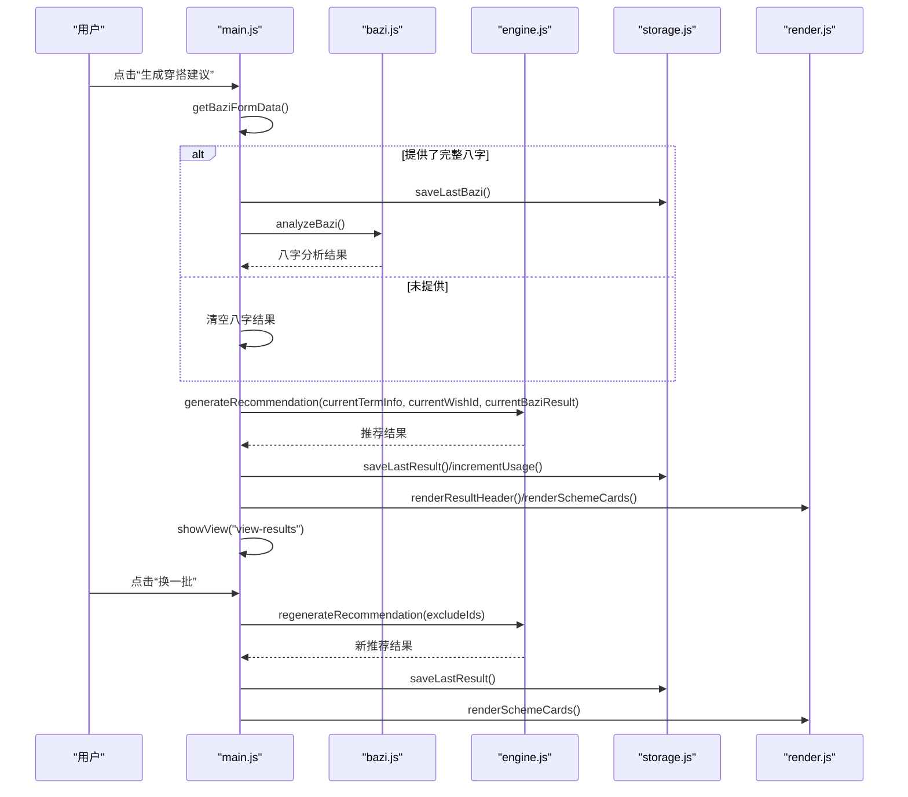
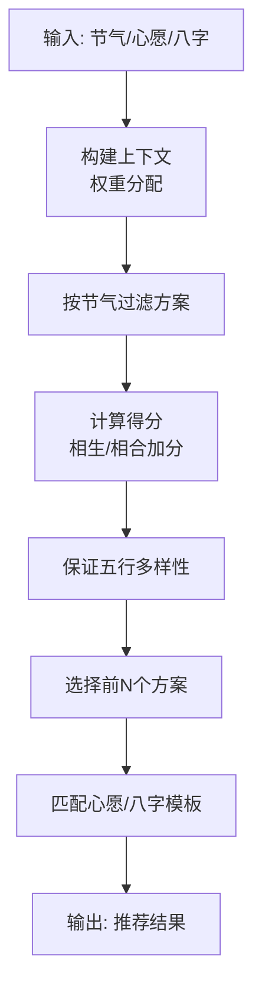
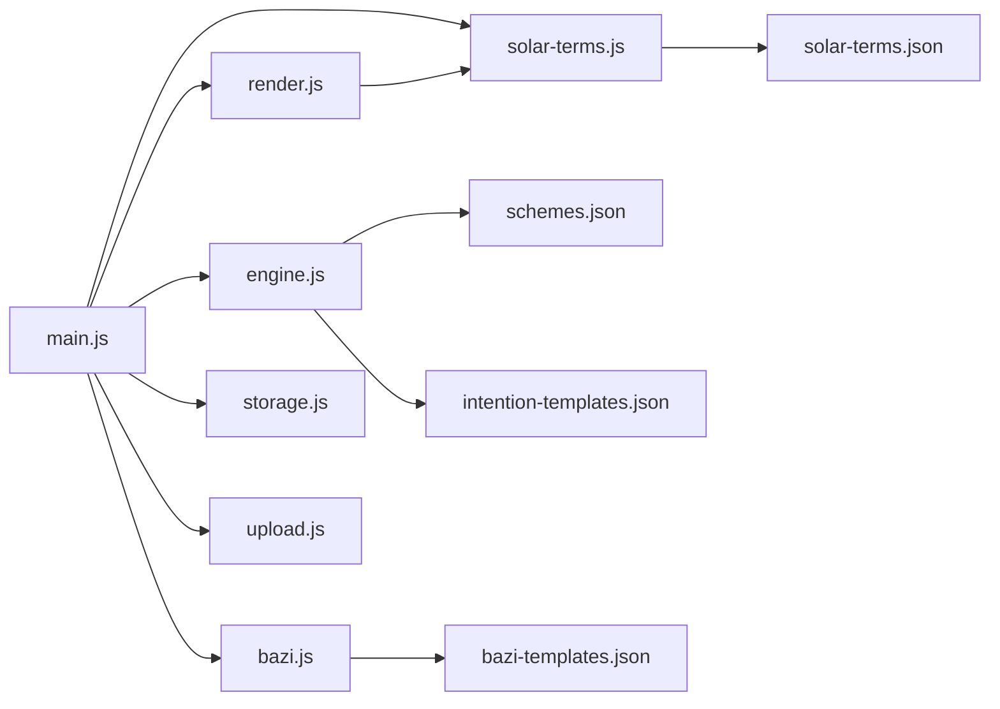

# 数据流协调

<cite>
**本文引用的文件**
- [index.html](file://index.html)
- [main.js](file://js/main.js)
- [engine.js](file://js/engine.js)
- [bazi.js](file://js/bazi.js)
- [solar-terms.js](file://js/solar-terms.js)
- [render.js](file://js/render.js)
- [storage.js](file://js/storage.js)
- [upload.js](file://js/upload.js)
- [schemes.json](file://data/schemes.json)
- [solar-terms.json](file://data/solar-terms.json)
- [intention-templates.json](file://data/intention-templates.json)
- [bazi-templates.json](file://data/bazi-templates.json)
- [wish-templates.json](file://data/wish-templates.json)
</cite>

## 目录
1. [简介](#简介)
2. [项目结构](#项目结构)
3. [核心组件](#核心组件)
4. [架构总览](#架构总览)
5. [详细组件分析](#详细组件分析)
6. [依赖关系分析](#依赖关系分析)
7. [性能考量](#性能考量)
8. [故障排查指南](#故障排查指南)
9. [结论](#结论)
10. [附录](#附录)

## 简介
本文件聚焦“五行穿搭建议”项目的“数据流协调”，系统梳理应用中数据在各模块间的流动路径与协同机制，覆盖以下主题：
- init() 初始化阶段的数据流：节气信息加载、表单数据恢复、视图切换
- handleGenerate() 与 handleRegenerate() 的数据处理流程：八字数据获取、推荐结果生成、存储与渲染
- 全局状态管理：currentTermInfo、currentWishId、currentBaziResult 等的更新与同步
- 数据验证与错误处理机制
- 数据流优化与缓存策略

## 项目结构
项目采用模块化组织，前端页面由 HTML 承载，JavaScript 模块负责业务逻辑、渲染、存储与上传处理，数据以 JSON 文件形式提供。

图表来源
- [index.html](file://index.html#L20-L236)
- [main.js](file://js/main.js#L1-L317)
- [engine.js](file://js/engine.js#L1-L335)
- [solar-terms.js](file://js/solar-terms.js#L1-L118)
- [render.js](file://js/render.js#L1-L272)
- [storage.js](file://js/storage.js#L1-L116)
- [upload.js](file://js/upload.js#L1-L145)
- [schemes.json](file://data/schemes.json#L1-L509)
- [solar-terms.json](file://data/solar-terms.json#L1-L42)
- [intention-templates.json](file://data/intention-templates.json#L1-L253)
- [bazi-templates.json](file://data/bazi-templates.json#L1-L103)
- [wish-templates.json](file://data/wish-templates.json#L1-L47)

章节来源
- [index.html](file://index.html#L20-L236)
- [main.js](file://js/main.js#L1-L317)

## 核心组件
- 应用入口与控制流：负责初始化、事件绑定、状态更新与流程编排
- 节气模块：加载节气数据、检测当前节气、提供五行颜色映射
- 八字模块：计算四柱、统计五行、给出推荐
- 推荐引擎：加载方案与模板、构建上下文、评分与筛选
- 渲染模块：视图切换、卡片渲染、模态框与提示
- 存储模块：本地持久化、使用统计、反馈与穿搭图片
- 上传模块：文件校验、压缩、拖拽与键盘支持

章节来源
- [main.js](file://js/main.js#L17-L67)
- [solar-terms.js](file://js/solar-terms.js#L1-L118)
- [bazi.js](file://js/bazi.js#L1-L193)
- [engine.js](file://js/engine.js#L1-L335)
- [render.js](file://js/render.js#L1-L272)
- [storage.js](file://js/storage.js#L1-L116)
- [upload.js](file://js/upload.js#L1-L145)

## 架构总览
下图展示从用户交互到最终渲染的关键数据流路径。

图表来源
- [main.js](file://js/main.js#L26-L67)
- [solar-terms.js](file://js/solar-terms.js#L36-L103)
- [bazi.js](file://js/bazi.js#L182-L193)
- [engine.js](file://js/engine.js#L268-L310)
- [render.js](file://js/render.js#L55-L127)
- [storage.js](file://js/storage.js#L52-L66)

## 详细组件分析

### 初始化数据流（init）
- 节气信息加载：调用节气模块的检测函数，获取当前节气与季节信息，并渲染节气横幅。
- 表单数据恢复：从本地存储恢复上次选择的心愿与八字，填充对应表单控件。
- 视图切换：绑定返回按钮与开始按钮，实现欢迎页、输入页、结果页、上传页之间的切换。
- 上传区域初始化：设置上传区的点击、拖拽、键盘支持，并注册上传回调。
- 首次访问与使用统计：首次访问打标与访问次数统计。

图表来源
- [main.js](file://js/main.js#L26-L67)
- [solar-terms.js](file://js/solar-terms.js#L36-L103)
- [render.js](file://js/render.js#L55-L71)
- [storage.js](file://js/storage.js#L101-L115)
- [upload.js](file://js/upload.js#L87-L136)

章节来源
- [main.js](file://js/main.js#L26-L67)

### 生成与换一批数据流（handleGenerate / handleRegenerate）
- handleGenerate 流程：
  - 获取八字表单数据，若完整则保存并进行八字分析，否则清空八字结果。
  - 调用推荐引擎生成推荐，包含节气权重、心愿权重、八字权重的综合评分。
  - 保存结果与使用统计，渲染结果头部与方案卡片，切换到结果视图。
- handleRegenerate 流程：
  - 基于已排除的方案 ID 列表，重新生成推荐，避免重复。
  - 更新当前结果并渲染新卡片，提示用户“换一批”。

图表来源
- [main.js](file://js/main.js#L202-L244)
- [main.js](file://js/main.js#L249-L269)
- [bazi.js](file://js/bazi.js#L182-L193)
- [engine.js](file://js/engine.js#L268-L334)
- [render.js](file://js/render.js#L104-L127)
- [storage.js](file://js/storage.js#L64-L66)

章节来源
- [main.js](file://js/main.js#L202-L269)

### 数据状态管理
- 全局状态变量：
  - currentTermInfo：当前节气信息（来自节气模块）
  - currentWishId：当前选择的心愿ID（来自心愿标签选择）
  - currentBaziResult：八字分析结果（来自八字模块）
  - currentResult：最新推荐结果（来自引擎模块）
- 状态更新与同步：
  - 初始化阶段：从本地存储恢复心愿与八字，渲染节气横幅
  - 生成阶段：保存八字与结果，更新 currentBaziResult 与 currentResult
  - 换一批阶段：基于排除列表重新生成，更新 currentResult 并渲染
  - 渲染阶段：通过全局数组 window.__currentSchemes 传递给详情模态框

章节来源
- [main.js](file://js/main.js#L17-L22)
- [main.js](file://js/main.js#L158-L164)
- [main.js](file://js/main.js#L202-L244)
- [main.js](file://js/main.js#L249-L269)
- [render.js](file://js/render.js#L125-L127)

### 数据验证与错误处理
- 八字表单验证：检查年、月、日、时是否齐全，缺失则返回空值
- 图片上传验证：类型、大小限制，不符合则提示错误
- 图片压缩：读取图片、按最大边缩放、循环调整质量至目标大小
- 引擎加载：异步加载方案、模板与节气数据，失败时记录错误并返回空
- 上传异常：捕获压缩与保存过程中的错误，提示用户

章节来源
- [main.js](file://js/main.js#L181-L197)
- [upload.js](file://js/upload.js#L12-L26)
- [upload.js](file://js/upload.js#L31-L82)
- [engine.js](file://js/engine.js#L39-L79)

### 推荐引擎与评分机制
- 上下文构建：包含节气五行、心愿权重、八字五行与权重
- 方案过滤与评分：优先筛选同节气方案，不足时按得分排序；确保五行多样性
- 模板匹配：
  - 心愿模板：按心愿名称与当前节气匹配最近的模板
  - 八字模板：按“日主某元素旺”与当年匹配，优先当年再回退任意年份
- 生成与换一批：分别返回包含模板与不含模板的结果对象

图表来源
- [engine.js](file://js/engine.js#L157-L173)
- [engine.js](file://js/engine.js#L218-L259)
- [engine.js](file://js/engine.js#L104-L119)
- [engine.js](file://js/engine.js#L124-L152)

章节来源
- [engine.js](file://js/engine.js#L1-L335)

### 本地存储与缓存策略
- 缓存策略：
  - 引擎模块对已加载的数据进行内存缓存（方案、模板、节气数据），避免重复请求
- 本地持久化：
  - 保存最近一次的八字、结果、心愿选择、反馈、穿搭图片
  - 使用统一前缀与键空间管理，便于清理与扩展
  - 使用 JSON 序列化与异常兜底，保证健壮性
- 使用统计：
  - visits/generates/uploads 计数，用于统计分析

章节来源
- [engine.js](file://js/engine.js#L39-L79)
- [storage.js](file://js/storage.js#L52-L115)

### 上传与反馈流程
- 上传流程：校验 -> 压缩 -> 保存 -> 预览 -> 统计
- 反馈流程：输入校验 -> 保存 -> 清空输入 -> 提示成功

章节来源
- [upload.js](file://js/upload.js#L12-L82)
- [storage.js](file://js/storage.js#L68-L77)
- [main.js](file://js/main.js#L274-L292)
- [main.js](file://js/main.js#L297-L313)

## 依赖关系分析
- 模块耦合：
  - main.js 作为中枢，依赖节气、八字、引擎、渲染、存储、上传模块
  - engine.js 依赖 schemes 与模板 JSON，内部维护数据缓存
  - render.js 依赖 solar-terms.js 的颜色映射
- 外部依赖：
  - HTML 结构承载视图与事件绑定
  - JSON 数据文件提供静态配置与方案

图表来源
- [main.js](file://js/main.js#L5-L16)
- [engine.js](file://js/engine.js#L1-L8)
- [render.js](file://js/render.js#L1-L16)
- [solar-terms.js](file://js/solar-terms.js#L1-L16)
- [schemes.json](file://data/schemes.json#L1-L509)
- [intention-templates.json](file://data/intention-templates.json#L1-L253)
- [bazi-templates.json](file://data/bazi-templates.json#L1-L103)
- [solar-terms.json](file://data/solar-terms.json#L1-L42)

章节来源
- [main.js](file://js/main.js#L5-L16)
- [engine.js](file://js/engine.js#L1-L8)

## 性能考量
- 数据加载优化：
  - 引擎模块对 JSON 数据进行内存缓存，减少重复网络请求
  - 推荐与换一批并行加载模板与方案，缩短等待时间
- 渲染优化：
  - 卡片动画延迟错峰，提升首屏体验
  - 详情模态框复用当前方案数组，避免重复查询
- 上传优化：
  - 图片压缩采用 Canvas 与质量迭代，兼顾体积与清晰度
  - 支持拖拽与键盘操作，提升可用性

章节来源
- [engine.js](file://js/engine.js#L39-L79)
- [render.js](file://js/render.js#L132-L154)
- [upload.js](file://js/upload.js#L31-L82)

## 故障排查指南
- 节气数据加载失败：
  - 检查网络与 JSON 文件路径，确认响应体结构
- 八字分析为空：
  - 确认表单输入完整，检查 analyzeBazi 的调用参数
- 推荐结果为空：
  - 检查 schemes.json 是否加载成功，确认节气过滤条件
- 上传失败：
  - 检查文件类型与大小限制，查看压缩过程异常
- 本地存储异常：
  - 检查浏览器存储权限与容量，必要时清理前缀键空间

章节来源
- [solar-terms.js](file://js/solar-terms.js#L18-L29)
- [bazi.js](file://js/bazi.js#L182-L193)
- [engine.js](file://js/engine.js#L270-L279)
- [upload.js](file://js/upload.js#L12-L26)
- [storage.js](file://js/storage.js#L7-L23)

## 结论
本项目通过明确的模块职责与清晰的数据流设计，实现了从节气、心愿、八字到推荐方案的闭环。init() 完成初始化与恢复，handleGenerate() 与 handleRegenerate() 分别承担生成与刷新，全局状态在 main.js 中集中管理，渲染与存储模块提供稳定的 UI 与持久化能力。推荐引擎结合节气、心愿与八字模板，形成可解释、可追溯的决策依据。建议后续可在模板缓存、离线策略与结果缓存方面进一步优化，以提升性能与用户体验。

## 附录
- 关键数据模型与字段说明（节选）
  - 节气：id、name、wuxing、month、dayRange、seasonInfo
  - 方案：id、termId、rank、color(name/hex/wuxing)、material、feeling、annotation、source
  - 心愿模板：intention、solarTerm、color、material、feeling、annotation、source
  - 八字模板：baZiKey、solarTerm、color、material、feeling、annotation、source
  - 八字分析：bazi(year/month/day/hour/fullBazi)、profile(五行计数)、recommend(最强/最弱/推荐)

章节来源
- [solar-terms.json](file://data/solar-terms.json#L1-L42)
- [schemes.json](file://data/schemes.json#L1-L509)
- [intention-templates.json](file://data/intention-templates.json#L1-L253)
- [bazi-templates.json](file://data/bazi-templates.json#L1-L103)
- [bazi.js](file://js/bazi.js#L129-L172)