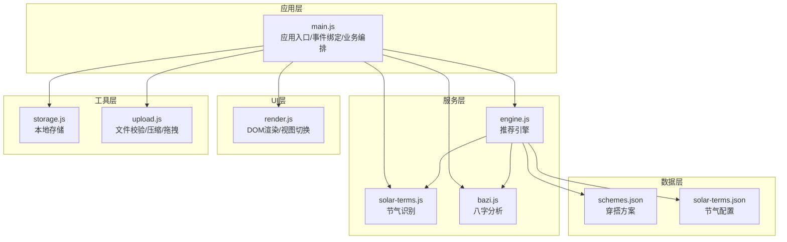
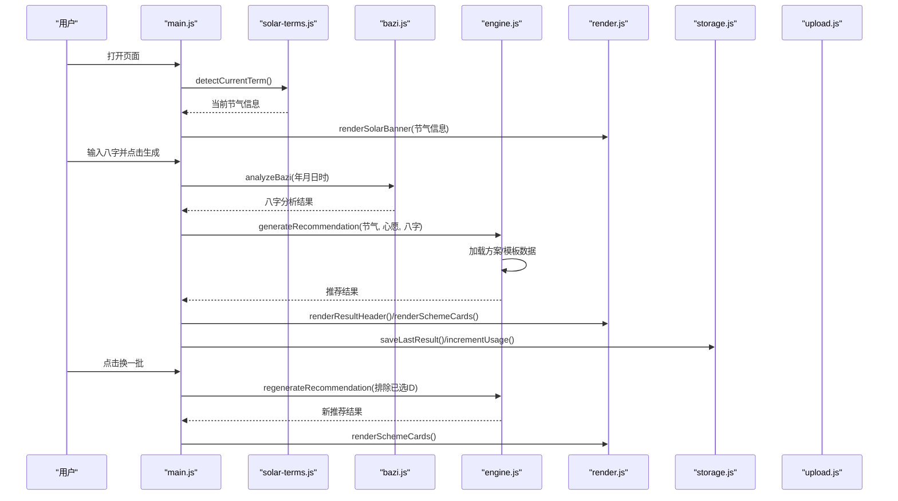
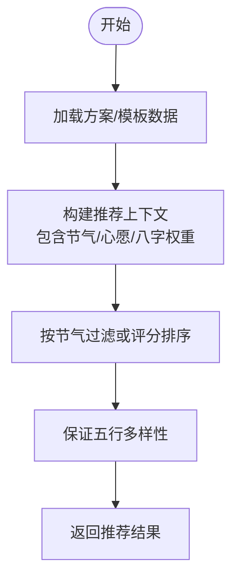
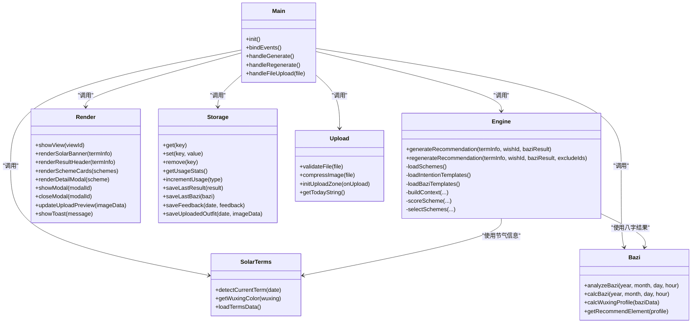

# 模块依赖注入

<cite>
**本文档引用的文件**
- [main.js](file://js/main.js)
- [engine.js](file://js/engine.js)
- [solar-terms.js](file://js/solar-terms.js)
- [bazi.js](file://js/bazi.js)
- [render.js](file://js/render.js)
- [storage.js](file://js/storage.js)
- [upload.js](file://js/upload.js)
- [schemes.json](file://data/schemes.json)
- [solar-terms.json](file://data/solar-terms.json)
</cite>

## 目录
1. [简介](#简介)
2. [项目结构](#项目结构)
3. [核心组件](#核心组件)
4. [架构总览](#架构总览)
5. [详细组件分析](#详细组件分析)
6. [依赖关系分析](#依赖关系分析)
7. [性能考量](#性能考量)
8. [故障排查指南](#故障排查指南)
9. [结论](#结论)
10. [附录](#附录)

## 简介
本项目为“五行穿搭建议”应用，采用模块化与依赖注入（DI）思想组织代码，通过参数传递实现模块解耦，使各功能模块职责清晰、可测试性强且易于替换。本文档聚焦于：
- main.js 中 import 语句的模块导入策略与依赖关系
- engine.js 对 solar-terms.js 与 bazi.js 的依赖调用方式
- 模块间接口抽象与契约设计
- 通过依赖注入实现模块的可测试性与可替换性
- 依赖管理最佳实践与重构指导

## 项目结构
项目采用按功能域划分的模块化组织，核心模块如下：
- 应用入口与控制流：main.js
- 推荐引擎：engine.js
- 节气识别：solar-terms.js
- 八字分析：bazi.js
- 渲染层：render.js
- 本地存储：storage.js
- 上传处理：upload.js
- 数据资源：data/*.json

图表来源
- [main.js](file://js/main.js#L5-L16)
- [engine.js](file://js/engine.js#L1-L335)
- [solar-terms.js](file://js/solar-terms.js#L1-L118)
- [bazi.js](file://js/bazi.js#L1-L193)
- [render.js](file://js/render.js#L1-L272)
- [storage.js](file://js/storage.js#L1-L116)
- [upload.js](file://js/upload.js#L1-L145)
- [schemes.json](file://data/schemes.json#L1-L509)
- [solar-terms.json](file://data/solar-terms.json#L1-L42)

章节来源
- [main.js](file://js/main.js#L1-L317)
- [engine.js](file://js/engine.js#L1-L335)

## 核心组件
- 应用入口模块（main.js）
  - 导入：storage、solar-terms、bazi、engine、render、upload
  - 职责：初始化应用、绑定事件、协调业务流程、调用各模块执行具体任务
- 推荐引擎（engine.js）
  - 职责：加载方案与模板数据、构建推荐上下文、评分与筛选方案、返回推荐结果
- 节气识别（solar-terms.js）
  - 职责：加载节气数据、检测当前节气、提供节气对应五行颜色
- 八字分析（bazi.js）
  - 职责：计算四柱八字、统计五行分布、给出推荐元素
- 渲染层（render.js）
  - 职责：视图切换、节气横幅渲染、方案卡片渲染、模态框与提示
- 存储层（storage.js）
  - 职责：封装本地存储键值操作、统计与偏好记录
- 上传处理（upload.js）
  - 职责：文件校验、图片压缩、拖拽上传、日期格式化

章节来源
- [main.js](file://js/main.js#L5-L16)
- [engine.js](file://js/engine.js#L1-L335)
- [solar-terms.js](file://js/solar-terms.js#L1-L118)
- [bazi.js](file://js/bazi.js#L1-L193)
- [render.js](file://js/render.js#L1-L272)
- [storage.js](file://js/storage.js#L1-L116)
- [upload.js](file://js/upload.js#L1-L145)

## 架构总览
应用采用“入口模块 + 服务模块 + UI模块 + 工具模块”的分层架构，通过参数传递实现依赖注入，避免硬编码依赖，提升模块内聚与可替换性。

图表来源
- [main.js](file://js/main.js#L26-L67)
- [main.js](file://js/main.js#L202-L244)
- [main.js](file://js/main.js#L249-L269)
- [solar-terms.js](file://js/solar-terms.js#L36-L103)
- [bazi.js](file://js/bazi.js#L182-L192)
- [engine.js](file://js/engine.js#L268-L310)
- [engine.js](file://js/engine.js#L315-L334)
- [render.js](file://js/render.js#L55-L127)
- [storage.js](file://js/storage.js#L60-L99)

## 详细组件分析

### main.js 模块导入策略与依赖关系
- 导入策略
  - 使用命名导出与默认导出混合：如 solar-terms 的命名导出函数、bazi 的命名导出函数、engine 的命名导出函数等
  - 使用命名空间导入 storage，统一管理本地存储方法
  - 使用组合导入 render 与 upload 的多个函数，便于在入口处集中使用
- 依赖关系
  - main.js 直接依赖：solar-terms、bazi、engine、render、storage、upload
  - 间接依赖：engine.js 依赖 data/schemes.json、data/solar-terms.json
- 解耦与参数注入
  - main.js 通过参数向 engine.js 传入节气信息、心愿ID、八字结果，实现“自上而下”的依赖注入
  - render.js 通过参数接收数据进行渲染，避免直接访问全局状态
  - storage.js 提供统一的键空间，避免各模块硬编码键名

章节来源
- [main.js](file://js/main.js#L5-L16)
- [main.js](file://js/main.js#L26-L67)
- [main.js](file://js/main.js#L202-L244)
- [main.js](file://js/main.js#L249-L269)

### engine.js 对 solar-terms.js 与 bazi.js 的依赖调用
- 调用方式
  - 通过参数接收节气信息（来自 solar-terms 的 detectCurrentTerm），不直接依赖 solar-terms 的内部状态
  - 通过参数接收八字分析结果（来自 bazi 的 analyzeBazi），不直接依赖 bazi 的内部状态
- 数据契约
  - 节气信息包含：当前节气ID、名称、五行属性、季节信息等
  - 八字分析结果包含：四柱、五行分布、推荐元素
- 内部数据加载
  - 引擎内部异步加载 data/schemes.json 与 data/solar-terms.json，确保数据与逻辑分离

图表来源
- [engine.js](file://js/engine.js#L268-L310)
- [engine.js](file://js/engine.js#L315-L334)
- [engine.js](file://js/engine.js#L157-L173)
- [engine.js](file://js/engine.js#L218-L259)

章节来源
- [engine.js](file://js/engine.js#L268-L310)
- [engine.js](file://js/engine.js#L315-L334)
- [solar-terms.js](file://js/solar-terms.js#L36-L103)
- [bazi.js](file://js/bazi.js#L182-L192)

### 模块间接口抽象与契约设计
- main.js 与 engine.js 的契约
  - 输入：节气信息、心愿ID、八字分析结果
  - 输出：推荐结果对象（包含方案列表、节气信息、心愿ID、模板、生成时间等）
- main.js 与 solar-terms.js 的契约
  - 输入：可选日期（默认当前 UTC+8 时间）
  - 输出：当前节气与下个节气信息、季节信息、五行名称映射
- main.js 与 bazi.js 的契约
  - 输入：出生年、月、日、时
  - 输出：八字四柱、五行分布、推荐元素
- main.js 与 render.js 的契约
  - 输入：节气信息、方案列表、单个方案详情
  - 输出：DOM 更新、模态框显示、Toast 提示
- main.js 与 storage.js 的契约
  - 输入：键名与数据
  - 输出：读写结果与统计信息
- main.js 与 upload.js 的契约
  - 输入：文件对象
  - 输出：校验结果、压缩后的图像数据、上传回调

章节来源
- [main.js](file://js/main.js#L202-L244)
- [main.js](file://js/main.js#L249-L269)
- [solar-terms.js](file://js/solar-terms.js#L36-L103)
- [bazi.js](file://js/bazi.js#L182-L192)
- [render.js](file://js/render.js#L55-L127)
- [storage.js](file://js/storage.js#L52-L115)
- [upload.js](file://js/upload.js#L12-L82)

### 通过依赖注入实现模块的可测试性与可替换性
- 可测试性
  - main.js 通过参数向 engine.js 注入节气信息、心愿ID、八字结果，可在单元测试中构造输入数据，独立验证推荐逻辑
  - render.js 的渲染函数仅依赖输入参数，便于断言 DOM 更新
  - storage.js 提供统一的键空间，便于模拟存储行为
- 可替换性
  - 若更换数据源（如从本地 JSON 改为远程 API），只需修改 engine.js 的数据加载逻辑，不影响 main.js 的调用方式
  - 若替换渲染策略，只需替换 render.js 的实现，main.js 保持不变
  - 若替换上传策略，只需替换 upload.js 的实现，main.js 保持不变

章节来源
- [engine.js](file://js/engine.js#L39-L79)
- [render.js](file://js/render.js#L8-L16)
- [storage.js](file://js/storage.js#L7-L27)
- [upload.js](file://js/upload.js#L87-L136)

## 依赖关系分析

图表来源
- [main.js](file://js/main.js#L5-L16)
- [engine.js](file://js/engine.js#L268-L334)
- [solar-terms.js](file://js/solar-terms.js#L36-L103)
- [bazi.js](file://js/bazi.js#L182-L192)
- [render.js](file://js/render.js#L8-L272)
- [storage.js](file://js/storage.js#L7-L115)
- [upload.js](file://js/upload.js#L12-L145)

## 性能考量
- 并发加载数据
  - engine.js 使用 Promise.all 并发加载方案、心愿模板与八字模板，减少等待时间
- 缓存机制
  - solar-terms.js 与 engine.js 内部对已加载数据进行缓存，避免重复请求
- 渲染优化
  - render.js 在渲染方案卡片时批量更新 DOM，并通过动画延迟实现逐项入场效果
- 上传优化
  - upload.js 采用 Canvas 压缩与质量递减策略，确保在目标大小范围内尽可能保留画质

章节来源
- [engine.js](file://js/engine.js#L270-L274)
- [solar-terms.js](file://js/solar-terms.js#L18-L29)
- [engine.js](file://js/engine.js#L39-L79)
- [render.js](file://js/render.js#L114-L154)
- [upload.js](file://js/upload.js#L31-L82)

## 故障排查指南
- 节气数据加载失败
  - 现象：节气横幅为空或报错
  - 排查：确认 data/solar-terms.json 是否可访问，检查网络请求与跨域设置
- 方案数据加载失败
  - 现象：推荐结果为空
  - 排查：确认 data/schemes.json 是否存在且格式正确
- 八字分析异常
  - 现象：推荐结果不符合预期
  - 排查：检查输入的年月日时是否合法，确认 bazi.js 的计算逻辑
- 上传失败
  - 现象：文件无法上传或压缩失败
  - 排查：检查文件类型与大小限制，确认 Canvas 压缩流程是否抛错
- 本地存储异常
  - 现象：偏好设置或历史记录丢失
  - 排查：检查浏览器本地存储权限与容量限制

章节来源
- [solar-terms.js](file://js/solar-terms.js#L21-L29)
- [engine.js](file://js/engine.js#L42-L49)
- [bazi.js](file://js/bazi.js#L182-L192)
- [upload.js](file://js/upload.js#L12-L26)
- [storage.js](file://js/storage.js#L7-L23)

## 结论
本项目通过参数驱动的依赖注入，实现了模块间的低耦合与高内聚，具备良好的可测试性与可替换性。main.js 作为编排中心，将 solar-terms.js、bazi.js、engine.js、render.js、storage.js、upload.js 有机整合，形成清晰的业务流程。建议在后续迭代中进一步：
- 抽象数据源接口，支持多数据源切换
- 引入依赖注入容器，集中管理模块生命周期
- 增强错误边界与降级策略，提升系统鲁棒性

## 附录
- 数据模型（简要）
  - 节气：包含 ID、名称、五行、月份与日期范围、季节映射、五行名称
  - 方案：包含 ID、所属节气、排序、颜色（名称、十六进制、五行）、材质、感受、注解、出处
  - 八字：包含年柱、月柱、日柱、时柱及完整四柱字符串
  - 推荐结果：包含方案列表、节气信息、心愿ID、模板、生成时间等

章节来源
- [solar-terms.json](file://data/solar-terms.json#L1-L42)
- [schemes.json](file://data/schemes.json#L1-L509)
- [bazi.js](file://js/bazi.js#L111-L124)
- [engine.js](file://js/engine.js#L301-L309)