# 组件交互关系

<cite>
**本文档引用的文件**
- [main.js](file://js/main.js)
- [render.js](file://js/render.js)
- [storage.js](file://js/storage.js)
- [engine.js](file://js/engine.js)
- [solar-terms.js](file://js/solar-terms.js)
- [bazi.js](file://js/bazi.js)
- [upload.js](file://js/upload.js)
- [index.html](file://index.html)
</cite>

## 目录
1. [引言](#引言)
2. [项目结构](#项目结构)
3. [核心组件](#核心组件)
4. [架构概览](#架构概览)
5. [详细组件分析](#详细组件分析)
6. [依赖关系分析](#依赖关系分析)
7. [性能考虑](#性能考虑)
8. [故障排除指南](#故障排除指南)
9. [结论](#结论)

## 引言

本文档深入分析了"五行穿搭建议"项目的组件交互关系，重点解析了核心模块之间的协作模式和通信机制。该项目是一个基于传统五行理论的个性化穿搭推荐系统，通过节气、八字和个人心愿来生成穿搭建议。

系统采用模块化架构设计，主要包含以下核心组件：
- **main.js 控制器**：应用入口和业务逻辑协调者
- **render.js 渲染模块**：负责DOM操作和UI更新
- **storage.js 存储模块**：管理本地数据持久化
- **engine.js 引擎模块**：核心推荐算法实现
- **solar-terms.js 节气模块**：节气信息处理
- **bazi.js 八字模块**：生辰八字计算
- **upload.js 上传模块**：图片上传处理

## 项目结构

项目采用功能模块化的组织方式，每个JavaScript文件专注于特定的功能领域：

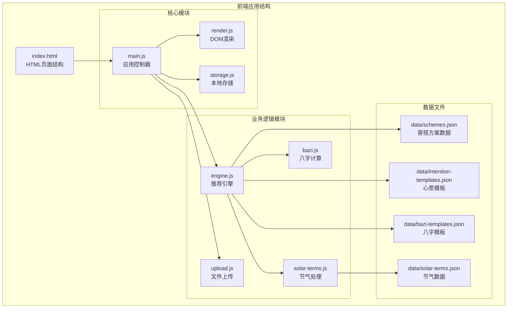

**图表来源**
- [index.html](file://index.html#L1-L236)
- [main.js](file://js/main.js#L1-L317)
- [engine.js](file://js/engine.js#L1-L335)

**章节来源**
- [index.html](file://index.html#L1-L236)
- [main.js](file://js/main.js#L1-L317)

## 核心组件

### 主控制器 (main.js)

main.js作为应用的核心控制器，承担着以下关键职责：

- **应用初始化**：加载节气信息、初始化表单、绑定事件监听器
- **业务流程协调**：协调各个模块的工作流程
- **状态管理**：维护应用的全局状态
- **事件处理**：处理用户交互事件
- **数据流控制**：控制数据在各模块间的传递

### 渲染模块 (render.js)

专门负责所有DOM操作和UI更新：

- **视图切换**：管理多个视图的显示和隐藏
- **表单初始化**：动态生成年份和日期选择器
- **数据展示**：将推荐结果渲染到页面
- **模态框管理**：处理详情弹窗的显示和隐藏
- **用户反馈**：提供Toast消息提示

### 存储模块 (storage.js)

提供统一的本地存储接口：

- **数据封装**：为localStorage提供类型安全的接口
- **业务方法**：封装常用的数据操作方法
- **键值管理**：统一的命名空间管理
- **统计追踪**：记录用户使用统计

**章节来源**
- [main.js](file://js/main.js#L1-L317)
- [render.js](file://js/render.js#L1-L272)
- [storage.js](file://js/storage.js#L1-L116)

## 架构概览

系统采用事件驱动的架构模式，通过模块间的松耦合设计实现高度的可维护性：

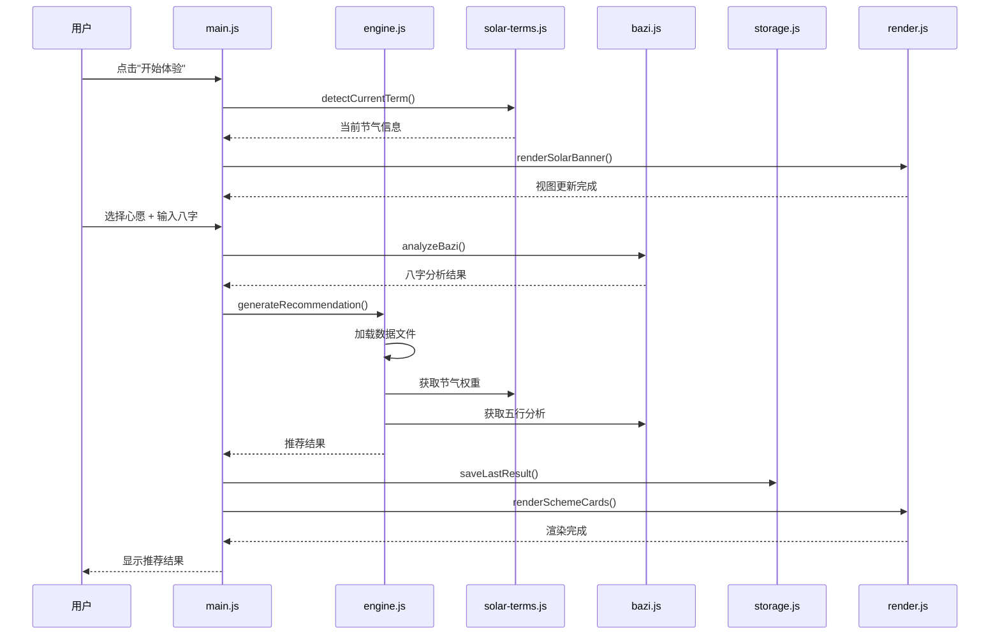

**图表来源**
- [main.js](file://js/main.js#L26-L67)
- [engine.js](file://js/engine.js#L268-L310)
- [solar-terms.js](file://js/solar-terms.js#L36-L103)

## 详细组件分析

### main.js 控制器深度分析

#### 事件驱动交互模式

main.js实现了完整的事件驱动架构：

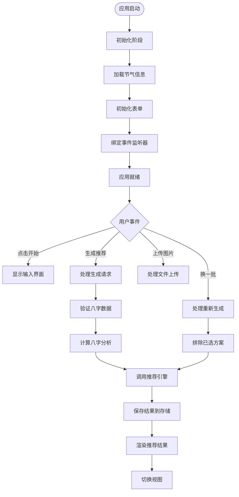

**图表来源**
- [main.js](file://js/main.js#L72-L153)
- [main.js](file://js/main.js#L202-L244)

#### 异步操作回调机制

系统广泛使用Promise和async/await模式：

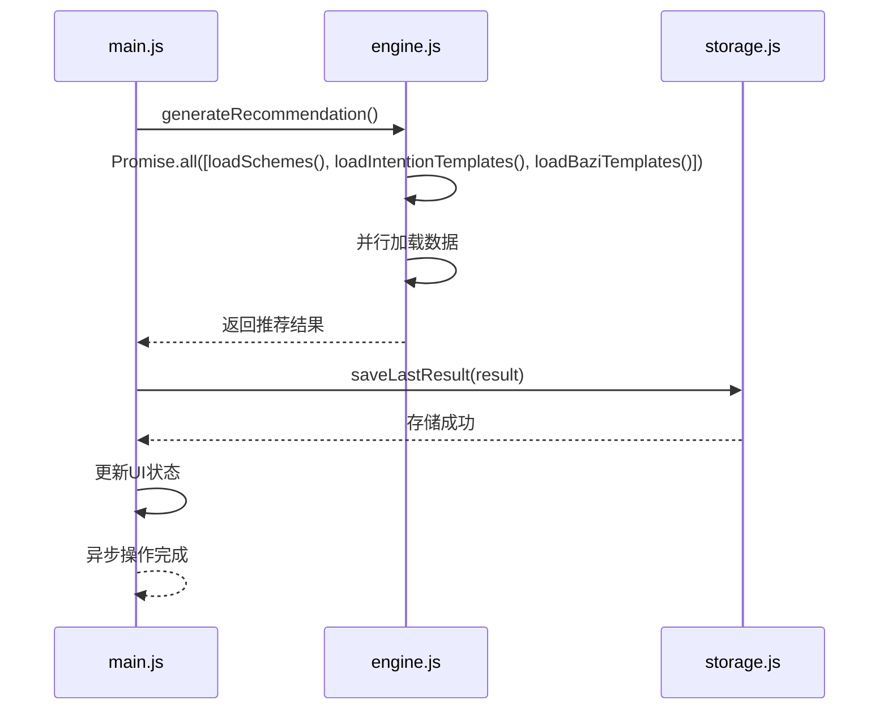

**图表来源**
- [engine.js](file://js/engine.js#L270-L274)
- [main.js](file://js/main.js#L224-L233)

**章节来源**
- [main.js](file://js/main.js#L72-L153)
- [main.js](file://js/main.js#L202-L244)

### render.js 渲染模块分析

#### DOM操作策略

render.js采用了高效的DOM操作策略：

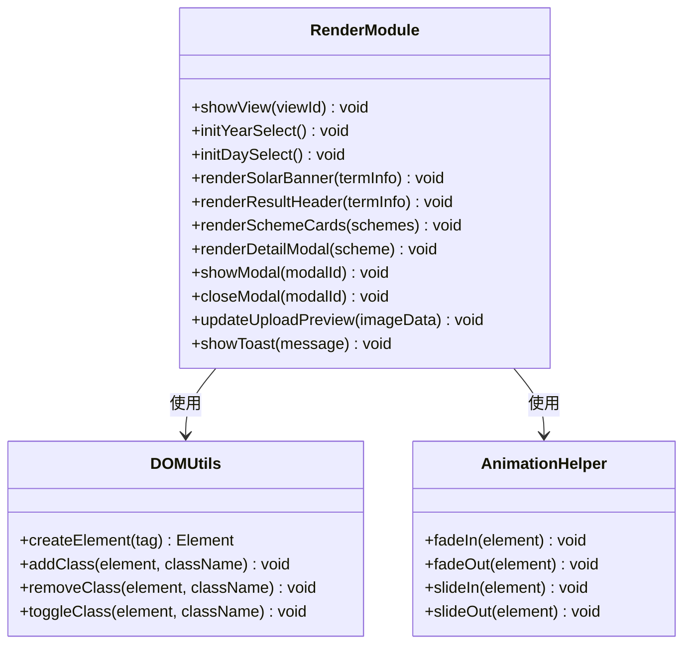

**图表来源**
- [render.js](file://js/render.js#L8-L272)

#### 视图管理系统

系统实现了完整的多视图管理：

| 视图名称 | ID | 功能描述 | 触发条件 |
|---------|----|----------|----------|
| 欢迎页 | view-welcome | 应用介绍和节气展示 | 页面加载 |
| 输入页 | view-entry | 心愿选择和八字输入 | 点击开始按钮 |
| 结果页 | view-results | 推荐方案展示 | 生成推荐后 |
| 上传页 | view-upload | 穿搭照片上传 | 点击上传按钮 |
| 详情页 | modal-detail | 方案详细信息 | 点击查看详情 |

**章节来源**
- [render.js](file://js/render.js#L8-L272)
- [index.html](file://index.html#L24-L214)

### storage.js 存储模块分析

#### 数据持久化策略

storage.js提供了统一的本地存储接口：

```mermaid
erDiagram
STORAGE_MODULE {
string PREFIX
function get(key) any
function set(key, value) boolean
function remove(key) void
function getKeysByPrefix(prefix) string[]
function clearAll() void
}
BUSINESS_METHODS {
function getLastBazi() object
function saveLastBazi(bazi) boolean
function getLastResult() object
function saveLastResult(result) boolean
function getFeedback(date) object
function saveFeedback(date, feedback) boolean
function getUploadedOutfit(date) string
function saveUploadedOutfit(date, imageData) boolean
function removeUploadedOutfit(date) boolean
function getUsageStats() object
function incrementUsage(type) boolean
function isFirstVisit() boolean
function markVisited() boolean
function getSelectedWish() string
function saveSelectedWish(wishId) boolean
}
STORAGE_MODULE ||--|| BUSINESS_METHODS : 提供基础存储
subgraph "存储键值规划"
LAST_BAZI["wuxing_last_bazi"]
LAST_RESULT["wuxing_last_result"]
FEEDBACKS["wuxing_feedbacks"]
OUTFIT_PREFIX["wuxing_outfit_YYYY-MM-DD"]
USAGE_STATS["wuxing_usage_stats"]
VISITED["wuxing_visited"]
SELECTED_WISH["wuxing_selected_wish"]
end
BUSINESS_METHODS --> LAST_BAZI
BUSINESS_METHODS --> LAST_RESULT
BUSINESS_METHODS --> FEEDBACKS
BUSINESS_METHODS --> OUTFIT_PREFIX
BUSINESS_METHODS --> USAGE_STATS
BUSINESS_METHODS --> VISITED
BUSINESS_METHODS --> SELECTED_WISH
```

**图表来源**
- [storage.js](file://js/storage.js#L5-L115)

#### 错误处理机制

存储模块实现了健壮的错误处理：

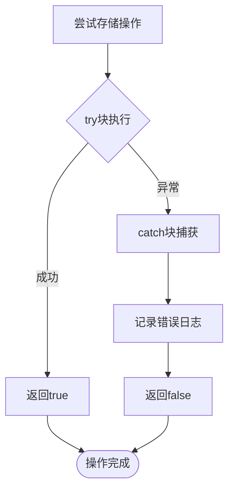

**图表来源**
- [storage.js](file://js/storage.js#L7-L23)

**章节来源**
- [storage.js](file://js/storage.js#L1-L116)

### engine.js 引擎模块分析

#### 推荐算法架构

engine.js实现了复杂的五行匹配算法：

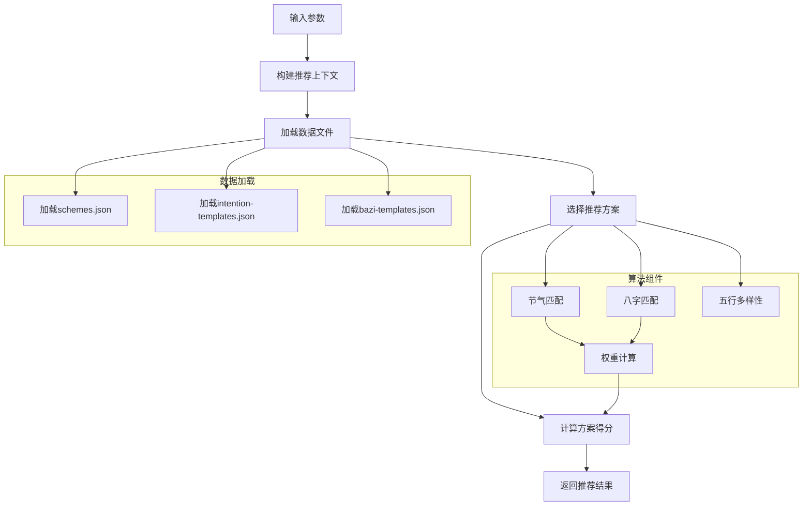

**图表来源**
- [engine.js](file://js/engine.js#L268-L310)
- [engine.js](file://js/engine.js#L157-L173)

#### 五行相生关系

引擎模块实现了完整的五行相生相克逻辑：

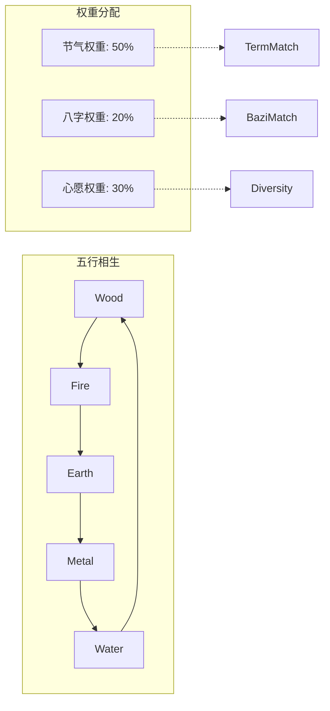

**图表来源**
- [engine.js](file://js/engine.js#L204-L213)
- [engine.js](file://js/engine.js#L157-L173)

**章节来源**
- [engine.js](file://js/engine.js#L1-L335)

### solar-terms.js 节气模块分析

#### 时间计算精度

solar-terms.js确保了节气计算的准确性：

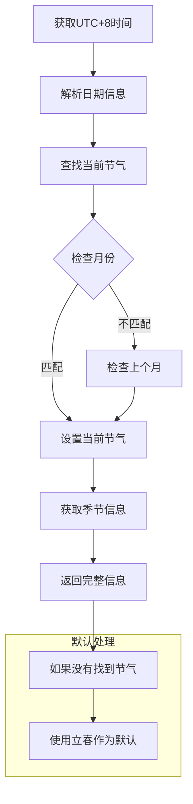

**图表来源**
- [solar-terms.js](file://js/solar-terms.js#L36-L103)

**章节来源**
- [solar-terms.js](file://js/solar-terms.js#L1-L118)

### bazi.js 八字模块分析

#### 八字计算算法

bazi.js实现了精确的八字计算：

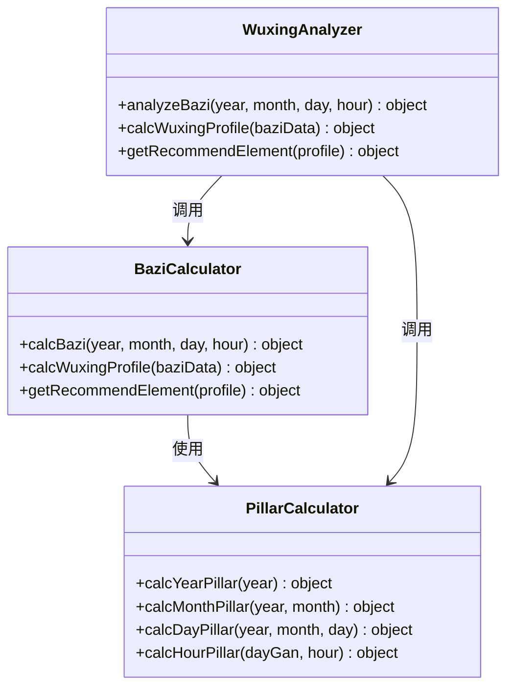

**图表来源**
- [bazi.js](file://js/bazi.js#L111-L124)
- [bazi.js](file://js/bazi.js#L182-L192)

#### 五行分布统计

系统实现了智能的五行平衡分析：

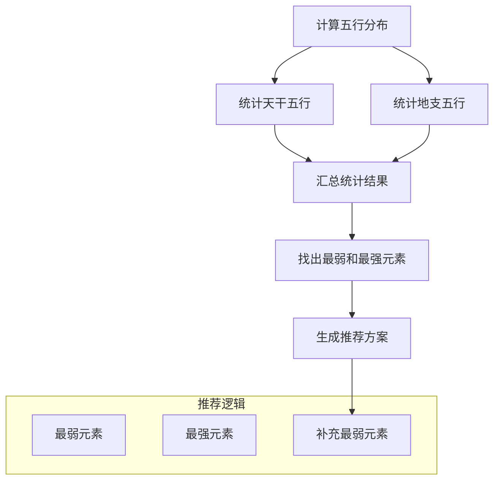

**图表来源**
- [bazi.js](file://js/bazi.js#L129-L172)

**章节来源**
- [bazi.js](file://js/bazi.js#L1-L193)

### upload.js 上传模块分析

#### 文件处理管道

upload.js实现了完整的文件处理流程：

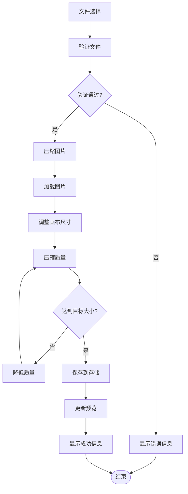

**图表来源**
- [upload.js](file://js/upload.js#L31-L82)
- [upload.js](file://js/upload.js#L12-L26)

**章节来源**
- [upload.js](file://js/upload.js#L1-L145)

## 依赖关系分析

### 模块间依赖图

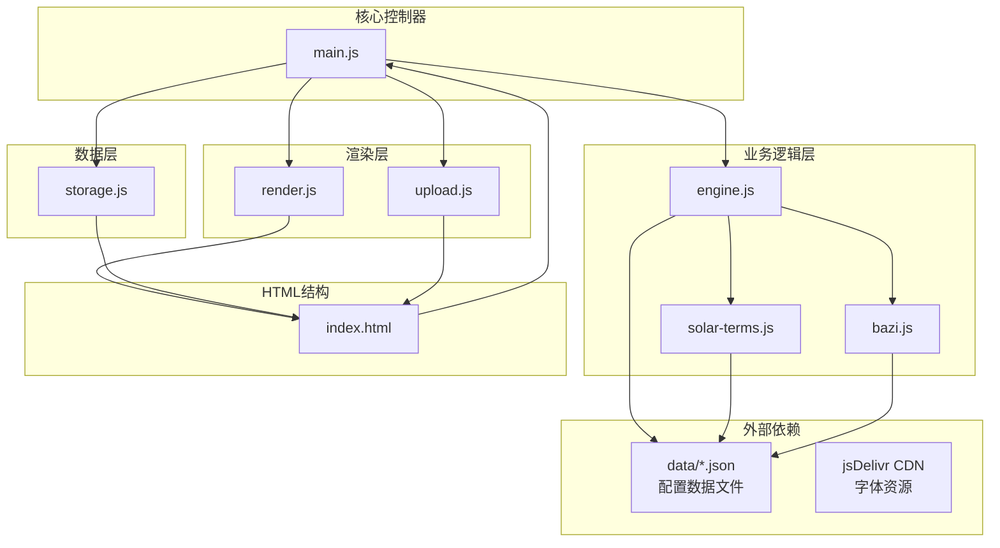

**图表来源**
- [main.js](file://js/main.js#L5-L15)
- [engine.js](file://js/engine.js#L39-L79)

### 解耦策略分析

系统采用了多种解耦策略：

#### 1. 接口抽象设计

每个模块都定义了清晰的导出接口，避免了内部实现细节的泄露：

```javascript
// 示例：模块接口设计
export function generateRecommendation(termInfo, wishId, baziResult) {
    // 实现细节
}

export function analyzeBazi(year, month, day, hour) {
    // 实现细节
}
```

#### 2. 依赖注入模式

main.js通过参数传递的方式实现依赖注入：

```javascript
// 在main.js中调用其他模块
currentResult = await generateRecommendation(
    currentTermInfo,
    currentWishId,
    currentBaziResult
);
```

#### 3. 事件驱动通信

系统通过DOM事件和自定义事件实现模块间的松耦合通信：

```javascript
// 事件监听器绑定
document.getElementById('btn-generate').addEventListener('click', handleGenerate);
```

**章节来源**
- [main.js](file://js/main.js#L5-L15)
- [engine.js](file://js/engine.js#L268-L310)

## 性能考虑

### 异步加载优化

系统采用了多种异步加载策略来提升性能：

1. **并行数据加载**：使用Promise.all同时加载多个数据文件
2. **懒加载策略**：按需加载节气和八字数据
3. **缓存机制**：内存中缓存已加载的数据

### 内存管理

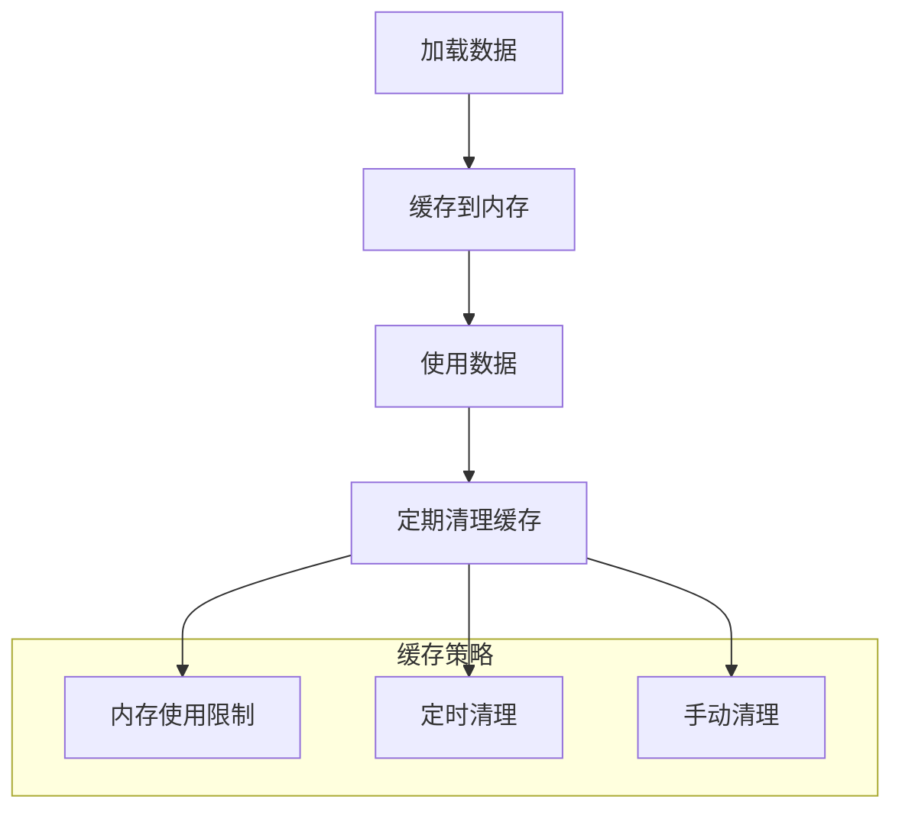

### 用户体验优化

1. **渐进式渲染**：先显示骨架屏，再填充真实内容
2. **防抖处理**：对频繁操作进行防抖
3. **进度反馈**：提供操作进度和状态提示

## 故障排除指南

### 常见问题诊断

#### 1. 数据加载失败

**症状**：推荐结果为空或显示错误

**排查步骤**：
1. 检查网络连接是否正常
2. 验证JSON文件格式是否正确
3. 查看浏览器控制台错误信息

**解决方案**：
- 确保数据文件路径正确
- 检查CORS跨域设置
- 验证文件编码格式

#### 2. 八字计算错误

**症状**：八字分析结果异常

**排查步骤**：
1. 验证输入的出生日期格式
2. 检查时区设置
3. 确认输入参数的有效性

**解决方案**：
- 重新输入正确的出生信息
- 检查浏览器兼容性
- 清除浏览器缓存

#### 3. 图片上传失败

**症状**：图片无法上传或显示

**排查步骤**：
1. 检查文件格式是否支持
2. 验证文件大小限制
3. 确认浏览器权限设置

**解决方案**：
- 选择支持的图片格式
- 压缩图片大小
- 检查浏览器设置

**章节来源**
- [storage.js](file://js/storage.js#L7-L23)
- [upload.js](file://js/upload.js#L12-L26)

## 结论

本项目展现了优秀的前端架构设计，通过模块化和事件驱动的方式实现了高度解耦的组件交互。主要特点包括：

### 架构优势

1. **清晰的职责分离**：每个模块都有明确的职责边界
2. **强大的扩展性**：通过接口抽象和依赖注入支持模块替换
3. **良好的用户体验**：异步处理和渐进式渲染提升了响应速度
4. **健壮的错误处理**：完善的异常捕获和错误恢复机制

### 技术亮点

1. **事件驱动架构**：通过DOM事件实现松耦合的组件通信
2. **异步数据处理**：Promise和async/await模式提升用户体验
3. **智能缓存策略**：内存缓存减少重复请求
4. **本地存储优化**：统一的存储接口简化数据管理

### 扩展建议

1. **微服务化**：可以考虑将部分业务逻辑迁移到Web Workers
2. **状态管理**：引入集中式状态管理提升复杂场景的可维护性
3. **测试覆盖**：增加单元测试和集成测试提升代码质量
4. **性能监控**：添加性能指标监控和错误追踪

该系统为类似的传统文化应用提供了优秀的架构范例，其模块化设计和事件驱动模式值得在其他项目中借鉴和应用。