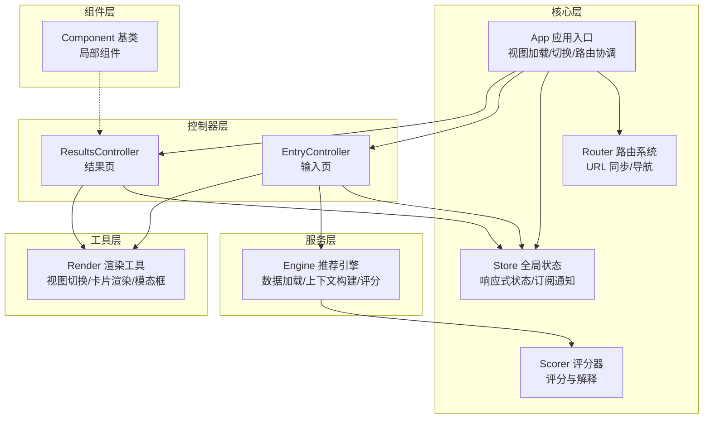
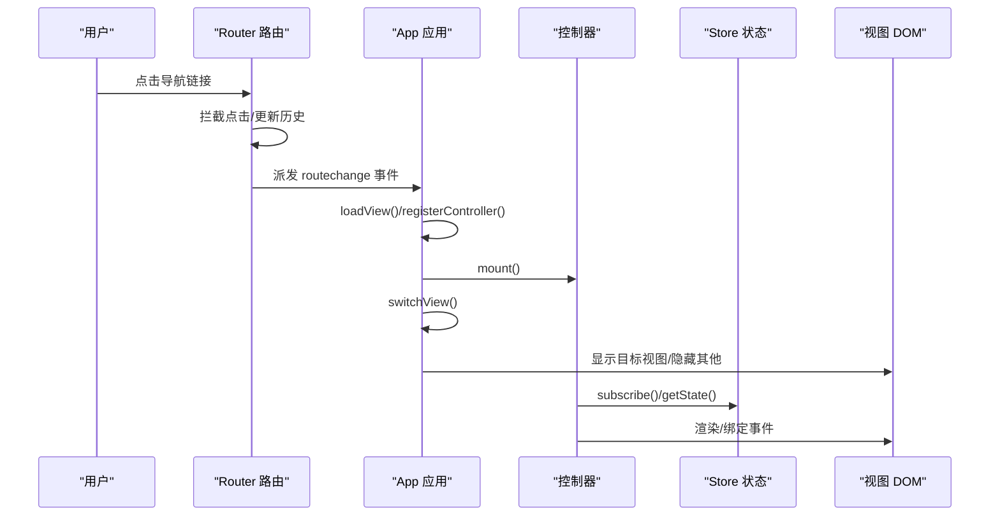
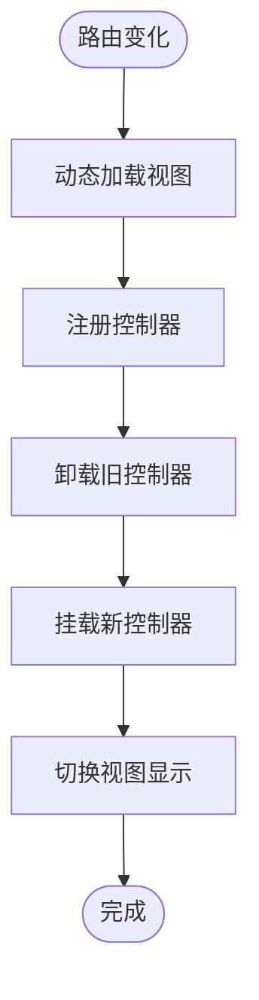
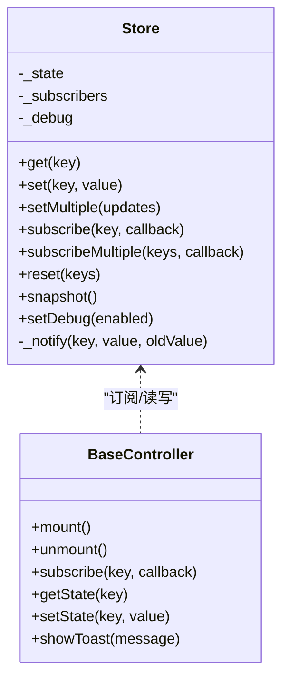
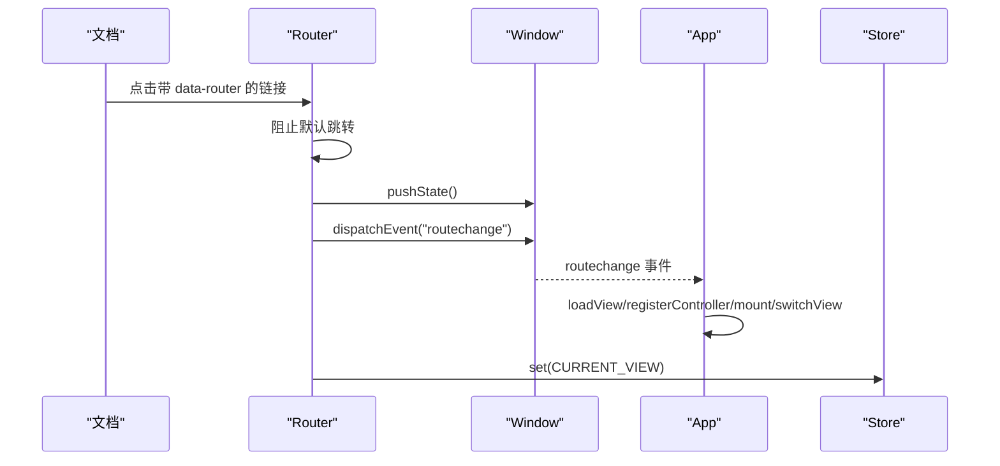
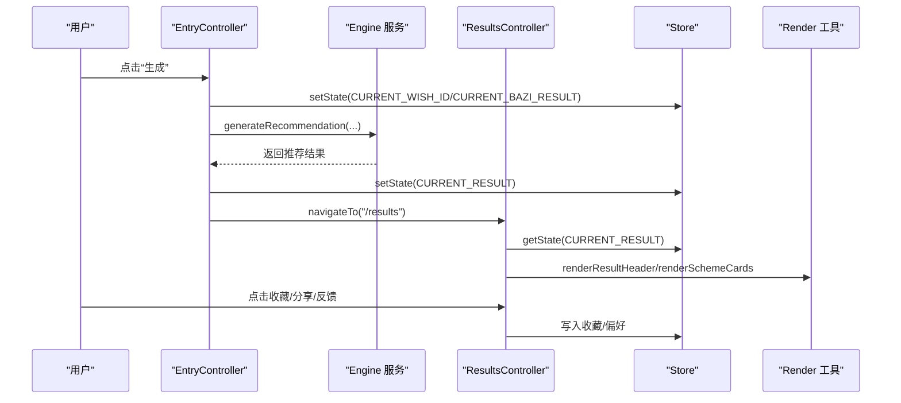
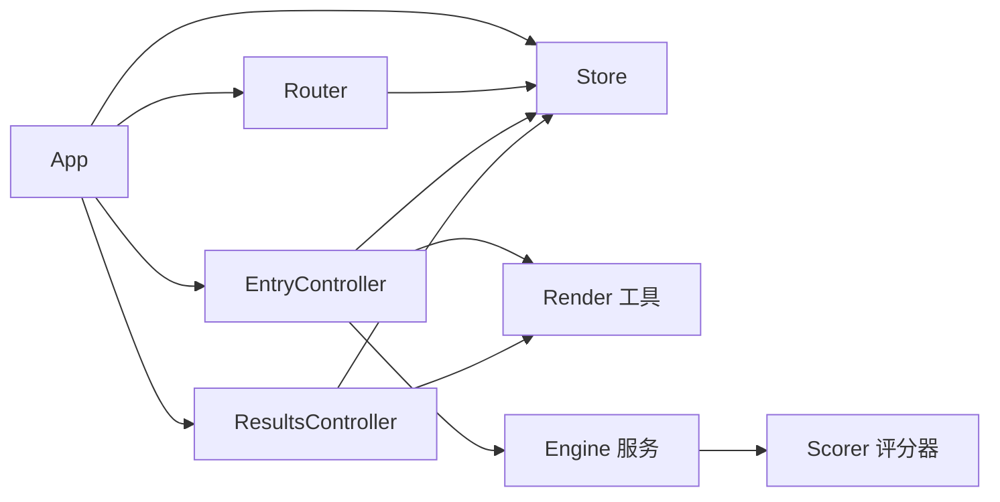

# 组件通信机制

<cite>
**本文档引用的文件**
- [js/core/app.js](file://js/core/app.js)
- [js/core/store.js](file://js/core/store.js)
- [js/core/router.js](file://js/core/router.js)
- [js/controllers/base.js](file://js/controllers/base.js)
- [js/controllers/entry.js](file://js/controllers/entry.js)
- [js/controllers/results.js](file://js/controllers/results.js)
- [js/components/base.js](file://js/components/base.js)
- [js/services/engine.js](file://js/services/engine.js)
- [js/core/scorer.js](file://js/core/scorer.js)
- [js/utils/render.js](file://js/utils/render.js)
- [views/entry.html](file://views/entry.html)
- [views/results.html](file://views/results.html)
</cite>

## 目录
1. [简介](#简介)
2. [项目结构](#项目结构)
3. [核心组件](#核心组件)
4. [架构总览](#架构总览)
5. [详细组件分析](#详细组件分析)
6. [依赖分析](#依赖分析)
7. [性能考虑](#性能考虑)
8. [故障排查指南](#故障排查指南)
9. [结论](#结论)

## 简介
本项目采用“视图控制器 + 全局状态 + 路由系统”的前端架构，围绕“组件通信”目标，重点分析以下通信模式：
- 事件系统：DOM 事件、自定义事件、全局事件（如 Toast）
- 状态管理：集中式 Store 的响应式状态、订阅/通知机制
- 路由系统：URL 同步、导航控制、视图切换
- 控制器协作：控制器生命周期、事件绑定、状态订阅
- 视图交互：组件渲染、模态框、按钮交互

## 项目结构
项目采用按职责分层的组织方式：
- 核心层：应用入口、状态管理、路由、评分器
- 控制器层：每个视图一个控制器，负责视图生命周期、事件绑定、状态订阅
- 组件层：轻量级组件，负责局部渲染与事件
- 服务层：推荐引擎、天气、八字分析等业务服务
- 工具层：渲染工具、分享、上传等辅助能力
- 视图层：静态 HTML 片段，由控制器动态挂载与渲染

图表来源
- [js/core/app.js](file://js/core/app.js#L36-L196)
- [js/core/store.js](file://js/core/store.js#L30-L187)
- [js/core/router.js](file://js/core/router.js#L25-L79)
- [js/controllers/entry.js](file://js/controllers/entry.js#L14-L241)
- [js/controllers/results.js](file://js/controllers/results.js#L13-L614)
- [js/services/engine.js](file://js/services/engine.js#L323-L393)
- [js/core/scorer.js](file://js/core/scorer.js#L14-L317)
- [js/utils/render.js](file://js/utils/render.js#L13-L487)

章节来源
- [js/core/app.js](file://js/core/app.js#L23-L73)
- [js/core/store.js](file://js/core/store.js#L30-L63)
- [js/core/router.js](file://js/core/router.js#L9-L21)

## 核心组件
- App 应用入口：统一初始化、动态视图加载、控制器注册与切换、路由事件监听、基础数据加载、统计初始化。
- Store 全局状态：集中式响应式状态，支持订阅/通知、批量设置、重置、快照与调试开关。
- Router 路由系统：拦截链接点击、处理浏览器前进后退、维护当前路由、派发路由变化事件、更新 Store。
- BaseController 控制器基类：统一生命周期（mount/unmount）、事件绑定/清理、Store 订阅/取消、状态读写、Toast 触发。
- Component 组件基类：局部组件生命周期、事件绑定/清理、状态更新与渲染。

章节来源
- [js/core/app.js](file://js/core/app.js#L36-L196)
- [js/core/store.js](file://js/core/store.js#L30-L187)
- [js/core/router.js](file://js/core/router.js#L25-L129)
- [js/controllers/base.js](file://js/controllers/base.js#L11-L131)
- [js/components/base.js](file://js/components/base.js#L9-L107)

## 架构总览
应用通过 App 协调控制器与视图，控制器通过 Store 读写状态，通过 Router 进行导航，通过服务层进行业务计算，通过渲染工具进行视图更新。

图表来源
- [js/core/router.js](file://js/core/router.js#L42-L79)
- [js/core/app.js](file://js/core/app.js#L145-L184)
- [js/controllers/base.js](file://js/controllers/base.js#L21-L42)

## 详细组件分析

### App 类：应用协调与视图切换
- 动态视图加载：按需加载视图 HTML，插入到应用容器，避免首屏负担。
- 控制器注册：将视图与控制器建立映射，延迟实例化。
- 路由事件处理：监听 routechange，卸载旧控制器，挂载新控制器，切换视图显示。
- 基础数据与统计：加载节气信息写入 Store，初始化访问统计。

图表来源
- [js/core/app.js](file://js/core/app.js#L145-L184)

章节来源
- [js/core/app.js](file://js/core/app.js#L47-L73)
- [js/core/app.js](file://js/core/app.js#L145-L184)

### Store 状态管理：响应式状态与订阅通知
- 响应式状态：通过 Proxy 拦截 set，在值变化时触发通知。
- 订阅机制：按状态键订阅，支持多键批量订阅；通知时捕获订阅者异常，保证健壮性。
- 状态读写：get/set/setMultiple/reset/snapshot/setDebug。
- 与控制器协作：控制器通过 subscribe 订阅所需状态键，onMount 后绑定事件，状态变化驱动视图更新。

图表来源
- [js/core/store.js](file://js/core/store.js#L30-L187)
- [js/controllers/base.js](file://js/controllers/base.js#L11-L131)

章节来源
- [js/core/store.js](file://js/core/store.js#L11-L25)
- [js/core/store.js](file://js/core/store.js#L99-L141)
- [js/controllers/base.js](file://js/controllers/base.js#L92-L129)

### Router 路由系统：导航与参数传递
- 链接拦截：委托监听 a[data-router]，阻止默认跳转，调用 navigateTo。
- 历史管理：pushState/replaceState，popstate 处理浏览器前进后退。
- 路由事件：派发 routechange，携带 path/route/from，供 App 切换视图。
- Store 同步：更新当前视图状态键，实现 UI 与 URL 的双向同步。

图表来源
- [js/core/router.js](file://js/core/router.js#L42-L79)
- [js/core/router.js](file://js/core/router.js#L117-L129)
- [js/core/store.js](file://js/core/store.js#L79-L81)

章节来源
- [js/core/router.js](file://js/core/router.js#L25-L50)
- [js/core/router.js](file://js/core/router.js#L57-L79)

### 控制器协作：EntryController 与 ResultsController
- EntryController
  - 生命周期：onMount 绑定事件、初始化天气组件、恢复上次输入。
  - 事件处理：场景/心愿选择、精度切换、生成推荐。
  - 状态写入：setState 写入心愿、八字、推荐结果；导航到结果页。
  - 服务调用：generateRecommendation 构建上下文并生成推荐。
- ResultsController
  - 生命周期：onMount 渲染标题、卡片、运势、天气影响、八字提示。
  - 事件处理：收藏、分享、查看详情、反馈（采纳/不喜欢）。
  - 状态读取：getState 读取当前结果；渲染详情模态框。
  - 服务调用：WeatherImpact 组件渲染天气影响；反馈写入本地存储与偏好。

图表来源
- [js/controllers/entry.js](file://js/controllers/entry.js#L131-L189)
- [js/services/engine.js](file://js/services/engine.js#L323-L393)
- [js/controllers/results.js](file://js/controllers/results.js#L20-L614)
- [js/utils/render.js](file://js/utils/render.js#L109-L132)

章节来源
- [js/controllers/entry.js](file://js/controllers/entry.js#L23-L61)
- [js/controllers/entry.js](file://js/controllers/entry.js#L131-L189)
- [js/controllers/results.js](file://js/controllers/results.js#L20-L614)

### 视图与组件交互：渲染与模态框
- 视图结构：入口页与结果页以独立 HTML 片段存在，由 App 动态加载到 .app-container。
- 渲染工具：提供 showView、renderSchemeCards、renderDetailModal、showModal/closeModal、updateUploadPreview 等。
- 组件基类：Component 提供 mount/unmount、事件绑定、状态更新与渲染，便于局部 UI 组件复用。

章节来源
- [views/entry.html](file://views/entry.html#L1-L234)
- [views/results.html](file://views/results.html#L1-L128)
- [js/utils/render.js](file://js/utils/render.js#L13-L487)
- [js/components/base.js](file://js/components/base.js#L36-L56)

## 依赖分析
- App 依赖 Router、Store、各控制器模块；负责视图加载与控制器生命周期。
- Router 依赖 Store（写入 CURRENT_VIEW），派发 routechange 事件。
- BaseController 依赖 Store；提供 subscribe/getState/ setState/showToast。
- EntryController/ResultsController 依赖 Router、Render 工具、Repository/Service。
- Engine 服务依赖 Scorer 评分器与天气/运势服务；Scorer 依赖评分配置。

图表来源
- [js/core/app.js](file://js/core/app.js#L6-L21)
- [js/core/router.js](file://js/core/router.js#L6-L7)
- [js/core/store.js](file://js/core/store.js#L6-L7)
- [js/controllers/entry.js](file://js/controllers/entry.js#L5-L12)
- [js/controllers/results.js](file://js/controllers/results.js#L5-L11)
- [js/services/engine.js](file://js/services/engine.js#L6-L12)
- [js/core/scorer.js](file://js/core/scorer.js#L6-L12)

章节来源
- [js/core/app.js](file://js/core/app.js#L6-L21)
- [js/core/router.js](file://js/core/router.js#L6-L7)
- [js/core/store.js](file://js/core/store.js#L6-L7)
- [js/controllers/entry.js](file://js/controllers/entry.js#L5-L12)
- [js/controllers/results.js](file://js/controllers/results.js#L5-L11)
- [js/services/engine.js](file://js/services/engine.js#L6-L12)
- [js/core/scorer.js](file://js/core/scorer.js#L6-L12)

## 性能考虑
- 按需加载与懒实例化：App 在路由变化时才加载视图与注册控制器，减少初始开销。
- 响应式状态最小化通知：Proxy 仅在值真正变化时触发通知，避免无效渲染。
- 事件与订阅清理：BaseController 在卸载时移除事件监听与取消订阅，防止内存泄漏。
- 渲染优化：渲染工具直接操作 DOM，卡片渲染采用批量插入；模态框显示/隐藏通过类名切换，避免频繁重建。
- 评分缓存：Scorer 内部使用 Map 缓存评分结果，避免重复计算。

章节来源
- [js/core/app.js](file://js/core/app.js#L79-L104)
- [js/core/store.js](file://js/core/store.js#L11-L25)
- [js/controllers/base.js](file://js/controllers/base.js#L35-L42)
- [js/utils/render.js](file://js/utils/render.js#L119-L132)
- [js/core/scorer.js](file://js/core/scorer.js#L20-L22)

## 故障排查指南
- 路由无法跳转
  - 检查视图是否已通过 App.loadView 加载；确认 a[data-router] 是否正确绑定事件。
  - 章节来源
    - [js/core/router.js](file://js/core/router.js#L42-L49)
    - [js/core/app.js](file://js/core/app.js#L79-L104)
- 视图不显示或切换异常
  - 确认 App.switchView 是否被 routechange 触发；检查视图 ID 与 HTML 文件路径一致。
  - 章节来源
    - [js/core/app.js](file://js/core/app.js#L174-L184)
- 状态不更新或未触发视图刷新
  - 检查控制器是否在 onMount 后 subscribe 对应状态键；确认 Store.set 是否被调用。
  - 章节来源
    - [js/controllers/base.js](file://js/controllers/base.js#L25-L27)
    - [js/core/store.js](file://js/core/store.js#L99-L110)
- 反馈与收藏未生效
  - 检查 ResultsController 的 toggleFavorite/handleFeedback 是否写入本地存储与更新按钮状态。
  - 章节来源
    - [js/controllers/results.js](file://js/controllers/results.js#L527-L566)
    - [js/controllers/results.js](file://js/controllers/results.js#L394-L462)

## 结论
本项目通过 App 协调控制器与视图，借助 Store 实现跨组件的状态共享与响应式更新，通过 Router 实现 URL 与视图的解耦导航。控制器基类提供统一的生命周期与事件/状态管理接口，渲染工具与组件基类支撑局部 UI 的高效开发与复用。整体架构清晰、职责分离明确，具备良好的扩展性与可维护性。