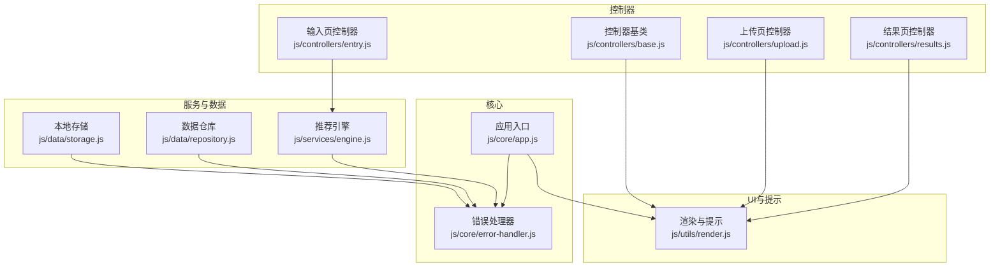
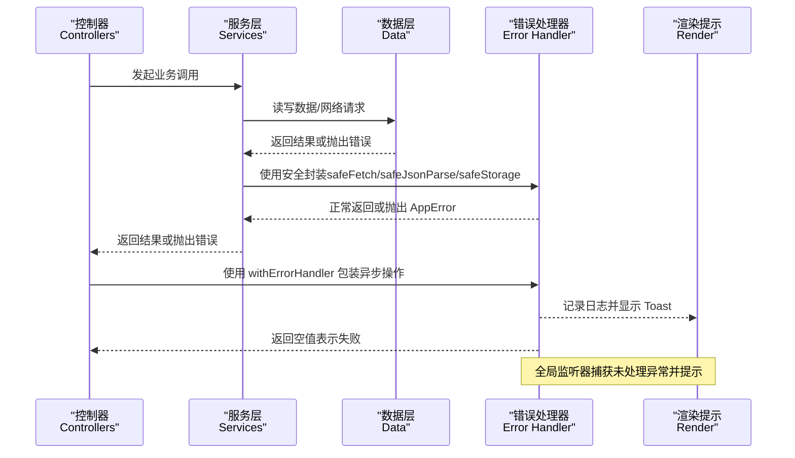
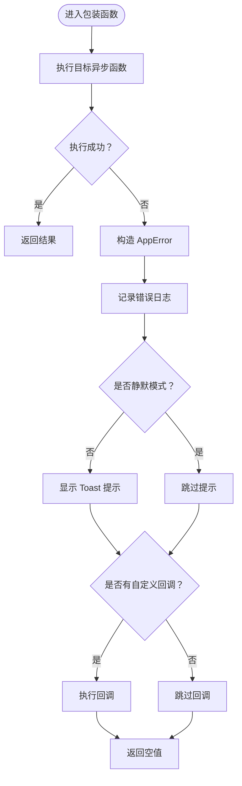
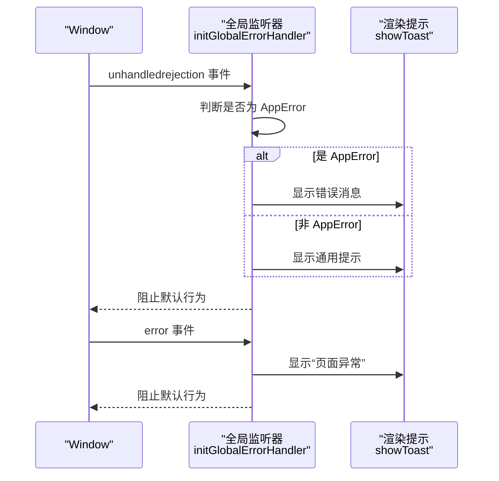
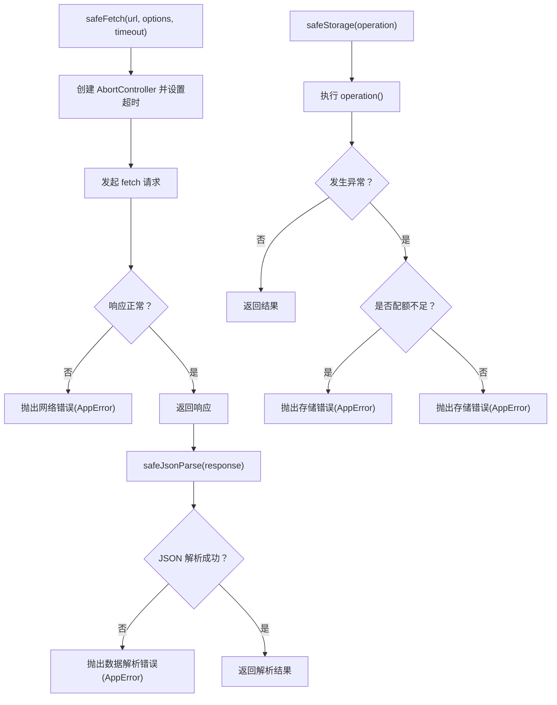
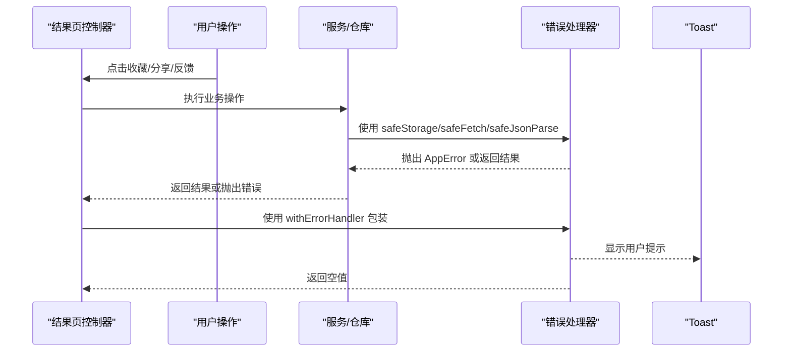
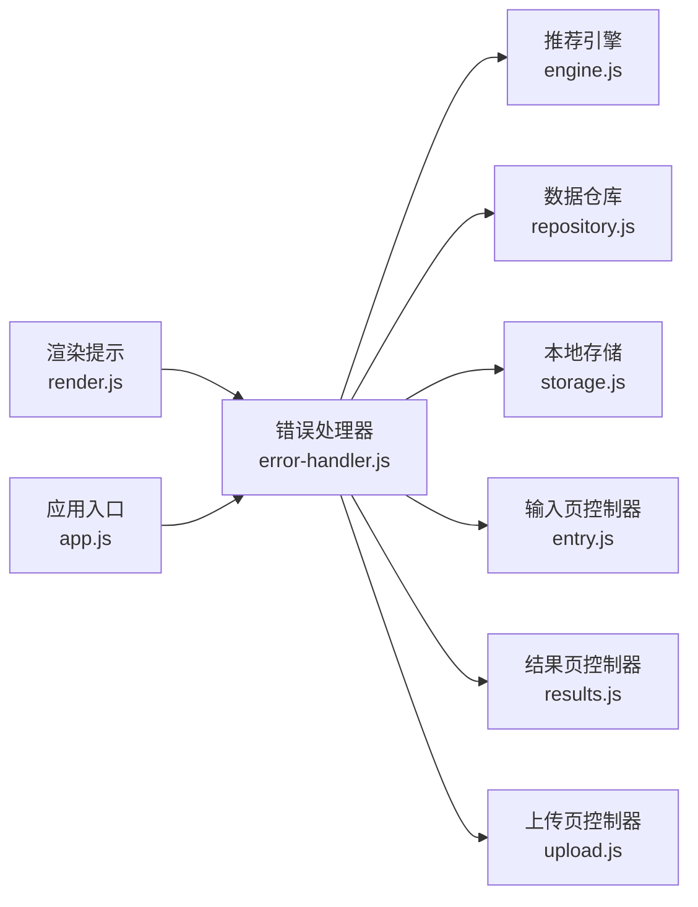

# 错误处理架构

<cite>
**本文引用的文件**
- [js/core/error-handler.js](file://js/core/error-handler.js)
- [js/core/app.js](file://js/core/app.js)
- [js/utils/render.js](file://js/utils/render.js)
- [js/controllers/base.js](file://js/controllers/base.js)
- [js/controllers/results.js](file://js/controllers/results.js)
- [js/controllers/entry.js](file://js/controllers/entry.js)
- [js/controllers/upload.js](file://js/controllers/upload.js)
- [js/services/engine.js](file://js/services/engine.js)
- [js/data/repository.js](file://js/data/repository.js)
- [js/data/storage.js](file://js/data/storage.js)
</cite>

## 目录
1. [简介](#简介)
2. [项目结构](#项目结构)
3. [核心组件](#核心组件)
4. [架构总览](#架构总览)
5. [详细组件分析](#详细组件分析)
6. [依赖分析](#依赖分析)
7. [性能考虑](#性能考虑)
8. [故障排查指南](#故障排查指南)
9. [结论](#结论)

## 简介
本文件系统性梳理“五行穿搭建议”项目的错误处理架构，重点覆盖以下方面：
- 全局错误监听与未处理异常捕获
- 错误类型体系与用户友好提示策略
- withErrorHandler 高阶函数的实现原理与使用方式
- 安全封装（网络、JSON解析、本地存储）的统一错误处理
- 在路由跳转、数据加载、用户操作等场景中的错误处理实践
- 错误日志记录、用户提示与错误恢复设计原则

## 项目结构
该项目采用模块化组织，错误处理能力集中在 core 层，并通过工具函数被各服务与控制器安全调用。关键模块如下：
- 错误处理核心：js/core/error-handler.js
- 应用入口与全局初始化：js/core/app.js
- 用户提示与UI交互：js/utils/render.js
- 控制器基类与业务控制器：js/controllers/base.js、js/controllers/*.js
- 推荐引擎与数据加载：js/services/engine.js
- 数据仓库与本地存储：js/data/repository.js、js/data/storage.js

**图表来源**
- [js/core/error-handler.js](file://js/core/error-handler.js#L1-L190)
- [js/core/app.js](file://js/core/app.js#L1-L206)
- [js/utils/render.js](file://js/utils/render.js#L455-L487)
- [js/controllers/base.js](file://js/controllers/base.js#L1-L131)
- [js/controllers/entry.js](file://js/controllers/entry.js#L1-L241)
- [js/controllers/results.js](file://js/controllers/results.js#L1-L614)
- [js/controllers/upload.js](file://js/controllers/upload.js#L1-L118)
- [js/services/engine.js](file://js/services/engine.js#L1-L425)
- [js/data/repository.js](file://js/data/repository.js#L1-L394)
- [js/data/storage.js](file://js/data/storage.js#L1-L145)

**章节来源**
- [js/core/error-handler.js](file://js/core/error-handler.js#L1-L190)
- [js/core/app.js](file://js/core/app.js#L1-L206)

## 核心组件
- 错误类型枚举与用户提示映射：定义网络、超时、数据解析、验证、存储、未知等错误类型，并提供用户友好消息。
- 应用错误类 AppError：统一承载错误类型、原始错误、时间戳等元信息。
- withErrorHandler 高阶函数：对异步函数进行统一包装，自动捕获异常、记录日志、显示提示、触发回调并返回空值表示失败。
- 安全封装：
  - safeFetch：带超时控制的 fetch 包装，区分 AbortError 与网络错误。
  - safeJsonParse：安全 JSON 解析，捕获格式错误。
  - safeStorage：安全本地存储，区分配额不足等特定错误。
- 全局错误监听：initGlobalErrorHandler 捕获未处理 Promise 拒绝与全局错误，统一提示。

**章节来源**
- [js/core/error-handler.js](file://js/core/error-handler.js#L8-L15)
- [js/core/error-handler.js](file://js/core/error-handler.js#L30-L37)
- [js/core/error-handler.js](file://js/core/error-handler.js#L45-L79)
- [js/core/error-handler.js](file://js/core/error-handler.js#L101-L133)
- [js/core/error-handler.js](file://js/core/error-handler.js#L140-L146)
- [js/core/error-handler.js](file://js/core/error-handler.js#L153-L163)
- [js/core/error-handler.js](file://js/core/error-handler.js#L168-L189)

## 架构总览
下图展示了错误处理在应用中的传播路径：从控制器发起业务调用，经服务层与数据层的安全封装，最终由 withErrorHandler 或全局监听器统一处理与反馈。

**图表来源**
- [js/controllers/entry.js](file://js/controllers/entry.js#L131-L189)
- [js/services/engine.js](file://js/services/engine.js#L60-L85)
- [js/data/repository.js](file://js/data/repository.js#L24-L41)
- [js/data/storage.js](file://js/data/storage.js#L9-L27)
- [js/core/error-handler.js](file://js/core/error-handler.js#L45-L79)
- [js/core/error-handler.js](file://js/core/error-handler.js#L101-L133)
- [js/utils/render.js](file://js/utils/render.js#L455-L487)

## 详细组件分析

### withErrorHandler 高阶函数
- 设计目标：为异步函数提供统一的错误包装，屏蔽底层异常细节，集中处理日志、提示与回调。
- 关键行为：
  - 捕获异常并构造 AppError（若非 AppError 则按传入类型与自定义消息创建）。
  - 记录错误日志（类型、消息、时间戳、原始错误、堆栈）。
  - 通过全局提示函数显示用户友好消息。
  - 触发自定义 onError 回调（如需）。
  - 返回空值表示失败，便于调用方进行失败分支处理。
- 使用方式：在控制器或服务层对关键异步操作进行包装，例如应用初始化阶段加载基础数据。

**图表来源**
- [js/core/error-handler.js](file://js/core/error-handler.js#L45-L79)
- [js/core/error-handler.js](file://js/core/error-handler.js#L84-L92)
- [js/utils/render.js](file://js/utils/render.js#L455-L487)

**章节来源**
- [js/core/error-handler.js](file://js/core/error-handler.js#L45-L79)
- [js/core/app.js](file://js/core/app.js#L122-L131)

### ErrorTypes 枚举与错误分类
- 分类与策略：
  - 网络错误：统一提示“网络连接失败，请检查网络后重试”，适用于 fetch 非 OK 响应与网络异常。
  - 超时错误：统一提示“请求超时，请稍后重试”，由 AbortController 超时触发。
  - 数据解析错误：统一提示“数据加载异常，请刷新页面”，用于 JSON 解析失败。
  - 验证错误：统一提示“输入信息有误，请检查后再试”，用于参数校验失败。
  - 存储错误：统一提示“本地存储失败，请检查浏览器设置”，并针对配额不足给出明确提示。
  - 未知错误：统一提示“操作失败，请稍后重试”，兜底策略。
- 用户反馈：通过全局 Toast 组件统一呈现，确保一致性与可感知性。

**章节来源**
- [js/core/error-handler.js](file://js/core/error-handler.js#L8-L15)
- [js/core/error-handler.js](file://js/core/error-handler.js#L18-L25)
- [js/utils/render.js](file://js/utils/render.js#L455-L487)

### initGlobalErrorHandler 初始化与全局监听
- 未处理 Promise 拒绝监听：捕获 Promise 拒绝事件，若是 AppError 则显示其消息，否则显示通用提示；阻止默认浏览器行为。
- 全局错误监听：捕获 window.error，显示“页面出现异常，请刷新后重试”并阻止默认行为。
- 作用范围：在整个应用生命周期内生效，确保任何未显式包装的异步错误都能被统一处理。

**图表来源**
- [js/core/error-handler.js](file://js/core/error-handler.js#L168-L189)
- [js/utils/render.js](file://js/utils/render.js#L455-L487)

**章节来源**
- [js/core/error-handler.js](file://js/core/error-handler.js#L168-L189)

### 安全封装：网络、解析与存储
- safeFetch：
  - 使用 AbortController 控制超时，超时抛出超时错误。
  - 对非 OK 响应抛出网络错误。
  - 对其他错误进行类型判断并抛出对应 AppError。
- safeJsonParse：
  - 包裹 response.json()，解析失败抛出数据解析错误。
- safeStorage：
  - 包裹任意存储操作，捕获配额不足等特定错误并转换为存储错误。

**图表来源**
- [js/core/error-handler.js](file://js/core/error-handler.js#L101-L133)
- [js/core/error-handler.js](file://js/core/error-handler.js#L140-L146)
- [js/core/error-handler.js](file://js/core/error-handler.js#L153-L163)

**章节来源**
- [js/core/error-handler.js](file://js/core/error-handler.js#L101-L133)
- [js/core/error-handler.js](file://js/core/error-handler.js#L140-L146)
- [js/core/error-handler.js](file://js/core/error-handler.js#L153-L163)

### 应用初始化中的错误处理实践
- 应用入口在初始化阶段调用全局错误监听器，确保整个生命周期内的异常被捕获。
- 加载基础数据时使用 withErrorHandler 包装异步函数，传入网络错误类型与自定义消息，保证失败时的用户提示与日志记录。

**章节来源**
- [js/core/app.js](file://js/core/app.js#L48-L49)
- [js/core/app.js](file://js/core/app.js#L122-L131)

### 路由跳转与导航中的错误处理
- 控制器在处理用户交互时，通过导航函数进行路由跳转；若跳转过程出现异常，由全局监听器兜底处理。
- 控制器基类提供统一的事件绑定与解绑机制，避免重复绑定导致的异常链复杂化。

**章节来源**
- [js/controllers/base.js](file://js/controllers/base.js#L72-L85)
- [js/controllers/results.js](file://js/controllers/results.js#L260-L298)
- [js/controllers/entry.js](file://js/controllers/entry.js#L67-L102)

### 数据加载与用户操作中的错误处理
- 推荐引擎在加载方案、心愿模板与八字模板时，使用安全封装进行网络请求与 JSON 解析，确保异常被统一转换为 AppError。
- 数据仓库与本地存储通过 safeStorage 包裹，对存储异常进行分类与提示。
- 控制器在用户操作（收藏、分享、上传、反馈）中，若发生异常，统一通过 Toast 提示用户并记录日志。

**图表来源**
- [js/controllers/results.js](file://js/controllers/results.js#L527-L548)
- [js/controllers/results.js](file://js/controllers/results.js#L568-L594)
- [js/services/engine.js](file://js/services/engine.js#L60-L85)
- [js/data/repository.js](file://js/data/repository.js#L24-L41)
- [js/data/storage.js](file://js/data/storage.js#L9-L27)
- [js/core/error-handler.js](file://js/core/error-handler.js#L45-L79)
- [js/utils/render.js](file://js/utils/render.js#L455-L487)

**章节来源**
- [js/services/engine.js](file://js/services/engine.js#L60-L85)
- [js/data/repository.js](file://js/data/repository.js#L24-L41)
- [js/data/storage.js](file://js/data/storage.js#L9-L27)
- [js/controllers/results.js](file://js/controllers/results.js#L527-L548)
- [js/controllers/results.js](file://js/controllers/results.js#L568-L594)

## 依赖分析
- 错误处理器被广泛依赖于服务层与数据层，形成“安全封装—统一错误—用户提示”的闭环。
- 控制器通过 withErrorHandler 与全局监听器获得一致的错误体验。
- 渲染模块仅负责用户提示，不承担错误分类逻辑，职责清晰。

**图表来源**
- [js/core/error-handler.js](file://js/core/error-handler.js#L1-L190)
- [js/services/engine.js](file://js/services/engine.js#L1-L425)
- [js/data/repository.js](file://js/data/repository.js#L1-L394)
- [js/data/storage.js](file://js/data/storage.js#L1-L145)
- [js/controllers/entry.js](file://js/controllers/entry.js#L1-L241)
- [js/controllers/results.js](file://js/controllers/results.js#L1-L614)
- [js/controllers/upload.js](file://js/controllers/upload.js#L1-L118)
- [js/utils/render.js](file://js/utils/render.js#L455-L487)
- [js/core/app.js](file://js/core/app.js#L1-L206)

**章节来源**
- [js/core/error-handler.js](file://js/core/error-handler.js#L1-L190)
- [js/utils/render.js](file://js/utils/render.js#L455-L487)
- [js/core/app.js](file://js/core/app.js#L1-L206)

## 性能考虑
- withErrorHandler 的开销主要来自异常捕获与日志记录，属于低频事件，对性能影响可忽略。
- safeFetch 的超时控制通过 AbortController 实现，避免长时间占用资源。
- 建议：
  - 在高频操作中谨慎使用静默模式（silent），以减少不必要的 UI 提示。
  - 对于批量数据加载，优先使用并发控制与错误聚合，避免大量独立错误提示造成干扰。

## 故障排查指南
- 网络错误定位：检查 safeFetch 的响应状态与超时设置，确认服务端可达性与跨域配置。
- 数据解析错误：核对 JSON 数据格式与字段完整性，必要时在 safeJsonParse 处增加更详细的错误上下文。
- 存储错误定位：关注浏览器隐私模式、存储配额限制与权限问题，结合 safeStorage 的错误类型进行针对性提示。
- 全局异常排查：启用 initGlobalErrorHandler 后，所有未处理异常都会被拦截并提示；可通过日志中的时间戳与堆栈定位问题来源。
- 用户反馈：通过 Toast 提示与日志记录快速复现问题场景，结合 withErrorHandler 的自定义回调进行二次处理。

**章节来源**
- [js/core/error-handler.js](file://js/core/error-handler.js#L101-L133)
- [js/core/error-handler.js](file://js/core/error-handler.js#L140-L146)
- [js/core/error-handler.js](file://js/core/error-handler.js#L153-L163)
- [js/core/error-handler.js](file://js/core/error-handler.js#L168-L189)

## 结论
本项目通过“错误类型枚举 + AppError + withErrorHandler + 安全封装 + 全局监听”的组合，构建了统一、可扩展且用户友好的错误处理体系。该架构在路由跳转、数据加载与用户操作等关键路径上提供了稳定可靠的错误兜底，既保障了用户体验，也为开发调试提供了清晰的日志与提示线索。建议在后续迭代中持续完善错误分类与提示文案，增强错误恢复能力与可观测性。