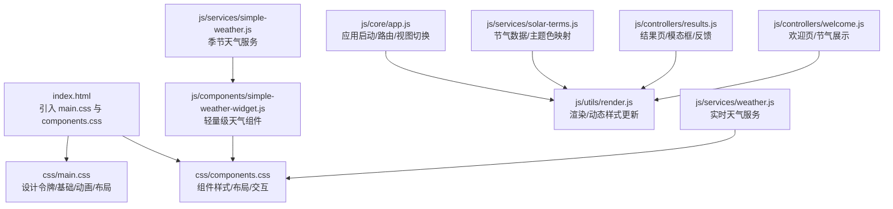
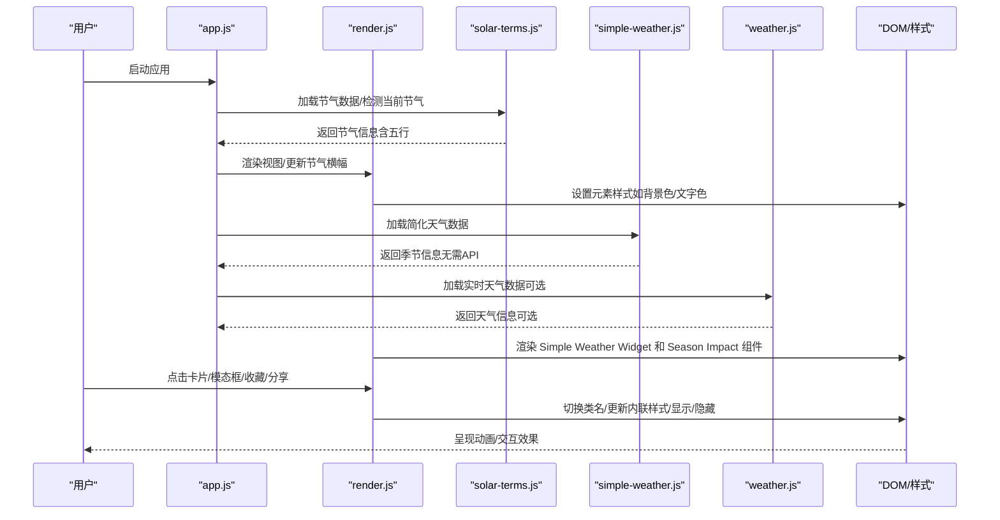
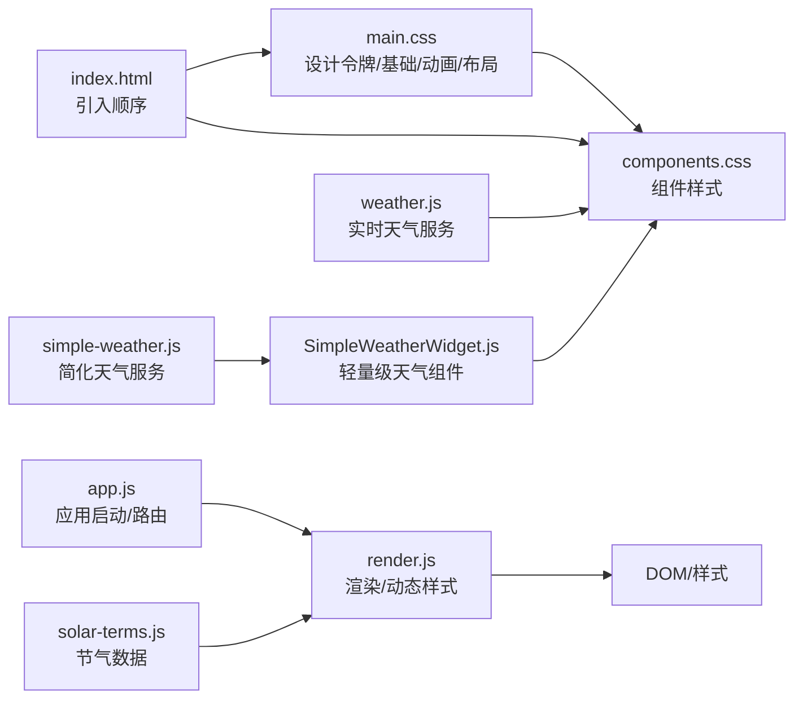

# 样式系统

<cite>
**本文引用的文件**
- [main.css](file://css/main.css)
- [components.css](file://css/components.css)
- [index.html](file://index.html)
- [app.js](file://js/core/app.js)
- [render.js](file://js/utils/render.js)
- [solar-terms.js](file://js/services/solar-terms.js)
- [results.js](file://js/controllers/results.js)
- [welcome.js](file://js/controllers/welcome.js)
- [simple-weather-widget.js](file://js/components/simple-weather-widget.js)
- [simple-weather.js](file://js/services/simple-weather.js)
- [weather.js](file://js/services/weather.js)
- [results.html](file://views/results.html)
</cite>

## 目录
1. [简介](#简介)
2. [项目结构](#项目结构)
3. [核心组件](#核心组件)
4. [架构总览](#架构总览)
5. [详细组件分析](#详细组件分析)
6. [新增组件：Simple Weather Widget 和 Season Impact](#新增组件simple-weather-widget-和-season-impact)
7. [依赖关系分析](#依赖关系分析)
8. [性能考量](#性能考量)
9. [故障排查指南](#故障排查指南)
10. [结论](#结论)
11. [附录](#附录)

## 简介
本文件系统性梳理"五行穿搭建议"项目的样式系统，围绕 CSS 架构与设计体系展开，重点覆盖：
- 主样式文件 main.css 的设计令牌、基础样式、动画与布局规范
- 组件样式文件 components.css 的模块化组织、样式隔离与复用策略
- 响应式设计的断点与移动端适配
- CSS 变量系统（主题变量、色彩系统、尺寸规范）
- 样式扩展指南（新增组件、自定义主题、一致性维护）
- 样式与 JavaScript 的交互机制与动态样式更新策略
- **新增内容**：Simple Weather Widget 和 Season Impact 组件的专用样式规则与渐变背景实现

## 项目结构
样式系统由两个核心 CSS 文件与一个入口 HTML 组成：
- 入口 HTML 引入 main.css 与 components.css，确保设计令牌与组件样式按序加载
- main.css 定义设计令牌与基础样式，components.css 提供组件级样式与布局

**图表来源**
- [index.html](file://index.html#L13-L15)
- [main.css](file://css/main.css#L1-L130)
- [components.css](file://css/components.css#L1-L100)
- [app.js](file://js/core/app.js#L1-L206)
- [render.js](file://js/utils/render.js#L1-L487)
- [solar-terms.js](file://js/services/solar-terms.js#L1-L115)
- [results.js](file://js/controllers/results.js#L1-L614)
- [welcome.js](file://js/controllers/welcome.js#L1-L134)
- [simple-weather-widget.js](file://js/components/simple-weather-widget.js#L1-L81)
- [simple-weather.js](file://js/services/simple-weather.js#L1-L173)
- [weather.js](file://js/services/weather.js#L1-L340)

**章节来源**
- [index.html](file://index.html#L1-L79)

## 核心组件
本项目采用"设计令牌 + 基础样式 + 组件样式"的三层结构：
- 设计令牌层：集中于 :root，统一管理色彩、字体、字号、行高、间距、圆角、阴影、动画、Z-Index、断点等
- 基础样式层：重置、排版、表单、可访问性、滚动条、选择高亮、工具类
- 组件样式层：按钮、场景标签、方案卡片、模态框、图表、天气组件、表单、日历等

**章节来源**
- [main.css](file://css/main.css#L1-L130)
- [main.css](file://css/main.css#L131-L503)
- [main.css](file://css/main.css#L504-L823)
- [components.css](file://css/components.css#L1-L2102)

## 架构总览
样式系统通过 CSS 变量驱动主题与一致性，配合 JavaScript 在运行时进行动态样式更新与视图切换。

**图表来源**
- [app.js](file://js/core/app.js#L122-L131)
- [render.js](file://js/utils/render.js#L59-L76)
- [solar-terms.js](file://js/services/solar-terms.js#L33-L100)
- [simple-weather.js](file://js/services/simple-weather.js#L78-L117)
- [weather.js](file://js/services/weather.js#L119-L138)

## 详细组件分析

### 设计令牌与主题系统
- 主题色映射：:root 定义五行为基础的主题色与渐变，同时提供 --theme-primary 等映射变量，便于按节气动态切换
- 动态切换策略：JavaScript 通过设置元素或根节点的 CSS 变量，实现主题色随节气变化
- 一致性保障：所有组件样式优先引用 --color-*、--text-*、--space-*、--radius-*、--shadow-*、--duration-* 等变量

**章节来源**
- [main.css](file://css/main.css#L5-L130)
- [render.js](file://js/utils/render.js#L78-L104)
- [solar-terms.js](file://js/services/solar-terms.js#L105-L114)

### 基础样式与可访问性
- 重置与排版：统一盒模型、去除默认边距；标题族与段落间距遵循设计令牌
- 表单控件：输入框、选择器、文本域具备一致的过渡与聚焦样式
- 可访问性：:focus-visible 提供高对比度焦点环；.sr-only 用于屏幕阅读器专用文本
- 工具类：.hidden/.invisible/.text-center/.text-muted 等通用工具类

**章节来源**
- [main.css](file://css/main.css#L135-L297)

### 动画与交互动效
- 关键帧：fadeIn、fadeInUp、fadeInScale、slideInRight、slideInLeft、shimmer、pulse、spin、bounce
- 视图过渡：.view 使用淡入动画
- 卡片交错：.scheme-card 子元素按索引延迟出现
- 模态框：.modal-backdrop 与 .modal-content 分别执行淡入与缩放入场
- 按钮波纹：.btn::after 实现点击扩散效果
- 减少动效：prefers-reduced-motion 媒体查询下缩短动画时长

**章节来源**
- [main.css](file://css/main.css#L302-L493)

### 布局系统与响应式
- 视图容器：.view 提供统一内边距与纵向布局
- 欢迎页：.welcome-content 居中布局，移动端标题字号自适应
- 方案卡片网格：在桌面端使用 CSS Grid 实现三列布局
- 固定元素：免责声明栏与隐私徽章使用固定定位与 z-index 管理层级
- 断点预留：:root 中预留断点变量，main.css 已实现 768px 与 1024px 的媒体查询

**章节来源**
- [main.css](file://css/main.css#L509-L823)

### 组件样式模块化与命名约定
- 命名风格：采用 BEM 风格（块-元素-修饰符），如 .scheme-card、.scheme-keyword、.scheme-card:hover
- 样式隔离：每个组件块独立定义，避免跨组件污染
- 复用策略：通过变量与工具类（如 .btn、.hidden、.text-muted）在多处复用
- 交互状态：active、disabled、hidden 等状态类明确表达组件状态

**章节来源**
- [components.css](file://css/components.css#L1-L2102)

### 典型组件示例

#### 按钮系统
- 基础按钮：.btn、.btn-primary、.btn-secondary、.btn-danger、.btn-ghost
- 规格变体：.btn-large、.btn-icon
- 交互反馈：hover、active 状态下的颜色与阴影变化

**章节来源**
- [components.css](file://css/components.css#L5-L96)

#### 场景标签与心愿标签
- 场景标签：.scene-section、.scene-tags、.scene-tag、.scene-tag.active
- 心愿标签：.wish-categories、.wish-tag、.wish-tag.active
- 五行动态色：不同场景标签 hover 时对应五行色系

**章节来源**
- [components.css](file://css/components.css#L98-L242)

#### 方案卡片
- 结构：.scheme-card、.scheme-keywords、.scheme-actions、.scheme-feedback
- 类型标签：.type-best、.type-alternative、.type-balance、.type-supplement
- 解释面板：.scheme-explanation、.explanation-toggle、.explanation-content
- 收藏/分享/详情：.scheme-favorite-btn、.scheme-share-btn、.scheme-detail-btn

**章节来源**
- [components.css](file://css/components.css#L244-L466)

#### 模态框与反馈
- 模态框：.modal、.modal-content、.modal-header、.modal-body、.modal-close
- 反馈弹窗：.feedback-modal、.feedback-options、.feedback-option
- 采纳/不喜欢：.feedback-btn.adopted、.feedback-btn.disliked

**章节来源**
- [components.css](file://css/components.css#L879-L525)

#### 图表与可视化
- 雷达图：.wuxing-radar、.radar-svg、.radar-label.active
- 柱状图：.bar-chart、.bar-item、.bar-fill
- 饼图：.pie-chart、.pie-slice、.pie-legend
- 趋势图：.trend-chart、.trend-line、.trend-point

**章节来源**
- [components.css](file://css/components.css#L1024-L1287)

#### 天气组件
- .weather-widget、.weather-main、.weather-info、.weather-details
- 影响提示：.weather-impact、.impact-text
- 预报列表：.weather-forecast、.forecast-list、.forecast-item
- **新增**：简化版天气组件 .simple-weather-widget 与 .simple-weather-main

**章节来源**
- [components.css](file://css/components.css#L1296-L1483)
- [components.css](file://css/components.css#L1598-L1653)

#### 日历与时间线
- 日历：.calendar-grid、.calendar-day、.calendar-day.is-today、.calendar-day.has-record
- 时间线：.timeline-list、.timeline-item、.timeline-date、.timeline-content

**章节来源**
- [components.css](file://css/components.css#L1626-L1696)

#### 数据管理面板
- .data-manager-panel、.overview-stat、.data-item、.data-actions
- 导入区域：.import-zone、.data-notice

**章节来源**
- [components.css](file://css/components.css#L1743-L1860)

#### 分享菜单
- .share-menu、.share-menu-content、.share-option、.share-cancel

**章节来源**
- [components.css](file://css/components.css#L1861-L1950)

#### 表单与选择器
- 表单组：.form-group、.form-label、.form-input、.form-textarea
- 情绪选择器：.mood-selector、.mood-btn、.mood-btn.active
- 小按钮：.btn-small

**章节来源**
- [components.css](file://css/components.css#L1976-L2102)

### 样式与 JavaScript 的交互机制

#### 动态样式更新
- 节气横幅：renderSolarBanner 根据当前节气设置 .solar-term-element 的背景色与文字色
- 方案卡片：createSchemeCard 动态设置 .scheme-color-bar 的颜色
- 收藏状态：toggleFavorite 切换 .scheme-favorite-btn 的 active 类与 SVG 填充
- **新增**：Simple Weather Widget 通过内联样式应用季节渐变背景

**章节来源**
- [render.js](file://js/utils/render.js#L59-L104)
- [render.js](file://js/utils/render.js#L137-L201)
- [results.js](file://js/controllers/results.js#L527-L566)
- [simple-weather-widget.js](file://js/components/simple-weather-widget.js#L30-L47)

#### 视图切换与显示控制
- app.js 在路由变化时调用 switchView，通过 .hidden 控制视图显隐
- render.js 提供 showView、showModal、closeModal 等工具方法

**章节来源**
- [app.js](file://js/core/app.js#L174-L184)
- [render.js](file://js/utils/render.js#L13-L21)
- [render.js](file://js/utils/render.js#L386-L403)

#### 动画与过渡
- main.css 定义了多种动画与过渡，配合 JavaScript 的类名切换实现流畅交互

**章节来源**
- [main.css](file://css/main.css#L302-L493)

## 新增组件：Simple Weather Widget 和 Season Impact

### Simple Weather Widget 组件

Simple Weather Widget 是一个轻量级的天气组件，基于当前季节和节气信息提供穿搭建议，无需外部 API 调用。

#### 样式特点
- **渐变背景**：使用线性渐变背景，根据季节自动调整颜色方案
- **简洁布局**：采用左右布局，左侧显示天气图标和季节信息，右侧显示材质和颜色标签
- **响应式设计**：在移动设备上自动调整内边距和字体大小
- **动态样式**：通过内联样式实时应用季节渐变背景和文字颜色

#### 核心样式类
- `.simple-weather-widget`：主容器，包含圆角、阴影和渐变背景
- `.simple-weather-main`：主要信息区域，包含天气图标和文本
- `.simple-weather-icon`：天气图标，使用较大的字体大小
- `.simple-weather-info`：包含季节名称和温度范围的文本区域
- `.simple-weather-season`：季节名称，使用加粗字体
- `.simple-weather-temp`：温度范围，使用半透明文字
- `.simple-weather-term`：当前节气，使用圆角标签样式
- `.simple-weather-tags`：材质和颜色标签容器
- `.simple-tag`：材质和颜色标签，使用半透明背景

#### 渐变背景系统
组件使用预定义的季节渐变背景：
- 春季：`linear-gradient(135deg, #a8edea 0%, #fed6e3 100%)`
- 夏季：`linear-gradient(135deg, #667eea 0%, #764ba2 100%)`
- 秋季：`linear-gradient(135deg, #f093fb 0%, #f5576c 100%)`
- 冬季：`linear-gradient(135deg, #e0c3fc 0%, #8ec5fc 100%)`

#### JavaScript 集成
组件通过 `getSeasonStyle()` 服务函数获取样式配置，并在渲染时应用到容器元素的内联样式中。

**章节来源**
- [components.css](file://css/components.css#L1598-L1653)
- [simple-weather-widget.js](file://js/components/simple-weather-widget.js#L1-L81)
- [simple-weather.js](file://js/services/simple-weather.js#L140-L149)

### Season Impact 组件

Season Impact 组件用于显示季节对穿搭方案的适配度加分提示，增强用户体验的即时反馈。

#### 样式特点
- **渐变提示条**：使用彩虹渐变背景，提供视觉吸引力
- **紧凑布局**：采用水平布局，包含图标、文本和详细信息
- **圆角设计**：使用全圆角样式，营造柔和的视觉效果
- **响应式文本**：使用较大的字体大小，确保在移动设备上的可读性

#### 核心样式类
- `.season-impact`：主容器，包含渐变背景、圆角和内边距
- `.impact-icon`：提示图标，使用较小的字体大小
- `.impact-text`：主要提示文本，使用加粗字体
- `.impact-detail`：详细信息，使用半透明文字右对齐

#### 渐变背景系统
组件使用彩虹渐变背景：
- `linear-gradient(135deg, #a8edea 0%, #fed6e3 100%)`

#### JavaScript 集成
组件接收 `season` 和 `boost` 参数，在渲染时根据季节和加分值动态生成提示内容。

**章节来源**
- [components.css](file://css/components.css#L1655-L1665)
- [simple-weather-widget.js](file://js/components/simple-weather-widget.js#L60-L80)

### 在结果页面中的集成

Simple Weather Widget 和 Season Impact 组件在结果页面中发挥重要作用：

#### HTML 结构
- `#weather-impact-container`：用于渲染天气影响提示
- 组件通过 JavaScript 动态插入到指定容器中

#### 渲染流程
1. 应用启动时加载节气数据
2. 获取简化天气信息（无需 API）
3. 渲染 Simple Weather Widget 组件
4. 计算季节适配度加分并渲染 Season Impact 组件
5. 更新 DOM 中的相应容器

**章节来源**
- [results.html](file://views/results.html#L67-L68)
- [simple-weather-widget.js](file://js/components/simple-weather-widget.js#L50-L54)
- [simple-weather.js](file://js/services/simple-weather.js#L78-L117)

## 依赖关系分析

**图表来源**
- [index.html](file://index.html#L13-L15)
- [main.css](file://css/main.css#L1-L130)
- [components.css](file://css/components.css#L1-L100)
- [app.js](file://js/core/app.js#L1-L206)
- [render.js](file://js/utils/render.js#L1-L487)
- [solar-terms.js](file://js/services/solar-terms.js#L1-L115)
- [simple-weather.js](file://js/services/simple-weather.js#L1-L173)
- [simple-weather-widget.js](file://js/components/simple-weather-widget.js#L1-L81)
- [weather.js](file://js/services/weather.js#L1-L340)

**章节来源**
- [index.html](file://index.html#L1-L79)
- [main.css](file://css/main.css#L1-L823)
- [components.css](file://css/components.css#L1-L2102)

## 性能考量
- CSS 变量减少重复定义，提高主题切换性能
- 动画使用 GPU 加速的关键帧（transform/opacity），避免频繁重排
- 媒体查询仅在必要断点生效，避免过度嵌套
- 组件样式按需加载，减少无关规则对页面的影响
- **新增**：Simple Weather Widget 使用内联样式而非额外 CSS 类，减少样式计算开销
- **新增**：简化天气服务使用缓存机制，避免重复计算

## 故障排查指南
- 主题色未生效：检查 :root 中 --theme-primary 是否被正确设置，确认 JavaScript 是否在渲染时写入对应 CSS 变量
- 动画异常：检查是否启用 prefers-reduced-motion，或是否存在第三方样式覆盖
- 模态框无法关闭：确认 .modal.hidden 类是否正确切换，事件绑定是否重复
- 响应式布局错乱：核对媒体查询断点与容器宽度，避免内联样式覆盖
- **新增**：Simple Weather Widget 无数据显示：检查 `getSimpleWeather()` 服务函数是否正确返回数据
- **新增**：Season Impact 组件不显示：确认传入的 `season` 和 `boost` 参数是否有效

## 结论
本样式系统以 CSS 变量为核心，结合 BEM 命名与模块化组件，实现了高度一致且可扩展的设计体系。通过 JavaScript 的动态样式更新与视图切换，进一步增强了交互体验与主题灵活性。

**新增的 Simple Weather Widget 和 Season Impact 组件**为系统增添了轻量级天气功能，无需外部 API 调用即可提供季节性穿搭建议。这些组件采用渐变背景和响应式设计，与整体设计系统保持一致，同时通过内联样式优化了性能表现。

建议在新增组件时严格遵循命名约定与变量使用规范，确保样式一致性与可维护性。

## 附录

### 响应式断点与移动端适配
- 已实现断点：768px（平板）、1024px（桌面）
- 适配策略：视图容器在平板以上居中并增大最大宽度；方案卡片在桌面端使用网格布局
- **新增**：Simple Weather Widget 在移动设备上自动调整内边距和字体大小

**章节来源**
- [main.css](file://css/main.css#L797-L823)
- [components.css](file://css/components.css#L1598-L1653)

### CSS 变量清单（节选）
- 色彩：--color-wood/-light/-dark/-bg/-gradient、--color-fire/-earth/-metal/-water、--theme-primary 系列
- 字体：--font-display/-body/-mono
- 文本：--text-xs/-sm/-base/-lg/-xl/-2xl/-3xl/-4xl
- 行高：--leading-tight/-normal/-relaxed
- 间距：--space-1/-2/-3/-4/-5/-6/-8/-10/-12/-16
- 圆角：--radius-sm/-md/-lg/-xl/-full
- 阴影：--shadow-sm/-md/-lg/-xl
- 动画：--duration-fast/-normal/-slow、--ease-out/-in-out/-spring
- Z-Index：--z-base/-dropdown/-sticky/-modal/-toast
- 断点：--bp-sm/-md/-lg（预留）

**章节来源**
- [main.css](file://css/main.css#L5-L130)

### 样式扩展指南
- 新增组件样式：在 components.css 中新增块级选择器，使用 .组件名、.组件名__元素、.组件名--修饰符 的命名
- 自定义主题：在 :root 中新增 --color-* 变量，并在组件中引用；通过 JavaScript 设置根节点 CSS 变量实现动态切换
- 维护一致性：优先使用设计令牌变量，避免硬编码颜色与尺寸；统一动画时长与缓动曲线
- **新增**：轻量级组件开发：使用内联样式替代额外 CSS 类，减少样式计算开销

### 最佳实践建议
- 使用 CSS 变量集中管理设计令牌，避免散落的硬编码值
- 为交互状态提供明确的类名与视觉反馈
- 在复杂组件中拆分子元素，使用 BEM 命名，提升可读性与可维护性
- 对动画与过渡进行性能评估，避免不必要的重绘与回流
- **新增**：合理使用内联样式：仅在需要动态计算的样式属性时使用内联样式
- **新增**：缓存机制：对于计算密集型样式，考虑使用缓存机制避免重复计算