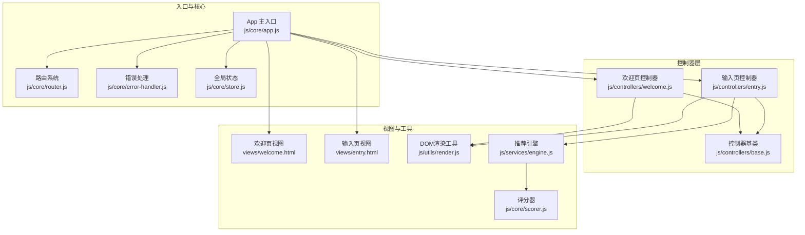
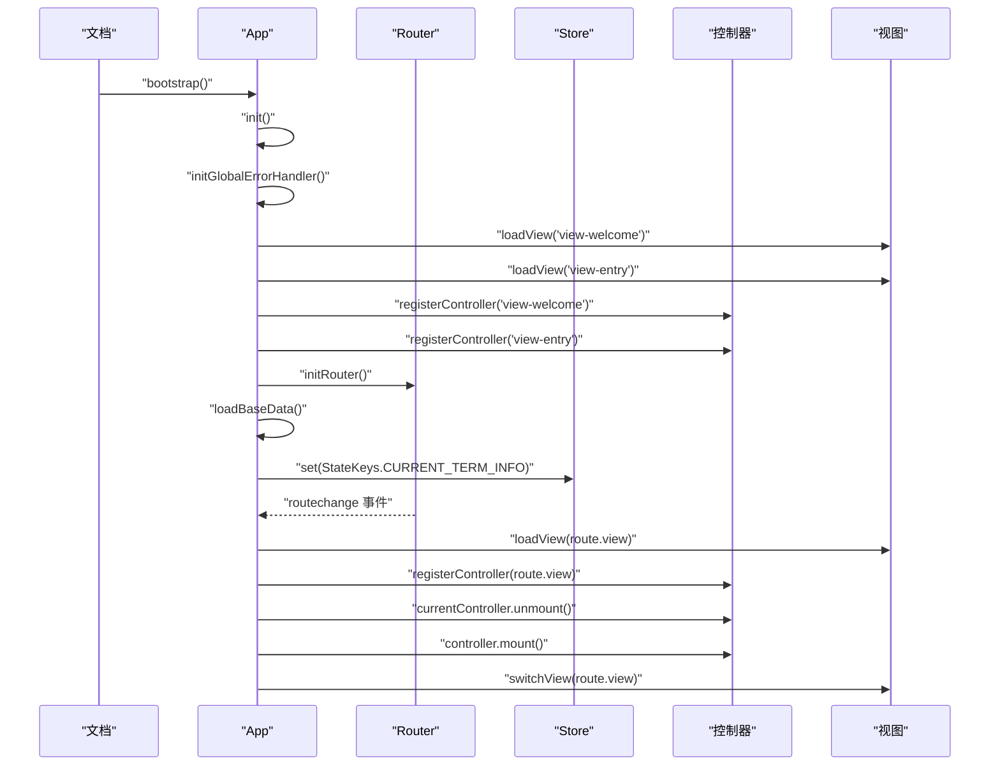
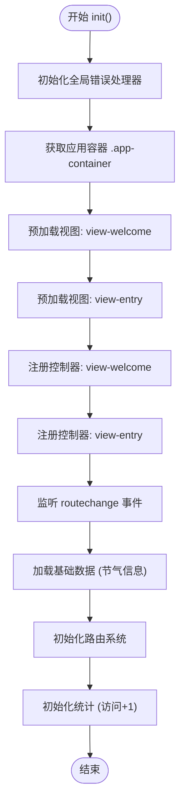
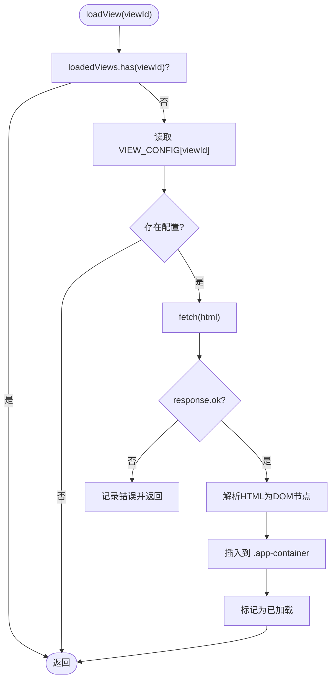
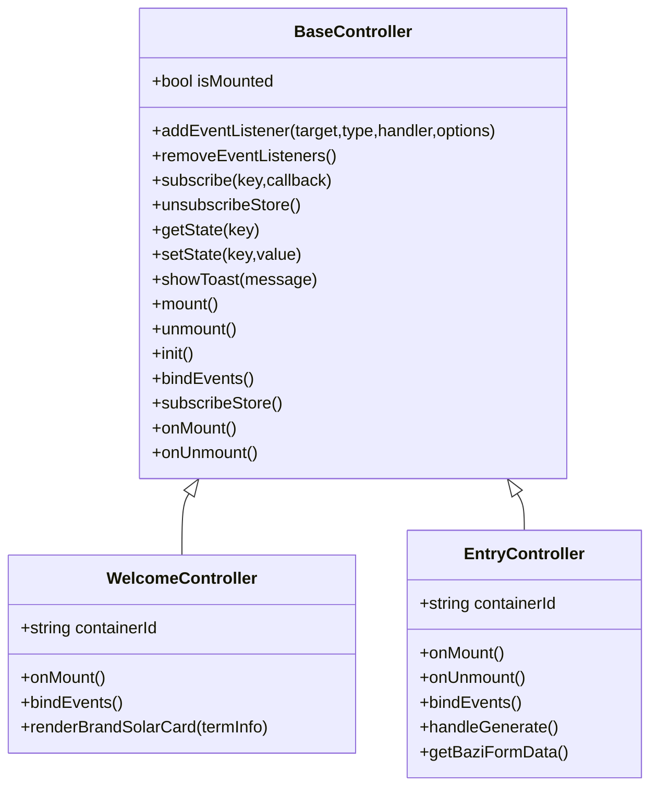
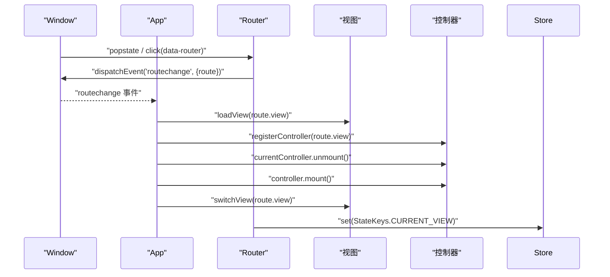
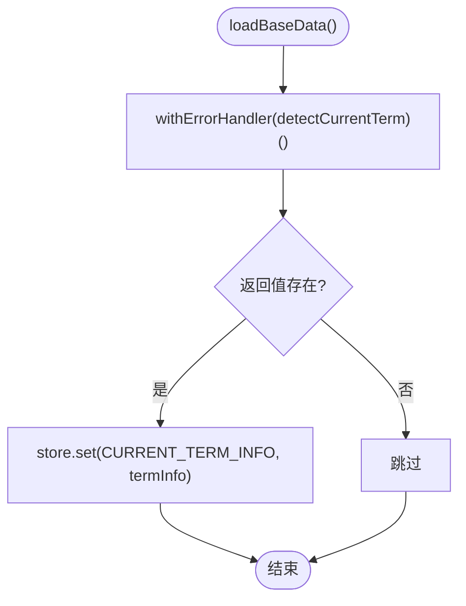
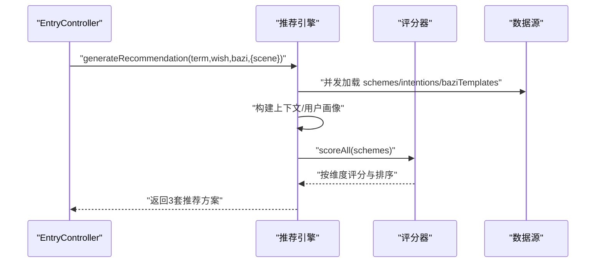
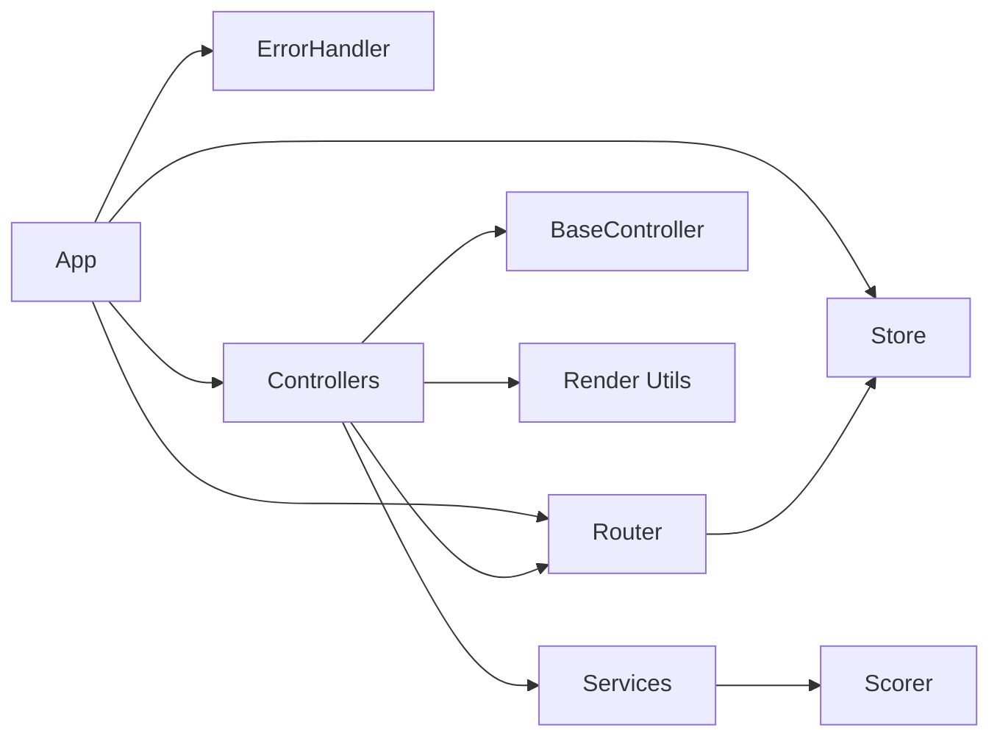

# App主入口

<cite>
**本文档引用的文件**
- [js/core/app.js](file://js/core/app.js)
- [js/core/router.js](file://js/core/router.js)
- [js/core/error-handler.js](file://js/core/error-handler.js)
- [js/core/store.js](file://js/core/store.js)
- [js/controllers/base.js](file://js/controllers/base.js)
- [js/controllers/welcome.js](file://js/controllers/welcome.js)
- [js/controllers/entry.js](file://js/controllers/entry.js)
- [js/utils/render.js](file://js/utils/render.js)
- [js/services/engine.js](file://js/services/engine.js)
- [js/core/scorer.js](file://js/core/scorer.js)
- [index.html](file://index.html)
- [views/welcome.html](file://views/welcome.html)
- [views/entry.html](file://views/entry.html)
</cite>

## 目录
1. [简介](#简介)
2. [项目结构](#项目结构)
3. [核心组件](#核心组件)
4. [架构总览](#架构总览)
5. [详细组件分析](#详细组件分析)
6. [依赖分析](#依赖分析)
7. [性能考虑](#性能考虑)
8. [故障排查指南](#故障排查指南)
9. [结论](#结论)
10. [附录](#附录)

## 简介
本文件聚焦于App主入口模块，系统性解析其设计架构与运行机制，涵盖以下主题：
- App类的构造与初始化流程
- 控制器管理与生命周期
- 动态视图加载策略与DOM操作
- 路由系统与视图切换
- 错误处理与性能优化
- API接口与使用示例

## 项目结构
应用采用模块化的前端架构，核心入口位于App模块，配合路由、状态管理、控制器与工具模块协同工作。视图以独立HTML文件按需异步加载。

图表来源
- [js/core/app.js](file://js/core/app.js#L1-L206)
- [js/core/router.js](file://js/core/router.js#L1-L142)
- [js/core/error-handler.js](file://js/core/error-handler.js#L1-L190)
- [js/core/store.js](file://js/core/store.js#L1-L212)
- [js/controllers/base.js](file://js/controllers/base.js#L1-L131)
- [js/controllers/welcome.js](file://js/controllers/welcome.js#L1-L151)
- [js/controllers/entry.js](file://js/controllers/entry.js#L1-L241)
- [js/utils/render.js](file://js/utils/render.js#L1-L487)
- [js/services/engine.js](file://js/services/engine.js#L1-L425)
- [js/core/scorer.js](file://js/core/scorer.js#L1-L317)
- [views/welcome.html](file://views/welcome.html#L1-L34)
- [views/entry.html](file://views/entry.html#L1-L234)

章节来源
- [js/core/app.js](file://js/core/app.js#L1-L206)
- [index.html](file://index.html#L1-L79)

## 核心组件
- App主入口：负责应用初始化、视图预加载、控制器注册与挂载、路由事件处理、基础数据加载与统计初始化。
- 路由系统：提供URL到视图的映射、前进后退监听、链接拦截与导航。
- 错误处理：统一包装异步函数、网络超时、存储异常与全局未捕获错误。
- 全局状态：集中管理应用状态，支持订阅与批量更新。
- 控制器基类：提供挂载/卸载生命周期、事件绑定与Store订阅管理。
- 视图与渲染：动态加载HTML、DOM操作与UI交互。

章节来源
- [js/core/app.js](file://js/core/app.js#L36-L196)
- [js/core/router.js](file://js/core/router.js#L9-L103)
- [js/core/error-handler.js](file://js/core/error-handler.js#L8-L189)
- [js/core/store.js](file://js/core/store.js#L30-L187)
- [js/controllers/base.js](file://js/controllers/base.js#L11-L131)
- [js/utils/render.js](file://js/utils/render.js#L13-L487)

## 架构总览
App主入口作为协调中心，串联路由、状态、控制器与视图。初始化阶段完成错误处理器、首屏视图预加载、控制器注册、基础数据加载与路由启动；路由变化时动态加载目标视图、注册并挂载对应控制器，切换DOM可见性并重置滚动位置。

图表来源
- [js/core/app.js](file://js/core/app.js#L47-L73)
- [js/core/router.js](file://js/core/router.js#L25-L50)
- [js/core/store.js](file://js/core/store.js#L79-L81)

## 详细组件分析

### App类设计与初始化流程
- 构造函数：维护控制器映射、当前控制器、已加载视图集合与应用容器节点。
- 初始化流程：
  - 全局错误处理器初始化
  - 容器查询与首屏视图预加载（欢迎页与输入页）
  - 对应控制器注册
  - 路由变化事件监听
  - 基础数据加载（节气信息写入Store）
  - 路由系统启动
  - 统计初始化（访问次数+1）

图表来源
- [js/core/app.js](file://js/core/app.js#L47-L73)

章节来源
- [js/core/app.js](file://js/core/app.js#L36-L73)

### 动态视图加载机制
- 视图配置：VIEW_CONFIG将视图ID映射到控制器类与HTML路径。
- 加载策略：
  - 首次加载时通过fetch拉取HTML，使用临时元素解析首子节点并插入应用容器
  - 使用Set记录已加载视图，避免重复加载
  - 加载失败时记录错误日志
- DOM操作：通过switchView隐藏全部视图，显示目标视图并重置滚动位置。

图表来源
- [js/core/app.js](file://js/core/app.js#L79-L104)
- [js/core/app.js](file://js/core/app.js#L174-L184)

章节来源
- [js/core/app.js](file://js/core/app.js#L22-L31)
- [js/core/app.js](file://js/core/app.js#L79-L104)
- [js/core/app.js](file://js/core/app.js#L174-L184)

### 控制器注册与生命周期管理
- 控制器注册：按需创建控制器实例并缓存，避免重复实例化。
- 生命周期：
  - mount：初始化、订阅Store、绑定事件、执行子类钩子
  - unmount：执行子类卸载钩子、取消Store订阅、移除事件监听
- 事件与状态：
  - BaseController提供事件监听器与订阅者的统一管理
  - 提供getState/setState与subscribe/subscribeStore方法

图表来源
- [js/controllers/base.js](file://js/controllers/base.js#L11-L131)
- [js/controllers/welcome.js](file://js/controllers/welcome.js#L13-L151)
- [js/controllers/entry.js](file://js/controllers/entry.js#L14-L241)

章节来源
- [js/controllers/base.js](file://js/controllers/base.js#L11-L131)
- [js/controllers/welcome.js](file://js/controllers/welcome.js#L13-L151)
- [js/controllers/entry.js](file://js/controllers/entry.js#L14-L241)

### 路由变化处理机制
- 事件监听：window.addEventListener('routechange')接收路由变更事件
- 处理流程：
  - 动态加载目标视图（如未加载）
  - 注册并挂载对应控制器
  - 卸载当前控制器
  - 切换视图显示并重置滚动位置
- 路由系统职责：
  - 维护ROUTES映射与当前路由
  - popstate监听浏览器前进后退
  - 拦截带data-router属性的链接点击
  - 触发routechange事件并更新Store

图表来源
- [js/core/router.js](file://js/core/router.js#L25-L79)
- [js/core/app.js](file://js/core/app.js#L145-L168)

章节来源
- [js/core/router.js](file://js/core/router.js#L9-L103)
- [js/core/router.js](file://js/core/router.js#L25-L79)
- [js/core/app.js](file://js/core/app.js#L145-L168)

### 基础数据加载与状态管理
- 基础数据：通过withErrorHandler包装的检测函数获取节气信息，成功后写入Store.StateKeys.CURRENT_TERM_INFO
- 全局状态：
  - Store采用Proxy实现响应式状态
  - 支持单键/多键订阅、批量更新与重置
  - 提供调试快照与调试开关

图表来源
- [js/core/app.js](file://js/core/app.js#L122-L131)
- [js/core/store.js](file://js/core/store.js#L79-L81)

章节来源
- [js/core/app.js](file://js/core/app.js#L122-L131)
- [js/core/store.js](file://js/core/store.js#L30-L187)

### 推荐引擎与评分器集成
- 推荐引擎：
  - 并行加载方案、心愿模板与八字模板
  - 构建用户画像与上下文（含天气、场景偏好、今日运势）
  - 使用RecommendationScorer批量评分并按策略选择方案
- 评分器：
  - 支持节气、八字、场景、天气、心愿、历史偏好、今日运势等维度评分
  - 提供解释生成与缓存优化

图表来源
- [js/controllers/entry.js](file://js/controllers/entry.js#L131-L189)
- [js/services/engine.js](file://js/services/engine.js#L323-L393)
- [js/core/scorer.js](file://js/core/scorer.js#L29-L75)

章节来源
- [js/services/engine.js](file://js/services/engine.js#L323-L393)
- [js/core/scorer.js](file://js/core/scorer.js#L14-L75)

## 依赖分析
- 模块耦合：
  - App依赖Router、Store、ErrorHandler、各控制器与视图配置
  - 控制器依赖BaseController、Router、Render工具与服务模块
  - Router与Store相互影响（路由变更写入Store）
- 外部依赖：
  - fetch与Promise（错误处理模块提供安全封装）
  - CustomEvent用于路由事件通信

图表来源
- [js/core/app.js](file://js/core/app.js#L6-L11)
- [js/controllers/base.js](file://js/controllers/base.js#L6-L7)
- [js/core/router.js](file://js/core/router.js#L6-L7)
- [js/core/store.js](file://js/core/store.js#L54-L56)

章节来源
- [js/core/app.js](file://js/core/app.js#L6-L11)
- [js/controllers/base.js](file://js/controllers/base.js#L6-L7)
- [js/core/router.js](file://js/core/router.js#L6-L7)
- [js/core/store.js](file://js/core/store.js#L54-L56)

## 性能考虑
- 预加载策略：在初始化阶段预加载首屏视图，减少首次进入延迟
- 按需加载：视图仅在路由命中时加载，降低初始包体
- 缓存与去重：loadedViews集合避免重复加载；评分器内部缓存计算结果
- DOM最小化：通过switchView统一切换，避免频繁重建DOM
- 错误短路：withErrorHandler包装异步调用，失败时快速返回并提示，避免无效重试

## 故障排查指南
- 视图无法显示：
  - 检查VIEW_CONFIG中viewId与HTML路径是否正确
  - 确认应用容器存在且可查询
  - 查看控制台fetch错误日志
- 路由无效或跳转异常：
  - 确认ROUTES中是否存在目标路径
  - 检查data-router链接与navigateTo调用
- 控制器未挂载：
  - 确认registerController已执行
  - 检查控制器onMount是否被调用
- 错误提示不显示：
  - 确认initGlobalErrorHandler已初始化
  - 检查withErrorHandler的silent选项与自定义回调

章节来源
- [js/core/app.js](file://js/core/app.js#L79-L104)
- [js/core/router.js](file://js/core/router.js#L25-L79)
- [js/core/error-handler.js](file://js/core/error-handler.js#L168-L189)

## 结论
App主入口模块以清晰的职责划分与模块化设计，实现了从初始化到运行期事件处理的完整闭环。通过动态视图加载、控制器生命周期管理与路由驱动的视图切换，既保证了良好的用户体验，也便于扩展与维护。配合统一的错误处理与状态管理，系统具备较强的健壮性与可维护性。

## 附录

### API接口文档
- App
  - 构造函数：new App()
  - 方法：
    - init(): Promise<void> —— 应用初始化
    - loadView(viewId): Promise<void> —— 动态加载视图
    - registerController(viewId): void —— 注册控制器
    - handleRouteChange(e): Promise<void> —— 处理路由变化
    - switchView(viewId): void —— 切换视图显示
    - navigate(path): void —— 导航到指定路径
  - 导出：app: App, bootstrap(): void

- Router
  - initRouter(): void —— 初始化路由系统
  - navigateTo(path, pushState?): void —— 导航到指定路径
  - getCurrentRoute(): string —— 获取当前路由
  - getCurrentRouteConfig(): Object —— 获取当前路由配置
  - getRoutes(): Object —— 获取所有路由配置
  - isValidRoute(path): boolean —— 检查路径是否有效
  - goBack(): void —— 返回上一页
  - createRouteLink(path, text, options?): string —— 生成路由链接

- ErrorHandler
  - ErrorTypes: 枚举错误类型
  - AppError: 自定义应用错误类
  - withErrorHandler(fn, options?): Function —— 包装异步函数
  - safeFetch(url, options?, timeout?): Promise<Response> —— 安全fetch
  - safeJsonParse(response): Promise<Object> —— 安全JSON解析
  - safeStorage(operation): any —— 安全本地存储
  - initGlobalErrorHandler(): void —— 初始化全局错误监听

- Store
  - get(key): any —— 获取状态
  - set(key, value): void —— 设置状态
  - setMultiple(updates): void —— 批量设置
  - subscribe(key, callback): Function —— 订阅状态变化
  - subscribeMultiple(keys, callback): Function —— 订阅多个状态
  - reset(keys?): void —— 重置状态
  - snapshot(): Object —— 获取状态快照
  - setDebug(enabled): void —— 设置调试模式
  - StateKeys: 状态键常量

- BaseController
  - mount()/unmount(): void —— 生命周期
  - init()/bindEvents()/subscribeStore(): void —— 钩子与订阅
  - addEventListener()/removeEventListeners(): void —— 事件管理
  - subscribe()/unsubscribeStore(): void —— Store订阅
  - getState()/setState(): any —— 状态读写
  - showToast(message): void —— 显示Toast

- Render
  - showView(viewId): void —— 显示指定视图
  - showToast(message, duration?): void —— 显示Toast消息
  - renderSolarBanner(termInfo): void —— 渲染节气横幅
  - renderSchemeCards(schemes): void —— 渲染方案卡片
  - renderDetailModal(scheme, context?): void —— 渲染详情模态框
  - showModal()/closeModal(modalId): void —— 模态框显示/关闭
  - updateUploadPreview(imageData): void —— 更新上传预览
  - renderFavoritesList(favorites): void —— 渲染收藏列表

### 使用示例
- 启动应用
  - 在HTML中引入模块脚本并调用bootstrap()
  - 示例路径：[index.html](file://index.html#L58-L61)

- 导航到指定路径
  - 使用Router.navigateTo或控制器内navigateTo
  - 示例路径：[js/core/router.js](file://js/core/router.js#L57-L79)

- 显示Toast
  - 使用Render.showToast或BaseController.showToast
  - 示例路径：[js/utils/render.js](file://js/utils/render.js#L457-L487), [js/controllers/base.js](file://js/controllers/base.js#L126-L129)

- 订阅状态变化
  - 使用Store.subscribe或BaseController.subscribe
  - 示例路径：[js/core/store.js](file://js/core/store.js#L99-L110), [js/controllers/base.js](file://js/controllers/base.js#L92-L95)

### 最佳实践
- 预加载首屏视图，提升首次进入体验
- 严格区分视图ID与HTML路径，确保VIEW_CONFIG一致
- 在控制器onMount中进行DOM查询与事件绑定，在onUnmount中清理
- 使用withErrorHandler包装所有外部请求，避免未捕获异常
- 通过Store集中管理跨组件共享状态，避免直接操作DOM
- 使用switchView统一切换视图，保持滚动位置与交互一致性