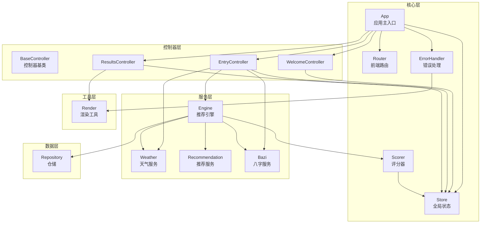
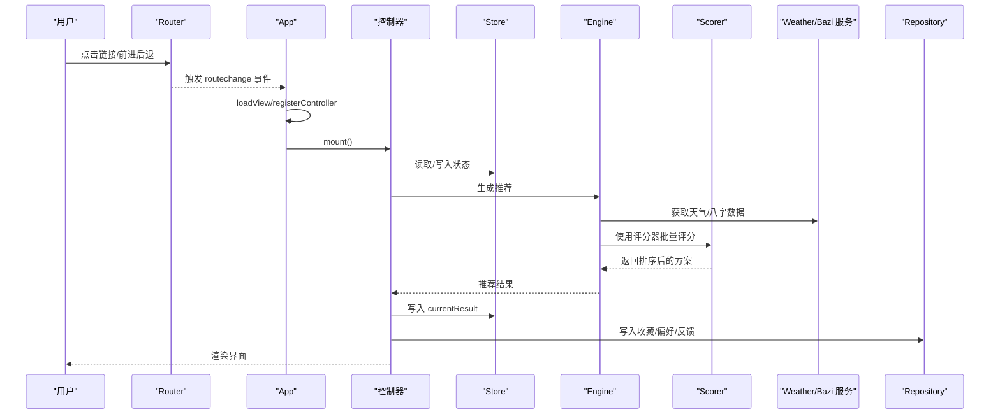
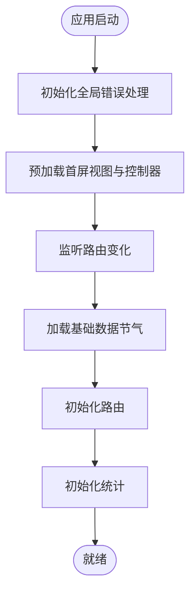
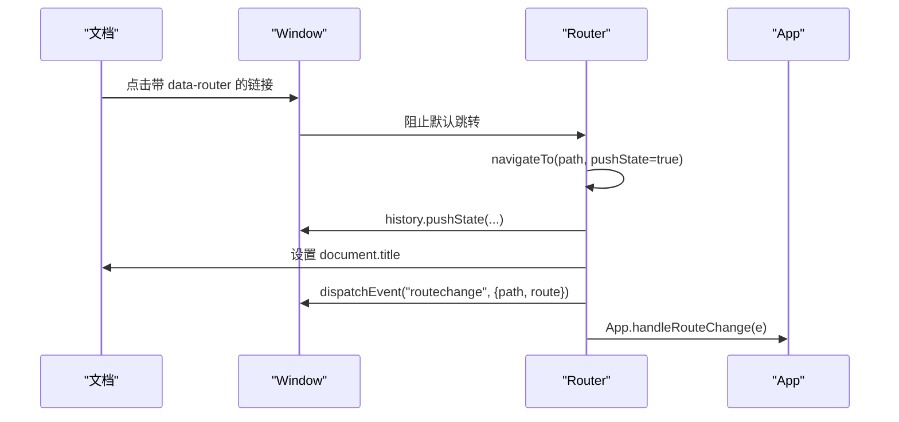
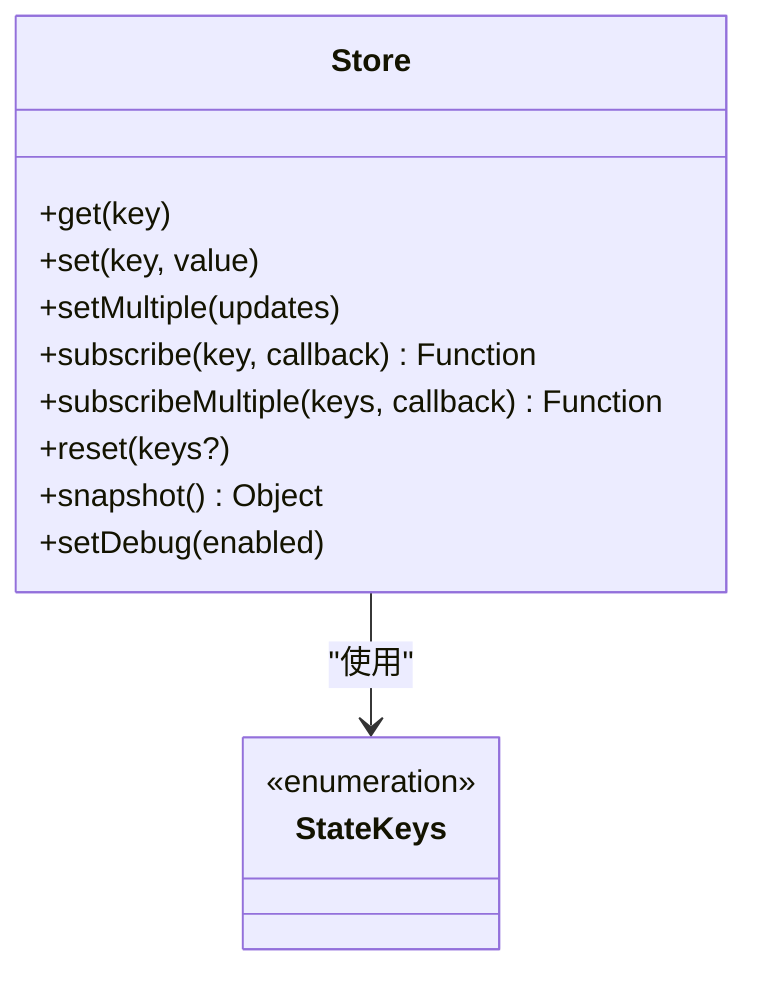
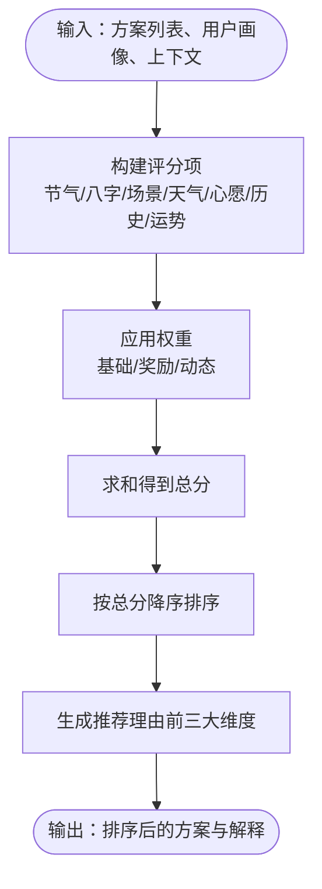
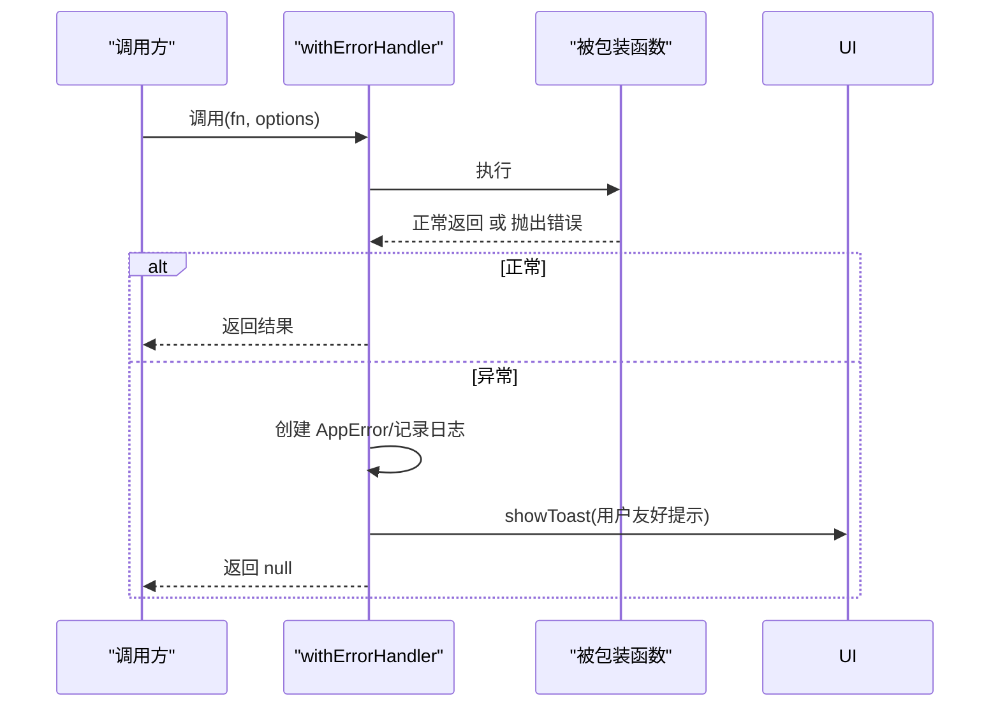
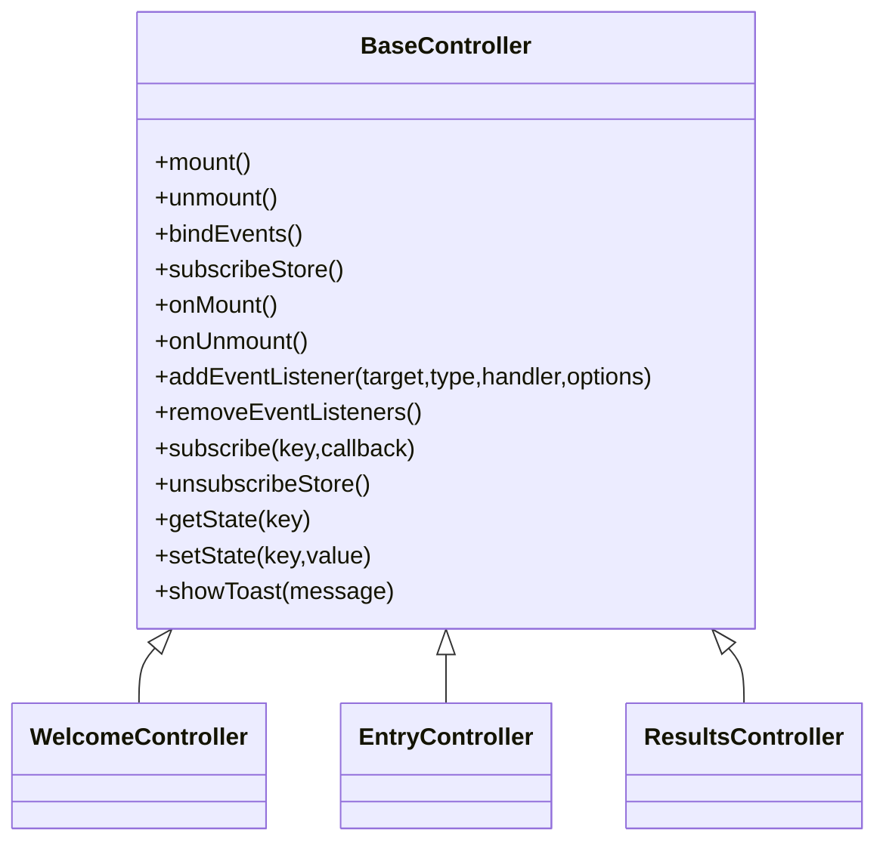
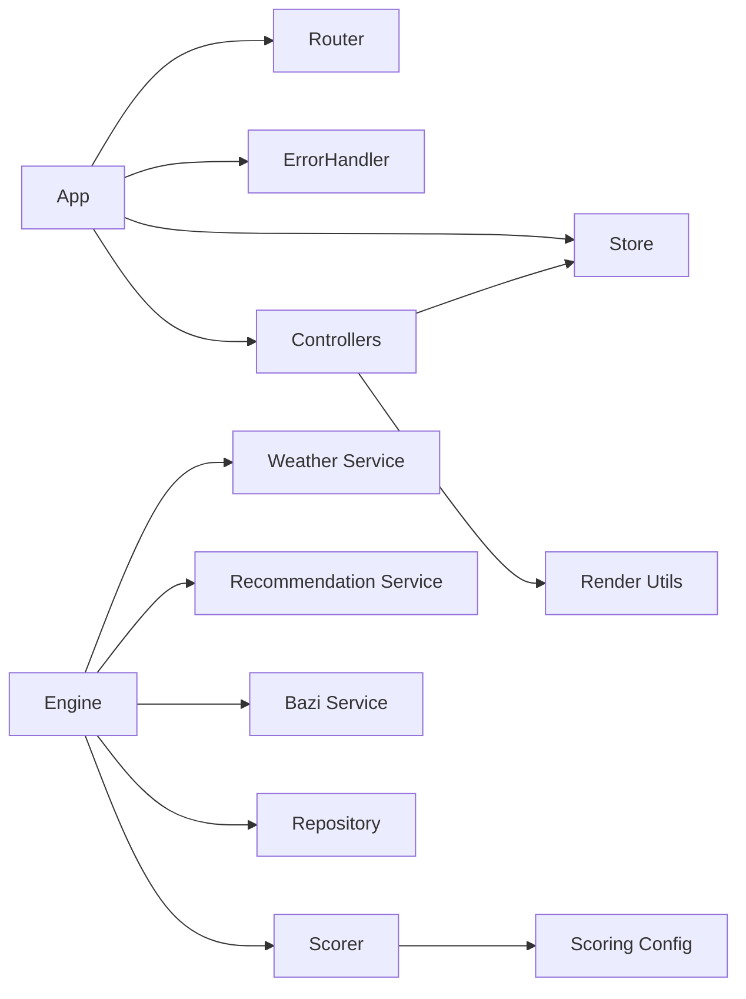

# 核心模块

<cite>
**本文引用的文件**
- [js/core/app.js](file://js/core/app.js)
- [js/core/router.js](file://js/core/router.js)
- [js/core/store.js](file://js/core/store.js)
- [js/core/scorer.js](file://js/core/scorer.js)
- [js/core/scoring-config.js](file://js/core/scoring-config.js)
- [js/core/error-handler.js](file://js/core/error-handler.js)
- [js/controllers/base.js](file://js/controllers/base.js)
- [js/controllers/welcome.js](file://js/controllers/welcome.js)
- [js/controllers/entry.js](file://js/controllers/entry.js)
- [js/controllers/results.js](file://js/controllers/results.js)
- [js/data/repository.js](file://js/data/repository.js)
- [js/utils/render.js](file://js/utils/render.js)
- [js/services/engine.js](file://js/services/engine.js)
</cite>

## 目录
1. [引言](#引言)
2. [项目结构](#项目结构)
3. [核心组件](#核心组件)
4. [架构总览](#架构总览)
5. [详细组件分析](#详细组件分析)
6. [依赖关系分析](#依赖关系分析)
7. [性能考量](#性能考量)
8. [故障排查指南](#故障排查指南)
9. [结论](#结论)
10. [附录](#附录)

## 引言
本文件面向“五行穿搭建议”项目的前端核心模块，系统性梳理并解析以下关键模块：
- App 应用主入口：初始化流程、全局协调机制、生命周期管理
- Router 路由系统：页面切换机制、URL 管理策略、导航控制
- Store 状态管理器：状态存储、变更监听、数据同步机制
- Scorer 评分器：推荐评分机制、权重配置、计算逻辑
- ErrorHandler 错误处理系统：异常捕获、错误分类、恢复策略
同时提供各模块的 API 文档、使用示例与最佳实践，并阐明模块间依赖与协作模式。

## 项目结构
项目采用按职责分层与按功能模块划分相结合的组织方式：
- 核心层：app、router、store、scorer、error-handler
- 控制器层：controllers/base 与各视图控制器（welcome、entry、results 等）
- 服务层：engine（推荐引擎）、weather、recommendation、bazi 等
- 数据层：repository（仓储）、data-manager、storage
- 工具层：render（DOM 渲染）、profile、upload、share 等
- 视图层：views/*.html 动态加载

图表来源
- [js/core/app.js](file://js/core/app.js#L1-L206)
- [js/core/router.js](file://js/core/router.js#L1-L142)
- [js/core/store.js](file://js/core/store.js#L1-L212)
- [js/core/scorer.js](file://js/core/scorer.js#L1-L317)
- [js/core/error-handler.js](file://js/core/error-handler.js#L1-L190)
- [js/controllers/base.js](file://js/controllers/base.js#L1-L131)
- [js/controllers/welcome.js](file://js/controllers/welcome.js#L1-L134)
- [js/controllers/entry.js](file://js/controllers/entry.js#L1-L241)
- [js/controllers/results.js](file://js/controllers/results.js#L1-L614)
- [js/services/engine.js](file://js/services/engine.js#L1-L425)
- [js/data/repository.js](file://js/data/repository.js#L1-L394)
- [js/utils/render.js](file://js/utils/render.js#L1-L487)

章节来源
- [js/core/app.js](file://js/core/app.js#L1-L206)
- [js/core/router.js](file://js/core/router.js#L1-L142)
- [js/core/store.js](file://js/core/store.js#L1-L212)
- [js/core/scorer.js](file://js/core/scorer.js#L1-L317)
- [js/core/error-handler.js](file://js/core/error-handler.js#L1-L190)
- [js/controllers/base.js](file://js/controllers/base.js#L1-L131)
- [js/controllers/welcome.js](file://js/controllers/welcome.js#L1-L134)
- [js/controllers/entry.js](file://js/controllers/entry.js#L1-L241)
- [js/controllers/results.js](file://js/controllers/results.js#L1-L614)
- [js/services/engine.js](file://js/services/engine.js#L1-L425)
- [js/data/repository.js](file://js/data/repository.js#L1-L394)
- [js/utils/render.js](file://js/utils/render.js#L1-L487)

## 核心组件
本节对四大核心模块进行深入解析，涵盖职责、数据结构、关键方法与交互关系。

### App 应用主入口
- 职责
  - 初始化全局错误处理、路由、统计
  - 预加载首屏视图与控制器
  - 监听路由变化，动态切换视图与控制器
  - 加载基础数据（如节气信息）并写入 Store
- 生命周期
  - 初始化阶段：注册控制器、监听路由事件、加载基础数据、初始化路由、统计标记
  - 运行阶段：响应路由变化事件，卸载旧控制器，挂载新控制器，切换视图显示
- 关键 API
  - init(): 初始化应用
  - loadView(viewId): 动态加载视图 HTML
  - registerController(viewId): 注册控制器
  - handleRouteChange(e): 处理路由变化
  - switchView(viewId): 切换视图显示
  - navigate(path): 导航到指定路径
- 最佳实践
  - 预加载首屏视图以提升首屏体验
  - 在路由变化时统一卸载旧控制器，避免内存泄漏
  - 将基础数据加载与路由初始化解耦，确保数据可用性

章节来源
- [js/core/app.js](file://js/core/app.js#L1-L206)

### Router 路由系统
- 职责
  - 管理 URL 与视图映射，支持浏览器前进后退
  - 拦截链接点击，统一导航
  - 维护当前路由状态，触发自定义事件
- 关键 API
  - initRouter(): 初始化路由，绑定 popstate 与链接拦截
  - navigateTo(path, pushState): 导航到指定路径，更新历史与标题
  - getCurrentRoute()/getCurrentRouteConfig()/getRoutes(): 查询路由信息
  - isValidRoute(path): 校验路径有效性
  - goBack(): 返回上一页
  - createRouteLink(path, text, options): 生成路由链接
- 设计要点
  - 使用自定义事件 routechange 通知 App 切换视图
  - Store 中记录 currentView，便于 UI 与控制器同步
  - 对未知路径进行重定向，保证健壮性

章节来源
- [js/core/router.js](file://js/core/router.js#L1-L142)

### Store 状态管理器
- 职责
  - 集中式状态存储，提供响应式更新
  - 订阅/取消订阅机制，支持多键聚合监听
  - 提供快照与调试能力
- 数据模型
  - 核心状态键：currentTermInfo、currentWishId、currentBaziResult、currentResult、favorites、currentView、isLoading、error
- 关键 API
  - get(key)/set(key, value)/setMultiple(updates)
  - subscribe(key, callback)/subscribeMultiple(keys, callback)
  - reset(keys?)/snapshot()/setDebug(enabled)
- 设计要点
  - 使用 Proxy 实现细粒度变更通知
  - 订阅者错误静默处理，避免影响其他订阅者
  - 仅在值真正改变时触发通知，减少无效渲染

章节来源
- [js/core/store.js](file://js/core/store.js#L1-L212)

### Scorer 评分器
- 职责
  - 封装推荐评分算法，支持单元测试
  - 提供批量评分、排序、解释生成
- 评分维度与权重
  - 基础权重：节气匹配、八字喜用、场景适配、天气联动、心愿契合
  - 奖励权重：历史偏好、今日运势
  - 动态权重：根据用户是否有八字、是否新用户进行再分配
- 核心算法
  - score(scheme): 计算单项得分，返回总分与分项明细
  - scoreAll(schemes): 批量评分并按总分降序
  - getExplanation(scheme): 生成推荐理由（前三大维度）
- 关键配置
  - 五行相生/相克关系、天气与温度对应的五行、评分等级阈值
  - 动态权重计算函数与元素关系得分函数

章节来源
- [js/core/scorer.js](file://js/core/scorer.js#L1-L317)
- [js/core/scoring-config.js](file://js/core/scoring-config.js#L1-L128)

### ErrorHandler 错误处理系统
- 职责
  - 统一包装异步函数，捕获并分类错误
  - 提供安全的网络请求、JSON 解析、本地存储封装
  - 全局错误监听，保障用户体验
- 错误类型
  - NETWORK、TIMEOUT、DATA_PARSE、VALIDATION、STORAGE、UNKNOWN
- 关键 API
  - withErrorHandler(fn, options): 包装函数，统一错误处理
  - safeFetch/url/timeout: 安全的 fetch 封装
  - safeJsonParse/response: 安全的 JSON 解析
  - safeStorage(operation): 安全的本地存储
  - initGlobalErrorHandler(): 初始化全局错误监听
- 最佳实践
  - 对网络与存储操作一律使用安全封装
  - 使用 AppError 与错误类型，便于分类与恢复

章节来源
- [js/core/error-handler.js](file://js/core/error-handler.js#L1-L190)

## 架构总览
下图展示了从用户交互到数据落库的端到端流程，突出核心模块的协作关系。

图表来源
- [js/core/router.js](file://js/core/router.js#L25-L79)
- [js/core/app.js](file://js/core/app.js#L145-L184)
- [js/controllers/entry.js](file://js/controllers/entry.js#L131-L189)
- [js/services/engine.js](file://js/services/engine.js#L323-L393)
- [js/core/scorer.js](file://js/core/scorer.js#L266-L276)
- [js/data/repository.js](file://js/data/repository.js#L380-L385)
- [js/utils/render.js](file://js/utils/render.js#L119-L132)

## 详细组件分析

### App 类与生命周期
- 初始化流程
  - 初始化全局错误处理
  - 预加载首屏视图与控制器
  - 监听路由变化事件
  - 加载基础数据（节气信息）
  - 初始化路由与统计
- 路由驱动的视图切换
  - 动态加载目标视图 HTML
  - 注册并挂载对应控制器
  - 切换视图显示并滚动到顶部
- 导航 API
  - navigate(path): 委托 Router 进行导航

图表来源
- [js/core/app.js](file://js/core/app.js#L47-L73)

章节来源
- [js/core/app.js](file://js/core/app.js#L1-L206)

### Router 路由系统
- 路由配置与导航
  - 基于路径映射到视图 ID
  - pushState 更新历史与标题
  - 触发 routechange 事件，携带路径、路由配置与来源
- 链接拦截与回退
  - 拦截带 data-router 的链接点击
  - popstate 监听浏览器前进后退
- API 一览
  - initRouter()/navigateTo()/getCurrentRoute()/isValidRoute()/goBack()/createRouteLink()

图表来源
- [js/core/router.js](file://js/core/router.js#L42-L79)
- [js/core/app.js](file://js/core/app.js#L145-L168)

章节来源
- [js/core/router.js](file://js/core/router.js#L1-L142)

### Store 状态管理器
- 响应式状态
  - 使用 Proxy 拦截 set，仅在值真正变化时触发通知
- 订阅机制
  - subscribe(key, callback) 返回取消订阅函数
  - subscribeMultiple(keys, callback) 批量订阅
- 状态键与视图常量
  - StateKeys：currentTermInfo、currentWishId、currentBaziResult、currentResult、favorites、currentView、isLoading、error
  - ViewNames：WELCOME、ENTRY、RESULTS、UPLOAD、FAVORITES

图表来源
- [js/core/store.js](file://js/core/store.js#L30-L187)
- [js/core/store.js](file://js/core/store.js#L193-L212)

章节来源
- [js/core/store.js](file://js/core/store.js#L1-L212)

### Scorer 评分器与配置
- 评分流程
  - 构建分项：节气、八字、场景、天气、心愿、历史偏好、今日运势
  - 乘以权重并求和，得到总分
  - 支持批量评分与排序
- 权重与关系
  - 基础权重与奖励权重
  - 五行相生/相克关系与元素关系得分
  - 动态权重：无八字时重新分配权重；新用户降低历史偏好权重
- 解释生成
  - 选取得分最高的前三个维度，计算占比并生成推荐理由

图表来源
- [js/core/scorer.js](file://js/core/scorer.js#L29-L75)
- [js/core/scoring-config.js](file://js/core/scoring-config.js#L74-L92)

章节来源
- [js/core/scorer.js](file://js/core/scorer.js#L1-L317)
- [js/core/scoring-config.js](file://js/core/scoring-config.js#L1-L128)

### ErrorHandler 错误处理
- 包装与分类
  - withErrorHandler(fn, options)：统一捕获错误、记录日志、显示提示、执行回调
- 安全封装
  - safeFetch：支持超时与 HTTP 错误分类
  - safeJsonParse：数据解析异常分类
  - safeStorage：存储异常分类与兜底
- 全局监听
  - unhandledrejection 与 error 事件，统一提示用户

图表来源
- [js/core/error-handler.js](file://js/core/error-handler.js#L45-L79)

章节来源
- [js/core/error-handler.js](file://js/core/error-handler.js#L1-L190)

### 控制器基类与视图控制器
- BaseController
  - 生命周期：mount/unmount，绑定/移除事件，订阅/取消 Store
  - 状态：getState/setState，订阅 subscribe/subscribeMultiple
  - 工具：showToast
- 视图控制器
  - WelcomeController：渲染节气横幅与引导
  - EntryController：表单收集、生成推荐、统计计数
  - ResultsController：渲染推荐卡片、收藏/分享/反馈、天气影响、运势提示

图表来源
- [js/controllers/base.js](file://js/controllers/base.js#L11-L131)
- [js/controllers/welcome.js](file://js/controllers/welcome.js#L13-L134)
- [js/controllers/entry.js](file://js/controllers/entry.js#L14-L241)
- [js/controllers/results.js](file://js/controllers/results.js#L13-L614)

章节来源
- [js/controllers/base.js](file://js/controllers/base.js#L1-L131)
- [js/controllers/welcome.js](file://js/controllers/welcome.js#L1-L134)
- [js/controllers/entry.js](file://js/controllers/entry.js#L1-L241)
- [js/controllers/results.js](file://js/controllers/results.js#L1-L614)

### 推荐引擎与数据仓储
- 推荐引擎
  - 加载方案、心愿模板、八字模板
  - 构建用户画像与上下文（天气、运势、场景偏好）
  - 使用评分器批量评分，采用梯度策略选择最佳/替代/平衡/补充方案
- 数据仓储
  - 收藏、偏好、反馈、八字、统计、穿搭照片等仓储类
  - 统一的安全存储封装，避免异常导致崩溃

章节来源
- [js/services/engine.js](file://js/services/engine.js#L1-L425)
- [js/data/repository.js](file://js/data/repository.js#L1-L394)

## 依赖关系分析
- 模块内聚与耦合
  - App 与 Router/Store/ErrorHandler 高内聚，低耦合
  - Scorer 与 ScoringConfig 强关联，形成清晰的算法边界
  - 控制器通过 Store 与服务层解耦
- 外部依赖
  - 浏览器 History API、fetch、localStorage
  - 自定义事件 routechange 作为跨模块通信桥梁
- 循环依赖
  - 未发现直接循环依赖；若未来扩展，需避免控制器互相导入

图表来源
- [js/core/app.js](file://js/core/app.js#L6-L21)
- [js/services/engine.js](file://js/services/engine.js#L1-L14)
- [js/core/scorer.js](file://js/core/scorer.js#L6-L12)
- [js/core/scoring-config.js](file://js/core/scoring-config.js#L1-L4)

章节来源
- [js/core/app.js](file://js/core/app.js#L1-L206)
- [js/services/engine.js](file://js/services/engine.js#L1-L425)
- [js/core/scorer.js](file://js/core/scorer.js#L1-L317)
- [js/core/scoring-config.js](file://js/core/scoring-config.js#L1-L128)

## 性能考量
- 视图懒加载与首屏优化
  - App 预加载首屏视图，减少首屏白屏时间
  - 控制器按需挂载，避免不必要的初始化
- 状态更新与渲染
  - Store 使用 Proxy 精准通知，减少无效渲染
  - 控制器订阅特定键，避免全局广播风暴
- 评分与缓存
  - Scorer 内置 Map 缓存，避免重复计算
  - 批量评分后一次性写入 Store，降低多次渲染成本
- 网络与存储
  - 统一使用安全封装，避免阻塞主线程
  - 对大数据结构（如反馈）限制长度，防止存储溢出

## 故障排查指南
- 路由无法跳转
  - 检查链接是否带有 data-router 属性
  - 确认路径在 ROUTES 中存在，否则会被重定向
- 视图不显示
  - 确认 loadView 成功加载 HTML 并插入容器
  - 检查 switchView 是否正确移除/添加 hidden 类
- 状态不更新
  - 确认使用 store.set 写入，且订阅键一致
  - 检查 Proxy 代理是否触发通知（值必须真正变化）
- 评分异常
  - 核对用户画像与上下文字段是否完整
  - 检查动态权重与元素关系得分函数
- 错误提示缺失
  - 确认 initGlobalErrorHandler 已初始化
  - 使用 withErrorHandler 包装异步调用，避免静默失败

章节来源
- [js/core/router.js](file://js/core/router.js#L42-L79)
- [js/core/app.js](file://js/core/app.js#L174-L184)
- [js/core/store.js](file://js/core/store.js#L130-L141)
- [js/core/error-handler.js](file://js/core/error-handler.js#L168-L189)

## 结论
本项目通过清晰的模块划分与职责边界，实现了从路由、状态、控制器到服务与数据层的完整闭环。App 作为中枢协调者，Router 与 Store 提供稳定的导航与状态基础，Scorer 与 ErrorHandler 则分别保障推荐质量与运行稳定性。建议在后续迭代中持续完善缓存策略、监控埋点与错误上报，进一步提升用户体验与系统可观测性。

## 附录

### API 速查表（核心模块）

- App
  - init(): 初始化
  - loadView(viewId): 加载视图
  - registerController(viewId): 注册控制器
  - handleRouteChange(e): 处理路由变化
  - switchView(viewId): 切换视图
  - navigate(path): 导航

- Router
  - initRouter(): 初始化
  - navigateTo(path, pushState): 导航
  - getCurrentRoute(): 获取当前路径
  - getCurrentRouteConfig(): 获取当前路由配置
  - getRoutes(): 获取全部路由
  - isValidRoute(path): 校验路径
  - goBack(): 返回
  - createRouteLink(path, text, options): 生成链接

- Store
  - get(key)/set(key, value)/setMultiple(updates)
  - subscribe(key, callback)/subscribeMultiple(keys, callback)
  - reset(keys?)/snapshot()/setDebug(enabled)

- Scorer
  - score(scheme): 单项评分
  - scoreAll(schemes): 批量评分
  - getExplanation(scheme): 生成解释

- ErrorHandler
  - withErrorHandler(fn, options): 包装函数
  - safeFetch(url, options, timeout): 安全 fetch
  - safeJsonParse(response): 安全 JSON 解析
  - safeStorage(operation): 安全存储
  - initGlobalErrorHandler(): 初始化全局监听

章节来源
- [js/core/app.js](file://js/core/app.js#L47-L193)
- [js/core/router.js](file://js/core/router.js#L25-L142)
- [js/core/store.js](file://js/core/store.js#L70-L187)
- [js/core/scorer.js](file://js/core/scorer.js#L29-L317)
- [js/core/error-handler.js](file://js/core/error-handler.js#L45-L189)