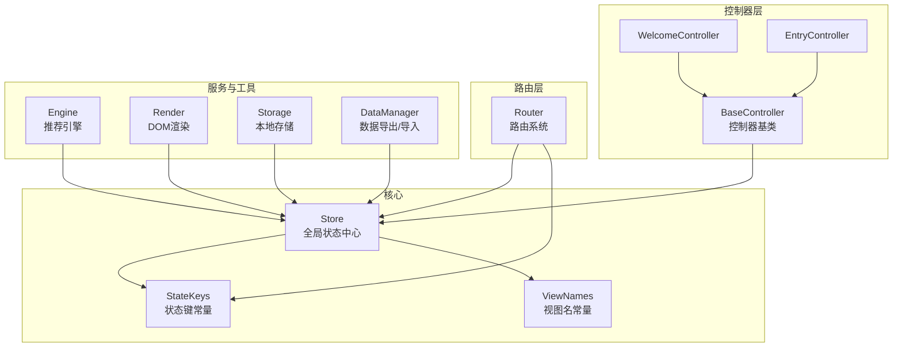
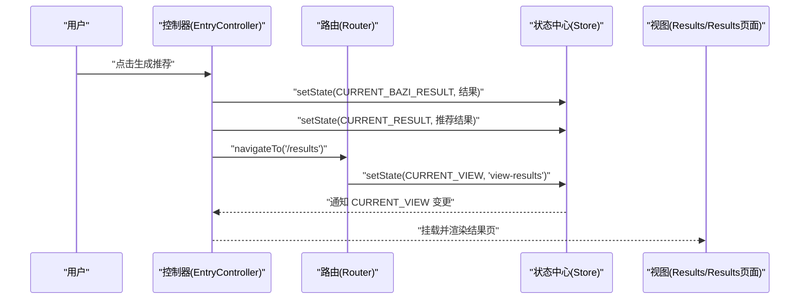
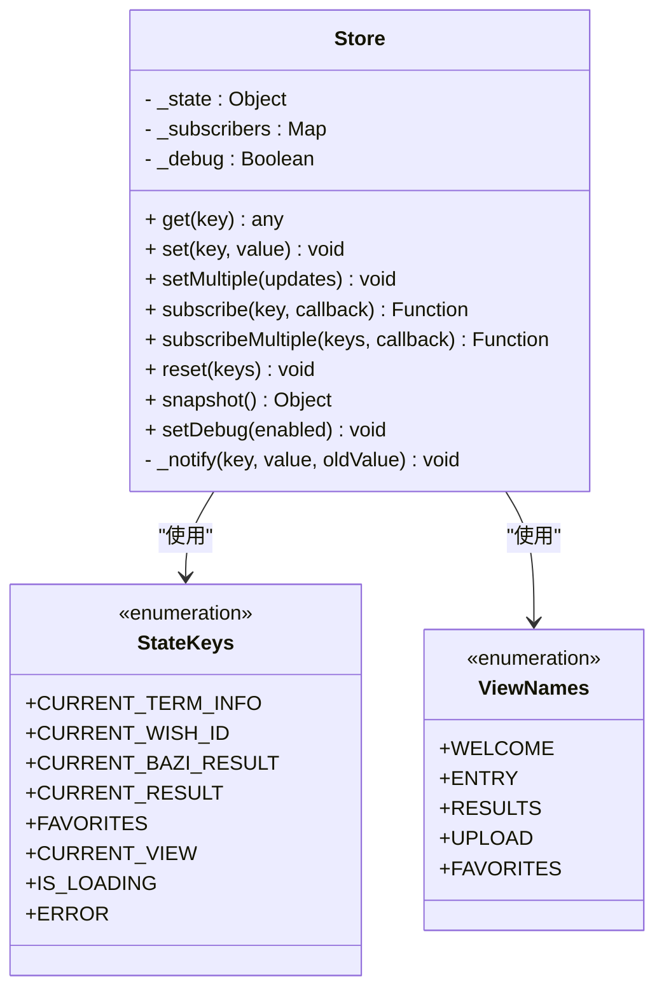
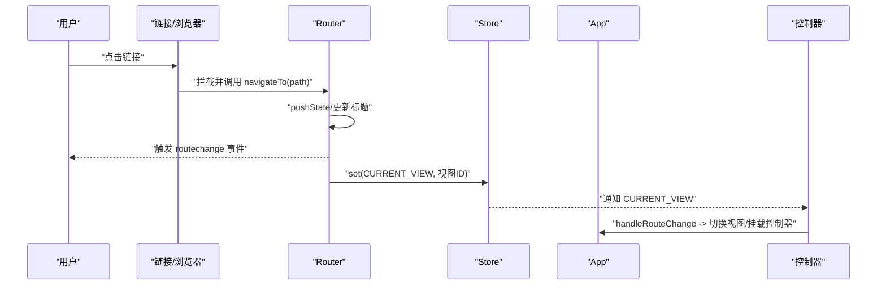
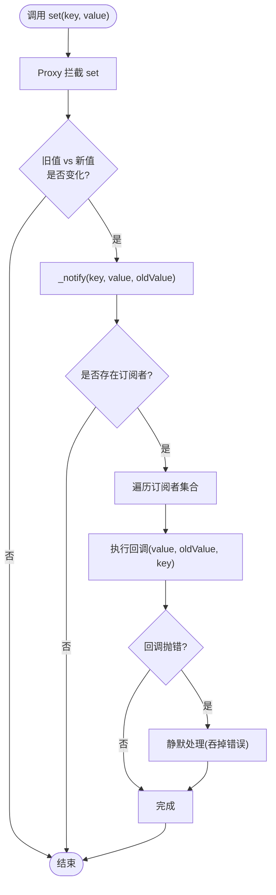
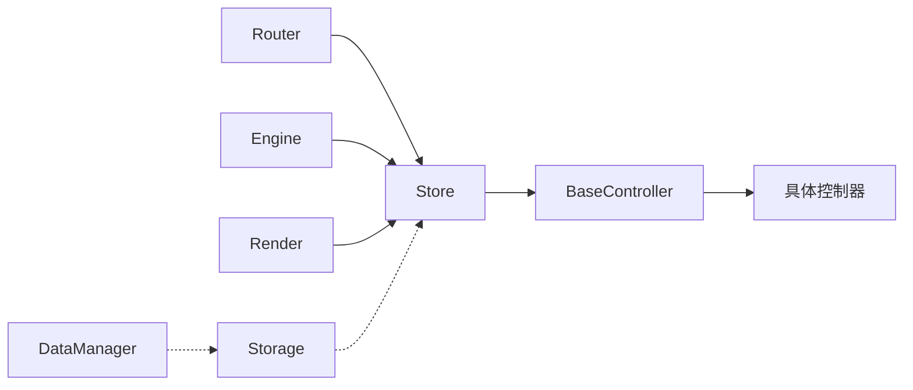

# 状态管理

<cite>
**本文引用的文件**
- [store.js](file://js/core/store.js)
- [app.js](file://js/core/app.js)
- [router.js](file://js/core/router.js)
- [base.js](file://js/controllers/base.js)
- [welcome.js](file://js/controllers/welcome.js)
- [entry.js](file://js/controllers/entry.js)
- [storage.js](file://js/data/storage.js)
- [data-manager.js](file://js/data/data-manager.js)
- [engine.js](file://js/services/engine.js)
- [render.js](file://js/utils/render.js)
- [index.html](file://index.html)
</cite>

## 目录
1. [简介](#简介)
2. [项目结构](#项目结构)
3. [核心组件](#核心组件)
4. [架构总览](#架构总览)
5. [组件详细分析](#组件详细分析)
6. [依赖关系分析](#依赖关系分析)
7. [性能考量](#性能考量)
8. [故障排查指南](#故障排查指南)
9. [结论](#结论)
10. [附录](#附录)

## 简介
本文件系统性梳理并解析本项目的“状态管理”体系，重点围绕 Store 模块的状态管理模式、状态键值管理、状态变更机制、状态同步策略、状态查询接口、以及最佳实践与扩展方案（如快照与回滚）。文档同时结合控制器、路由、服务层与工具层的协作，帮助读者全面理解状态在前端应用中的组织方式与运行机制。

## 项目结构
本项目采用“MVC + 轻量状态中心”的组织方式：
- 核心状态中心位于 Store 模块，提供全局状态、订阅与通知能力
- 控制器层通过 BaseController 封装订阅与状态读写，实现视图与状态的解耦
- 路由层负责视图切换与状态同步，确保 URL 与当前视图一致
- 服务层与工具层通过状态中心读取/写入关键业务状态，驱动业务流程
- 本地存储模块提供持久化能力，支撑数据备份与恢复

图表来源
- [store.js](file://js/core/store.js#L190-L212)
- [base.js](file://js/controllers/base.js#L11-L131)
- [router.js](file://js/core/router.js#L1-L142)
- [engine.js](file://js/services/engine.js#L1-L425)
- [render.js](file://js/utils/render.js#L1-L487)
- [storage.js](file://js/data/storage.js#L1-L145)
- [data-manager.js](file://js/data/data-manager.js#L1-L376)

章节来源
- [store.js](file://js/core/store.js#L1-L212)
- [router.js](file://js/core/router.js#L1-L142)
- [base.js](file://js/controllers/base.js#L1-L131)

## 核心组件
- Store：集中式状态容器，提供 get/set、批量设置、订阅/通知、重置、快照与调试开关等能力
- StateKeys：状态键常量，避免硬编码，提升类型安全与可维护性
- BaseController：控制器基类，封装订阅、事件绑定、状态读写与生命周期管理
- Router：路由系统，负责导航、历史记录与视图切换，并同步当前视图到状态中心
- Storage/DataManager：本地存储与数据备份/恢复，提供持久化与跨设备迁移能力

章节来源
- [store.js](file://js/core/store.js#L28-L187)
- [store.js](file://js/core/store.js#L192-L212)
- [base.js](file://js/controllers/base.js#L11-L131)
- [router.js](file://js/core/router.js#L1-L142)
- [storage.js](file://js/data/storage.js#L1-L145)
- [data-manager.js](file://js/data/data-manager.js#L1-L376)

## 架构总览
状态流从“用户交互/业务逻辑”出发，经由控制器与服务层更新 Store，再由订阅者（控制器）响应状态变化并更新 UI；路由层保证 URL 与当前视图的一致性，形成“状态驱动视图”的闭环。

图表来源
- [entry.js](file://js/controllers/entry.js#L131-L189)
- [router.js](file://js/core/router.js#L57-L79)
- [store.js](file://js/core/store.js#L74-L81)

## 组件详细分析

### Store 模块：状态管理模式与接口
- 状态存储结构
  - 内部以普通对象作为状态根，对外暴露 Proxy 包装的响应式状态，仅在值真正变化时触发通知
  - 提供 Map 结构维护订阅者集合，按键名分组管理回调
- 数据类型与访问接口
  - get(key)：读取状态值
  - set(key, value)：设置状态值，触发变更通知
  - setMultiple(updates)：批量设置，便于一次性更新多个键
  - subscribe(key, callback) / subscribeMultiple(keys, callback)：订阅状态变化，返回取消订阅函数
  - reset(keys?)：重置指定键或全部键为初始值
  - snapshot()：导出当前内部状态快照（用于调试）
  - setDebug(enabled)：开启/关闭调试模式（当前未在通知中直接使用，保留扩展空间）
- 状态键值管理
  - StateKeys：集中定义所有状态键，避免硬编码，提升可维护性与一致性
  - ViewNames：视图名常量，配合路由与状态联动
- 变更监听与事件通知
  - 通过 Proxy 的 set 拦截判断“旧值 vs 新值”，仅在值变化时通知订阅者
  - 通知过程对订阅者回调进行 try/catch，避免单个订阅者错误影响整体
- 状态同步策略
  - 路由层在导航时同步 CURRENT_VIEW，控制器层在挂载/卸载时订阅/取消订阅，形成“视图级状态同步”
  - 业务层通过 setMultiple 或多次 set 实现跨模块数据共享（如推荐结果、八字结果等）
- 查询接口
  - get(key) 提供只读访问，配合默认值与类型校验可在控制器层实现
- 调试与可观测性
  - snapshot() 便于开发调试
  - setDebug() 为后续埋点/日志预留

图表来源
- [store.js](file://js/core/store.js#L28-L187)
- [store.js](file://js/core/store.js#L192-L212)

章节来源
- [store.js](file://js/core/store.js#L11-L25)
- [store.js](file://js/core/store.js#L30-L63)
- [store.js](file://js/core/store.js#L64-L81)
- [store.js](file://js/core/store.js#L82-L91)
- [store.js](file://js/core/store.js#L93-L124)
- [store.js](file://js/core/store.js#L126-L141)
- [store.js](file://js/core/store.js#L143-L170)
- [store.js](file://js/core/store.js#L172-L187)
- [store.js](file://js/core/store.js#L192-L212)

### BaseController：控制器与状态订阅
- 生命周期与事件绑定
  - mount/unmount 管理控制器生命周期，bindEvents 在 onMount 后绑定，避免容器尚未就绪导致的错误
- 订阅与状态读写
  - subscribeStore/onMount 中订阅 Store，onUnmount 取消订阅，防止内存泄漏
  - getState/ setState 封装 store.get/store.set，统一访问入口
- 事件管理
  - addEventListener/removeEventListeners 统一管理事件监听，便于清理

章节来源
- [base.js](file://js/controllers/base.js#L11-L42)
- [base.js](file://js/controllers/base.js#L43-L67)
- [base.js](file://js/controllers/base.js#L68-L85)
- [base.js](file://js/controllers/base.js#L86-L103)
- [base.js](file://js/controllers/base.js#L104-L131)

### 路由与视图同步：CURRENT_VIEW
- 路由初始化与拦截
  - initRouter 监听 popstate 与链接点击，维护当前路由
- 导航与状态同步
  - navigateTo 更新浏览器历史、页面标题并触发 routechange 事件
  - 同步更新 Store 中的 CURRENT_VIEW，使控制器订阅生效
- 路由配置与视图映射
  - ROUTES 定义路径到视图与标题的映射，VIEW_CONFIG 定义视图到控制器与 HTML 的映射

图表来源
- [router.js](file://js/core/router.js#L25-L50)
- [router.js](file://js/core/router.js#L57-L79)
- [app.js](file://js/core/app.js#L145-L168)
- [store.js](file://js/core/store.js#L74-L81)

章节来源
- [router.js](file://js/core/router.js#L1-L142)
- [app.js](file://js/core/app.js#L141-L168)

### 控制器使用示例：WelcomeController 与 EntryController
- WelcomeController
  - onMount 从 Store 读取 CURRENT_TERM_INFO，渲染节气横幅与建议
  - 通过 getState/subscribeStore 与状态中心交互
- EntryController
  - 选择场景/心愿/精度，setState 更新 CURRENT_WISH_ID/CURRENT_BAZI_RESULT
  - 调用服务层生成推荐，setState CURRENT_RESULT 并导航到结果页
  - 通过 Router 同步 CURRENT_VIEW

章节来源
- [welcome.js](file://js/controllers/welcome.js#L13-L35)
- [entry.js](file://js/controllers/entry.js#L14-L52)
- [entry.js](file://js/controllers/entry.js#L112-L117)
- [entry.js](file://js/controllers/entry.js#L160-L163)
- [entry.js](file://js/controllers/entry.js#L166-L189)

### 状态键值管理：StateKeys 与类型安全
- StateKeys 枚举
  - 覆盖节气信息、用户输入、推荐结果、收藏列表、UI 状态等关键键
  - 通过集中定义避免硬编码，降低拼写错误风险
- 类型安全机制
  - 通过枚举约束键名，配合注释与文档约定值的类型
  - 在控制器层以字符串常量形式使用，减少运行期错误

章节来源
- [store.js](file://js/core/store.js#L192-L212)

### 状态变更机制：set、订阅与通知
- set 实现
  - 通过 Proxy 拦截赋值，比较旧值与新值，仅在变化时触发通知
- 订阅与取消订阅
  - subscribe/subscribeMultiple 返回取消函数，便于在控制器卸载时清理
- 通知系统
  - _notify 遍历订阅者集合，逐个执行回调，捕获异常避免中断
- 批量更新
  - setMultiple 通过 entries 遍历，逐键 set，保持通知粒度

图表来源
- [store.js](file://js/core/store.js#L11-L25)
- [store.js](file://js/core/store.js#L126-L141)

章节来源
- [store.js](file://js/core/store.js#L11-L25)
- [store.js](file://js/core/store.js#L93-L124)
- [store.js](file://js/core/store.js#L126-L141)

### 状态同步策略：跨模块数据共享、持久化与内存管理
- 跨模块数据共享
  - 控制器通过 setState 更新 Store，其他控制器订阅相应键即可获得最新状态
  - 例如：EntryController 生成推荐后，ResultsController 订阅 CURRENT_RESULT 实时渲染
- 状态持久化
  - 本地存储模块提供安全封装，支持带前缀的键管理、批量清理与业务方法（收藏、反馈、使用统计等）
  - 数据管理模块支持导出/导入、预览、合并与统计概览
- 内存管理
  - BaseController 在 unmount 时取消所有订阅与事件监听，避免内存泄漏
  - Router 在导航时仅更新 CURRENT_VIEW，避免不必要的全局重绘

章节来源
- [base.js](file://js/controllers/base.js#L35-L42)
- [base.js](file://js/controllers/base.js#L98-L103)
- [storage.js](file://js/data/storage.js#L1-L145)
- [data-manager.js](file://js/data/data-manager.js#L1-L376)

### 状态查询接口：get、默认值与类型校验
- get(key)
  - 提供只读访问，控制器层可在此处实现默认值与类型校验
  - 示例：若 CURRENT_TERM_INFO 为空，可提供兜底渲染或提示
- 类型校验建议
  - 在控制器层对返回值进行类型断言与空值处理，避免下游逻辑异常
  - 对复杂对象（如推荐结果）可提供浅拷贝或不可变读取策略

章节来源
- [store.js](file://js/core/store.js#L64-L72)
- [welcome.js](file://js/controllers/welcome.js#L31-L34)

### 状态快照与回滚：实现方案
- 快照
  - snapshot() 返回当前内部状态副本，可用于调试与对比
- 回滚
  - 当前未内置回滚 API，可通过以下方式实现：
    - 在变更前调用 snapshot() 保存“上一个状态”
    - 在需要回滚时，将“上一个状态”通过 reset 或 setMultiple 一次性还原
  - 注意：回滚需谨慎处理订阅者回调与 UI 状态，避免产生抖动或不一致

章节来源
- [store.js](file://js/core/store.js#L172-L187)

## 依赖关系分析
- Store 与控制器
  - BaseController 依赖 Store；各具体控制器通过 subscribe/ setState 与 Store 交互
- Store 与路由
  - Router 在导航时 set CURRENT_VIEW，驱动控制器切换视图
- Store 与服务层
  - 服务层（如推荐引擎）通过 Store 读取节气、心愿、八字等上下文，生成结果后写回 Store
- Store 与工具层
  - 工具层（渲染、Toast）通过 Store 读取状态决定 UI 行为
- Store 与本地存储
  - 本地存储模块独立于 Store，但业务层可将 Store 中的关键状态持久化到本地

图表来源
- [store.js](file://js/core/store.js#L28-L187)
- [base.js](file://js/controllers/base.js#L11-L131)
- [router.js](file://js/core/router.js#L1-L142)
- [engine.js](file://js/services/engine.js#L1-L425)
- [render.js](file://js/utils/render.js#L1-L487)
- [storage.js](file://js/data/storage.js#L1-L145)
- [data-manager.js](file://js/data/data-manager.js#L1-L376)

章节来源
- [store.js](file://js/core/store.js#L28-L187)
- [base.js](file://js/controllers/base.js#L11-L131)
- [router.js](file://js/core/router.js#L1-L142)
- [engine.js](file://js/services/engine.js#L1-L425)
- [render.js](file://js/utils/render.js#L1-L487)
- [storage.js](file://js/data/storage.js#L1-L145)
- [data-manager.js](file://js/data/data-manager.js#L1-L376)

## 性能考量
- 通知粒度
  - 仅在值变化时触发通知，避免无效渲染
- 批量更新
  - setMultiple 减少多次 set 带来的多次通知与重绘
- 订阅管理
  - BaseController 在卸载时统一取消订阅，避免冗余回调
- 渲染优化
  - 控制器层在 onMount 后绑定事件，避免重复绑定导致的性能损耗
- 本地存储
  - safeStorage 包装 localStorage 操作，避免异常中断主线程

## 故障排查指南
- 订阅者回调报错
  - Store 在通知时对订阅者回调进行 try/catch，避免单个订阅者错误影响整体
- 本地存储异常
  - safeStorage 捕获 QuotaExceededError 等异常并转换为应用错误，提示用户清理空间
- 网络与解析错误
  - withErrorHandler 统一封装异步函数错误，记录日志并显示用户提示
- 全局错误监听
  - initGlobalErrorHandler 捕获未处理 Promise 与全局错误，保障用户体验

章节来源
- [store.js](file://js/core/store.js#L126-L141)
- [storage.js](file://js/data/storage.js#L149-L163)
- [error-handler.js](file://js/core/error-handler.js#L45-L79)
- [error-handler.js](file://js/core/error-handler.js#L168-L189)

## 结论
本项目的状态管理以 Store 为核心，结合 BaseController、Router、服务层与工具层，形成了清晰、可维护且具备扩展性的前端状态体系。通过集中式状态、细粒度通知、严格的订阅管理与统一的错误处理，系统在复杂业务场景下仍能保持稳定与可预测。建议在后续迭代中引入快照与回滚机制、类型声明与单元测试，进一步提升可靠性与可维护性。

## 附录
- 入口与初始化
  - index.html 通过模块脚本引入 app.bootstrap，启动应用初始化流程
- 状态键与视图名
  - StateKeys 与 ViewNames 作为全局常量，贯穿控制器、路由与服务层

章节来源
- [index.html](file://index.html#L58-L61)
- [store.js](file://js/core/store.js#L192-L212)