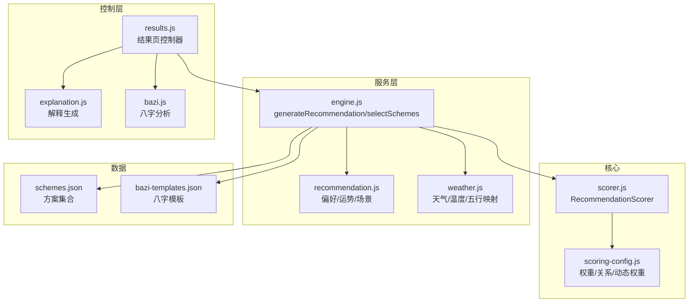
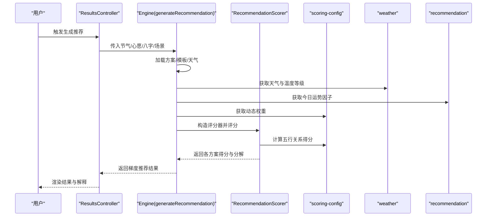
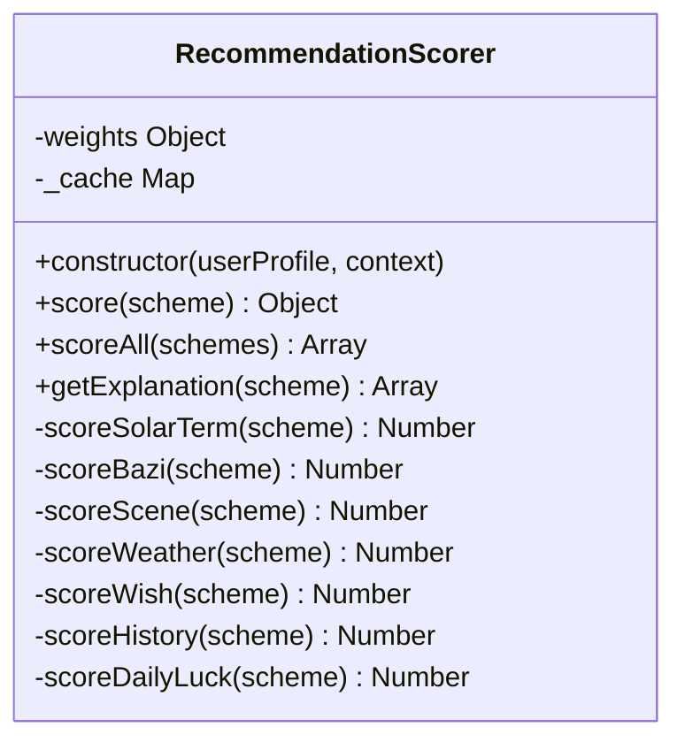
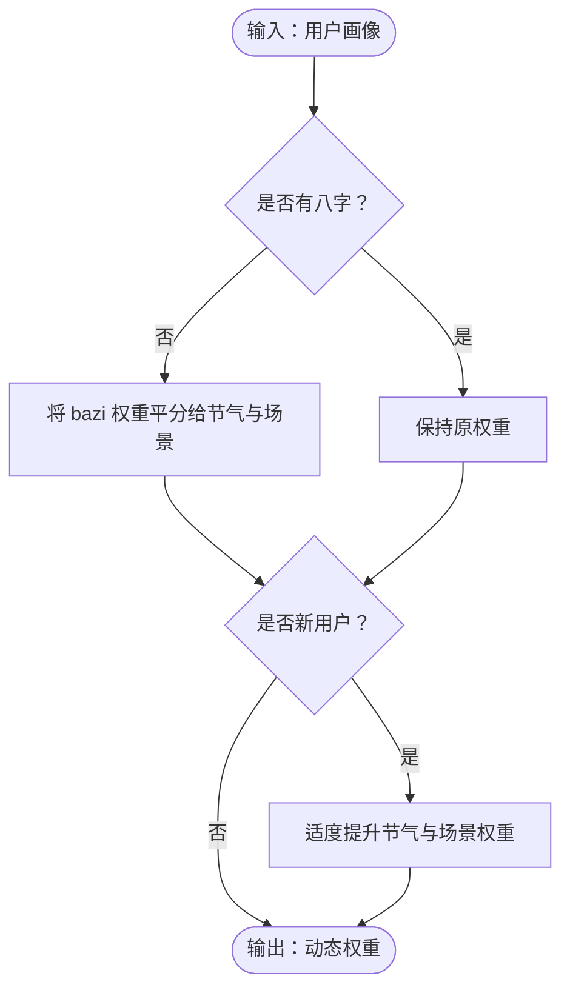
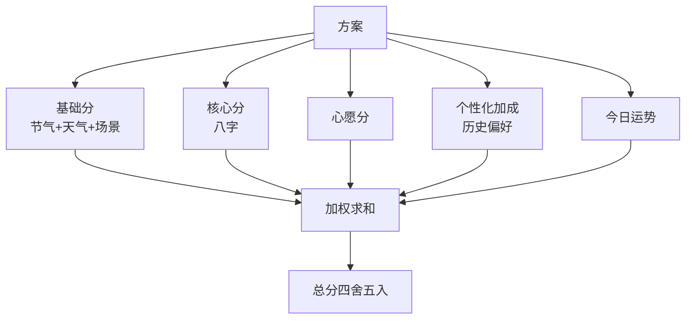
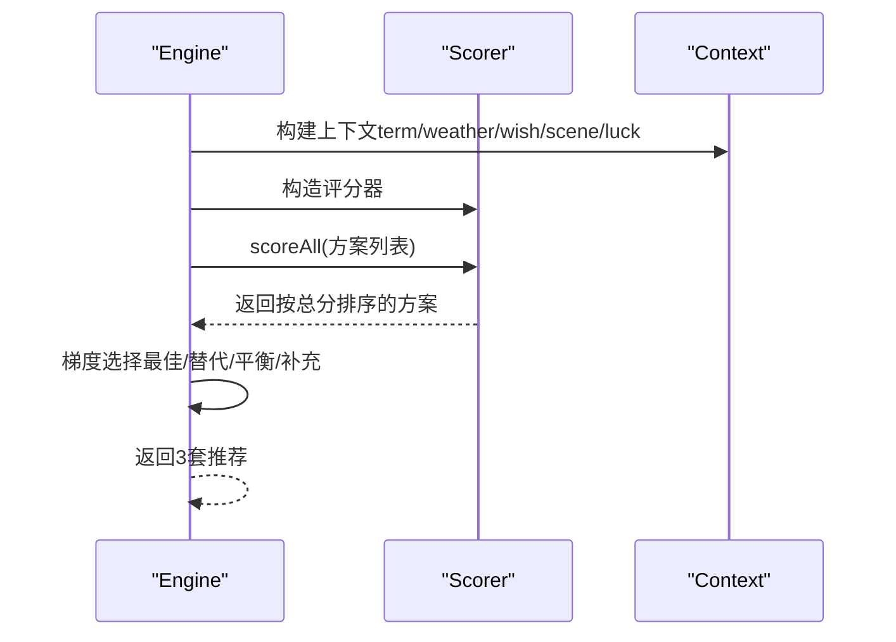
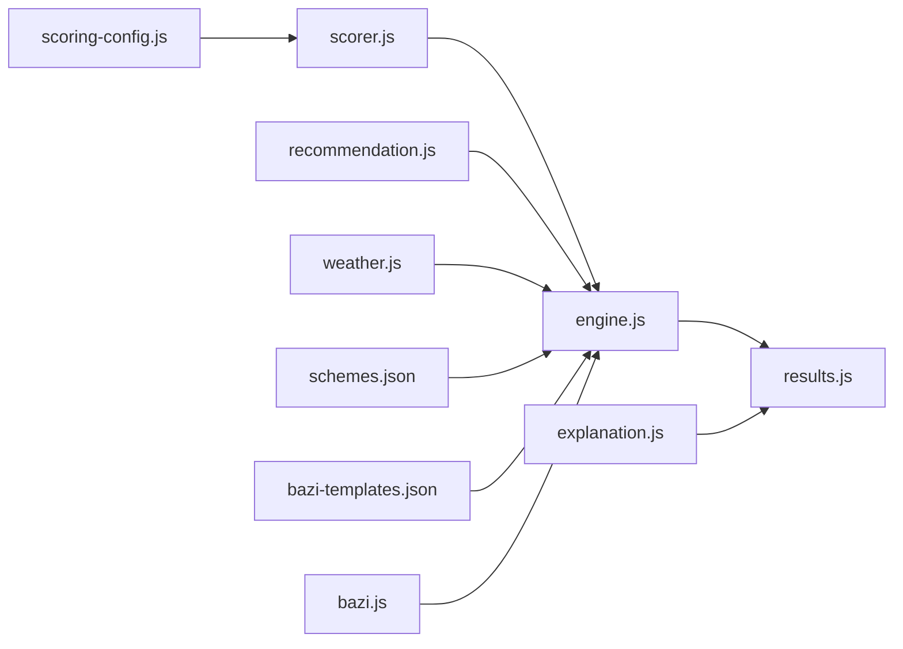

# 评分引擎

<cite>
**本文引用的文件**
- [scorer.js](file://js/core/scorer.js)
- [scoring-config.js](file://js/core/scoring-config.js)
- [engine.js](file://js/services/engine.js)
- [recommendation.js](file://js/services/recommendation.js)
- [weather.js](file://js/services/weather.js)
- [results.js](file://js/controllers/results.js)
- [bazi.js](file://js/services/bazi.js)
- [explanation.js](file://js/services/explanation.js)
- [schemes.json](file://data/schemes.json)
- [bazi-templates.json](file://data/bazi-templates.json)
</cite>

## 目录
1. [简介](#简介)
2. [项目结构](#项目结构)
3. [核心组件](#核心组件)
4. [架构总览](#架构总览)
5. [详细组件分析](#详细组件分析)
6. [依赖关系分析](#依赖关系分析)
7. [性能考量](#性能考量)
8. [故障排查指南](#故障排查指南)
9. [结论](#结论)
10. [附录](#附录)

## 简介
本文件面向“评分引擎”的综合技术文档，聚焦 RecommendationScorer 评分器的算法设计、权重配置与实现细节，系统解析评分配置体系（scoring-config.js）中的权重参数、评分规则与动态调整机制；深入阐述多维度评分计算（五行匹配度、节气适配性、天气条件、用户偏好、心愿契合、历史偏好、今日运势）；给出数学模型（加权平均、归一化处理、最终得分计算）与扩展性设计（新增评分维度、权重调整、算法优化）；并提供调试工具、性能监控与结果验证方法，以及评分公平性与异常处理策略。

## 项目结构
评分引擎位于 js/core 与 js/services 两大模块中：
- 核心评分器：RecommendationScorer（js/core/scorer.js）
- 评分配置：SCORING_WEIGHTS、动态权重、五行关系评分（js/core/scoring-config.js）
- 引擎编排：generateRecommendation/selectSchemes（js/services/engine.js）
- 用户偏好与运势：recommendation.js
- 天气联动：weather.js
- 控制器与前端交互：results.js
- 八字分析：bazi.js
- 推荐解释：explanation.js
- 数据源：schemes.json、bazi-templates.json

图表来源
- [scorer.js](file://js/core/scorer.js#L1-L317)
- [scoring-config.js](file://js/core/scoring-config.js#L1-L128)
- [engine.js](file://js/services/engine.js#L1-L425)
- [recommendation.js](file://js/services/recommendation.js#L1-L466)
- [weather.js](file://js/services/weather.js#L1-L340)
- [results.js](file://js/controllers/results.js#L1-L614)
- [explanation.js](file://js/services/explanation.js#L1-L298)
- [bazi.js](file://js/services/bazi.js#L1-L267)
- [schemes.json](file://data/schemes.json#L1-L509)
- [bazi-templates.json](file://data/bazi-templates.json#L1-L103)

章节来源
- [scorer.js](file://js/core/scorer.js#L1-L317)
- [scoring-config.js](file://js/core/scoring-config.js#L1-L128)
- [engine.js](file://js/services/engine.js#L1-L425)

## 核心组件
- RecommendationScorer：封装评分逻辑，支持单元测试，提供 score、scoreAll、getExplanation 等接口。
- SCORING_WEIGHTS：基础权重配置（节气、八字、场景、天气、心愿），bonus 权重（历史偏好、今日运势）。
- 动态权重：getDynamicWeights，依据用户画像（是否有八字、是否新用户）调整权重分配。
- 五行关系评分：getElementRelationScore，基于相生/相克/相等关系返回 0-100 的得分。
- 引擎编排：generateRecommendation/selectSchemes，构建上下文、加载数据、评分与梯度推荐。
- 用户偏好与运势：recommendation.js 中的偏好存储、更新与今日运势随机因子。
- 天气联动：weather.js 中天气类型到五行能量场、温度到五行调候的映射，以及温度等级划分。

章节来源
- [scorer.js](file://js/core/scorer.js#L14-L317)
- [scoring-config.js](file://js/core/scoring-config.js#L6-L92)
- [engine.js](file://js/services/engine.js#L218-L299)
- [recommendation.js](file://js/services/recommendation.js#L124-L137)

## 架构总览
评分引擎采用“配置驱动 + 服务编排 + 核心评分器”的分层架构：
- 配置层：权重、五行关系、天气/温度映射、场景偏好。
- 编排层：引擎负责加载数据、构建上下文、调用评分器、梯度选择方案。
- 评分层：RecommendationScorer 对每个方案进行多维评分与汇总。
- 展示层：results.js 渲染结果、解释与交互；explanation.js 生成推荐理由与分析。

图表来源
- [engine.js](file://js/services/engine.js#L323-L393)
- [scorer.js](file://js/core/scorer.js#L29-L75)
- [scoring-config.js](file://js/core/scoring-config.js#L74-L92)
- [weather.js](file://js/services/weather.js#L135-L138)
- [recommendation.js](file://js/services/recommendation.js#L124-L137)

## 详细组件分析

### RecommendationScorer 评分器
- 输入：用户画像（含八字）、上下文（节气、天气、场景、心愿、运势等）。
- 输出：每个方案的总分与分项分解，以及使用的权重。
- 关键方法：
  - score(scheme)：计算单项总分，按权重加权求和，保留 breakdown 与 weights。
  - scoreSolarTerm/scoreBazi/scoreScene/scoreWeather/scoreWish/scoreHistory/scoreDailyLuck：分别计算各维度得分。
  - scoreAll：批量评分并按总分降序排列。
  - getExplanation：提取得分最高的前三个维度及其占比。

图表来源
- [scorer.js](file://js/core/scorer.js#L14-L317)

章节来源
- [scorer.js](file://js/core/scorer.js#L29-L317)

### 评分配置系统（scoring-config.js）
- 基础权重（SCORING_WEIGHTS.base）：节气 25%、八字 20%、场景 20%、天气 15%、心愿 15%。
- 奖励权重（SCORING_WEIGHTS.bonus）：历史偏好 10%、今日运势 5%。
- 动态权重（getDynamicWeights）：若无八字，则将 bazi 权重平分给 solarTerm 与 scene；新用户适度提升 solarTerm 与 scene 权重。
- 五行关系评分（getElementRelationScore）：相等=完美（100）、相生=优秀（80）、被生=良好（60）、相克=一般（40）、被克=较差（20）、其他=坏（0）。
- 天气/温度映射：WEATHER_ELEMENT_MAP、TEMPERATURE_ELEMENT。
- 评分等级：SCORE_LEVELS。

图表来源
- [scoring-config.js](file://js/core/scoring-config.js#L74-L92)

章节来源
- [scoring-config.js](file://js/core/scoring-config.js#L6-L128)

### 多维度评分计算
- 节气匹配（scoreSolarTerm）：以节气五行与方案颜色五行的关系得分作为基础。
- 八字评分（scoreBazi）：若命中喜用神=满分；若命中忌神=负分；相生=高分；其他=中低分。
- 场景适配（scoreScene）：匹配场景偏好（五行与材质），累加不超过满分。
- 天气联动（scoreWeather）：天气五行能量场与温度调候双维度评分，叠加材质实用性加分。
- 心愿契合（scoreWish）：基于心愿模板（简化处理）。
- 历史偏好（scoreHistory）：按用户偏好中五行/颜色/材质的相对强度归一化加权。
- 今日运势（scoreDailyLuck）：命中幸运/增益五行获得加分。

图表来源
- [scorer.js](file://js/core/scorer.js#L29-L75)

章节来源
- [scorer.js](file://js/core/scorer.js#L77-L259)

### 数学模型与归一化
- 加权平均：各维度得分乘以对应权重后求和，权重来自 SCORING_WEIGHTS 与动态权重。
- 归一化：历史偏好部分采用“按最大值归一化”的方式，确保在 0-100 区间内贡献合理。
- 最终得分：总分为各维度加权和，取整输出；同时保留 breakdown 便于解释。

章节来源
- [scorer.js](file://js/core/scorer.js#L29-L75)
- [scoring-config.js](file://js/core/scoring-config.js#L74-L92)

### 引擎编排与梯度推荐
- generateRecommendation：加载方案、模板、天气；构建上下文；调用 RecommendationScorer；梯度选择最佳/替代/平衡方案。
- selectSchemes：先取最高分方案，再寻找同五行不同风格的保守替代，最后选择不同五行或与节气相克的平衡方案，不足时补充高分方案。
- buildContext：整合节气、天气、心愿、场景偏好、今日运势等上下文信息。

图表来源
- [engine.js](file://js/services/engine.js#L218-L299)
- [engine.js](file://js/services/engine.js#L187-L212)

章节来源
- [engine.js](file://js/services/engine.js#L218-L299)

### 用户偏好与今日运势
- 用户偏好：recommendation.js 提供偏好存储、更新与读取，支持基于收藏/采纳/不喜欢的行为进行加权。
- 今日运势：getDailyLuckFactors 基于日期种子生成伪随机的幸运/增益五行，作为 bonus 维度的加成因子。

章节来源
- [recommendation.js](file://js/services/recommendation.js#L145-L218)
- [recommendation.js](file://js/services/recommendation.js#L124-L137)

### 天气联动与温度调候
- 天气类型到五行能量场映射（WEATHER_ELEMENT_MAP）。
- 温度等级到五行调候映射（TEMPERATURE_ELEMENT）。
- 天气推荐配置（材质/颜色/提示）与温度等级细分。

章节来源
- [weather.js](file://js/services/weather.js#L39-L85)
- [weather.js](file://js/services/weather.js#L203-L240)

### 八字分析与模板匹配
- 八字分析：bazi.js 提供简版/精确版八字计算、五行分布统计、推荐元素（最弱补益、最旺泄耗）。
- 模板匹配：engine.js 中根据当前节气与最强五行匹配最佳八字模板，辅助解释。

章节来源
- [bazi.js](file://js/services/bazi.js#L188-L231)
- [engine.js](file://js/services/engine.js#L129-L158)

### 推荐解释与前端渲染
- explanation.js：生成推荐理由（节气相应/相生、八字补益/相生、场景适宜、今日运势、个性化偏好）、五行分析与分数解释。
- results.js：渲染结果页、今日运势卡片、天气影响提示、收藏/分享/反馈交互。

章节来源
- [explanation.js](file://js/services/explanation.js#L25-L111)
- [results.js](file://js/controllers/results.js#L57-L93)

## 依赖关系分析
- RecommendationScorer 依赖 scoring-config.js 的权重、动态权重与五行关系评分。
- engine.js 依赖 scorer.js、recommendation.js（偏好/运势）、weather.js（天气/温度）、数据源 schemes.json 与 bazi-templates.json。
- results.js 依赖 engine.js 与 explanation.js，负责渲染与交互。
- bazi.js 与 engine.js 协作完成八字模板匹配与解释。

图表来源
- [scorer.js](file://js/core/scorer.js#L6-L12)
- [engine.js](file://js/services/engine.js#L6-L14)
- [recommendation.js](file://js/services/recommendation.js#L1-L29)
- [weather.js](file://js/services/weather.js#L1-L6)
- [results.js](file://js/controllers/results.js#L1-L12)
- [explanation.js](file://js/services/explanation.js#L1-L6)
- [bazi.js](file://js/services/bazi.js#L1-L4)

章节来源
- [scorer.js](file://js/core/scorer.js#L6-L12)
- [engine.js](file://js/services/engine.js#L6-L14)

## 性能考量
- 缓存：RecommendationScorer 内部使用 Map 缓存评分结果，避免重复计算。
- 批量评分：scoreAll 使用 map + sort，复杂度 O(n log n)，适合中小规模方案集。
- 动态权重：getDynamicWeights 仅做简单加减，开销极低。
- 天气/温度映射：常量表查找 O(1)，无额外网络请求。
- 建议优化：
  - 大规模方案集时考虑分页评分与懒加载。
  - 将 getElementRelationScore 缓存到 Map，减少重复计算。
  - 将动态权重缓存到会话存储，避免每次构造评分器都重新计算。

[本节为通用性能讨论，无需特定文件引用]

## 故障排查指南
- 无方案返回：检查 generateRecommendation 中 schemes 数据加载与过滤逻辑。
- 权重异常：确认 getDynamicWeights 在无八字/新用户场景下的分支逻辑。
- 天气/温度异常：检查 weather.js 的天气码映射与温度等级划分。
- 偏好未生效：确认 recommendation.js 的偏好存储/读取与 results.js 的偏好更新逻辑。
- 八字模板未匹配：检查 engine.js 中 findBestBaziTemplate 的匹配条件与模板数据。

章节来源
- [engine.js](file://js/services/engine.js#L323-L393)
- [scoring-config.js](file://js/core/scoring-config.js#L74-L92)
- [weather.js](file://js/services/weather.js#L119-L138)
- [recommendation.js](file://js/services/recommendation.js#L145-L218)
- [results.js](file://js/controllers/results.js#L464-L525)

## 结论
评分引擎以“配置驱动 + 服务编排 + 核心评分器”为核心，结合五行理论与现代数据结构，实现了可解释、可扩展、可维护的推荐评分系统。通过动态权重、用户偏好与今日运势等机制，既保证了个性化，又兼顾了公平性与稳定性。未来可在缓存、分页与模板匹配等方面进一步优化，以支撑更大规模的数据与更复杂的业务场景。

[本节为总结性内容，无需特定文件引用]

## 附录

### 评分维度与权重概览
- 节气匹配：25%（基础）
- 八字评分：20%（基础，无八字时降权）
- 场景适配：20%（基础）
- 天气联动：15%（基础）
- 心愿契合：15%（基础）
- 历史偏好：10%（额外加成）
- 今日运势：5%（额外加成）

章节来源
- [scoring-config.js](file://js/core/scoring-config.js#L6-L19)

### 五行关系评分矩阵
- 相等：100
- 相生：80
- 被生：60
- 相克：40
- 被克：20
- 其他：0

章节来源
- [scoring-config.js](file://js/core/scoring-config.js#L120-L127)

### 天气类型到五行映射
- 晴/多云：火
- 阴/雾：金
- 雨/雪：水
- 雷暴：水

章节来源
- [weather.js](file://js/services/weather.js#L39-L85)

### 温度等级到五行映射
- ≥30°C：火
- 25-29°C：火
- 15-24°C：土
- 5-14°C：金
- <5°C：水

章节来源
- [weather.js](file://js/services/weather.js#L203-L240)