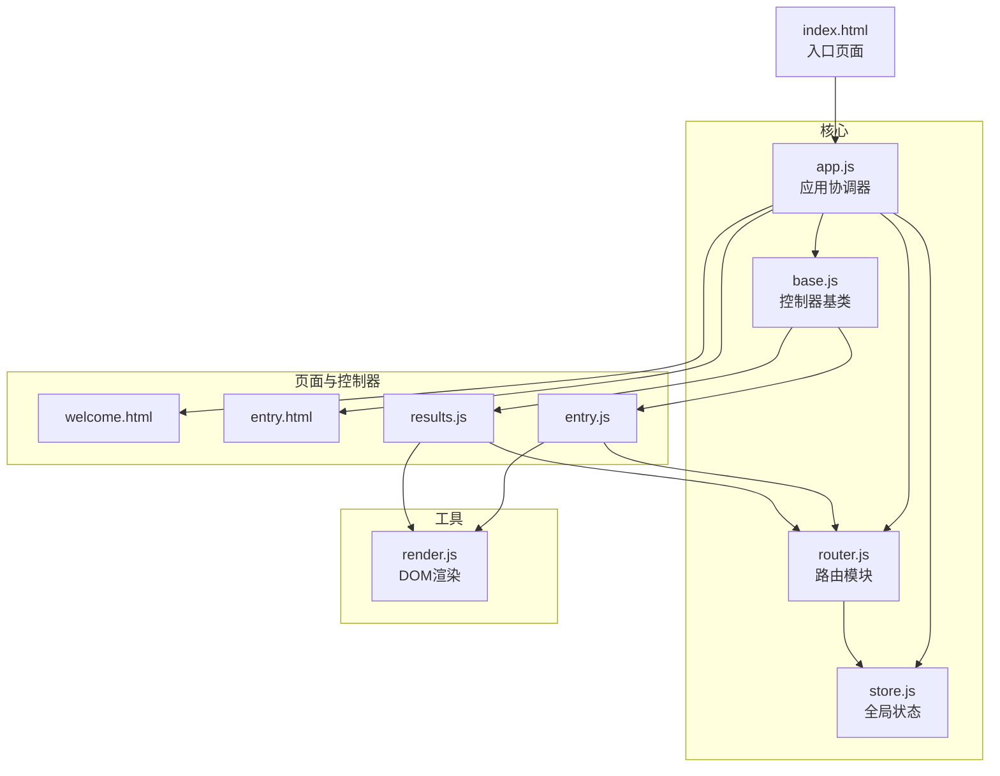
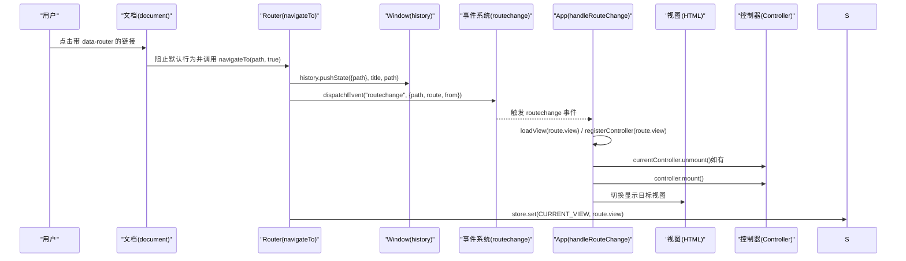
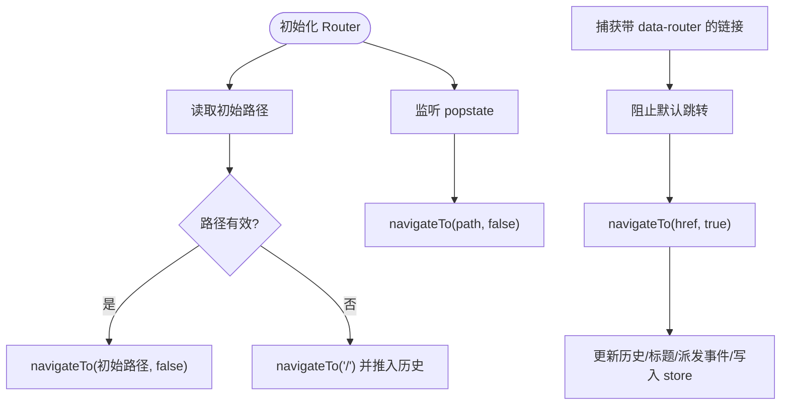
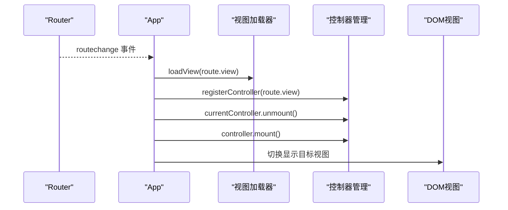
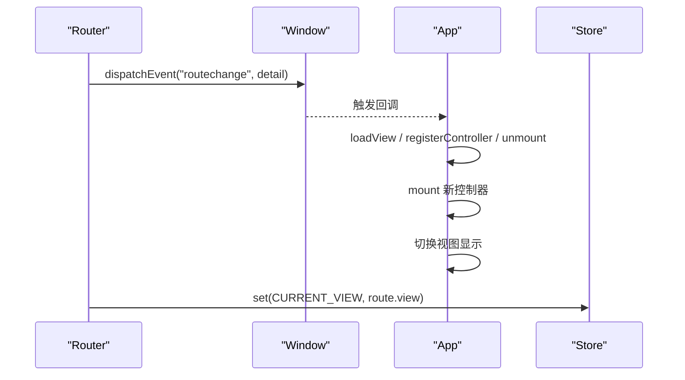
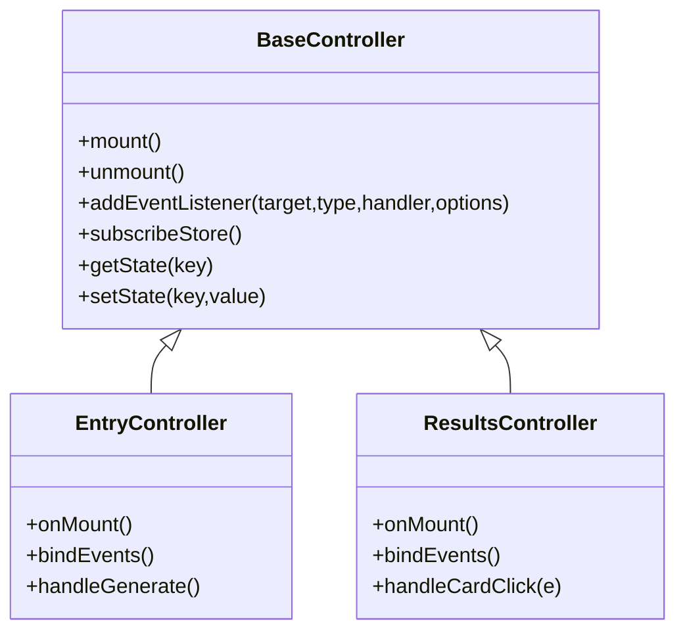
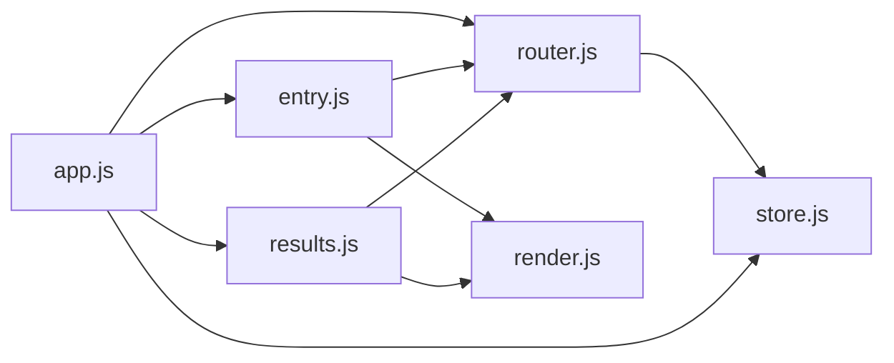

# 路由系统

<cite>
**本文引用的文件**
- [router.js](file://js/core/router.js)
- [app.js](file://js/core/app.js)
- [store.js](file://js/core/store.js)
- [base.js](file://js/controllers/base.js)
- [entry.js](file://js/controllers/entry.js)
- [results.js](file://js/controllers/results.js)
- [render.js](file://js/utils/render.js)
- [index.html](file://index.html)
- [welcome.html](file://views/welcome.html)
- [entry.html](file://views/entry.html)
</cite>

## 目录
1. [简介](#简介)
2. [项目结构](#项目结构)
3. [核心组件](#核心组件)
4. [架构总览](#架构总览)
5. [详细组件分析](#详细组件分析)
6. [依赖关系分析](#依赖关系分析)
7. [性能考量](#性能考量)
8. [故障排查指南](#故障排查指南)
9. [结论](#结论)
10. [附录](#附录)

## 简介
本文件系统性梳理前端路由系统的设计与实现，围绕 Router 模块、路由初始化流程、页面切换机制、路由事件处理、导航 API 使用、路由配置与最佳实践、以及路由守卫与权限控制策略进行深入解析。目标是帮助开发者快速理解并高效扩展该路由体系。

## 项目结构
路由系统位于 js/core 目录，配合应用入口、控制器层与视图资源协同工作：
- 路由核心：js/core/router.js
- 应用协调：js/core/app.js
- 全局状态：js/core/store.js
- 控制器基类：js/controllers/base.js
- 页面控制器：entry.js、results.js 等
- 渲染工具：js/utils/render.js
- 视图模板：views/*.html
- 入口页面：index.html

图表来源
- [router.js](file://js/core/router.js#L1-L142)
- [app.js](file://js/core/app.js#L1-L206)
- [store.js](file://js/core/store.js#L1-L212)
- [base.js](file://js/controllers/base.js#L1-L131)
- [entry.js](file://js/controllers/entry.js#L1-L241)
- [results.js](file://js/controllers/results.js#L1-L614)
- [render.js](file://js/utils/render.js#L1-L200)
- [index.html](file://index.html#L1-L79)
- [welcome.html](file://views/welcome.html#L1-L34)
- [entry.html](file://views/entry.html#L1-L234)

章节来源
- [router.js](file://js/core/router.js#L1-L142)
- [app.js](file://js/core/app.js#L1-L206)
- [index.html](file://index.html#L1-L79)

## 核心组件
- 路由模块 router.js
  - 路由配置表：定义路径到视图与标题的映射
  - 初始化：监听 popstate、处理初始路径、拦截链接点击
  - 导航 API：navigateTo、goBack、isValidRoute、getCurrentRoute 等
  - 事件与状态：派发 routechange 事件、更新 store 的当前视图
- 应用协调器 app.js
  - 预加载首屏视图、注册控制器
  - 监听 routechange 事件，动态加载视图、挂载/卸载控制器、切换视图显示
  - 提供统一的导航入口 navigate
- 全局状态 store.js
  - 维护 currentView 等应用状态，供路由与控制器订阅
- 控制器基类 base.js
  - 生命周期：mount/unmount、事件绑定/清理、状态订阅/取消
- 页面控制器 entry.js、results.js
  - 在交互中调用 navigateTo/goBack 完成页面跳转
- 渲染工具 render.js
  - 提供 DOM 操作与视图渲染辅助能力

章节来源
- [router.js](file://js/core/router.js#L1-L142)
- [app.js](file://js/core/app.js#L1-L206)
- [store.js](file://js/core/store.js#L1-L212)
- [base.js](file://js/controllers/base.js#L1-L131)
- [entry.js](file://js/controllers/entry.js#L1-L241)
- [results.js](file://js/controllers/results.js#L1-L614)
- [render.js](file://js/utils/render.js#L1-L200)

## 架构总览
路由系统采用“配置驱动 + 事件驱动”的轻量架构：
- 配置驱动：ROUTES 定义路径到视图的静态映射
- 事件驱动：navigateTo 派发 routechange，app.js 监听并协调视图与控制器
- 状态驱动：store 统一管理 currentView，控制器通过订阅实现响应式更新

图表来源
- [router.js](file://js/core/router.js#L25-L79)
- [app.js](file://js/core/app.js#L145-L168)
- [store.js](file://js/core/store.js#L69-L81)

## 详细组件分析

### Router 模块设计与实现
- 路由配置
  - 以常量 ROUTES 维护路径到视图与标题的映射，便于集中管理与校验
- 初始化流程
  - 监听 popstate：浏览器前进/后退时同步路由状态
  - 初始路径处理：若当前 URL 对应有效路由则直接进入；否则重定向首页
  - 链接拦截：通过事件委托捕获带 data-router 的链接，统一走 navigateTo
- 导航控制
  - navigateTo：更新 currentRoute、可选推入历史、更新页面标题、派发 routechange、写入 store.currentView
  - goBack：封装 history.back
  - 辅助查询：getCurrentRoute、getCurrentRouteConfig、getRoutes、isValidRoute
- URL 管理策略
  - 使用 HTML5 History API 的 pushState，确保 URL 与应用状态一致
  - 标题与视图联动，提升可访问性与 SEO 友好性

图表来源
- [router.js](file://js/core/router.js#L25-L79)

章节来源
- [router.js](file://js/core/router.js#L1-L142)

### 应用协调器与页面切换机制
- 预加载与注册
  - 首屏预加载 welcome 与 entry 视图，提前注册对应控制器，降低首次切换延迟
- 路由事件处理
  - 监听 routechange：动态加载目标视图、注册控制器、卸载旧控制器、挂载新控制器、切换视图显示
- 视图切换
  - 通过隐藏/显示 .view 元素实现无刷新切换，并滚动至顶部

图表来源
- [app.js](file://js/core/app.js#L145-L168)

章节来源
- [app.js](file://js/core/app.js#L47-L184)

### 导航 API 使用与历史管理
- 编程式导航
  - 控制器内部通过 navigateTo('/path') 或 app.navigate('/path') 发起导航
  - goBack 提供便捷的回退
- 历史记录管理
  - navigateTo 默认 pushState=true，将新路由推入历史栈
  - popstate 自动处理前进/后退，无需手动维护历史栈
- 前进后退控制
  - goBack 直接调用 history.back
  - 可结合业务场景在控制器中决定是否 pushState

章节来源
- [router.js](file://js/core/router.js#L57-L79)
- [router.js](file://js/core/router.js#L117-L119)
- [app.js](file://js/core/app.js#L190-L192)

### 路由变化事件处理
- 事件创建与派发
  - navigateTo 派发自定义事件 routechange，携带 path、route、from 等上下文
- 参数传递与状态更新
  - 事件 detail 透传路由元数据
  - store.set(CURRENT_VIEW, route.view) 使控制器可订阅当前视图变更
- 事件监听与处理
  - App 监听 routechange，在回调中执行视图加载、控制器挂载与视图切换

图表来源
- [router.js](file://js/core/router.js#L72-L78)
- [app.js](file://js/core/app.js#L145-L168)
- [store.js](file://js/core/store.js#L79-L81)

章节来源
- [router.js](file://js/core/router.js#L72-L78)
- [app.js](file://js/core/app.js#L145-L168)
- [store.js](file://js/core/store.js#L79-L81)

### 控制器生命周期与路由集成
- 基类能力
  - mount/unmount 生命周期钩子，自动绑定/解绑事件与状态订阅
- 页面控制器中的导航
  - EntryController：在生成推荐后 navigateTo('/results')
  - ResultsController：goBack 返回上一页，或 navigateTo('/favorites'|'/profile'|'/diary'|'/upload')

图表来源
- [base.js](file://js/controllers/base.js#L11-L131)
- [entry.js](file://js/controllers/entry.js#L14-L241)
- [results.js](file://js/controllers/results.js#L13-L614)

章节来源
- [base.js](file://js/controllers/base.js#L1-L131)
- [entry.js](file://js/controllers/entry.js#L1-L241)
- [results.js](file://js/controllers/results.js#L1-L614)

### 路由守卫与权限控制策略
- 当前实现
  - 路由表仅做路径有效性校验（isValidRoute），未内置路由守卫
- 建议策略
  - 在 navigateTo 前增加前置守卫：校验登录态、角色权限、数据准备等
  - 在 App.handleRouteChange 中增加后置守卫：埋点、统计、页面级权限检查
  - 对敏感路径（如 /profile、/favorites、/upload）在控制器内补充细粒度校验
- 实施要点
  - 保持守卫函数纯函数化，便于测试与复用
  - 为守卫提供可配置的白名单与降级策略（如未满足条件重定向首页）

章节来源
- [router.js](file://js/core/router.js#L110-L112)
- [app.js](file://js/core/app.js#L145-L168)

## 依赖关系分析
- 模块耦合
  - router.js 依赖 store.js 写入 currentView，形成“路由 -> 状态”单向依赖
  - app.js 依赖 router.js 的初始化与导航 API，同时依赖 store.js 与各控制器
  - 控制器依赖 router.js 的导航 API 与 base.js 的生命周期管理
- 外部依赖
  - History API：pushState/back
  - 自定义事件：routechange
  - fetch：动态加载视图 HTML

图表来源
- [router.js](file://js/core/router.js#L1-L142)
- [app.js](file://js/core/app.js#L1-L206)
- [store.js](file://js/core/store.js#L1-L212)
- [entry.js](file://js/controllers/entry.js#L1-L241)
- [results.js](file://js/controllers/results.js#L1-L614)
- [render.js](file://js/utils/render.js#L1-L200)

章节来源
- [router.js](file://js/core/router.js#L1-L142)
- [app.js](file://js/core/app.js#L1-L206)
- [store.js](file://js/core/store.js#L1-L212)

## 性能考量
- 预加载首屏视图：在应用启动阶段预加载关键视图，降低首次切换抖动
- 懒加载与缓存：按需 loadView，使用 Set 记录已加载视图，避免重复请求
- 控制器复用：Map 管理控制器实例，避免重复构造
- 事件委托：统一拦截链接点击，减少事件监听器数量
- DOM 操作最小化：切换视图时批量隐藏/显示，减少重排

章节来源
- [app.js](file://js/core/app.js#L54-L60)
- [app.js](file://js/core/app.js#L79-L104)
- [app.js](file://js/core/app.js#L174-L184)

## 故障排查指南
- 无法跳转或跳转无效
  - 检查链接是否带有 data-router 属性
  - 确认目标路径存在于 ROUTES 表
- 前进/后退异常
  - 确保 popstate 监听正常，navigateTo 第二参数为 false
- 视图未更新
  - 确认 routechange 事件被监听且 handleRouteChange 正常执行
  - 检查目标视图元素是否存在且 ID 与路由配置一致
- 控制器未卸载/事件未清理
  - 确认 BaseController 的 unmount 与 removeEventListeners 是否被调用
- 标题未更新
  - 检查 navigateTo 是否正确设置 document.title

章节来源
- [router.js](file://js/core/router.js#L42-L49)
- [router.js](file://js/core/router.js#L27-L29)
- [app.js](file://js/core/app.js#L145-L168)
- [base.js](file://js/controllers/base.js#L35-L42)

## 结论
该路由系统以简洁的配置与事件机制实现了高效的页面切换与状态同步，具备良好的扩展性与可维护性。通过在导航前后引入守卫策略，可进一步强化权限控制与用户体验。建议在现有基础上逐步完善路由守卫、历史栈管理与错误恢复机制，以支撑更复杂的业务场景。

## 附录

### 路由配置示例与最佳实践
- 路由配置
  - 在 ROUTES 中新增路径映射，确保 view ID 与实际视图元素 ID 一致
- 最佳实践
  - 所有页面跳转统一通过 data-router 链接或 navigateTo 调用
  - 在控制器中使用 app.navigate 或 router.navigateTo，避免直接操作 history
  - 对敏感页面在控制器内补充细粒度权限校验
  - 使用 store.subscribe 监听 CURRENT_VIEW，实现跨组件联动

章节来源
- [router.js](file://js/core/router.js#L9-L17)
- [router.js](file://js/core/router.js#L137-L141)
- [store.js](file://js/core/store.js#L99-L124)

### 常见问题与解决方案
- 问题：点击链接未跳转
  - 解决：确认链接包含 data-router 属性，且路由表存在该路径
- 问题：浏览器前进/后退无效
  - 解决：检查 popstate 监听与 navigateTo(false) 的使用
- 问题：视图切换闪烁
  - 解决：确保首屏预加载与视图元素隐藏/显示逻辑正确

章节来源
- [router.js](file://js/core/router.js#L42-L49)
- [app.js](file://js/core/app.js#L54-L60)
- [app.js](file://js/core/app.js#L174-L184)