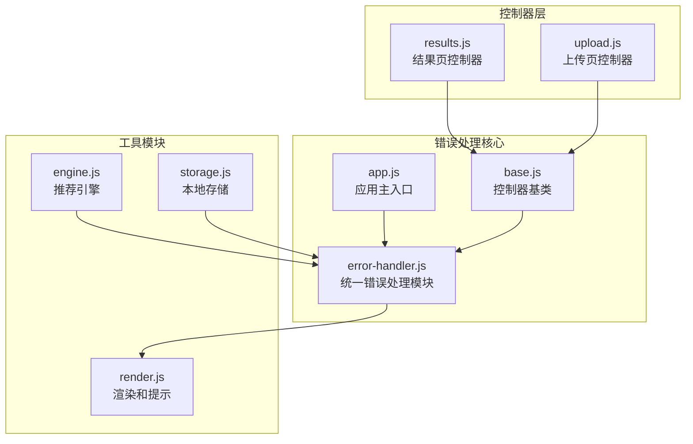
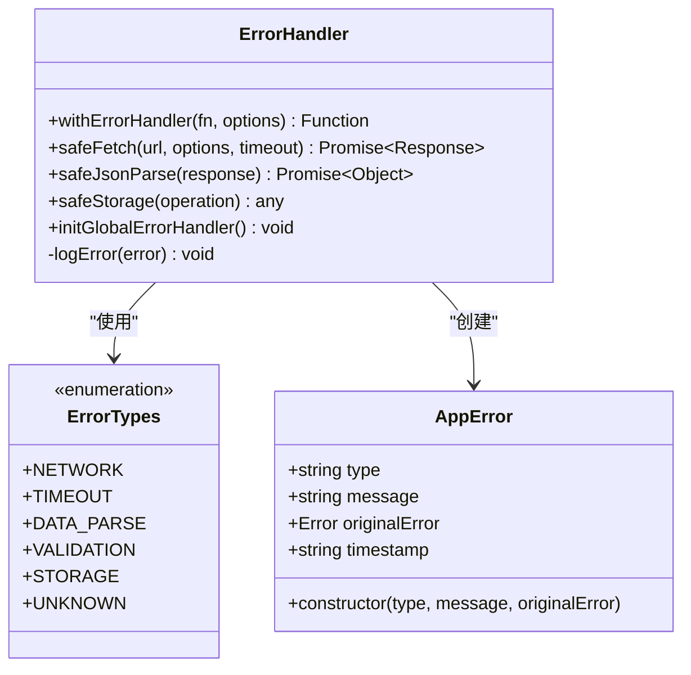
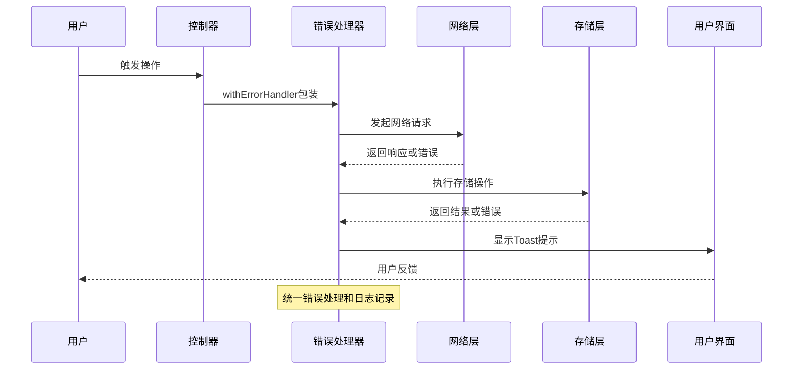
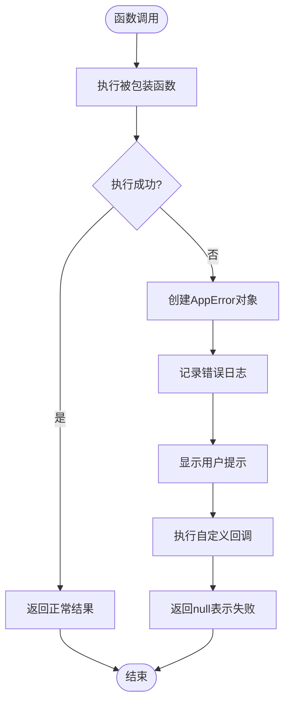
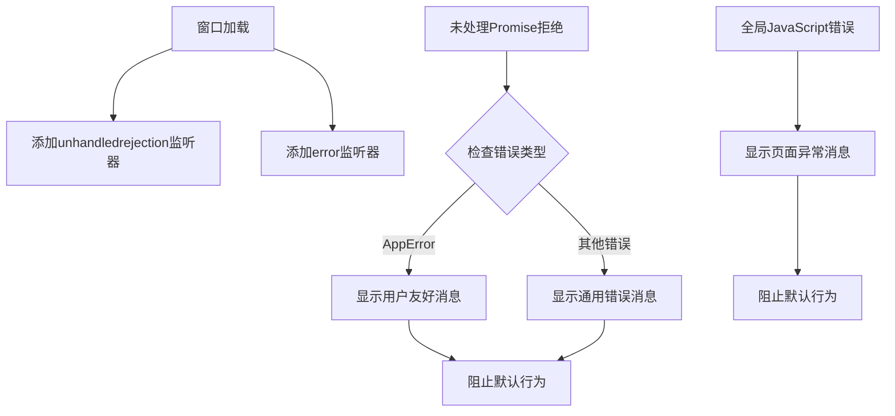
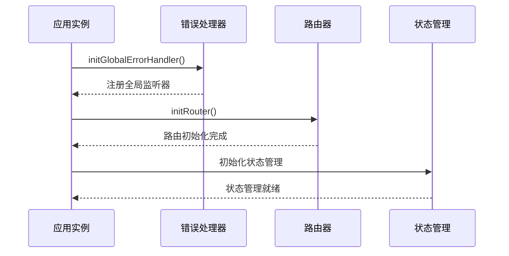
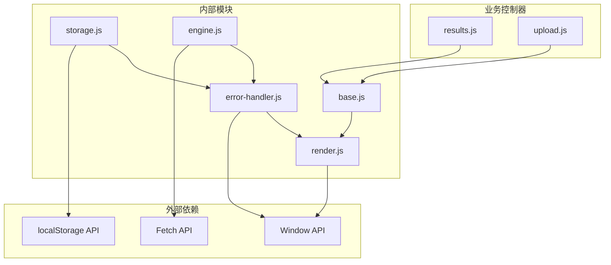

# 错误处理系统

<cite>
**本文档引用的文件**
- [error-handler.js](file://js/core/error-handler.js)
- [app.js](file://js/core/app.js)
- [render.js](file://js/utils/render.js)
- [engine.js](file://js/services/engine.js)
- [storage.js](file://js/data/storage.js)
- [base.js](file://js/controllers/base.js)
- [results.js](file://js/controllers/results.js)
- [upload.js](file://js/controllers/upload.js)
</cite>

## 目录
1. [简介](#简介)
2. [项目结构](#项目结构)
3. [核心组件](#核心组件)
4. [架构概览](#架构概览)
5. [详细组件分析](#详细组件分析)
6. [依赖关系分析](#依赖关系分析)
7. [性能考虑](#性能考虑)
8. [故障排除指南](#故障排除指南)
9. [结论](#结论)

## 简介

多任务时尚项目中的错误处理系统是一个统一的错误管理框架，旨在提供一致的错误捕获、分类、处理和恢复机制。该系统通过模块化设计实现了全局错误监听、智能错误包装、安全的数据访问以及友好的用户提示功能。

系统的核心目标是：
- 提供统一的错误处理接口
- 实现智能的错误分类和优先级管理
- 确保用户体验的一致性
- 支持自动重试和手动干预机制
- 提供完善的日志记录和监控能力

## 项目结构

错误处理系统主要分布在以下核心文件中：

**图表来源**
- [error-handler.js](file://js/core/error-handler.js#L1-L190)
- [app.js](file://js/core/app.js#L1-L206)
- [render.js](file://js/utils/render.js#L1-L487)

**章节来源**
- [error-handler.js](file://js/core/error-handler.js#L1-L190)
- [app.js](file://js/core/app.js#L1-L206)

## 核心组件

### 错误类型定义

系统定义了完整的错误分类体系，涵盖所有可能的错误场景：

**图表来源**
- [error-handler.js](file://js/core/error-handler.js#L8-L37)

### 错误处理流程

系统采用多层次的错误处理策略：

1. **全局错误监听**：捕获未处理的Promise拒绝和全局JavaScript错误
2. **智能错误包装**：统一包装异步函数，提供标准化的错误处理
3. **安全数据访问**：提供安全的网络请求和本地存储操作
4. **用户友好提示**：通过Toast消息向用户传达错误信息

**章节来源**
- [error-handler.js](file://js/core/error-handler.js#L168-L189)
- [error-handler.js](file://js/core/error-handler.js#L45-L79)

## 架构概览

错误处理系统的整体架构采用分层设计，确保各组件职责清晰、耦合度低：

**图表来源**
- [error-handler.js](file://js/core/error-handler.js#L45-L79)
- [render.js](file://js/utils/render.js#L457-L486)

## 详细组件分析

### ErrorHandler模块设计

#### 错误包装器 withErrorHandler

`withErrorHandler`函数是系统的核心组件，提供了强大的错误包装功能：

**图表来源**
- [error-handler.js](file://js/core/error-handler.js#L53-L78)

#### 安全数据访问函数

系统提供了三个核心的安全访问函数：

1. **safeFetch**：提供超时控制和HTTP状态码验证的网络请求封装
2. **safeJsonParse**：安全的JSON解析，处理格式错误
3. **safeStorage**：本地存储的安全包装，处理存储限制和权限问题

**章节来源**
- [error-handler.js](file://js/core/error-handler.js#L101-L133)
- [error-handler.js](file://js/core/error-handler.js#L140-L146)
- [error-handler.js](file://js/core/error-handler.js#L153-L163)

### 全局错误处理器

#### initGlobalErrorHandler函数

全局错误处理器负责捕获应用程序级别的错误：

**图表来源**
- [error-handler.js](file://js/core/error-handler.js#L168-L189)

#### 错误分类和优先级

系统实现了智能的错误分类机制：

| 错误类型 | 用途 | 优先级 | 用户提示 |
|---------|------|--------|----------|
| NETWORK | 网络连接失败 | 高 | "网络连接失败，请检查网络后重试" |
| TIMEOUT | 请求超时 | 高 | "请求超时，请稍后重试" |
| DATA_PARSE | 数据解析错误 | 中 | "数据加载异常，请刷新页面" |
| STORAGE | 本地存储失败 | 中 | "本地存储失败，请检查浏览器设置" |
| VALIDATION | 输入验证错误 | 低 | "输入信息有误，请检查后再试" |
| UNKNOWN | 未知错误 | 中 | "操作失败，请稍后重试" |

**章节来源**
- [error-handler.js](file://js/core/error-handler.js#L8-L25)

### 应用集成

#### 在应用初始化中的使用

应用在启动时会初始化全局错误处理器：

**图表来源**
- [app.js](file://js/core/app.js#L47-L73)

#### 在控制器中的应用

控制器通过继承BaseController获得错误处理能力：

**章节来源**
- [app.js](file://js/core/app.js#L122-L131)
- [base.js](file://js/controllers/base.js#L11-L131)

## 依赖关系分析

错误处理系统的依赖关系清晰明确，遵循单一职责原则：

**图表来源**
- [error-handler.js](file://js/core/error-handler.js#L5-L6)
- [storage.js](file://js/data/storage.js#L5)
- [engine.js](file://js/services/engine.js#L6-L9)

**章节来源**
- [error-handler.js](file://js/core/error-handler.js#L1-L190)
- [storage.js](file://js/data/storage.js#L1-L66)
- [engine.js](file://js/services/engine.js#L1-L425)

## 性能考虑

### 错误处理性能优化

1. **异步错误处理**：使用Promise和async/await确保非阻塞的错误处理
2. **内存管理**：及时清理事件监听器，防止内存泄漏
3. **日志优化**：只记录必要的错误信息，避免过度的日志输出
4. **缓存策略**：对常用数据进行缓存，减少重复的网络请求

### 错误恢复机制

系统提供了多种错误恢复策略：

1. **自动重试**：对于网络超时等临时性错误，可以实现重试机制
2. **降级处理**：当某些功能不可用时，提供简化版本的功能
3. **用户干预**：允许用户手动触发重试或采取其他行动
4. **优雅降级**：在错误发生时保持应用的基本功能

## 故障排除指南

### 常见错误场景及处理策略

#### 网络错误处理

当遇到网络连接问题时，系统会：
- 检测超时情况并抛出TIMEOUT错误
- 处理HTTP状态码错误
- 提供用户友好的错误提示

#### 数据解析错误

对于JSON数据解析失败的情况：
- 捕获解析异常
- 抛出DATA_PARSE错误
- 提供具体的错误信息

#### 存储错误处理

本地存储失败时的处理：
- 检测存储空间不足
- 处理隐私模式限制
- 提供相应的解决方案建议

### 调试工具使用

#### 错误日志记录

系统会在控制台输出详细的错误信息：
- 错误类型和消息
- 时间戳
- 原始错误信息
- 错误堆栈跟踪

#### 用户提示机制

通过Toast消息向用户传达错误信息：
- 自动显示错误消息
- 支持手动关闭
- 防止多个Toast同时显示

**章节来源**
- [error-handler.js](file://js/core/error-handler.js#L84-L92)
- [render.js](file://js/utils/render.js#L457-L486)

## 结论

多任务时尚项目的错误处理系统展现了现代Web应用的最佳实践。通过统一的错误分类、智能的错误包装、全局的错误监听和友好的用户提示，系统为用户提供了稳定可靠的应用体验。

系统的主要优势包括：
- **一致性**：统一的错误处理接口和用户提示
- **可维护性**：模块化的架构设计，职责分离清晰
- **可扩展性**：支持新的错误类型和处理策略
- **用户体验**：智能的错误分类和用户友好的提示

未来可以考虑的改进方向：
- 实现更智能的自动重试机制
- 添加错误监控和上报功能
- 增强错误恢复和容错能力
- 优化错误日志的收集和分析