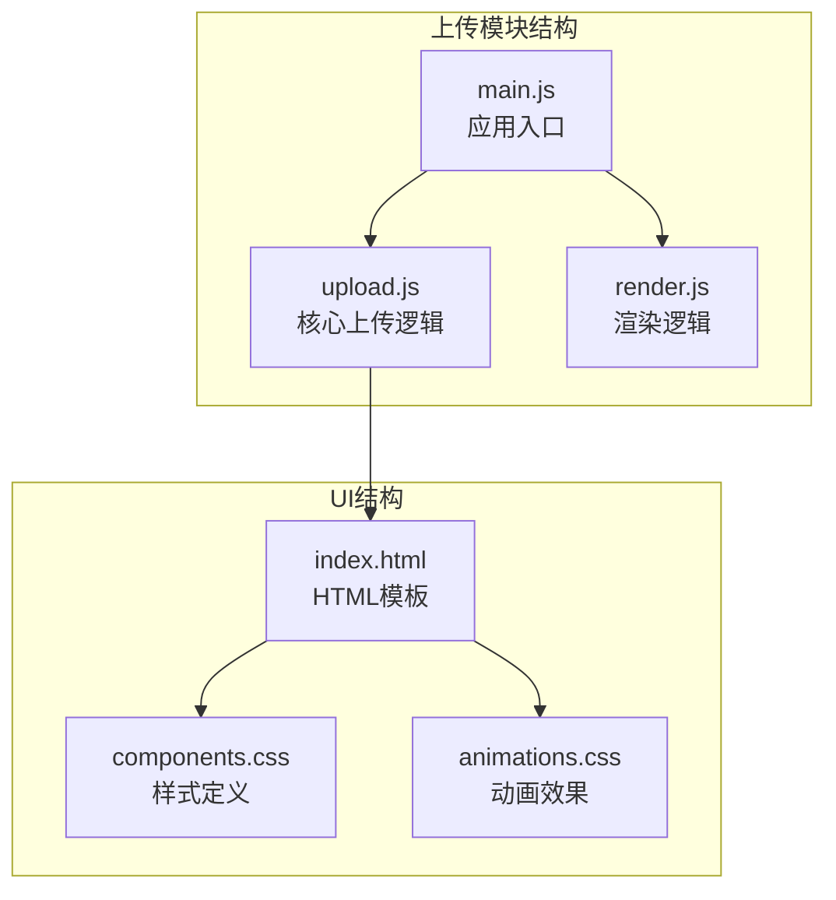
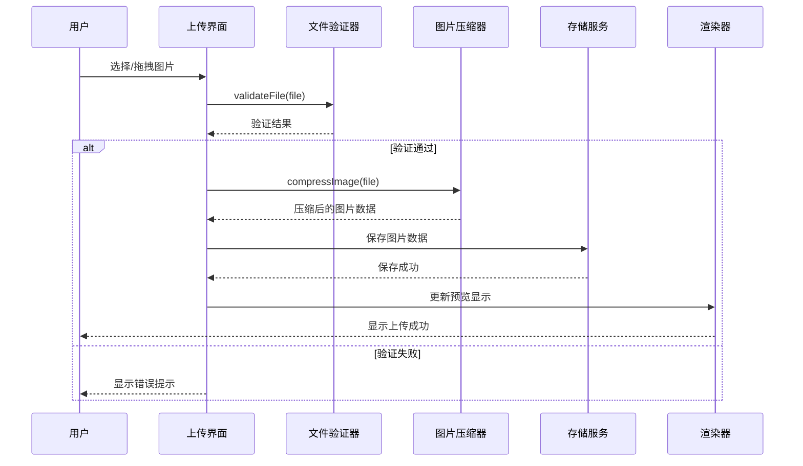
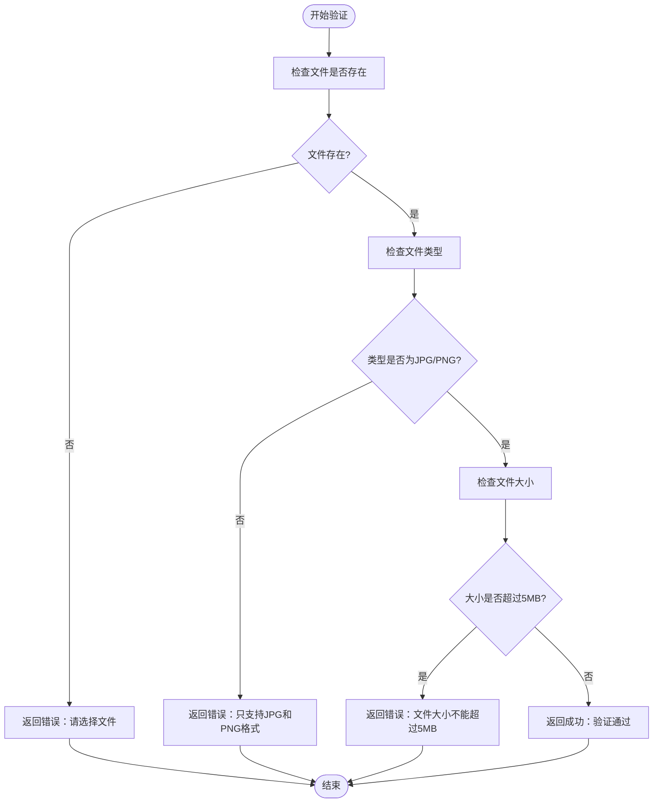
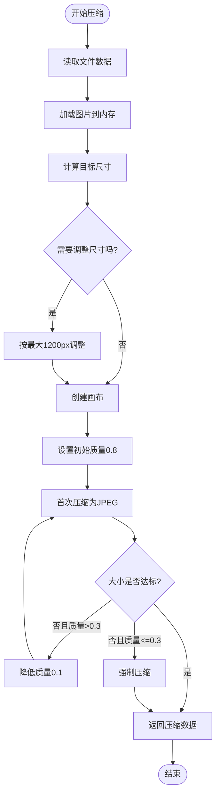
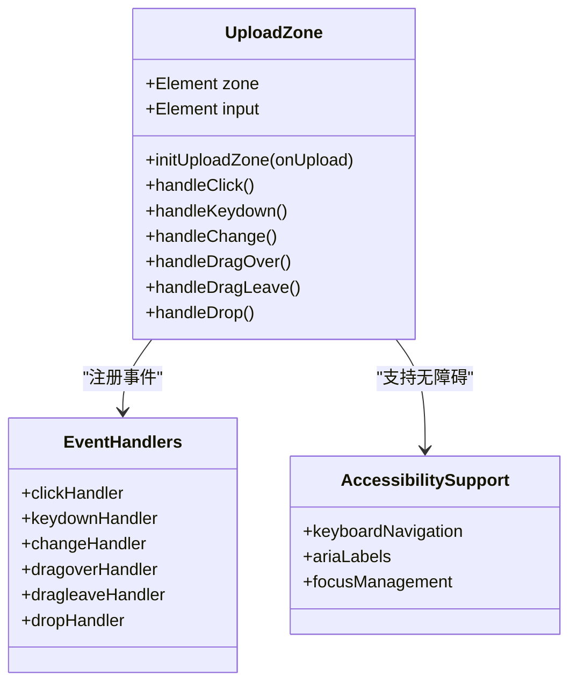
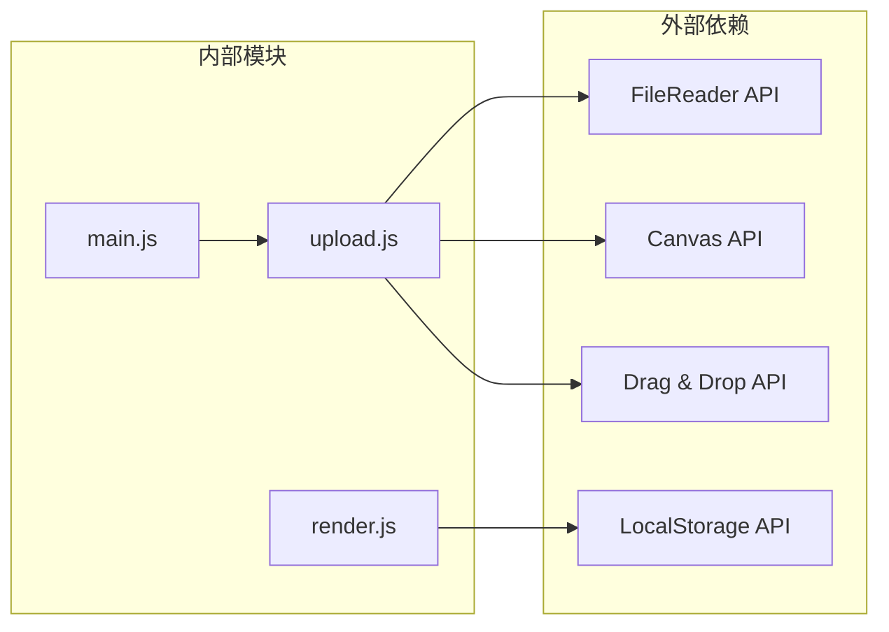

# 上传处理模块 (upload.js)

<cite>
**本文档引用的文件**
- [upload.js](file://js/upload.js)
- [main.js](file://js/main.js)
- [index.html](file://index.html)
- [components.css](file://css/components.css)
- [animations.css](file://css/animations.css)
- [render.js](file://js/render.js)
</cite>

## 目录
1. [简介](#简介)
2. [项目结构](#项目结构)
3. [核心组件](#核心组件)
4. [架构概览](#架构概览)
5. [详细组件分析](#详细组件分析)
6. [依赖关系分析](#依赖关系分析)
7. [性能考虑](#性能考虑)
8. [故障排除指南](#故障排除指南)
9. [结论](#结论)
10. [附录](#附录)

## 简介
上传处理模块是五行动装建议应用中的关键功能组件，负责处理用户上传的穿搭照片。该模块提供了完整的文件上传解决方案，包括文件验证、图片压缩和拖拽上传等功能。模块采用现代Web技术栈，支持多种文件格式，具有良好的用户体验和性能表现。

## 项目结构
上传处理模块位于JavaScript目录中，与主应用逻辑紧密集成。模块采用模块化设计，通过ES6模块系统导出核心功能函数。



**图表来源**
- [upload.js](file://js/upload.js#L1-L145)
- [main.js](file://js/main.js#L1-L317)
- [index.html](file://index.html#L157-L196)

**章节来源**
- [upload.js](file://js/upload.js#L1-L145)
- [main.js](file://js/main.js#L1-L317)
- [index.html](file://index.html#L157-L196)

## 核心组件
上传处理模块包含三个核心功能函数，每个函数都针对特定的上传处理需求：

### 主要配置常量
模块定义了以下关键配置：
- 最大文件大小：5MB
- 目标压缩大小：200KB
- 允许的文件类型：JPG、PNG格式

### 核心功能函数
1. **validateFile()** - 文件验证函数
2. **compressImage()** - 图片压缩函数  
3. **initUploadZone()** - 上传区域初始化函数

**章节来源**
- [upload.js](file://js/upload.js#L5-L26)
- [upload.js](file://js/upload.js#L12-L26)
- [upload.js](file://js/upload.js#L31-L82)
- [upload.js](file://js/upload.js#L87-L136)

## 架构概览
上传处理模块采用分层架构设计，各组件职责明确，耦合度低。



**图表来源**
- [upload.js](file://js/upload.js#L12-L26)
- [upload.js](file://js/upload.js#L31-L82)
- [main.js](file://js/main.js#L274-L292)
- [render.js](file://js/render.js#L220-L237)

## 详细组件分析

### 文件验证组件 (validateFile)
文件验证组件负责确保上传文件符合应用要求，提供多层次的安全检查。



**图表来源**
- [upload.js](file://js/upload.js#L12-L26)

#### 验证规则详解
1. **空值检查**：确保用户选择了有效的文件
2. **格式验证**：严格限制为JPG和PNG格式
3. **大小限制**：防止超大文件占用服务器资源

#### 安全特性
- 类型白名单机制，防止恶意文件上传
- 文件大小限制，保护服务器存储空间
- 客户端预验证，减少无效请求

**章节来源**
- [upload.js](file://js/upload.js#L12-L26)

### 图片压缩组件 (compressImage)
图片压缩组件实现了智能的图片处理算法，平衡压缩质量和文件大小。



**图表来源**
- [upload.js](file://js/upload.js#L31-L82)

#### 压缩算法特点
1. **自适应质量控制**：从0.8质量开始，逐步降低至0.3
2. **尺寸优先策略**：保持最大边不超过1200px
3. **目标大小优化**：努力达到200KB的目标大小

#### 性能优化策略
- 使用Canvas API进行高效的图片处理
- 二分搜索式的质量调整算法
- 内存友好的渐进式压缩过程

**章节来源**
- [upload.js](file://js/upload.js#L31-L82)

### 上传区域初始化组件 (initUploadZone)
上传区域初始化组件提供了完整的拖拽上传体验，支持多种交互方式。



**图表来源**
- [upload.js](file://js/upload.js#L87-L136)

#### 交互功能特性
1. **多模式支持**：
   - 点击选择文件
   - 键盘操作支持
   - 拖拽上传功能

2. **视觉反馈**：
   - 拖拽悬停状态
   - 实时预览显示
   - 成功/失败状态指示

3. **无障碍设计**：
   - 键盘导航支持
   - 屏幕阅读器友好
   - 焦点管理

**章节来源**
- [upload.js](file://js/upload.js#L87-L136)
- [components.css](file://css/components.css#L155-L223)
- [animations.css](file://css/animations.css#L157-L160)

## 依赖关系分析

### 模块间依赖关系


**图表来源**
- [upload.js](file://js/upload.js#L31-L82)
- [main.js](file://js/main.js#L15-L15)
- [render.js](file://js/render.js#L220-L237)

### 数据流依赖
上传处理模块的数据流遵循严格的单向原则：

1. **输入数据**：用户选择的文件对象
2. **处理数据**：验证结果和压缩后的图片数据
3. **输出数据**：存储的图片URL和UI更新指令

**章节来源**
- [upload.js](file://js/upload.js#L1-L145)
- [main.js](file://js/main.js#L274-L292)

## 性能考虑

### 内存管理策略
1. **及时释放资源**：压缩完成后立即清理Canvas和Image对象
2. **渐进式处理**：避免同时处理多个大文件
3. **缓存优化**：合理使用浏览器缓存机制

### 网络传输优化
1. **数据压缩**：通过质量控制减少传输数据量
2. **格式选择**：统一使用JPEG格式保证兼容性
3. **尺寸控制**：限制最大边长避免超大图片

### 用户体验优化
1. **即时反馈**：提供实时的状态指示
2. **错误恢复**：支持重新上传和错误修正
3. **进度显示**：复杂操作时提供进度反馈

## 故障排除指南

### 常见问题及解决方案

#### 文件验证失败
**问题症状**：上传按钮不可用或显示错误信息
**可能原因**：
- 文件类型不支持
- 文件大小超出限制
- 文件为空或损坏

**解决步骤**：
1. 检查文件扩展名是否为.jpg或.png
2. 确认文件大小不超过5MB
3. 重新选择或修复文件

#### 图片压缩异常
**问题症状**：图片无法压缩或压缩后质量过差
**可能原因**：
- 浏览器不支持Canvas API
- 图片格式不受支持
- 内存不足导致处理失败

**解决步骤**：
1. 更新浏览器版本
2. 尝试其他图片格式
3. 关闭其他占用内存的应用程序

#### 拖拽上传失效
**问题症状**：拖拽功能无法正常工作
**可能原因**：
- 浏览器不支持拖拽API
- CSS样式冲突
- JavaScript执行错误

**解决步骤**：
1. 检查浏览器兼容性
2. 验证CSS样式是否正确加载
3. 查看浏览器控制台错误信息

### 调试技巧
1. **开发者工具**：使用浏览器调试功能监控上传过程
2. **日志记录**：在关键节点添加日志输出
3. **单元测试**：为每个功能函数编写测试用例

**章节来源**
- [upload.js](file://js/upload.js#L75-L76)
- [upload.js](file://js/upload.js#L79-L80)
- [main.js](file://js/main.js#L288-L291)

## 结论
上传处理模块是一个设计精良的前端功能组件，具有以下突出特点：

1. **功能完整性**：涵盖了文件验证、图片压缩和拖拽上传的完整流程
2. **用户体验优秀**：提供了直观的交互界面和及时的反馈机制
3. **性能表现良好**：通过合理的算法设计和资源管理保证了流畅的使用体验
4. **安全性可靠**：多重验证机制有效防止了恶意文件的上传
5. **可维护性强**：模块化设计使得代码易于理解和维护

该模块为五行动装建议应用提供了坚实的上传功能基础，为用户创造了一个便捷、安全、高效的图片上传体验。

## 附录

### API接口文档

#### validateFile(file)
**功能**：验证上传文件的有效性
**参数**：
- file: File对象 - 用户选择的文件

**返回值**：
```javascript
{
  valid: boolean,      // 验证结果
  error?: string       // 错误信息（验证失败时）
}
```

**错误处理**：
- 文件不存在：返回"请选择文件"
- 格式不支持：返回"只支持JPG和PNG格式"
- 大小超限：返回"文件大小不能超过5MB"

#### compressImage(file)
**功能**：压缩图片文件以减小文件大小
**参数**：
- file: File对象 - 需要压缩的图片文件

**返回值**：Promise<string> - 压缩后的图片数据URL

**错误处理**：
- 图片加载失败：抛出"图片加载失败"错误
- 文件读取失败：抛出"文件读取失败"错误

#### initUploadZone(onUpload)
**功能**：初始化上传区域并绑定事件处理器
**参数**：
- onUpload: Function - 文件上传回调函数

**返回值**：void

**事件支持**：
- 点击事件：触发文件选择对话框
- 键盘事件：支持Enter和Space键操作
- 拖拽事件：支持文件拖拽上传

#### getTodayString()
**功能**：获取当前日期字符串
**参数**：无

**返回值**：string - 格式为YYYY-MM-DD的日期字符串

**章节来源**
- [upload.js](file://js/upload.js#L12-L26)
- [upload.js](file://js/upload.js#L31-L82)
- [upload.js](file://js/upload.js#L87-L136)
- [upload.js](file://js/upload.js#L141-L144)

### 浏览器兼容性
- **现代浏览器**：Chrome、Firefox、Safari、Edge完全支持
- **IE浏览器**：不支持拖拽API，但基本功能仍可使用
- **移动端**：支持触摸操作和手势交互

### 性能优化建议
1. **预加载策略**：对于大文件，考虑分步加载和处理
2. **缓存机制**：实现本地缓存减少重复上传
3. **并发控制**：限制同时进行的上传任务数量
4. **错误重试**：实现智能的错误重试机制