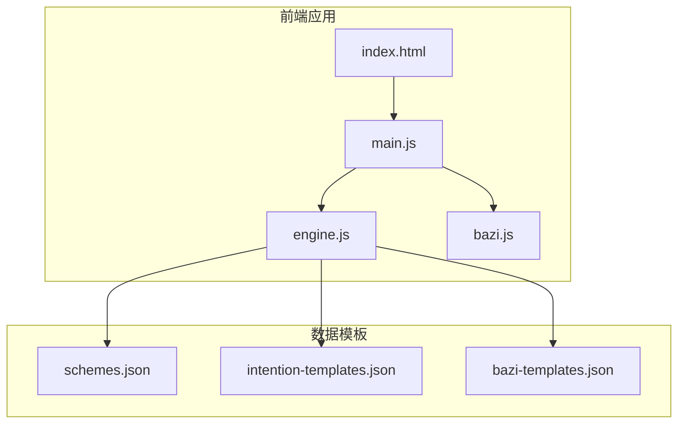
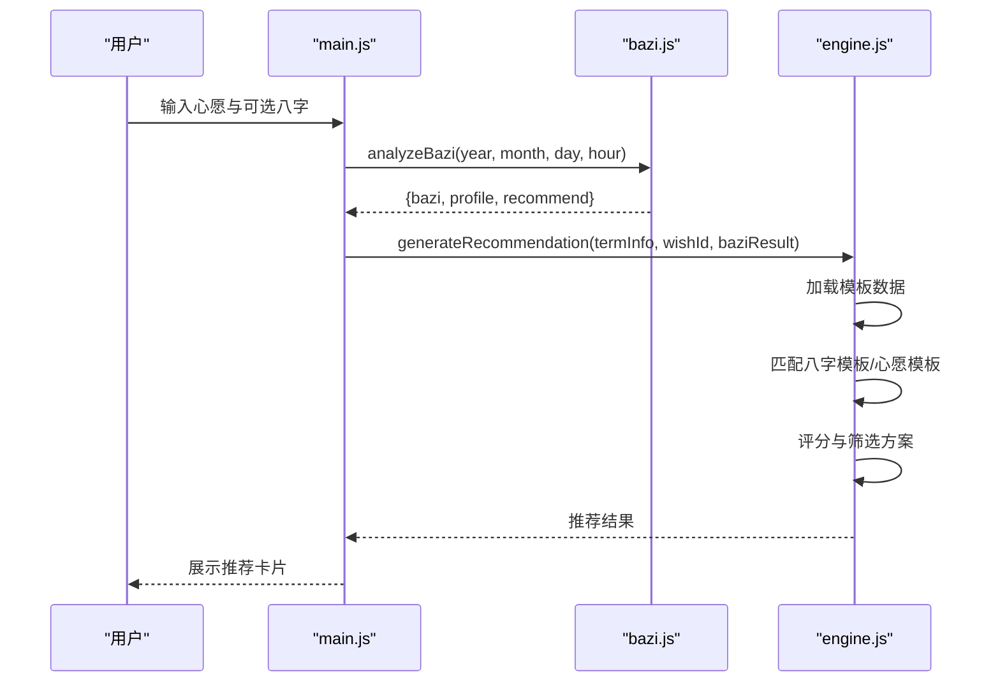
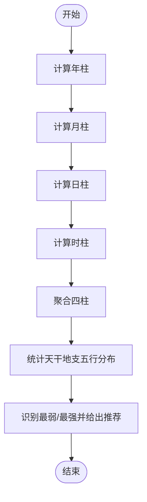
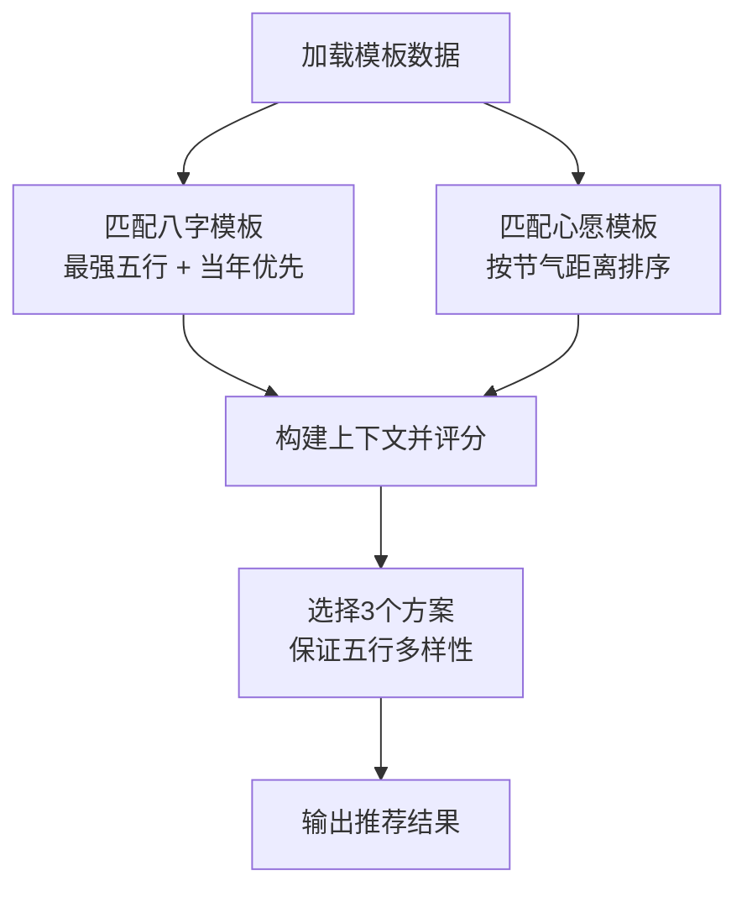
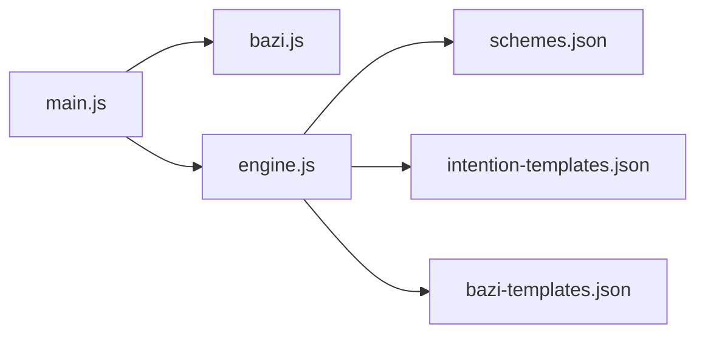

# 八字分析模块 (bazi.js)

<cite>
**本文引用的文件**
- [bazi.js](file://js/bazi.js)
- [engine.js](file://js/engine.js)
- [main.js](file://js/main.js)
- [index.html](file://index.html)
- [bazi-templates.json](file://data/bazi-templates.json)
- [schemes.json](file://data/schemes.json)
- [intention-templates.json](file://data/intention-templates.json)
</cite>

## 目录
1. [简介](#简介)
2. [项目结构](#项目结构)
3. [核心组件](#核心组件)
4. [架构总览](#架构总览)
5. [详细组件分析](#详细组件分析)
6. [依赖关系分析](#依赖关系分析)
7. [性能考量](#性能考量)
8. [故障排查指南](#故障排查指南)
9. [结论](#结论)
10. [附录](#附录)

## 简介
本技术文档聚焦于“八字分析模块”，围绕生辰八字的计算原理、天干地支组合、五行统计分析与命理特征提取进行深入解析，并结合命理模板匹配系统，给出完整的API接口说明、使用示例、算法准确性说明与扩展性设计建议。同时提供命理学基础知识介绍与实际计算示例，帮助开发者与非专业用户理解与正确使用该模块。

## 项目结构
该项目采用前端单页应用架构，核心逻辑集中在 js 目录，数据模板位于 data 目录，页面结构由 index.html 提供。与八字分析直接相关的模块与文件如下：
- js/bazi.js：八字计算与五行统计的核心实现
- js/engine.js：推荐引擎，负责模板匹配与方案评分
- js/main.js：应用入口与事件绑定，调用八字分析与推荐引擎
- data/bazi-templates.json：八字模板集合
- data/schemes.json：穿搭方案集合（节气维度）
- data/intention-templates.json：心愿模板集合（按心愿与节气）

图表来源
- [index.html](file://index.html#L1-L236)
- [main.js](file://js/main.js#L1-L317)
- [engine.js](file://js/engine.js#L1-L335)
- [bazi.js](file://js/bazi.js#L1-L193)
- [schemes.json](file://data/schemes.json#L1-L509)
- [intention-templates.json](file://data/intention-templates.json#L1-L253)
- [bazi-templates.json](file://data/bazi-templates.json#L1-L103)

章节来源
- [index.html](file://index.html#L1-L236)
- [main.js](file://js/main.js#L1-L317)
- [engine.js](file://js/engine.js#L1-L335)
- [bazi.js](file://js/bazi.js#L1-L193)
- [schemes.json](file://data/schemes.json#L1-L509)
- [intention-templates.json](file://data/intention-templates.json#L1-L253)
- [bazi-templates.json](file://data/bazi-templates.json#L1-L103)

## 核心组件
- 八字计算核心（bazi.js）
  - 天干地支常量与五行映射
  - 年柱、月柱、日柱、时柱计算函数
  - 八字结构聚合与返回
  - 五行分布统计与推荐元素
- 命理模板匹配（engine.js）
  - 八字模板匹配：基于“最强五行”与“当年”优先策略
  - 方案评分：综合节气、心愿、八字权重
  - 推荐生成与换一批
- 应用入口（main.js）
  - 表单收集与调用 analyzeBazi
  - 调用 generateRecommendation 生成推荐
  - 结果渲染与交互

章节来源
- [bazi.js](file://js/bazi.js#L1-L193)
- [engine.js](file://js/engine.js#L120-L152)
- [main.js](file://js/main.js#L200-L244)

## 架构总览
八字分析模块在前端应用中的调用链路如下：
- 用户在入口页输入心愿与可选的八字信息
- main.js 收集表单数据，调用 analyzeBazi 计算八字与五行
- main.js 将结果传递给 generateRecommendation，由 engine.js 进行模板匹配与方案评分
- 最终渲染推荐结果卡片

图表来源
- [main.js](file://js/main.js#L200-L244)
- [bazi.js](file://js/bazi.js#L182-L192)
- [engine.js](file://js/engine.js#L268-L310)

## 详细组件分析

### 八字计算与结构解析
- 天干地支与五行映射
  - 天干与地支分别定义常量数组
  - 天干与地支各自映射到五行属性，用于后续统计与匹配
- 年柱计算
  - 基于出生年份，使用固定偏移计算天干地支索引，得到年柱
- 月柱计算（简化版）
  - 基于年干推算月干，月支按正月起寅的规则递推
- 日柱计算（简化版）
  - 基于固定基准日（1900年1月31日为甲子日），计算目标日期与基准日的天数差，据此确定日干支
- 时柱计算
  - 使用“五鼠遁”口诀，根据日干确定时干起点，再结合时辰索引得到时干地支
- 八字聚合
  - 将四柱整合为统一对象，包含每柱的天干、地支与完整组合字符串
- 五行分布统计
  - 分别统计四柱天干与地支的五行数量，形成分布概览
- 推荐元素
  - 对分布进行排序，识别最弱与最强五行，给出补充建议

图表来源
- [bazi.js](file://js/bazi.js#L39-L124)
- [bazi.js](file://js/bazi.js#L129-L172)

章节来源
- [bazi.js](file://js/bazi.js#L5-L193)

### 命理模板匹配系统
- 八字模板匹配
  - 从 bazi-templates.json 中查找“日主某五行旺”的模板
  - 优先匹配“当年”的模板，若不存在则回退到任意年份
  - 匹配依据：最强五行 + 当前年份
- 心愿模板匹配
  - 从 intention-templates.json 中按心愿类型筛选
  - 按当前节气与模板节气的距离排序，取最近者
- 方案评分与选择
  - 权重分配：节气匹配（50%）、八字匹配（20%）、心愿匹配（30%）
  - 评分规则：完全匹配+100，相生关系匹配+60
  - 选择策略：先过滤当前节气方案，不足时按评分排序，确保五行多样性

图表来源
- [engine.js](file://js/engine.js#L69-L79)
- [engine.js](file://js/engine.js#L124-L152)
- [engine.js](file://js/engine.js#L268-L310)
- [engine.js](file://js/engine.js#L178-L259)

章节来源
- [engine.js](file://js/engine.js#L120-L152)
- [engine.js](file://js/engine.js#L178-L259)
- [bazi-templates.json](file://data/bazi-templates.json#L1-L103)
- [intention-templates.json](file://data/intention-templates.json#L1-L253)

### API接口文档：analyzeBazi
- 函数签名
  - analyzeBazi(year, month, day, hour)
- 参数定义
  - year：出生年份（数字）
  - month：出生月份（1-12）
  - day：出生日期（1-31）
  - hour：出生时辰（0-11，对应子丑寅卯辰巳午未申酉戌亥）
- 返回值结构
  - bazi：四柱八字对象，包含 year、month、day、hour 字段，每个字段包含 gan、zhi、full
  - profile：五行分布统计对象，键为 wood、fire、earth、metal、water，值为出现次数
  - recommend：推荐对象，包含 weakest（最弱五行）、strongest（最强五行）、recommend（推荐补充的五行）、analysis（简要分析文本）
- 使用示例（路径）
  - 在入口页输入八字后，调用位置参考：[main.js](file://js/main.js#L212-L217)
  - 返回结构参考：[bazi.js](file://js/bazi.js#L182-L192)

章节来源
- [bazi.js](file://js/bazi.js#L103-L124)
- [bazi.js](file://js/bazi.js#L182-L192)
- [main.js](file://js/main.js#L212-L217)

### 命理学基础知识与算法准确性说明
- 基础知识
  - 天干地支：十天干与十二地支组合成六十甲子循环，用于纪年、月、日、时
  - 五行：木、火、土、金、水，相互生克，影响命理平衡
  - 月令：月柱的“月支”代表月令，对日主强弱有决定性影响
  - 时柱：时干与时支反映一天中气机的流转
- 算法准确性说明
  - 本模块采用“简化算法”：年柱、月柱、日柱、时柱均使用简化的数学公式与口诀，便于前端实现与快速计算
  - 优点：实现简单、性能稳定、易于扩展
  - 局限：未考虑农历转换、节气精确时刻、地理经度等复杂因素，适合一般参考与趣味用途
- 扩展性设计
  - 可替换为更精确的天文算法（如儒略日转换、节气时刻计算）
  - 可引入更多命理要素（如十神、大运、流年等）
  - 可增加可视化展示（四柱排盘、五行分布图）

章节来源
- [bazi.js](file://js/bazi.js#L39-L101)

### 实际计算示例与结果解读
- 示例步骤
  - 输入出生信息：年、月、日、时
  - 调用 analyzeBazi，得到四柱与五行分布
  - recommend.analysis 提供“最弱五行宜补、最强五行可泄”的简要指导
- 结果解读要点
  - 若最弱五行是木，则建议多接触绿色系、木质材质、与春季相关的元素
  - 若最强五行是火，则建议避免过度炎热的颜色与材质，适当引入水或金元素以平衡
- 参考路径
  - 示例调用位置：[main.js](file://js/main.js#L212-L217)
  - 结果结构：[bazi.js](file://js/bazi.js#L182-L192)

章节来源
- [main.js](file://js/main.js#L212-L217)
- [bazi.js](file://js/bazi.js#L182-L192)

## 依赖关系分析
- 模块耦合
  - main.js 依赖 bazi.js 的 analyzeBazi 与 engine.js 的 generateRecommendation
  - engine.js 依赖 data 目录下的模板 JSON 文件
- 数据流向
  - 用户输入 → main.js → analyzeBazi → engine.js → 模板匹配与评分 → 结果渲染
- 外部依赖
  - fetch 异步加载模板数据
  - DOM 事件驱动交互

图表来源
- [main.js](file://js/main.js#L1-L317)
- [engine.js](file://js/engine.js#L1-L335)
- [schemes.json](file://data/schemes.json#L1-L509)
- [intention-templates.json](file://data/intention-templates.json#L1-L253)
- [bazi-templates.json](file://data/bazi-templates.json#L1-L103)

章节来源
- [main.js](file://js/main.js#L1-L317)
- [engine.js](file://js/engine.js#L1-L335)

## 性能考量
- 计算复杂度
  - 八字计算为 O(1)，仅涉及常量时间的索引与映射
  - 五行统计为 O(1)，固定四柱共八个字
- 模板匹配
  - 八字模板匹配：线性扫描模板数组，O(n)
  - 心愿模板匹配：按心愿类型筛选后按节气距离排序，O(m log m)，m 为匹配模板数量
- I/O 与渲染
  - 模板数据通过 fetch 异步加载，避免阻塞主线程
  - 推荐结果一次性渲染，减少重复计算

## 故障排查指南
- 八字计算异常
  - 确认输入的年、月、日、时范围合法
  - 若日柱计算出现偏差，检查基准日与日期差计算是否正确
- 模板匹配为空
  - 检查模板文件是否成功加载（控制台错误）
  - 确认最强五行与当年条件是否满足
- 推荐结果为空
  - 检查 generateRecommendation 的返回值与 schemes 数据完整性
  - 确认 selectSchemes 是否能选出至少3个方案

章节来源
- [bazi.js](file://js/bazi.js#L72-L86)
- [engine.js](file://js/engine.js#L69-L79)
- [engine.js](file://js/engine.js#L268-L310)

## 结论
八字分析模块以简洁高效的算法实现了生辰八字的快速计算与五行统计，并通过命理模板匹配系统将节气、心愿与八字特征有机融合，为用户提供个性化的穿搭建议。模块具备良好的扩展性，可在保持现有接口不变的前提下，逐步引入更精确的算法与更丰富的命理要素，以提升准确性与用户体验。

## 附录
- 命理术语速览
  - 日主：日柱天干，代表命主自身
  - 月令：月支，决定日主强弱的关键
  - 时柱：反映一天气机与晚年运势
  - 五行：木、火、土、金、水，相生相克
- 建议的后续优化方向
  - 引入农历与节气精确时刻计算
  - 增加十神、大运、流年等高级命理要素
  - 提供可视化排盘与交互式解读