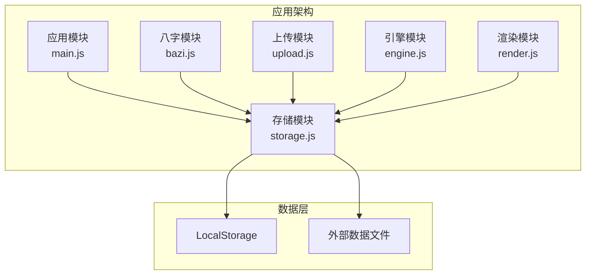
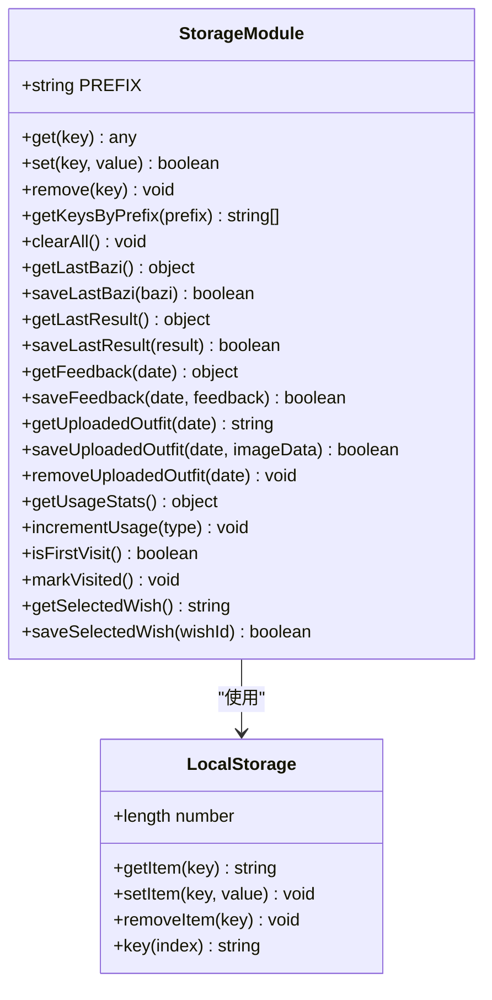
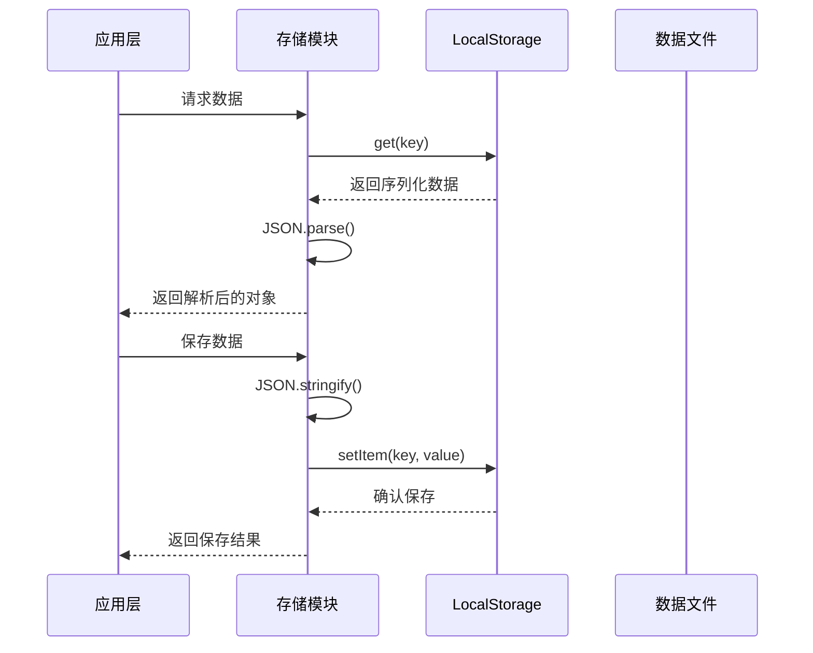
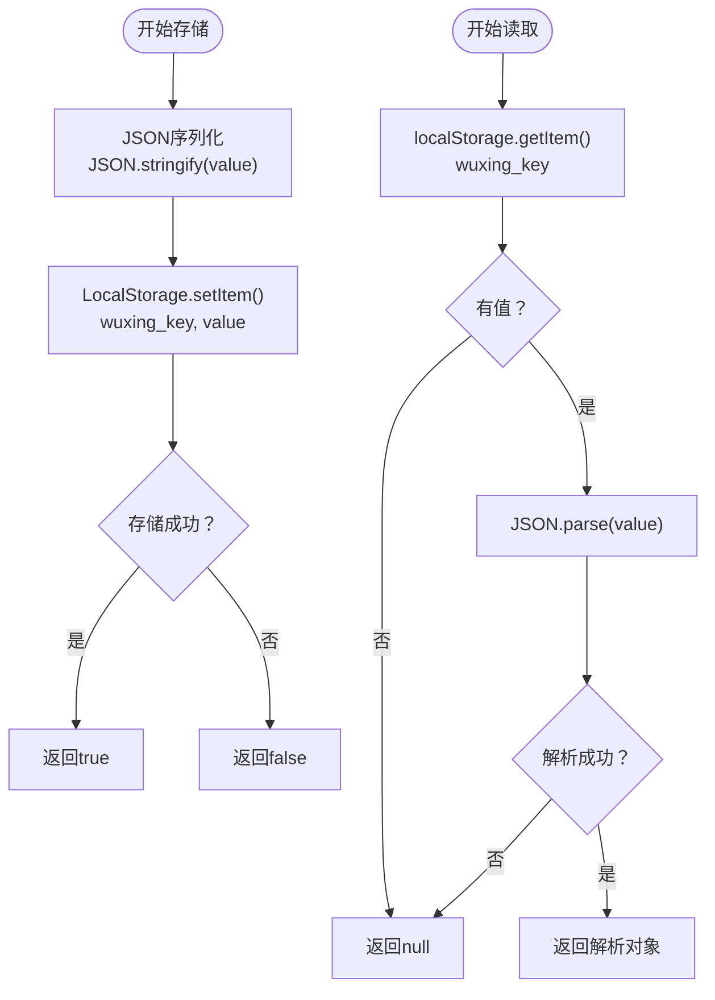
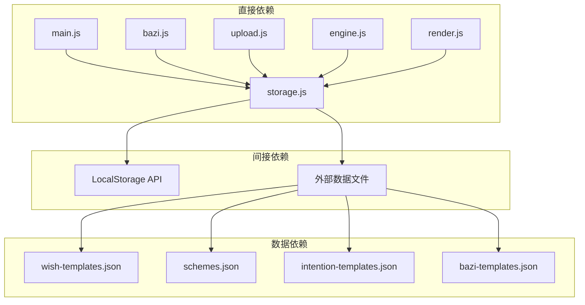
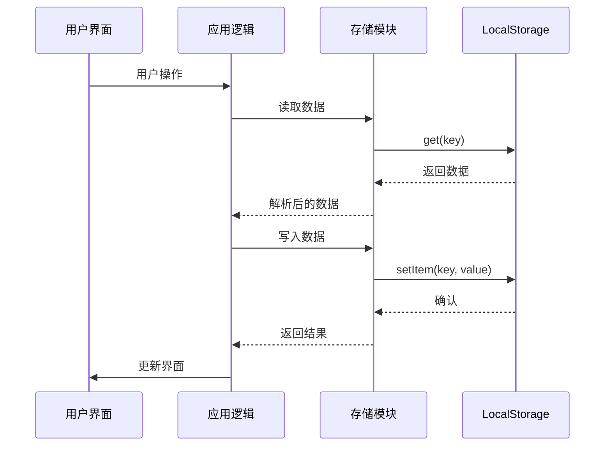

# 存储模块 (storage.js) 技术文档

<cite>
**本文档引用的文件**
- [storage.js](file://js/storage.js)
- [main.js](file://js/main.js)
- [bazi.js](file://js/bazi.js)
- [upload.js](file://js/upload.js)
- [engine.js](file://js/engine.js)
- [render.js](file://js/render.js)
- [index.html](file://index.html)
- [wish-templates.json](file://data/wish-templates.json)
- [schemes.json](file://data/schemes.json)
- [intention-templates.json](file://data/intention-templates.json)
- [bazi-templates.json](file://data/bazi-templates.json)
</cite>

## 目录
1. [简介](#简介)
2. [项目结构](#项目结构)
3. [核心组件](#核心组件)
4. [架构概览](#架构概览)
5. [详细组件分析](#详细组件分析)
6. [依赖关系分析](#依赖关系分析)
7. [性能考虑](#性能考虑)
8. [故障排除指南](#故障排除指南)
9. [结论](#结论)

## 简介

存储模块是五行穿搭建议应用的核心数据持久化层，负责管理所有本地数据的存储、检索和清理操作。该模块采用LocalStorage作为主要存储介质，实现了完整的数据序列化和反序列化机制，为整个应用提供了可靠的数据持久化能力。

该模块不仅处理基础的键值对存储，还封装了业务层面的数据管理方法，包括用户选择的心愿、八字信息、推荐结果、上传的穿搭图片和使用统计等各类数据的存储策略。

## 项目结构

存储模块位于JavaScript目录下，与其他核心模块协同工作，形成完整的应用架构：

**图表来源**
- [storage.js](file://js/storage.js#L1-L116)
- [main.js](file://js/main.js#L1-L317)

**章节来源**
- [storage.js](file://js/storage.js#L1-L116)
- [main.js](file://js/main.js#L1-L317)

## 核心组件

存储模块包含两个层次的功能组件：

### 基础存储组件
- **前缀管理**：统一的键名前缀系统，确保数据隔离
- **序列化机制**：自动JSON序列化和反序列化
- **错误处理**：完善的异常捕获和容错机制
- **批量操作**：支持按前缀查询和批量清理

### 业务存储组件
- **用户偏好**：心愿选择历史
- **八字信息**：生辰八字数据
- **推荐结果**：生成的穿搭方案
- **上传数据**：每日穿搭照片
- **使用统计**：应用使用行为追踪
- **反馈数据**：用户评价和建议

**章节来源**
- [storage.js](file://js/storage.js#L5-L49)
- [storage.js](file://js/storage.js#L51-L116)

## 架构概览

存储模块采用模块化设计，通过ES6模块系统提供标准化的API接口：

**图表来源**
- [storage.js](file://js/storage.js#L1-L116)

### 数据流架构

**图表来源**
- [storage.js](file://js/storage.js#L7-L23)

**章节来源**
- [storage.js](file://js/storage.js#L1-L116)

## 详细组件分析

### 基础存储API

#### get(key)
- **功能**：从LocalStorage获取指定键的数据
- **参数**：
  - `key` (string): 数据键名
- **返回值**：解析后的数据对象或null
- **错误处理**：捕获JSON解析异常，返回null

#### set(key, value)
- **功能**：向LocalStorage存储指定键值对
- **参数**：
  - `key` (string): 数据键名
  - `value` (any): 要存储的数据
- **返回值**：布尔值表示保存是否成功
- **错误处理**：捕获存储异常，返回false

#### remove(key)
- **功能**：删除指定键的数据
- **参数**：
  - `key` (string): 要删除的键名
- **返回值**：void

**章节来源**
- [storage.js](file://js/storage.js#L7-L27)

### 批量操作API

#### getKeysByPrefix(prefix)
- **功能**：根据前缀获取所有匹配的键名
- **参数**：
  - `prefix` (string): 键名前缀
- **返回值**：字符串数组，包含所有匹配的键名

#### clearAll()
- **功能**：清除所有存储的数据
- **参数**：无
- **返回值**：void

**章节来源**
- [storage.js](file://js/storage.js#L29-L49)

### 业务数据API

#### 用户偏好管理

##### getSelectedWish()
- **功能**：获取上次选择的心愿ID
- **返回值**：字符串类型的心愿ID或null

##### saveSelectedWish(wishId)
- **功能**：保存当前选择的心愿ID
- **参数**：
  - `wishId` (string): 心愿ID
- **返回值**：布尔值表示保存结果

**章节来源**
- [storage.js](file://js/storage.js#L109-L115)

#### 八字信息管理

##### getLastBazi()
- **功能**：获取上次输入的八字信息
- **返回值**：对象格式的八字数据或null

##### saveLastBazi(bazi)
- **功能**：保存最新的八字信息
- **参数**：
  - `bazi` (object): 八字数据对象
- **返回值**：布尔值表示保存结果

**章节来源**
- [storage.js](file://js/storage.js#L52-L58)

#### 推荐结果管理

##### getLastResult()
- **功能**：获取上次生成的推荐结果
- **返回值**：推荐结果对象或null

##### saveLastResult(result)
- **功能**：保存最新的推荐结果
- **参数**：
  - `result` (object): 推荐结果对象
- **返回值**：布尔值表示保存结果

**章节来源**
- [storage.js](file://js/storage.js#L60-L66)

#### 上传数据管理

##### getUploadedOutfit(date)
- **功能**：获取指定日期的上传图片数据
- **参数**：
  - `date` (string): 日期字符串（YYYY-MM-DD格式）
- **返回值**：图片数据或null

##### saveUploadedOutfit(date, imageData)
- **功能**：保存指定日期的图片数据
- **参数**：
  - `date` (string): 日期字符串
  - `imageData` (string): 图片数据（Base64编码）
- **返回值**：布尔值表示保存结果

##### removeUploadedOutfit(date)
- **功能**：删除指定日期的图片数据
- **参数**：
  - `date` (string): 日期字符串
- **返回值**：void

**章节来源**
- [storage.js](file://js/storage.js#L79-L89)

#### 反馈数据管理

##### getFeedback(date)
- **功能**：获取指定日期的用户反馈
- **参数**：
  - `date` (string): 日期字符串
- **返回值**：反馈对象或null

##### saveFeedback(date, feedback)
- **功能**：保存指定日期的用户反馈
- **参数**：
  - `date` (string): 日期字符串
  - `feedback` (object): 反馈数据对象
- **返回值**：布尔值表示保存结果

**章节来源**
- [storage.js](file://js/storage.js#L68-L77)

#### 使用统计管理

##### getUsageStats()
- **功能**：获取使用统计数据
- **返回值**：包含访问次数、生成次数、上传次数的对象

##### incrementUsage(type)
- **功能**：增加指定类型的使用计数
- **参数**：
  - `type` (string): 使用类型（'visits' | 'generates' | 'uploads'）
- **返回值**：void

##### isFirstVisit()
- **功能**：检查是否为首次访问
- **返回值**：布尔值

##### markVisited()
- **功能**：标记用户已访问
- **返回值**：void

**章节来源**
- [storage.js](file://js/storage.js#L91-L107)

### 数据结构设计

#### 键值对命名规范

存储模块采用统一的命名约定，确保数据组织的清晰性和一致性：

| 数据类型 | 前缀 | 键名格式 | 示例 |
|---------|------|----------|------|
| 用户偏好 | - | selected_wish | wuxing_selected_wish |
| 八字信息 | - | last_bazi | wuxing_last_bazi |
| 推荐结果 | - | last_result | wuxing_last_result |
| 上传图片 | outfit_ | outfit_YYYY-MM-DD | wuxing_outfit_2024-01-15 |
| 反馈数据 | - | feedbacks | wuxing_feedbacks |
| 使用统计 | - | usage_stats | wuxing_usage_stats |
| 访问标记 | - | visited | wuxing_visited |

#### 数据版本管理

存储模块目前采用简单的版本控制策略：

- **前缀隔离**：通过统一的前缀避免不同版本数据冲突
- **向后兼容**：新字段采用可选方式，旧数据仍可正常解析
- **数据迁移**：支持通过批量清理和重新初始化实现数据迁移

#### 数据序列化机制

**图表来源**
- [storage.js](file://js/storage.js#L7-L23)

**章节来源**
- [storage.js](file://js/storage.js#L5-L23)

## 依赖关系分析

存储模块与应用其他模块存在紧密的依赖关系：

**图表来源**
- [storage.js](file://js/storage.js#L1-L116)
- [main.js](file://js/main.js#L5-L15)

### 数据流向

**图表来源**
- [main.js](file://js/main.js#L40-L64)
- [storage.js](file://js/storage.js#L7-L23)

**章节来源**
- [main.js](file://js/main.js#L1-L317)
- [storage.js](file://js/storage.js#L1-L116)

## 性能考虑

### 存储性能优化

1. **异步操作**：LocalStorage操作本身是同步的，但存储模块通过Promise包装提供异步接口
2. **数据压缩**：对于大型数据（如推荐结果），考虑使用压缩算法减少存储空间
3. **批量操作**：提供批量清理和查询功能，避免频繁的逐项操作
4. **内存管理**：及时清理不需要的大对象，避免内存泄漏

### 错误处理策略

存储模块实现了多层次的错误处理：

- **序列化异常**：捕获JSON.parse和JSON.stringify异常
- **存储异常**：捕获localStorage.setItem异常
- **容量限制**：检测存储空间不足的情况
- **数据损坏**：处理格式错误的数据

### 安全考虑

1. **数据隔离**：通过统一前缀避免数据污染
2. **类型验证**：对输入数据进行基本的类型检查
3. **敏感信息**：当前实现不存储敏感个人信息
4. **跨域风险**：LocalStorage在同一域名下访问，避免跨域问题

**章节来源**
- [storage.js](file://js/storage.js#L7-L23)

## 故障排除指南

### 常见问题及解决方案

#### 存储空间不足
- **症状**：set()方法返回false
- **原因**：LocalStorage容量限制（通常为5-10MB）
- **解决方案**：
  - 实现数据清理机制
  - 优化数据结构，减少存储空间
  - 提供用户手动清理选项

#### 数据解析失败
- **症状**：get()方法返回null
- **原因**：数据格式损坏或版本不兼容
- **解决方案**：
  - 实现数据迁移脚本
  - 提供数据恢复功能
  - 添加数据完整性检查

#### 权限问题
- **症状**：页面在某些环境下无法访问LocalStorage
- **原因**：隐私模式或浏览器设置
- **解决方案**：
  - 提供降级存储方案（IndexedDB）
  - 显示友好的错误提示
  - 实现数据备份机制

### 调试技巧

1. **开发者工具**：使用浏览器开发者工具查看LocalStorage内容
2. **日志记录**：在关键操作点添加详细的日志输出
3. **单元测试**：编写针对存储模块的测试用例
4. **数据监控**：监控存储使用情况和性能指标

**章节来源**
- [storage.js](file://js/storage.js#L7-L23)

## 结论

存储模块作为应用的核心基础设施，提供了完整、可靠的本地数据持久化解决方案。通过精心设计的API接口、完善的错误处理机制和合理的数据结构，该模块有效地支撑了整个五行穿搭建议应用的各项功能。

模块的主要优势包括：
- **简洁的API设计**：提供直观易用的存储接口
- **强健的错误处理**：确保应用在异常情况下仍能正常运行
- **良好的扩展性**：支持新的数据类型和业务需求
- **性能优化**：通过合理的数据结构和操作策略保证性能

未来可以考虑的改进方向：
- 实现数据版本管理和自动迁移
- 添加数据加密和备份功能
- 支持离线数据同步
- 优化大数据量场景下的性能表现