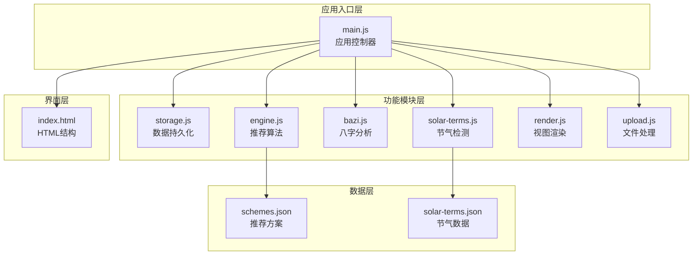
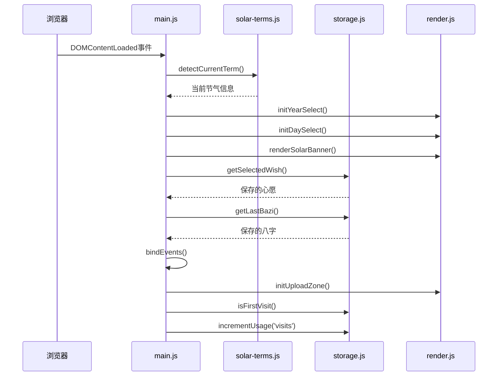
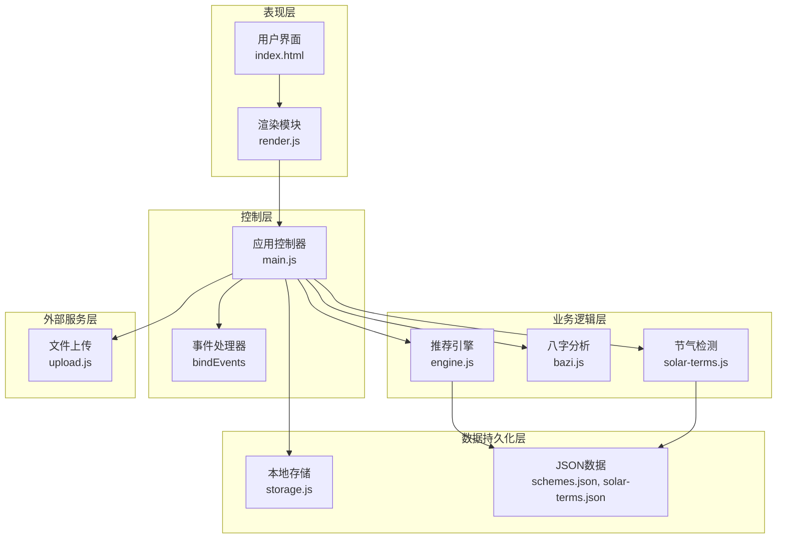
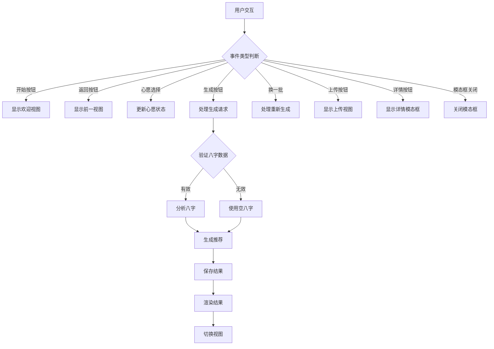
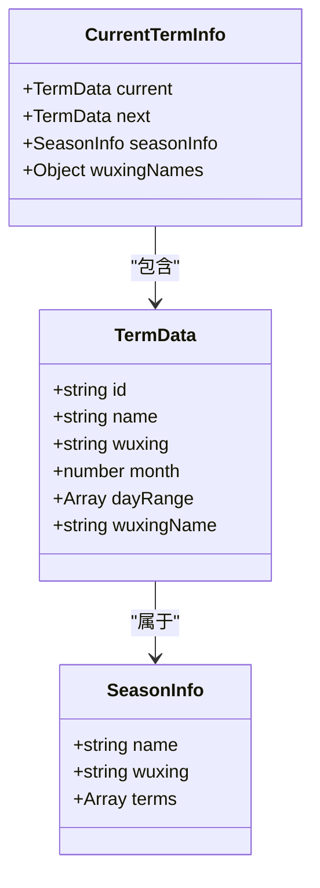
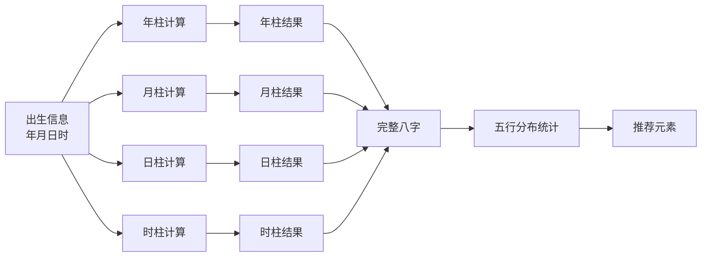
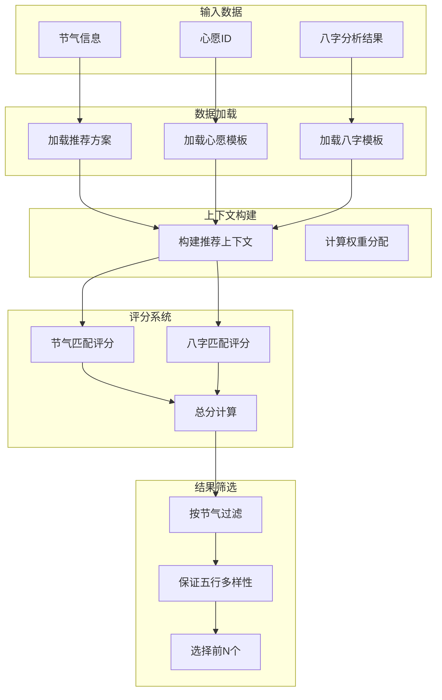
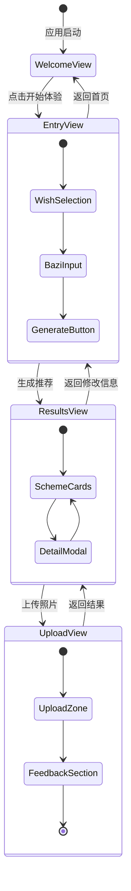
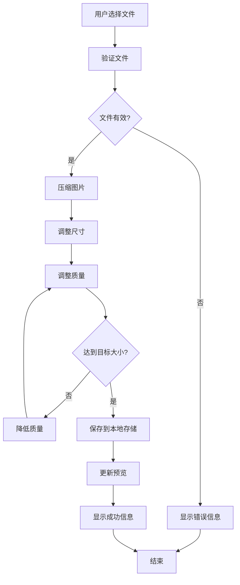
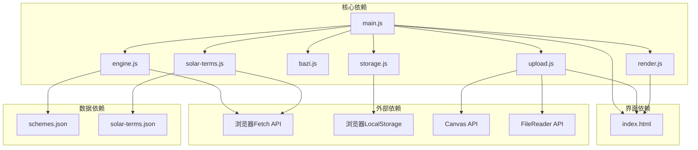

# 应用入口模块 (main.js)

<cite>
**本文档引用的文件**
- [main.js](file://js/main.js)
- [storage.js](file://js/storage.js)
- [solar-terms.js](file://js/solar-terms.js)
- [bazi.js](file://js/bazi.js)
- [engine.js](file://js/engine.js)
- [render.js](file://js/render.js)
- [upload.js](file://js/upload.js)
- [schemes.json](file://data/schemes.json)
- [solar-terms.json](file://data/solar-terms.json)
- [index.html](file://index.html)
</cite>

## 目录
1. [简介](#简介)
2. [项目结构](#项目结构)
3. [核心组件](#核心组件)
4. [架构概览](#架构概览)
5. [详细组件分析](#详细组件分析)
6. [依赖关系分析](#依赖关系分析)
7. [性能考虑](#性能考虑)
8. [故障排除指南](#故障排除指南)
9. [结论](#结论)

## 简介

应用入口模块 (main.js) 是五行穿搭建议应用的核心控制器，负责协调各个功能模块的协作，实现从用户输入到推荐结果展示的完整业务流程。该模块采用模块化设计，通过清晰的职责分离实现了高度的可维护性和扩展性。

## 项目结构

应用采用模块化的JavaScript架构，每个功能领域都有独立的模块文件：



**图表来源**
- [main.js](file://js/main.js#L1-L317)
- [storage.js](file://js/storage.js#L1-L116)
- [solar-terms.js](file://js/solar-terms.js#L1-L118)
- [bazi.js](file://js/bazi.js#L1-L193)
- [engine.js](file://js/engine.js#L1-L335)
- [render.js](file://js/render.js#L1-L272)
- [upload.js](file://js/upload.js#L1-L145)

**章节来源**
- [main.js](file://js/main.js#L1-L317)
- [index.html](file://index.html#L1-L236)

## 核心组件

### 全局状态管理

应用使用简洁的状态管理模式管理关键业务数据：

| 状态变量 | 类型 | 描述 | 默认值 |
|---------|------|------|--------|
| currentTermInfo | Object | 当前节气信息 | null |
| currentWishId | String | 用户选择的心愿ID | null |
| currentBaziResult | Object | 八字分析结果 | null |
| currentResult | Object | 推荐结果 | null |

### 初始化流程

应用启动时执行的完整初始化序列：



**图表来源**
- [main.js](file://js/main.js#L26-L67)
- [solar-terms.js](file://js/solar-terms.js#L36-L103)
- [render.js](file://js/render.js#L18-L50)

**章节来源**
- [main.js](file://js/main.js#L17-L67)

## 架构概览

应用采用分层架构设计，各层职责明确，耦合度低：



**图表来源**
- [main.js](file://js/main.js#L5-L15)
- [engine.js](file://js/engine.js#L39-L79)
- [solar-terms.js](file://js/solar-terms.js#L18-L29)

## 详细组件分析

### 应用控制器 (main.js)

#### 初始化函数 (init)

初始化函数负责应用启动时的完整设置流程：

**核心功能**：
1. **节气检测**：获取当前节气信息并渲染节气横幅
2. **表单初始化**：设置年份和日期选择器
3. **状态恢复**：从本地存储恢复用户上次的选择
4. **事件绑定**：建立用户交互事件监听
5. **统计追踪**：记录应用使用情况

**章节来源**
- [main.js](file://js/main.js#L26-L67)

#### 事件绑定机制 (bindEvents)

事件系统采用委托模式，确保高效的事件处理：



**图表来源**
- [main.js](file://js/main.js#L72-L153)

**章节来源**
- [main.js](file://js/main.js#L72-L153)

#### 核心API接口

##### handleGenerate - 生成推荐

**功能描述**：处理用户提交的生辰八字和心愿，生成个性化的穿搭推荐。

**参数定义**：
- 无直接参数（从DOM获取表单数据）
- 内部参数：`currentTermInfo`, `currentWishId`, `currentBaziResult`

**返回值**：
- Promise<RecommendationResult|null>

**处理流程**：
1. 获取八字表单数据
2. 验证数据有效性
3. 分析八字（可选）
4. 调用推荐引擎
5. 保存结果到本地存储
6. 渲染推荐卡片
7. 切换到结果视图

**章节来源**
- [main.js](file://js/main.js#L202-L244)

##### handleRegenerate - 重新生成

**功能描述**：为用户提供"换一批"功能，基于相同条件生成新的推荐结果。

**参数定义**：
- 无直接参数
- 内部参数：`currentTermInfo`, `currentWishId`, `currentBaziResult`

**返回值**：
- Promise<void>

**处理流程**：
1. 获取当前结果中的方案ID列表
2. 调用重新生成函数
3. 更新UI显示
4. 提供用户反馈

**章节来源**
- [main.js](file://js/main.js#L249-L269)

##### handleFileUpload - 文件上传处理

**功能描述**：处理用户上传的穿搭照片，包含文件验证和压缩功能。

**参数定义**：
- `file`: File对象

**返回值**：
- Promise<void>

**处理流程**：
1. 验证文件格式和大小
2. 压缩图片到目标大小
3. 保存到本地存储
4. 更新上传预览
5. 提供操作反馈

**章节来源**
- [main.js](file://js/main.js#L274-L292)

##### handleSaveFeedback - 保存反馈

**功能描述**：保存用户的穿搭反馈信息到本地存储。

**参数定义**：
- 无参数

**返回值**：
- void

**处理流程**：
1. 获取反馈文本
2. 验证输入有效性
3. 保存到本地存储
4. 清空输入框
5. 提供确认反馈

**章节来源**
- [main.js](file://js/main.js#L297-L313)

### 数据持久化模块 (storage.js)

#### 本地存储策略

应用采用统一的键命名约定，所有数据都添加 `wuxing_` 前缀：

| 功能 | 存储键 | 数据类型 | 描述 |
|------|--------|----------|------|
| 最近一次八字 | `wuxing_last_bazi` | Object | 用户最后输入的八字数据 |
| 最近一次结果 | `wuxing_last_result` | Object | 上次生成的推荐结果 |
| 用户反馈 | `wuxing_feedbacks` | Object | 所有日期的反馈记录 |
| 穿搭照片 | `wuxing_outfit_{date}` | String | 按日期存储的图片数据 |
| 使用统计 | `wuxing_usage_stats` | Object | 访问次数、生成次数、上传次数 |
| 首次访问 | `wuxing_visited` | Boolean | 标记用户是否首次访问 |
| 选择的心愿 | `wuxing_selected_wish` | String | 用户选择的心愿ID |

**章节来源**
- [storage.js](file://js/storage.js#L52-L115)

### 节气检测模块 (solar-terms.js)

#### 节气数据结构

节气数据采用标准化格式，包含完整的五行属性：



**图表来源**
- [solar-terms.js](file://js/solar-terms.js#L88-L102)
- [solar-terms.json](file://data/solar-terms.json#L1-L42)

**章节来源**
- [solar-terms.js](file://js/solar-terms.js#L36-L103)

### 八字分析模块 (bazi.js)

#### 五行计算算法

应用实现了一个简化的八字计算系统，基于传统理论进行现代计算：



**图表来源**
- [bazi.js](file://js/bazi.js#L111-L192)

**章节来源**
- [bazi.js](file://js/bazi.js#L182-L192)

### 推荐引擎模块 (engine.js)

#### 推荐算法架构

推荐引擎采用多因素加权评分系统：



**图表来源**
- [engine.js](file://js/engine.js#L268-L310)
- [engine.js](file://js/engine.js#L218-L259)

**章节来源**
- [engine.js](file://js/engine.js#L268-L334)

### 视图渲染模块 (render.js)

#### 视图管理系统

应用采用单页面应用的视图切换机制：



**图表来源**
- [render.js](file://js/render.js#L8-L16)
- [index.html](file://index.html#L24-L196)

**章节来源**
- [render.js](file://js/render.js#L8-L272)

### 文件处理模块 (upload.js)

#### 图片上传处理流程



**图表来源**
- [upload.js](file://js/upload.js#L31-L82)

**章节来源**
- [upload.js](file://js/upload.js#L12-L145)

## 依赖关系分析

### 模块间依赖图



**图表来源**
- [main.js](file://js/main.js#L5-L15)
- [engine.js](file://js/engine.js#L42-L48)
- [solar-terms.js](file://js/solar-terms.js#L22-L28)

### 依赖注入模式

应用采用ES6模块系统实现依赖注入，每个模块导出特定的功能函数：

```javascript
// 导入方式
import * as storage from './storage.js';
import { detectCurrentTerm, getWuxingColor } from './solar-terms.js';
import { analyzeBazi } from './bazi.js';
import { generateRecommendation, regenerateRecommendation } from './engine.js';

// 导出方式
export function showView(viewId) { /* ... */ }
export function initYearSelect() { /* ... */ }
export function renderSolarBanner(termInfo) { /* ... */ }
```

**章节来源**
- [main.js](file://js/main.js#L5-L15)

## 性能考虑

### 优化策略

1. **异步数据加载**：使用Promise.all并行加载多个数据源
2. **内存管理**：及时清理DOM引用和事件监听器
3. **缓存机制**：节气数据和推荐方案数据的内存缓存
4. **懒加载**：图片和数据的按需加载
5. **事件委托**：减少事件监听器数量

### 性能监控

应用内置简单的性能监控机制：

```javascript
console.log('[App] Initializing...');
console.log('[App] Current term:', currentTermInfo?.current?.name);
console.log('[App] Generating recommendation...');
console.log('[App] Regenerating...');
console.log('[App] Initialized successfully');
```

**章节来源**
- [main.js](file://js/main.js#L27-L67)
- [main.js](file://js/main.js#L203-L204)

## 故障排除指南

### 常见问题及解决方案

#### 节气检测失败

**症状**：节气横幅显示为空或默认值

**可能原因**：
- 网络请求失败
- JSON数据格式错误
- 时区计算问题

**解决步骤**：
1. 检查网络连接
2. 验证solar-terms.json格式
3. 确认系统时区设置

#### 推荐结果为空

**症状**：生成后没有显示任何推荐

**可能原因**：
- 数据加载失败
- 条件过于严格
- 缓存数据损坏

**解决步骤**：
1. 检查浏览器控制台错误
2. 清除浏览器缓存
3. 重新加载页面

#### 图片上传失败

**症状**：上传按钮无响应或显示错误

**可能原因**：
- 文件格式不支持
- 文件过大
- 浏览器兼容性问题

**解决步骤**：
1. 确认文件格式为JPG或PNG
2. 检查文件大小是否超过5MB
3. 尝试使用其他浏览器

### 调试技巧

1. **开发者工具**：使用浏览器开发者工具监控网络请求和JavaScript错误
2. **控制台日志**：利用应用内置的日志输出跟踪执行流程
3. **断点调试**：在关键函数处设置断点分析数据流
4. **状态检查**：定期检查localStorage中的数据完整性

**章节来源**
- [main.js](file://js/main.js#L288-L291)

## 结论

应用入口模块 (main.js) 成功实现了复杂业务逻辑的模块化封装，通过清晰的职责分离和标准的模块接口，为整个应用提供了稳定可靠的核心控制能力。模块间松耦合的设计使得系统具有良好的可维护性和扩展性，为后续的功能增强奠定了坚实基础。

该模块的架构设计体现了现代前端开发的最佳实践，包括异步编程、错误处理、性能优化和用户体验优化等方面，是一个值得学习的优秀示例。