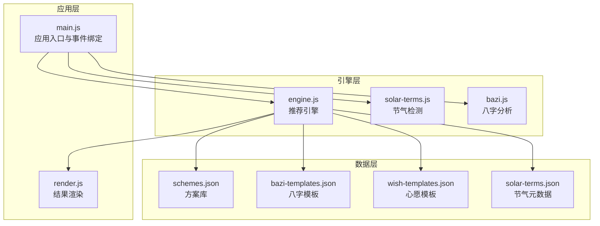
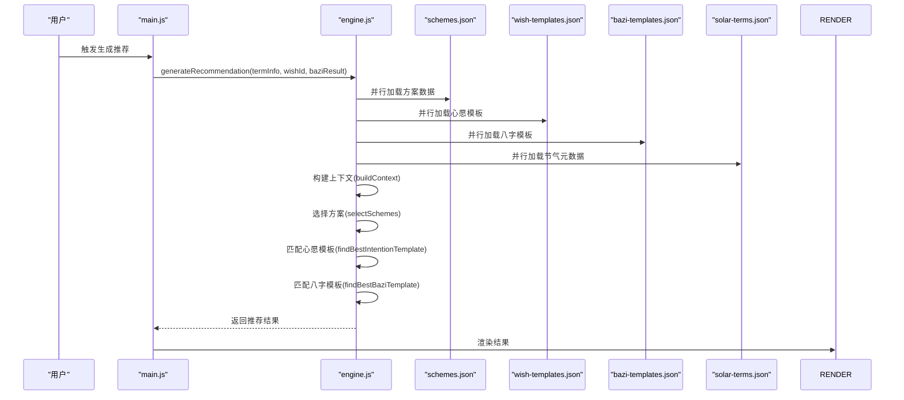
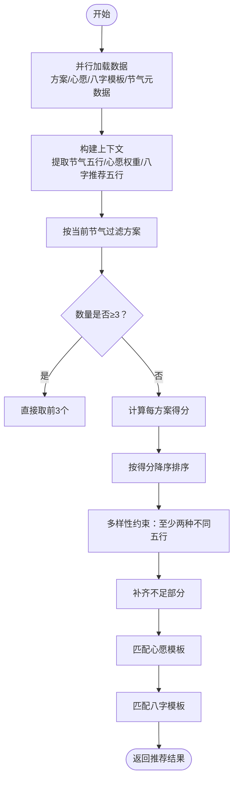
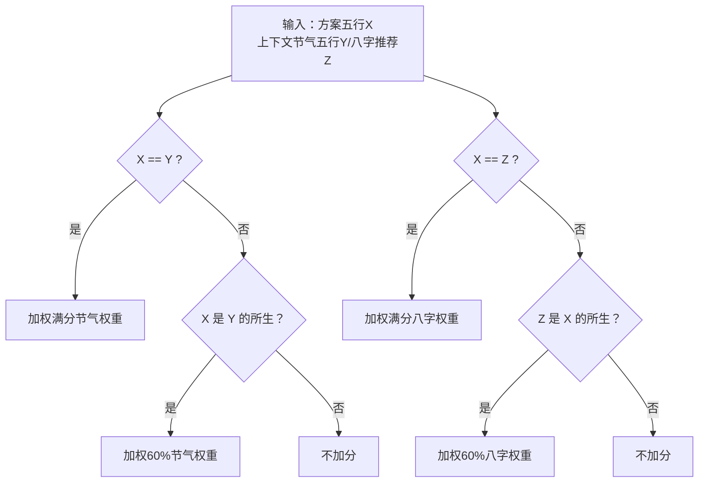
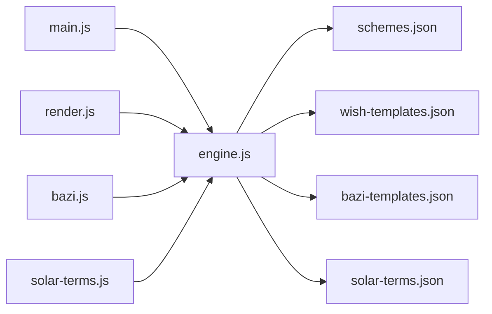
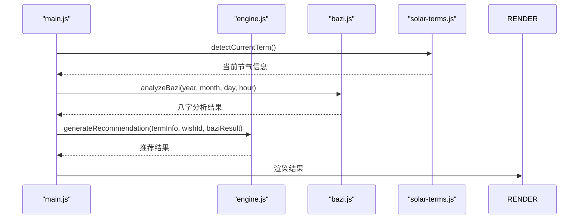

# 推荐引擎模块 (engine.js)

<cite>
**本文引用的文件**
- [engine.js](file://js/engine.js)
- [schemes.json](file://data/schemes.json)
- [bazi-templates.json](file://data/bazi-templates.json)
- [wish-templates.json](file://data/wish-templates.json)
- [solar-terms.json](file://data/solar-terms.json)
- [bazi.js](file://js/bazi.js)
- [solar-terms.js](file://js/solar-terms.js)
- [main.js](file://js/main.js)
- [render.js](file://js/render.js)
</cite>

## 目录
1. [简介](#简介)
2. [项目结构](#项目结构)
3. [核心组件](#核心组件)
4. [架构总览](#架构总览)
5. [详细组件分析](#详细组件分析)
6. [依赖关系分析](#依赖关系分析)
7. [性能考量](#性能考量)
8. [故障排除指南](#故障排除指南)
9. [结论](#结论)
10. [附录](#附录)

## 简介
本技术文档围绕推荐引擎模块（engine.js）进行系统化解析，重点阐述以下内容：
- generateRecommendation 与 regenerateRecommendation 两大核心函数的工作原理与调用链路
- 五行属性匹配算法、节气影响权重计算、心愿偏好调整机制与八字分析结果的融合策略
- 方案评分系统的计算逻辑（基础分数、权重因子与最终排序规则）
- 数据模型说明（方案结构、权重配置与评分标准）
- 算法优化策略、性能考虑与扩展性设计
- 使用示例与常见问题排查

## 项目结构
推荐引擎位于前端模块化架构中的核心位置，负责整合节气、心愿与八字等多源信息，输出符合“天人合一”理念的服饰方案推荐。关键文件与职责如下：
- engine.js：推荐引擎核心逻辑，包含数据加载、上下文构建、评分与选择、以及对外接口
- data/schemes.json：方案库，包含每个方案的五行属性、材质、感受与注释
- data/bazi-templates.json：八字模板库，按日主强弱与年份匹配推荐方案
- data/wish-templates.json：心愿模板库，提供心愿偏好与季节修饰因子
- data/solar-terms.json：节气元数据，定义节气与五行属性
- js/bazi.js：八字计算与五行分析（提供最强/最弱元素，用于权重融合）
- js/solar-terms.js：节气检测与当前节气识别（提供节气五行）
- js/main.js：应用入口，协调生成与换一批流程
- js/render.js：结果渲染与交互

图表来源
- [engine.js](file://js/engine.js#L1-L335)
- [solar-terms.js](file://js/solar-terms.js#L1-L118)
- [bazi.js](file://js/bazi.js#L1-L193)
- [main.js](file://js/main.js#L1-L317)
- [render.js](file://js/render.js#L1-L272)

章节来源
- [engine.js](file://js/engine.js#L1-L335)
- [solar-terms.js](file://js/solar-terms.js#L1-L118)
- [bazi.js](file://js/bazi.js#L1-L193)
- [main.js](file://js/main.js#L1-L317)
- [render.js](file://js/render.js#L1-L272)

## 核心组件
- generateRecommendation：生成推荐主流程，负责加载数据、构建上下文、选择方案、匹配模板并返回完整结果
- regenerateRecommendation：换一批推荐，基于排除已选方案集合进行再选择
- 上下文构建：从节气、心愿与八字分析结果中抽取关键要素，形成评分权重
- 评分与选择：依据五行匹配度与相生关系计算分数，并在多样性约束下排序选择
- 模板匹配：按节气与日主强弱匹配心愿模板与八字模板，作为附加建议

章节来源
- [engine.js](file://js/engine.js#L268-L334)

## 架构总览
推荐引擎采用“数据驱动 + 权重融合”的架构模式：
- 输入：节气信息（当前节气ID与五行）、心愿ID、八字分析结果
- 处理：加载多源数据，构建上下文权重，计算方案得分，选择Top-N方案
- 输出：包含方案列表、节气信息、心愿模板、八字模板与生成时间的结果对象

图表来源
- [engine.js](file://js/engine.js#L268-L310)
- [main.js](file://js/main.js#L202-L244)
- [render.js](file://js/render.js#L114-L127)

## 详细组件分析

### generateRecommendation 工作原理
- 并行加载：同时加载方案库、心愿模板与八字模板，提升响应速度
- 上下文构建：提取节气五行、心愿权重、八字推荐五行，形成评分权重矩阵
- 方案选择：优先筛选与当前节气一致的方案；不足时按得分排序，并在多样性约束下保证至少两种不同五行
- 模板匹配：按心愿ID映射到心愿模板，按节气距离选择最佳模板；按日主强弱与年份匹配八字模板
- 结果封装：返回包含方案列表、节气信息、心愿ID、模板与生成时间的对象

图表来源
- [engine.js](file://js/engine.js#L268-L310)
- [engine.js](file://js/engine.js#L157-L173)
- [engine.js](file://js/engine.js#L218-L259)

章节来源
- [engine.js](file://js/engine.js#L268-L310)

### regenerateRecommendation 工作原理
- 基于已有结果排除已选方案ID，避免重复推荐
- 在剩余方案中重新构建上下文并执行选择流程
- 返回新的推荐结果，便于用户“换一批”

章节来源
- [engine.js](file://js/engine.js#L315-L334)

### 五行属性匹配算法
- 相合匹配：当方案五行与节气或八字推荐五行完全一致时，获得满分加权
- 相生匹配：当方案五行被节气或八字推荐五行所生时，获得较高但低于满分的加权
- 相克/无关：不加分

图表来源
- [engine.js](file://js/engine.js#L178-L199)
- [engine.js](file://js/engine.js#L204-L213)

章节来源
- [engine.js](file://js/engine.js#L178-L199)
- [engine.js](file://js/engine.js#L204-L213)

### 节气影响权重计算
- 节气权重：0.5（满分加权对应相合，60%对应相生）
- 八字权重：0.2（满分加权对应相合，60%对应相生）
- 心愿权重：0.3（用于后续模板匹配，不直接参与方案评分）

章节来源
- [engine.js](file://js/engine.js#L158-L165)

### 心愿偏好调整机制
- 心愿ID映射：career、guiren、travel、focus、health 分别映射为求职、贵人运、远行顺利、静心专注、健康舒畅
- 模板匹配：按当前节气与心愿名称查找最接近的模板，模板包含颜色偏向与材质偏向，作为附加建议
- 季节修饰因子：模板定义了各五行的“boost/avoid”列表，可用于进一步微调偏好

章节来源
- [engine.js](file://js/engine.js#L10-L16)
- [engine.js](file://js/engine.js#L104-L119)
- [wish-templates.json](file://data/wish-templates.json#L1-L47)

### 八字分析结果的融合策略
- 八字分析：计算四柱、统计天干地支五行分布，得出“最弱/最强元素”，并给出推荐补充元素
- 模板匹配：按日主强弱与年份匹配八字模板，模板提供颜色、材质与感受建议
- 引入权重：将“八字推荐五行”纳入上下文，参与方案评分

章节来源
- [bazi.js](file://js/bazi.js#L129-L172)
- [engine.js](file://js/engine.js#L124-L152)
- [bazi-templates.json](file://data/bazi-templates.json#L1-L103)

### 方案评分系统与排序规则
- 基础分数：相合为满分，相生为60%，其余为0
- 权重因子：节气权重0.5，八字权重0.2，心愿权重0.3（仅模板匹配使用）
- 排序规则：
  1) 若存在与当前节气一致的方案，优先选取
  2) 否则按得分降序排序
  3) 在多样性约束下，至少包含两种不同五行
  4) 不足时用高分方案补齐

章节来源
- [engine.js](file://js/engine.js#L178-L199)
- [engine.js](file://js/engine.js#L218-L259)

### 数据模型说明

#### 方案结构（来自方案库）
- 字段：id、termId、rank、color（name/hex/wuxing）、material、feeling、annotation、source
- 用途：作为推荐候选，提供颜色、材质、感受与注释等信息

章节来源
- [schemes.json](file://data/schemes.json#L1-L509)

#### 权重配置
- 节气权重：0.5
- 八字权重：0.2
- 心愿权重：0.3

章节来源
- [engine.js](file://js/engine.js#L158-L165)

#### 评分标准
- 相合：+100×权重
- 相生：+60×权重
- 其他：+0

章节来源
- [engine.js](file://js/engine.js#L178-L199)

#### 节气元数据
- 字段：id、name、wuxing、month、dayRange、seasons、wuxingNames
- 用途：确定当前节气与季节五行，计算节气间距离

章节来源
- [solar-terms.json](file://data/solar-terms.json#L1-L42)

#### 八字模板
- 字段：id、baZiKey（含日主强弱与年份）、solarTerm、color、material、feeling、annotation、source
- 用途：按日主强弱与年份匹配，提供颜色与材质建议

章节来源
- [bazi-templates.json](file://data/bazi-templates.json#L1-L103)

#### 心愿模板
- 字段：wishes[]（id/name/colorBias/materialBias/advice）、seasonModifiers{}
- 用途：提供心愿偏好与季节修饰因子，辅助模板匹配

章节来源
- [wish-templates.json](file://data/wish-templates.json#L1-L47)

## 依赖关系分析
- generateRecommendation 依赖：
  - 并行加载：方案库、心愿模板、八字模板、节气元数据
  - 上下文构建：节气信息、心愿ID、八字分析结果
  - 评分与选择：方案库、上下文权重
  - 模板匹配：心愿模板、八字模板
- regenerateRecommendation 依赖：
  - 方案库（排除已选ID）
  - 上下文构建与选择流程

图表来源
- [engine.js](file://js/engine.js#L268-L334)
- [main.js](file://js/main.js#L202-L269)
- [render.js](file://js/render.js#L114-L127)
- [bazi.js](file://js/bazi.js#L182-L192)
- [solar-terms.js](file://js/solar-terms.js#L36-L103)

章节来源
- [engine.js](file://js/engine.js#L268-L334)
- [main.js](file://js/main.js#L202-L269)
- [render.js](file://js/render.js#L114-L127)
- [bazi.js](file://js/bazi.js#L182-L192)
- [solar-terms.js](file://js/solar-terms.js#L36-L103)

## 性能考量
- 并行加载：使用 Promise.all 并行加载多源数据，减少等待时间
- 节气距离计算：通过预定义顺序数组与循环距离计算，避免复杂日期解析
- 评分与排序：对方案进行一次映射与排序，时间复杂度 O(n log n)，适合中等规模数据
- 内存占用：上下文构建与模板匹配仅保留必要字段，避免冗余拷贝
- 扩展性建议：
  - 将权重参数化为配置项，便于动态调整
  - 对模板匹配引入缓存，避免重复查找
  - 对大数据量场景，考虑分页与懒加载

章节来源
- [engine.js](file://js/engine.js#L270-L274)
- [engine.js](file://js/engine.js#L84-L99)
- [engine.js](file://js/engine.js#L218-L259)

## 故障排除指南
- 无法加载数据
  - 现象：控制台报错“Failed to load ...”
  - 排查：确认 data 目录路径正确，网络请求可访问
  - 参考：加载函数的错误捕获与返回空值逻辑
- 无方案可选
  - 现象：generateRecommendation 返回 null 或空数组
  - 排查：检查方案库是否存在、节气ID是否匹配、模板是否可用
  - 参考：生成流程中的空值判断
- 评分异常
  - 现象：推荐结果不符合预期
  - 排查：核对节气五行、八字推荐五行与相生关系映射
  - 参考：评分函数与相生关系定义
- 模板未命中
  - 现象：心愿模板或八字模板为空
  - 排查：确认心愿ID映射、节气名称映射、八字模板键值与年份匹配
  - 参考：模板匹配函数与映射表

章节来源
- [engine.js](file://js/engine.js#L41-L48)
- [engine.js](file://js/engine.js#L56-L63)
- [engine.js](file://js/engine.js#L70-L78)
- [engine.js](file://js/engine.js#L276-L279)
- [engine.js](file://js/engine.js#L178-L199)
- [engine.js](file://js/engine.js#L204-L213)
- [engine.js](file://js/engine.js#L104-L119)
- [engine.js](file://js/engine.js#L124-L152)

## 结论
推荐引擎模块通过“节气—心愿—八字”三位一体的数据融合，实现了既符合传统五行理论又具备现代用户体验的智能推荐。其核心优势在于：
- 明确的评分体系与权重分配
- 多源数据并行加载与高效选择策略
- 可扩展的模板匹配机制
- 清晰的错误处理与容错设计

建议在后续迭代中引入配置化权重、模板缓存与分页加载，以进一步提升性能与可维护性。

## 附录

### 使用示例
- 生成推荐
  - 步骤：获取当前节气信息、收集心愿ID、计算八字分析结果，调用 generateRecommendation
  - 参考：应用入口中的 handleGenerate 流程
- 换一批
  - 步骤：传入排除ID集合，调用 regenerateRecommendation
  - 参考：应用入口中的 handleRegenerate 流程

章节来源
- [main.js](file://js/main.js#L202-L244)
- [main.js](file://js/main.js#L249-L269)

### 关键流程图（代码级）

图表来源
- [main.js](file://js/main.js#L202-L244)
- [engine.js](file://js/engine.js#L268-L310)
- [bazi.js](file://js/bazi.js#L182-L192)
- [solar-terms.js](file://js/solar-terms.js#L36-L103)