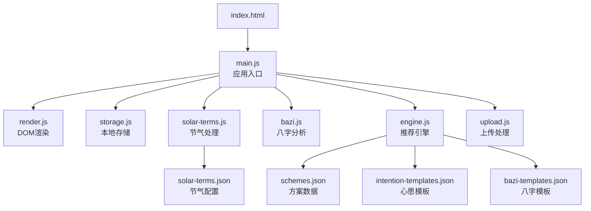
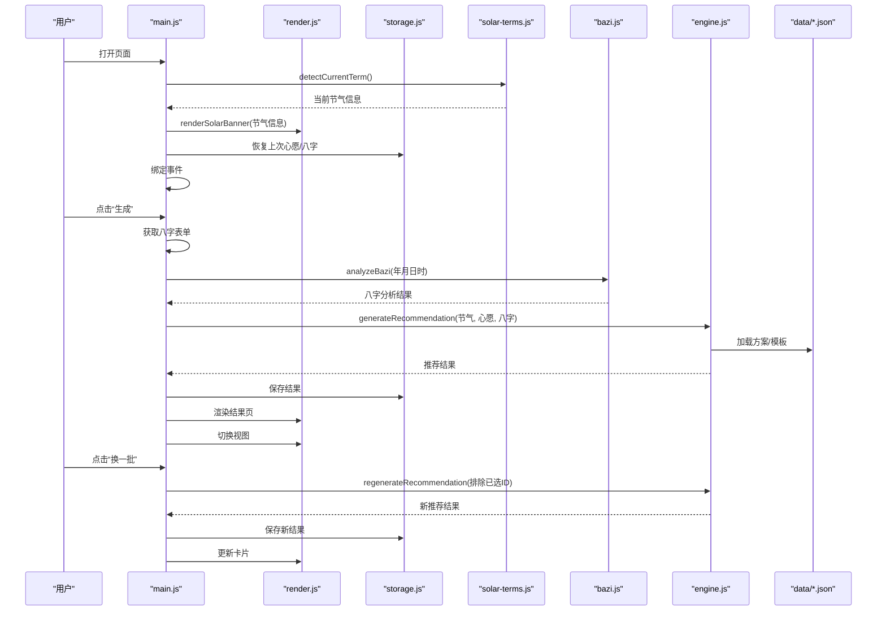
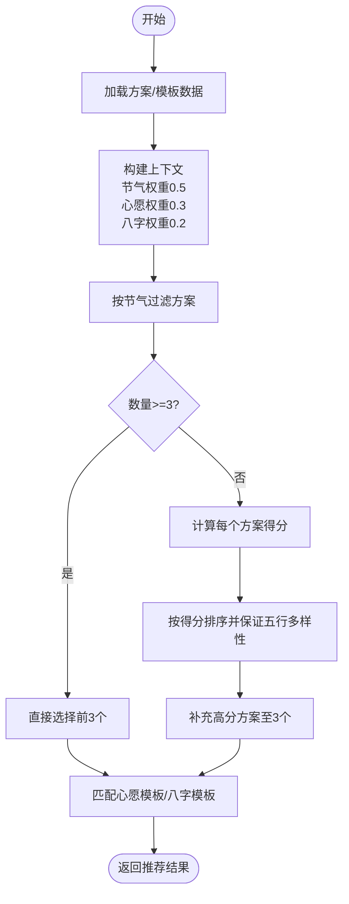
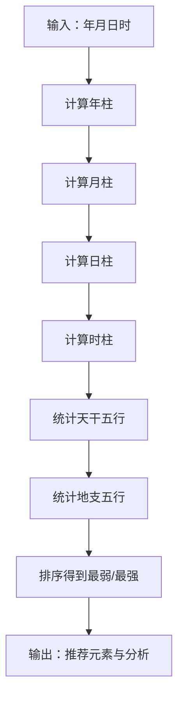
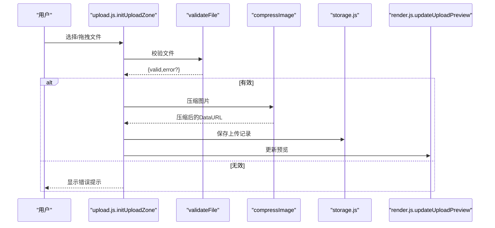
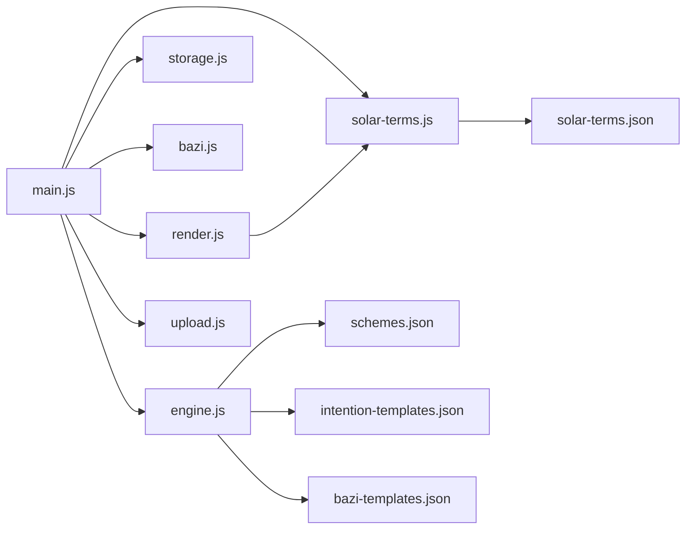
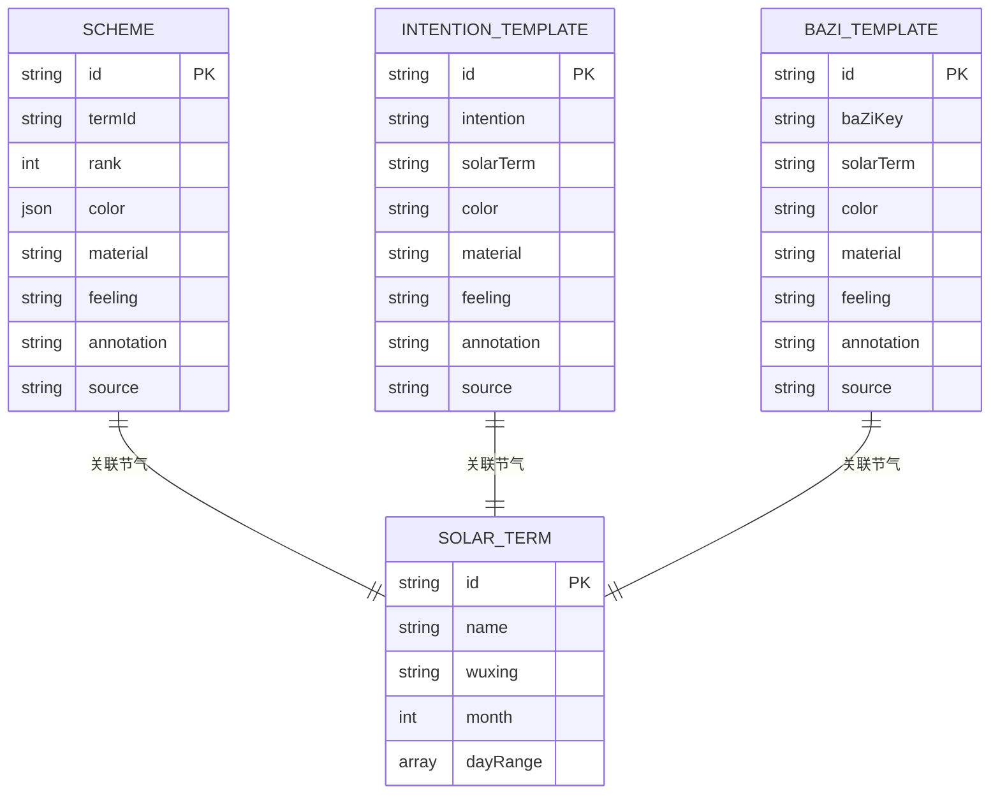

# 核心模块详解

<cite>
**本文档引用的文件**
- [main.js](file://js/main.js)
- [engine.js](file://js/engine.js)
- [render.js](file://js/render.js)
- [storage.js](file://js/storage.js)
- [solar-terms.js](file://js/solar-terms.js)
- [bazi.js](file://js/bazi.js)
- [upload.js](file://js/upload.js)
- [schemes.json](file://data/schemes.json)
- [intention-templates.json](file://data/intention-templates.json)
- [bazi-templates.json](file://data/bazi-templates.json)
- [solar-terms.json](file://data/solar-terms.json)
</cite>

## 目录
1. [简介](#简介)
2. [项目结构](#项目结构)
3. [核心组件](#核心组件)
4. [架构总览](#架构总览)
5. [详细组件分析](#详细组件分析)
6. [依赖关系分析](#依赖关系分析)
7. [性能考虑](#性能考虑)
8. [故障排查指南](#故障排查指南)
9. [结论](#结论)
10. [附录](#附录)

## 简介
本项目是一个基于中国传统文化“五行”理论的穿搭建议应用。系统通过采集用户出生信息（八字）与当前节气，结合心愿目标，为用户提供个性化的服装色彩、材质与穿着感受建议，并支持上传搭配照片进行记录与反馈。核心模块包括：
- 应用入口与事件绑定：负责初始化界面、恢复用户状态、绑定交互事件、协调各模块工作流
- 推荐引擎：加载方案与模板数据，构建推荐上下文，计算方案得分并选择最佳组合
- 渲染模块：管理视图切换、表单初始化、节气横幅渲染、方案卡片展示、详情模态框与提示信息
- 存储模块：封装本地存储的键空间与业务方法，提供使用统计、反馈、上传记录等持久化能力
- 节气处理模块：加载节气数据，检测当前节气与季节，提供节气对应的颜色映射
- 八字分析模块：计算四柱八字、统计五行分布、给出推荐元素与分析
- 上传处理模块：文件校验、图片压缩、拖拽上传、键盘支持与今日日期标识

## 项目结构
项目采用模块化组织，前端资源分为静态页面与脚本模块，数据以JSON形式存放于data目录。核心文件如下：
- HTML入口：index.html
- 样式：css/ 下的基础样式与组件样式
- JS核心模块：js/ 下的 seven 模块
- 数据：data/ 下的 JSON 模板与配置

图表来源
- [main.js](file://js/main.js#L1-L317)
- [engine.js](file://js/engine.js#L1-L335)
- [render.js](file://js/render.js#L1-L272)
- [storage.js](file://js/storage.js#L1-L116)
- [solar-terms.js](file://js/solar-terms.js#L1-L118)
- [bazi.js](file://js/bazi.js#L1-L193)
- [upload.js](file://js/upload.js#L1-L145)
- [schemes.json](file://data/schemes.json#L1-L509)
- [intention-templates.json](file://data/intention-templates.json#L1-L253)
- [bazi-templates.json](file://data/bazi-templates.json#L1-L103)
- [solar-terms.json](file://data/solar-terms.json#L1-L42)

章节来源
- [main.js](file://js/main.js#L1-L317)
- [solar-terms.js](file://js/solar-terms.js#L1-L118)
- [bazi.js](file://js/bazi.js#L1-L193)
- [engine.js](file://js/engine.js#L1-L335)
- [render.js](file://js/render.js#L1-L272)
- [storage.js](file://js/storage.js#L1-L116)
- [upload.js](file://js/upload.js#L1-L145)
- [schemes.json](file://data/schemes.json#L1-L509)
- [intention-templates.json](file://data/intention-templates.json#L1-L253)
- [bazi-templates.json](file://data/bazi-templates.json#L1-L103)
- [solar-terms.json](file://data/solar-terms.json#L1-L42)

## 核心组件
本节对七个核心模块进行职责、实现原理与使用方法的深入解析，并提供API说明、参数定义、返回值说明与实际使用示例。

### 应用入口（main.js）
- 职责
  - 初始化应用：加载节气信息、初始化表单、渲染节气横幅、恢复用户上次选择的心愿与八字、绑定事件、初始化上传区域、统计访问次数
  - 协调各模块：在用户操作时调用渲染、存储、节气、八字、引擎与上传模块
- 关键函数
  - init()：应用初始化流程
  - bindEvents()：事件绑定（开始/返回按钮、心愿标签、生成/换一批、上传、移除图片、保存反馈、详情模态框）
  - selectWish(wishId)：选择并保存心愿
  - restoreBaziForm(bazi)：恢复八字表单
  - getBaziFormData()：获取八字表单数据
  - handleGenerate()：生成推荐流程（获取八字、分析、生成、保存结果、渲染、视图切换）
  - handleRegenerate()：换一批推荐流程（排除已选ID、重新生成、保存并渲染）
  - handleFileUpload(file)：文件上传流程（校验、压缩、保存、更新预览、统计）
  - handleSaveFeedback()：保存反馈
- 使用示例
  - 在页面加载完成后自动执行 init()
  - 用户点击“生成”按钮触发 handleGenerate()
  - 用户点击“换一批”按钮触发 handleRegenerate()
  - 用户上传图片触发 handleFileUpload()

章节来源
- [main.js](file://js/main.js#L26-L67)
- [main.js](file://js/main.js#L72-L153)
- [main.js](file://js/main.js#L158-L164)
- [main.js](file://js/main.js#L169-L176)
- [main.js](file://js/main.js#L181-L197)
- [main.js](file://js/main.js#L202-L244)
- [main.js](file://js/main.js#L249-L269)
- [main.js](file://js/main.js#L274-L292)
- [main.js](file://js/main.js#L297-L313)

### 推荐引擎（engine.js）
- 职责
  - 加载方案与模板数据（方案、心愿模板、八字模板）
  - 构建推荐上下文（节气、心愿、八字）
  - 计算方案得分（节气匹配、相生关系、权重）
  - 选择最佳方案（按节气过滤、按得分排序、保证五行多样性）
- 关键函数
  - loadSchemes()/loadIntentionTemplates()/loadBaziTemplates()：异步加载数据
  - detectCurrentTerm()/getWuxingColor()：来自节气模块
  - findBestIntentionTemplate(intentionName, currentTermId, templates)：按节气距离匹配心愿模板
  - findBestBaziTemplate(baziResult, templates)：按日主五行与年份匹配八字模板
  - buildContext(termInfo, wishId, baziProfile)：构建上下文权重
  - scoreScheme(scheme, context)：计算方案得分（节气匹配、相生加分）
  - selectSchemes(schemes, context, count)：选择方案并保证五行多样性
  - generateRecommendation(termInfo, wishId, baziResult)：生成推荐结果
  - regenerateRecommendation(termInfo, wishId, baziResult, excludeIds)：换一批推荐
- 权重与评分
  - 节气匹配：完全匹配100%，相生60%
  - 八字匹配：完全匹配100%，相生60%
  - 权重比例：节气0.5、心愿0.3、八字0.2
- 使用示例
  - 从 main.js 调用 generateRecommendation(termInfo, wishId, baziResult)
  - 从 main.js 调用 regenerateRecommendation(termInfo, wishId, baziResult, excludeIds)

章节来源
- [engine.js](file://js/engine.js#L39-L79)
- [engine.js](file://js/engine.js#L104-L119)
- [engine.js](file://js/engine.js#L124-L152)
- [engine.js](file://js/engine.js#L157-L173)
- [engine.js](file://js/engine.js#L178-L199)
- [engine.js](file://js/engine.js#L204-L213)
- [engine.js](file://js/engine.js#L218-L259)
- [engine.js](file://js/engine.js#L268-L310)
- [engine.js](file://js/engine.js#L315-L334)

### 渲染模块（render.js）
- 职责
  - 视图管理：显示/隐藏视图容器
  - 表单初始化：年份下拉、日期下拉
  - 节气横幅渲染：名称、五行名称与颜色
  - 结果页标题渲染：节气与五行名称
  - 方案卡片渲染：关键词、注释、来源、查看详情按钮
  - 模态框：详情模态框渲染、显示/关闭
  - 上传预览：根据是否存在图片切换占位与预览
  - Toast提示：统一的消息提示组件
- 关键函数
  - showView(viewId)：切换视图
  - initYearSelect()/initDaySelect()：初始化下拉
  - renderSolarBanner(termInfo)：渲染节气横幅
  - renderResultHeader(termInfo)：渲染结果页标题
  - renderSchemeCards(schemes)：渲染方案卡片
  - renderDetailModal(scheme)：渲染详情模态框
  - showModal()/closeModal(modalId)：模态框控制
  - updateUploadPreview(imageData)：上传预览切换
  - showToast(message, duration)：Toast提示
- 使用示例
  - 从 main.js 调用 renderSolarBanner(currentTermInfo)
  - 从 main.js 调用 renderResultHeader(currentTermInfo)
  - 从 main.js 调用 renderSchemeCards(currentResult.schemes)
  - 从 main.js 调用 showModal('modal-detail')

章节来源
- [render.js](file://js/render.js#L8-L16)
- [render.js](file://js/render.js#L21-L35)
- [render.js](file://js/render.js#L40-L50)
- [render.js](file://js/render.js#L55-L71)
- [render.js](file://js/render.js#L104-L109)
- [render.js](file://js/render.js#L114-L127)
- [render.js](file://js/render.js#L132-L154)
- [render.js](file://js/render.js#L159-L193)
- [render.js](file://js/render.js#L198-L215)
- [render.js](file://js/render.js#L220-L237)
- [render.js](file://js/render.js#L242-L271)

### 存储模块（storage.js）
- 职责
  - 封装本地存储：统一前缀、序列化/反序列化、批量清理
  - 业务方法：保存/获取最后八字、最后推荐结果、反馈、上传记录、使用统计、首次访问标记、选中心愿
- 关键函数
  - get(key)/set(key, value)/remove(key)/getKeysByPrefix(prefix)/clearAll()：基础存储
  - getLastBazi()/saveLastBazi(bazi)：保存/获取最后八字
  - getLastResult()/saveLastResult(result)：保存/获取最后推荐结果
  - getFeedback(date)/saveFeedback(date, feedback)：保存/获取反馈
  - getUploadedOutfit(date)/saveUploadedOutfit(date, imageData)/removeUploadedOutfit(date)：上传记录
  - getUsageStats()/incrementUsage(type)：使用统计
  - isFirstVisit()/markVisited()：首次访问标记
  - getSelectedWish()/saveSelectedWish(wishId)：选中心愿
- 使用示例
  - 从 main.js 调用 storage.saveLastBazi(baziForm)
  - 从 main.js 调用 storage.saveLastResult(currentResult)
  - 从 main.js 调用 storage.saveFeedback(getTodayString(), {text, savedAt})
  - 从 main.js 调用 storage.saveUploadedOutfit(getTodayString(), compressed)

章节来源
- [storage.js](file://js/storage.js#L7-L23)
- [storage.js](file://js/storage.js#L29-L49)
- [storage.js](file://js/storage.js#L52-L115)

### 节气处理模块（solar-terms.js）
- 职责
  - UTC+8时间转换
  - 加载节气数据（包含节气列表、季节映射、五行名称）
  - 检测当前节气：根据当前日期匹配节气区间，回退到上个月或默认立春
  - 提供节气对应的颜色映射
- 关键函数
  - getUTC8Date(date)：UTC+8时间
  - loadTermsData()：加载节气数据
  - detectCurrentTerm(date)：检测当前节气与下个节气、季节信息
  - getWuxingColor(wuxing)：返回节气五行颜色
- 使用示例
  - 从 main.js 调用 detectCurrentTerm() 并传入 currentTermInfo
  - 从 render.js 调用 getWuxingBgColor/getWuxingTextColor 渲染节气横幅

章节来源
- [solar-terms.js](file://js/solar-terms.js#L10-L13)
- [solar-terms.js](file://js/solar-terms.js#L18-L29)
- [solar-terms.js](file://js/solar-terms.js#L36-L103)
- [solar-terms.js](file://js/solar-terms.js#L108-L117)

### 八字分析模块（bazi.js）
- 职责
  - 计算四柱八字（年柱、月柱、日柱、时柱）
  - 统计天干地支五行分布
  - 获取推荐元素（最弱五行）与分析文本
  - 完整分析流程：calcBazi -> calcWuxingProfile -> getRecommendElement -> analyzeBazi
- 关键函数
  - calcYearPillar(year)/calcMonthPillar(year, month)/calcDayPillar(year, month, day)/calcHourPillar(dayGan, hour)：计算四柱
  - calcBazi(year, month, day, hour)：返回完整八字
  - calcWuxingProfile(baziData)：统计五行分布
  - getRecommendElement(profile)：返回最弱/最强/推荐元素与分析
  - analyzeBazi(year, month, day, hour)：完整分析流程
- 使用示例
  - 从 main.js 调用 analyzeBazi(year, month, day, hour) 获取 baziResult
  - 将 baziResult 传入 engine.js 的 generateRecommendation

章节来源
- [bazi.js](file://js/bazi.js#L39-L101)
- [bazi.js](file://js/bazi.js#L111-L124)
- [bazi.js](file://js/bazi.js#L129-L153)
- [bazi.js](file://js/bazi.js#L158-L172)
- [bazi.js](file://js/bazi.js#L182-L192)

### 上传处理模块（upload.js）
- 职责
  - 文件校验：类型、大小限制
  - 图片压缩：Canvas绘制、目标尺寸与质量迭代压缩
  - 上传区域初始化：点击触发、键盘支持、拖拽支持
  - 今日日期字符串生成
- 关键函数
  - validateFile(file)：返回 {valid, error?}
  - compressImage(file)：Promise返回压缩后的DataURL
  - initUploadZone(onUpload)：初始化上传区域并回调 onUpload(file)
  - getTodayString()：返回 YYYY-MM-DD 字符串
- 使用示例
  - 从 main.js 调用 initUploadZone(handleFileUpload)
  - 从 main.js 调用 validateFile(file) 与 compressImage(file)

章节来源
- [upload.js](file://js/upload.js#L12-L26)
- [upload.js](file://js/upload.js#L31-L82)
- [upload.js](file://js/upload.js#L87-L136)
- [upload.js](file://js/upload.js#L141-L144)

## 架构总览
系统采用“模块化+数据驱动”的架构设计。应用入口负责编排，推荐引擎负责算法决策，渲染模块负责UI呈现，存储模块负责状态持久化，节气与八字模块提供领域知识，上传模块负责媒体处理。

图表来源
- [main.js](file://js/main.js#L26-L67)
- [main.js](file://js/main.js#L202-L244)
- [main.js](file://js/main.js#L249-L269)
- [engine.js](file://js/engine.js#L268-L310)
- [engine.js](file://js/engine.js#L315-L334)
- [render.js](file://js/render.js#L55-L71)
- [render.js](file://js/render.js#L104-L127)
- [storage.js](file://js/storage.js#L60-L66)
- [solar-terms.js](file://js/solar-terms.js#L36-L103)
- [bazi.js](file://js/bazi.js#L182-L192)
- [schemes.json](file://data/schemes.json#L1-L509)
- [intention-templates.json](file://data/intention-templates.json#L1-L253)
- [bazi-templates.json](file://data/bazi-templates.json#L1-L103)

## 详细组件分析

### 推荐引擎算法与权重
推荐引擎通过以下步骤完成推荐：
- 加载数据：并发加载方案、心愿模板、八字模板
- 构建上下文：提取节气五行、心愿权重、八字推荐五行
- 计算得分：对每个方案计算与节气、八字的匹配度，相生关系额外加分
- 选择方案：优先选择当前节气相关的方案，不足时按得分排序，保证五行多样性
- 匹配模板：按心愿与八字分别匹配最佳模板，增强个性化解释

图表来源
- [engine.js](file://js/engine.js#L268-L310)
- [engine.js](file://js/engine.js#L218-L259)
- [engine.js](file://js/engine.js#L178-L199)
- [engine.js](file://js/engine.js#L104-L119)
- [engine.js](file://js/engine.js#L124-L152)

章节来源
- [engine.js](file://js/engine.js#L157-L173)
- [engine.js](file://js/engine.js#L178-L199)
- [engine.js](file://js/engine.js#L218-L259)
- [engine.js](file://js/engine.js#L268-L310)

### 八字统计与推荐分析
八字分析模块通过以下流程实现：
- 计算四柱：年、月、日、时柱
- 统计五行：天干与地支分别统计
- 推荐元素：最弱五行作为推荐补充对象，最强五行作为可适当泄的对象

图表来源
- [bazi.js](file://js/bazi.js#L111-L124)
- [bazi.js](file://js/bazi.js#L129-L153)
- [bazi.js](file://js/bazi.js#L158-L172)

章节来源
- [bazi.js](file://js/bazi.js#L39-L101)
- [bazi.js](file://js/bazi.js#L129-L172)

### 上传处理流程
上传处理模块的流程如下：
- 校验文件：类型、大小
- 压缩图片：Canvas绘制、目标尺寸、质量迭代压缩
- 保存与预览：写入本地存储并更新预览
- 统计与提示：增加上传次数并显示Toast

图表来源
- [upload.js](file://js/upload.js#L87-L136)
- [upload.js](file://js/upload.js#L12-L26)
- [upload.js](file://js/upload.js#L31-L82)
- [storage.js](file://js/storage.js#L83-L85)
- [render.js](file://js/render.js#L220-L237)

章节来源
- [upload.js](file://js/upload.js#L12-L26)
- [upload.js](file://js/upload.js#L31-L82)
- [upload.js](file://js/upload.js#L87-L136)
- [render.js](file://js/render.js#L220-L237)
- [storage.js](file://js/storage.js#L83-L85)

## 依赖关系分析
模块间依赖关系如下：
- main.js 依赖 render.js、storage.js、solar-terms.js、bazi.js、engine.js、upload.js
- engine.js 依赖 data/*.json 与 solar-terms.js
- render.js 依赖 solar-terms.js 的颜色映射
- bazi.js 为纯计算模块，不依赖其他模块
- storage.js 为纯存储模块，不依赖其他模块
- upload.js 为纯处理模块，不依赖其他模块

图表来源
- [main.js](file://js/main.js#L5-L15)
- [engine.js](file://js/engine.js#L39-L79)
- [solar-terms.js](file://js/solar-terms.js#L18-L29)
- [schemes.json](file://data/schemes.json#L1-L509)
- [intention-templates.json](file://data/intention-templates.json#L1-L253)
- [bazi-templates.json](file://data/bazi-templates.json#L1-L103)
- [solar-terms.json](file://data/solar-terms.json#L1-L42)

章节来源
- [main.js](file://js/main.js#L5-L15)
- [engine.js](file://js/engine.js#L39-L79)
- [solar-terms.js](file://js/solar-terms.js#L18-L29)

## 性能考虑
- 异步加载：推荐引擎并发加载方案与模板，减少等待时间
- 本地存储：使用localStorage避免频繁网络请求，但注意容量限制与序列化开销
- 图片压缩：Canvas绘制与质量迭代压缩，确保在移动端也能快速响应
- 动画与渲染：卡片渲染使用CSS动画延迟，提升视觉体验但避免过度重绘
- 事件委托：详情按钮使用事件委托，减少监听器数量

## 故障排查指南
- 节气检测异常
  - 症状：节气横幅显示错误或默认立春
  - 排查：检查 solar-terms.js 的 detectCurrentTerm 是否正确加载 solar-terms.json
  - 参考路径：[solar-terms.js](file://js/solar-terms.js#L36-L103)
- 八字分析为空
  - 症状：生成推荐失败或无结果
  - 排查：确认 main.js 中 getBaziFormData 是否返回完整数据，bazi.js 的 analyzeBazi 是否正常
  - 参考路径：[main.js](file://js/main.js#L181-L197)，[bazi.js](file://js/bazi.js#L182-L192)
- 推荐结果为空
  - 症状：生成失败或换一批无更多推荐
  - 排查：检查 engine.js 的 selectSchemes 是否过滤掉全部方案，或模板匹配是否失败
  - 参考路径：[engine.js](file://js/engine.js#L218-L259)，[engine.js](file://js/engine.js#L268-L310)
- 上传失败
  - 症状：上传后无预览或提示失败
  - 排查：检查 validateFile 与 compressImage 的返回值，确认 storage.js 写入成功
  - 参考路径：[upload.js](file://js/upload.js#L12-L26)，[upload.js](file://js/upload.js#L31-L82)，[storage.js](file://js/storage.js#L83-L85)
- 本地存储异常
  - 症状：无法保存或读取数据
  - 排查：检查 storage.js 的 set/get 是否抛出异常，浏览器是否禁用localStorage
  - 参考路径：[storage.js](file://js/storage.js#L7-L23)

章节来源
- [solar-terms.js](file://js/solar-terms.js#L36-L103)
- [main.js](file://js/main.js#L181-L197)
- [bazi.js](file://js/bazi.js#L182-L192)
- [engine.js](file://js/engine.js#L218-L259)
- [engine.js](file://js/engine.js#L268-L310)
- [upload.js](file://js/upload.js#L12-L26)
- [upload.js](file://js/upload.js#L31-L82)
- [storage.js](file://js/storage.js#L7-L23)

## 结论
本项目通过清晰的模块划分与数据驱动的设计，实现了从用户输入到个性化推荐再到可视化呈现的完整闭环。推荐引擎以节气、心愿与八字为核心维度，结合相生关系与权重计算，提供了科学且富有文化内涵的穿搭建议。渲染模块与上传模块增强了用户体验，存储模块保障了状态持久化。整体架构具备良好的扩展性与维护性。

## 附录
- 数据模型概览
  - 方案数据：包含节气ID、色彩、材质、感受、注释与典籍出处
  - 心愿模板：按心愿与节气匹配，提供个性化建议
  - 八字模板：按日主五行与年份匹配，提供针对性建议
  - 节气配置：包含节气列表、季节映射与五行名称

图表来源
- [schemes.json](file://data/schemes.json#L1-L509)
- [intention-templates.json](file://data/intention-templates.json#L1-L253)
- [bazi-templates.json](file://data/bazi-templates.json#L1-L103)
- [solar-terms.json](file://data/solar-terms.json#L1-L42)