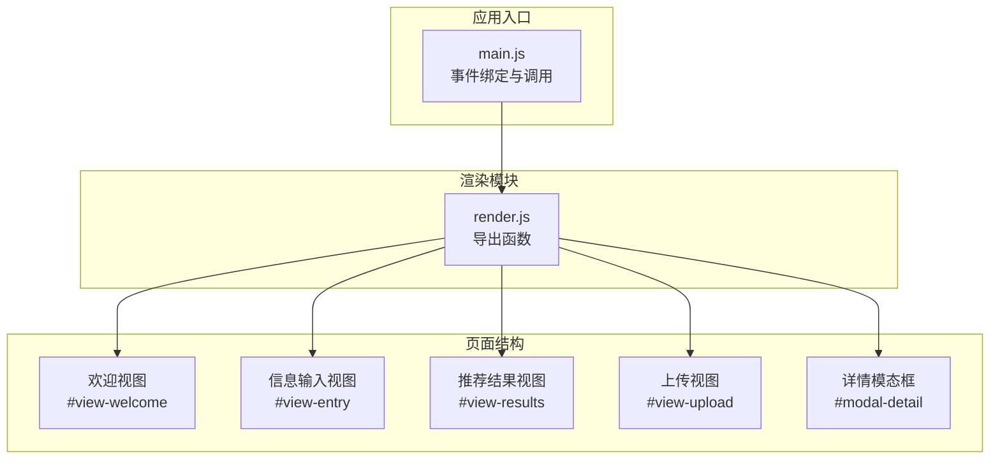
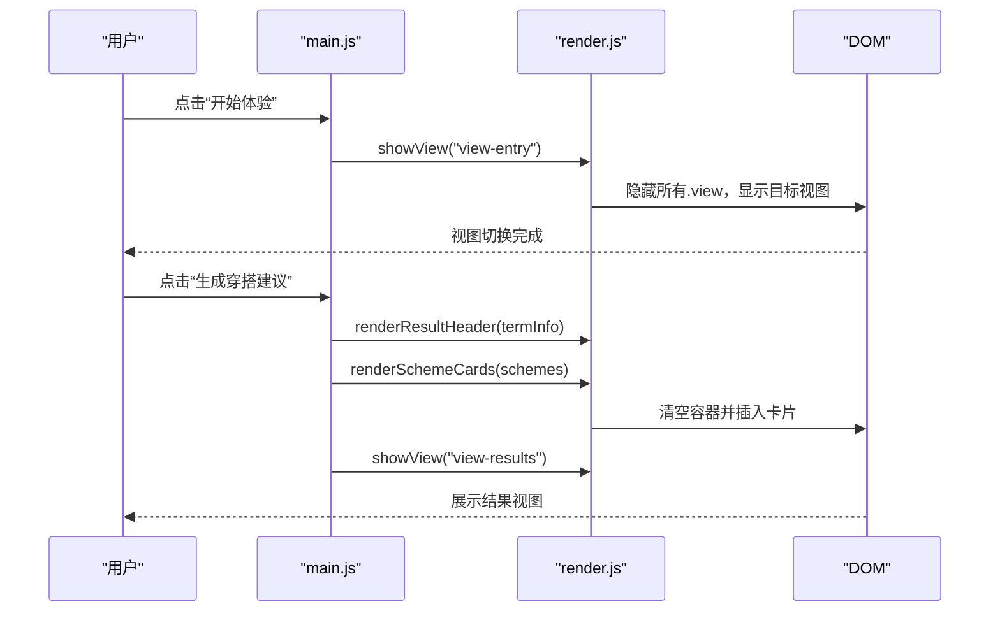
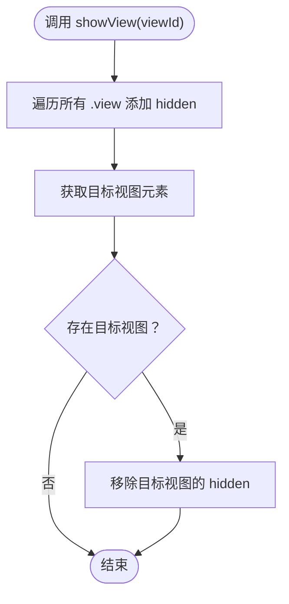
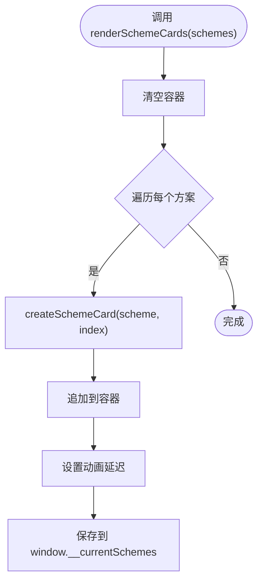
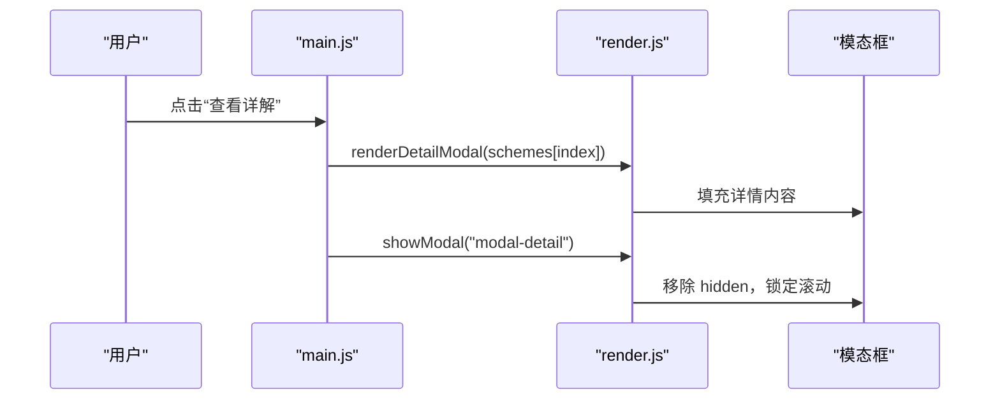
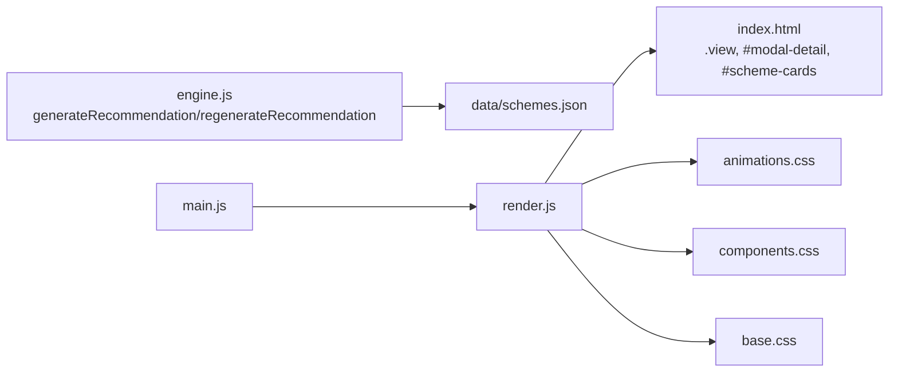

# 渲染模块 (render.js)

<cite>
**本文引用的文件列表**
- [render.js](file://js/render.js)
- [main.js](file://js/main.js)
- [index.html](file://index.html)
- [animations.css](file://css/animations.css)
- [components.css](file://css/components.css)
- [base.css](file://css/base.css)
- [schemes.json](file://data/schemes.json)
- [engine.js](file://js/engine.js)
</cite>

## 目录
1. [简介](#简介)
2. [项目结构](#项目结构)
3. [核心组件](#核心组件)
4. [架构总览](#架构总览)
5. [详细组件分析](#详细组件分析)
6. [依赖关系分析](#依赖关系分析)
7. [性能考量](#性能考量)
8. [故障排查指南](#故障排查指南)
9. [结论](#结论)
10. [附录：API 接口文档](#附录api-接口文档)

## 简介
本文件为渲染模块的技术文档，聚焦于视图管理系统、方案卡片渲染、详情弹窗展示以及各类 UI 组件的动态更新。文档同时涵盖 CSS 动画系统集成（过渡、加载与交互反馈）、DOM 操作最佳实践（事件委托、元素缓存与内存管理）、响应式设计与浏览器兼容性策略，并提供完整的 API 接口说明与常见问题解决方案。

## 项目结构
渲染模块位于 js/render.js，负责：
- 视图切换与隐藏显示
- 表单控件初始化（年份、日期下拉）
- 节气横幅与结果页标题渲染
- 方案卡片批量渲染与详情弹窗内容填充
- 模态框显示/隐藏与遮罩层处理
- 上传预览与反馈区域的动态切换
- Toast 消息提示与动画集成

页面结构由 index.html 提供，包含多个视图容器与模态框；样式由 base.css、components.css、animations.css 提供基础布局、组件样式与动画效果。

图表来源
- [index.html](file://index.html#L23-L214)
- [render.js](file://js/render.js#L8-L272)
- [main.js](file://js/main.js#L72-L153)

章节来源
- [index.html](file://index.html#L23-L214)
- [render.js](file://js/render.js#L8-L272)
- [main.js](file://js/main.js#L72-L153)

## 核心组件
- 视图管理：showView、showModal、closeModal
- 表单初始化：initYearSelect、initDaySelect
- 内容渲染：renderSolarBanner、renderResultHeader、renderSchemeCards、renderDetailModal
- 上传与反馈：updateUploadPreview
- 通知与反馈：showToast

章节来源
- [render.js](file://js/render.js#L8-L272)

## 架构总览
渲染模块以函数式 API 暴露，被应用入口 main.js 通过 import 导入并驱动 DOM 更新。渲染流程遵循“数据 → 渲染 → 视图切换”的模式，配合 CSS 动画类实现流畅的过渡与反馈。

图表来源
- [main.js](file://js/main.js#L72-L103)
- [render.js](file://js/render.js#L8-L127)

## 详细组件分析

### 视图管理系统
- showView(viewId)
  - 将所有带有 .view 类的元素添加 hidden 类，再移除目标视图的 hidden 类，实现视图切换。
  - 适用于欢迎、信息输入、结果、上传等视图的切换。
- showModal(modalId) / closeModal(modalId)
  - 显示/隐藏模态框，并在显示时锁定 body 的滚动条，避免背景滚动。
  - 模态框包含 backdrop 与 content，分别应用不同的进入动画。

图表来源
- [render.js](file://js/render.js#L8-L16)

章节来源
- [render.js](file://js/render.js#L8-L16)
- [render.js](file://js/render.js#L198-L215)

### 表单初始化
- initYearSelect()
  - 基于当前年份生成下拉选项，范围从 1950 到当前年减 16（至少 16 岁），用于生辰八字输入。
- initDaySelect()
  - 生成 1–31 的日期选项，配合月份选择形成日期输入。

章节来源
- [render.js](file://js/render.js#L21-L50)

### 节气横幅与结果标题
- renderSolarBanner(termInfo)
  - 更新节气名称与五行元素标签的颜色与文本，颜色根据五行映射到对应主题色。
- renderResultHeader(termInfo)
  - 在结果页标题区域显示当前节气与五行名称组合。

章节来源
- [render.js](file://js/render.js#L55-L109)

### 方案卡片渲染
- renderSchemeCards(schemes)
  - 清空容器后逐个创建卡片元素，设置动画延迟实现“阶梯式”入场效果，并将当前方案数组保存到全局供详情弹窗使用。
- createSchemeCard(scheme, index)
  - 生成单张卡片的 DOM 结构，包含颜色条、关键词标签、注解与来源，以及“查看详解”按钮（带 data-index）。

图表来源
- [render.js](file://js/render.js#L114-L154)

章节来源
- [render.js](file://js/render.js#L114-L154)

### 详情弹窗展示
- renderDetailModal(scheme)
  - 填充模态框主体内容，包含颜色条、色彩/材质/感受/五行解读/典籍出处等字段。
- showModal/closeModal
  - 控制模态框显示与关闭，ESC 键监听与 backdrop 点击关闭由入口文件绑定。

图表来源
- [render.js](file://js/render.js#L159-L193)
- [main.js](file://js/main.js#L125-L152)

章节来源
- [render.js](file://js/render.js#L159-L193)
- [main.js](file://js/main.js#L125-L152)

### 上传预览与反馈区域
- updateUploadPreview(imageData)
  - 当传入图片数据时，隐藏占位区、显示预览区与反馈区；否则相反。
  - 用于上传视图中的图片预览与反馈输入区域的动态切换。

章节来源
- [render.js](file://js/render.js#L220-L237)

### Toast 消息提示
- showToast(message, duration)
  - 动态创建并插入 toast 元素，应用淡入动画；定时后执行淡出并移除节点，避免内存泄漏。
  - 若已存在同类型 toast，先移除旧实例。

章节来源
- [render.js](file://js/render.js#L242-L271)

### CSS 动画系统集成
- 关键帧与动画类
  - 提供 fadeIn、fadeInUp、fadeInScale、slideInRight、slideInLeft、pulse、spin、bounce 等关键帧。
  - 通过 .animate-* 工具类与组件特定动画类（如 .scheme-card、.modal）实现统一的过渡与反馈。
- 视图与组件动画
  - .view 使用 fadeIn 实现整体视图淡入。
  - .scheme-card 使用 fadeInUp 并配合 nth-child 的延迟实现阶梯式入场。
  - .modal 的 backdrop 与 content 分别使用 fadeIn 与 fadeInScale，提升打开体验。
  - .btn 的波纹效果通过伪元素与过渡实现。
  - .wish-tag 的选中态使用 bounce 动画增强反馈。
  - .upload-zone 的拖拽态使用 pulse 动画提示。
  - .spinner 使用 spin 动画实现加载指示。
  - .skeleton 使用 shimmer 动画模拟骨架屏加载。
- 减少运动偏好
  - 媒体查询 prefers-reduced-motion 将动画时长设为极短并强制只播放一次，尊重无障碍需求。

章节来源
- [animations.css](file://css/animations.css#L6-L207)
- [components.css](file://css/components.css#L90-L154)
- [components.css](file://css/components.css#L231-L284)

## 依赖关系分析
- 渲染模块与页面结构
  - 渲染函数通过 ID 选择器与类名选择器直接操作 DOM，依赖 index.html 中的视图容器与模态框结构。
- 渲染模块与应用入口
  - main.js 导入 render.js 的函数并在事件回调中调用，形成“事件 → 数据 → 渲染 → 视图切换”的闭环。
- 渲染模块与样式系统
  - 动画与过渡效果由 animations.css 与 components.css 提供，渲染函数通过类名与内联样式配合实现视觉反馈。
- 渲染模块与数据源
  - 方案数据来源于 data/schemes.json，渲染函数在入口处接收由引擎生成的推荐结果并进行渲染。
- 渲染模块与引擎
  - engine.js 生成推荐结果（包含 schemes 数组），main.js 调用渲染函数并将结果注入 DOM。

图表来源
- [engine.js](file://js/engine.js#L268-L334)
- [main.js](file://js/main.js#L202-L244)
- [render.js](file://js/render.js#L114-L193)
- [index.html](file://index.html#L23-L214)
- [animations.css](file://css/animations.css#L1-L207)
- [components.css](file://css/components.css#L1-L338)
- [base.css](file://css/base.css#L1-L168)

章节来源
- [engine.js](file://js/engine.js#L268-L334)
- [main.js](file://js/main.js#L202-L244)
- [render.js](file://js/render.js#L114-L193)
- [index.html](file://index.html#L23-L214)

## 性能考量
- DOM 操作最小化
  - 批量渲染时先清空容器，再一次性追加子元素，减少回流与重绘次数。
- 动画与过渡
  - 使用 CSS 动画而非 JavaScript 定时器，利用 GPU 加速与浏览器合成线程，降低主线程压力。
- 事件委托
  - 对 .scheme-cards 使用事件委托捕获“查看详解”按钮点击，避免为每个按钮单独绑定监听器。
- 内存管理
  - Toast 在动画结束后移除节点，避免重复创建导致的内存累积。
  - 模态框关闭时恢复 body 的滚动条，防止页面抖动与潜在的滚动事件堆积。
- 可访问性
  - 模态框具备 aria-modal、aria-labelledby 等属性，确保屏幕阅读器正确识别。
  - 按钮与表单元素具备焦点可见样式与键盘交互支持。

章节来源
- [render.js](file://js/render.js#L114-L154)
- [render.js](file://js/render.js#L242-L271)
- [main.js](file://js/main.js#L125-L152)
- [index.html](file://index.html#L199-L214)

## 故障排查指南
- 视图无法切换
  - 检查目标视图 ID 是否存在于页面结构中；确认 .view 类与 hidden 类是否正确应用。
- 卡片不显示或不出现动画
  - 确认容器 ID #scheme-cards 存在；检查渲染函数是否正确清空并追加子元素；确认 CSS 中 .scheme-card 的动画类是否生效。
- 详情弹窗内容为空
  - 确认入口文件已将当前方案数组保存到 window.__currentSchemes；检查 renderDetailModal 的字段映射与模态框结构。
- 模态框无法关闭
  - 检查 ESC 键监听与 backdrop 点击事件是否绑定；确认 showModal/closeModal 的调用时机。
- 上传预览不更新
  - 确认 updateUploadPreview 的参数是否为有效图片数据；检查占位区与预览区的类名切换逻辑。
- Toast 不消失
  - 检查定时器是否执行；确认动画结束后移除了节点；避免重复创建多个 toast。

章节来源
- [render.js](file://js/render.js#L8-L272)
- [main.js](file://js/main.js#L125-L152)
- [index.html](file://index.html#L199-L214)

## 结论
渲染模块通过简洁的函数式 API 实现了视图切换、内容渲染与交互反馈的完整闭环。结合 CSS 动画系统与事件委托等最佳实践，既保证了良好的用户体验，又兼顾了性能与可维护性。建议在后续迭代中进一步封装通用的 DOM 操作工具与动画控制接口，以提升代码复用性与扩展性。

## 附录：API 接口文档

### 视图管理
- showView(viewId)
  - 参数：viewId（字符串，目标视图的 ID）
  - 行为：隐藏所有 .view，显示目标视图
  - 适用场景：切换欢迎、信息输入、结果、上传视图
- showModal(modalId)
  - 参数：modalId（字符串，模态框的 ID）
  - 行为：移除模态框的 hidden 类，锁定 body 滚动
- closeModal(modalId)
  - 参数：modalId（字符串，模态框的 ID）
  - 行为：添加模态框的 hidden 类，恢复 body 滚动

章节来源
- [render.js](file://js/render.js#L8-L16)
- [render.js](file://js/render.js#L198-L215)

### 表单初始化
- initYearSelect()
  - 行为：为 #bazi-year 生成年份选项（1950 至当前年减 16）
- initDaySelect()
  - 行为：为 #bazi-day 生成 1–31 的日期选项

章节来源
- [render.js](file://js/render.js#L21-L50)

### 内容渲染
- renderSolarBanner(termInfo)
  - 参数：termInfo（对象，包含当前节气名称与五行名称）
  - 行为：更新节气名称与五行元素标签的颜色与文本
- renderResultHeader(termInfo)
  - 参数：termInfo（对象）
  - 行为：更新结果页标题区域的节气与五行名称
- renderSchemeCards(schemes)
  - 参数：schemes（数组，推荐方案集合）
  - 行为：清空容器并插入方案卡片，设置动画延迟，保存到 window.__currentSchemes
- renderDetailModal(scheme)
  - 参数：scheme（对象，单个推荐方案）
  - 行为：填充模态框主体内容（颜色条、色彩/材质/感受/五行解读/典籍出处）

章节来源
- [render.js](file://js/render.js#L55-L109)
- [render.js](file://js/render.js#L114-L193)

### 上传与反馈
- updateUploadPreview(imageData)
  - 参数：imageData（字符串，图片数据 URL 或空值）
  - 行为：根据是否存在图片数据切换占位区、预览区与反馈区的显示状态

章节来源
- [render.js](file://js/render.js#L220-L237)

### 通知与反馈
- showToast(message, duration?)
  - 参数：message（字符串）、duration（可选，毫秒，默认 2000）
  - 行为：创建并插入 toast 元素，应用淡入动画；定时后淡出并移除节点

章节来源
- [render.js](file://js/render.js#L242-L271)

### 数据与引擎对接
- generateRecommendation(termInfo, wishId, baziResult)
  - 返回：包含 schemes、termInfo、wishId、baziResult 等的推荐结果对象
- regenerateRecommendation(termInfo, wishId, baziResult, excludeIds?)
  - 返回：新的推荐结果对象，排除已使用的方案 ID

章节来源
- [engine.js](file://js/engine.js#L268-L334)