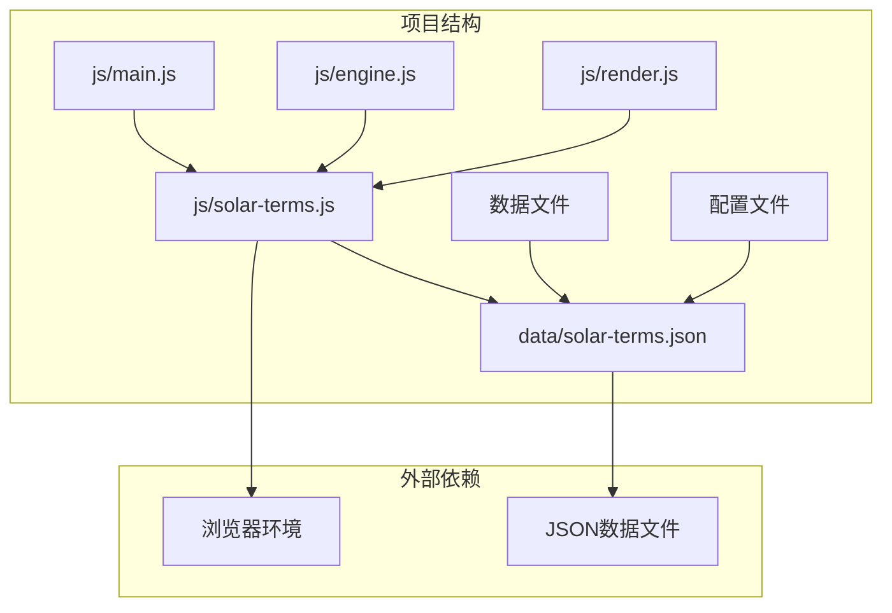
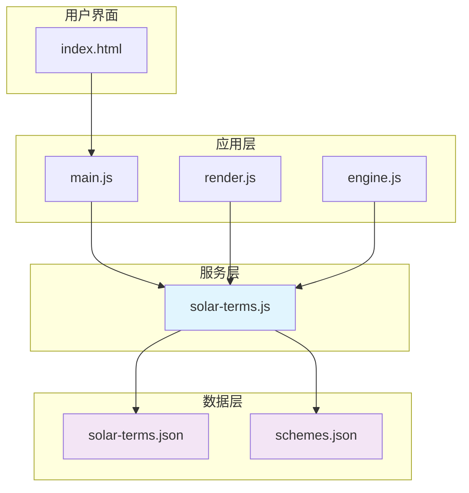
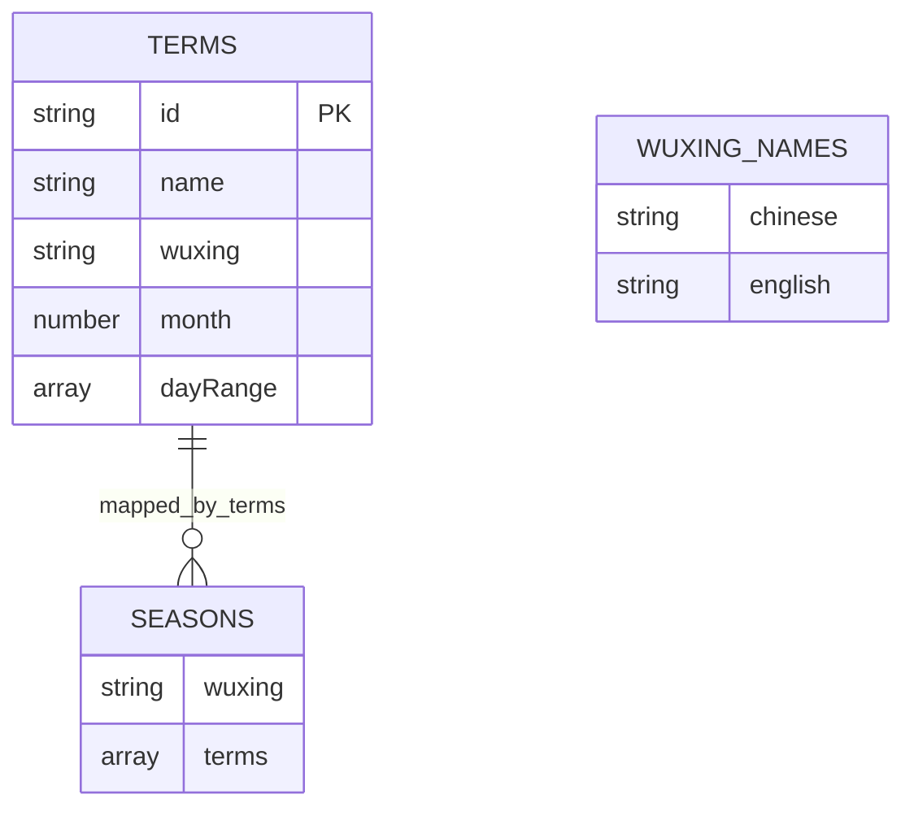
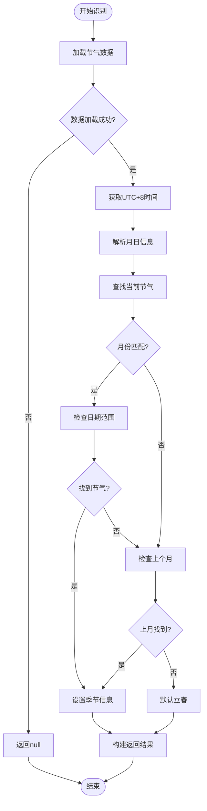
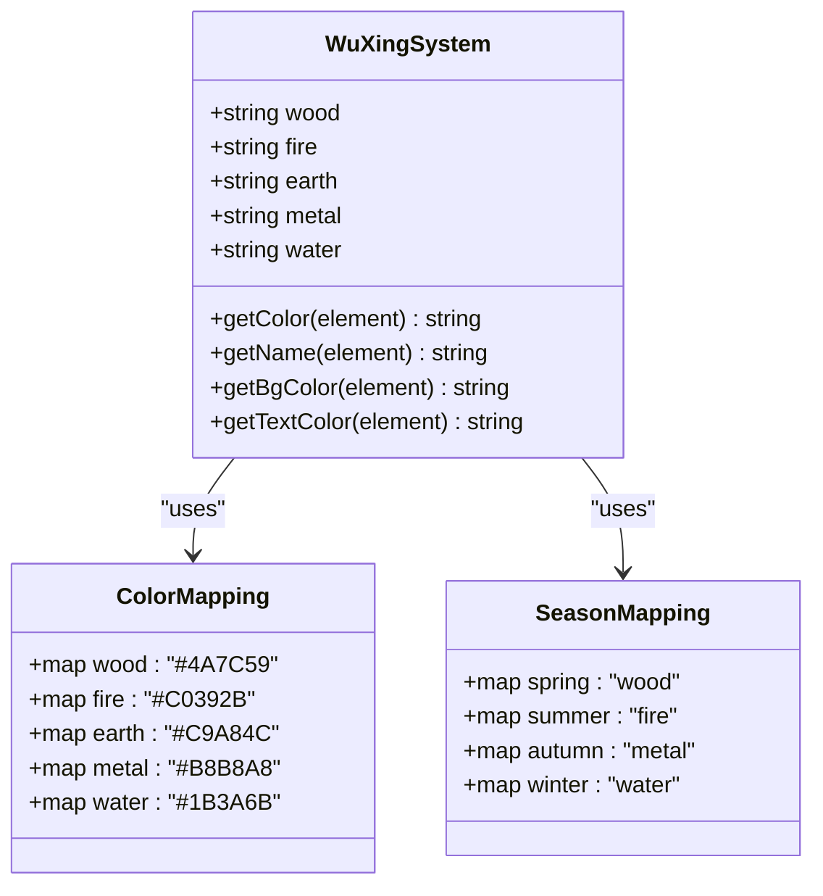
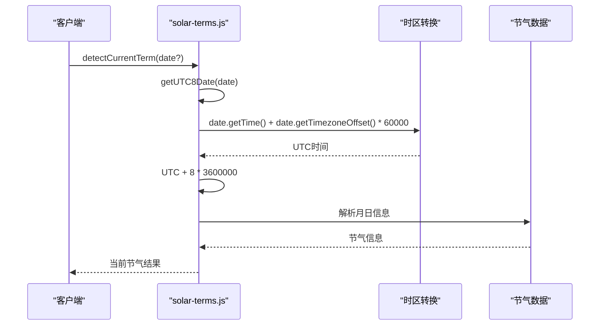
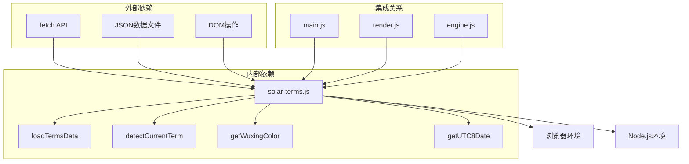
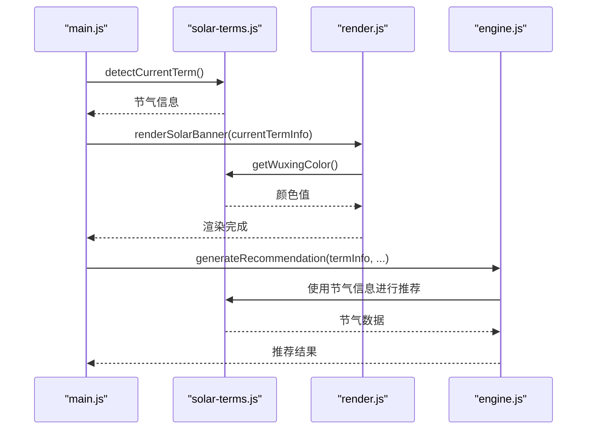

# 节气处理模块 (solar-terms.js) 技术文档

<cite>
**本文档引用的文件**
- [solar-terms.js](file://js/solar-terms.js)
- [solar-terms.json](file://data/solar-terms.json)
- [main.js](file://js/main.js)
- [engine.js](file://js/engine.js)
- [render.js](file://js/render.js)
- [schemes.json](file://data/schemes.json)
- [index.html](file://index.html)
</cite>

## 目录
1. [简介](#简介)
2. [项目结构](#项目结构)
3. [核心组件](#核心组件)
4. [架构概览](#架构概览)
5. [详细组件分析](#详细组件分析)
6. [依赖关系分析](#依赖关系分析)
7. [性能考量](#性能考量)
8. [故障排除指南](#故障排除指南)
9. [结论](#结论)
10. [附录](#附录)

## 简介
节气处理模块是"五行穿搭建议"应用的核心功能模块，负责二十四节气的检测、识别和相关数据管理。该模块基于中国传统的二十四节气理论，结合现代Web技术实现节气信息的动态获取、计算和展示。

该模块的主要职责包括：
- 节气数据的加载和管理
- 当前节气的智能识别
- 五行属性映射和颜色编码
- 季节变化规律的处理
- 与其他模块的数据交互

## 项目结构
节气处理模块位于项目的JavaScript目录中，采用模块化设计，与其他核心模块协同工作。



**图表来源**
- [solar-terms.js](file://js/solar-terms.js#L1-L118)
- [solar-terms.json](file://data/solar-terms.json#L1-L42)

**章节来源**
- [solar-terms.js](file://js/solar-terms.js#L1-L118)
- [solar-terms.json](file://data/solar-terms.json#L1-L42)

## 核心组件
节气处理模块包含以下核心组件：

### 数据加载组件
- **loadTermsData()**: 异步加载节气数据，支持缓存机制
- **termsData**: 全局数据缓存，避免重复请求

### 节气识别组件
- **detectCurrentTerm()**: 核心节气识别算法
- **getUTC8Date()**: UTC+8时间处理函数

### 五行映射组件
- **getWuxingColor()**: 五行颜色映射
- **wuxingNames**: 五行名称映射表

**章节来源**
- [solar-terms.js](file://js/solar-terms.js#L5-L118)

## 架构概览
节气处理模块采用分层架构设计，各层职责明确，耦合度低。



**图表来源**
- [main.js](file://js/main.js#L6-L6)
- [render.js](file://js/render.js#L6-L6)
- [engine.js](file://js/engine.js#L6-L6)
- [solar-terms.js](file://js/solar-terms.js#L5-L5)

## 详细组件分析

### 节气数据结构
节气数据采用标准化JSON格式，包含完整的节气信息和映射关系。



**图表来源**
- [solar-terms.json](file://data/solar-terms.json#L2-L41)

#### 节气数据字段说明
- **id**: 节气唯一标识符
- **name**: 节气中文名称
- **wuxing**: 五行属性 (wood/fire/earth/metal/water)
- **month**: 节气所在月份 (1-12)
- **dayRange**: 日期范围数组 [开始日, 结束日]

#### 季节映射结构
- **spring**: 木属性 (立春、雨水、惊蛰、春分、清明、谷雨)
- **summer**: 火属性 (立夏、小满、芒种、夏至、小暑、大暑)
- **autumn**: 金属属性 (立秋、处暑、白露、秋分、寒露、霜降)
- **winter**: 水属性 (立冬、小雪、大雪、冬至、小寒、大寒)

**章节来源**
- [solar-terms.json](file://data/solar-terms.json#L2-L41)

### 节气识别算法
节气识别算法采用智能匹配策略，确保准确识别当前节气。



**图表来源**
- [solar-terms.js](file://js/solar-terms.js#L36-L103)

#### 算法特点
1. **智能匹配**: 首先匹配当前月份，然后检查日期范围
2. **回溯机制**: 如果当前月份未找到，自动检查上个月
3. **默认处理**: 确保始终返回有效的节气信息
4. **季节关联**: 自动关联对应的季节信息

**章节来源**
- [solar-terms.js](file://js/solar-terms.js#L36-L103)

### 五行属性映射系统
五行属性映射系统实现了传统中医理论与现代UI设计的完美结合。



**图表来源**
- [solar-terms.js](file://js/solar-terms.js#L108-L117)
- [render.js](file://js/render.js#L76-L99)

#### 五行颜色编码
- **木属性**: 深绿色 (#4A7C59) - 对应春天和生长
- **火属性**: 深红色 (#C0392B) - 对应夏天和热情
- **土属性**: 深黄色 (#C9A84C) - 对应长夏和稳定
- **金属性**: 灰色 (#B8B8A8) - 对应秋天和收敛
- **水属性**: 深蓝色 (#1B3A6B) - 对应冬天和收藏

#### 季节变化规律
- **春季 (木)**: 生发、舒展、充满生机
- **夏季 (火)**: 炽热、繁荣、阳气旺盛
- **长夏 (土)**: 调和、承载、化育万物
- **秋季 (金)**: 收敛、肃杀、收获成熟
- **冬季 (水)**: 藏纳、寒冷、潜藏生机

**章节来源**
- [solar-terms.js](file://js/solar-terms.js#L108-L117)
- [render.js](file://js/render.js#L76-L99)

### 时间计算数学模型
时间计算采用UTC+8时区标准，确保全球用户的一致体验。



**图表来源**
- [solar-terms.js](file://js/solar-terms.js#L10-L13)
- [solar-terms.js](file://js/solar-terms.js#L36-L103)

#### 数学模型说明
1. **UTC转换**: `UTC = 本地时间 + 时区偏移分钟数`
2. **时区调整**: `UTC+8 = UTC + 8小时`
3. **日期解析**: 提取月份和日期进行匹配
4. **边界处理**: 考虑跨年节气的特殊处理

**章节来源**
- [solar-terms.js](file://js/solar-terms.js#L10-L13)

### API接口文档

#### detectCurrentTerm 函数
**功能**: 检测当前节气信息

**参数**:
- `date` (可选): Date对象，默认为当前日期

**返回值**:
```javascript
{
  current: {
    id: string,           // 节气ID
    name: string,         // 节气名称
    wuxing: string,       // 五行属性
    wuxingName: string    // 五行中文名称
  },
  next: {
    id: string,           // 下一个节气ID
    name: string,         // 下一个节气名称
    wuxing: string        // 下一个节气五行属性
  } | null,
  seasonInfo: {
    name: string,         // 季节名称
    wuxing: string        // 季节五行属性
  } | null,
  wuxingNames: object    // 五行名称映射
}
```

**使用示例**:
```javascript
// 获取当前节气
const currentTerm = await detectCurrentTerm();

// 指定特定日期
const specificTerm = await detectCurrentTerm(new Date('2024-02-04'));

// 处理返回结果
if (currentTerm) {
  console.log(`当前节气: ${currentTerm.current.name}`);
  console.log(`五行属性: ${currentTerm.current.wuxingName}`);
}
```

**章节来源**
- [solar-terms.js](file://js/solar-terms.js#L36-L103)

#### getWuxingColor 函数
**功能**: 获取五行对应的十六进制颜色值

**参数**:
- `wuxing` (必需): 五行属性字符串 (wood/fire/earth/metal/water)

**返回值**: 十六进制颜色字符串

**使用示例**:
```javascript
const woodColor = getWuxingColor('wood');    // "#4A7C59"
const fireColor = getWuxingColor('fire');    // "#C0392B"
const unknownColor = getWuxingColor('unknown'); // "#666666" (默认值)
```

**章节来源**
- [solar-terms.js](file://js/solar-terms.js#L108-L117)

#### getUTC8Date 函数
**功能**: 获取UTC+8时区的Date对象

**参数**:
- `date` (可选): Date对象，默认为当前时间

**返回值**: Date对象 (UTC+8)

**使用示例**:
```javascript
const now = new Date();
const utc8Time = getUTC8Date(now);
console.log(utc8Time.toLocaleDateString('zh-CN'));
```

**章节来源**
- [solar-terms.js](file://js/solar-terms.js#L10-L13)

### 扩展性设计
节气处理模块具有良好的扩展性设计，支持未来功能增强。

#### 数据结构扩展
```mermaid
graph LR
subgraph "现有结构"
A[terms] --> B[id, name, wuxing, month, dayRange]
C[seasons] --> D[wuxing, terms[]]
E[wuxingNames] --> F[中文名称映射]
end
subgraph "扩展方向"
G[future] --> H[节气描述]
G --> I[节气谚语]
G --> J[地域差异]
G --> K[历史演变]
end
A -.-> G
C -.-> G
E -.-> G
```

#### 国际化支持考虑
- **多语言支持**: 通过wuxingNames实现中文显示
- **时区适配**: 采用UTC+8标准时区
- **文化适应**: 保持传统节气概念的准确性

**章节来源**
- [solar-terms.js](file://js/solar-terms.js#L5-L29)
- [solar-terms.json](file://data/solar-terms.json#L34-L40)

## 依赖关系分析



**图表来源**
- [solar-terms.js](file://js/solar-terms.js#L18-L29)
- [main.js](file://js/main.js#L6-L6)
- [render.js](file://js/render.js#L6-L6)
- [engine.js](file://js/engine.js#L6-L6)

### 模块间协作
节气处理模块与应用其他模块的协作关系如下：



**图表来源**
- [main.js](file://js/main.js#L29-L38)
- [render.js](file://js/render.js#L55-L71)
- [engine.js](file://js/engine.js#L268-L310)

**章节来源**
- [main.js](file://js/main.js#L6-L67)
- [render.js](file://js/render.js#L55-L71)
- [engine.js](file://js/engine.js#L268-L310)

## 性能考量
节气处理模块在设计时充分考虑了性能优化：

### 缓存策略
- **数据缓存**: `termsData`全局变量避免重复网络请求
- **异步加载**: 使用Promise确保非阻塞数据加载
- **懒加载**: 仅在需要时才加载节气数据

### 算法优化
- **线性搜索**: 对于24个节气的简单遍历，时间复杂度O(n)
- **早期退出**: 找到匹配后立即停止搜索
- **内存优化**: 避免不必要的数据复制

### 内存管理
- **垃圾回收**: 及时释放不需要的对象引用
- **数据共享**: 通过引用传递而非复制数据
- **资源清理**: 在模块卸载时清理相关资源

## 故障排除指南

### 常见问题及解决方案

#### 数据加载失败
**症状**: `detectCurrentTerm()`返回null
**原因**: JSON文件加载失败或格式错误
**解决方法**:
1. 检查网络连接和文件路径
2. 验证JSON格式的正确性
3. 查看浏览器控制台错误信息

#### 时区显示异常
**症状**: 节气日期与预期不符
**原因**: 本地时区设置问题
**解决方法**:
1. 确认系统时区设置
2. 检查`getUTC8Date()`函数的时区转换
3. 验证目标日期的时区偏移

#### 节气识别错误
**症状**: 识别的节气不正确
**原因**: 日期范围边界处理问题
**解决方法**:
1. 检查`solar-terms.json`中的日期范围
2. 验证`detectCurrentTerm()`算法逻辑
3. 添加边界条件测试用例

### 调试工具使用

#### 浏览器开发者工具
1. **Network面板**: 检查JSON文件加载状态
2. **Console面板**: 查看错误信息和日志输出
3. **Sources面板**: 设置断点调试算法执行流程

#### 日志记录
```javascript
// 在关键位置添加日志
console.log('[SolarTerms] Loading data:', date);
console.log('[SolarTerms] Parsed term:', term.name);
console.log('[SolarTerms] Current term:', currentTerm?.name);
```

#### 单元测试建议
```javascript
// 测试用例示例
describe('节气识别测试', () => {
  test('立春识别', () => {
    const date = new Date('2024-02-04');
    const result = detectCurrentTerm(date);
    expect(result.current.id).toBe('lichun');
  });
  
  test('夏至识别', () => {
    const date = new Date('2024-06-21');
    const result = detectCurrentTerm(date);
    expect(result.current.id).toBe('xiazhi');
  });
});
```

**章节来源**
- [solar-terms.js](file://js/solar-terms.js#L25-L28)
- [solar-terms.js](file://js/solar-terms.js#L40-L77)

## 结论
节气处理模块是一个设计精良、功能完善的模块化组件，成功地将传统二十四节气文化与现代Web技术相结合。模块具有以下突出特点：

### 技术优势
- **模块化设计**: 清晰的职责分离和接口定义
- **数据驱动**: 基于JSON配置的灵活数据管理
- **性能优化**: 缓存机制和高效的算法实现
- **用户体验**: 无缝的时区适配和错误处理

### 功能完整性
- **节气识别**: 准确的当前节气检测算法
- **五行映射**: 完整的属性到颜色的映射系统
- **季节关联**: 自然的季节变化规律体现
- **扩展支持**: 良好的架构支持未来功能扩展

### 应用价值
该模块不仅提供了准确的节气信息服务，更重要的是为整个"五行穿搭建议"应用奠定了坚实的文化基础和技术支撑，实现了传统文化与现代科技的有机融合。

## 附录

### 相关文件清单
- **核心模块**: js/solar-terms.js
- **配置数据**: data/solar-terms.json
- **集成入口**: js/main.js
- **渲染模块**: js/render.js
- **推荐引擎**: js/engine.js
- **方案数据**: data/schemes.json
- **应用入口**: index.html

### 版本兼容性
- **浏览器支持**: 现代浏览器 (Chrome/Firefox/Safari/Edge)
- **Node.js支持**: 14+ 版本
- **ES6+特性**: 使用现代JavaScript语法

### 维护建议
1. **定期更新**: 根据节气历法规则定期更新节气日期
2. **性能监控**: 监控数据加载时间和内存使用情况
3. **错误监控**: 实施全面的错误捕获和报告机制
4. **用户反馈**: 建立用户反馈渠道持续改进功能