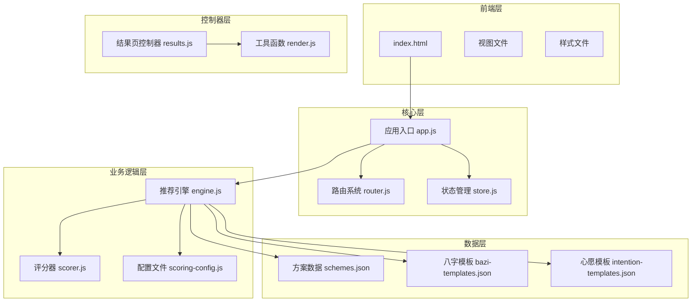
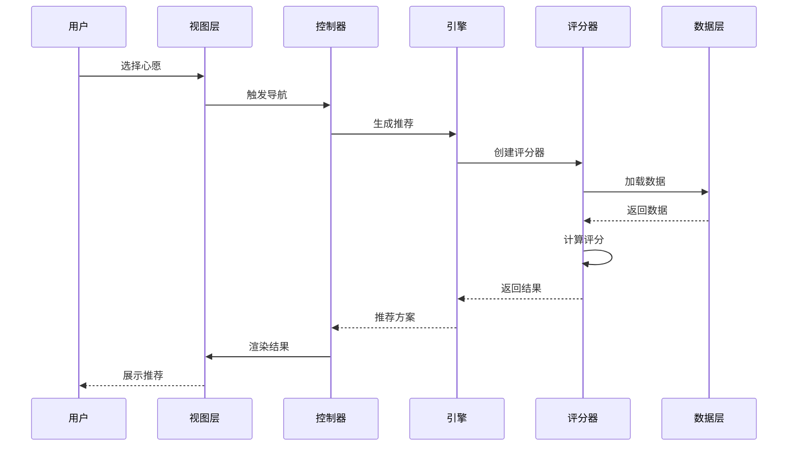
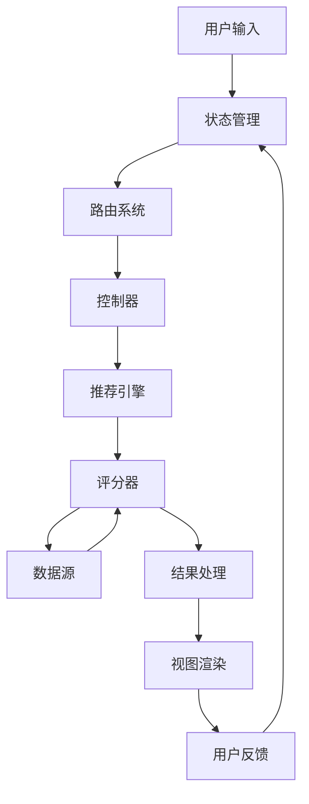
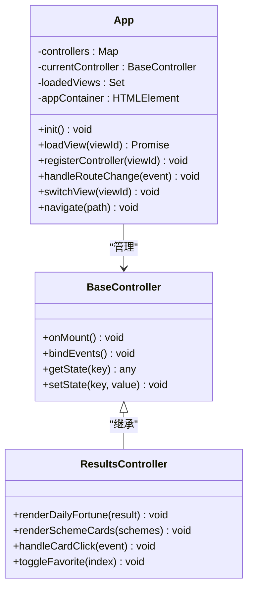
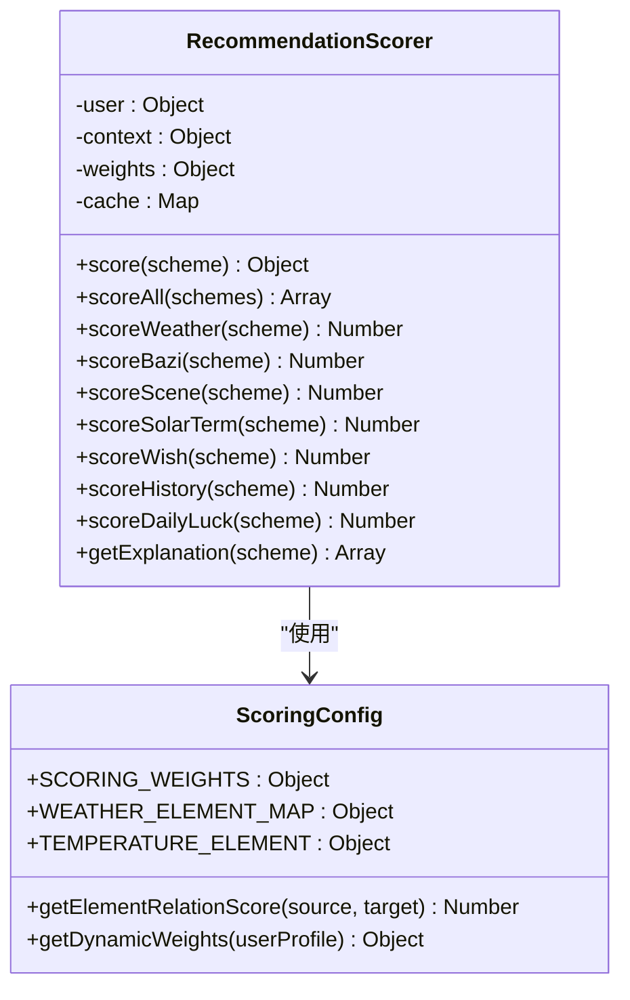
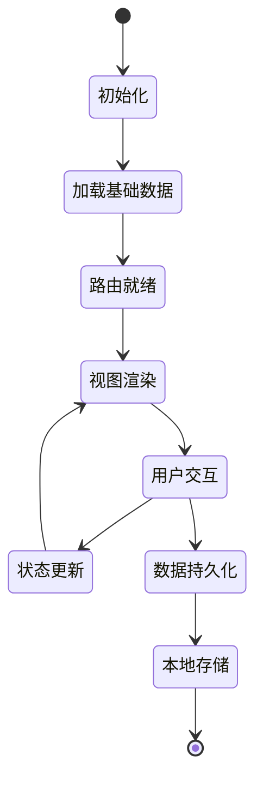
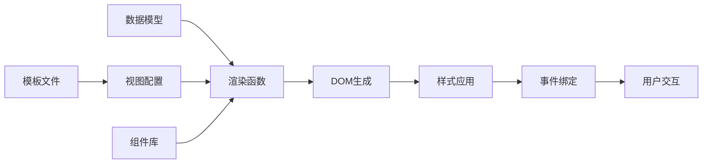
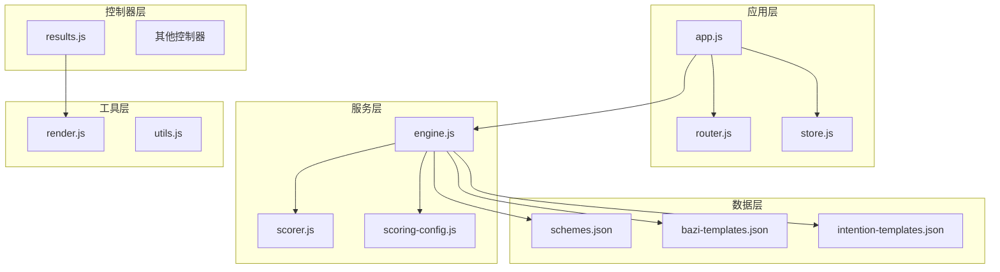

# 五元素雷达可视化系统

<cite>
**本文档引用的文件**
- [index.html](file://index.html)
- [app.js](file://js/core/app.js)
- [router.js](file://js/core/router.js)
- [store.js](file://js/core/store.js)
- [scorer.js](file://js/core/scorer.js)
- [scoring-config.js](file://js/core/scoring-config.js)
- [engine.js](file://js/services/engine.js)
- [results.js](file://js/controllers/results.js)
- [render.js](file://js/utils/render.js)
- [results.html](file://views/results.html)
- [profile.html](file://views/profile.html)
- [modals.html](file://views/modals.html)
- [main.css](file://css/main.css)
- [schemes.json](file://data/schemes.json)
- [bazi-templates.json](file://data/bazi-templates.json)
- [intention-templates.json](file://data/intention-templates.json)
</cite>

## 目录
1. [项目概述](#项目概述)
2. [项目结构](#项目结构)
3. [核心组件](#核心组件)
4. [架构概览](#架构概览)
5. [详细组件分析](#详细组件分析)
6. [依赖关系分析](#依赖关系分析)
7. [性能考虑](#性能考虑)
8. [故障排除指南](#故障排除指南)
9. [结论](#结论)

## 项目概述

五元素雷达可视化系统是一个基于中国传统五行理论的智能穿搭推荐应用。该系统结合现代前端技术，为用户提供个性化的服装搭配建议，融合了节气文化、八字命理和个人偏好分析。

### 主要特性

- **五行理论集成**：基于中医五行学说，结合二十四节气变化
- **智能推荐算法**：采用多维度评分系统，综合考虑天气、场景、个人偏好等因素
- **可视化展示**：提供直观的五元素雷达图和推荐理由解释
- **个性化定制**：支持用户八字信息录入和偏好设置
- **响应式设计**：适配多种设备和屏幕尺寸

## 项目结构

该项目采用模块化架构设计，主要分为以下几个层次：



**图表来源**
- [index.html](file://index.html#L1-L102)
- [app.js](file://js/core/app.js#L1-L237)
- [engine.js](file://js/services/engine.js#L1-L461)

**章节来源**
- [index.html](file://index.html#L1-L102)
- [main.css](file://css/main.css#L1-L964)

## 核心组件

### 应用入口系统

应用采用模块化设计，通过统一的应用入口管理所有功能模块：

- **App类**：负责应用初始化、视图管理和全局状态协调
- **路由系统**：支持Hash路由和标准路由，适配GitHub Pages部署
- **状态管理**：提供全局状态存储和订阅机制

### 推荐引擎

推荐引擎是系统的核心，采用多维度评分算法：

- **评分器**：实现完整的评分逻辑，包括天气、场景、节气、八字等维度
- **权重配置**：灵活的权重系统，支持动态调整各维度重要性
- **梯度推荐**：提供最佳匹配、保守替代、平衡方案等多种推荐策略

### 数据管理系统

系统内置完善的数据管理机制：

- **本地存储**：所有用户数据存储在本地，确保隐私安全
- **偏好学习**：通过用户反馈自动优化推荐算法
- **收藏功能**：支持用户收藏喜欢的穿搭方案

**章节来源**
- [app.js](file://js/core/app.js#L38-L224)
- [router.js](file://js/core/router.js#L9-L172)
- [store.js](file://js/core/store.js#L30-L187)

## 架构概览

系统采用MVVM架构模式，实现了清晰的职责分离：



**图表来源**
- [engine.js](file://js/services/engine.js#L359-L429)
- [results.js](file://js/controllers/results.js#L20-L50)

### 数据流架构



**图表来源**
- [store.js](file://js/core/store.js#L30-L187)
- [engine.js](file://js/services/engine.js#L244-L335)

## 详细组件分析

### 应用核心架构

#### App类设计

App类实现了完整的应用生命周期管理：



**图表来源**
- [app.js](file://js/core/app.js#L38-L224)
- [results.js](file://js/controllers/results.js#L13-L656)

#### 路由系统设计

路由系统支持多种部署环境：

- **Hash路由**：GitHub Pages兼容模式
- **标准路由**：本地开发和生产环境
- **事件驱动**：基于自定义事件的路由变更通知

**章节来源**
- [router.js](file://js/core/router.js#L43-L117)

### 推荐算法系统

#### 评分器架构

推荐评分器采用模块化设计，支持单元测试：



**图表来源**
- [scorer.js](file://js/core/scorer.js#L14-L474)
- [scoring-config.js](file://js/core/scoring-config.js#L6-L127)

#### 评分维度分析

系统采用多维度评分模型：

| 评分维度 | 权重 | 说明 | 作用 |
|---------|------|------|------|
| 八字 | 35% | 基于个人命理的个性化推荐 | 核心差异化因素 |
| 场景 | 25% | 考虑工作、约会、运动等场景需求 | 一票否决门槛 |
| 节气 | 20% | 结合二十四节气的能量变化 | 顺应天时原则 |
| 天气 | 20% | 实时天气对穿搭的影响 | 物理门槛限制 |
| 心愿 | +10% | 个人愿望与五行的契合度 | 偏好加成 |
| 历史 | +5% | 用户过往偏好的学习权重 | 个性化优化 |
| 运势 | +5% | 今日运势的随机性因素 | 增加趣味性 |

**章节来源**
- [scoring-config.js](file://js/core/scoring-config.js#L7-L24)
- [scorer.js](file://js/core/scorer.js#L29-L107)

### 数据管理系统

#### 状态管理架构



**图表来源**
- [store.js](file://js/core/store.js#L30-L187)

#### 数据持久化策略

系统采用多层次数据存储策略：

- **短期状态**：内存中的响应式状态对象
- **用户偏好**：localStorage存储用户偏好数据
- **收藏内容**：独立的收藏数据管理
- **反馈记录**：本地反馈数据收集

**章节来源**
- [store.js](file://js/core/store.js#L190-L212)

### 视图渲染系统

#### 模板渲染架构



**图表来源**
- [render.js](file://js/utils/render.js#L119-L204)

#### 五元素雷达图

系统提供独特的五元素雷达图可视化：

- **数据采集**：基于用户偏好和历史选择
- **图形绘制**：使用Canvas API实现动态绘制
- **交互设计**：支持缩放、旋转等交互操作
- **实时更新**：根据用户行为动态调整显示

**章节来源**
- [render.js](file://js/utils/render.js#L119-L135)
- [profile.html](file://views/profile.html#L95-L132)

## 依赖关系分析

### 模块依赖图



**图表来源**
- [app.js](file://js/core/app.js#L14-L22)
- [engine.js](file://js/services/engine.js#L6-L13)

### 外部依赖

系统尽量减少外部依赖，仅使用必要的原生API：

- **Canvas API**：用于雷达图和图表绘制
- **Web Storage API**：localStorage数据持久化
- **File API**：图片上传和预览
- **Geolocation API**：地理位置获取（可选）
- **Share API**：系统分享功能

**章节来源**
- [render.js](file://js/utils/render.js#L608-L627)

## 性能考虑

### 加载优化

系统采用多种策略优化加载性能：

- **延迟加载**：非首屏资源延迟加载
- **缓存策略**：静态资源长期缓存
- **按需加载**：视图和控制器按需加载
- **压缩优化**：CSS和JavaScript文件压缩

### 运行时优化

- **虚拟滚动**：大量数据时使用虚拟滚动
- **事件节流**：高频事件使用节流处理
- **内存管理**：及时清理事件监听器和定时器
- **动画优化**：使用transform和opacity属性优化动画

### 存储优化

- **增量更新**：只更新变化的数据
- **批量操作**：合并多个状态更新
- **数据压缩**：对大数据进行压缩存储
- **清理策略**：定期清理过期数据

## 故障排除指南

### 常见问题诊断

#### 应用启动问题

**症状**：应用无法正常启动
**可能原因**：
- 路由配置错误
- 数据加载失败
- 依赖模块缺失

**解决方案**：
1. 检查控制台错误信息
2. 验证网络连接
3. 确认数据文件完整性

#### 推荐结果异常

**症状**：推荐结果不符合预期
**可能原因**：
- 评分权重配置错误
- 数据源加载失败
- 用户偏好数据异常

**解决方案**：
1. 检查评分器日志
2. 验证数据格式正确性
3. 清除缓存数据重新加载

#### 性能问题

**症状**：页面响应缓慢
**可能原因**：
- DOM操作过多
- 事件监听器泄漏
- 图片资源过大

**解决方案**：
1. 使用开发者工具分析性能
2. 优化DOM操作
3. 实施懒加载策略

### 调试技巧

#### 开发者工具使用

- **Network面板**：监控资源加载
- **Performance面板**：分析运行时性能
- **Memory面板**：检测内存泄漏
- **Console面板**：查看错误日志

#### 日志记录

系统提供了完善的日志记录机制：

```javascript
// 示例：错误处理日志
console.error('[Engine] Weather data unavailable');
console.warn('[Engine] 所有方案被一票否决，启用降级模式');
console.log('[App] Initialization complete');
```

**章节来源**
- [engine.js](file://js/services/engine.js#L378-L382)
- [app.js](file://js/core/app.js#L50-L84)

## 结论

五元素雷达可视化系统是一个功能完整、架构清晰的现代Web应用。系统成功地将传统五行理论与现代技术相结合，为用户提供了个性化的穿搭推荐体验。

### 技术优势

- **模块化设计**：清晰的职责分离和依赖管理
- **响应式架构**：良好的扩展性和维护性
- **用户体验**：直观的界面设计和流畅的交互体验
- **性能优化**：多层面的性能优化策略

### 改进建议

1. **算法优化**：可以引入机器学习算法提升推荐准确性
2. **数据可视化**：增强图表的交互性和可定制性
3. **离线支持**：实现Service Worker离线缓存
4. **国际化**：支持多语言版本
5. **数据分析**：提供用户行为分析和趋势预测

该系统为传统文化的现代化应用提供了优秀的实践案例，展现了传统文化与现代科技融合的巨大潜力。