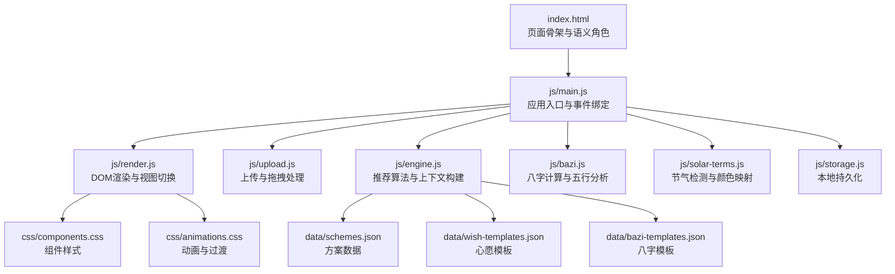
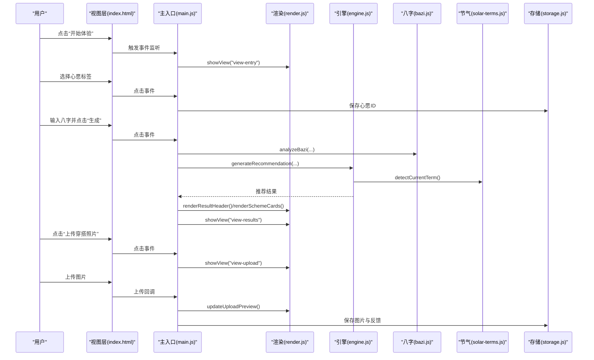
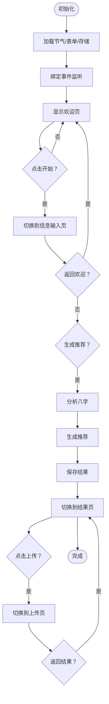
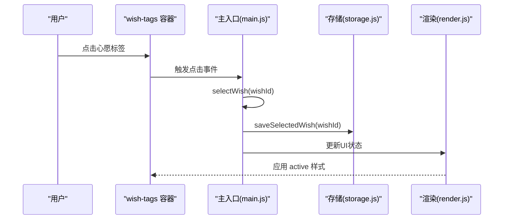
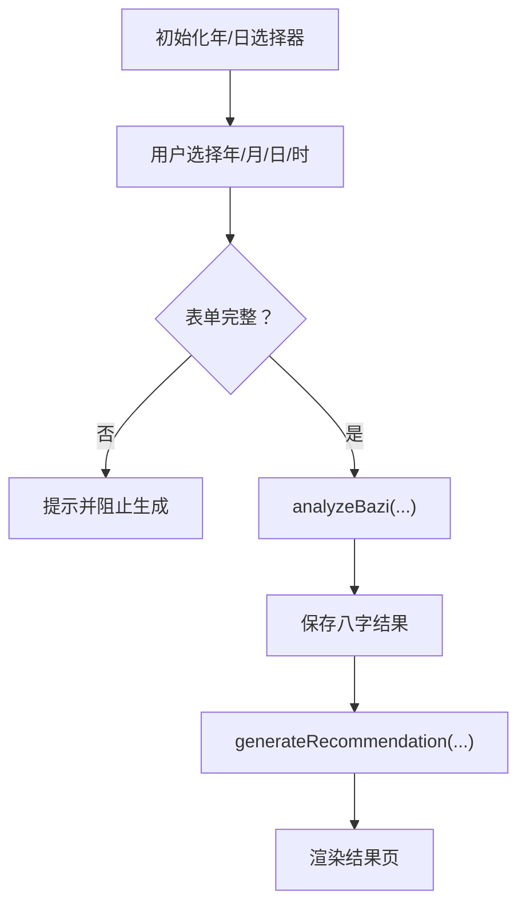
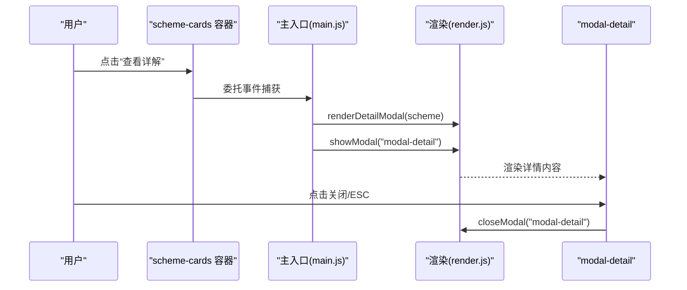
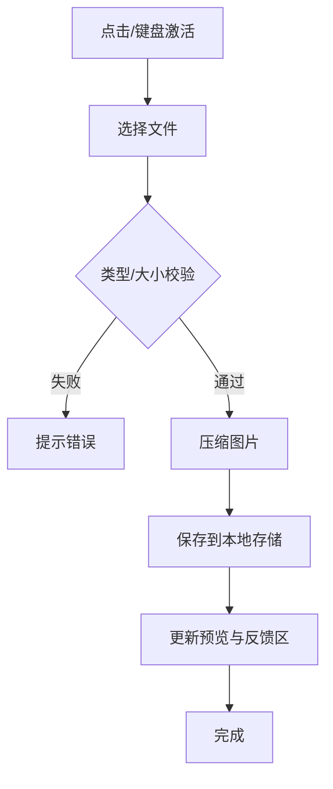
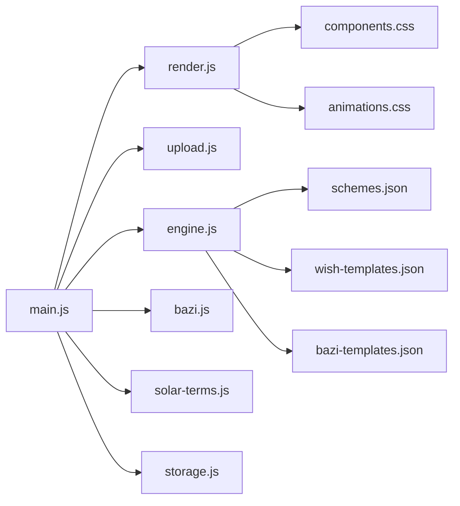

# 交互设计

<cite>
**本文引用的文件列表**
- [index.html](file://index.html)
- [main.js](file://js/main.js)
- [render.js](file://js/render.js)
- [upload.js](file://js/upload.js)
- [bazi.js](file://js/bazi.js)
- [engine.js](file://js/engine.js)
- [solar-terms.js](file://js/solar-terms.js)
- [storage.js](file://js/storage.js)
- [components.css](file://css/components.css)
- [animations.css](file://css/animations.css)
- [schemes.json](file://data/schemes.json)
- [wish-templates.json](file://data/wish-templates.json)
- [bazi-templates.json](file://data/bazi-templates.json)
</cite>

## 目录
1. [简介](#简介)
2. [项目结构](#项目结构)
3. [核心组件](#核心组件)
4. [架构总览](#架构总览)
5. [详细组件分析](#详细组件分析)
6. [依赖关系分析](#依赖关系分析)
7. [性能考虑](#性能考虑)
8. [故障排查指南](#故障排查指南)
9. [结论](#结论)
10. [附录](#附录)

## 简介
本文件面向“五行穿搭建议”项目，提供系统化的交互设计文档。重点覆盖以下方面：
- 视图切换机制（欢迎页→信息输入页→结果页→上传页）的导航逻辑与状态管理
- 心愿选择标签（wish-tags）的单选交互与状态反馈
- 八字输入表单（bazi-form）的动态验证与用户体验优化
- 方案卡片（scheme-cards）的点击交互与详情模态框（modal-detail）的开合动画
- 上传区域（upload-zone）的拖拽上传、文件验证与预览功能
- 按钮组件的悬停、激活与禁用状态样式
- 事件处理机制、动画触发条件、错误状态处理与用户反馈设计
- 无障碍交互支持（Accessibility）、触摸设备适配与性能优化策略

## 项目结构
项目采用模块化前端架构，HTML负责页面骨架与语义角色标注，CSS定义组件与动画，JS分为业务模块（主入口、渲染、上传、引擎、八字、节气、存储），数据以JSON形式提供。

图表来源
- [index.html](file://index.html#L20-L236)
- [main.js](file://js/main.js#L1-L317)
- [render.js](file://js/render.js#L1-L272)
- [upload.js](file://js/upload.js#L1-L145)
- [engine.js](file://js/engine.js#L1-L335)
- [bazi.js](file://js/bazi.js#L1-L193)
- [solar-terms.js](file://js/solar-terms.js#L1-L118)
- [storage.js](file://js/storage.js#L1-L116)
- [components.css](file://css/components.css#L1-L338)
- [animations.css](file://css/animations.css#L1-L207)
- [schemes.json](file://data/schemes.json#L1-L200)
- [wish-templates.json](file://data/wish-templates.json#L1-L47)
- [bazi-templates.json](file://data/bazi-templates.json#L1-L103)

章节来源
- [index.html](file://index.html#L20-L236)
- [main.js](file://js/main.js#L1-L317)

## 核心组件
- 视图容器与导航：四个视图（欢迎、信息输入、结果、上传）通过统一的显示/隐藏机制进行切换，并在切换时触发动画。
- 心愿标签（wish-tags）：单选交互，选中态有视觉反馈与状态持久化。
- 八字表单（bazi-form）：动态验证与提示，表单字段联动与恢复。
- 方案卡片（scheme-cards）：点击“查看详解”按钮打开详情模态框，卡片具有入场动画。
- 上传区域（upload-zone）：点击、键盘激活、拖拽进入/离开/放下，文件类型与大小校验，预览与移除。
- 模态框（modal-detail）：遮罩与内容的开合动画，ESC关闭，点击遮罩关闭。
- 按钮（buttons）：悬停、激活、禁用态样式，波纹效果与过渡。
- Toast反馈：全局消息提示，自动消失。

章节来源
- [index.html](file://index.html#L24-L214)
- [render.js](file://js/render.js#L8-L16)
- [components.css](file://css/components.css#L6-L66)
- [animations.css](file://css/animations.css#L126-L146)

## 架构总览
下图展示从用户交互到数据渲染的关键流程：主入口初始化、事件绑定、业务处理（引擎/八字/节气）、渲染更新与持久化。

图表来源
- [index.html](file://index.html#L32-L123)
- [main.js](file://js/main.js#L72-L153)
- [render.js](file://js/render.js#L8-L16)
- [engine.js](file://js/engine.js#L268-L310)
- [bazi.js](file://js/bazi.js#L182-L192)
- [solar-terms.js](file://js/solar-terms.js#L36-L103)
- [storage.js](file://js/storage.js#L52-L89)

## 详细组件分析

### 视图切换机制与状态管理
- 导航逻辑
  - 欢迎页 → 信息输入页：点击“开始体验”切换视图。
  - 信息输入页 → 欢迎页：点击返回按钮。
  - 结果页 → 信息输入页：点击返回按钮。
  - 结果页 → 上传页：点击“上传穿搭照片”。
  - 上传页 → 结果页：点击返回按钮。
- 状态管理
  - 当前心愿ID、八字结果、推荐结果、当前节气信息等保存在主入口模块的变量中。
  - 页面首次加载时恢复上次选择的心愿与八字表单，统计访问次数。
- 动画与过渡
  - 视图切换使用淡入动画，卡片入场使用“fadeInUp”并带延迟，模态框使用“fadeIn”和“fadeInScale”。

图表来源
- [main.js](file://js/main.js#L26-L67)
- [main.js](file://js/main.js#L72-L153)
- [render.js](file://js/render.js#L8-L16)
- [animations.css](file://css/animations.css#L95-L124)

章节来源
- [main.js](file://js/main.js#L26-L67)
- [main.js](file://js/main.js#L72-L153)
- [render.js](file://js/render.js#L8-L16)
- [animations.css](file://css/animations.css#L95-L124)

### 心愿选择标签（wish-tags）
- 单选交互
  - 点击标签切换其 active 类，同时更新全局心愿ID并持久化。
  - 使用 role="radiogroup" 与 aria-label 提升可访问性。
- 状态反馈
  - 选中态有颜色变化与弹跳动画，未选中态悬停高亮。
- 用户体验
  - 支持键盘激活（回车/空格），便于无障碍操作。

图表来源
- [index.html](file://index.html#L53-L59)
- [main.js](file://js/main.js#L158-L164)
- [storage.js](file://js/storage.js#L109-L115)
- [components.css](file://css/components.css#L67-L88)
- [animations.css](file://css/animations.css#L148-L155)

章节来源
- [index.html](file://index.html#L53-L59)
- [main.js](file://js/main.js#L158-L164)
- [storage.js](file://js/storage.js#L109-L115)
- [components.css](file://css/components.css#L67-L88)
- [animations.css](file://css/animations.css#L148-L155)

### 八字输入表单（bazi-form）
- 表单字段
  - 年、月、日、时四列选择器，日选择器随月变化（由渲染模块初始化）。
- 动态验证
  - 生成时检查是否完整填写，若缺失则提示失败并阻止切换。
- 用户体验优化
  - 年份下拉从 1950 到当前年减 16（至少 16 岁），日选项 1-31。
  - 八字分析结果保存到全局，后续推荐使用。
  - 支持恢复上次输入，减少重复输入成本。

图表来源
- [render.js](file://js/render.js#L21-L50)
- [main.js](file://js/main.js#L181-L197)
- [bazi.js](file://js/bazi.js#L182-L192)
- [engine.js](file://js/engine.js#L268-L310)

章节来源
- [render.js](file://js/render.js#L21-L50)
- [main.js](file://js/main.js#L181-L197)
- [bazi.js](file://js/bazi.js#L182-L192)
- [engine.js](file://js/engine.js#L268-L310)

### 方案卡片（scheme-cards）与详情模态框（modal-detail）
- 点击交互
  - 在卡片容器上委托点击“查看详解”按钮，根据 data-index 定位方案并渲染详情。
- 动画与开合
  - 卡片入场使用 stagger 动画，模态框打开时遮罩与内容分别执行淡入与缩放动画。
- 关闭方式
  - 点击关闭按钮、点击遮罩或按 ESC 键均可关闭。

图表来源
- [index.html](file://index.html#L142-L154)
- [index.html](file://index.html#L199-L214)
- [main.js](file://js/main.js#L125-L152)
- [render.js](file://js/render.js#L159-L193)
- [render.js](file://js/render.js#L198-L215)
- [animations.css](file://css/animations.css#L117-L124)

章节来源
- [index.html](file://index.html#L142-L154)
- [index.html](file://index.html#L199-L214)
- [main.js](file://js/main.js#L125-L152)
- [render.js](file://js/render.js#L159-L193)
- [render.js](file://js/render.js#L198-L215)
- [animations.css](file://css/animations.css#L117-L124)

### 上传区域（upload-zone）
- 交互能力
  - 点击或键盘激活（Enter/Space）触发文件选择。
  - 拖拽进入/离开/放下，拖拽时添加 dragover 样式并播放脉冲动画。
- 文件验证
  - 类型限制（JPG/PNG），大小限制（≤5MB），不符合则提示错误。
- 预览与反馈
  - 成功上传后显示预览图，右侧提供移除按钮；同时显示反馈输入区。
- 性能与可用性
  - 上传前进行压缩，目标大小约 200KB，保证传输效率与存储空间。
  - 支持重复选择同一文件（重置 input 值）。

图表来源
- [upload.js](file://js/upload.js#L87-L136)
- [upload.js](file://js/upload.js#L12-L26)
- [upload.js](file://js/upload.js#L31-L82)
- [render.js](file://js/render.js#L219-L237)
- [storage.js](file://js/storage.js#L79-L89)
- [components.css](file://css/components.css#L155-L223)
- [animations.css](file://css/animations.css#L157-L160)

章节来源
- [upload.js](file://js/upload.js#L87-L136)
- [upload.js](file://js/upload.js#L12-L26)
- [upload.js](file://js/upload.js#L31-L82)
- [render.js](file://js/render.js#L219-L237)
- [storage.js](file://js/storage.js#L79-L89)
- [components.css](file://css/components.css#L155-L223)
- [animations.css](file://css/animations.css#L157-L160)

### 按钮组件（悬停、激活、禁用）
- 样式层次
  - 主要按钮（primary/secondary/ghost）具备统一过渡与悬停态。
  - 激活态（:active）提供缩放与波纹效果，提升触觉反馈。
  - 图标按钮（btn-icon）在 hover 时改变背景色。
- 禁用状态
  - 通过禁用属性或外部控制类实现禁用态（本项目未直接展示禁用按钮，但样式保留）。
- 动画细节
  - 波纹效果通过伪元素实现，激活时放大并扩散。

章节来源
- [components.css](file://css/components.css#L6-L66)
- [animations.css](file://css/animations.css#L126-L146)

### Toast 反馈与错误处理
- 触发时机
  - 上传失败、生成失败、保存反馈为空、换一批无更多推荐等场景。
- 行为特征
  - 自动出现与消失，底部居中，带淡入淡出过渡。
- 可访问性
  - 作为非模态提示，不影响焦点管理；建议配合屏幕阅读器朗读。

章节来源
- [main.js](file://js/main.js#L274-L292)
- [main.js](file://js/main.js#L297-L313)
- [render.js](file://js/render.js#L242-L271)

## 依赖关系分析
- 模块耦合
  - 主入口依赖渲染、上传、引擎、八字、节气、存储模块；渲染模块依赖组件与动画样式。
  - 引擎模块依赖数据文件（方案、心愿模板、八字模板）与节气模块。
- 数据流
  - 节气数据驱动推荐权重；心愿与八字影响方案筛选与得分。
- 外部依赖
  - 通过 fetch 加载 JSON 数据；Canvas 压缩图片；LocalStorage 持久化。

图表来源
- [main.js](file://js/main.js#L5-L15)
- [engine.js](file://js/engine.js#L39-L79)
- [components.css](file://css/components.css#L1-L338)
- [animations.css](file://css/animations.css#L1-L207)

章节来源
- [main.js](file://js/main.js#L5-L15)
- [engine.js](file://js/engine.js#L39-L79)
- [components.css](file://css/components.css#L1-L338)
- [animations.css](file://css/animations.css#L1-L207)

## 性能考虑
- 渲染优化
  - 卡片入场使用 stagger 动画，避免一次性大量动画造成卡顿。
  - 模态框内容滚动容器设置最大高度，防止布局抖动。
- 上传优化
  - Canvas 压缩循环降低质量参数，确保在目标大小以内。
  - 重置 input 值允许重复选择同一文件，避免内存泄漏。
- 数据加载
  - 引擎模块使用 Promise.all 并行加载多份模板数据，减少等待时间。
- 无障碍与性能
  - 响应 reduce-motion，降低动画以保护敏感用户。

章节来源
- [animations.css](file://css/animations.css#L100-L124)
- [animations.css](file://css/animations.css#L197-L207)
- [upload.js](file://js/upload.js#L31-L82)
- [engine.js](file://js/engine.js#L270-L274)

## 故障排查指南
- 生成失败
  - 检查八字表单是否完整；确认网络可访问 data 目录；查看控制台错误。
- 上传失败
  - 确认文件类型与大小；检查 Canvas 压缩过程是否报错；查看本地存储权限。
- 模态框无法关闭
  - 确认 ESC 事件绑定与遮罩点击事件；检查 modal 的 hidden 类是否正确切换。
- 心愿未生效
  - 检查存储键值是否存在；确认 selectWish 是否被调用。

章节来源
- [main.js](file://js/main.js#L202-L244)
- [main.js](file://js/main.js#L274-L292)
- [main.js](file://js/main.js#L148-L152)
- [storage.js](file://js/storage.js#L109-L115)

## 结论
本项目通过清晰的模块划分与一致的交互模式，实现了从信息收集到结果呈现再到用户反馈的完整闭环。组件级的动画与可访问性设计提升了用户体验，同时在性能与数据加载方面做了合理优化。建议持续关注不同设备与系统下的表现，进一步完善手势与键盘导航的细节。

## 附录
- 无障碍要点
  - 使用 aria-label 与 role 属性标识关键控件；提供键盘激活路径；减少不必要的动画。
- 触摸设备适配
  - 按钮与上传区域增大触控面积；拖拽区域提供视觉反馈；避免过小字体与密集点击区域。
- 最佳实践
  - 保持事件委托一致性；统一动画时长与缓动函数；对错误进行明确提示并提供重试路径。