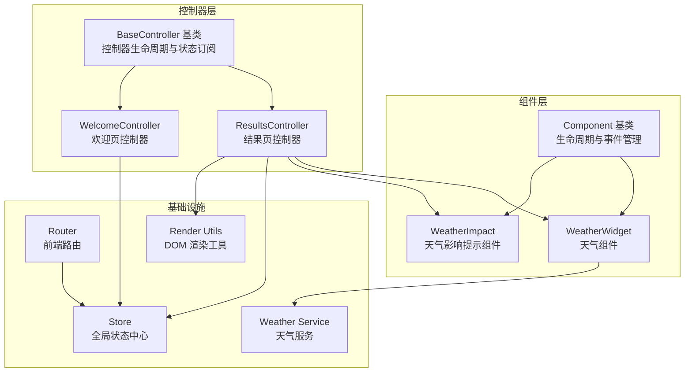
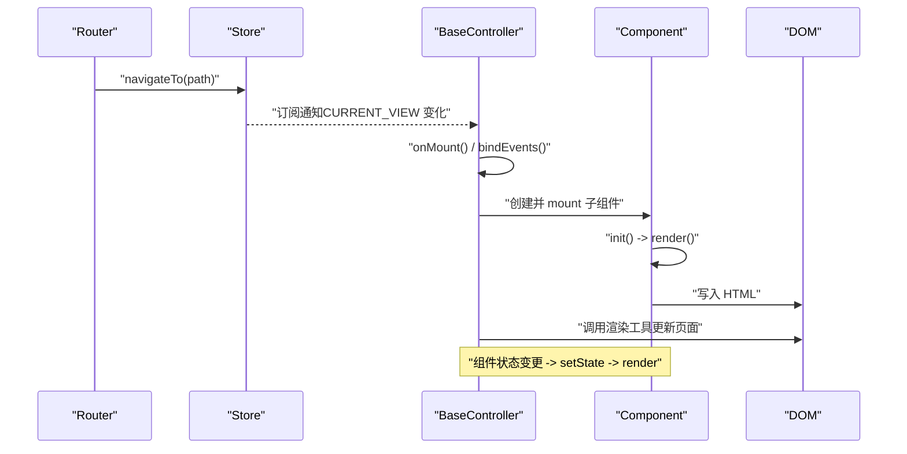
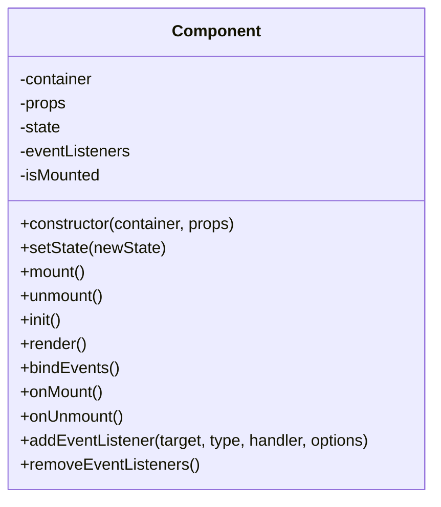
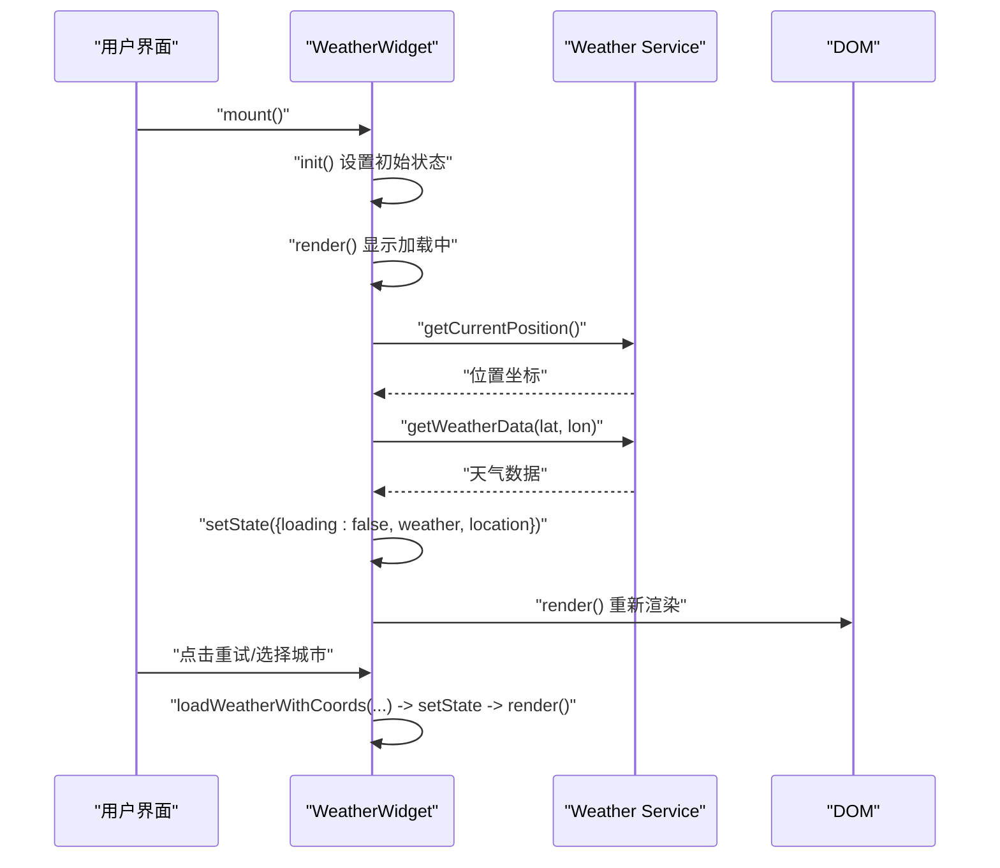
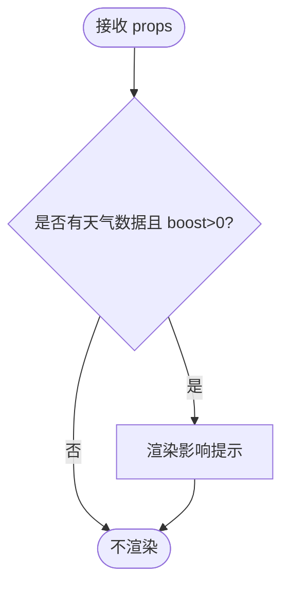
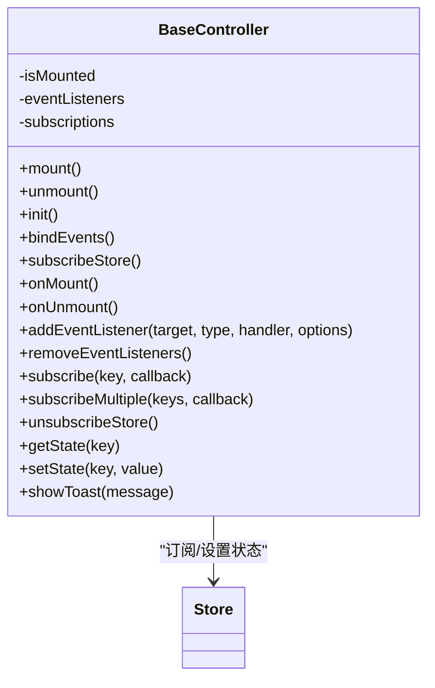
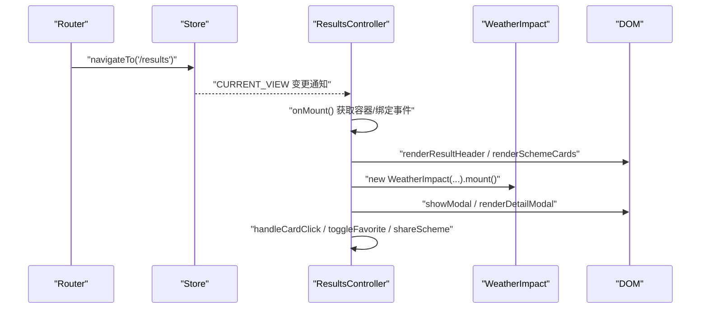
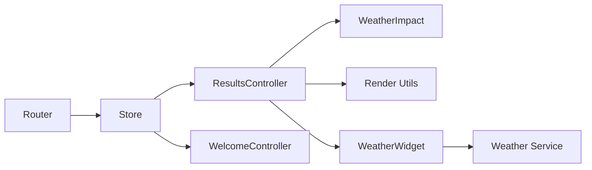

# 基础组件系统

<cite>
**本文引用的文件**
- [js/components/base.js](file://js/components/base.js)
- [js/components/weather-widget.js](file://js/components/weather-widget.js)
- [js/controllers/base.js](file://js/controllers/base.js)
- [js/controllers/results.js](file://js/controllers/results.js)
- [js/controllers/welcome.js](file://js/controllers/welcome.js)
- [js/core/store.js](file://js/core/store.js)
- [js/core/router.js](file://js/core/router.js)
- [js/utils/render.js](file://js/utils/render.js)
- [js/services/weather.js](file://js/services/weather.js)
</cite>

## 目录
1. [简介](#简介)
2. [项目结构](#项目结构)
3. [核心组件](#核心组件)
4. [架构总览](#架构总览)
5. [详细组件分析](#详细组件分析)
6. [依赖关系分析](#依赖关系分析)
7. [性能考量](#性能考量)
8. [故障排查指南](#故障排查指南)
9. [结论](#结论)
10. [附录](#附录)

## 简介
本文件面向“基础组件系统”，系统性解析 Component 基类的设计理念与实现细节，涵盖组件生命周期管理（init、render、mount、unmount）、状态管理（setState 的合并与自动重渲染）、事件管理（addEventListener、removeEventListeners 的自动管理）以及继承与扩展的最佳实践。同时结合项目中的 WeatherWidget 组件与控制器体系，提供可直接参考的使用模式与常见应用场景。

## 项目结构
基础组件系统位于 js/components 目录，配合控制器体系（js/controllers）、全局状态（js/core/store.js）、路由（js/core/router.js）与渲染工具（js/utils/render.js）共同构成前端 UI 与交互骨架。

图表来源
- [js/components/base.js](file://js/components/base.js#L9-L106)
- [js/components/weather-widget.js](file://js/components/weather-widget.js#L12-L194)
- [js/controllers/base.js](file://js/controllers/base.js#L11-L130)
- [js/controllers/results.js](file://js/controllers/results.js#L13-L613)
- [js/controllers/welcome.js](file://js/controllers/welcome.js#L13-L150)
- [js/core/store.js](file://js/core/store.js#L30-L190)
- [js/core/router.js](file://js/core/router.js#L9-L141)
- [js/utils/render.js](file://js/utils/render.js#L13-L486)
- [js/services/weather.js](file://js/services/weather.js#L87-L200)

章节来源
- [js/components/base.js](file://js/components/base.js#L1-L107)
- [js/controllers/base.js](file://js/controllers/base.js#L1-L131)
- [js/core/store.js](file://js/core/store.js#L1-L212)
- [js/core/router.js](file://js/core/router.js#L1-L142)
- [js/utils/render.js](file://js/utils/render.js#L1-L487)
- [js/services/weather.js](file://js/services/weather.js#L1-L340)

## 核心组件
- Component 基类：提供组件生命周期、状态管理与事件自动管理能力，是所有 UI 组件的父类。
- BaseController 基类：提供控制器生命周期、Store 订阅与事件管理能力，是所有页面控制器的父类。
- WeatherWidget：典型组件示例，演示异步加载、状态合并与渲染、事件绑定与卸载清理。
- WeatherImpact：Props 驱动的纯展示组件，演示只读渲染与简单交互。
- ResultsController/WelcomeController：典型控制器示例，演示路由驱动、Store 订阅、事件绑定与页面级渲染。

章节来源
- [js/components/base.js](file://js/components/base.js#L9-L106)
- [js/components/weather-widget.js](file://js/components/weather-widget.js#L12-L194)
- [js/controllers/base.js](file://js/controllers/base.js#L11-L130)
- [js/controllers/results.js](file://js/controllers/results.js#L13-L613)
- [js/controllers/welcome.js](file://js/controllers/welcome.js#L13-L150)

## 架构总览
组件系统采用“组件 + 控制器 + 状态 + 路由”的分层设计：
- 组件层负责局部 UI 与交互，通过 setState 自动触发 render。
- 控制器层负责页面级逻辑、状态订阅与跨组件协调。
- Store 提供全局响应式状态，控制器与组件通过 setState/subscribe 与之交互。
- Router 通过 URL 变化驱动页面切换，同时更新 Store 的当前视图状态。

图表来源
- [js/core/router.js](file://js/core/router.js#L57-L79)
- [js/core/store.js](file://js/core/store.js#L79-L141)
- [js/controllers/base.js](file://js/controllers/base.js#L21-L42)
- [js/components/base.js](file://js/components/base.js#L36-L56)

## 详细组件分析

### Component 基类：生命周期与事件管理
- 生命周期
  - init()：组件初始化钩子，子类可在此设置初始 state。
  - render()：子类必须实现的渲染方法；未实现会抛错。
  - mount()：按顺序执行 init -> render -> bindEvents -> 标记 isMounted -> onMount。
  - unmount()：按顺序执行 onUnmount -> removeEventListeners -> 清空容器 -> 标记非挂载。
- 状态管理
  - setState(newState)：浅合并新状态，若 isMounted 为真则自动调用 render。
- 事件管理
  - addEventListener(target, type, handler, options)：自动记录监听器，便于统一清理。
  - removeEventListeners()：遍历 eventListeners 并逐个移除，防止内存泄漏。

图表来源
- [js/components/base.js](file://js/components/base.js#L9-L106)

章节来源
- [js/components/base.js](file://js/components/base.js#L9-L106)

### WeatherWidget：组件继承与扩展实践
- 继承 Component，覆盖关键方法
  - init()：设置初始 loading、error、weather、location 等状态。
  - render()：根据 state 分支渲染加载、错误、天气详情与预报。
  - bindEvents()：绑定点击重试与城市选择事件。
  - onMount()：首次挂载时异步加载天气数据。
  - loadWeather()/loadWeatherWithCoords()：封装状态更新与异常处理。
- 最佳实践要点
  - 使用 setState 进行细粒度状态更新，避免直接修改 this.state。
  - 在 render 中进行条件渲染，确保 UI 与状态一致。
  - 事件委托与 addEventListener 自动管理，避免重复绑定与内存泄漏。

图表来源
- [js/components/weather-widget.js](file://js/components/weather-widget.js#L13-L194)
- [js/services/weather.js](file://js/services/weather.js#L87-L138)

章节来源
- [js/components/weather-widget.js](file://js/components/weather-widget.js#L12-L194)
- [js/services/weather.js](file://js/services/weather.js#L87-L138)

### WeatherImpact：Props 驱动的只读组件
- 仅实现 render()，根据 props 渲染天气影响提示。
- 适用于在结果页中展示天气对推荐分数的加成效果。

图表来源
- [js/components/weather-widget.js](file://js/components/weather-widget.js#L200-L214)

章节来源
- [js/components/weather-widget.js](file://js/components/weather-widget.js#L200-L214)

### BaseController：控制器生命周期与状态订阅
- 生命周期
  - mount()：init -> subscribeStore -> 标记 isMounted -> onMount -> bindEvents。
  - unmount()：onUnmount -> unsubscribeStore -> removeEventListeners -> 标记非挂载。
- 状态订阅
  - subscribe(key, callback)：订阅 Store 指定键的变化，返回取消订阅函数。
  - subscribeMultiple(keys, callback)：批量订阅。
  - unsubscribeStore()：统一取消所有订阅。
- 事件管理
  - addEventListener/removeEventListeners 与 Component 一致，用于页面级事件绑定。

图表来源
- [js/controllers/base.js](file://js/controllers/base.js#L11-L130)
- [js/core/store.js](file://js/core/store.js#L30-L190)

章节来源
- [js/controllers/base.js](file://js/controllers/base.js#L11-L130)
- [js/core/store.js](file://js/core/store.js#L30-L190)

### ResultsController：页面级控制器示例
- 页面职责
  - 动态获取容器、绑定事件、渲染结果页内容（标题、卡片、运势、天气影响提示、八字提示）。
  - 处理收藏、分享、反馈、详情模态框等交互。
- 与组件协作
  - 使用 WeatherImpact 组件展示天气加成。
  - 通过 render 工具函数更新 DOM。
- 与 Store 协作
  - 通过 getState/subscribe 订阅 CURRENT_RESULT 等状态键。
  - 通过 setState 更新 Store 状态（如 CURRENT_VIEW）。

图表来源
- [js/controllers/results.js](file://js/controllers/results.js#L20-L46)
- [js/controllers/results.js](file://js/controllers/results.js#L217-L233)
- [js/components/weather-widget.js](file://js/components/weather-widget.js#L200-L214)
- [js/utils/render.js](file://js/utils/render.js#L13-L486)
- [js/core/router.js](file://js/core/router.js#L57-L79)

章节来源
- [js/controllers/results.js](file://js/controllers/results.js#L13-L613)
- [js/utils/render.js](file://js/utils/render.js#L13-L486)
- [js/core/router.js](file://js/core/router.js#L57-L79)

### WelcomeController：欢迎页控制器示例
- 页面职责
  - 渲染品牌节气卡片，展示节气图标、名称、描述、宜穿颜色等。
  - 绑定开始按钮导航至入口页。
- 与 Store 协作
  - 通过 getState 获取 CURRENT_TERM_INFO，驱动渲染。

章节来源
- [js/controllers/welcome.js](file://js/controllers/welcome.js#L13-L150)

## 依赖关系分析
- 组件依赖
  - Component 依赖 DOM 容器与事件系统，内部维护 isMounted 与 eventListeners。
  - WeatherWidget 依赖 Weather Service 获取位置与天气数据。
- 控制器依赖
  - BaseController 依赖 Store 进行状态订阅与更新。
  - ResultsController/WelcomeController 依赖 Router 与 Render 工具。
- 数据流
  - Router 更新 Store 的 CURRENT_VIEW，控制器订阅后执行页面级逻辑。
  - 控制器通过 setState 更新业务状态，组件通过 setState 触发局部 UI 更新。

图表来源
- [js/core/router.js](file://js/core/router.js#L57-L79)
- [js/core/store.js](file://js/core/store.js#L79-L141)
- [js/controllers/results.js](file://js/controllers/results.js#L13-L613)
- [js/controllers/welcome.js](file://js/controllers/welcome.js#L13-L150)
- [js/components/weather-widget.js](file://js/components/weather-widget.js#L12-L194)
- [js/utils/render.js](file://js/utils/render.js#L13-L486)
- [js/services/weather.js](file://js/services/weather.js#L87-L138)

章节来源
- [js/core/router.js](file://js/core/router.js#L1-L142)
- [js/core/store.js](file://js/core/store.js#L1-L212)
- [js/controllers/results.js](file://js/controllers/results.js#L1-L614)
- [js/controllers/welcome.js](file://js/controllers/welcome.js#L1-L151)
- [js/components/weather-widget.js](file://js/components/weather-widget.js#L1-L215)
- [js/utils/render.js](file://js/utils/render.js#L1-L487)
- [js/services/weather.js](file://js/services/weather.js#L1-L340)

## 性能考量
- setState 合并与自动重渲染
  - 浅合并策略避免不必要的深度拷贝，但需确保 newState 为对象字面量。
  - 仅在 isMounted 为真时触发 render，避免卸载后无效更新。
- 事件自动管理
  - addEventListener 统一记录监听器，unmount 时 removeEventListeners 清理，防止内存泄漏。
- 渲染优化
  - 在 render 中进行条件渲染，减少 DOM 写入次数。
  - 使用委托事件（ResultsController 对卡片容器绑定 click）降低事件监听数量。
- 异步加载
  - WeatherWidget 在 onMount 中发起异步请求，先渲染加载态，再 setState 触发重渲染，用户体验更友好。

章节来源
- [js/components/base.js](file://js/components/base.js#L26-L56)
- [js/components/weather-widget.js](file://js/components/weather-widget.js#L137-L194)
- [js/controllers/results.js](file://js/controllers/results.js#L308-L359)

## 故障排查指南
- 组件未渲染或报错
  - 确认 render() 方法已实现，否则会抛出错误。
  - 确认 mount() 已调用，且 isMounted 为真时 setState 才会触发 render。
- 事件未生效或重复绑定
  - 使用 addEventListener 自动记录监听器，卸载时 removeEventListeners 会统一清理。
  - 控制器侧避免重复绑定，可使用 eventsBound 标志位控制。
- 状态未更新或未触发重渲染
  - 确保通过 setState 合并状态，而非直接修改 this.state。
  - 确认 isMounted 为真（组件已挂载）。
- 天气组件加载失败
  - 检查地理位置权限与网络访问。
  - 捕获异常并 setState({ error })，让 render 渲染错误提示。

章节来源
- [js/components/base.js](file://js/components/base.js#L66-L83)
- [js/components/base.js](file://js/components/base.js#L92-L105)
- [js/components/weather-widget.js](file://js/components/weather-widget.js#L141-L181)
- [js/controllers/results.js](file://js/controllers/results.js#L308-L359)

## 结论
基础组件系统通过 Component 与 BaseController 提供了清晰的生命周期与事件管理机制，配合 Store 与 Router 形成了“组件局部 UI + 控制器页面逻辑 + 全局状态 + 路由驱动”的完整前端架构。WeatherWidget 与 WeatherImpact 展示了如何在组件内进行状态管理与事件处理，ResultsController/WelcomeController 展示了控制器如何协调组件与状态。遵循本文的最佳实践，可快速构建可维护、可扩展的前端组件体系。

## 附录
- 组件继承与扩展最佳实践
  - 子类覆盖 init() 设置初始状态，覆盖 render() 基于状态渲染，必要时覆盖 bindEvents()/onMount()/onUnmount()。
  - 使用 setState 进行状态更新，避免直接修改 this.state。
  - 使用 addEventListener 绑定事件，确保在 unmount 时被自动清理。
  - 在控制器中通过 subscribe 订阅 Store，通过 setState 更新状态，通过 render 工具更新页面。
- 常见应用场景
  - 动态加载与错误处理：WeatherWidget 示例展示了加载态、错误态与正常态的渲染流程。
  - 页面级交互：ResultsController 展示了收藏、分享、反馈、详情模态框等复杂交互。
  - 节气与运势展示：WelcomeController 展示了基于 Store 的静态渲染与动态更新。